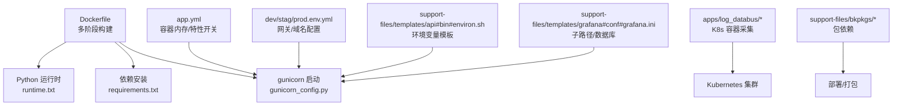
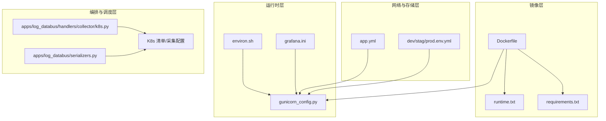
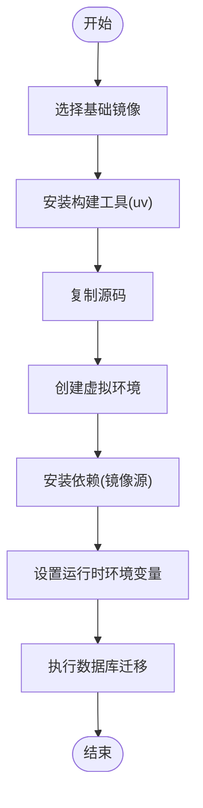
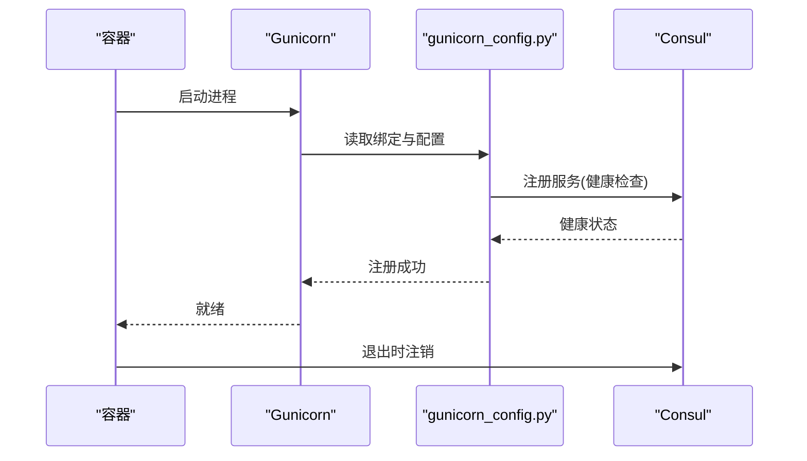
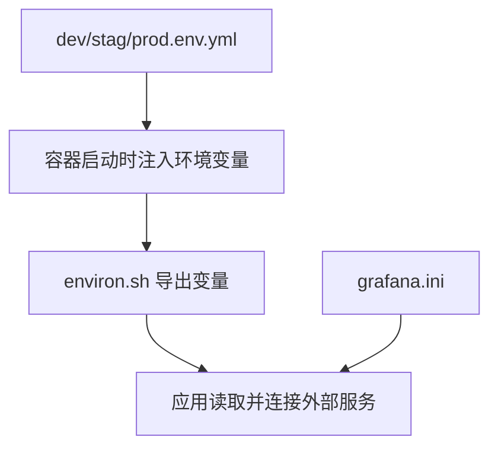
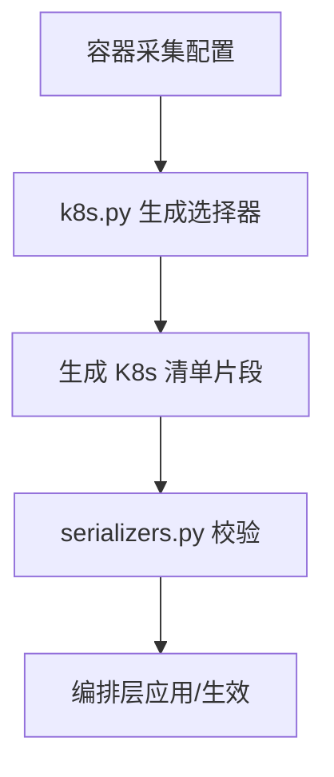
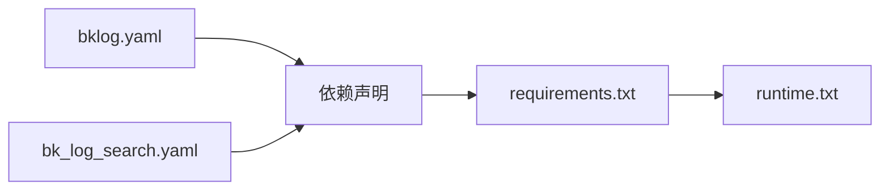

# 容器化部署

<cite>
**本文引用的文件**
- [Dockerfile](file://Dockerfile)
- [app.yml](file://app.yml)
- [dev.env.yml](file://dev.env.yml)
- [prod.env.yml](file://prod.env.yml)
- [stag.env.yml](file://stag.env.yml)
- [requirements.txt](file://requirements.txt)
- [runtime.txt](file://runtime.txt)
- [gunicorn_config.py](file://gunicorn_config.py)
- [support-files/templates/api#bin#environ.sh](file://support-files/templates/api#bin#environ.sh)
- [support-files/templates/grafana#conf#grafana.ini](file://support-files/templates/grafana#conf#grafana.ini)
- [apps/log_databus/handlers/collector/k8s.py](file://apps/log_databus/handlers/collector/k8s.py)
- [apps/log_databus/serializers.py](file://apps/log_databus/serializers.py)
- [support-files/bkpkgs/bklog.yaml](file://support-files/bkpkgs/bklog.yaml)
- [support-files/bkpkgs/bk_log_search.yaml](file://support-files/bkpkgs/bk_log_search.yaml)
</cite>

## 目录
1. [简介](#简介)
2. [项目结构](#项目结构)
3. [核心组件](#核心组件)
4. [架构总览](#架构总览)
5. [详细组件分析](#详细组件分析)
6. [依赖分析](#依赖分析)
7. [性能考虑](#性能考虑)
8. [故障排查指南](#故障排查指南)
9. [结论](#结论)
10. [附录](#附录)

## 简介
本技术文档面向容器化部署场景，系统性说明蓝鲸日志平台（bk-log）的容器镜像构建、容器编排与集群管理、容器间网络通信与数据持久化、服务发现与注册、以及单机/集群/云平台等多场景部署实践。文档以仓库中的现有容器化相关配置与代码为依据，结合实际可落地的流程与最佳实践，帮助读者快速完成从本地到生产环境的容器化迁移。

## 项目结构
围绕容器化部署的关键文件与目录如下：
- 镜像构建与运行
  - Dockerfile：定义多阶段构建与运行时环境
  - runtime.txt：声明 Python 运行时版本
  - requirements.txt：Python 依赖清单
  - gunicorn_config.py：WSGI 应用启动与服务注册配置
- 环境与配置
  - app.yml：应用元数据与容器内存等配置
  - dev/stag/prod.env.yml：不同环境的域名与网关地址配置
  - support-files/templates/api#bin#environ.sh：容器内环境变量模板
  - support-files/templates/grafana#conf#grafana.ini：Grafana 子路径访问与数据库配置
- Kubernetes 与日志采集
  - apps/log_databus/handlers/collector/k8s.py：K8s 容器采集配置生成与校验
  - apps/log_databus/serializers.py：容器采集 YAML 的序列化与校验逻辑
- 包与依赖
  - support-files/bkpkgs/bklog.yaml、support-files/bkpkgs/bk_log_search.yaml：包依赖关系定义

**图表来源**
- [Dockerfile:1-23](file://Dockerfile#L1-L23)
- [runtime.txt:1-2](file://runtime.txt#L1-L2)
- [requirements.txt:1-146](file://requirements.txt#L1-L146)
- [gunicorn_config.py:41-92](file://gunicorn_config.py#L41-L92)
- [app.yml:14-19](file://app.yml#L14-L19)
- [dev.env.yml:57-88](file://dev.env.yml#L57-L88)
- [prod.env.yml:57-87](file://prod.env.yml#L57-L87)
- [stag.env.yml:57-88](file://stag.env.yml#L57-L88)
- [support-files/templates/api#bin#environ.sh:1-67](file://support-files/templates/api#bin#environ.sh#L1-L67)
- [support-files/templates/grafana#conf#grafana.ini:23-42](file://support-files/templates/grafana#conf#grafana.ini#L23-L42)
- [apps/log_databus/handlers/collector/k8s.py:361-420](file://apps/log_databus/handlers/collector/k8s.py#L361-L420)
- [apps/log_databus/serializers.py:1425-1447](file://apps/log_databus/serializers.py#L1425-L1447)
- [support-files/bkpkgs/bklog.yaml:1-19](file://support-files/bkpkgs/bklog.yaml#L1-L19)
- [support-files/bkpkgs/bk_log_search.yaml:1-11](file://support-files/bkpkgs/bk_log_search.yaml#L1-L11)

**章节来源**
- [Dockerfile:1-23](file://Dockerfile#L1-L23)
- [runtime.txt:1-2](file://runtime.txt#L1-L2)
- [requirements.txt:1-146](file://requirements.txt#L1-L146)
- [gunicorn_config.py:41-92](file://gunicorn_config.py#L41-L92)
- [app.yml:14-19](file://app.yml#L14-L19)
- [dev.env.yml:57-88](file://dev.env.yml#L57-L88)
- [prod.env.yml:57-87](file://prod.env.yml#L57-L87)
- [stag.env.yml:57-88](file://stag.env.yml#L57-L88)
- [support-files/templates/api#bin#environ.sh:1-67](file://support-files/templates/api#bin#environ.sh#L1-L67)
- [support-files/templates/grafana#conf#grafana.ini:23-42](file://support-files/templates/grafana#conf#grafana.ini#L23-L42)
- [apps/log_databus/handlers/collector/k8s.py:361-420](file://apps/log_databus/handlers/collector/k8s.py#L361-L420)
- [apps/log_databus/serializers.py:1425-1447](file://apps/log_databus/serializers.py#L1425-L1447)
- [support-files/bkpkgs/bklog.yaml:1-19](file://support-files/bkpkgs/bklog.yaml#L1-L19)
- [support-files/bkpkgs/bk_log_search.yaml:1-11](file://support-files/bkpkgs/bk_log_search.yaml#L1-L11)

## 核心组件
- 镜像构建与运行时
  - 多阶段构建：使用轻量基础镜像与 uv 构建虚拟环境，安装编译依赖后仅保留运行时产物，降低镜像体积与攻击面
  - Python 版本：通过 runtime.txt 明确 Python 版本，确保一致性
  - 依赖安装：requirements.txt 统一声明依赖，配合离线镜像源加速
  - WSGI 启动：gunicorn_config.py 提供绑定地址、工作进程数、超时与请求上限，并集成 Consul 健康检查与服务注册
- 环境与配置
  - app.yml：声明容器内存与启用共享文件系统等特性开关
  - dev/stag/prod.env.yml：集中管理各环境的域名与网关根地址，便于容器内按环境注入
  - environ.sh：容器内环境变量模板，统一导出数据库、Redis、RabbitMQ、BCS 等外部依赖的连接信息
  - grafana.ini：Grafana 子路径访问与数据库连接配置，适配蓝鲸子路径部署
- Kubernetes 与日志采集
  - k8s.py：根据容器采集配置生成 Kubernetes 清单选择器（命名空间、标签、注解、表达式等）
  - serializers.py：对容器采集 YAML 的序列化与校验，保证配置合法性
- 包与依赖
  - bkpkgs：定义包依赖关系，支撑平台级打包与分发

**章节来源**
- [Dockerfile:1-23](file://Dockerfile#L1-L23)
- [runtime.txt:1-2](file://runtime.txt#L1-L2)
- [requirements.txt:1-146](file://requirements.txt#L1-L146)
- [gunicorn_config.py:41-92](file://gunicorn_config.py#L41-L92)
- [app.yml:14-19](file://app.yml#L14-L19)
- [support-files/templates/api#bin#environ.sh:1-67](file://support-files/templates/api#bin#environ.sh#L1-L67)
- [support-files/templates/grafana#conf#grafana.ini:23-42](file://support-files/templates/grafana#conf#grafana.ini#L23-L42)
- [apps/log_databus/handlers/collector/k8s.py:361-420](file://apps/log_databus/handlers/collector/k8s.py#L361-L420)
- [apps/log_databus/serializers.py:1425-1447](file://apps/log_databus/serializers.py#L1425-L1447)
- [support-files/bkpkgs/bklog.yaml:1-19](file://support-files/bkpkgs/bklog.yaml#L1-L19)
- [support-files/bkpkgs/bk_log_search.yaml:1-11](file://support-files/bkpkgs/bk_log_search.yaml#L1-L11)

## 架构总览
容器化部署的整体架构由“镜像层”“运行时层”“网络与存储层”“编排与调度层”构成。镜像层通过 Dockerfile 多阶段构建产出；运行时层以 gunicorn 承载 Django 应用并通过 Consul 实现健康检查与服务注册；网络与存储层通过环境变量模板与子路径配置实现对外部中间件与 Grafana 的访问；编排与调度层通过 Kubernetes 清单与容器采集配置实现容器发现与日志采集。

**图表来源**
- [Dockerfile:1-23](file://Dockerfile#L1-L23)
- [runtime.txt:1-2](file://runtime.txt#L1-L2)
- [requirements.txt:1-146](file://requirements.txt#L1-L146)
- [gunicorn_config.py:41-92](file://gunicorn_config.py#L41-L92)
- [support-files/templates/api#bin#environ.sh:1-67](file://support-files/templates/api#bin#environ.sh#L1-L67)
- [support-files/templates/grafana#conf#grafana.ini:23-42](file://support-files/templates/grafana#conf#grafana.ini#L23-L42)
- [app.yml:14-19](file://app.yml#L14-L19)
- [dev.env.yml:57-88](file://dev.env.yml#L57-L88)
- [stag.env.yml:57-88](file://stag.env.yml#L57-L88)
- [prod.env.yml:57-87](file://prod.env.yml#L57-L87)
- [apps/log_databus/handlers/collector/k8s.py:361-420](file://apps/log_databus/handlers/collector/k8s.py#L361-L420)
- [apps/log_databus/serializers.py:1425-1447](file://apps/log_databus/serializers.py#L1425-L1447)

## 详细组件分析

### Docker 镜像构建与多阶段优化
- 基础镜像与构建工具
  - 使用带 minimal 的操作系统基础镜像，减少初始层体积
  - 引入 uv 工具链，提升依赖安装速度与确定性
- 编译依赖与虚拟环境
  - 安装编译器与开发头文件，满足 Python 扩展编译需求
  - 使用 uv venv 创建隔离虚拟环境，避免系统污染
- 依赖安装与索引源
  - 使用国内镜像源与公网 PyPI 双通道，兼顾速度与稳定性
- 运行时环境变量
  - 设置虚拟环境路径与 Celery 强制 root 行为，确保后台任务可用
- 启动命令
  - 默认执行数据库迁移命令，便于首次启动即完成初始化

**图表来源**
- [Dockerfile:1-23](file://Dockerfile#L1-L23)

**章节来源**
- [Dockerfile:1-23](file://Dockerfile#L1-L23)
- [runtime.txt:1-2](file://runtime.txt#L1-L2)
- [requirements.txt:1-146](file://requirements.txt#L1-L146)

### 容器运行与服务注册（Gunicorn + Consul）
- 绑定地址与端口
  - 从环境变量读取 LAN_IP 与 BKLOG_API_PORT，确保容器网络互通
- 工作进程与请求限制
  - 固定工作进程数量、超时与每进程最大请求数，平衡吞吐与稳定性
- 日志与格式
  - 标准输出接入日志，统一访问日志格式
- Consul 健康检查与服务注册
  - 启动时注册 TCP 健康检查，退出时注销节点，便于编排层自动发现与故障剔除

**图表来源**
- [gunicorn_config.py:41-92](file://gunicorn_config.py#L41-L92)

**章节来源**
- [gunicorn_config.py:41-92](file://gunicorn_config.py#L41-L92)

### 环境变量与配置注入（容器内）
- 环境变量模板
  - environ.sh 统一导出 PaaS 主机、APP 凭证、MySQL、Redis、RabbitMQ、BCS、Grafana 等关键变量
- 环境配置文件
  - dev/stag/prod.env.yml 提供不同环境的域名与网关根地址，便于容器按环境注入
- Grafana 子路径与数据库
  - grafana.ini 支持子路径访问与数据库连接，适配蓝鲸平台部署形态

**图表来源**
- [dev.env.yml:57-88](file://dev.env.yml#L57-L88)
- [stag.env.yml:57-88](file://stag.env.yml#L57-L88)
- [prod.env.yml:57-87](file://prod.env.yml#L57-L87)
- [support-files/templates/api#bin#environ.sh:1-67](file://support-files/templates/api#bin#environ.sh#L1-L67)
- [support-files/templates/grafana#conf#grafana.ini:23-42](file://support-files/templates/grafana#conf#grafana.ini#L23-L42)

**章节来源**
- [support-files/templates/api#bin#environ.sh:1-67](file://support-files/templates/api#bin#environ.sh#L1-L67)
- [support-files/templates/grafana#conf#grafana.ini:23-42](file://support-files/templates/grafana#conf#grafana.ini#L23-L42)
- [dev.env.yml:57-88](file://dev.env.yml#L57-L88)
- [prod.env.yml:57-87](file://prod.env.yml#L57-L87)
- [stag.env.yml:57-88](file://stag.env.yml#L57-L88)

### Kubernetes 容器采集与服务发现
- 清单选择器生成
  - k8s.py 基于容器采集配置生成命名空间、标签、注解与表达式选择器，用于定位目标 Pod
- 配置校验与序列化
  - serializers.py 对容器采集 YAML 进行序列化与校验，确保配置合法
- 与编排层协作
  - 通过选择器与过滤条件，实现容器日志采集与服务发现的自动化

**图表来源**
- [apps/log_databus/handlers/collector/k8s.py:361-420](file://apps/log_databus/handlers/collector/k8s.py#L361-L420)
- [apps/log_databus/serializers.py:1425-1447](file://apps/log_databus/serializers.py#L1425-L1447)

**章节来源**
- [apps/log_databus/handlers/collector/k8s.py:361-420](file://apps/log_databus/handlers/collector/k8s.py#L361-L420)
- [apps/log_databus/serializers.py:1425-1447](file://apps/log_databus/serializers.py#L1425-L1447)

### 部署场景与配置示例（概念性说明）
以下为不同部署场景的容器配置思路（概念性，不对应具体文件）：
- 单机部署
  - 使用 Docker Engine 在单机运行，映射必要端口与数据卷，注入 dev 环境配置
- 集群部署
  - 使用 Kubernetes Deployment/StatefulSet 管理副本与持久化，通过 ConfigMap/Secret 注入环境变量，暴露 Service 与 Ingress
- 云平台部署
  - 在云厂商托管集群中，结合托管负载均衡与托管存储，按需开启弹性伸缩与自动扩缩容策略

[本节为概念性说明，不直接分析具体文件，故无“章节来源”]

## 依赖分析
- 包依赖关系
  - bklog.yaml 与 bk_log_search.yaml 定义了包之间的依赖关系，支撑平台级打包与分发
- 运行时依赖
  - requirements.txt 统一声明 Python 依赖，含 Django、Celery、Redis、Elasticsearch、Kubernetes SDK 等
- 运行时版本
  - runtime.txt 明确 Python 版本，确保镜像与运行时一致

**图表来源**
- [support-files/bkpkgs/bklog.yaml:1-19](file://support-files/bkpkgs/bklog.yaml#L1-L19)
- [support-files/bkpkgs/bk_log_search.yaml:1-11](file://support-files/bkpkgs/bk_log_search.yaml#L1-L11)
- [requirements.txt:1-146](file://requirements.txt#L1-L146)
- [runtime.txt:1-2](file://runtime.txt#L1-L2)

**章节来源**
- [support-files/bkpkgs/bklog.yaml:1-19](file://support-files/bkpkgs/bklog.yaml#L1-L19)
- [support-files/bkpkgs/bk_log_search.yaml:1-11](file://support-files/bkpkgs/bk_log_search.yaml#L1-L11)
- [requirements.txt:1-146](file://requirements.txt#L1-L146)
- [runtime.txt:1-2](file://runtime.txt#L1-L2)

## 性能考虑
- 镜像体积与启动时间
  - 多阶段构建与最小基础镜像有助于减小镜像体积与启动时间
  - 使用 uv 与国内镜像源可显著缩短依赖安装时间
- 应用性能
  - gunicorn 固定工作进程数与请求上限，避免过载
  - 访问日志格式标准化，便于日志聚合与分析
- 网络与存储
  - 通过环境变量模板集中管理外部依赖连接，减少硬编码带来的性能与维护成本
  - Grafana 子路径配置减少反向代理层级，降低延迟

[本节提供通用建议，不直接分析具体文件，故无“章节来源”]

## 故障排查指南
- 启动与注册异常
  - 检查 gunicorn 绑定地址与端口是否正确，确认 Consul 健康检查是否通过
- 环境变量缺失
  - 确认 environ.sh 是否被正确加载，dev/stag/prod.env.yml 是否按环境注入
- 数据库与中间件连接失败
  - 校验 MySQL/Redis/RabbitMQ/BCS 等变量是否完整，网络连通性是否正常
- Grafana 子路径访问异常
  - 检查 grafana.ini 的 root_url 与数据库配置是否与部署形态一致
- 容器采集配置错误
  - 使用 serializers.py 的校验逻辑定位 YAML 配置问题，核对命名空间、标签与表达式

**章节来源**
- [gunicorn_config.py:41-92](file://gunicorn_config.py#L41-L92)
- [support-files/templates/api#bin#environ.sh:1-67](file://support-files/templates/api#bin#environ.sh#L1-L67)
- [support-files/templates/grafana#conf#grafana.ini:23-42](file://support-files/templates/grafana#conf#grafana.ini#L23-L42)
- [apps/log_databus/serializers.py:1425-1447](file://apps/log_databus/serializers.py#L1425-L1447)

## 结论
本项目已具备完善的容器化基础：多阶段构建的 Dockerfile、明确的 Python 运行时版本、统一的依赖管理、Gunicorn 服务注册与 Consul 健康检查、环境变量模板与子路径配置、以及针对 Kubernetes 的容器采集与校验能力。在此基础上，可进一步完善 Docker Compose 与 Kubernetes 清单、监控与日志采集方案、以及多环境的 CI/CD 流水线，以实现从开发到生产的全链路容器化交付。

[本节为总结性内容，不直接分析具体文件，故无“章节来源”]

## 附录
- 关键文件速览
  - 镜像与运行时：Dockerfile、runtime.txt、requirements.txt、gunicorn_config.py
  - 环境与配置：app.yml、dev/stag/prod.env.yml、environ.sh、grafana.ini
  - Kubernetes 与采集：k8s.py、serializers.py
  - 包与依赖：bklog.yaml、bk_log_search.yaml

[本节为概览性内容，不直接分析具体文件，故无“章节来源”]