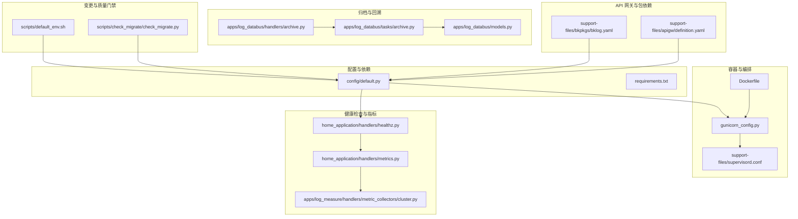
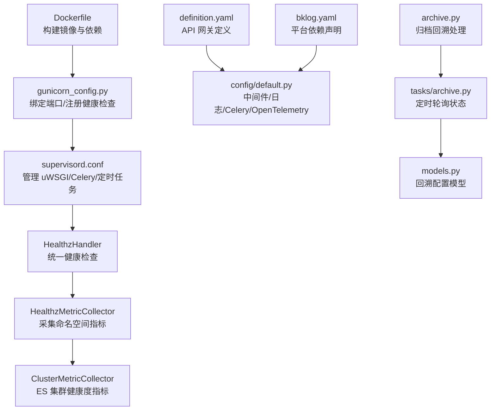
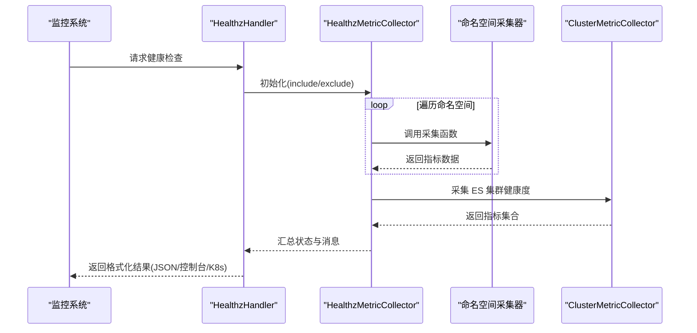
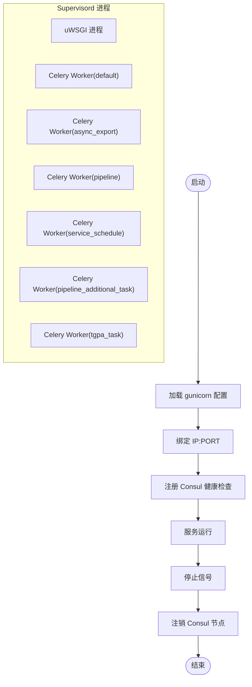
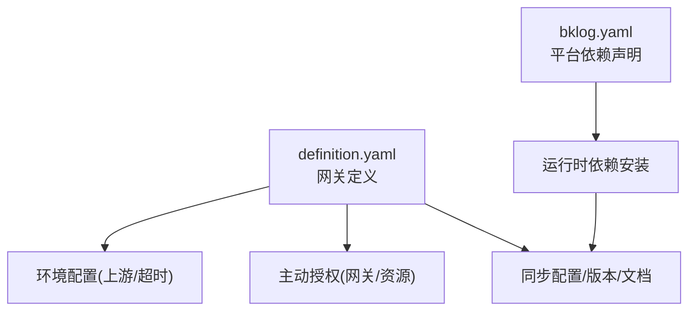
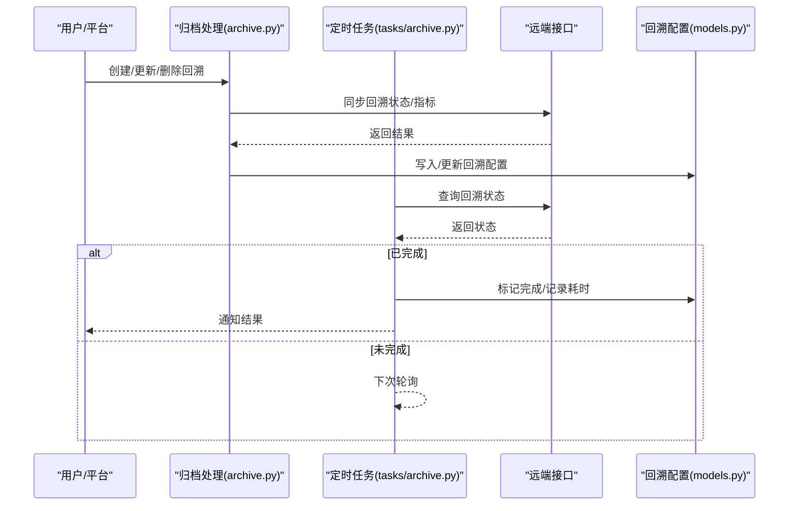
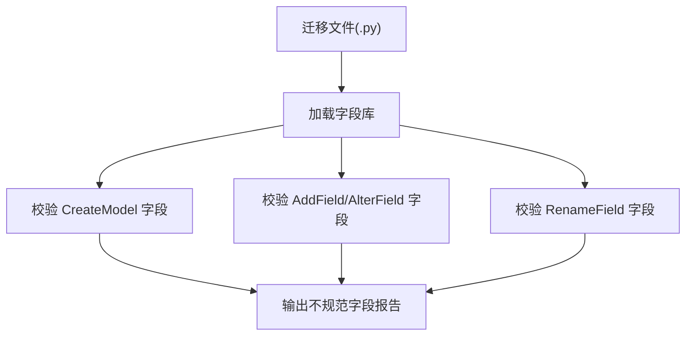
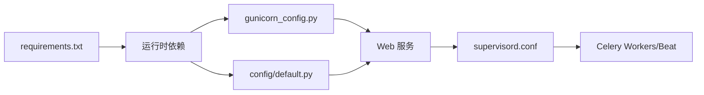

# 运维管理

<cite>
**本文引用的文件**
- [Dockerfile](file://Dockerfile)
- [gunicorn_config.py](file://gunicorn_config.py)
- [supervisord.conf](file://support-files/supervisord.conf)
- [default.py](file://config/default.py)
- [healthz.py](file://home_application/handlers/healthz.py)
- [metrics.py](file://home_application/handlers/metrics.py)
- [cluster.py](file://apps/log_measure/handlers/metric_collectors/cluster.py)
- [bklog.yaml](file://support-files/bkpkgs/bklog.yaml)
- [definition.yaml](file://support-files/apigw/definition.yaml)
- [check_migrate.py](file://scripts/check_migrate/check_migrate.py)
- [default_env.sh](file://scripts/default_env.sh)
- [archive.py](file://apps/log_databus/handlers/archive.py)
- [archive_task.py](file://apps/log_databus/tasks/archive.py)
- [models.py](file://apps/log_databus/models.py)
- [requirements.txt](file://requirements.txt)
</cite>

## 目录
1. [简介](#简介)
2. [项目结构](#项目结构)
3. [核心组件](#核心组件)
4. [架构总览](#架构总览)
5. [详细组件分析](#详细组件分析)
6. [依赖分析](#依赖分析)
7. [性能考虑](#性能考虑)
8. [故障排查指南](#故障排查指南)
9. [结论](#结论)
10. [附录](#附录)

## 简介
本运维文档面向蓝鲸日志平台（bklog）的运维与平台工程团队，系统性梳理日常运维监控体系、发布与回滚流程、变更管理与版本控制、自动化运维工具使用、故障排查方法与实践案例。文档结合代码库中的健康检查、指标采集、服务编排、API 网关配置、归档与回溯机制、容器镜像构建与运行时配置等关键实现，提供可落地的运维实践与可视化图示。

## 项目结构
- 运行时与编排
  - 容器镜像与构建：Dockerfile 定义多阶段构建、虚拟环境与依赖安装流程。
  - Web 服务：gunicorn_config.py 提供进程绑定、注册 Consul 健康检查、优雅退出。
  - 后台任务：supervisord.conf 管理 uWSGI、Celery Worker、定时任务等进程。
- 配置与环境
  - 默认配置：config/default.py 定义中间件、日志、Celery、OpenTelemetry、Grafana、特性开关等。
  - 依赖清单：requirements.txt 管理 Python 依赖版本。
- 健康检查与指标
  - 健康检查：home_application/handlers/healthz.py 与 metrics.py 提供统一健康检查与指标采集框架。
  - 集群指标：apps/log_measure/handlers/metric_collectors/cluster.py 收集 ES 集群健康度等指标。
- API 网关与权限
  - 网关定义：support-files/apigw/definition.yaml 描述网关、环境、授权与资源文档。
  - 包依赖：support-files/bkpkgs/bklog.yaml 定义平台依赖关系。
- 归档与回溯
  - 归档处理：apps/log_databus/handlers/archive.py 与 tasks/archive.py 实现归档回溯状态检查与通知。
  - 数据模型：apps/log_databus/models.py 定义归档回溯相关实体。
- 变更与质量门禁
  - 迁移字段校验：scripts/check_migrate/check_migrate.py 校验模型字段命名规范。
  - 默认环境变量：scripts/default_env.sh 提供默认 Git 仓库地址等环境变量。

**图表来源**
- [Dockerfile:1-23](file://Dockerfile#L1-L23)
- [gunicorn_config.py:41-92](file://gunicorn_config.py#L41-L92)
- [supervisord.conf:16-75](file://support-files/supervisord.conf#L16-L75)
- [default.py:190-236](file://config/default.py#L190-L236)
- [healthz.py:29-120](file://home_application/handlers/healthz.py#L29-L120)
- [metrics.py:39-158](file://home_application/handlers/metrics.py#L39-L158)
- [cluster.py:33-194](file://apps/log_measure/handlers/metric_collectors/cluster.py#L33-L194)
- [definition.yaml:1-138](file://support-files/apigw/definition.yaml#L1-L138)
- [bklog.yaml:1-19](file://support-files/bkpkgs/bklog.yaml#L1-L19)
- [archive.py:303-529](file://apps/log_databus/handlers/archive.py#L303-L529)
- [archive_task.py:50-68](file://apps/log_databus/tasks/archive.py#L50-L68)
- [models.py:631-660](file://apps/log_databus/models.py#L631-L660)
- [check_migrate.py:198-230](file://scripts/check_migrate/check_migrate.py#L198-L230)
- [default_env.sh:1-2](file://scripts/default_env.sh#L1-L2)

**章节来源**
- [Dockerfile:1-23](file://Dockerfile#L1-L23)
- [gunicorn_config.py:41-92](file://gunicorn_config.py#L41-L92)
- [supervisord.conf:16-75](file://support-files/supervisord.conf#L16-L75)
- [default.py:190-236](file://config/default.py#L190-L236)

## 核心组件
- 健康检查与指标采集
  - 健康检查处理器：统一注册与采集命名空间指标，支持 JSON、控制台、K8s 格式输出。
  - 指标采集器：按命名空间收集指标并生成结构化数据，便于外部监控系统消费。
- 集群健康度指标
  - 采集 ES 集群健康状态、分片统计、状态映射等，形成标准指标对象，支持时间过滤与维度标注。
- Web 服务与进程编排
  - gunicorn 配置：绑定 IP/端口、注册 Consul 健康检查、优雅退出。
  - supervisord：管理 uWSGI、Celery Worker 多队列、定时任务等进程。
- API 网关与权限
  - 网关定义：描述网关、环境、上游、授权与资源文档路径。
  - 包依赖：声明平台依赖与版本约束。
- 归档与回溯
  - 归档处理：创建/更新/删除回溯配置，调用远端接口同步状态。
  - 定时任务：每分钟轮询回溯状态，完成后标记并通知。
- 变更与质量门禁
  - 迁移字段校验：基于字段库校验模型字段命名，避免不规范命名。
  - 默认环境变量：提供默认 Git 仓库地址等环境变量模板。

**章节来源**
- [healthz.py:29-120](file://home_application/handlers/healthz.py#L29-L120)
- [metrics.py:39-158](file://home_application/handlers/metrics.py#L39-L158)
- [cluster.py:33-194](file://apps/log_measure/handlers/metric_collectors/cluster.py#L33-L194)
- [gunicorn_config.py:67-92](file://gunicorn_config.py#L67-L92)
- [supervisord.conf:16-75](file://support-files/supervisord.conf#L16-L75)
- [definition.yaml:1-138](file://support-files/apigw/definition.yaml#L1-L138)
- [bklog.yaml:1-19](file://support-files/bkpkgs/bklog.yaml#L1-L19)
- [archive.py:303-529](file://apps/log_databus/handlers/archive.py#L303-L529)
- [archive_task.py:50-68](file://apps/log_databus/tasks/archive.py#L50-L68)
- [check_migrate.py:198-230](file://scripts/check_migrate/check_migrate.py#L198-L230)
- [default_env.sh:1-2](file://scripts/default_env.sh#L1-L2)

## 架构总览
下图展示从容器镜像构建到服务注册、健康检查、指标采集与归档回溯的运维关键路径。

**图表来源**
- [Dockerfile:1-23](file://Dockerfile#L1-L23)
- [gunicorn_config.py:41-92](file://gunicorn_config.py#L41-L92)
- [supervisord.conf:16-75](file://support-files/supervisord.conf#L16-L75)
- [healthz.py:29-120](file://home_application/handlers/healthz.py#L29-L120)
- [metrics.py:103-158](file://home_application/handlers/metrics.py#L103-L158)
- [cluster.py:33-194](file://apps/log_measure/handlers/metric_collectors/cluster.py#L33-L194)
- [definition.yaml:1-138](file://support-files/apigw/definition.yaml#L1-L138)
- [bklog.yaml:1-19](file://support-files/bkpkgs/bklog.yaml#L1-L19)
- [archive.py:303-529](file://apps/log_databus/handlers/archive.py#L303-L529)
- [archive_task.py:50-68](file://apps/log_databus/tasks/archive.py#L50-L68)
- [models.py:631-660](file://apps/log_databus/models.py#L631-L660)

## 详细组件分析

### 健康检查与指标采集
- 组件职责
  - HealthzHandler：按格式输出健康检查结果，支持 JSON、控制台、K8s。
  - HealthzMetricCollector：动态加载注册的指标采集器，聚合命名空间数据，汇总状态与消息。
  - ClusterMetricCollector：采集 ES 集群健康度、分片状态、状态映射等指标，标注业务维度。
- 关键流程
  - 指标注册：通过装饰器注册命名空间指标采集函数。
  - 采集执行：遍历注册的采集器，记录耗时与异常，生成统一数据结构。
  - 输出格式：支持多种格式，便于不同监控系统消费。

**图表来源**
- [healthz.py:29-120](file://home_application/handlers/healthz.py#L29-L120)
- [metrics.py:103-158](file://home_application/handlers/metrics.py#L103-L158)
- [cluster.py:33-194](file://apps/log_measure/handlers/metric_collectors/cluster.py#L33-L194)

**章节来源**
- [healthz.py:29-120](file://home_application/handlers/healthz.py#L29-L120)
- [metrics.py:39-158](file://home_application/handlers/metrics.py#L39-L158)
- [cluster.py:33-194](file://apps/log_measure/handlers/metric_collectors/cluster.py#L33-L194)

### Web 服务与进程编排
- gunicorn 配置要点
  - 绑定 IP 与端口，设置日志格式与超时。
  - 启动时向 Consul 注册服务节点，停止时注销。
- supervisord 进程
  - uWSGI：承载主 API 服务。
  - Celery Workers：多队列处理异步任务（default、celery、async_export、pipeline、service_schedule、pipeline_additional_task、tgpa_task）。
  - 定时任务：周期性检查归档回溯状态并通知。

**图表来源**
- [gunicorn_config.py:67-92](file://gunicorn_config.py#L67-L92)
- [supervisord.conf:16-75](file://support-files/supervisord.conf#L16-L75)

**章节来源**
- [gunicorn_config.py:41-92](file://gunicorn_config.py#L41-L92)
- [supervisord.conf:16-75](file://support-files/supervisord.conf#L16-L75)

### API 网关与权限
- 网关定义
  - 网关基本信息、环境配置、上游主机、授权与资源文档路径。
  - 主动授权：为多个应用授予网关或资源维度权限。
- 包依赖
  - 声明平台依赖与版本约束，确保运行时一致性。

**图表来源**
- [definition.yaml:1-138](file://support-files/apigw/definition.yaml#L1-L138)
- [bklog.yaml:1-19](file://support-files/bkpkgs/bklog.yaml#L1-L19)

**章节来源**
- [definition.yaml:1-138](file://support-files/apigw/definition.yaml#L1-L138)
- [bklog.yaml:1-19](file://support-files/bkpkgs/bklog.yaml#L1-L19)

### 归档与回溯
- 处理流程
  - 创建/更新/删除回溯配置，调用远端接口同步状态与指标。
  - 定时任务每分钟轮询回溯状态，完成后标记并通知。
- 数据模型
  - 回溯配置包含索引集、时间范围、过期时间、完成状态与统计指标。

**图表来源**
- [archive.py:303-529](file://apps/log_databus/handlers/archive.py#L303-L529)
- [archive_task.py:50-68](file://apps/log_databus/tasks/archive.py#L50-L68)
- [models.py:631-660](file://apps/log_databus/models.py#L631-L660)

**章节来源**
- [archive.py:303-529](file://apps/log_databus/handlers/archive.py#L303-L529)
- [archive_task.py:50-68](file://apps/log_databus/tasks/archive.py#L50-L68)
- [models.py:631-660](file://apps/log_databus/models.py#L631-L660)

### 变更与质量门禁
- 迁移字段校验
  - 基于字段库校验模型字段命名，避免不规范命名导致的兼容性问题。
- 默认环境变量
  - 提供默认 Git 仓库地址等环境变量模板，便于本地与 CI 环境复用。

**图表来源**
- [check_migrate.py:198-230](file://scripts/check_migrate/check_migrate.py#L198-L230)

**章节来源**
- [check_migrate.py:198-230](file://scripts/check_migrate/check_migrate.py#L198-L230)
- [default_env.sh:1-2](file://scripts/default_env.sh#L1-L2)

## 依赖分析
- 运行时依赖
  - Django、Celery、Redis、gunicorn、OpenTelemetry、Elasticsearch 客户端、API 网关 SDK 等。
- 配置耦合
  - gunicorn_config.py 与 config/default.py 共同决定服务注册、日志格式、OpenTelemetry 上报等。
- 进程耦合
  - supervisord.conf 与 manage.py 子命令（celery worker/beat）共同构成后台任务体系。

**图表来源**
- [requirements.txt:1-146](file://requirements.txt#L1-L146)
- [gunicorn_config.py:41-92](file://gunicorn_config.py#L41-L92)
- [default.py:190-236](file://config/default.py#L190-L236)
- [supervisord.conf:16-75](file://support-files/supervisord.conf#L16-L75)

**章节来源**
- [requirements.txt:1-146](file://requirements.txt#L1-L146)
- [default.py:190-236](file://config/default.py#L190-L236)

## 性能考虑
- Web 层
  - gunicorn workers 数量与超时、最大请求次数限制影响吞吐与稳定性。
  - 日志格式为 JSON，便于集中采集与检索。
- 指标与监控
  - 健康检查采集器记录耗时，便于定位慢指标。
  - OpenTelemetry 可选开启，支持链路追踪与日志上报。
- 后台任务
  - 多队列并行处理，合理分配队列权重与并发，避免热点队列阻塞。
  - 定时任务轮询频率（如每分钟）应与业务峰值匹配，避免频繁调用远端接口。

[本节为通用指导，无需特定文件引用]

## 故障排查指南
- 健康检查失败
  - 使用 HealthzHandler 的控制台输出查看失败命名空间与建议。
  - 检查各命名空间采集器是否抛出异常，关注日志耗时。
- Web 服务不可达
  - 检查 gunicorn 绑定 IP/端口与防火墙策略。
  - 查看 Consul 注册状态，确认健康检查是否通过。
- 后台任务堆积
  - 检查 supervisord 管理的 Celery Worker 是否正常重启。
  - 关注队列负载与任务耗时，必要时增加并发或拆分队列。
- 归档回溯未完成
  - 查看定时任务轮询状态与远端接口返回，确认回溯配置是否过期。
  - 检查回溯配置模型状态与通知记录。
- API 网关权限问题
  - 核对 definition.yaml 中的授权配置与资源文档路径。
  - 确认应用是否已获得网关或资源维度权限。

**章节来源**
- [healthz.py:89-120](file://home_application/handlers/healthz.py#L89-L120)
- [metrics.py:125-158](file://home_application/handlers/metrics.py#L125-L158)
- [gunicorn_config.py:67-92](file://gunicorn_config.py#L67-L92)
- [supervisord.conf:16-75](file://support-files/supervisord.conf#L16-L75)
- [archive_task.py:50-68](file://apps/log_databus/tasks/archive.py#L50-L68)
- [archive.py:303-529](file://apps/log_databus/handlers/archive.py#L303-L529)
- [definition.yaml:58-121](file://support-files/apigw/definition.yaml#L58-L121)

## 结论
本运维文档基于代码库中的健康检查、指标采集、服务编排、API 网关与归档回溯等实现，提供了从日常监控到发布回滚、变更管理与自动化工具使用的完整运维实践。通过统一的健康检查与指标采集框架、稳定的 Web 服务与进程编排、清晰的 API 网关授权与平台依赖声明，以及完善的归档回溯机制，能够支撑蓝鲸日志平台在生产环境的稳定运行与高效运维。

[本节为总结，无需特定文件引用]

## 附录
- 运维脚本示例与路径
  - 健康检查输出：[healthz.py:29-120](file://home_application/handlers/healthz.py#L29-L120)
  - 指标采集注册与聚合：[metrics.py:39-158](file://home_application/handlers/metrics.py#L39-L158)
  - ES 集群健康度指标：[cluster.py:33-194](file://apps/log_measure/handlers/metric_collectors/cluster.py#L33-L194)
  - Web 服务注册与注销：[gunicorn_config.py:67-92](file://gunicorn_config.py#L67-L92)
  - 进程编排与队列：[supervisord.conf:16-75](file://support-files/supervisord.conf#L16-L75)
  - API 网关定义与授权：[definition.yaml:1-138](file://support-files/apigw/definition.yaml#L1-L138)
  - 平台依赖声明：[bklog.yaml:1-19](file://support-files/bkpkgs/bklog.yaml#L1-L19)
  - 归档回溯处理与定时任务：[archive.py:303-529](file://apps/log_databus/handlers/archive.py#L303-L529)、[archive_task.py:50-68](file://apps/log_databus/tasks/archive.py#L50-L68)
  - 迁移字段校验：[check_migrate.py:198-230](file://scripts/check_migrate/check_migrate.py#L198-L230)
  - 默认环境变量：[default_env.sh:1-2](file://scripts/default_env.sh#L1-L2)
  - 容器镜像构建：[Dockerfile:1-23](file://Dockerfile#L1-L23)
  - 运行时依赖：[requirements.txt:1-146](file://requirements.txt#L1-L146)

[本节为附录，无需特定文件引用]