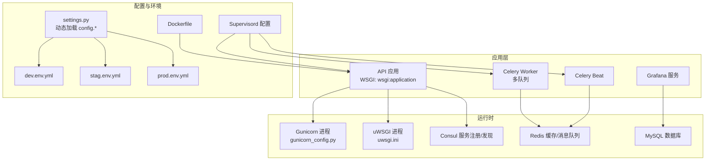
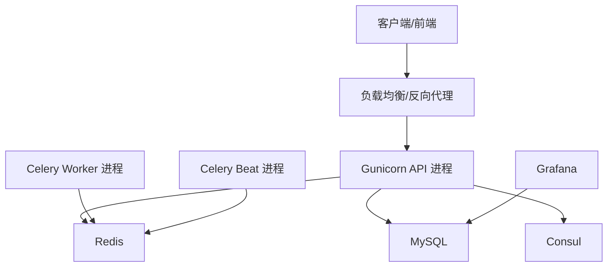
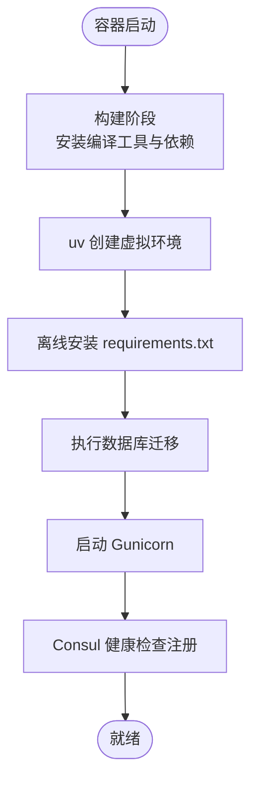
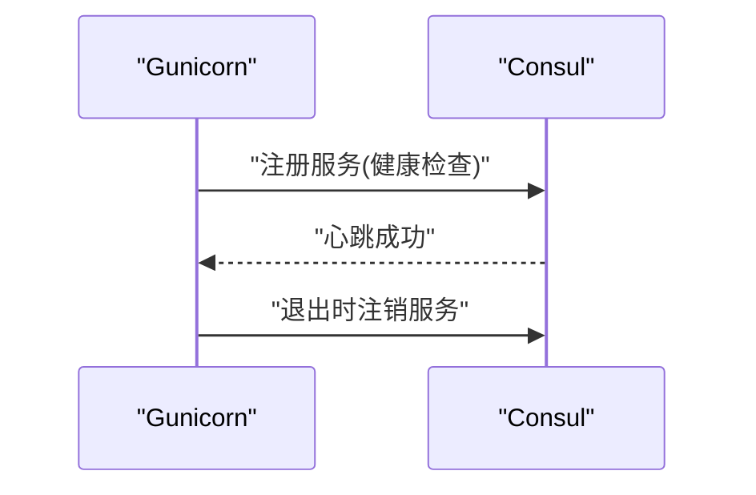
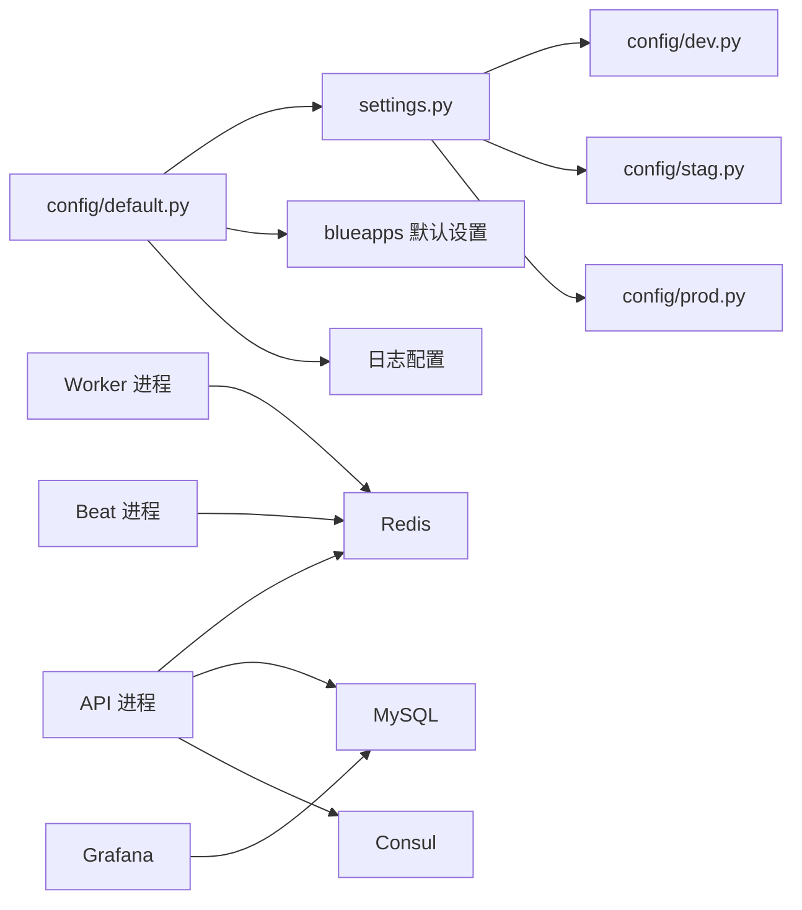

# 部署和运维

<cite>
**本文引用的文件**
- [Dockerfile](file://Dockerfile)
- [app.yml](file://app.yml)
- [prod.env.yml](file://prod.env.yml)
- [dev.env.yml](file://dev.env.yml)
- [stag.env.yml](file://stag.env.yml)
- [requirements.txt](file://requirements.txt)
- [gunicorn_config.py](file://gunicorn_config.py)
- [support-files/uwsgi.ini](file://support-files/uwsgi.ini)
- [settings.py](file://settings.py)
- [config/default.py](file://config/default.py)
- [config/prod.py](file://config/prod.py)
- [config/stag.py](file://config/stag.py)
- [config/dev.py](file://config/dev.py)
- [support-files/supervisord.conf](file://support-files/supervisord.conf)
- [support-files/templates/#etc#supervisor-bklog-api.conf](file://support-files/templates/#etc#supervisor-bklog-api.conf)
- [support-files/templates/grafana#conf#grafana.ini](file://support-files/templates/grafana#conf#grafana.ini)
</cite>

## 目录
1. [简介](#简介)
2. [项目结构](#项目结构)
3. [核心组件](#核心组件)
4. [架构总览](#架构总览)
5. [详细组件分析](#详细组件分析)
6. [依赖关系分析](#依赖关系分析)
7. [性能考量](#性能考量)
8. [故障排查指南](#故障排查指南)
9. [结论](#结论)
10. [附录](#附录)

## 简介
本文件面向生产环境部署与运维，覆盖服务器环境准备、服务配置与网络设置、容器化部署（镜像构建、容器编排与集群管理）、监控体系（健康检查、日志管理与告警）、运维流程（发布、回滚与变更管理）、故障排查（常见问题、性能调优与容量规划），并提供可操作的配置示例与最佳实践。

## 项目结构
该项目为蓝鲸 PaaS 生态下的日志平台子系统，采用 Python/Django 技术栈，结合 Celery 异步任务、Grafana 可视化、Gunicorn/uWSGI 作为 WSGI 服务器，并支持传统 Supervisor 或容器编排（Kubernetes）两种部署形态。关键配置分布在 settings 与 config 子包、Dockerfile、环境变量文件与服务编排模板中。

图表来源
- [settings.py:26-47](file://settings.py#L26-L47)
- [gunicorn_config.py:41-92](file://gunicorn_config.py#L41-L92)
- [support-files/uwsgi.ini:1-35](file://support-files/uwsgi.ini#L1-L35)
- [support-files/supervisord.conf:16-75](file://support-files/supervisord.conf#L16-L75)
- [config/default.py:33-34](file://config/default.py#L33-L34)

章节来源
- [settings.py:26-47](file://settings.py#L26-L47)
- [config/default.py:33-34](file://config/default.py#L33-L34)

## 核心组件
- 应用与进程
  - API 应用：WSGI 入口，由 Gunicorn 或 uWSGI 提供服务。
  - Celery Worker：异步任务执行，多队列隔离（如 default、async_export、pipeline 等）。
  - Celery Beat：定时任务调度。
  - Grafana：可视化与数据源配置。
- 运行时依赖
  - Redis：缓存与消息队列。
  - MySQL：持久化存储。
  - Consul：服务注册与健康检查。
- 配置与环境
  - settings.py 动态选择 config.dev/stag/prod。
  - 环境变量文件 dev/stag/prod 控制域名、网关、文档站点等。
  - Dockerfile 定义镜像构建与运行时入口。
  - Supervisord 配置统一管理 API、Worker、Beat 生命周期。

章节来源
- [gunicorn_config.py:41-92](file://gunicorn_config.py#L41-L92)
- [support-files/uwsgi.ini:1-35](file://support-files/uwsgi.ini#L1-L35)
- [support-files/supervisord.conf:16-75](file://support-files/supervisord.conf#L16-L75)
- [config/default.py:196-232](file://config/default.py#L196-L232)
- [config/prod.py:102-120](file://config/prod.py#L102-L120)
- [config/stag.py:64-83](file://config/stag.py#L64-L83)
- [config/dev.py:43-62](file://config/dev.py#L43-L62)

## 架构总览
下图展示生产环境典型拓扑：API 通过 Gunicorn 暴露，Grafana 通过独立端口提供仪表盘；Celery Worker/Beat 从 Redis 拉取任务；应用连接 MySQL；服务注册与健康检查由 Consul 提供；容器化部署时，Kubernetes 管理 Pod 生命周期与扩缩容。

图表来源
- [gunicorn_config.py:41-92](file://gunicorn_config.py#L41-L92)
- [support-files/supervisord.conf:16-75](file://support-files/supervisord.conf#L16-L75)
- [config/prod.py:106-115](file://config/prod.py#L106-L115)

## 详细组件分析

### 服务器环境准备
- 操作系统与基础软件
  - 基于容器镜像构建，建议使用最小化发行版，确保具备网络连通性与时间同步。
  - 安装并启动 Redis、MySQL、Consul（或使用托管服务）。
- 端口规划
  - API：默认 8000（可通过环境变量覆盖），Gunicorn 绑定 LAN_IP:PORT。
  - Grafana：独立端口，由 grafana.ini 配置。
  - Redis：默认 6379。
  - MySQL：默认 3306。
- 系统资源
  - 至少 4GB 内存（参考应用容器内存配置），CPU 核心数与并发线程按业务峰值评估。

章节来源
- [gunicorn_config.py:41](file://gunicorn_config.py#L41)
- [support-files/templates/grafana#conf#grafana.ini:26-27](file://support-files/templates/grafana#conf#grafana.ini#L26-L27)
- [app.yml:14-18](file://app.yml#L14-L18)

### 服务配置与网络设置
- 环境选择与配置加载
  - settings.py 根据 BKPAAS_ENVIRONMENT 或 BK_ENV 动态加载 config.dev/stag/prod。
  - config/default.py 支持 Kubernetes 部署模式（IS_K8S_DEPLOY_MODE），并提供 JSON 日志格式与 OTLP 上报能力。
- 网关与域名
  - dev/stag/prod 环境变量文件定义各组件 API 网关根地址、文档站点、监控站点等。
- CORS 与安全
  - 预发布环境启用 CORS 允许跨域与凭证传递。
- 数据库
  - 生产环境可直接从环境变量注入数据库连接信息，便于容器编排时注入。

章节来源
- [settings.py:26-47](file://settings.py#L26-L47)
- [config/default.py:33-34](file://config/default.py#L33-L34)
- [config/default.py:290-354](file://config/default.py#L290-L354)
- [config/stag.py:64-83](file://config/stag.py#L64-L83)
- [config/prod.py:102-120](file://config/prod.py#L102-L120)
- [dev.env.yml:57-88](file://dev.env.yml#L57-L88)
- [stag.env.yml:57-88](file://stag.env.yml#L57-L88)
- [prod.env.yml:57-87](file://prod.env.yml#L57-L87)

### 容器化部署
- 镜像构建
  - 使用多阶段构建，安装编译工具与依赖，使用 uv 创建虚拟环境并离线安装 requirements.txt。
  - CMD 在容器启动时执行迁移命令，确保数据库结构就绪。
- 运行时入口
  - 容器内通过 gunicorn 启动 WSGI 应用，绑定 IP 与端口由环境变量控制。
- 容器编排与集群管理
  - 支持 Kubernetes 部署模式（IS_K8S_DEPLOY_MODE），日志输出为 JSON，便于集中收集。
  - 建议使用 Deployment/Service/ConfigMap/Secret 管理 API、Worker、Grafana 与配置。

图表来源
- [Dockerfile:1-23](file://Dockerfile#L1-L23)
- [gunicorn_config.py:67-92](file://gunicorn_config.py#L67-L92)

章节来源
- [Dockerfile:1-23](file://Dockerfile#L1-L23)
- [gunicorn_config.py:41-92](file://gunicorn_config.py#L41-L92)
- [config/default.py:33-34](file://config/default.py#L33-L34)

### 运维监控系统
- 健康检查与服务注册
  - Gunicorn 配置在 when_ready 钩子中通过 Consul TCP 健康检查注册服务节点，退出时自动注销。
- 日志管理
  - 非本地环境采用 JSON 格式日志，支持 OpenTelemetry 字段注入，便于集中采集与检索。
  - Kubernetes 模式下统一使用 stdout 输出，结合日志收集组件完成聚合。
- 告警与可观测性
  - 可选开启 OTLP 日志/追踪上报，配置 GRPC 地址与数据源 ID/Token。
  - Prometheus 指标导出已集成（django_prometheus），可用于监控面板与告警规则。

图表来源
- [gunicorn_config.py:67-92](file://gunicorn_config.py#L67-L92)

章节来源
- [config/default.py:290-354](file://config/default.py#L290-L354)
- [config/default.py:356-368](file://config/default.py#L356-L368)
- [gunicorn_config.py:67-92](file://gunicorn_config.py#L67-L92)

### 运维管理流程
- 发布流程
  - 代码提交后触发 CI 构建镜像并推送至镜像仓库；CD 将新镜像滚动更新至集群。
  - 发布前执行数据库迁移（容器启动时已包含迁移步骤）。
- 回滚策略
  - 通过版本标签与镜像回滚，必要时回退到上一个稳定版本。
  - 若涉及数据库结构变更，应准备逆向迁移脚本。
- 变更管理
  - 通过环境变量文件管理域名、网关、文档站点等配置，避免硬编码。
  - Kubernetes 环境使用 ConfigMap/Secret 管理敏感配置与非敏感配置分离。

章节来源
- [Dockerfile:22-23](file://Dockerfile#L22-L23)
- [app.yml:14-18](file://app.yml#L14-L18)
- [dev.env.yml:1-88](file://dev.env.yml#L1-L88)
- [stag.env.yml:1-88](file://stag.env.yml#L1-L88)
- [prod.env.yml:1-87](file://prod.env.yml#L1-L87)

### 部署配置示例
- 环境变量文件要点
  - dev.env.yml/stag.env.yml/prod.env.yml 定义各环境的域名、API 网关根地址、文档站点、监控站点等。
- Grafana 配置
  - grafana.ini 启用代理认证、子路径访问、禁用登录表单与用户注册，数据库指向 MySQL。
- Supervisor 管理
  - supervisord.conf 统一管理 uWSGI、多个 Celery Worker 队列与 Beat。
  - #etc#supervisor-bklog-api.conf 提供 API 进程的独立 Supervisor 配置。

章节来源
- [dev.env.yml:57-88](file://dev.env.yml#L57-L88)
- [stag.env.yml:57-88](file://stag.env.yml#L57-L88)
- [prod.env.yml:57-87](file://prod.env.yml#L57-L87)
- [support-files/templates/grafana#conf#grafana.ini:1-42](file://support-files/templates/grafana#conf#grafana.ini#L1-L42)
- [support-files/supervisord.conf:16-75](file://support-files/supervisord.conf#L16-L75)
- [support-files/templates/#etc#supervisor-bklog-api.conf:8-20](file://support-files/templates/#etc#supervisor-bklog-api.conf#L8-L20)

## 依赖关系分析
- 应用依赖
  - Django、Celery、Redis、MySQL、OpenTelemetry、Gunicorn/uWSGI、Consul、Kubernetes SDK 等。
- 配置依赖
  - settings.py 依赖 config.dev/stag/prod；config/default.py 依赖 blueapps 默认设置与日志配置。
- 运行时依赖
  - API 进程依赖 Redis 与 MySQL；Worker/Beat 依赖 Redis；Grafana 依赖 MySQL；Consul 提供服务注册。

图表来源
- [settings.py:26-47](file://settings.py#L26-L47)
- [config/default.py:25-31](file://config/default.py#L25-L31)
- [config/dev.py:29-32](file://config/dev.py#L29-L32)
- [config/stag.py:28-31](file://config/stag.py#L28-L31)
- [config/prod.py:27-33](file://config/prod.py#L27-L33)

章节来源
- [requirements.txt:1-146](file://requirements.txt#L1-L146)
- [config/default.py:25-31](file://config/default.py#L25-L31)

## 性能考量
- Web 服务器
  - Gunicorn：合理设置 workers 数量与 max_requests，避免内存泄漏；access_log_format 便于审计与性能分析。
  - uWSGI：启用更细粒度的进程池与更忙阈值，结合 cheaper 算法动态伸缩。
- 异步任务
  - 多队列隔离，避免阻塞；限制单进程任务数（maxtasksperchild）降低内存累积风险。
- 数据库
  - 使用连接重试与连接池；慢查询与锁等待监控，定期维护索引。
- 缓存
  - Redis 作为缓存与队列，注意内存淘汰策略与持久化配置。
- 日志与追踪
  - JSON 日志与 OTLP 上报会带来额外开销，建议在高负载环境按比例采样或分级。

章节来源
- [gunicorn_config.py:41-50](file://gunicorn_config.py#L41-L50)
- [support-files/uwsgi.ini:19-30](file://support-files/uwsgi.ini#L19-L30)
- [config/default.py:196-232](file://config/default.py#L196-L232)
- [config/default.py:290-354](file://config/default.py#L290-L354)

## 故障排查指南
- 健康检查失败
  - 检查 Consul 注册状态与 TCP 健康检查端口是否可达；确认 Gunicorn 绑定 IP/端口正确。
- API 无法访问
  - 核对 LAN_IP/BKLOG_API_PORT 环境变量；确认防火墙放行端口；验证反向代理配置。
- 数据库连接异常
  - 校验 DATABASES 配置与环境变量注入；确认网络连通与账号权限。
- Celery 任务堆积
  - 查看队列长度与 Worker 并发；检查 Redis 连接与磁盘 IO；适当增加 Worker 数量或拆分队列。
- Grafana 无法登录或页面空白
  - 检查 grafana.ini 的代理认证、子路径与数据库配置；确认 MySQL 可达。
- 日志采集与检索异常
  - 检查 JSON 日志格式与 OTLP 上报配置；核对 OpenTelemetry 数据源与索引映射。

章节来源
- [gunicorn_config.py:67-92](file://gunicorn_config.py#L67-L92)
- [support-files/templates/grafana#conf#grafana.ini:1-42](file://support-files/templates/grafana#conf#grafana.ini#L1-L42)
- [config/prod.py:106-115](file://config/prod.py#L106-L115)
- [config/default.py:290-354](file://config/default.py#L290-L354)

## 结论
本项目提供了完善的生产级部署与运维能力：清晰的环境配置、容器化构建与运行、多进程统一管理、可观测性与健康检查、以及可扩展的监控与告警。遵循本文的部署与运维实践，可在保证稳定性的同时提升交付效率与故障恢复速度。

## 附录
- 关键配置清单
  - settings.py：环境选择与模块加载
  - config/default.py：K8s 模式、日志、OTLP、Celery 导入列表
  - config/dev/stag/prod.py：运行模式、CORS、数据库、IAM 等
  - dev/stag/prod.env.yml：域名与网关根地址
  - Dockerfile：镜像构建与迁移入口
  - gunicorn_config.py：Gunicorn 绑定、超时、日志与 Consul 注册
  - support-files/uwsgi.ini：uWSGI 进程与动态伸缩
  - support-files/supervisord.conf：API、Worker、Beat 统一管理
  - support-files/templates/grafana#conf#grafana.ini：Grafana 代理认证与数据库