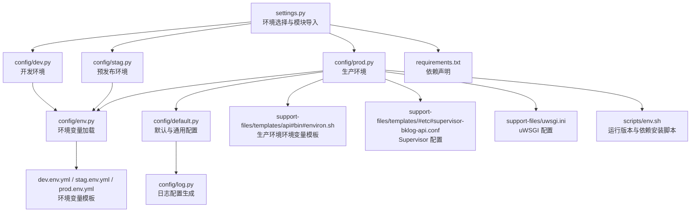
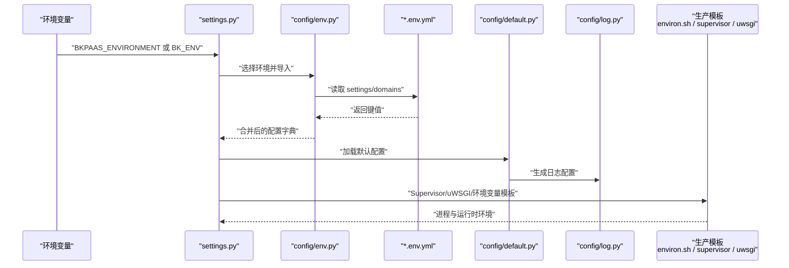
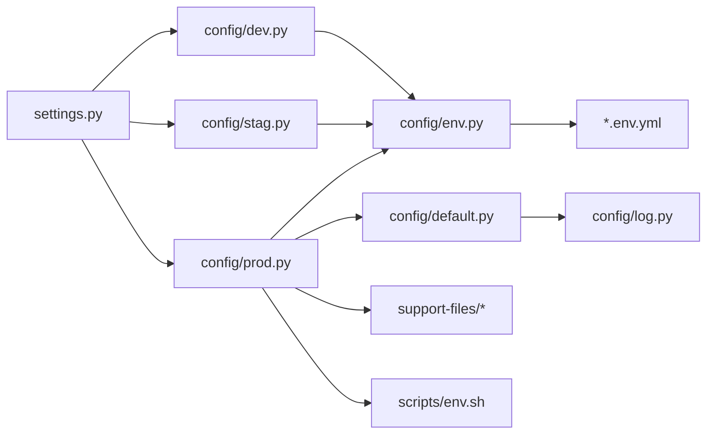

# 部署配置

<cite>
**本文引用的文件**
- [settings.py](file://settings.py)
- [config/default.py](file://config/default.py)
- [config/dev.py](file://config/dev.py)
- [config/stag.py](file://config/stag.py)
- [config/prod.py](file://config/prod.py)
- [config/env.py](file://config/env.py)
- [config/log.py](file://config/log.py)
- [requirements.txt](file://requirements.txt)
- [support-files/templates/api#bin#environ.sh](file://support-files/templates/api#bin#environ.sh)
- [support-files/templates/#etc#supervisor-bklog-api.conf](file://support-files/templates/#etc#supervisor-bklog-api.conf)
- [support-files/uwsgi.ini](file://support-files/uwsgi.ini)
- [scripts/env.sh](file://scripts/env.sh)
- [dev.env.yml](file://dev.env.yml)
- [stag.env.yml](file://stag.env.yml)
- [prod.env.yml](file://prod.env.yml)
</cite>

## 目录
1. [简介](#简介)
2. [项目结构](#项目结构)
3. [核心组件](#核心组件)
4. [架构总览](#架构总览)
5. [详细组件分析](#详细组件分析)
6. [依赖分析](#依赖分析)
7. [性能考虑](#性能考虑)
8. [故障排查指南](#故障排查指南)
9. [结论](#结论)
10. [附录](#附录)

## 简介
本文件面向生产环境部署工程师与运维人员，系统性说明蓝鲸日志平台（bk-log）的部署配置要点，覆盖服务器环境准备、Python 环境与依赖安装、配置文件结构与参数、环境变量配置、不同环境（开发/测试/生产）差异对比，以及可操作的最佳实践与排障建议。文档所有技术细节均来自仓库内现有配置与脚本，确保可落地执行。

## 项目结构
与部署配置直接相关的目录与文件包括：
- 配置加载入口与环境选择：settings.py
- 环境配置模块：config/dev.py、config/stag.py、config/prod.py
- 默认配置与通用设置：config/default.py
- 环境变量加载与格式化：config/env.py
- 日志配置生成：config/log.py
- 依赖声明：requirements.txt
- 生产环境部署模板：support-files/templates/*
- 部署辅助脚本：scripts/env.sh
- 环境变量模板：*.env.yml

图表来源
- [settings.py:26-47](file://settings.py#L26-L47)
- [config/dev.py:29-112](file://config/dev.py#L29-L112)
- [config/stag.py:28-105](file://config/stag.py#L28-L105)
- [config/prod.py:30-120](file://config/prod.py#L30-L120)
- [config/default.py:22-1381](file://config/default.py#L22-L1381)
- [config/env.py:28-113](file://config/env.py#L28-L113)
- [config/log.py:22-157](file://config/log.py#L22-L157)
- [requirements.txt:1-146](file://requirements.txt#L1-L146)
- [support-files/templates/api#bin#environ.sh:1-67](file://support-files/templates/api#bin#environ.sh#L1-L67)
- [support-files/templates/#etc#supervisor-bklog-api.conf:1-31](file://support-files/templates/#etc#supervisor-bklog-api.conf#L1-L31)
- [support-files/uwsgi.ini:1-35](file://support-files/uwsgi.ini#L1-L35)
- [scripts/env.sh:1-53](file://scripts/env.sh#L1-L53)

章节来源
- [settings.py:26-47](file://settings.py#L26-L47)
- [config/env.py:28-113](file://config/env.py#L28-L113)

## 核心组件
- 环境选择与模块导入：settings.py 根据环境变量选择具体配置模块并导入。
- 环境配置模块：dev/stag/prod 分别定义各环境的运行模式、日志级别、CORS、数据库与中间件等差异化配置。
- 默认配置与通用设置：default.py 定义默认应用、中间件、Celery、加密、日志、ESB/APIGW、权限等通用配置。
- 环境变量加载：env.py 支持从 *.env.yml 动态加载 settings 与 domains，并支持字符串格式化与 FEATURE_TOGGLE 合并。
- 日志配置：log.py 生成标准日志配置，支持 JSON 输出、UDP/OTLP 上报等可选能力。
- 依赖声明：requirements.txt 明确 Python 包依赖，含 Django、Celery、ES 客户端、OpenTelemetry、蓝鲸生态组件等。
- 生产部署模板：提供环境变量模板、Supervisor 与 uWSGI 配置样例，便于容器或物理机部署。

章节来源
- [config/default.py:22-1381](file://config/default.py#L22-L1381)
- [config/dev.py:29-112](file://config/dev.py#L29-L112)
- [config/stag.py:28-105](file://config/stag.py#L28-L105)
- [config/prod.py:30-120](file://config/prod.py#L30-L120)
- [config/env.py:28-113](file://config/env.py#L28-L113)
- [config/log.py:22-157](file://config/log.py#L22-L157)
- [requirements.txt:1-146](file://requirements.txt#L1-L146)

## 架构总览
下图展示部署配置在运行期的关键交互：settings.py 决定加载哪个环境模块；env.py 从 *.env.yml 读取并格式化变量；default.py 提供默认行为；log.py 生成日志配置；生产环境通过模板文件完成环境变量注入与进程管理。

图表来源
- [settings.py:26-47](file://settings.py#L26-L47)
- [config/env.py:85-113](file://config/env.py#L85-L113)
- [config/default.py:273-368](file://config/default.py#L273-L368)
- [config/log.py:22-157](file://config/log.py#L22-L157)
- [support-files/templates/api#bin#environ.sh:1-67](file://support-files/templates/api#bin#environ.sh#L1-L67)
- [support-files/templates/#etc#supervisor-bklog-api.conf:1-31](file://support-files/templates/#etc#supervisor-bklog-api.conf#L1-L31)
- [support-files/uwsgi.ini:1-35](file://support-files/uwsgi.ini#L1-L35)

## 详细组件分析

### 环境选择与模块导入（settings.py）
- 依据 BKPAAS_ENVIRONMENT 或 BK_ENV 判断运行环境，动态导入 config.dev、config.stag、config.prod。
- 将模块中的大写常量全部注入到最终 settings。

章节来源
- [settings.py:26-47](file://settings.py#L26-L47)

### 环境变量加载与格式化（config/env.py）
- 支持从 dev.env.yml / stag.env.yml / prod.env.yml 读取 settings 与 domains。
- 支持字符串格式化，允许 settings.domains 中引用 settings 与 env。
- FEATURE_TOGGLE 与 settings 字典合并，实现默认值与环境覆盖的叠加。

章节来源
- [config/env.py:28-113](file://config/env.py#L28-L113)

### 默认配置与通用设置（config/default.py）
- 应用与中间件：内置大量蓝鲸生态与业务应用，支持按需启用/禁用。
- Celery：开关、并发、序列化、任务导入清单等。
- 加密：BKCRYPTO 对称加密类型与密钥配置。
- 日志：支持本地与 Kubernetes 模式下的日志格式与处理器，可选 OTLP/UDP 上报。
- OpenTelemetry：OTLP Trace/日志上报配置项。
- APIGW/IAM/ESB：网关、权限中心、组件 API 地址模板与同步开关。
- Grafana：集成与权限类配置。
- 特性开关：FEATURE_TOGGLE 汇总，如采集、第三方 ES、脱敏、trace 等。

章节来源
- [config/default.py:33-95](file://config/default.py#L33-L95)
- [config/default.py:196-236](file://config/default.py#L196-L236)
- [config/default.py:237-260](file://config/default.py#L237-L260)
- [config/default.py:273-368](file://config/default.py#L273-L368)
- [config/default.py:364-368](file://config/default.py#L364-L368)
- [config/default.py:373-424](file://config/default.py#L373-L424)
- [config/default.py:444-456](file://config/default.py#L444-L456)
- [config/default.py:584-610](file://config/default.py#L584-L610)
- [config/default.py:616-800](file://config/default.py#L616-L800)

### 日志配置生成（config/log.py）
- 本地与非本地（PaaS/容器）采用不同日志输出格式与落盘路径。
- 支持 JSON 格式、轮转、备份数量等。
- 可选 UDP 与 OTLP 日志上报处理器，统一注入到各 logger。

章节来源
- [config/log.py:22-157](file://config/log.py#L22-L157)

### 开发/测试/生产环境差异
- 开发环境（dev.py）
  - 运行模式 DEVELOP，DEBUG=True。
  - 默认 Broker 使用 Redis（本地），数据库默认指向本地 MySQL。
  - GRAFANA 配置从环境变量读取。
  - 通过 env.py 合并 *.env.yml 中的 settings 与 domains。
- 预发布环境（stag.py）
  - 运行模式 STAGING，CORS 允许跨域。
  - 日志级别可通过环境变量控制。
  - GRAFANA 配置从环境变量读取。
  - 通过 env.py 合并 *.env.yml。
- 生产环境（prod.py）
  - 运行模式 PRODUCT，CSRF Cookie 名称定制。
  - 日志级别默认 ERROR，可通过环境变量覆盖。
  - 在 Kubernetes 部署模式下，数据库连接从环境变量注入。
  - 通过 env.py 合并 *.env.yml。

章节来源
- [config/dev.py:34-112](file://config/dev.py#L34-L112)
- [config/stag.py:33-105](file://config/stag.py#L33-L105)
- [config/prod.py:35-120](file://config/prod.py#L35-L120)

### 环境变量配置方法
- 环境变量模板
  - 生产环境模板：support-files/templates/api#bin#environ.sh 提供 PaaS/MySQL/IAM/Redis/RabbitMQ 等变量示例。
  - 环境变量文件：dev.env.yml / stag.env.yml / prod.env.yml 定义 settings 与 domains 的占位与默认值。
- 加载机制
  - settings.py 选择环境模块 → config/env.py 读取对应 .env.yml → 合并 settings 与 domains。
- 关键变量类别
  - 运行版本与环境：BKPAAS_ENVIRONMENT、BK_ENV、RUN_MODE。
  - 数据库：DB_NAME、DB_USERNAME、DB_PASSWORD、DB_HOST、DB_PORT。
  - 日志：LOG_LEVEL、BKPAAS_LOG_NAME_PREFIX、BKAPP_UDP_LOG、BKAPP_OTLP_LOG 等。
  - API 网关与权限：BKAPP_APIGW_NAME、BKAPP_API_URL_TMPL、BKAPP_SYNC_APIGATEWAY_ENABLED、BKAPP_IAM_*。
  - Grafana：BKAPP_GRAFANA_URL、BKAPP_GRAFANA_PREFIX、BKAPP_GRAFANA_ADMIN_USERNAME/PASSWORD。
  - Redis：BK_BKLOG_REDIS_HOST/PORT/MODE/PASSWORD、Sentinel 主从配置。
  - RabbitMQ：RABBITMQ_VHOST/HOST/PORT/USER/PASSWORD。
  - OpenTelemetry：BKAPP_OTLP_TRACE、BKAPP_OTLP_GRPC_HOST、BKAPP_OTLP_BK_DATA_ID/TOKEN。

章节来源
- [support-files/templates/api#bin#environ.sh:1-67](file://support-files/templates/api#bin#environ.sh#L1-L67)
- [dev.env.yml:1-88](file://dev.env.yml#L1-L88)
- [stag.env.yml:1-88](file://stag.env.yml#L1-L88)
- [prod.env.yml:1-87](file://prod.env.yml#L1-L87)
- [config/env.py:74-113](file://config/env.py#L74-L113)

### 部署模板与进程管理
- Supervisor
  - support-files/templates/#etc#supervisor-bklog-api.conf 定义进程启动命令、日志路径、自动重启等。
- uWSGI
  - support-files/uwsgi.ini 提供 socket、cheaper 策略、workers、缓冲区等参数。
- 环境变量注入
  - 生产模板 environ.sh 中导出 DJANGO_SETTINGS_MODULE、APP_ID/TOKEN、DB_*、CONSUL_*、IAM_*、Redis、RabbitMQ 等。

章节来源
- [support-files/templates/#etc#supervisor-bklog-api.conf:1-31](file://support-files/templates/#etc#supervisor-bklog-api.conf#L1-L31)
- [support-files/uwsgi.ini:1-35](file://support-files/uwsgi.ini#L1-L35)
- [support-files/templates/api#bin#environ.sh:1-67](file://support-files/templates/api#bin#environ.sh#L1-L67)

### 依赖包安装
- requirements.txt 声明 Django、Celery、Redis、ES 客户端、OpenTelemetry、蓝鲸生态组件等。
- 运行版本切换与依赖安装脚本：scripts/env.sh 支持 open/ieod/tencent 三种运行版本，自动安装依赖并注册 pre-commit。

章节来源
- [requirements.txt:1-146](file://requirements.txt#L1-L146)
- [scripts/env.sh:1-53](file://scripts/env.sh#L1-L53)

## 依赖分析
- settings.py 依赖 config/* 模块与 config/env.py 的环境变量加载。
- config/dev/stag/prod 依赖 config/default.py 与 config/env.py。
- config/log.py 由 config/default.py 调用生成日志配置。
- 生产部署依赖 support-files 模板与 scripts/env.sh。

图表来源
- [settings.py:26-47](file://settings.py#L26-L47)
- [config/dev.py:29-112](file://config/dev.py#L29-L112)
- [config/stag.py:28-105](file://config/stag.py#L28-L105)
- [config/prod.py:30-120](file://config/prod.py#L30-L120)
- [config/env.py:28-113](file://config/env.py#L28-L113)
- [config/default.py:273-368](file://config/default.py#L273-L368)
- [config/log.py:22-157](file://config/log.py#L22-L157)
- [support-files/templates/api#bin#environ.sh:1-67](file://support-files/templates/api#bin#environ.sh#L1-L67)
- [support-files/templates/#etc#supervisor-bklog-api.conf:1-31](file://support-files/templates/#etc#supervisor-bklog-api.conf#L1-L31)
- [support-files/uwsgi.ini:1-35](file://support-files/uwsgi.ini#L1-L35)
- [scripts/env.sh:1-53](file://scripts/env.sh#L1-L53)

## 性能考虑
- 日志级别
  - 生产环境默认 ERROR，建议通过环境变量 LOG_LEVEL 调整，避免过量 IO。
- Celery 并发
  - 通过环境变量 BK_CELERYD_CONCURRENCY 控制 worker 并发度，结合 CPU/内存资源评估。
- OpenTelemetry
  - OTLP 上报会引入额外开销，仅在需要时开启并合理配置数据采样。
- Web 服务器
  - uWSGI 提供更细粒度的进程与线程控制，建议结合业务峰值 QPS 调整 workers 与 cheaper 策略。

## 故障排查指南
- 环境变量未生效
  - 检查 settings.py 是否正确识别 BKPAAS_ENVIRONMENT/BK_ENV。
  - 确认 config/env.py 已成功读取对应 .env.yml，且格式化占位符已替换。
- 数据库连接失败
  - 确认 prod 环境在 Kubernetes 模式下通过环境变量注入 DB_*。
  - 校验 MySQL 用户、密码、网络连通性与权限。
- 日志异常
  - 检查 LOG_LEVEL 与日志目录权限。
  - 如启用 OTLP/UDP，确认目标服务可达与 Token 配置正确。
- 进程管理
  - 查看 Supervisor 日志与 PID 文件路径是否正确。
  - 确认 environ.sh 中 DJANGO_SETTINGS_MODULE 与 Python 路径已正确导出。

章节来源
- [settings.py:26-47](file://settings.py#L26-L47)
- [config/env.py:74-113](file://config/env.py#L74-L113)
- [config/prod.py:102-120](file://config/prod.py#L102-L120)
- [config/log.py:135-157](file://config/log.py#L135-L157)
- [support-files/templates/#etc#supervisor-bklog-api.conf:1-31](file://support-files/templates/#etc#supervisor-bklog-api.conf#L1-L31)
- [support-files/templates/api#bin#environ.sh:14-27](file://support-files/templates/api#bin#environ.sh#L14-L27)

## 结论
本部署配置体系以 settings.py 为核心入口，结合 config/env.py 的 *.env.yml 动态加载与 config/default.py 的默认行为，形成可扩展、可维护的多环境配置方案。生产环境通过模板文件与脚本完成环境变量注入与进程管理，配合 requirements.txt 的依赖声明，可快速落地部署。建议在生产环境中严格控制日志级别与 OTLP 上报，合理配置 Celery 并发与 uWSGI 参数，确保稳定性与可观测性。

## 附录

### 不同环境配置差异对比
- 运行模式
  - 开发：DEVELOP，DEBUG=True。
  - 预发布：STAGING，CORS 允许跨域。
  - 生产：PRODUCT，CSRF Cookie 名称定制。
- 日志级别
  - 开发：未强制限制，可按需调整。
  - 预发布：可通过环境变量 LOG_LEVEL 控制。
  - 生产：默认 ERROR，可通过环境变量覆盖。
- 数据库
  - 开发：本地 MySQL。
  - 预发布：可按需配置。
  - 生产：Kubernetes 模式下从环境变量注入 DB_*。
- 中间件与 CORS
  - 预发布：启用 CORS 中间件。
  - 开发/生产：按默认配置或按需启用。

章节来源
- [config/dev.py:34-68](file://config/dev.py#L34-L68)
- [config/stag.py:33-70](file://config/stag.py#L33-L70)
- [config/prod.py:35-67](file://config/prod.py#L35-L67)

### 关键配置项与环境变量清单
- 运行与日志
  - RUN_MODE、LOG_LEVEL、BKPAAS_LOG_NAME_PREFIX、BKAPP_OTLP_LOG、BKAPP_UDP_LOG
- 数据库
  - DB_NAME、DB_USERNAME、DB_PASSWORD、DB_HOST、DB_PORT
- API 网关与权限
  - BKAPP_APIGW_NAME、BKAPP_API_URL_TMPL、BKAPP_SYNC_APIGATEWAY_ENABLED、BKAPP_IAM_*
- Grafana
  - BKAPP_GRAFANA_URL、BKAPP_GRAFANA_PREFIX、BKAPP_GRAFANA_ADMIN_USERNAME/PASSWORD
- Redis
  - BK_BKLOG_REDIS_HOST/PORT/MODE/PASSWORD、Sentinel 主从配置
- RabbitMQ
  - RABBITMQ_VHOST/HOST/PORT/USER/PASSWORD
- OpenTelemetry
  - BKAPP_OTLP_TRACE、BKAPP_OTLP_GRPC_HOST、BKAPP_OTLP_BK_DATA_ID/TOKEN

章节来源
- [config/dev.py:43-80](file://config/dev.py#L43-L80)
- [config/stag.py:64-83](file://config/stag.py#L64-L83)
- [config/prod.py:38-79](file://config/prod.py#L38-L79)
- [support-files/templates/api#bin#environ.sh:14-66](file://support-files/templates/api#bin#environ.sh#L14-L66)
- [config/default.py:273-368](file://config/default.py#L273-L368)