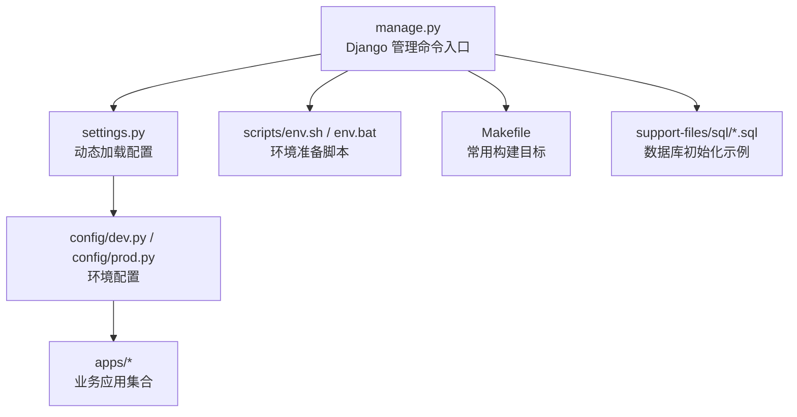
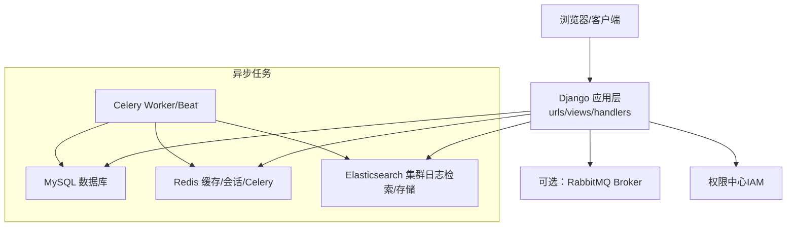
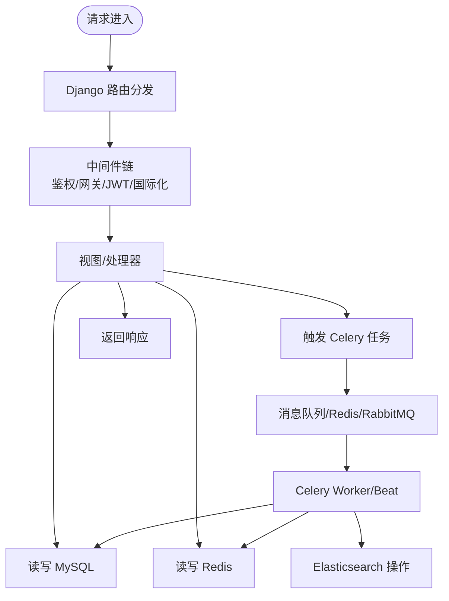
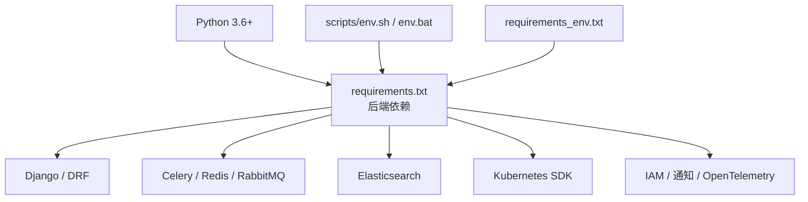

# 快速开始

<cite>
**本文引用的文件**
- [README.md](file://README.md)
- [requirements.txt](file://requirements.txt)
- [settings.py](file://settings.py)
- [manage.py](file://manage.py)
- [config/default.py](file://config/default.py)
- [config/dev.py](file://config/dev.py)
- [config/prod.py](file://config/prod.py)
- [scripts/env.sh](file://scripts/env.sh)
- [scripts/env.bat](file://scripts/env.bat)
- [Makefile](file://Makefile)
- [support-files/sql/0001_grafana_20201113-0000_mysql.sql](file://support-files/sql/0001_grafana_20201113-0000_mysql.sql)
- [scripts/unit_test.sh](file://scripts/unit_test.sh)
</cite>

## 目录
1. [简介](#简介)
2. [项目结构](#项目结构)
3. [核心组件](#核心组件)
4. [架构总览](#架构总览)
5. [详细组件分析](#详细组件分析)
6. [依赖分析](#依赖分析)
7. [性能考虑](#性能考虑)
8. [故障排查指南](#故障排查指南)
9. [结论](#结论)
10. [附录](#附录)

## 简介
本指南面向首次接触 BK Monitor（蓝鲸日志平台，简称 BK-LOG）的开发者，提供从零开始的环境准备、数据库与依赖安装、配置与初始化、一键启动与常用命令、常见问题排查以及安装成功验证的完整流程，帮助你在最短时间内运行起完整的日志平台系统。

## 项目结构
- 项目采用 Django 应用分层组织，核心功能分布在 apps/* 子模块中，配置集中在 config/*，并通过 settings.py 动态加载不同环境配置。
- 关键启动入口：
  - Python 管理命令入口：manage.py
  - Django 配置入口：settings.py（根据环境变量动态选择 config/{dev,stag,prod}）
- 构建与运行辅助：
  - scripts/*：环境切换、依赖安装、测试脚本
  - Makefile：常用构建与测试目标
  - support-files/sql/*：数据库初始化脚本（示例）

图表来源
- [manage.py:1-31](file://manage.py#L1-L31)
- [settings.py:24-47](file://settings.py#L24-L47)
- [config/dev.py:34-112](file://config/dev.py#L34-L112)
- [config/prod.py:35-120](file://config/prod.py#L35-L120)

章节来源
- [manage.py:25-31](file://manage.py#L25-L31)
- [settings.py:24-47](file://settings.py#L24-L47)
- [config/dev.py:34-112](file://config/dev.py#L34-L112)
- [config/prod.py:35-120](file://config/prod.py#L35-L120)

## 核心组件
- Django 配置加载机制：settings.py 根据环境变量自动选择 config/{dev,stag,prod}，并导入 blueapps 默认配置与日志、Celery、权限、国际化等通用设置。
- 应用清单与中间件：config/default.py 定义了 INSTALLED_APPS 与 MIDDLEWARE，涵盖日志检索、采集、审计、聚类、提取、仪表盘、IAM 权限、Celery 等模块。
- 数据库与缓存：默认使用 MySQL 作为主数据库；Redis 用于缓存与 Celery；RabbitMQ 可选作为 Celery Broker（开发环境示例使用 Redis）。
- API 网关与权限：内置 ApiGateway/JWT 中间件与权限后端，结合 IAM 系统实现统一鉴权。
- 前端构建：README 提供了前端构建命令，需在 web 目录执行 npm install 与 npm run build。

章节来源
- [settings.py:24-47](file://settings.py#L24-L47)
- [config/default.py:54-95](file://config/default.py#L54-L95)
- [config/default.py:113-154](file://config/default.py#L113-L154)
- [config/dev.py:50-80](file://config/dev.py#L50-L80)
- [README.md:38-76](file://README.md#L38-L76)

## 架构总览
下图展示了从浏览器到后端服务、数据库与消息队列的整体交互关系，以及 Celery 异步任务的处理路径。

图表来源
- [config/default.py:192-236](file://config/default.py#L192-L236)
- [config/dev.py:43-80](file://config/dev.py#L43-L80)
- [requirements.txt:10-15](file://requirements.txt#L10-L15)

章节来源
- [config/default.py:192-236](file://config/default.py#L192-L236)
- [config/dev.py:43-80](file://config/dev.py#L43-L80)
- [requirements.txt:10-15](file://requirements.txt#L10-L15)

## 详细组件分析

### 环境准备与依赖安装
- Python 与虚拟环境
  - 建议使用 Python 3.6+，并为多项目开发创建独立虚拟环境。
  - Windows 用户可使用 scripts/env.bat 切换运行版本并安装依赖。
  - Linux/macOS 用户可使用 scripts/env.sh 完成相同流程。
- 依赖安装
  - 通过 requirements.txt 安装所有后端依赖，包含 Django、REST Framework、Celery、Redis、ES 客户端、Kafka、IAM、通知、OpenTelemetry 等。
  - 通过 Makefile 的 build-web 目标构建前端（需先在 web 目录执行 npm install 与 npm run build）。
- 环境变量
  - README 提供了关键环境变量示例（APP_ID、BK_IAM_V3_INNER_HOST、BK_PAAS_HOST、APP_TOKEN 等），请根据实际蓝鲸 PaaS 环境配置。

章节来源
- [README.md:38-76](file://README.md#L38-L76)
- [requirements.txt:1-146](file://requirements.txt#L1-L146)
- [scripts/env.sh:1-53](file://scripts/env.sh#L1-L53)
- [scripts/env.bat:1-51](file://scripts/env.bat#L1-L51)
- [Makefile:4-5](file://Makefile#L4-L5)

### 数据库设置与初始化
- 数据库准备
  - README 提示创建数据库（例如：bk_log），字符集为 utf8/utf8_general_ci。
  - config/dev.py 中提供了本地开发数据库示例配置（默认使用 APP_CODE 作为 NAME）。
  - config/prod.py 支持 Kubernetes 部署模式下的外部数据库配置（通过环境变量注入）。
- Grafana 数据库
  - support-files/sql/0001_grafana_20201113-0000_mysql.sql 提供了创建 bklog_grafana 数据库的示例脚本。
- 初始化步骤
  - 在 config/ 下创建 local_settings.py（或使用 config/dev.py 的 local_settings.py 机制），填入数据库连接信息。
  - 执行 Django migrate 完成模型迁移（通过 manage.py 执行）。

章节来源
- [README.md:38-54](file://README.md#L38-L54)
- [config/dev.py:50-67](file://config/dev.py#L50-L67)
- [config/prod.py:102-115](file://config/prod.py#L102-L115)
- [support-files/sql/0001_grafana_20201113-0000_mysql.sql:1-2](file://support-files/sql/0001_grafana_20201113-0000_mysql.sql#L1-L2)

### 配置文件修改与环境选择
- settings.py 会根据环境变量 BKPAAS_ENVIRONMENT 或 BK_ENV 决定加载 config/dev.py、config/stag.py 或 config/prod.py。
- config/default.py 中定义了默认的应用清单、中间件、日志、Celery 导入任务、加密配置、OTLP 上报、Grafana 配置、国际化与权限等。
- config/dev.py 提供了本地开发的数据库、Broker、IAM、Grafana 示例配置，并支持 local_settings.py 覆盖。

章节来源
- [settings.py:24-47](file://settings.py#L24-L47)
- [config/default.py:54-95](file://config/default.py#L54-L95)
- [config/default.py:273-368](file://config/default.py#L273-L368)
- [config/dev.py:34-112](file://config/dev.py#L34-L112)

### 一键启动与常用命令
- 启动 Django 开发服务器
  - 使用 manage.py runserver 启动后端服务。
- 启动 Celery
  - 使用 celery -A worker -l info -c 8 启动工作进程。
- 构建前端
  - 使用 Makefile 的 build-web 目标或在 web 目录执行 npm install 与 npm run build。
- 其他常用命令
  - 测试：scripts/unit_test.sh 或 manage.py test apps.tests --keepdb
  - 国际化：Makefile 的 translate 目标
  - 删除过期加密库：Makefile 的 del_py_crypto 目标

章节来源
- [README.md:74-75](file://README.md#L74-L75)
- [Makefile:1-19](file://Makefile#L1-L19)
- [scripts/unit_test.sh:1-19](file://scripts/unit_test.sh#L1-L19)

### 数据流与处理逻辑（概念示意）
以下流程图展示从请求进入、路由分发、权限校验、到数据库与异步任务处理的关键节点。

图表来源
- [config/default.py:113-154](file://config/default.py#L113-L154)
- [config/default.py:192-236](file://config/default.py#L192-L236)

## 依赖分析
- Python 与包管理
  - setuptools、Django、djangorestframework、celery、redis、elasticsearch、kafka、kubernetes、opentelemetry、blueapps 等。
- 运行时依赖
  - MySQL（数据库）、Redis（缓存/会话/Celery）、可选 RabbitMQ（Celery Broker）、ES 集群（日志检索/存储）。
- 环境差异
  - scripts/env.sh/env.bat 根据运行版本 open/ieod/tencent 切换依赖与环境变量。
  - requirements_env.txt 用于按站点/环境补充依赖（当前为空，需按需填写）。

图表来源
- [requirements.txt:1-146](file://requirements.txt#L1-L146)
- [scripts/env.sh:29-53](file://scripts/env.sh#L29-L53)
- [scripts/env.bat:32-51](file://scripts/env.bat#L32-L51)
- [requirements_env.txt:1-2](file://requirements_env.txt#L1-L2)

章节来源
- [requirements.txt:1-146](file://requirements.txt#L1-L146)
- [scripts/env.sh:29-53](file://scripts/env.sh#L29-L53)
- [scripts/env.bat:32-51](file://scripts/env.bat#L32-L51)
- [requirements_env.txt:1-2](file://requirements_env.txt#L1-L2)

## 性能考虑
- 日志格式与输出
  - config/default.py 支持 JSON 日志格式与 OTLP 日志/链路上报，便于在容器化环境下集中采集与分析。
- Celery 并发与序列化
  - 通过环境变量控制并发度；任务序列化使用 pickle，注意安全与兼容性。
- 缓存与会话
  - 开发环境使用缓存会话，生产环境可按需调整；Redis 用于缓存与 Celery。

章节来源
- [config/default.py:273-368](file://config/default.py#L273-L368)
- [config/default.py:192-210](file://config/default.py#L192-L210)
- [config/dev.py:43-48](file://config/dev.py#L43-L48)

## 故障排查指南
- Python 环境版本不匹配
  - 现象：脚本报错提示 Python 版本不匹配。
  - 处理：使用 scripts/env.sh/env.bat 指定 open/ieod/tencent 版本，确保 pip --version 输出包含对应标识。
- 依赖安装失败
  - 现象：pip install -r requirements.txt 报错。
  - 处理：确认网络可达，必要时使用国内镜像源；检查 setuptools 版本与系统依赖。
- 数据库连接异常
  - 现象：迁移或启动时报数据库错误。
  - 处理：检查 config/local_settings.py 或 config/dev.py 中 DATABASES 配置；确认数据库已创建且字符集正确。
- Celery 启动无响应
  - 现象：celery worker/beat 未消费任务。
  - 处理：确认 Broker 配置（Redis/RabbitMQ）可用；核对 Celery 导入任务列表与队列名称。
- 前端构建失败
  - 现象：npm install/npm run build 报错。
  - 处理：在 web 目录执行，确保 Node.js 版本满足要求；清理 node_modules 后重试。
- 权限与网关认证问题
  - 现象：接口返回 401/403。
  - 处理：检查环境变量（APP_ID、APP_TOKEN、BK_IAM_*、BK_PAAS_HOST）与 ApiGateway/JWT 配置。

章节来源
- [scripts/env.sh:16-26](file://scripts/env.sh#L16-L26)
- [scripts/env.bat:14-30](file://scripts/env.bat#L14-L30)
- [config/dev.py:50-67](file://config/dev.py#L50-L67)
- [config/default.py:192-236](file://config/default.py#L192-L236)
- [README.md:56-72](file://README.md#L56-L72)

## 结论
按照本指南完成 Python 环境与依赖安装、数据库初始化、配置文件修改与环境变量设置后，即可通过 manage.py 与 Celery 启动后端服务与异步任务，并在浏览器中访问前端页面。遇到问题时，可依据“故障排查指南”逐项定位与修复。完成上述步骤后，你将拥有一个可运行的日志平台基础环境。

## 附录

### 一键启动与常用命令清单
- 启动后端服务：python manage.py runserver 8000
- 启动 Celery：celery -A worker -l info -c 8
- 构建前端：make build-web 或在 web 目录执行 npm install 与 npm run build
- 运行单元测试：make unittest 或 scripts/unit_test.sh
- 国际化：make translate
- 删除过期加密库：make del_py_crypto

章节来源
- [README.md:74-75](file://README.md#L74-L75)
- [Makefile:1-19](file://Makefile#L1-L19)
- [scripts/unit_test.sh:1-19](file://scripts/unit_test.sh#L1-L19)

### 安装成功验证清单
- 后端服务
  - 访问 http://127.0.0.1:8000/admin/（或对应域名）可进入管理后台。
  - 访问接口文档（Swagger/Django REST Framework）确认接口可用。
- 数据库
  - 确认数据库存在且可连接；迁移后表结构正常。
- Celery
  - 启动 Celery Worker/Beat，观察日志输出；执行简单任务验证队列消费。
- 前端
  - 前端构建产物生成，页面可正常加载。
- 权限与网关
  - 使用正确的 APP_ID/APP_TOKEN 与 BK_IAM_* 环境变量，接口返回鉴权成功。

章节来源
- [README.md:74-75](file://README.md#L74-L75)
- [config/dev.py:50-80](file://config/dev.py#L50-L80)
- [config/default.py:192-236](file://config/default.py#L192-L236)