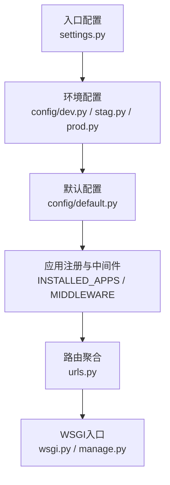
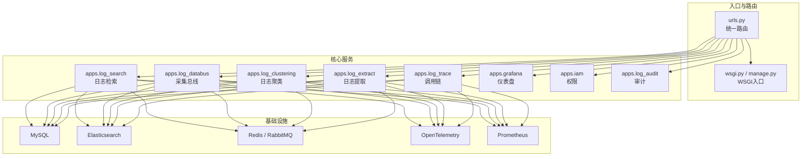
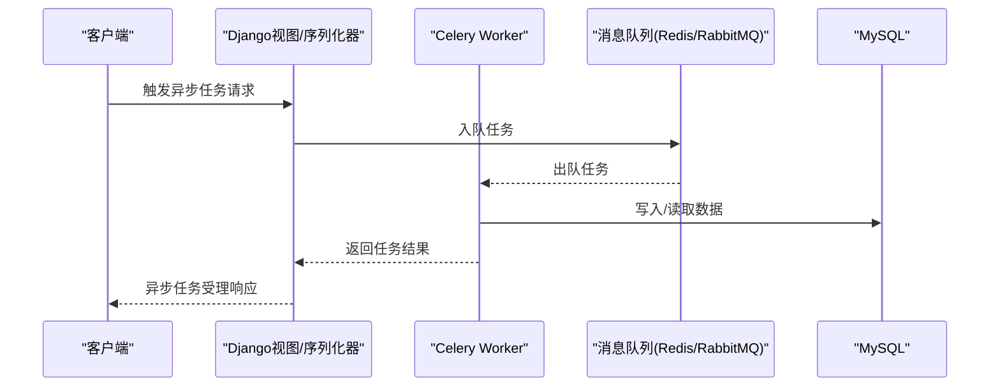
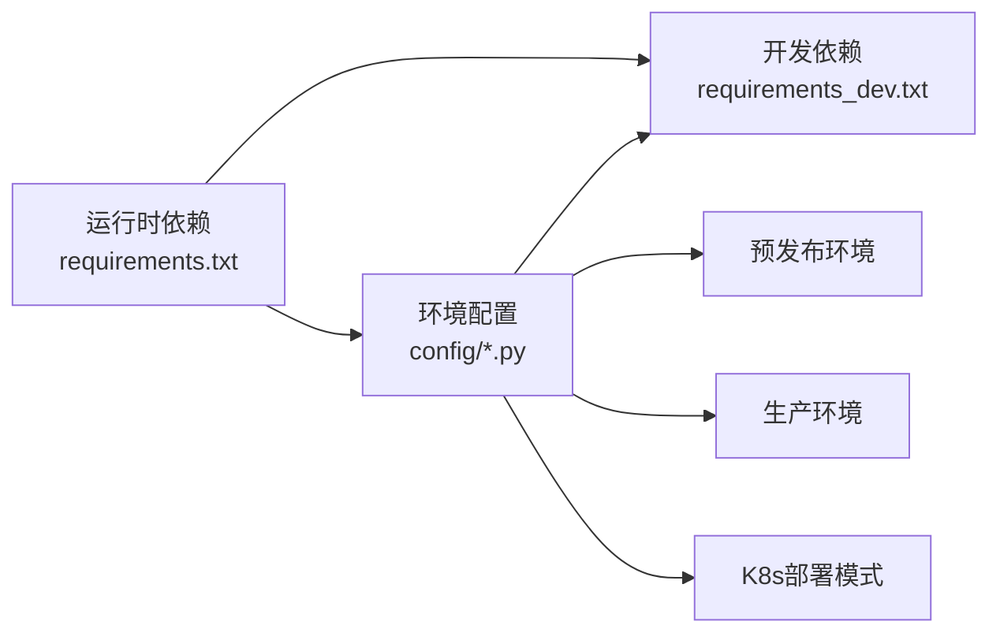

# 技术栈

<cite>
**本文引用的文件**
- [requirements.txt](file://requirements.txt)
- [requirements_dev.txt](file://requirements_dev.txt)
- [settings.py](file://settings.py)
- [config/default.py](file://config/default.py)
- [config/dev.py](file://config/dev.py)
- [config/stag.py](file://config/stag.py)
- [config/prod.py](file://config/prod.py)
- [urls.py](file://urls.py)
- [wsgi.py](file://wsgi.py)
- [manage.py](file://manage.py)
- [apps/log_search/apps.py](file://apps/log_search/apps.py)
- [apps/log_databus/apps.py](file://apps/log_databus/apps.py)
</cite>

## 目录
1. [简介](#简介)
2. [项目结构](#项目结构)
3. [核心组件](#核心组件)
4. [架构总览](#架构总览)
5. [详细组件分析](#详细组件分析)
6. [依赖关系分析](#依赖关系分析)
7. [性能考量](#性能考量)
8. [故障排查指南](#故障排查指南)
9. [结论](#结论)
10. [附录](#附录)

## 简介
本技术栈文档面向BK Monitor（蓝鲸日志平台）子系统“bklog”，系统性梳理后端技术栈、前端技术栈、数据库、消息队列、搜索引擎与可观测性组件的选型、版本与配置要点，并给出开发与生产环境的差异说明及替代方案对比，帮助开发者快速理解并高效落地。

## 项目结构
- 应用组织采用“多子应用”模式，核心功能拆分为多个独立App（如日志检索、采集总线、审计、聚类、提取、Trace等），通过统一的路由入口聚合对外API。
- 配置分层：settings.py作为入口，按环境动态加载config/dev.py、config/stag.py、config/prod.py；默认配置集中在config/default.py。
- 部署形态支持传统容器与Kubernetes双模式，静态资源与日志格式在不同部署模式下差异化处理。

图表来源
- [settings.py:26-46](file://settings.py#L26-L46)
- [config/dev.py:34-112](file://config/dev.py#L34-L112)
- [config/stag.py:33-105](file://config/stag.py#L33-L105)
- [config/prod.py:35-120](file://config/prod.py#L35-L120)
- [config/default.py:36-154](file://config/default.py#L36-L154)
- [urls.py:42-84](file://urls.py#L42-L84)
- [wsgi.py:28-35](file://wsgi.py#L28-L35)
- [manage.py:25-31](file://manage.py#L25-L31)

章节来源
- [settings.py:26-46](file://settings.py#L26-L46)
- [config/default.py:36-154](file://config/default.py#L36-L154)
- [urls.py:42-84](file://urls.py#L42-L84)

## 核心组件
- 后端框架
  - Python 3.x：项目基于Python生态构建，依赖集中于requirements.txt与requirements_dev.txt。
  - Django 4.x：主框架，版本在requirements.txt中固定。
  - Django REST Framework：提供API序列化与视图能力，REST_FRAMEWORK在默认配置中集中定义。
- 消息队列与异步任务
  - Celery + Redis：Celery在默认配置中启用，任务导入列表覆盖多个App；Redis用于Broker与结果存储。
  - RabbitMQ：开发环境示例配置可切换为RabbitMQ Broker。
- 数据库
  - MySQL：默认数据库引擎为MySQL，支持本地SQLite用于测试。
- 搜索引擎
  - Elasticsearch 7.x系列：原生ES客户端与DSL支持齐全，兼容ES5/6/7多版本客户端。
- 可观测性
  - OpenTelemetry：集成OTLP导出器与多种Instrumentation，支持链路与日志上报。
  - Prometheus：集成django-prometheus指标上报。
- 前端与静态资源
  - 前端技术栈未在代码中显式声明，但项目包含大量静态资源与REST Framework文档UI，表明前端以蓝鲸前端体系或静态产物形式集成。
- 其他
  - Grafana：通过配置项启用并提供仪表盘与数据源管理。
  - IAM：权限中心对接，支持RBAC与API网关认证。
  - API网关：apigw-manager集成，统一鉴权与路由。

章节来源
- [requirements.txt:8-28](file://requirements.txt#L8-L28)
- [requirements.txt:12-17](file://requirements.txt#L12-L17)
- [requirements.txt:41-44](file://requirements.txt#L41-L44)
- [requirements.txt:72-84](file://requirements.txt#L72-L84)
- [requirements.txt:98-99](file://requirements.txt#L98-L99)
- [config/default.py:501-507](file://config/default.py#L501-L507)
- [config/default.py:196-232](file://config/default.py#L196-L232)
- [config/dev.py:43-47](file://config/dev.py#L43-L47)
- [config/default.py:445-455](file://config/default.py#L445-L455)

## 架构总览
下图展示从请求进入至各子系统的调用关系与职责边界：

图表来源
- [urls.py:42-84](file://urls.py#L42-L84)
- [apps/log_search/apps.py:48-57](file://apps/log_search/apps.py#L48-L57)
- [apps/log_databus/apps.py:25-28](file://apps/log_databus/apps.py#L25-L28)
- [config/default.py:196-232](file://config/default.py#L196-L232)
- [requirements.txt:41-44](file://requirements.txt#L41-L44)
- [requirements.txt:72-84](file://requirements.txt#L72-L84)
- [requirements.txt:98-99](file://requirements.txt#L98-L99)

## 详细组件分析

### 后端技术栈（Python/Django/DRF）
- Python与Django
  - Python版本：由运行环境决定，项目依赖集中在requirements.txt。
  - Django 4.2.x：明确指定版本，确保与REST Framework、Celery等生态兼容。
- REST Framework
  - 默认渲染器、异常处理器、搜索参数等在default配置中集中定义，便于统一治理。
- 中间件与安全
  - 包含HTTPS强制、跨域、API网关JWT、API Token认证、国际化、性能分析等中间件，形成完整的请求链路控制。
- 会话与认证
  - 支持Cookie与API网关JWT两种认证路径，结合IAM实现RBAC权限控制。

章节来源
- [requirements.txt:8-28](file://requirements.txt#L8-L28)
- [config/default.py:501-507](file://config/default.py#L501-L507)
- [config/default.py:113-154](file://config/default.py#L113-L154)
- [config/default.py:544-550](file://config/default.py#L544-L550)

### 消息队列与异步任务（Celery/Redis/RabbitMQ）
- Celery启用与并发
  - 在默认配置中启用Celery，任务导入列表覆盖日志检索、采集总线、聚类、提取等模块。
  - 并发度可通过环境变量配置，适合在生产环境中按CPU核数与队列负载调优。
- Broker选择
  - 开发环境示例使用Redis；也可切换为RabbitMQ（示例注释提供）。
- 结果存储
  - django-celery-results用于任务结果存储，便于查询与调试。

图表来源
- [config/default.py:196-232](file://config/default.py#L196-L232)
- [config/dev.py:43-47](file://config/dev.py#L43-L47)
- [requirements.txt:12-17](file://requirements.txt#L12-L17)

章节来源
- [config/default.py:196-232](file://config/default.py#L196-L232)
- [config/dev.py:43-47](file://config/dev.py#L43-L47)
- [requirements.txt:12-17](file://requirements.txt#L12-L17)

### 数据库（MySQL）
- 默认引擎为MySQL，支持本地SQLite用于单元测试。
- 生产环境K8s模式下，数据库连接参数通过环境变量注入，便于多集群与多租户隔离。

章节来源
- [config/dev.py:50-67](file://config/dev.py#L50-L67)
- [config/prod.py:102-115](file://config/prod.py#L102-L115)

### 搜索引擎（Elasticsearch）
- 客户端与DSL
  - 同时引入elasticsearch、elasticsearch5、elasticsearch6、elasticsearch_dsl，满足多版本ES场景。
- 应用范围
  - 日志检索、ES查询、聚类等模块广泛使用ES作为底层存储与查询引擎。

章节来源
- [requirements.txt:41-44](file://requirements.txt#L41-L44)
- [apps/log_search/apps.py:48-57](file://apps/log_search/apps.py#L48-L57)

### 可观测性（OpenTelemetry/Prometheus）
- OpenTelemetry
  - 导出器与Instrumentation覆盖Django、Elasticsearch、DBAPI、Redis、Requests、Celery、Logging等，支持链路与日志上报。
  - 可通过环境变量开启OTLP日志上报与链路追踪。
- Prometheus
  - 集成django-prometheus指标上报，便于与Prometheus/Grafana联动。

章节来源
- [requirements.txt:72-84](file://requirements.txt#L72-L84)
- [requirements.txt:98-99](file://requirements.txt#L98-L99)
- [config/default.py:356-368](file://config/default.py#L356-L368)
- [config/default.py:264-271](file://config/default.py#L264-L271)

### 前端技术栈
- 项目未在代码中显式声明前端框架版本，但包含大量静态资源与REST Framework文档UI，表明前端采用蓝鲸前端体系或静态产物集成方式。
- 建议在本地开发时配合蓝鲸前端工程或静态资源代理进行联调。

章节来源
- [urls.py:64-68](file://urls.py#L64-L68)

### API网关与权限（IAM）
- API网关
  - apigw-manager集成，统一鉴权与路由，支持JWT解析与用户/应用对象注入。
- 权限中心
  - IAM对接，支持RBAC权限模型与资源授权，权限迁移脚本在应用ready阶段执行。

章节来源
- [config/default.py:136-138](file://config/default.py#L136-L138)
- [apps/log_search/apps.py:41-46](file://apps/log_search/apps.py#L41-L46)

## 依赖关系分析
- 依赖分层
  - 运行时依赖：Django、DRF、Celery、Redis、Elasticsearch、OpenTelemetry、Prometheus等。
  - 开发依赖：虚拟环境、flake8、coverage、pre-commit等。
- 环境差异
  - dev/stag/prod三套配置分别覆盖数据库、日志级别、CORS、Grafana、IAM等差异化需求。
- 部署差异
  - K8s模式下静态资源与日志格式、数据库连接参数等均通过环境变量注入。

图表来源
- [requirements.txt:1-146](file://requirements.txt#L1-L146)
- [requirements_dev.txt:1-13](file://requirements_dev.txt#L1-L13)
- [config/dev.py:34-112](file://config/dev.py#L34-L112)
- [config/stag.py:33-105](file://config/stag.py#L33-L105)
- [config/prod.py:35-120](file://config/prod.py#L35-L120)

章节来源
- [requirements.txt:1-146](file://requirements.txt#L1-L146)
- [requirements_dev.txt:1-13](file://requirements_dev.txt#L1-L13)
- [config/default.py:33-34](file://config/default.py#L33-L34)
- [config/default.py:290-354](file://config/default.py#L290-L354)

## 性能考量
- 异步任务与并发
  - Celery并发度可通过环境变量调节，建议结合队列长度与任务耗时进行压测优化。
- 搜索引擎
  - ES版本兼容与索引设计直接影响查询性能，建议在聚类与检索模块中关注分片与副本策略。
- 指标与追踪
  - OpenTelemetry与Prometheus结合，建议在关键路径埋点并定期评估延迟与吞吐。

## 故障排查指南
- 环境变量缺失
  - 生产K8s模式下数据库连接参数需通过环境变量注入；缺少时会导致数据库连接失败。
- 日志格式
  - K8s模式下日志格式为JSON，需确保采集侧正确解析；可通过环境变量开启OTLP日志上报辅助定位。
- CORS与跨域
  - 预发布环境已开启CORS，若出现跨域问题，检查CORS配置与白名单。
- 权限与认证
  - API网关JWT与IAM权限需一致生效，若出现403，检查JWT解析与资源授权。

章节来源
- [config/prod.py:102-115](file://config/prod.py#L102-L115)
- [config/default.py:290-354](file://config/default.py#L290-L354)
- [config/stag.py:64-70](file://config/stag.py#L64-L70)
- [config/default.py:136-138](file://config/default.py#L136-L138)

## 结论
本项目采用成熟稳定的后端技术栈：Django 4.x + DRF + Celery + Redis/Elasticsearch + OpenTelemetry + Prometheus，配合蓝鲸生态的API网关与IAM，形成可扩展、可观测、可运维的日志平台基础能力。开发与生产环境通过配置文件与环境变量实现解耦，K8s模式进一步提升了部署灵活性与弹性。

## 附录

### 版本与兼容性对照表
- Python：由运行环境决定，建议使用Python 3.8+以获得最佳兼容性。
- Django：4.2.x（固定版本）
- DRF：3.15.x（固定版本）
- Celery：5.4.x（固定版本）
- Redis：4.x（固定版本）
- Elasticsearch：7.17.x（原生ES客户端），同时兼容5/6/7
- OpenTelemetry：1.24.x系列（导出器与Instrumentation）
- Prometheus：django-prometheus 2.1.x

章节来源
- [requirements.txt:8-28](file://requirements.txt#L8-L28)
- [requirements.txt:12-17](file://requirements.txt#L12-L17)
- [requirements.txt:41-44](file://requirements.txt#L41-L44)
- [requirements.txt:72-84](file://requirements.txt#L72-L84)
- [requirements.txt:98-99](file://requirements.txt#L98-L99)

### 开发与生产环境配置差异
- 数据库
  - 开发：本地MySQL或SQLite（测试）
  - 生产：K8s模式通过环境变量注入连接参数
- 日志级别
  - 开发：DEBUG=True
  - 预发布：可配置LOG_LEVEL
  - 生产：默认ERROR级别
- CORS
  - 预发布：允许跨域与凭据
- Grafana
  - 通过配置项启用，支持仪表盘与数据源管理
- API网关与权限
  - 统一鉴权与路由，IAM权限模型启用

章节来源
- [config/dev.py:48-67](file://config/dev.py#L48-L67)
- [config/stag.py:36-69](file://config/stag.py#L36-L69)
- [config/prod.py:41-49](file://config/prod.py#L41-L49)
- [config/default.py:445-455](file://config/default.py#L445-L455)
- [config/default.py:136-138](file://config/default.py#L136-L138)