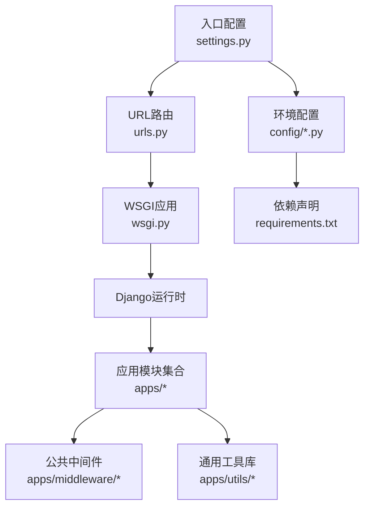
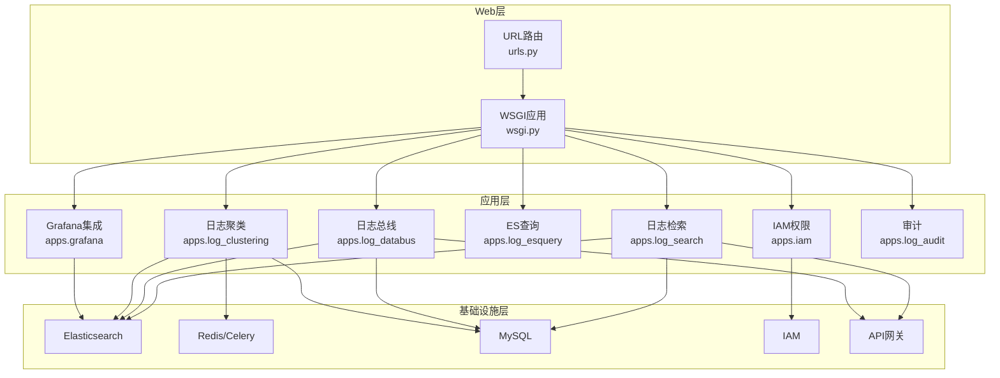
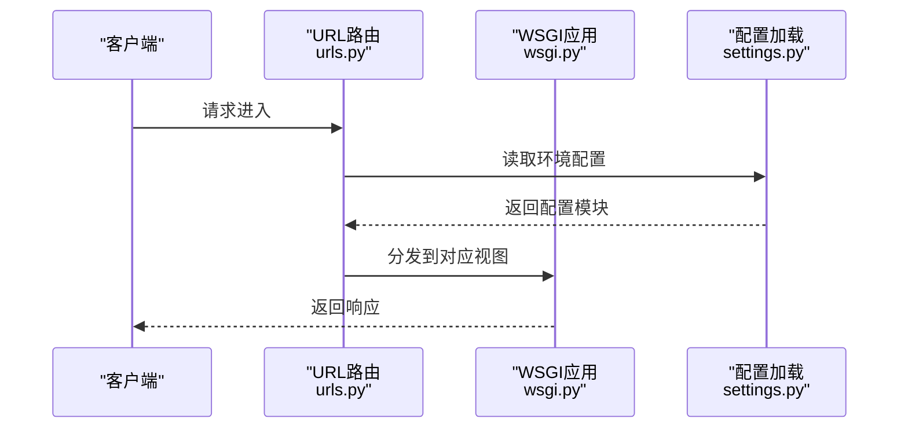
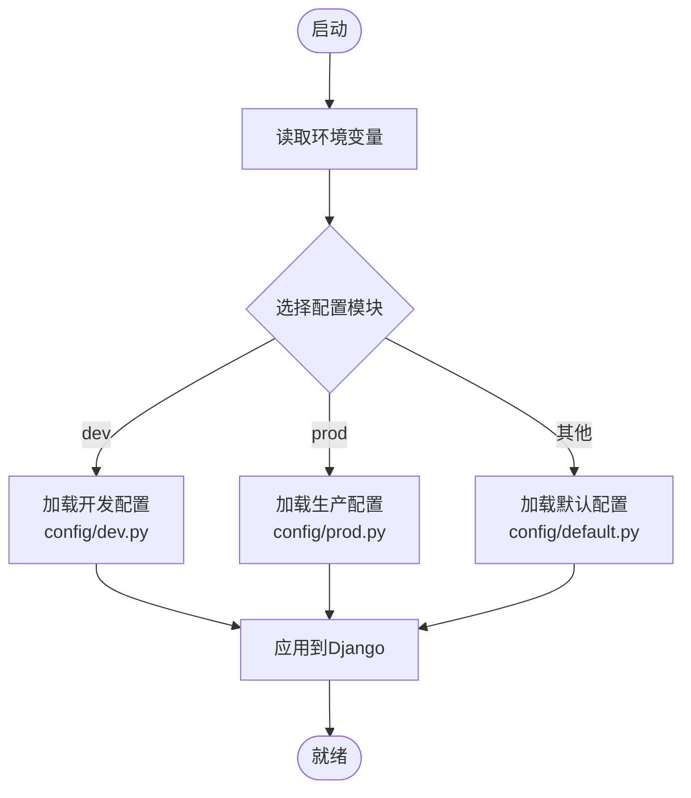
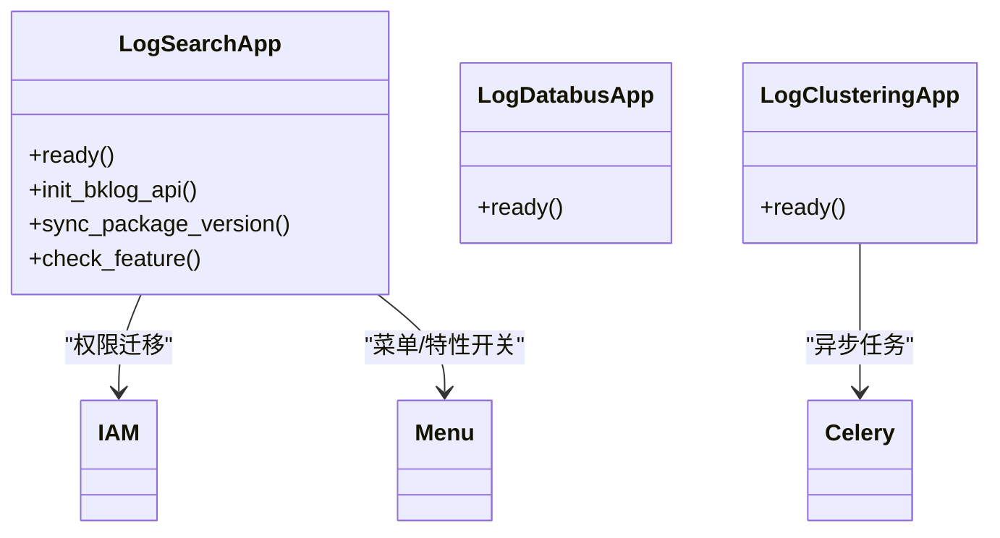
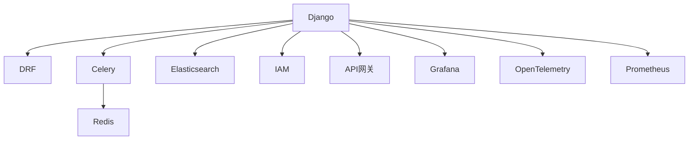

# 架构设计

<cite>
**本文引用的文件**
- [settings.py](file://settings.py)
- [urls.py](file://urls.py)
- [wsgi.py](file://wsgi.py)
- [manage.py](file://manage.py)
- [default.py](file://config/default.py)
- [dev.py](file://config/dev.py)
- [prod.py](file://config/prod.py)
- [requirements.txt](file://requirements.txt)
- [apps.py（日志检索）](file://apps/log_search/apps.py)
- [apps.py（日志总线）](file://apps/log_databus/apps.py)
- [apps.py（日志聚类）](file://apps/log_clustering/apps.py)
- [__init__.py（中间件）](file://apps/middleware/__init__.py)
- [__init__.py（工具包）](file://apps/utils/__init__.py)
</cite>

## 目录
1. [简介](#简介)
2. [项目结构](#项目结构)
3. [核心组件](#核心组件)
4. [架构总览](#架构总览)
5. [详细组件分析](#详细组件分析)
6. [依赖分析](#依赖分析)
7. [性能考虑](#性能考虑)
8. [故障排查指南](#故障排查指南)
9. [结论](#结论)
10. [附录](#附录)

## 简介
本架构设计文档面向 BK Monitor 项目（蓝鲸日志平台子系统），系统基于 Django 框架构建，围绕“采集-存储-检索-可视化-治理”的完整链路组织模块化能力，采用多应用分层与插件化扩展，结合 Celery 异步任务、Elasticsearch 搜索引擎、Grafana 可视化、IAM 权限体系、API 网关等关键技术，形成统一的可观测性基础设施。本文从架构模式、分层设计、模块化组织、核心组件交互、数据流与职责划分、技术栈选择与集成方式、可扩展性与性能、安全机制等方面进行全面阐述，并提供架构图与组件关系图，帮助开发者快速理解系统整体布局与扩展方向。

## 项目结构
系统采用“入口配置 + 多应用模块 + 公共中间件与工具”的组织方式：
- 入口与运行时：settings.py、urls.py、wsgi.py、manage.py
- 配置体系：config/default.py（默认配置）、config/dev.py（开发）、config/prod.py（生产）
- 技术栈依赖：requirements.txt
- 应用模块：apps/* 下的各功能域应用（如日志检索、日志总线、日志聚类、审计、ES 查询、Grafana 集成等）
- 中间件与工具：apps/middleware、apps/utils

图表来源
- [settings.py:1-47](file://settings.py#L1-L47)
- [urls.py:1-85](file://urls.py#L1-L85)
- [wsgi.py:1-35](file://wsgi.py#L1-L35)
- [default.py:1-120](file://config/default.py#L1-L120)
- [requirements.txt:1-146](file://requirements.txt#L1-L146)

章节来源
- [settings.py:1-47](file://settings.py#L1-L47)
- [urls.py:1-85](file://urls.py#L1-L85)
- [wsgi.py:1-35](file://wsgi.py#L1-L35)
- [default.py:1-120](file://config/default.py#L1-L120)
- [requirements.txt:1-146](file://requirements.txt#L1-L146)

## 核心组件
- Web 入口与路由
  - settings.py：动态加载环境配置模块，统一注入全局常量
  - urls.py：集中注册各应用 API 与前端页面路由，支持多模块聚合
  - wsgi.py：WSGI 应用入口，供容器或服务器托管
  - manage.py：Django 命令行入口，支持 runserver、celery 等命令

- 配置与环境
  - config/default.py：默认配置，包含 INSTALLED_APPS、MIDDLEWARE、Celery 导入、日志与 OTel、Grafana、权限与特性开关等
  - config/dev.py、config/prod.py：开发/生产差异化配置（数据库、CSRF、日志级别、IAM 等）

- 应用模块
  - 日志检索（apps.log_search）：负责检索、索引集、权限迁移、菜单与特性开关联动
  - 日志总线（apps.log_databus）：负责采集接入、清洗、存储、归档、ITSM 等
  - 日志聚类（apps.log_clustering）：负责日志聚类、订阅、消息与模式同步等异步任务
  - 其他模块：日志审计、ES 查询、Grafana 集成、AI 助手、提取、测量、BCS、通知等

- 中间件与工具
  - 中间件：统一认证、XSS、国际化、API 网关 JWT、性能分析等
  - 工具：枚举、HTML 解码、MD5、本地 IP 获取、ChoicesEnum 等

章节来源
- [settings.py:1-47](file://settings.py#L1-L47)
- [urls.py:1-85](file://urls.py#L1-L85)
- [wsgi.py:1-35](file://wsgi.py#L1-L35)
- [manage.py:1-31](file://manage.py#L1-L31)
- [default.py:500-580](file://config/default.py#L500-L580)
- [apps.py（日志检索）:48-155](file://apps/log_search/apps.py#L48-L155)
- [apps.py（日志总线）:25-28](file://apps/log_databus/apps.py#L25-L28)
- [apps.py（日志聚类）:25-27](file://apps/log_clustering/apps.py#L25-L27)
- [__init__.py（中间件）:1-22](file://apps/middleware/__init__.py#L1-L22)
- [__init__.py（工具包）:32-199](file://apps/utils/__init__.py#L32-L199)

## 架构总览
系统采用“Web 层 + 应用层 + 基础设施层”的三层架构：
- Web 层：Django + WSGI + URL 路由，统一对外提供 REST API 与静态页面
- 应用层：多应用模块解耦协作，通过统一中间件与工具库支撑
- 基础设施层：Elasticsearch（搜索）、Redis/Celery（异步任务）、MySQL（元数据）、Grafana（可视化）、IAM（权限）、API 网关（鉴权与路由）

图表来源
- [urls.py:42-74](file://urls.py#L42-L74)
- [default.py:54-95](file://config/default.py#L54-L95)
- [default.py:188-236](file://config/default.py#L188-L236)

章节来源
- [urls.py:42-74](file://urls.py#L42-L74)
- [default.py:54-95](file://config/default.py#L54-L95)
- [default.py:188-236](file://config/default.py#L188-L236)

## 详细组件分析

### Web 入口与运行时
- settings.py：根据环境变量动态选择配置模块，确保不同环境一致加载
- urls.py：集中注册各应用路由，支持多模块聚合与静态资源服务
- wsgi.py：标准 WSGI 入口，适配容器化部署
- manage.py：命令行入口，支持 runserver、celery worker/beat 等

图表来源
- [settings.py:37-47](file://settings.py#L37-L47)
- [urls.py:42-74](file://urls.py#L42-L74)
- [wsgi.py:30-35](file://wsgi.py#L30-L35)

章节来源
- [settings.py:37-47](file://settings.py#L37-L47)
- [urls.py:42-74](file://urls.py#L42-L74)
- [wsgi.py:30-35](file://wsgi.py#L30-L35)
- [manage.py:25-31](file://manage.py#L25-L31)

### 配置与环境
- default.py：统一注入 INSTALLED_APPS、MIDDLEWARE、Celery 导入、日志与 OTel、Grafana、权限与特性开关等
- dev.py/prod.py：开发/生产差异化配置（数据库、CSRF、日志级别、IAM 等）

图表来源
- [settings.py:26-47](file://settings.py#L26-L47)
- [dev.py:34-112](file://config/dev.py#L34-L112)
- [prod.py:35-120](file://config/prod.py#L35-L120)
- [default.py:54-95](file://config/default.py#L54-L95)

章节来源
- [settings.py:26-47](file://settings.py#L26-L47)
- [dev.py:34-112](file://config/dev.py#L34-L112)
- [prod.py:35-120](file://config/prod.py#L35-L120)
- [default.py:54-95](file://config/default.py#L54-L95)

### 应用模块与职责
- 日志检索（apps.log_search）
  - 职责：检索、索引集、权限迁移、菜单与特性开关联动
  - 关键点：启动时执行 IAM 迁移；根据部署情况动态调整菜单与特性开关；记录版本信息
- 日志总线（apps.log_databus）
  - 职责：采集接入、清洗、存储、归档、ITSM 等
- 日志聚类（apps.log_clustering）
  - 职责：聚类配置、订阅、消息与模式同步等异步任务
- 其他模块：日志审计、ES 查询、Grafana 集成、AI 助手、提取、测量、BCS、通知等

图表来源
- [apps.py（日志检索）:48-155](file://apps/log_search/apps.py#L48-L155)
- [apps.py（日志总线）:25-28](file://apps/log_databus/apps.py#L25-L28)
- [apps.py（日志聚类）:25-27](file://apps/log_clustering/apps.py#L25-L27)

章节来源
- [apps.py（日志检索）:48-155](file://apps/log_search/apps.py#L48-L155)
- [apps.py（日志总线）:25-28](file://apps/log_databus/apps.py#L25-L28)
- [apps.py（日志聚类）:25-27](file://apps/log_clustering/apps.py#L25-L27)

### 中间件与工具
- 中间件：统一认证、XSS、国际化、API 网关 JWT、性能分析等
- 工具：枚举、HTML 解码、MD5、本地 IP 获取、ChoicesEnum 等

章节来源
- [__init__.py（中间件）:1-22](file://apps/middleware/__init__.py#L1-L22)
- [__init__.py（工具包）:32-199](file://apps/utils/__init__.py#L32-L199)

## 依赖分析
系统技术栈与依赖关系如下：
- Web 框架：Django
- API 框架：Django REST Framework
- 异步任务：Celery + Redis
- 搜索引擎：Elasticsearch（7.x）
- 可视化：Grafana
- 权限：IAM
- API 网关：apigw-manager
- 监控与可观测：OpenTelemetry、Prometheus
- 其他：kafka、consul、cos、pipeline、notice 等

图表来源
- [requirements.txt:8-146](file://requirements.txt#L8-L146)
- [default.py:188-236](file://config/default.py#L188-L236)

章节来源
- [requirements.txt:8-146](file://requirements.txt#L8-L146)
- [default.py:188-236](file://config/default.py#L188-L236)

## 性能考虑
- 异步任务与并发
  - Celery 并发度可通过环境变量配置，建议根据 CPU 与 IO 能力调优
  - 高优先级队列配置便于关键任务优先处理
- 日志与可观测
  - 生产环境日志级别与 JSON 格式化，便于集中收集与分析
  - OpenTelemetry 上报可选开启，支持链路追踪与指标导出
- 缓存与静态资源
  - WhiteNoise 中间件与静态资源版本控制，提升前端加载性能
- 数据库连接
  - django-dbconn-retry 提升数据库连接稳定性

章节来源
- [default.py:188-236](file://config/default.py#L188-L236)
- [default.py:273-368](file://config/default.py#L273-L368)
- [default.py:109-110](file://config/default.py#L109-L110)

## 故障排查指南
- 启动与路由
  - 确认 settings.py 环境变量是否正确，是否能加载到目标配置模块
  - 检查 urls.py 路由是否包含目标模块
- Celery 任务
  - 确认 BROKER_URL、CELERYD_CONCURRENCY 等配置
  - 查看 Celery worker/beat 日志与队列状态
- Elasticsearch
  - 检查 ES 连接参数、索引映射与权限
- Grafana
  - 确认 GRAFANA.HOST/PREFIX/ADMIN 配置
- 权限与 API 网关
  - 确认 APIGW 名称、JWT 提供者与同步开关
- 日志与追踪
  - 生产环境日志级别与 OTLP 配置，必要时开启 OTLP 日志上报

章节来源
- [settings.py:26-47](file://settings.py#L26-L47)
- [urls.py:42-74](file://urls.py#L42-L74)
- [default.py:188-236](file://config/default.py#L188-L236)
- [default.py:445-456](file://config/default.py#L445-L456)
- [default.py:364-368](file://config/default.py#L364-L368)

## 结论
本架构以 Django 为核心，围绕“采集-存储-检索-可视化-治理”形成模块化能力，通过统一配置、中间件与工具库实现横切关注点的收敛。Celery 异步任务与 Elasticsearch 搜索引擎满足高吞吐与低延迟需求，Grafana 与 IAM 提升可观测性与安全性。通过特性开关与多环境配置，系统具备良好的可扩展性与可维护性。建议在后续扩展中持续完善异步任务治理、ES 集群治理与 API 网关路由策略，以进一步提升系统弹性与稳定性。

## 附录
- 环境变量与配置要点
  - DEPLOY_MODE：部署模式（kubernetes）
  - BKPAAS_ENVIRONMENT/BK_ENV：环境标识
  - BKAPP_IS_BKLOG_API：后台接口模式
  - BKAPP_FEATURE_*：特性开关
  - BKAPP_OTLP_*：OTLP 上报配置
  - DEPLOY_MODE=kubernetes：静态资源与日志格式化策略
- 常见问题定位清单
  - 确认配置模块加载成功
  - 确认 Celery worker/beat 正常运行
  - 确认 ES 集群可用与索引映射正确
  - 确认 IAM 与 API 网关配置正确
  - 生产环境日志级别与 OTLP 上报按需开启