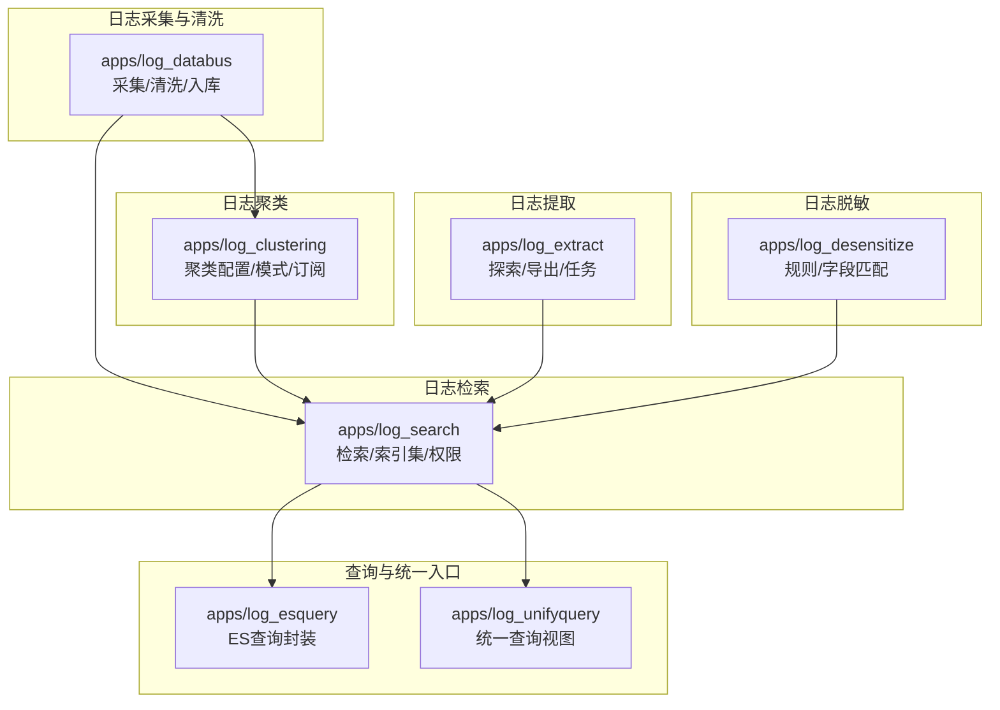
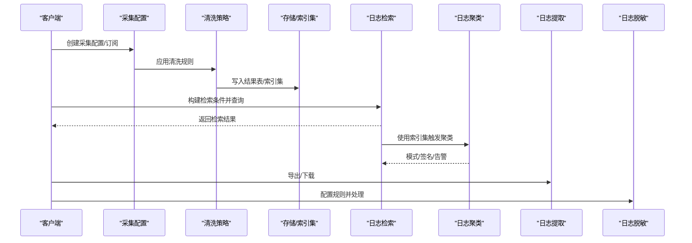
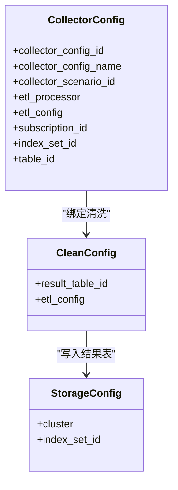
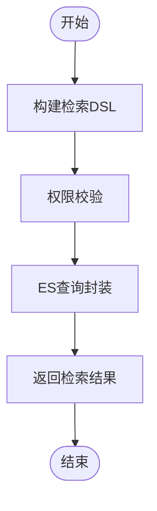
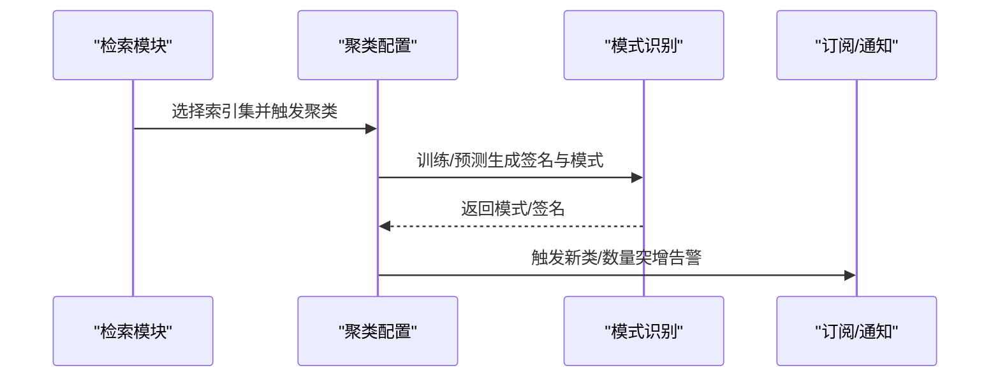
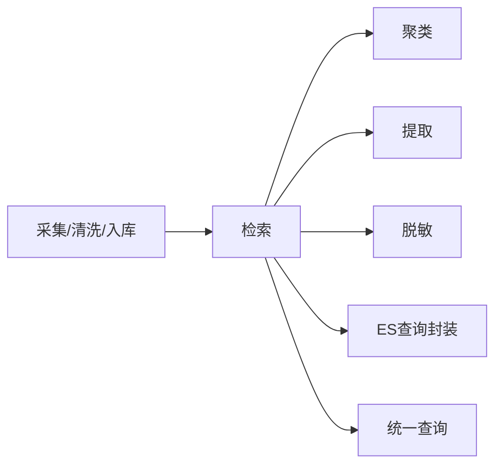

# 核心功能

<cite>
**本文引用的文件**
- [apps/log_databus/apps.py](file://apps/log_databus/apps.py)
- [apps/log_databus/models.py](file://apps/log_databus/models.py)
- [apps/log_search/apps.py](file://apps/log_search/apps.py)
- [apps/log_search/models.py](file://apps/log_search/models.py)
- [apps/log_clustering/apps.py](file://apps/log_clustering/apps.py)
- [apps/log_clustering/models.py](file://apps/log_clustering/models.py)
- [apps/log_extract/__init__.py](file://apps/log_extract/__init__.py)
- [apps/log_desensitize/__init__.py](file://apps/log_desensitize/__init__.py)
- [apps/log_esquery/views/esquery_views.py](file://apps/log_esquery/views/esquery_views.py)
- [apps/log_unifyquery/views.py](file://apps/log_unifyquery/views.py)
- [apps/log_databus/views/collector_views.py](file://apps/log_databus/views/collector_views.py)
- [apps/log_databus/views/clean_views.py](file://apps/log_databus/views/clean_views.py)
- [apps/log_databus/views/storage_views.py](file://apps/log_databus/views/storage_views.py)
- [apps/log_search/views/search_views.py](file://apps/log_search/views/search_views.py)
- [apps/log_clustering/views/clustering_config_views.py](file://apps/log_clustering/views/clustering_config_views.py)
- [apps/log_clustering/views/pattern_views.py](file://apps/log_clustering/views/pattern_views.py)
- [apps/log_extract/views/explorer_views.py](file://apps/log_extract/views/explorer_views.py)
- [apps/log_desensitize/views/desensitize_rule_views.py](file://apps/log_desensitize/views/desensitize_rule_views.py)
</cite>

## 目录
1. [简介](#简介)
2. [项目结构](#项目结构)
3. [核心组件](#核心组件)
4. [架构总览](#架构总览)
5. [详细组件分析](#详细组件分析)
6. [依赖关系分析](#依赖关系分析)
7. [性能考量](#性能考量)
8. [故障排查指南](#故障排查指南)
9. [结论](#结论)
10. [附录](#附录)

## 简介
本文件面向BK Monitor项目中的日志能力全景，聚焦于日志采集、日志清洗、日志检索、日志聚类、日志提取、日志脱敏六大核心功能模块，提供：
- 每个模块的功能定位、典型适用场景与技术特点
- 模块间的协作关系与数据流转过程
- 功能特性优先级与推荐使用顺序
- 可视化流程图与参考路径，便于快速定位实现与扩展

## 项目结构
围绕日志全链路，系统以“采集-清洗-入库-检索-聚类-提取-脱敏”为主线组织模块，关键应用位于apps目录下：
- 日志采集与清洗：apps/log_databus
- 日志检索：apps/log_search
- 日志聚类：apps/log_clustering
- 日志提取：apps/log_extract
- 日志脱敏：apps/log_desensitize
- ES查询封装：apps/log_esquery
- 统一查询入口：apps/log_unifyquery

图表来源
- [apps/log_databus/apps.py:25-28](file://apps/log_databus/apps.py#L25-L28)
- [apps/log_search/apps.py:48-57](file://apps/log_search/apps.py#L48-L57)
- [apps/log_clustering/apps.py:25-27](file://apps/log_clustering/apps.py#L25-L27)
- [apps/log_esquery/views/esquery_views.py](file://apps/log_esquery/views/esquery_views.py)
- [apps/log_unifyquery/views.py](file://apps/log_unifyquery/views.py)

章节来源
- [apps/log_databus/apps.py:25-28](file://apps/log_databus/apps.py#L25-L28)
- [apps/log_search/apps.py:48-57](file://apps/log_search/apps.py#L48-L57)
- [apps/log_clustering/apps.py:25-27](file://apps/log_clustering/apps.py#L25-L27)

## 核心组件
- 日志采集（apps/log_databus）
  - 职责：采集配置、采集订阅、清洗策略、结果表与索引集绑定、存储集群选择
  - 关键模型：采集配置、清洗模板、存储配置
  - 适用场景：多场景日志采集（主机/容器/事件等）、与节点管理联动、对接数据平台
- 日志清洗（apps/log_databus）
  - 职责：ETL清洗、字段抽取、格式标准化、与采集配置强关联
  - 适用场景：结构化解析、字段归一化、为检索与聚类提供高质量数据
- 日志检索（apps/log_search）
  - 职责：索引集管理、检索DSL构建、权限校验、全局配置与特性开关
  - 适用场景：全文检索、字段检索、趋势分析、历史查询、下载
- 日志聚类（apps/log_clustering）
  - 职责：聚类策略配置、模式识别、签名生成、订阅与告警、新类检测
  - 适用场景：异常模式发现、日志去噪、告警收敛、趋势对比
- 日志提取（apps/log_extract）
  - 职责：日志探索、导出、任务调度、文件服务器对接
  - 适用场景：离线导出、大体量日志下载、审计与取证
- 日志脱敏（apps/log_desensitize）
  - 职责：敏感字段识别与替换、规则配置、批量处理
  - 适用场景：合规要求、PII保护、内部审计

章节来源
- [apps/log_databus/models.py:102-200](file://apps/log_databus/models.py#L102-L200)
- [apps/log_search/models.py:107-180](file://apps/log_search/models.py#L107-L180)
- [apps/log_clustering/models.py:107-200](file://apps/log_clustering/models.py#L107-L200)
- [apps/log_extract/__init__.py:1-22](file://apps/log_extract/__init__.py#L1-L22)
- [apps/log_desensitize/__init__.py:1-21](file://apps/log_desensitize/__init__.py#L1-L21)

## 架构总览
从采集到检索的端到端流程如下：

图表来源
- [apps/log_databus/views/collector_views.py](file://apps/log_databus/views/collector_views.py)
- [apps/log_databus/views/clean_views.py](file://apps/log_databus/views/clean_views.py)
- [apps/log_databus/views/storage_views.py](file://apps/log_databus/views/storage_views.py)
- [apps/log_search/views/search_views.py](file://apps/log_search/views/search_views.py)
- [apps/log_clustering/views/clustering_config_views.py](file://apps/log_clustering/views/clustering_config_views.py)
- [apps/log_extract/views/explorer_views.py](file://apps/log_extract/views/explorer_views.py)
- [apps/log_desensitize/views/desensitize_rule_views.py](file://apps/log_desensitize/views/desensitize_rule_views.py)

## 详细组件分析

### 日志采集（apps/log_databus）
- 功能要点
  - 采集配置与订阅：支持多种采集场景与目标节点，绑定清洗策略与结果表
  - 清洗策略：ETL处理器与配置，支持与数据平台对接
  - 存储与索引：结果表ID、索引集绑定、存储集群选择
- 技术特点
  - 与节点管理联动，支持立即执行任务与订阅差异追踪
  - 支持容器化部署场景与BCS集群集成
- 适用场景
  - 多业务/多环境日志采集、结构化清洗前置、合规落库

图表来源
- [apps/log_databus/models.py:102-200](file://apps/log_databus/models.py#L102-L200)

章节来源
- [apps/log_databus/models.py:102-200](file://apps/log_databus/models.py#L102-L200)
- [apps/log_databus/views/collector_views.py](file://apps/log_databus/views/collector_views.py)
- [apps/log_databus/views/clean_views.py](file://apps/log_databus/views/clean_views.py)
- [apps/log_databus/views/storage_views.py](file://apps/log_databus/views/storage_views.py)

### 日志清洗（apps/log_databus）
- 功能要点
  - ETL清洗：字段抽取、格式转换、时间字段标准化
  - 清洗模板：可复用的清洗规则，支持多场景
- 技术特点
  - 与采集配置强耦合，清洗结果直接影响检索质量
  - 支持与数据平台清洗链路打通
- 适用场景
  - 结构化解析、字段归一化、提升检索与聚类效果

章节来源
- [apps/log_databus/views/clean_views.py](file://apps/log_databus/views/clean_views.py)

### 日志检索（apps/log_search）
- 功能要点
  - 索引集管理：字段配置、时间字段、时间格式、时区设置
  - 检索接口：DSL构建、权限控制、历史查询、趋势分析
  - 全局配置：运行版本、特性开关、IAM迁移
- 技术特点
  - 支持多场景与多数据源，具备特性开关与版本同步机制
  - 与ES查询封装与统一查询视图协同
- 适用场景
  - 实时/历史日志检索、报表与趋势、权限隔离

图表来源
- [apps/log_search/views/search_views.py](file://apps/log_search/views/search_views.py)
- [apps/log_esquery/views/esquery_views.py](file://apps/log_esquery/views/esquery_views.py)
- [apps/log_unifyquery/views.py](file://apps/log_unifyquery/views.py)

章节来源
- [apps/log_search/apps.py:48-57](file://apps/log_search/apps.py#L48-L57)
- [apps/log_search/models.py:107-180](file://apps/log_search/models.py#L107-L180)
- [apps/log_search/views/search_views.py](file://apps/log_search/views/search_views.py)

### 日志聚类（apps/log_clustering）
- 功能要点
  - 聚类配置：相似度阈值、最小日志数、过滤规则、预处理/后处理流程
  - 模式识别：签名生成、模式模板、标签与备注
  - 订阅与告警：新类告警、数量突增告警、通知组
- 技术特点
  - 支持AIOPS模型与小型化链路，可选Doris存储
  - 与检索模块联动，基于索引集进行聚类
- 适用场景
  - 异常模式发现、告警收敛、趋势对比、新类识别

图表来源
- [apps/log_clustering/views/clustering_config_views.py](file://apps/log_clustering/views/clustering_config_views.py)
- [apps/log_clustering/views/pattern_views.py](file://apps/log_clustering/views/pattern_views.py)
- [apps/log_clustering/models.py:107-200](file://apps/log_clustering/models.py#L107-L200)

章节来源
- [apps/log_clustering/apps.py:25-27](file://apps/log_clustering/apps.py#L25-L27)
- [apps/log_clustering/models.py:107-200](file://apps/log_clustering/models.py#L107-L200)
- [apps/log_clustering/views/clustering_config_views.py](file://apps/log_clustering/views/clustering_config_views.py)
- [apps/log_clustering/views/pattern_views.py](file://apps/log_clustering/views/pattern_views.py)

### 日志提取（apps/log_extract）
- 功能要点
  - 日志探索：按条件筛选、分页浏览
  - 导出与任务：离线导出、文件服务器、异步任务
- 技术特点
  - 与检索模块共享索引集与权限体系
  - 支持大体量日志下载与审计需求
- 适用场景
  - 离线分析、取证、合规导出

章节来源
- [apps/log_extract/__init__.py:1-22](file://apps/log_extract/__init__.py#L1-L22)
- [apps/log_extract/views/explorer_views.py](file://apps/log_extract/views/explorer_views.py)

### 日志脱敏（apps/log_desensitize）
- 功能要点
  - 敏感字段识别：正则匹配、字段白名单
  - 脱敏规则：替换策略、批量处理
- 技术特点
  - 与检索/导出流程结合，保障数据安全
- 适用场景
  - PII保护、内部审计、合规导出

章节来源
- [apps/log_desensitize/__init__.py:1-21](file://apps/log_desensitize/__init__.py#L1-L21)
- [apps/log_desensitize/views/desensitize_rule_views.py](file://apps/log_desensitize/views/desensitize_rule_views.py)

## 依赖关系分析
- 模块内聚与耦合
  - 采集/清洗/入库形成强内聚链路，与检索模块弱耦合（通过索引集）
  - 聚类在检索基础上进行，依赖检索结果与索引集
  - 提取与脱敏作为下游工具，依赖检索的权限与索引集
- 外部依赖
  - ES查询封装与统一查询视图为检索提供底层支撑
  - IAM迁移与特性开关贯穿检索模块初始化流程

图表来源
- [apps/log_databus/models.py:102-200](file://apps/log_databus/models.py#L102-L200)
- [apps/log_search/models.py:107-180](file://apps/log_search/models.py#L107-L180)
- [apps/log_clustering/models.py:107-200](file://apps/log_clustering/models.py#L107-L200)
- [apps/log_esquery/views/esquery_views.py](file://apps/log_esquery/views/esquery_views.py)
- [apps/log_unifyquery/views.py](file://apps/log_unifyquery/views.py)

章节来源
- [apps/log_search/apps.py:48-57](file://apps/log_search/apps.py#L48-L57)
- [apps/log_search/models.py:107-180](file://apps/log_search/models.py#L107-L180)

## 性能考量
- 采集与清洗
  - 合理设置清洗复杂度与字段数量，避免过度解析影响吞吐
  - 容器化场景关注节点管理任务并发与资源限制
- 检索
  - 索引集字段精简与时间字段优化，减少查询开销
  - 利用统一查询与ES查询封装，避免重复构建DSL
- 聚类
  - 控制相似度阈值与最小日志数，平衡召回与性能
  - 小型化链路与Doris存储可降低ES压力
- 提取与脱敏
  - 大体量导出建议异步任务与分批处理
  - 脱敏规则应尽量简洁，避免正则回溯开销

## 故障排查指南
- 采集/清洗
  - 检查采集配置与订阅状态、清洗规则是否生效、结果表是否创建成功
  - 关注采集链路data_id与清洗链路processing_id一致性
- 检索
  - 核对索引集字段配置、时间字段与时区设置、权限是否正确
  - 使用ES查询封装与统一查询视图验证DSL构造
- 聚类
  - 确认聚类配置的阈值与过滤规则、预处理/后处理流程是否正常
  - 关注模式识别与签名生成是否成功
- 提取与脱敏
  - 检查导出任务状态与文件服务器可用性
  - 核对脱敏规则匹配范围与替换策略

章节来源
- [apps/log_databus/views/collector_views.py](file://apps/log_databus/views/collector_views.py)
- [apps/log_databus/views/clean_views.py](file://apps/log_databus/views/clean_views.py)
- [apps/log_search/views/search_views.py](file://apps/log_search/views/search_views.py)
- [apps/log_clustering/views/clustering_config_views.py](file://apps/log_clustering/views/clustering_config_views.py)
- [apps/log_extract/views/explorer_views.py](file://apps/log_extract/views/explorer_views.py)
- [apps/log_desensitize/views/desensitize_rule_views.py](file://apps/log_desensitize/views/desensitize_rule_views.py)

## 结论
日志能力以“采集-清洗-入库-检索-聚类-提取-脱敏”为主线，形成闭环的数据处理与服务能力。推荐使用顺序建议：
1. 采集与清洗：确保数据来源稳定与结构化
2. 检索：验证数据质量与权限配置
3. 聚类：在检索基础上发现异常与模式
4. 提取与脱敏：满足合规与审计需求

## 附录
- 功能演示与截图
  - 采集配置与订阅界面：展示采集场景、目标节点与清洗策略绑定
  - 清洗规则配置：展示ETL字段抽取与格式转换
  - 索引集与检索：展示字段配置、时间字段与时区设置、检索结果
  - 聚类配置与模式：展示相似度阈值、过滤规则、模式识别与告警
  - 日志提取：展示导出任务与文件下载
  - 脱敏规则：展示敏感字段识别与替换策略
- 参考路径
  - 采集：apps/log_databus/views/collector_views.py
  - 清洗：apps/log_databus/views/clean_views.py
  - 入库：apps/log_databus/views/storage_views.py
  - 检索：apps/log_search/views/search_views.py
  - 聚类：apps/log_clustering/views/clustering_config_views.py、apps/log_clustering/views/pattern_views.py
  - 提取：apps/log_extract/views/explorer_views.py
  - 脱敏：apps/log_desensitize/views/desensitize_rule_views.py