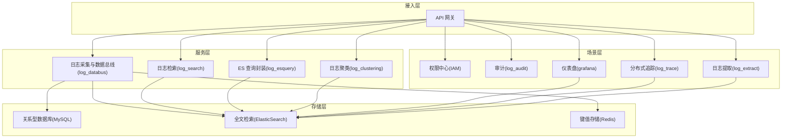
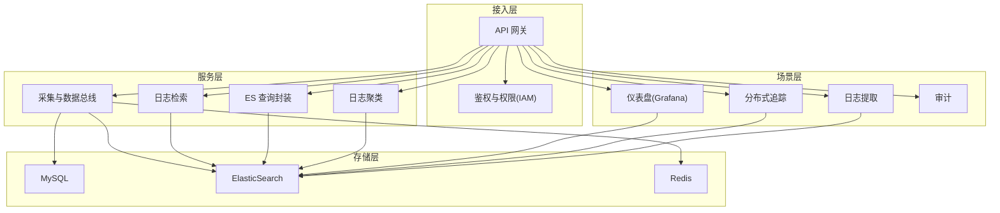
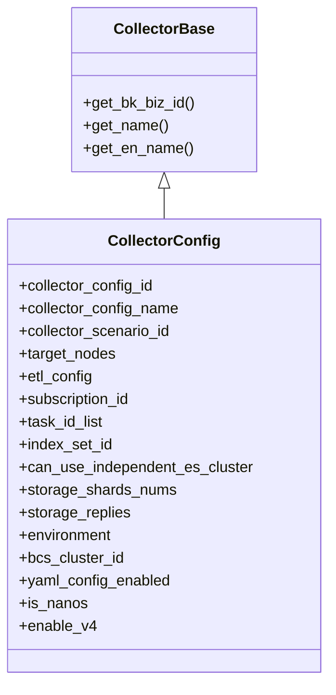
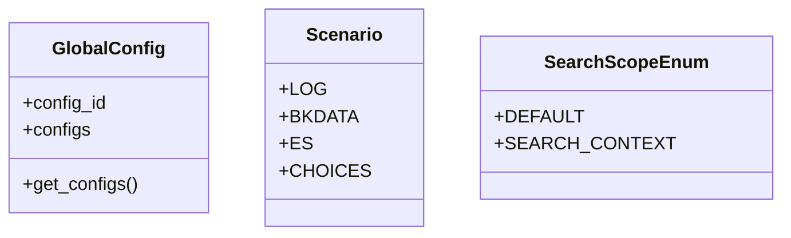
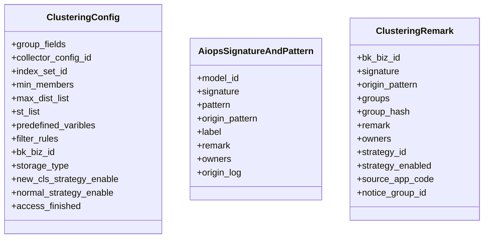
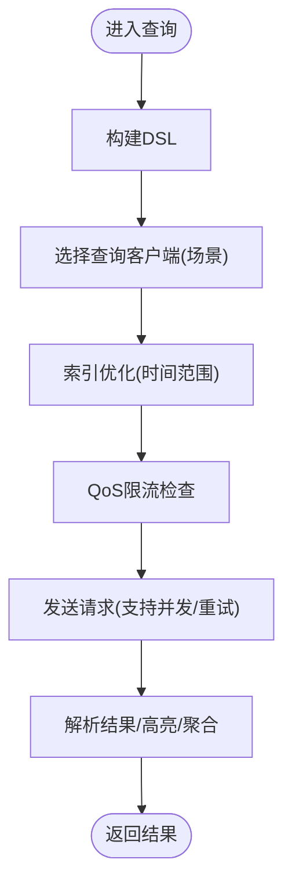
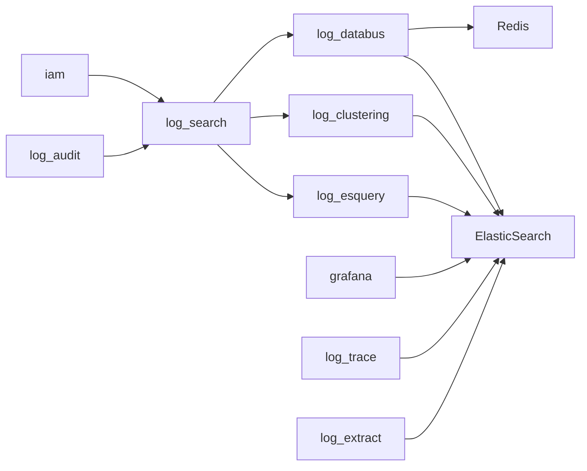

# 项目介绍

<cite>
**本文引用的文件**   
- [README.md](file://README.md)
- [docs/overview/design.md](file://docs/overview/design.md)
- [docs/overview/architecture.md](file://docs/overview/architecture.md)
- [docs/wiki/README.md](file://docs/wiki/README.md)
- [apps/log_databus/__init__.py](file://apps/log_databus/__init__.py)
- [apps/log_search/__init__.py](file://apps/log_search/__init__.py)
- [apps/log_clustering/__init__.py](file://apps/log_clustering/__init__.py)
- [apps/log_esquery/__init__.py](file://apps/log_esquery/__init__.py)
- [apps/log_databus/models.py](file://apps/log_databus/models.py)
- [apps/log_search/models.py](file://apps/log_search/models.py)
- [apps/log_clustering/models.py](file://apps/log_clustering/models.py)
- [apps/log_databus/constants.py](file://apps/log_databus/constants.py)
- [apps/log_search/constants.py](file://apps/log_search/constants.py)
- [apps/log_clustering/constants.py](file://apps/log_clustering/constants.py)
- [settings.py](file://settings.py)
- [config/default.py](file://config/default.py)
</cite>

## 目录
1. [简介](#简介)
2. [项目结构](#项目结构)
3. [核心组件](#核心组件)
4. [架构总览](#架构总览)
5. [详细组件分析](#详细组件分析)
6. [依赖分析](#依赖分析)
7. [性能考虑](#性能考虑)
8. [故障排查指南](#故障排查指南)
9. [结论](#结论)
10. [附录](#附录)

## 简介
蓝鲸日志平台（BK-LOG）是为解决分布式架构下日志收集与查询困难而打造的一站式日志产品。它基于业界主流的全文检索引擎，通过蓝鲸智云专属采集器进行日志采集，提供采集、清洗、检索、上下文、实时日志、关键字/汇聚告警、第三方 ES 接入、分布式跟踪、仪表盘、在线日志文件提取等能力，帮助用户在复杂环境中实现“简单易用”的日志管理。

- 核心价值主张
  - 降低日志采集与查询门槛：统一采集器分发、部署与托管，提供开箱即用的采集与查询体验。
  - 多场景化能力：覆盖服务器日志、容器日志、第三方 ES、计算平台 RT 等多数据源接入。
  - 生命周期管理：支持索引分裂、冷热切换、日志归档，保障海量日志的长期稳定运行。
  - 丰富场景：日志检索、上下文、实时日志、调用链、仪表盘、日志监控、日志提取等。

- 解决的实际问题
  - 分布式环境下采集器部署与运维复杂、采集策略分散、缺乏统一治理。
  - 日志检索效率低、跨集群查询困难、高亮与聚合能力不足。
  - 缺乏统一的生命周期管理与成本控制手段，导致存储膨胀与查询性能下降。
  - 告警与分析能力弱，难以从海量日志中发现异常与趋势。

- 目标用户群体
  - 运维工程师：需要快速定位问题、查看上下文与实时日志。
  - 平台开发者：需要统一的采集与查询能力，支撑多业务线日志需求。
  - 数据分析师：需要基于日志构建仪表盘与趋势分析。
  - 平台管理员：需要统一的采集策略、权限与审计能力。

- 在蓝鲸体系中的定位
  - 作为蓝鲸体系下的日志类 SaaS，BK-LOG 与蓝鲸 PaaS、监控、权限中心、配置平台等产品协同，形成“采集—清洗—检索—分析—告警—运营”的闭环。

**章节来源**
- [README.md:17-36](file://README.md#L17-L36)
- [docs/overview/design.md:3-17](file://docs/overview/design.md#L3-L17)
- [docs/overview/architecture.md:5-16](file://docs/overview/architecture.md#L5-L16)

## 项目结构
BK-LOG 采用模块化分层架构，围绕“采集—清洗—检索—分析—工具—权限—基础设施”组织代码。核心模块包括：
- 日志采集与数据总线（log_databus）：负责采集器分发、采集任务调度、ETL 清洗、存储管理与第三方 ES 接入。
- 日志检索（log_search）：提供统一检索入口、上下文、高亮、聚合、滚动分页、字段统计等能力。
- 日志聚类（log_clustering）：基于 AI/ML 的日志模式识别与异常告警，支持新类告警与数量突增告警。
- ES 查询封装（log_esquery）：对不同场景（LOG/BKDATA/ES）提供统一查询客户端与 DSL 构建、索引优化、QoS 限流。
- 权限与审计（iam、log_audit）、仪表盘（grafana）、分布式追踪（log_trace）、提取工具（log_extract）、通用工具（log_commons）等支撑模块。

**图表来源**
- [docs/overview/architecture.md:5-16](file://docs/overview/architecture.md#L5-L16)

**章节来源**
- [docs/overview/architecture.md:5-16](file://docs/overview/architecture.md#L5-L16)
- [config/default.py:54-95](file://config/default.py#L54-L95)

## 核心组件
- 日志采集与数据总线（log_databus）
  - 职责：采集器部署与订阅、采集任务生命周期管理、ETL 清洗策略、存储集群管理、第三方 ES 接入。
  - 关键模型：采集配置、采集器插件、清洗配置、存储配置等。
  - 关键常量：采集场景、ES 来源类型、可见性策略、ITSMS 审批状态等。

- 日志检索（log_search）
  - 职责：统一检索入口、上下文检索、高亮、聚合分析、滚动分页、字段统计、索引集管理。
  - 关键模型：全局配置、索引集、场景枚举等。
  - 关键常量：搜索范围、时间字段、异步导出配置、标签颜色等。

- 日志聚类（log_clustering）
  - 职责：基于 AI/ML 的日志模式识别、新类告警、数量突增告警、聚类策略与模型管理。
  - 关键模型：聚类配置、样本集、AI 模型、签名与模式、聚类备注等。
  - 关键常量：聚类策略类型、告警阈值、通知方式、默认策略等。

- ES 查询封装（log_esquery）
  - 职责：多场景查询客户端、DSL 构建、索引优化、QoS 限流。
  - 关键模块：查询入口、策略模式、DSL 构建器、索引优化器、QoS 限流器。

**章节来源**
- [apps/log_databus/models.py:102-200](file://apps/log_databus/models.py#L102-L200)
- [apps/log_search/models.py:107-184](file://apps/log_search/models.py#L107-L184)
- [apps/log_clustering/models.py:107-200](file://apps/log_clustering/models.py#L107-L200)
- [apps/log_databus/constants.py:109-181](file://apps/log_databus/constants.py#L109-L181)
- [apps/log_search/constants.py:51-100](file://apps/log_search/constants.py#L51-L100)
- [apps/log_clustering/constants.py:197-200](file://apps/log_clustering/constants.py#L197-L200)

## 架构总览
BK-LOG 采用“接入层—场景层—服务层—存储层”的分层架构：
- 接入层：对外提供统一 API，集成网关与鉴权。
- 场景层：提供权限、审计、仪表盘、分布式追踪、日志提取等场景化能力。
- 服务层：日志接入（采集/清洗/入库）、日志检索（实时探索/统一查询/上下文/调用链）、日志监控（关键字/数值）、日志分析（Grafana 仪表盘）、日志工具（文件提取）。
- 存储层：MySQL（元数据）、ElasticSearch（全文检索）、Redis（缓存/锁）。

**图表来源**
- [docs/overview/architecture.md:5-16](file://docs/overview/architecture.md#L5-L16)

**章节来源**
- [docs/overview/architecture.md:5-16](file://docs/overview/architecture.md#L5-L16)

## 详细组件分析

### 日志采集与数据总线（log_databus）
- 设计理念
  - 统一采集器分发、部署、托管与保护，支持服务器日志、容器日志、第三方 ES、计算平台 RT 等多源接入。
  - 生命周期管理：采集配置、清洗策略、结果表、存储集群、归档与冷热切换。
- 关键流程
  - 采集配置创建与订阅：写入采集配置、申请 data_id、节点管理订阅、立即执行任务、配置清洗策略、配置结果表。
  - ETL 清洗：支持多种清洗策略与数据链路（含 V4），并支持容器化采集。
  - 存储管理：ES 集群连通性检测、分片与副本配置、独立 ES 集群能力。
- 数据模型要点
  - 采集配置模型：包含采集场景、目标节点、清洗配置、存储参数、订阅 ID、任务 ID、ES 集群参数等。
  - 采集器插件与部署参数：采集器配置覆盖、输出格式、环境、集群 ID 等。
- 常量与策略
  - ES 来源类型：支持 AWS、腾讯云、阿里云、Google、私有自建等。
  - 可见性策略：当前业务、多业务、当前租户、全业务、业务属性可见。
  - ITSMS 审批状态：未申请、申请中、失败、完成。

**图表来源**
- [apps/log_databus/models.py:80-200](file://apps/log_databus/models.py#L80-L200)

**章节来源**
- [apps/log_databus/models.py:102-200](file://apps/log_databus/models.py#L102-L200)
- [apps/log_databus/constants.py:109-181](file://apps/log_databus/constants.py#L109-L181)

### 日志检索（log_search）
- 设计理念
  - 统一检索入口，支持上下文检索、高亮、聚合分析、滚动分页、字段统计与索引集管理。
  - 支持异步导出、多场景（LOG/BKDATA/ES）查询与预查询优化。
- 关键流程
  - 检索入口：SearchHandler 初始化、search 入口、多集群查询、滚动分页、高亮处理。
  - 预查询优化：根据时间方向与范围进行降序/升序策略优化。
  - 聚合分析：Terms、DateHistogram 聚合，DSL 构建与结果解析。
- 数据模型与常量
  - 全局配置：统一管理分类、编码、分隔符、存储时长、采集场景、清洗场景、字段类型、时间格式、内置字段等。
  - 场景枚举：日志、计算平台、ES。
  - 搜索范围：默认、上下文检索。
  - 异步导出：时间范围、分片限制、过期时间、通知模板等。

**图表来源**
- [apps/log_search/models.py:107-184](file://apps/log_search/models.py#L107-L184)
- [apps/log_search/constants.py:89-100](file://apps/log_search/constants.py#L89-L100)

**章节来源**
- [apps/log_search/models.py:107-184](file://apps/log_search/models.py#L107-L184)
- [apps/log_search/constants.py:89-180](file://apps/log_search/constants.py#L89-L180)

### 日志聚类（log_clustering）
- 设计理念
  - 基于 AI/ML 的日志模式识别，支持新类告警与数量突增告警，结合数据指纹与聚类策略实现异常发现。
- 关键流程
  - 聚类配置：分组字段、采集项、索引集、样本集、模型、阈值、过滤规则、存储类型等。
  - 模型与模式：AI 模型、签名与模式、聚类备注、负责人与告警组。
  - 告警策略：新类告警与数量突增告警的维度、阈值、通知方式与恢复配置。
- 数据模型与常量
  - 聚类配置模型：包含聚类字段、阈值、过滤规则、存储类型、预测流、在线任务等。
  - 样本集与模型：样本集、AI 模型与实验。
  - 聚类备注：分组信息、哈希、备注、负责人、来源系统、告警组等。

**图表来源**
- [apps/log_clustering/models.py:107-200](file://apps/log_clustering/models.py#L107-L200)

**章节来源**
- [apps/log_clustering/models.py:107-200](file://apps/log_clustering/models.py#L107-L200)
- [apps/log_clustering/constants.py:197-200](file://apps/log_clustering/constants.py#L197-L200)

### ES 查询封装（log_esquery）
- 设计理念
  - 面向多场景（LOG/BKDATA/ES）的统一查询客户端，提供 DSL 构建、索引优化、QoS 限流与并发请求封装。
- 关键流程
  - 查询入口：search/dsl/mapping/scroll 方法，查询优化器初始化。
  - 策略模式：QueryClient 工厂，三种场景客户端实现。
  - DSL 构建：DslBuilder、QueryStringBuilder、QueryFilterBuilder。
  - 索引优化：QueryIndexOptimizer，时间范围索引压缩。
  - QoS 限流：QosThrottle，基于 Redis ZSet 的滑动窗口。
- 并发与重试
  - bulk_request/batch_request 并发封装，OpenTelemetry 上下文传递。
  - DataApiRetryClass 异常触发重试与结果校验重试。

**图表来源**
- [docs/wiki/README.md:21-30](file://docs/wiki/README.md#L21-L30)

**章节来源**
- [docs/wiki/README.md:21-30](file://docs/wiki/README.md#L21-L30)

## 依赖分析
- 模块依赖
  - log_search 依赖 log_databus（采集场景、ES 来源类型）、log_clustering（聚类标签）、grafana（仪表盘）、iam（权限）。
  - log_databus 依赖节点管理（订阅与任务）、计算平台（RT 接入）、ES 集群、Redis（缓存/锁）。
  - log_clustering 依赖 log_search（索引集）、log_databus（ES 来源）、grafana（可视化）。
  - log_esquery 为 log_search 与 log_trace 提供底层查询能力。
- 外部依赖
  - 蓝鲸生态：PaaS、权限中心、配置平台、监控、作业平台等。
  - 存储与中间件：MySQL、ElasticSearch、Redis、Celery。

**图表来源**
- [config/default.py:54-95](file://config/default.py#L54-L95)

**章节来源**
- [config/default.py:54-95](file://config/default.py#L54-L95)

## 性能考虑
- 查询性能
  - 索引优化：QueryIndexOptimizer 基于时间范围压缩索引，减少扫描范围。
  - 预查询优化：根据时间方向与范围采用降序/升序策略，提升检索效率。
  - QoS 限流：QosThrottle 基于 Redis ZSet 实现滑动窗口限流，保障系统稳定性。
- 并发与重试
  - bulk_request/batch_request 并发封装，支持 OpenTelemetry 上下文传递，提升吞吐。
  - DataApiRetryClass 提供异常触发重试与结果校验重试，增强鲁棒性。
- 存储与生命周期
  - 支持索引分裂、冷热切换、日志归档，结合存储分片与副本配置，平衡成本与性能。
- 缓存与锁
  - Redis 缓存与分布式锁（RedisLock）用于热点数据与任务互斥，降低后端压力。

**章节来源**
- [docs/wiki/README.md:27-30](file://docs/wiki/README.md#L27-L30)
- [apps/log_search/constants.py:105-180](file://apps/log_search/constants.py#L105-L180)
- [apps/log_databus/constants.py:109-181](file://apps/log_databus/constants.py#L109-L181)

## 故障排查指南
- 常见问题定位
  - 采集失败：检查采集配置、订阅状态、任务执行记录；确认节点管理接口可用性与返回内容。
  - 查询异常：检查索引映射、时间字段、高亮配置；验证 DSL 构建与查询客户端选择。
  - 聚类告警：核对聚类配置阈值、过滤规则、存储类型；检查模型训练与在线任务状态。
- 错误处理与日志
  - 各模块抛出明确异常类型（如 ES 查询语法异常、字段映射异常、高亮异常、查询服务器不可用等），便于快速定位。
  - 通过中间件与日志配置，记录请求链路与性能指标，辅助问题复盘。
- 环境与配置
  - 确认环境变量（如 DEPLOY_MODE、BKPAAS_ENVIRONMENT）与配置文件（config/default.py）正确加载。
  - 核对 INSTALLED_APPS 与中间件顺序，确保权限、审计、API 网关等模块正常工作。

**章节来源**
- [apps/log_search/constants.py:37-46](file://apps/log_search/constants.py#L37-L46)
- [settings.py:26-47](file://settings.py#L26-L47)
- [config/default.py:113-154](file://config/default.py#L113-L154)

## 结论
BK-LOG 以“低门槛、强能力、可扩展”为核心，围绕采集、清洗、检索、分析与工具化能力，构建了完整的日志平台。其分层架构与模块化设计，使其在分布式场景下具备良好的可维护性与扩展性；通过多场景查询封装、聚类告警与生命周期管理，满足从运维到平台开发的多样化需求。依托蓝鲸生态与完善的 Wiki 文档，用户可快速上手并深入掌握平台能力。

## 附录
- 使用场景与价值
  - 运维排障：实时日志、上下文检索、关键字告警、调用链视图。
  - 平台治理：统一采集策略、权限与审计、多租户隔离。
  - 数据分析：仪表盘、趋势分析、字段统计、异步导出。
- 发展历程与规划
  - 项目持续迭代，Wiki 文档覆盖 50+ 篇核心技术文档，涵盖 API、ES 查询、日志检索、数据管道、分布式追踪、AI 助手、权限与基础设施等模块，体现平台在设计模式、工程实践与可观测性方面的成熟度。
- 版本与部署
  - 通过 config/default.py 加载环境配置，支持 Kubernetes 部署模式；结合 Celery 异步任务与缓存/锁机制，保障高并发场景下的稳定性。

**章节来源**
- [docs/wiki/README.md:107-176](file://docs/wiki/README.md#L107-L176)
- [config/default.py:33-95](file://config/default.py#L33-L95)