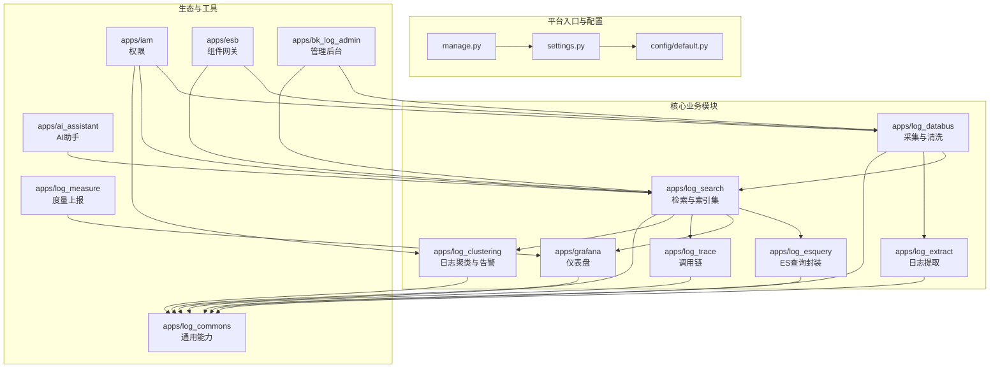
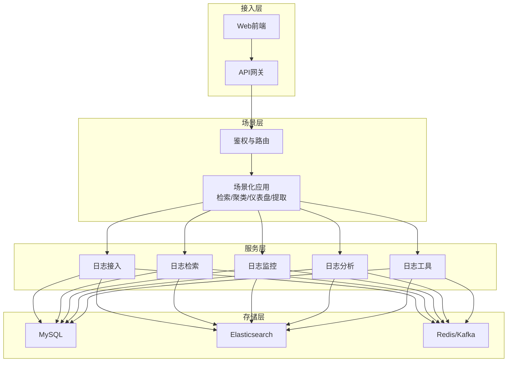
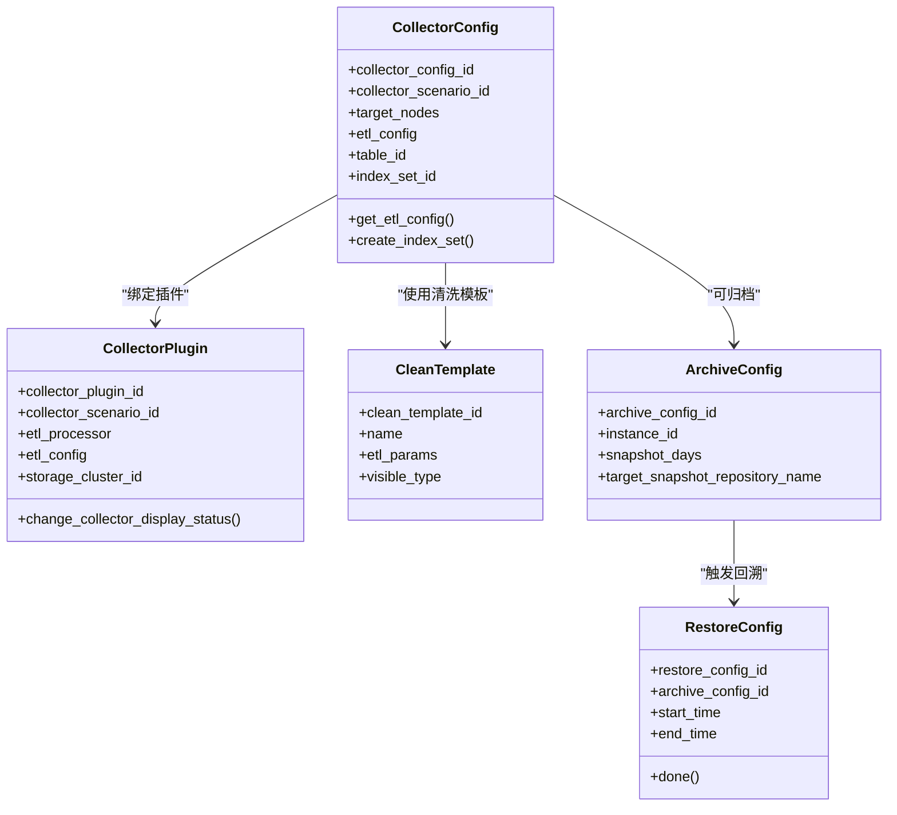
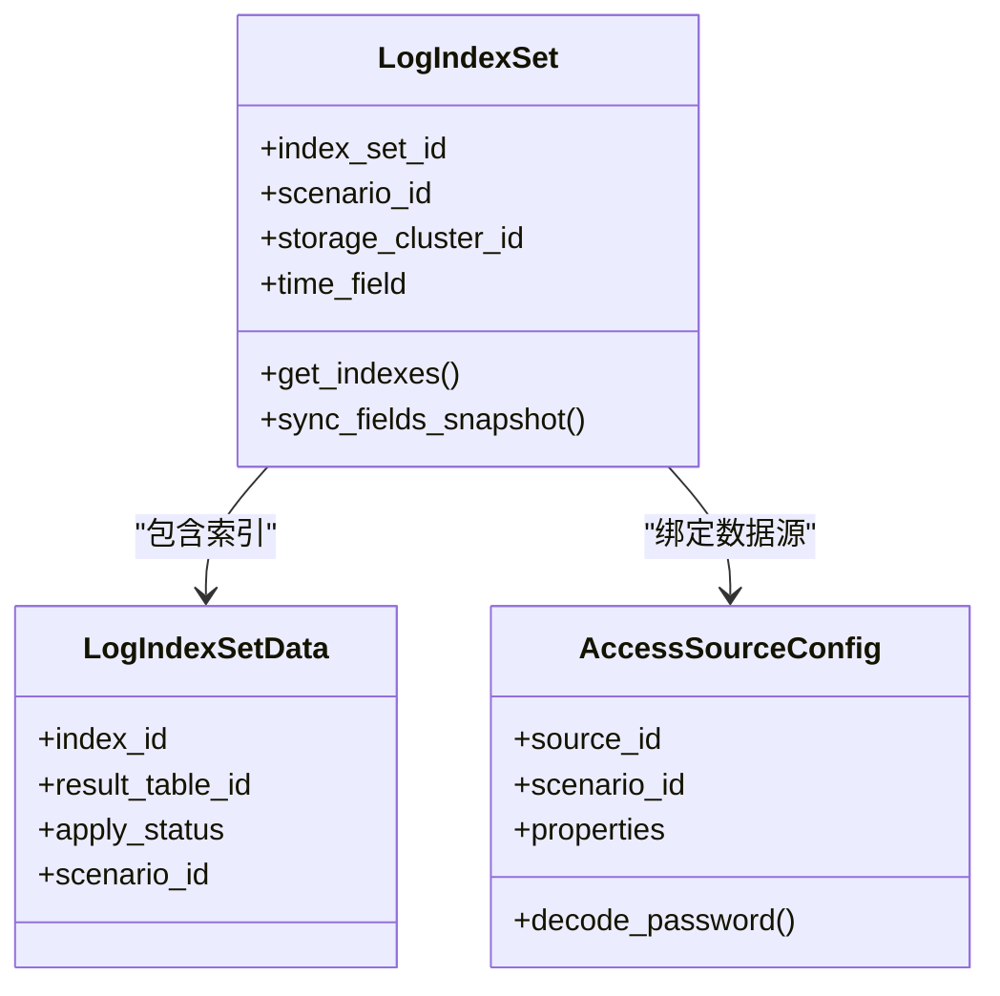
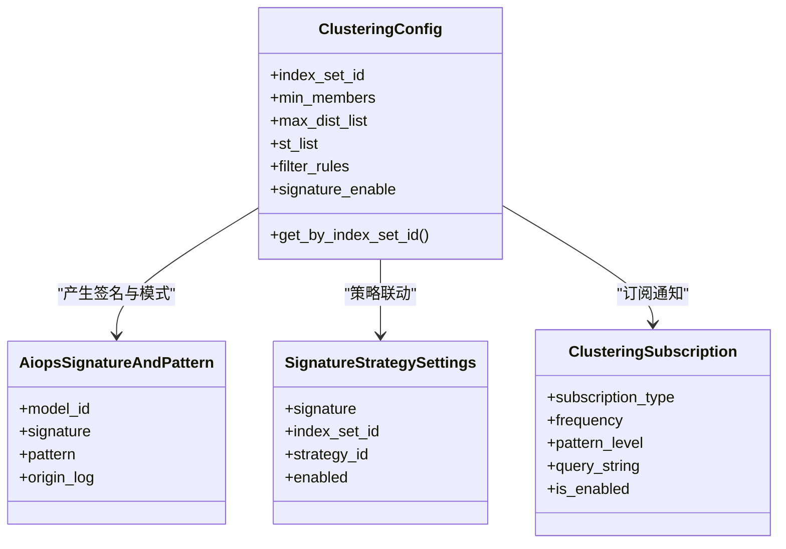
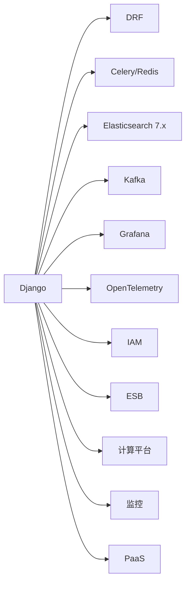

# 项目概述

<cite>
**本文引用的文件**
- [README.md](file://README.md)
- [docs/overview/architecture.md](file://docs/overview/architecture.md)
- [docs/overview/design.md](file://docs/overview/design.md)
- [apps/log_databus/models.py](file://apps/log_databus/models.py)
- [apps/log_search/models.py](file://apps/log_search/models.py)
- [apps/log_clustering/models.py](file://apps/log_clustering/models.py)
- [apps/log_databus/constants.py](file://apps/log_databus/constants.py)
- [apps/log_search/constants.py](file://apps/log_search/constants.py)
- [apps/log_clustering/constants.py](file://apps/log_clustering/constants.py)
- [settings.py](file://settings.py)
- [requirements.txt](file://requirements.txt)
- [config/default.py](file://config/default.py)
- [docs/wiki/version-guideline.md](file://docs/wiki/version-guideline.md)
- [manage.py](file://manage.py)
</cite>

## 目录
1. [简介](#简介)
2. [项目结构](#项目结构)
3. [核心组件](#核心组件)
4. [架构总览](#架构总览)
5. [详细组件分析](#详细组件分析)
6. [依赖分析](#依赖分析)
7. [性能考虑](#性能考虑)
8. [故障排查指南](#故障排查指南)
9. [结论](#结论)
10. [附录](#附录)

## 简介
BK Monitor（蓝鲸日志平台，BK-LOG）是蓝鲸生态中的日志基础设施与分析平台，旨在解决分布式架构下的日志采集、清洗、检索、分析与可视化难题。平台通过蓝鲸专属采集器与多场景接入能力，提供统一的采集、清洗、检索、聚类、仪表盘与告警能力，支撑大规模日志数据的全生命周期管理。

- **目标与价值**  
  - 降低日志采集与检索门槛，统一多来源日志接入（服务器日志、计算平台RT、第三方ES、容器日志、自定义上报等）
  - 提供强大的检索、上下文、实时日志、调用链、仪表盘与日志提取能力
  - 支持日志聚类、指纹识别、告警策略与归档回溯，提升问题定位与运营效率

- **在蓝鲸生态中的定位**  
  - 作为日志类SaaS，与蓝鲸PaaS、监控、计算平台、IAM等产品协同，形成“采集-清洗-检索-分析-可视化-告警”的闭环

- **解决的关键问题**  
  - 分布式环境下日志来源多样、格式不一、体量巨大带来的采集与查询挑战
  - 跨业务、跨集群的日志统一检索与权限治理
  - 大规模日志的生命周期管理（索引分裂、冷热切换、归档与回溯）

- **技术栈与理念**  
  - 技术栈：Django + DRF、Celery + Redis、Elasticsearch、Kafka、Grafana、OpenTelemetry、蓝鲸生态组件
  - 设计理念：以“低门槛、强集成、可扩展”为核心，强调统一入口、统一权限、统一检索与统一分析

- **版本与许可**  
  - 版本遵循语义化版本；发布周期为“每周打标签、每月Release”
  - 许可证：MIT

**章节来源**
- [README.md:17-36](file://README.md#L17-L36)
- [docs/overview/design.md:1-25](file://docs/overview/design.md#L1-L25)
- [docs/overview/architecture.md:1-17](file://docs/overview/architecture.md#L1-L17)
- [docs/wiki/version-guideline.md:1-37](file://docs/wiki/version-guideline.md#L1-L37)
- [README.md:98-102](file://README.md#L98-L102)

## 项目结构
项目采用“多应用模块 + 配置中心 + 文档”的组织方式，核心模块围绕“采集-清洗-检索-分析-告警-归档”展开，配合蓝鲸生态组件实现统一鉴权、统一网关与统一运维。

**图表来源**
- [settings.py:1-47](file://settings.py#L1-L47)
- [config/default.py:54-95](file://config/default.py#L54-L95)
- [config/default.py:445-456](file://config/default.py#L445-L456)

**章节来源**
- [settings.py:1-47](file://settings.py#L1-L47)
- [config/default.py:54-95](file://config/default.py#L54-L95)
- [config/default.py:445-456](file://config/default.py#L445-L456)

## 核心组件
- 采集与清洗（apps/log_databus）  
  - 采集配置、采集插件、清洗模板、归档与回溯、Kafka/ES链路管理
  - 关键模型：CollectorConfig、CollectorPlugin、CleanTemplate、ArchiveConfig、RestoreConfig
  - 关键常量：采集场景、清洗处理器、容器采集类型、归档实例类型等

- 检索与索引集（apps/log_search）  
  - 索引集管理、字段快照、检索历史、导出与异步下载、Trace视图
  - 关键模型：LogIndexSet、LogIndexSetData、AccessSourceConfig
  - 关键常量：场景类型、时间字段类型、导出类型、Agent状态等

- 日志聚类与告警（apps/log_clustering）  
  - 聚类配置、签名与模式、订阅与通知、策略与告警联动
  - 关键模型：ClusteringConfig、AiopsSignatureAndPattern、NoticeGroup、ClusteringSubscription
  - 关键常量：聚类敏感度、订阅类型、存储类型、年同比配置等

- 查询与ES封装（apps/log_esquery）  
  - ES查询DSL构建、客户端封装、QoS与权限控制

- 仪表盘与可视化（apps/grafana）  
  - Grafana数据源、权限、仪表盘与Provisioning

- 调用链（apps/log_trace）  
  - Trace检索与视图

- 日志提取（apps/log_extract）  
  - 通过JOB提取服务器日志文件

- 权限与网关（apps/iam、apps/esb）  
  - RBAC权限、API网关认证与转发

**章节来源**
- [apps/log_databus/models.py:102-412](file://apps/log_databus/models.py#L102-L412)
- [apps/log_databus/models.py:683-780](file://apps/log_databus/models.py#L683-L780)
- [apps/log_databus/models.py:567-681](file://apps/log_databus/models.py#L567-L681)
- [apps/log_search/models.py:337-700](file://apps/log_search/models.py#L337-L700)
- [apps/log_search/models.py:702-800](file://apps/log_search/models.py#L702-L800)
- [apps/log_clustering/models.py:107-344](file://apps/log_clustering/models.py#L107-L344)
- [apps/log_databus/constants.py:388-476](file://apps/log_databus/constants.py#L388-L476)
- [apps/log_search/constants.py:51-100](file://apps/log_search/constants.py#L51-L100)
- [apps/log_clustering/constants.py:234-336](file://apps/log_clustering/constants.py#L234-L336)

## 架构总览
平台采用“接入层-场景层-服务层-存储层”的四层架构，结合蓝鲸生态产品，实现统一入口与能力复用。

**图表来源**
- [docs/overview/architecture.md:5-14](file://docs/overview/architecture.md#L5-L14)

**章节来源**
- [docs/overview/architecture.md:1-17](file://docs/overview/architecture.md#L1-L17)

## 详细组件分析

### 采集与清洗（Databus）
- 采集配置与插件  
  - 采集项（CollectorConfig）：采集场景、目标节点、清洗配置、存储集群、索引集绑定等
  - 采集插件（CollectorPlugin）：插件参数、清洗与存储配置、可见性控制
- 清洗与结果表  
  - 清洗模板（CleanTemplate）、清洗缓存（CleanStash）、高级清洗（BKDataClean）
- 归档与回溯  
  - 归档配置（ArchiveConfig）、回溯配置（RestoreConfig），支持快照仓库与时间窗口回溯
- 容器与K8s  
  - 容器采集类型、命名空间与标签选择、BCS规则与存储集群配置

**图表来源**
- [apps/log_databus/models.py:102-412](file://apps/log_databus/models.py#L102-L412)
- [apps/log_databus/models.py:567-681](file://apps/log_databus/models.py#L567-L681)
- [apps/log_databus/models.py:683-780](file://apps/log_databus/models.py#L683-L780)

**章节来源**
- [apps/log_databus/models.py:102-412](file://apps/log_databus/models.py#L102-L412)
- [apps/log_databus/models.py:567-681](file://apps/log_databus/models.py#L567-L681)
- [apps/log_databus/models.py:683-780](file://apps/log_databus/models.py#L683-L780)
- [apps/log_databus/constants.py:388-476](file://apps/log_databus/constants.py#L388-L476)

### 检索与索引集（Search）
- 索引集（LogIndexSet）  
  - 场景类型（采集/数据平台/第三方ES）、存储集群、时间字段、标签与权限
  - 字段快照与预检、索引列表与权限申请
- 数据源（AccessSourceConfig）  
  - 支持第三方ES接入，含加密存储与去重校验
- 检索与导出  
  - 支持上下文检索、异步导出、滚动查询与导出状态管理

**图表来源**
- [apps/log_search/models.py:337-700](file://apps/log_search/models.py#L337-L700)
- [apps/log_search/models.py:702-800](file://apps/log_search/models.py#L702-L800)

**章节来源**
- [apps/log_search/models.py:337-700](file://apps/log_search/models.py#L337-L700)
- [apps/log_search/models.py:702-800](file://apps/log_search/models.py#L702-L800)
- [apps/log_search/constants.py:51-100](file://apps/log_search/constants.py#L51-L100)

### 日志聚类与告警（Clustering）
- 聚类配置（ClusteringConfig）  
  - 分组字段、阈值与相似度、过滤规则、模型训练与预测流
- 签名与模式（AiopsSignatureAndPattern）  
  - 数据指纹与模式，支持备注、负责人与来源系统
- 订阅与通知（ClusteringSubscription）  
  - 周期性订阅、发送频率、统计维度与查询条件
- 策略联动（SignatureStrategySettings、NoticeGroup）  
  - 基于签名的监控策略与通知组

**图表来源**
- [apps/log_clustering/models.py:107-344](file://apps/log_clustering/models.py#L107-L344)
- [apps/log_clustering/constants.py:234-336](file://apps/log_clustering/constants.py#L234-L336)

**章节来源**
- [apps/log_clustering/models.py:107-344](file://apps/log_clustering/models.py#L107-L344)
- [apps/log_clustering/constants.py:234-336](file://apps/log_clustering/constants.py#L234-L336)

### 查询与ES封装（Esquery）
- DSL构建与客户端封装  
  - 提供统一的查询构建器与客户端，屏蔽ES版本差异
- QoS与权限  
  - 查询路由、权限校验与异常处理

**章节来源**
- [apps/log_esquery/views.py](file://apps/log_esquery/views.py)
- [apps/log_esquery/utils/es_client.py](file://apps/log_esquery/utils/es_client.py)
- [apps/log_esquery/utils/es_route.py](file://apps/log_esquery/utils/es_route.py)

### 仪表盘与可视化（Grafana）
- Grafana数据源与权限  
  - 业务维度权限控制、Provisioning配置
- 与检索/聚类联动  
  - 通过统一索引集与查询接口，实现仪表盘与日志分析的无缝衔接

**章节来源**
- [apps/grafana/data_source.py](file://apps/grafana/data_source.py)
- [apps/grafana/permissions.py](file://apps/grafana/permissions.py)
- [apps/grafana/provisioning.py](file://apps/grafana/provisioning.py)

### 调用链（Trace）
- Trace检索与视图  
  - 基于索引集与时间字段，提供Trace列表与详情视图

**章节来源**
- [apps/log_trace/views.py](file://apps/log_trace/views.py)
- [apps/log_trace/handlers/](file://apps/log_trace/handlers/)

### 日志提取（Extract）
- 通过JOB提取服务器日志文件  
  - 支持批量与异步导出，结合权限与通知机制

**章节来源**
- [apps/log_extract/views/](file://apps/log_extract/views/)
- [apps/log_extract/tasks.py](file://apps/log_extract/tasks.py)

## 依赖分析
- 运行时依赖  
  - Django、DRF、Celery、Redis、Gunicorn、ES（7.x）、Kafka、Grafana、OpenTelemetry
- 生态依赖  
  - 蓝鲸组件（ESB、IAM、API网关、计算平台、监控、用户管理等）
- 配置与部署  
  - settings.py按环境加载config/default.py；INSTALLED_APPS与中间件按环境注入

**图表来源**
- [requirements.txt:1-146](file://requirements.txt#L1-L146)
- [config/default.py:54-95](file://config/default.py#L54-L95)

**章节来源**
- [requirements.txt:1-146](file://requirements.txt#L1-L146)
- [config/default.py:54-95](file://config/default.py#L54-L95)

## 性能考虑
- 检索性能  
  - 合理设置时间字段与索引分片/副本，利用字段快照减少映射查询开销
  - 控制滚动查询与异步导出的并发与分片数，避免ES压力峰值
- 采集与清洗  
  - 采集链路与清洗处理器的选择应与数据量匹配，避免过度清洗导致延迟
  - 容器日志采集建议使用命名空间与标签过滤，减少无关日志
- 异步任务  
  - Celery队列与并发数按业务负载调整，高优先级队列用于关键任务
- 可观测性  
  - 启用OTLP日志与指标上报，结合Grafana仪表盘进行容量与性能监控

[本节为通用指导，无需特定文件引用]

## 故障排查指南
- 采集失败  
  - 检查采集项状态与节点管理订阅状态，确认采集器版本与配置
  - 关注容器采集的命名空间与标签选择是否正确
- 检索异常  
  - 校验索引集时间字段与索引映射，确认字段快照是否更新
  - 检查权限与数据源配置（如第三方ES）
- 聚类告警  
  - 核对聚类配置阈值与过滤规则，确认签名与模式是否正确生成
  - 检查订阅频率与通知组配置
- 导出与回溯  
  - 关注异步导出状态与过期时间，归档回溯需确认快照仓库与时间窗口

**章节来源**
- [apps/log_databus/models.py:346-386](file://apps/log_databus/models.py#L346-L386)
- [apps/log_search/models.py:636-653](file://apps/log_search/models.py#L636-L653)
- [apps/log_clustering/models.py:212-244](file://apps/log_clustering/models.py#L212-L244)

## 结论
BK Monitor（BK-LOG）通过“采集-清洗-检索-分析-告警-归档”的完整链路，结合蓝鲸生态能力，为分布式架构下的日志全生命周期管理提供了标准化、低门槛、可扩展的解决方案。对于初学者，建议从采集与检索入手，逐步掌握索引集与字段快照；对于资深开发者，可深入容器采集、聚类与仪表盘扩展，结合Celery与ES优化性能与可靠性。

[本节为总结性内容，无需特定文件引用]

## 附录
- 版本与发布  
  - 迭代周期：每周打标签、每月Release；版本号遵循语义化版本
- 许可证  
  - 项目基于MIT许可证
- 启动与运行  
  - 通过manage.py与settings.py加载配置，按环境变量切换部署模式

**章节来源**
- [docs/wiki/version-guideline.md:1-37](file://docs/wiki/version-guideline.md#L1-L37)
- [README.md:98-102](file://README.md#L98-L102)
- [manage.py:1-31](file://manage.py#L1-L31)
- [settings.py:1-47](file://settings.py#L1-L47)