# BKLOG 蓝鲸日志平台核心技术文档

> 本文档由多Agent并行扫描生成，涵盖 bklog 项目后端核心模块的技术架构与设计亮点。
>
> 生成日期：2026-04-29

---

## 目录

1. [项目概览](#1-项目概览)
2. [整体架构图](#2-整体架构图)
3. [核心模块详解](#3-核心模块详解)
   - [3.1 api/ - API统一调用层](#31-api---api统一调用层)
   - [3.2 log_esquery/ - ES查询底层封装](#32-log_esquery---es查询底层封装)
   - [3.3 log_commons/ - 公共组件层](#33-log_commons---公共组件层)
   - [3.4 log_search/ - 日志检索核心](#34-log_search---日志检索核心)
   - [3.5 log_databus/ - 数据管道模块](#35-log_databus---数据管道模块)
   - [3.6 log_trace/ - 分布式追踪](#36-log_trace---分布式追踪)
   - [3.7 ai_assistant/ - AI助手模块](#37-ai_assistant---ai助手模块)
   - [3.8 iam/ - 权限管理模块](#38-iam---权限管理模块)
4. [基础设施层](#4-基础设施层)
5. [核心技术模式总结](#5-核心技术模式总结)
6. [学习路径建议](#6-学习路径建议)

---

## 1. 项目概览

### 项目定位

**BK-LOG 蓝鲸日志平台** 是企业级日志管理平台，提供日志采集、清洗、检索、归档、提取、调用链追踪等功能。

### 技术栈

| 层级 | 技术 |
|-----|-----|
| **Web框架** | Django 4.2 + Django REST Framework 3.15 |
| **异步任务** | Celery 5.4 + django-celery-beat |
| **缓存** | Redis 4.4（单机/哨兵模式） |
| **搜索引擎** | Elasticsearch 5/6/7 多版本兼容 |
| **消息队列** | Kafka（支持SSL/SASL安全协议） |
| **数据库** | MySQL（pymysql + Django ORM） |
| **容器编排** | Kubernetes 18.20 |
| **AI能力** | LangChain + aidev-agent + langfuse |
| **可观测性** | OpenTelemetry + Prometheus + OTLP |

---

## 2. 整体架构图

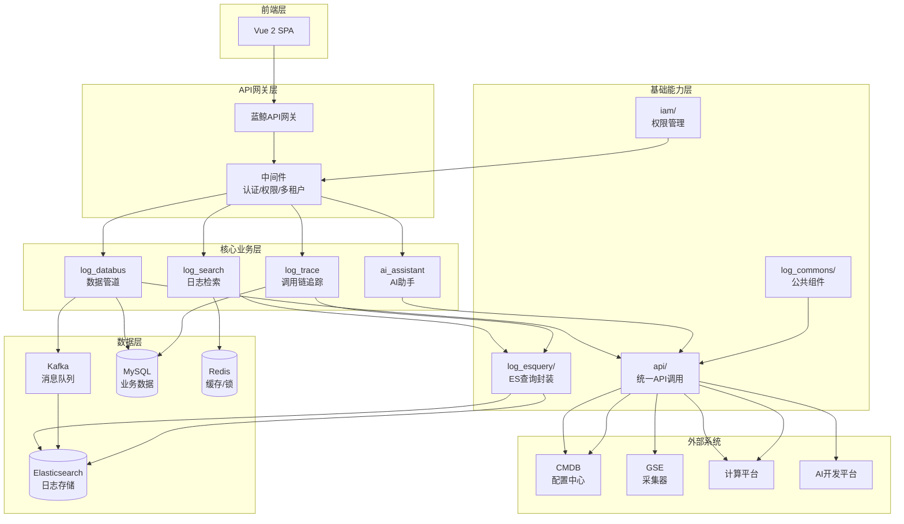

---

## 3. 核心模块详解

---

### 3.1 api/ - API统一调用层

> 📍 入口文件：`apps/api/__init__.py` → `apps/api/base.py`

#### 模块职责

作为整个系统与蓝鲸平台各子系统（CMDB、Job、GSE、数据平台、监控平台等）交互的**统一门面**，封装 HTTP 请求的完整生命周期。

#### 核心类设计

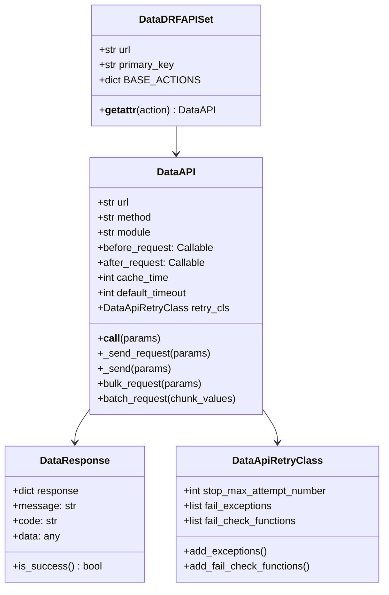

#### 设计亮点

| 特性 | 说明 | 代码位置 |
|-----|-----|---------|
| **钩子函数模式** | `before_request` 参数预处理，`after_request` 响应后处理 | base.py:332-418 |
| **智能重试机制** | 异常触发重试 + 结果校验重试，策略模式 | base.py:108-174 |
| **并发请求封装** | `bulk_request` 分页并发，`batch_request` 切片并发 | base.py:632-741 |
| **DRF风格API集合** | 自动生成 list/create/update/retrieve/delete 方法 | base.py:804-904 |
| **懒加载机制** | `SimpleLazyObject` 避免循环引用 | __init__.py:40-97 |
| **多租户支持** | 动态获取 bk_tenant_id | base.py:541-553 |

#### 关键API模块

| 模块名 | 用途 |
|-------|-----|
| `BKLoginApi` | 用户登录、租户管理 |
| `CCApi` | CMDB业务、主机查询 |
| `BkDataMetaApi` | 数据平台元信息 |
| `BkDataDatabusApi` | 数据接入管理 |
| `TransferApi` | Transfer服务接口 |
| `GrafanaApi` | Grafana集成 |
| `IAMApi` | 权限中心接口 |

#### 学习入口

```
1. apps/api/__init__.py → 了解模块导出
2. apps/api/base.py → DataAPI.__call__() 核心流程
3. apps/api/modules/utils.py → 钩子函数实践（ESB认证注入）
4. apps/api/modules/cc.py → 具体API定义示例
```

---

### 3.2 log_esquery/ - ES查询底层封装

> 📍 入口文件：`apps/log_esquery/esquery/esquery.py`

#### 模块职责

统一管理 Elasticsearch 查询的 DSL 构建、客户端连接、索引优化、查询性能控制。

#### 分层架构

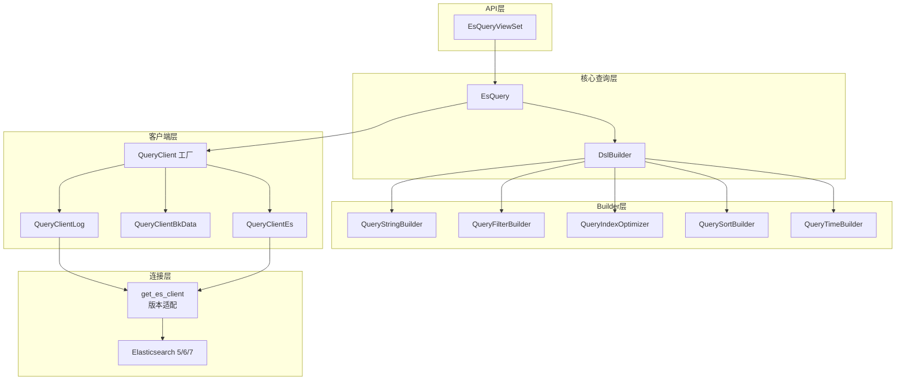

#### 多场景策略模式

| scenario_id | 客户端类 | 数据来源 |
|------------|---------|---------|
| `log` | QueryClientLog | 蓝鲸采集（通过TransferApi获取集群信息） |
| `bkdata` | QueryClientBkData | 数据平台（通过BkDataQueryApi查询） |
| `es` | QueryClientEs | 第三方ES集群 |

#### 索引优化策略

```python
# QueryIndexOptimizer 根据时间范围智能缩小索引
# 单日查询：index_YYYYMMDD*
# 15日内查询：按日期逐一展开
# 超过14日且单月：index_YYYYMM*
# 多月查询：仅保留最近6个月
```

#### 设计亮点

| 特性 | 说明 |
|-----|-----|
| **ES版本适配** | 动态选择 elasticsearch5/6/7 客户端库 |
| **DSL构建器链** | Builder模式组合各组件 |
| **QoS滑动窗口限流** | Redis ZSet实现精准限流 |
| **超时统一捕获** | 兼容各版本ES客户端超时异常 |
| **Nested字段支持** | luqum解析Lucene语法转nested query |

#### 学习入口

```
1. apps/log_esquery/esquery/esquery.py → EsQuery.search()
2. apps/log_esquery/esquery/dsl_builder/dsl_builder.py → DSL构建
3. apps/log_esquery/esquery/client/QueryClient.py → 客户端工厂
4. apps/log_esquery/esquery/builder/query_index_optimizer.py → 索引优化
```

---

### 3.3 log_commons/ - 公共组件层

> 📍 入口文件：`apps/log_commons/models.py`

#### 模块职责

提供跨模块共享的基础能力，不直接承载业务逻辑。

#### 核心组件

| 组件 | 文件 | 功能 |
|-----|-----|-----|
| **IPv6适配** | adapt_ipv6.py | DHCP环境下主机ID与IP双向填充 |
| **Token工厂** | token.py | BaseTokenHandler + TokenHandlerFactory |
| **ITSM审批** | models.py | 外部权限申请审批流程 |
| **JOB封装** | job.py | JobHelper脚本执行调用 |
| **分享处理** | share.py | 临时分享链接Token生成 |

#### IPv6双栈适配设计

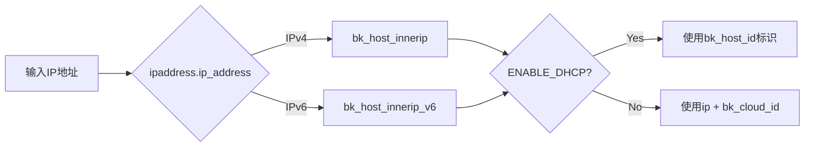

#### Token工厂模式

```python
class TokenHandlerFactory:
    _HANDLERS = {
        ApiTokenAuthType.CODECC.value: CodeccTokenHandler,
    }

    @classmethod
    def get_handler(cls, token_type: str) -> BaseTokenHandler:
        handler_class = cls._HANDLERS.get(token_type)
        return handler_class()
```

#### 被依赖情况

| 模块 | 使用组件 |
|-----|---------|
| log_extract | fill_bk_host_id, ExternalPermission, JobHelper |
| log_databus | JobHelper, get_ip_field, BkIpSerializer |
| log_unifyquery | ApiAuthToken |
| grafana | ApiAuthToken |

#### 学习入口

```
1. apps/log_commons/adapt_ipv6.py → IPv6适配（代码简洁）
2. apps/log_commons/token.py → 工厂模式设计
3. apps/log_commons/models.py → 核心数据模型
```

---

### 3.4 log_search/ - 日志检索核心

> 📍 入口文件：`apps/log_search/handlers/search/search_handlers_esquery.py`

#### 模块职责

日志数据的搜索、聚合、导出等核心功能，支持 LOG/BKDATA/ES 三种场景。

#### 搜索流程

```mermaid
flowchart TB
    A[POST /search/] --> B[SearchViewSet]
    B --> C{FeatureToggle}
    C -->|UnifyQuery| D[调用UnifyQuery服务]
    C -->|Direct| E[SearchHandler]

    E --> F[__init__初始化]
    F --> F1[索引集indices]
    F --> F2[时间字段time_field]
    F --> F3[查询串query_string]
    F --> F4[排序sort_list]
    F --> F5[高亮highlight]
    F --> F6[脱敏配置]

    F --> G[search()]
    G --> H{预查询启用?}
    H -->|Yes| I[_multi_search预查询<br/>缩小时间范围]
    H -->|No| J[_multi_search正常查询]
    I --> K{结果不足?}
    K -->|Yes| L[全量查询]
    K -->|No| M[处理结果]
    J --> M
    L --> M

    M --> N{需要滚动?}
    N -->|Yes| O[_scroll滚动分页]
    N -->|No| P[_deal_query_result]
    O --> P
    P --> Q[脱敏处理]
    Q --> R[返回响应]
```

#### OPERATORS映射表

```python
# constants.py:1658-1732
OPERATORS = {
    "keyword": ["EQ_WILDCARD", "NE_WILDCARD", "EXISTS", "CONTAINS"],
    "text": ["CONTAINS_MATCH_PHRASE", "NOT_CONTAINS_MATCH_PHRASE"],
    "integer/long/double": ["EQ", "NE", "LT", "LTE", "GT", "GTE", "EXISTS"],
    "date": ["EQ", "NE", "LT", "LTE", "GT", "GTE", "EXISTS"],
    "boolean": ["IS_TRUE", "IS_FALSE", "EXISTS"],
}
```

#### 设计亮点

| 特性 | 说明 |
|-----|-----|
| **预查询优化** | 先缩小时间范围查询，不足再全量 |
| **多集群合并** | StorageClusterRecord记录历史集群，并发查询合并 |
| **滚动分页** | 结果超10000自动启用scroll模式 |
| **特性开关架构** | DIRECT_ESQUERY/UNIFY_QUERY_SEARCH灵活切换 |
| **ES错误智能转换** | ES_ERROR_PATTERNS匹配常见错误 |
| **Mapping缓存** | @cache_one_minute装饰器 |

#### 性能优化技巧

| 技术 | 说明 |
|-----|-----|
| track_total_hits=False | 不统计总数 |
| only_for_agg=True | 只聚合模式，size=0 |
| 预查询 | 缩小时间范围 |
| 字段预检查 | 初始化时获取必要字段 |

#### 学习入口

```
1. apps/log_search/handlers/search/search_handlers_esquery.py → SearchHandler
2. apps/log_search/constants.py → OPERATORS映射(1658-1732)
3. apps/log_search/handlers/search/aggs_handlers.py → 聚合处理
4. apps/log_search/handlers/search/mapping_handlers.py → 字段映射
```

---

### 3.5 log_databus/ - 数据管道模块

> 📍 入口文件：`apps/log_databus/handlers/collector/base.py`

#### 模块职责

日志数据的全生命周期管理：采集、清洗、存储、归档。

#### 数据流架构

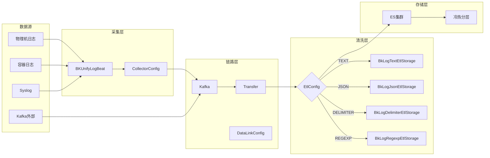

#### 清洗策略模式

```python
class EtlStorage:
    @classmethod
    def get_instance(cls, etl_config):
        mapping = {
            EtlConfig.BK_LOG_TEXT: "BkLogTextEtlStorage",
            EtlConfig.BK_LOG_JSON: "BkLogJsonEtlStorage",
            EtlConfig.BK_LOG_DELIMITER: "BkLogDelimiterEtlStorage",
            EtlConfig.BK_LOG_REGEXP: "BkLogRegexpEtlStorage",
        }
        return import_string(mapping[etl_config])()
```

#### 责任链模式 - 采集检索

```python
RETRIEVE_CHAIN = [
    "set_itsm_info",
    "set_split_rule",
    "set_target",
    "set_default_field",
    "complement_metadata_info",
    "complement_nodemen_info",
    "fields_is_empty",
    "deal_time",
    "add_container_configs",
    "encode_yaml_config",
]

def retrieve(self):
    for process in RETRIEVE_CHAIN:
        collector_config = getattr(self, process)(collector_config, context)
    return collector_config
```

#### 多处理器架构

| 处理器 | 适用场景 |
|-------|---------|
| TransferEtlHandler | 轻量级清洗（默认） |
| BKBaseEtlHandler | 高级清洗（计算平台） |

#### 异步任务设计

| 任务类型 | 示例 |
|---------|-----|
| **定时任务** | collector_status（每日01:00）、sync_storage_capacity（每小时） |
| **高优先级即时** | create_container_release、update_collector_storage_config |

#### 学习入口

```
1. apps/log_databus/handlers/collector/base.py → 采集管理
2. apps/log_databus/handlers/etl/base.py → 清洗处理
3. apps/log_databus/handlers/etl_storage/base.py → 清洗存储策略
4. apps/log_databus/tasks/collector.py → 异步任务
```

---

### 3.6 log_trace/ - 分布式追踪

> 📍 入口文件：`apps/log_trace/apps.py` → `apps/log_trace/trace/__init__.py`

#### 模块职责

两个核心子系统：
1. **OpenTelemetry集成**：系统自身自动埋点
2. **Trace数据查询**：用户调用链分析

#### OpenTelemetry埋点组件

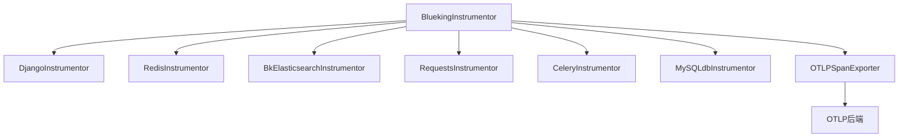

#### 协议适配器模式

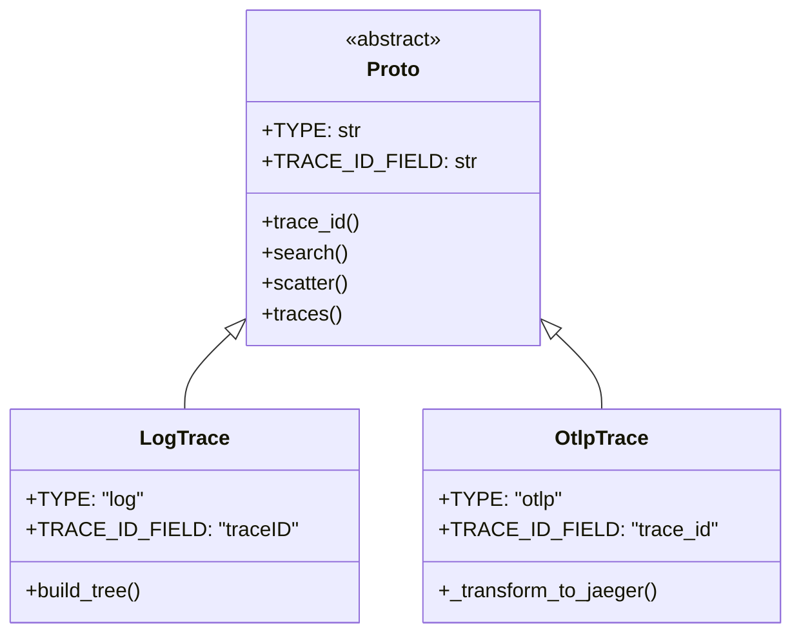

#### 调用链树构建

- 递归构建父子Span关系
- 支持双向查找（从任意节点构建完整树）
- 自动转换为Jaeger兼容格式

#### 设计亮点

| 特性 | 说明 |
|-----|-----|
| **懒加载Span处理器** | LazyBatchSpanProcessor延迟启动工作线程 |
| **协议自动识别** | MUST_MATCH_FIELDS判断ES索引中Trace类型 |
| **Jaeger格式输出** | 前端统一展示 |
| **collapse去重** | ES查询按traceID去重 |

#### 学习入口

```
1. apps/log_trace/apps.py → AppConfig启动入口
2. apps/log_trace/trace/__init__.py → OpenTelemetry总控
3. apps/log_trace/handlers/proto/proto.py → 协议抽象基类
4. apps/log_trace/handlers/proto/log.py → Log协议实现
```

---

### 3.7 ai_assistant/ - AI助手模块

> 📍 入口文件：`apps/ai_assistant/views.py`

#### 模块职责

提供智能化日志分析、查询语句生成等AI辅助功能。

#### 技术栈

| 技术 | 版本 | 用途 |
|-----|-----|-----|
| aidev-agent | 1.0.3 | 蓝鲸AI开发平台SDK |
| langchain | 0.3.27 | LLM编排框架 |
| langfuse | 2.60.5 | LLM可观测性 |

#### AI处理流程

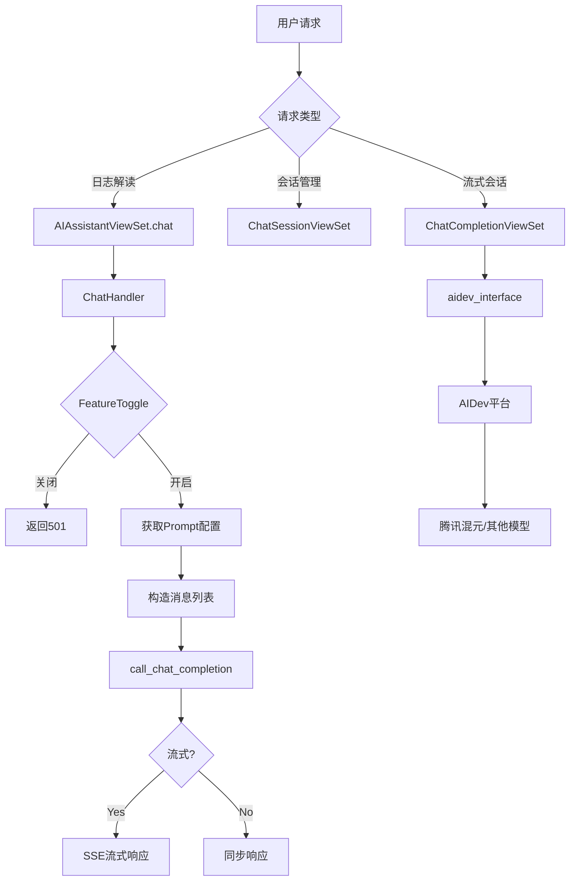

#### 本地命令处理器

| 命令 | Handler | 功能 |
|-----|---------|-----|
| `log_analysis` | LogAnalysisCommandHandler | 获取日志上下文，清理重复字段 |
| `querystring_generate` | QuerystringGenerateCommandHandler | 自然语言→查询语句 |

#### 设计亮点

| 特性 | 说明 |
|-----|-----|
| **特性开关驱动** | FeatureToggleObject业务级灰度 |
| **SSE流式响应** | 实时返回AI生成内容 |
| **上下文智能清理** | 移除系统字段、去除重复KV |
| **可观测性** | Prometheus指标 + Langfuse |
| **装饰器注册** | @local_command_handler扩展命令 |

#### 学习入口

```
1. apps/ai_assistant/views.py → AIAssistantViewSet.chat()
2. apps/ai_assistant/handlers/chat.py → ChatHandler
3. apps/ai_assistant/local_command_handlers.py → 命令处理器
4. apps/ai_assistant/constants.py → Prompt配置
```

---

### 3.8 iam/ - 权限管理模块

> 📍 入口文件：`apps/iam/__init__.py` → `apps/iam/handlers/permission.py`

#### 模块职责

与蓝鲸IAM系统集成，实现RBAC + ABAC权限模型。

#### 权限模型

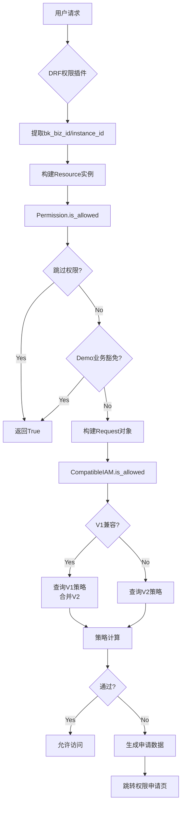

#### 系统动作定义

| 动作 | 类型 | 关联资源 |
|-----|-----|---------|
| view_business_v2 | view | Business |
| search_log_v2 | view | Indices |
| manage_collection_v2 | manage | Collection |
| create_es_source_v2 | create | Business |
| manage_indices_v2 | manage | Indices |

#### DRF权限插件体系

| 类名 | 功能 |
|-----|-----|
| IAMPermission | 基础权限类 |
| BusinessActionPermission | 从请求提取bk_biz_id |
| InstanceActionPermission | 从URL kwargs提取实例ID |
| BatchIAMPermission | 批量实例权限校验 |
| insert_permission_field | 响应装饰器，插入权限字段 |

#### 设计亮点

| 特性 | 说明 |
|-----|-----|
| **V1/V2兼容** | CompatibleIAM策略合并 |
| **Demo业务豁免** | 读权限默认允许 |
| **资源路径注入** | _bk_iam_path_自动计算 |
| **多租户支持** | bk_tenant_id数据隔离 |
| **迁移工具** | iam_upgrade_action_v2命令 |

#### 学习入口

```
1. apps/iam/handlers/permission.py → Permission主类
2. apps/iam/handlers/actions.py → 动作枚举定义
3. apps/iam/handlers/resources.py → 资源类型定义
4. apps/iam/handlers/drf.py → DRF权限插件
```

---

## 4. 基础设施层

### 4.1 Celery 异步任务

#### 配置要点

```python
# config/default.py
CELERYD_CONCURRENCY = 2  # 并发数
CELERY_TASK_SERIALIZER = "pickle"
CELERYBEAT_SCHEDULER = "django_celery_beat.schedulers:DatabaseScheduler"
BK_LOG_HIGH_PRIORITY_QUEUE = "celery"  # 高优先级队列
```

#### 任务类型

| 类型 | 装饰器 | 用途 |
|-----|-------|-----|
| 定时任务 | @periodic_task | 巡检、同步 |
| 高优先级 | @high_priority_task | 即时操作 |
| 分布式锁 | @share_lock(ttl=600) | 防重复执行 |

#### 任务模块分布

- `apps/log_search/tasks/` - 索引集管理、异步导出
- `apps/log_databus/tasks/` - 采集管理、归档处理
- `apps/log_extract/tasks/` - 日志提取

### 4.2 Redis 缓存

#### 多模式支持

```python
# 单机模式
REDIS_HOST = "127.0.0.1"
REDIS_PORT = 6379

# Sentinel哨兵模式
REDIS_SENTINEL_HOST = ""
REDIS_SENTINEL_MASTER_NAME = "mymaster"
```

#### 缓存装饰器

```python
cache_half_minute = functools.partial(using_cache, duration=30)
cache_one_minute = functools.partial(using_cache, duration=60)
cache_five_minute = functools.partial(using_cache, duration=300)
cache_one_hour = functools.partial(using_cache, duration=3600)
```

#### 分布式锁

- `RedisLock` - SET NX实现
- `service_lock` - 上下文管理器
- `share_lock` - 定时任务防重复

### 4.3 Elasticsearch

#### 版本适配

```python
if version.startswith("5."):
    es_client = Elasticsearch5
elif version.startswith("6."):
    es_client = Elasticsearch6
else:
    es_client = Elasticsearch  # 7.x+
```

#### 关键配置

| 配置 | 说明 |
|-----|-----|
| ES_SHARDS_SIZE | 分片大小（默认30G） |
| ES_REPLICAS | 副本数 |
| ES_STORAGE_DEFAULT_DURATION | 默认存储周期 |
| ES_QUERY_TIMEOUT | 查询超时（55s） |

#### 冷热数据分层

- 热数据节点：高频查询
- 冷数据节点：历史数据归档

### 4.4 Kafka

#### 安全协议

| 协议 | 条件 |
|-----|-----|
| PLAINTEXT | 无认证无加密 |
| SASL_PLAINTEXT | 用户名密码认证 |
| SSL | TLS加密 |
| SASL_SSL | 认证+加密 |

### 4.5 MySQL

- Django ORM标准API
- django_dbconn_retry自动重试
- pymysql作为MySQLdb替代

---

## 5. 核心技术模式总结

### 设计模式应用

| 模式 | 应用位置 | 说明 |
|-----|---------|-----|
| **策略模式** | log_esquery/QueryClient, log_databus/EtlStorage | 多场景/多清洗策略切换 |
| **工厂模式** | api/DataAPI, log_commons/TokenHandlerFactory | 统一创建对象 |
| **模板方法** | api/before_request/after_request | 请求生命周期扩展 |
| **Builder模式** | log_esquery/DslBuilder | DSL链式构建 |
| **责任链模式** | log_databus/RETRIEVE_CHAIN | 采集检索链式处理 |
| **装饰器模式** | api/DataApiRetryClass, utils/cache.py | 功能增强 |
| **适配器模式** | log_trace/Proto | 多协议适配 |

### 架构设计原则

| 原则 | 体现 |
|-----|-----|
| **分层架构** | ViewSet → Handler → API/ESQuery |
| **依赖倒置** | 抽象基类定义接口，具体实现动态导入 |
| **开闭原则** | 特性开关扩展功能，不修改核心代码 |
| **单一职责** | 模块职责清晰，不越界 |
| **接口隔离** | DRF权限插件细分场景 |

---

## 6. 学习路径建议

### 推荐学习顺序

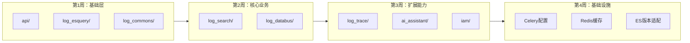

### 关键文件清单

| 模块 | 核心文件 | 重点内容 |
|-----|---------|---------|
| api | base.py:191-320 | DataAPI.__call__ |
| log_esquery | esquery.py:643-711 | EsQuery.search |
| log_search | search_handlers_esquery.py | SearchHandler |
| log_databus | etl_storage/base.py | EtlStorage工厂 |
| log_trace | trace/__init__.py | BluekingInstrumentor |
| iam | permission.py | Permission.is_allowed |

### 实践建议

1. **追踪一个请求**：从 API 入口断点调试，跟踪完整流程
2. **画架构图**：用 Mermaid 梳理模块关系
3. **写学习笔记**：记录关键类职责和设计亮点
4. **对比阅读**：相似模块对比设计差异（如 EtlStorage vs QueryClient）

---

## 附录：模块依赖关系图

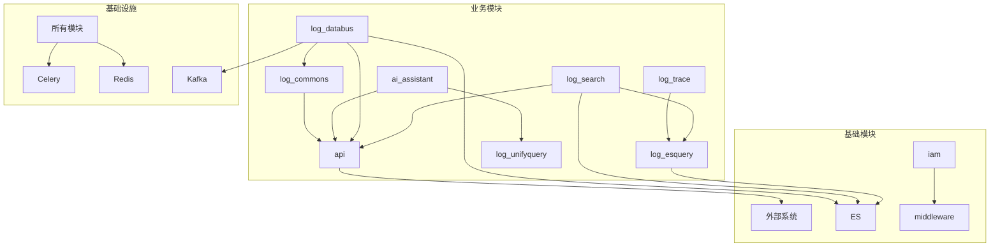

---

> 📝 本文档涵盖 bklog 项目后端核心技术，可作为学习指南和架构参考。