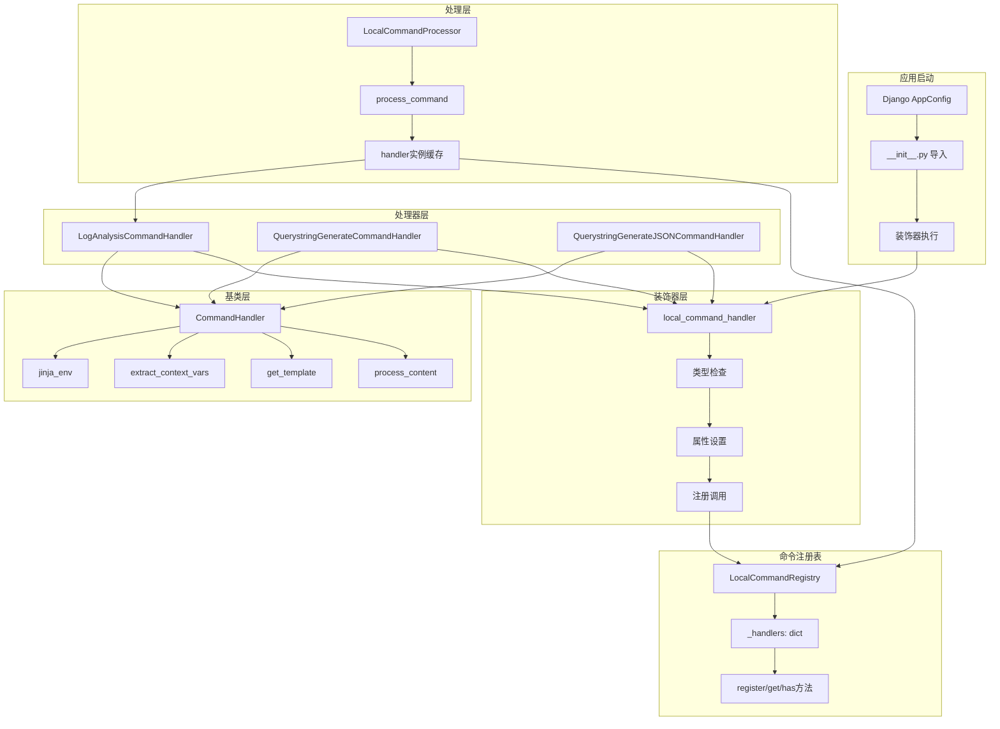
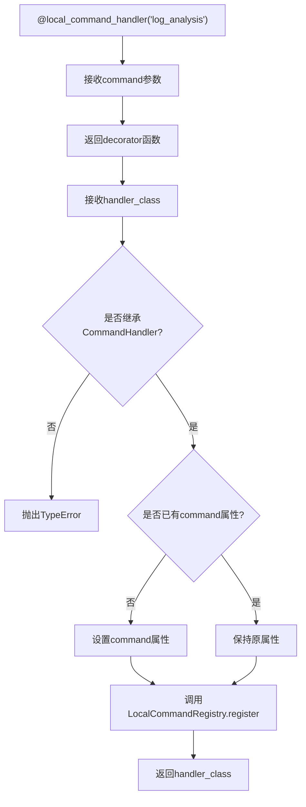
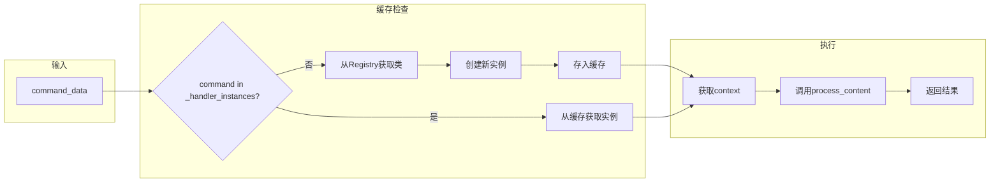
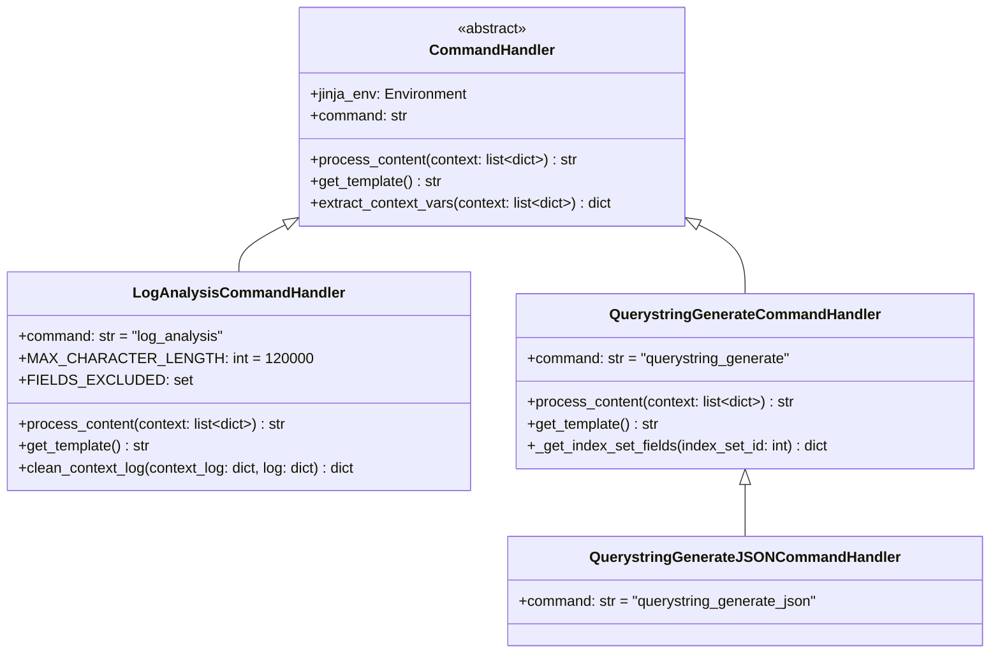
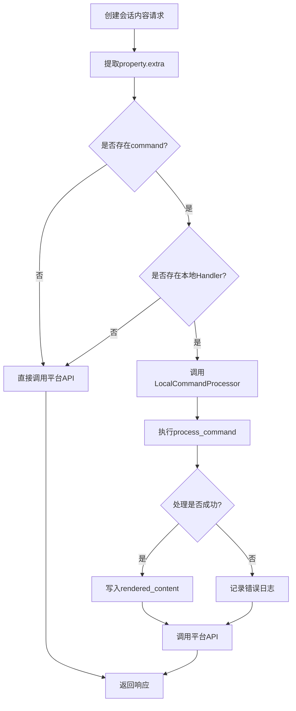
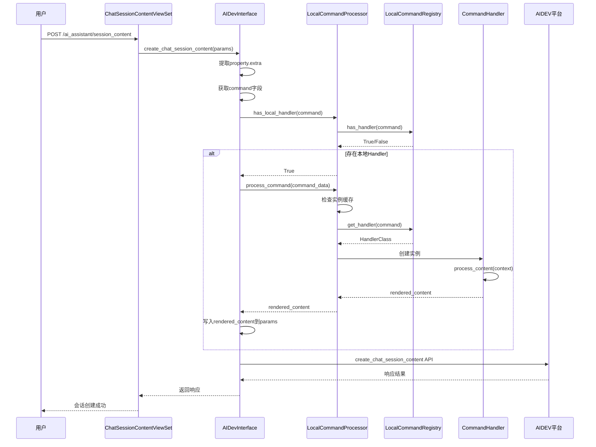
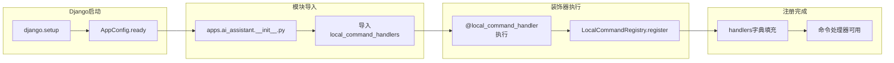
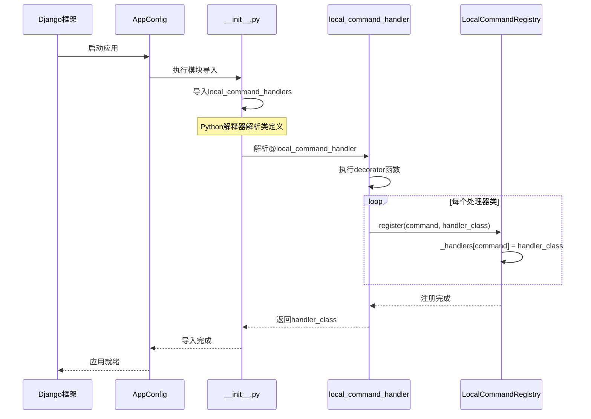
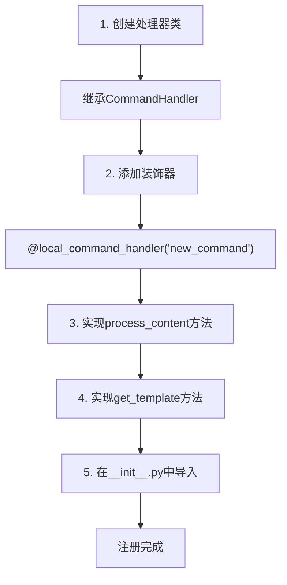
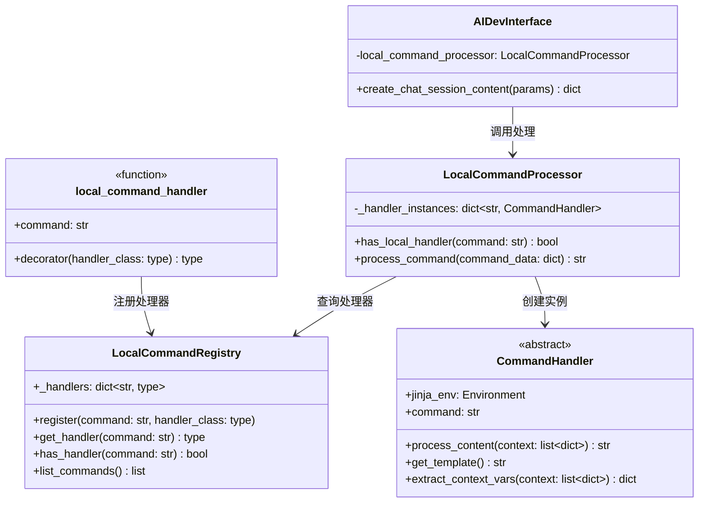

# 本地命令处理器

本文档深入解析BKLOG AI助手的本地命令处理器架构，涵盖装饰器注册模式、命令分发机制、处理器注册表等核心技术实现。

## 1. 概述

本地命令处理器是BKLOG AI助手的核心基础设施，用于在本地平台处理快捷指令，无需依赖外部AIDEV平台的MCP协议。该机制通过装饰器注册模式实现命令处理器的自动注册，支持灵活扩展各类业务场景的命令处理逻辑。

## 2. 整体架构



## 3. 核心组件详解

### 3.1 LocalCommandRegistry - 命令注册表

命令注册表是整个系统的核心存储组件，采用类级别的字典存储所有注册的命令处理器。

**源文件**: `ai_agent/services/local_command_handler.py` (第17-42行)

```python
# ai_agent/services/local_command_handler.py: 17-42
class LocalCommandRegistry:
    """本地快捷指令处理器注册表"""

    _handlers: dict[str, type[CommandHandler]] = {}

    @classmethod
    def register(cls, command: str, handler_class: type[CommandHandler]):
        """注册本地处理器"""
        cls._handlers[command] = handler_class
        logger.info(f"LocalCommandRegistry: registered handler for command->[{command}]")

    @classmethod
    def get_handler(cls, command: str) -> type[CommandHandler] | None:
        """获取本地处理器"""
        return cls._handlers.get(command)

    @classmethod
    def has_handler(cls, command: str) -> bool:
        """检查是否存在本地处理器"""
        return command in cls._handlers

    @classmethod
    def list_commands(cls) -> list:
        """列出所有注册的命令"""
        return list(cls._handlers.keys())
```

**注册表特性说明**:

| 特性 | 实现方式 | 说明 |
|------|----------|------|
| 类级别存储 | `_handlers: dict[str, type]` | 所有实例共享同一个注册表 |
| 类型约束 | `type[CommandHandler]` | 存储处理器类而非实例 |
| 命令映射 | `command -> handler_class` | 命令名称与处理器类一对一映射 |
| 线程安全 | 类级别不可变 | 注册完成后不会修改 |

### 3.2 local_command_handler 装饰器

装饰器是命令处理器注册的核心入口，通过声明式语法实现处理器类的自动注册。

**源文件**: `ai_agent/services/local_command_handler.py` (第44-72行)

```python
# ai_agent/services/local_command_handler.py: 44-72
def local_command_handler(command: str):
    """
    本地快捷指令处理器装饰器

    Args:
        command: 快捷指令名称

    Usage:
        @local_command_handler("tracing_analysis")
        class TracingAnalysisCommandHandler(CommandHandler):
            def process_content(self, context: list[dict]) -> str:
                # 实现处理逻辑
                pass
    """

    def decorator(handler_class: type[CommandHandler]):
        if not issubclass(handler_class, CommandHandler):
            raise TypeError("Handler class must inherit from CommandHandler")

        # 设置command属性（如果未设置）
        if not hasattr(handler_class, "command") or not handler_class.command:
            handler_class.command = command

        # 注册到本地注册表
        LocalCommandRegistry.register(command, handler_class)

        return handler_class

    return decorator
```

**装饰器工作流程**:



**装饰器设计要点**:

| 设计点 | 实现细节 | 目的 |
|--------|----------|------|
| 参数化装饰器 | 返回 `decorator` 函数 | 支持传入命令名称 |
| 类型检查 | `issubclass(handler_class, CommandHandler)` | 确保处理器符合接口规范 |
| 属性注入 | `handler_class.command = command` | 为处理器类添加命令标识 |
| 注册调用 | `LocalCommandRegistry.register()` | 自动注册到全局注册表 |
| 返回原类 | `return handler_class` | 保持类的原有功能 |

### 3.3 LocalCommandProcessor - 命令处理器

命令处理器负责实际执行命令处理逻辑，包含处理器实例缓存机制。

**源文件**: `ai_agent/services/local_command_handler.py` (第75-119行)

```python
# ai_agent/services/local_command_handler.py: 75-119
class LocalCommandProcessor:
    """本地快捷指令处理器"""

    def __init__(self):
        self._handler_instances: dict[str, CommandHandler] = {}

    @classmethod
    def has_local_handler(cls, command: str) -> bool:
        """检查是否存在本地处理器"""
        return LocalCommandRegistry.has_handler(command)

    def process_command(self, command_data: dict) -> str:
        """
        处理快捷指令

        Args:
            command_data: 包含command和context的字典

        Returns:
            处理后的内容

        Raises:
            ValueError: 当命令不存在或处理失败时
        """
        command = command_data.get("command")
        if not command:
            raise ValueError("Command is required")

        if not self.has_local_handler(command):
            raise ValueError(f"No local handler found for command: {command}")

        # 获取或创建处理器实例
        if command not in self._handler_instances:
            handler_class = LocalCommandRegistry.get_handler(command)
            self._handler_instances[command] = handler_class()

        handler = self._handler_instances[command]
        context = command_data.get("context", [])

        try:
            return handler.process_content(context)
        except Exception as e:
            logger.error(f"LocalCommandProcessor: failed to process command->[{command}], error->[{e}]")
            raise ValueError(f"Failed to process command {command}") from e
```

**处理器实例缓存机制**:



### 3.4 CommandHandler 基类

CommandHandler 是所有本地命令处理器的抽象基类，定义了处理器的核心接口规范。

**核心方法**:

| 方法 | 签名 | 说明 |
|------|------|------|
| `process_content` | `(context: list[dict]) -> str` | 核心处理方法，子类必须实现 |
| `get_template` | `() -> str` | 返回Jinja2模板字符串 |
| `extract_context_vars` | `(context: list[dict]) -> dict` | 从上下文提取变量 |
| `jinja_env` | `Environment` | Jinja2模板渲染环境 |

**基类设计模式**:



## 4. 命令处理器实现详解

### 4.1 LogAnalysisCommandHandler - 日志分析处理器

日志分析处理器用于获取日志上下文并进行智能清理。

**源文件**: `apps/ai_assistant/local_command_handlers.py` (第14-128行)

```python
# apps/ai_assistant/local_command_handlers.py: 14-54
@local_command_handler("log_analysis")
class LogAnalysisCommandHandler(CommandHandler):
    """
    日志分析命令处理器
    命令参数:
    - index_set_id: 索引集ID
    - log: 日志内容，为 dict 结构
    - context_count: 引用的上下文条数，默认为 10
    """

    # 基于 128K 上下文长度设置
    MAX_CHARACTER_LENGTH = 120_000

    FIELDS_EXCLUDED = {
        "__data_label",
        "__dist_05",
        "__id__",
        "__index_set_id__",
        "__parse_failure",
        "__result_table",
        "gseIndex",
        "iterationIndex",
        "time",
        "_time",
    }
```

**处理流程实现**:

```python
# apps/ai_assistant/local_command_handlers.py: 55-118
def process_content(self, context: list[dict]) -> str:
    # 必须放到这里加载，否则 django 会因国际化加载失败
    from apps.log_search.models import LogIndexSet
    from apps.log_unifyquery.handler.context import UnifyQueryContextHandler

    template = self.get_template()
    variables = self.extract_context_vars(context)

    index_set_id = int(variables["index_set_id"])
    context_count = int(variables.get("context_count", 10))
    log = variables["log"]

    log_data = json.loads(log)
    for key in log_data.copy():
        if key in self.FIELDS_EXCLUDED:
            del log_data[key]

    # ... 获取日志上下文查询逻辑 ...

    total_character_length = len(log)
    final_context_logs = []

    for index, context_log in enumerate(context_logs):
        # 在模型上下文内容大小限制的前提下，尽可能多的引用日志上下文
        if total_character_length > self.MAX_CHARACTER_LENGTH:
            break

        # 去掉与原始日志完全一致的 kv 对，精简上下文内容大小
        if index > 0:
            cleaned_context_log = self.clean_context_log(context_log, context_logs[0])
            if not cleaned_context_log:
                continue
        else:
            cleaned_context_log = context_log
        cleaned_context_log = json.dumps(cleaned_context_log)
        final_context_logs.append(cleaned_context_log)
        total_character_length += len(cleaned_context_log)

    return self.jinja_env.render(template, {"log": json.dumps(log_data), "context": "\n".join(final_context_logs)})
```

**模板定义**:

```python
# apps/ai_assistant/local_command_handlers.py: 120-127
def get_template(self) -> str:
    return """## 日志内容开始
{{ log }}
## 日志内容结束 ##
## 上下文内容开始 ##
{{ context }}
## 上下文内容结束 ##
    """
```

### 4.2 QuerystringGenerateCommandHandler - 查询语句生成处理器

查询语句生成处理器用于构建检索需求的模板渲染。

**源文件**: `apps/ai_assistant/local_command_handlers.py` (第130-199行)

```python
# apps/ai_assistant/local_command_handlers.py: 130-181
@local_command_handler("querystring_generate")
class QuerystringGenerateCommandHandler(CommandHandler):
    """
    生成查询语句命令处理器
    """

    @classmethod
    def _get_index_set_fields(cls, index_set_id: int) -> dict:
        """
        获取索引集的字段信息

        Args:
            index_set_id: 索引集ID

        Returns:
            dict: 字段信息字典，格式为 {field_name: {type: str, query_alias?: str}}
        """
        from apps.log_search.models import LogIndexSet

        index_set_obj = LogIndexSet.objects.filter(index_set_id=index_set_id).first()
        if not index_set_obj:
            return {}

        fields_info = index_set_obj.get_fields(use_snapshot=True)
        if not fields_info.get("fields"):
            return {}

        fields = {}
        for field_info in fields_info.get("fields"):
            field_data = {"type": field_info["field_type"]}
            if field_info.get("query_alias"):
                field_data["query_alias"] = field_info["query_alias"]
            fields[field_info["field_name"]] = field_data

        return fields

    def process_content(self, context: list[dict]) -> str:
        template = self.get_template()
        variables = self.extract_context_vars(context)

        current_datetime = arrow.now().floor("minute").format("YYYY-MM-DD HH:mm:ss")

        return self.jinja_env.render(
            template,
            {
                "description": variables["description"],
                "fields": variables.get("fields", "{}"),
                "domain": variables["domain"],
                "index_set_id": variables["index_set_id"],
                "current_datetime": current_datetime,
            },
        )
```

**模板定义**:

```python
# apps/ai_assistant/local_command_handlers.py: 183-199
def get_template(self) -> str:
    return """
## 检索需求
{{ description }}

## 字段信息
{{ fields }}

## 平台域名
{{ domain }}

## 索引集ID
{{ index_set_id }}

## 当前时间
{{ current_datetime }}
    """
```

### 4.3 QuerystringGenerateJSONCommandHandler - JSON版本处理器

JSON版本处理器继承自查询语句生成处理器，保持相同的处理逻辑。

**源文件**: `apps/ai_assistant/local_command_handlers.py` (第202-208行)

```python
# apps/ai_assistant/local_command_handlers.py: 202-208
@local_command_handler("querystring_generate_json")
class QuerystringGenerateJSONCommandHandler(QuerystringGenerateCommandHandler):
    """
    生成查询语句命令处理器 (JSON结构化版本)
    """

    pass
```

## 5. 命令分发机制

### 5.1 分发入口

命令分发通过 `AIDevInterface.create_chat_session_content` 方法触发。

**源文件**: `ai_agent/core/aidev_interface.py` (第171-189行)

```python
# ai_agent/core/aidev_interface.py: 171-189
def create_chat_session_content(self, params):
    """创建会话内容"""
    property_data = params.get("property", {})

    # 快捷指令
    try:  # 本地处理（若有处理器）> 平台处理
        command_data = property_data.get("extra", {})
        command = command_data.get("command")
        # 若存在注册的LocalHandler，则使用本地处理逻辑用于渲染会话内容
        if command and self.local_command_processor.has_local_handler(command):
            logger.info("create_chat_session_content: try to process command->[%s]", command_data)
            processed_content = self.local_command_processor.process_command(command_data)
            if processed_content:  # 若处理成功,将渲染后的内容写入到property中,平台不会进行覆盖
                params["property"]["extra"]["rendered_content"] = processed_content
    except Exception as e:  # pylint: disable=broad-except
        logger.error("create_chat_session_content: process command error->[%s]", e)

    res = self.api_client.api.create_chat_session_content(json=params)
    return res
```

**分发优先级策略**: 本地处理 > 平台处理



### 5.2 完整分发流程



## 6. 自动注册机制

### 6.1 Django AppConfig 集成

命令处理器通过 Django AppConfig 的 `ready` 方法实现自动导入注册。

**源文件**: `apps/ai_assistant/__init__.py` (第1-2行)

```python
# apps/ai_assistant/__init__.py: 1-2
# 注册本地指令处理器
from .local_command_handlers import *  # noqa
```

**注册时机**:



### 6.2 注册时序图



## 7. 已注册命令一览

| 命令名称 | 处理器类 | 功能说明 | 源文件位置 |
|----------|----------|----------|------------|
| `log_analysis` | LogAnalysisCommandHandler | 日志分析与上下文获取 | `apps/ai_assistant/local_command_handlers.py:14` |
| `querystring_generate` | QuerystringGenerateCommandHandler | 查询语句生成 | `apps/ai_assistant/local_command_handlers.py:130` |
| `querystring_generate_json` | QuerystringGenerateJSONCommandHandler | 查询语句生成(JSON版本) | `apps/ai_assistant/local_command_handlers.py:202` |

## 8. 扩展开发指南

### 8.1 新增命令处理器步骤



### 8.2 处理器开发模板

```python
# 新增命令处理器模板
from ai_agent.services.local_command_handler import (
    CommandHandler,
    local_command_handler,
)


@local_command_handler("custom_command")
class CustomCommandHandler(CommandHandler):
    """
    自定义命令处理器
    命令参数:
    - param1: 参数1说明
    - param2: 参数2说明
    """

    def process_content(self, context: list[dict]) -> str:
        """
        处理命令内容

        Args:
            context: 上下文变量列表，格式为 [{"__key": "param1", "__value": "value1"}]

        Returns:
            渲染后的内容字符串
        """
        template = self.get_template()
        variables = self.extract_context_vars(context)

        # 业务处理逻辑
        result = self.jinja_env.render(template, variables)
        return result

    def get_template(self) -> str:
        """
        返回Jinja2模板字符串

        Returns:
            模板字符串
        """
        return """
## 模板标题
{{ param1 }}
## 其他内容
{{ param2 }}
        """
```

### 8.3 命令调用数据结构

```json
{
    "command": "log_analysis",
    "context": [
        {"__key": "index_set_id", "__value": "123"},
        {"__key": "log", "__value": "{\"message\": \"error log\"}"},
        {"__key": "context_count", "__value": "10"}
    ]
}
```

**context字段解析规则**:

| 字段 | 说明 |
|------|------|
| `__key` | 变量名称 |
| `__value` | 变量值 |
| `context_type` | 上下文类型(可选) |

## 9. 类关系图



## 10. 设计优势

### 10.1 装饰器注册模式优势

| 优势 | 说明 |
|------|------|
| 声明式注册 | 通过装饰器声明命令，无需手动调用注册函数 |
| 自动发现 | 模块导入时自动执行注册，无需维护注册列表 |
| 类型约束 | 装饰器内进行类型检查，确保处理器符合接口规范 |
| 零侵入 | 处理器类无需修改，只需添加装饰器即可 |
| 易扩展 | 新增处理器只需创建类并添加装饰器 |

### 10.2 本地处理优势

| 优势 | 说明 |
|------|------|
| 性能优化 | 本地处理减少网络调用，提升响应速度 |
| 灵活定制 | 平台可根据业务需求定制处理逻辑 |
| 数据安全 |敏感数据可在本地处理，无需传输到外部平台 |
| 离线可用 | 不依赖外部MCP服务，本地即可完成处理 |
| 成本控制 | 减少AIDEV平台调用，降低服务成本 |

## 11. 错误处理机制

```mermaid
flowchart TD
    A[process_command调用] --> B{command是否存在?}
    B -->|否| C[抛出ValueError<br/>"Command is required"]
    B -->|是| D{has_local_handler?}
    D -->|否| E[抛出ValueError<br/>"No local handler found"]
    D -->|是| F[获取/创建handler实例]
    F --> G[调用process_content]
    G --> H{执行是否成功?}
    H -->|是| I[返回rendered_content]
    H -->|否| J[记录error日志]
    J --> K[抛出ValueError<br/>"Failed to process command"]
```

## 12. 总结

本地命令处理器架构通过以下核心技术实现高效灵活的命令处理机制:

1. **装饰器注册模式**: 通过 `@local_command_handler` 装饰器实现处理器自动注册
2. **命令注册表**: `LocalCommandRegistry` 提供全局命令映射存储
3. **命令处理器**: `LocalCommandProcessor` 负责命令分发和实例管理
4. **模板渲染**: 基于 Jinja2 的模板渲染机制实现内容生成
5. **自动导入**: 通过 Django AppConfig 集成实现模块自动发现

该架构设计遵循开闭原则，新增命令处理器只需创建新类并添加装饰器，无需修改现有代码，具备良好的扩展性和可维护性。

---

**文档版本**: v1.0
**更新日期**: 2026-04-30
**源码版本**: bklog ai_docs分支