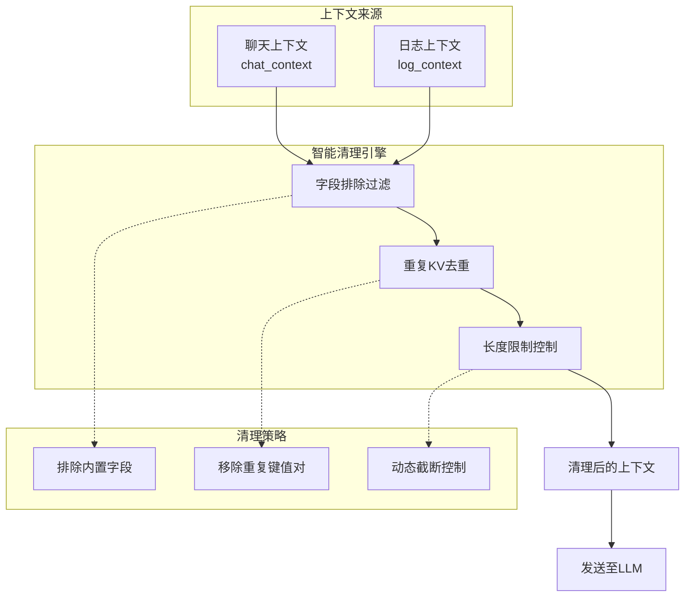
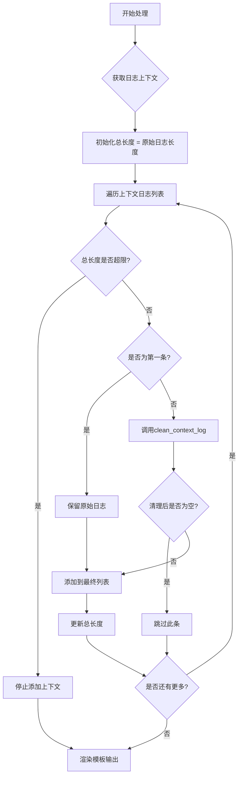
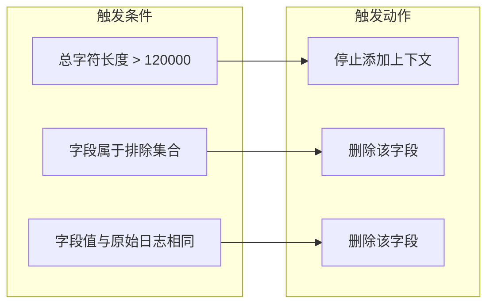
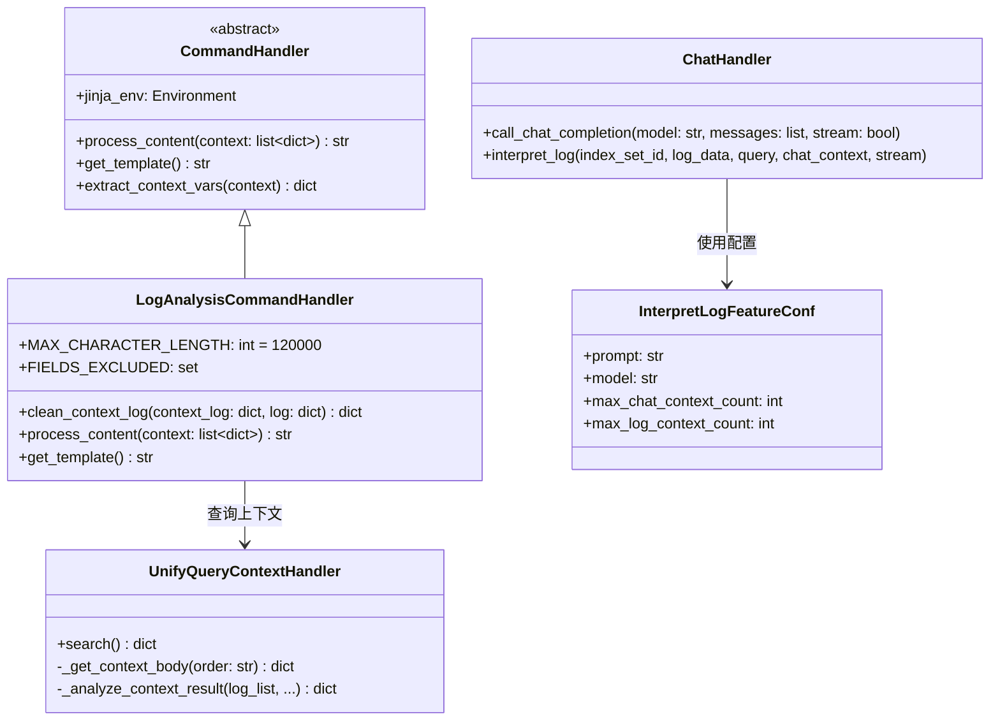
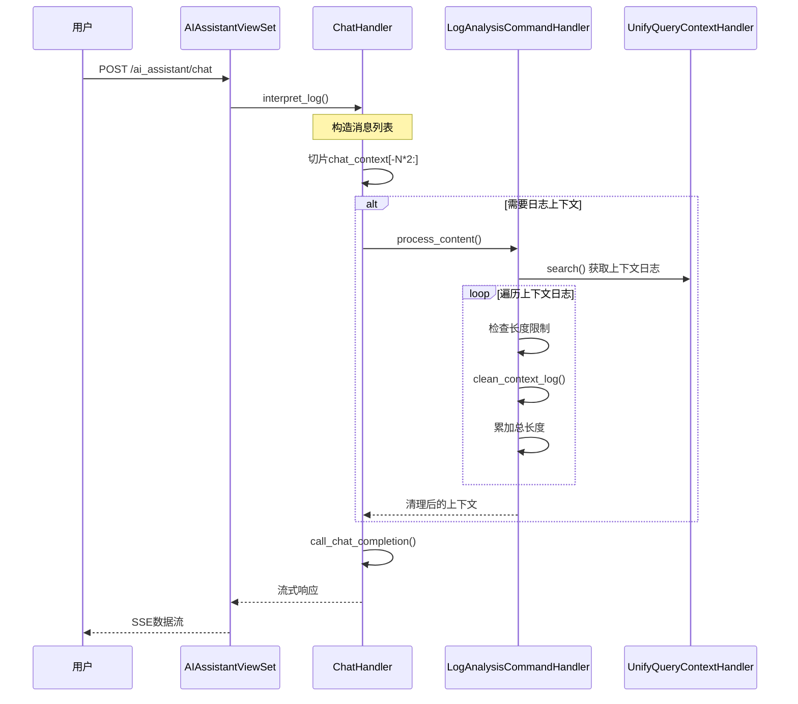

# 上下文智能清理

## 概述

BKLOG AI助手的上下文智能清理机制是保证大语言模型(LLM)高效运行的核心组件。该机制通过智能化的上下文管理策略，在保证日志分析质量的前提下，有效控制发送给模型的上下文大小，避免超出模型上下文窗口限制，同时减少不必要的Token消耗。

## 核心架构



## 核心组件详解

### 1. 上下文类型

BKLOG AI助手处理两种类型的上下文：

| 上下文类型 | 来源 | 管理方式 | 配置参数 |
|-----------|------|---------|---------|
| 聊天上下文 | 用户与AI的历史对话 | 滑动窗口切片 | `max_chat_context_count` |
| 日志上下文 | 相关日志记录 | 智能清理+动态截断 | `max_log_context_count` |

#### 配置定义

**文件**: `apps/ai_assistant/constants.py` (第5-15行)

```python
@dataclass
class InterpretLogFeatureConf:
    prompt: str = """
你是蓝鲸日志平台 AI 小鲸...
    """
    model: str = "hunyuan"
    max_chat_context_count: int = 5      # 最大聊天上下文轮数
    max_log_context_count: int = 10      # 最大日志上下文条数
```

### 2. 日志上下文清理器

日志上下文清理的核心实现位于 `LogAnalysisCommandHandler` 类中。

**文件**: `apps/ai_assistant/local_command_handlers.py` (第14-127行)

#### 2.1 排除字段定义

```python
@local_command_handler("log_analysis")
class LogAnalysisCommandHandler(CommandHandler):
    # 基于 128K 上下文长度设置
    MAX_CHARACTER_LENGTH = 120_000

    FIELDS_EXCLUDED = {
        "__data_label",
        "__dist_05",
        "__id__",
        "__index_set_id__",
        "__parse_failure",
        "__result_table",
        "gseIndex",
        "iterationIndex",
        "time",
        "_time",
    }
```

**字段排除原因**:
- `__data_label`, `__dist_05`, `__id__`, `__index_set_id__`: 系统内部元数据字段
- `__parse_failure`, `__result_table`: 采集和处理状态字段
- `gseIndex`, `iterationIndex`: GSE采集序列标识
- `time`, `_time`: 时间戳字段（对AI分析无意义）

#### 2.2 上下文日志清理方法

```python
@classmethod
def clean_context_log(cls, context_log: dict, log: dict) -> dict:
    """
    清理上下文日志中的重复 kv 对
    """
    for key in list(context_log.keys()):
        if key in cls.FIELDS_EXCLUDED:
            del context_log[key]
            continue

        if log.get(key) == context_log[key]:
            del context_log[key]

    return context_log
```

**清理逻辑说明**:
1. **排除字段移除**: 遍历上下文日志的所有字段，删除属于 `FIELDS_EXCLUDED` 集合的字段
2. **重复值去除**: 如果上下文日志中的字段值与原始日志完全相同，则删除该字段
3. **原地修改**: 直接修改传入的字典对象，减少内存开销

### 3. 智能清理流程



#### 核心处理代码

**文件**: `apps/ai_assistant/local_command_handlers.py` (第55-118行)

```python
def process_content(self, context: list[dict]) -> str:
    # 必须放到这里加载，否则 django 会因国际化加载失败
    from apps.log_search.models import LogIndexSet
    from apps.log_unifyquery.handler.context import UnifyQueryContextHandler

    template = self.get_template()
    variables = self.extract_context_vars(context)

    index_set_id = int(variables["index_set_id"])
    context_count = int(variables.get("context_count", 10))
    log = variables["log"]

    log_data = json.loads(log)
    for key in log_data.copy():
        if key in self.FIELDS_EXCLUDED:
            del log_data[key]

    # ... 获取日志上下文的查询逻辑 ...

    total_character_length = len(log)
    final_context_logs = []

    for index, context_log in enumerate(context_logs):
        # 在模型上下文内容大小限制的前提下，尽可能多的引用日志上下文
        if total_character_length > self.MAX_CHARACTER_LENGTH:
            break

        # 去掉与原始日志完全一致的 kv 对，精简上下文内容大小
        if index > 0:
            cleaned_context_log = self.clean_context_log(context_log, context_logs[0])
            if not cleaned_context_log:
                continue
        else:
            cleaned_context_log = context_log
        cleaned_context_log = json.dumps(cleaned_context_log)
        final_context_logs.append(cleaned_context_log)
        total_character_length += len(cleaned_context_log)

    return self.jinja_env.render(template, {"log": json.dumps(log_data), "context": "\n".join(final_context_logs)})
```

### 4. 聊天上下文管理

聊天上下文采用滑动窗口策略进行管理。

**文件**: `apps/ai_assistant/handlers/chat.py` (第92-119行)

```python
def interpret_log(self, index_set_id: str, log_data: dict, query: str, chat_context: list, stream=True):
    """
    处理日志分析请求
    :param index_set_id: 索引集ID
    :param log_data: 日志内容
    :param query: 当前聊天输入内容
    :param chat_context: 上下文信息
    :param stream: 是否流式返回
    :return: 响应生成器
    """
    # 构造系统提示词
    feature_toggle = FeatureToggleObject.toggle(AI_ASSISTANT)

    custom_conf = {}
    if feature_toggle and feature_toggle.feature_config:
        custom_conf = feature_toggle.feature_config.get("interpret_log", {})

    feature_conf = InterpretLogFeatureConf(**custom_conf)

    # 构造消息列表 - 关键的上下文切片逻辑
    messages = [
        {"role": "system", "content": feature_conf.prompt.format(log_content=json.dumps(log_data))},
        *chat_context[-feature_conf.max_chat_context_count * 2 :],  # 滑动窗口切片
        {"role": "user", "content": query},
    ]

    # 调用OpenAI接口
    return self.call_chat_completion(model=feature_conf.model, messages=messages, stream=stream)
```

**切片策略说明**:
- `chat_context[-feature_conf.max_chat_context_count * 2 :]`: 取最近的N轮对话
- 每轮对话包含一条user消息和一条assistant消息，因此乘以2
- 默认保留最近5轮对话（10条消息）

### 5. 上下文查询构建

日志上下文的获取通过 `UnifyQueryContextHandler` 实现。

**文件**: `apps/log_unifyquery/builder/context.py` (第14-28行)

```python
def build_context_params(params):
    # 获取当前日志的时间戳，查询时间范围为日志打印时间的前后12h
    try:
        ts = int(params.get("dtEventTimeStamp"))
        log_time = arrow.get(ts)
    except Exception:
        try:
            # 尝试以字符串格式获取
            log_time = arrow.get(params.get("dtEventTimeStamp"))
        except Exception:
            log_time = arrow.utcnow()
    params["end_time"] = int(log_time.shift(hours=12).timestamp())
    params["start_time"] = int(log_time.shift(hours=-12).timestamp())
    params["index_set_ids"] = [params["index_set_id"]]
    return params
```

## 清理触发条件



| 触发条件 | 判断逻辑 | 执行动作 | 代码位置 |
|---------|---------|---------|---------|
| 长度超限 | `total_character_length > MAX_CHARACTER_LENGTH` | 停止添加更多上下文日志 | `local_command_handlers.py:104` |
| 排除字段 | `key in FIELDS_EXCLUDED` | 删除该字段 | `local_command_handlers.py:46-47` |
| 重复值 | `log.get(key) == context_log[key]` | 删除该字段 | `local_command_handlers.py:50-51` |
| 空日志 | `not cleaned_context_log` | 跳过该条日志 | `local_command_handlers.py:110-111` |

## 类关系图



## 数据流程图



## 关键实现细节

### 1. 为什么使用120000字符限制？

```
MAX_CHARACTER_LENGTH = 120_000
```

**设计考量**:
- 主流LLM模型（如GPT-4、Claude）上下文窗口为128K Token
- 1个中文字符约等于1-2个Token
- 预留8K Token空间给系统提示词和响应生成
- 120000字符约为60000-120000 Token，留有安全余量

### 2. 为什么第一条上下文日志不做清理？

```python
if index > 0:
    cleaned_context_log = self.clean_context_log(context_log, context_logs[0])
else:
    cleaned_context_log = context_log
```

**原因分析**:
- `context_logs[0]` 是原始查询的目标日志
- 后续上下文日志是与目标日志相邻的日志
- 后续日志中的重复字段对AI分析无帮助
- 保留第一条的完整性有助于AI理解日志全貌

### 3. Jinja2模板渲染

```python
def get_template(self) -> str:
    return """## 日志内容开始
{{ log }}
## 日志内容结束 ##
## 上下文内容开始 ##
{{ context }}
## 上下文内容结束 ##
    """
```

**模板设计原则**:
- 使用Markdown格式分隔符标记内容区域
- 明确的起止标记帮助LLM理解内容边界
- 结构化输出便于后续处理

## 配置参数汇总

| 参数名 | 默认值 | 说明 | 配置位置 |
|-------|-------|------|---------|
| `MAX_CHARACTER_LENGTH` | 120000 | 最大上下文字符长度 | `local_command_handlers.py:25` |
| `max_chat_context_count` | 5 | 最大聊天上下文轮数 | `constants.py:14` |
| `max_log_context_count` | 10 | 最大日志上下文条数 | `constants.py:15` |
| `context_count` | 10 | 单次查询上下文条数 | `local_command_handlers.py:64` |

## 最佳实践

1. **合理设置上下文长度**: 根据模型Token限制调整 `MAX_CHARACTER_LENGTH`
2. **优化排除字段**: 根据业务需求扩展 `FIELDS_EXCLUDED` 集合
3. **监控Token消耗**: 通过日志记录实际使用的上下文大小
4. **渐进式加载**: 优先加载重要上下文，超出限制后停止加载

---
*文档版本: v1.0*
*更新日期: 2026-04-30*