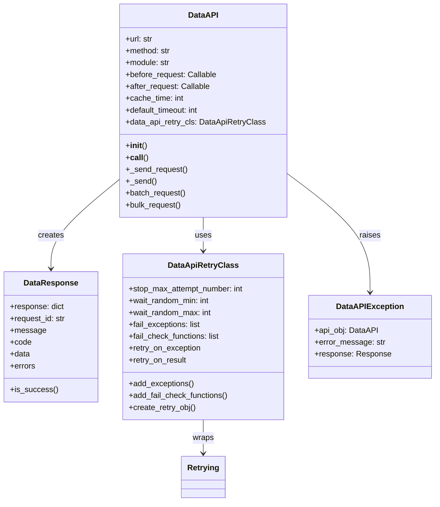
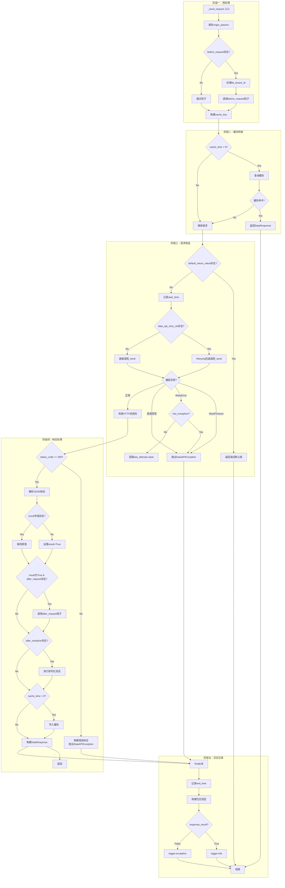
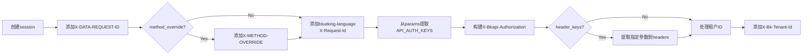
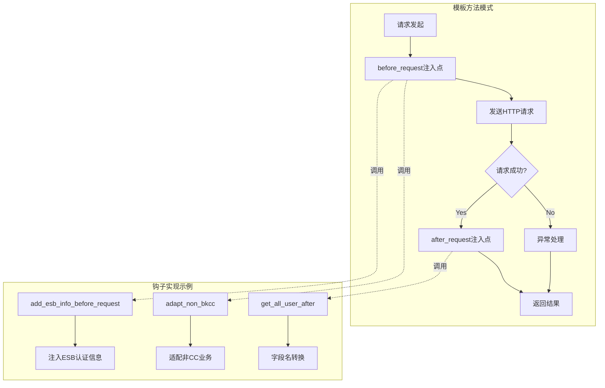
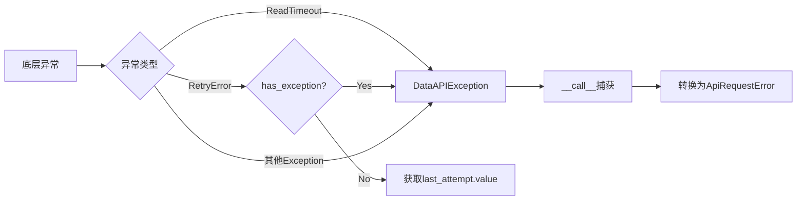
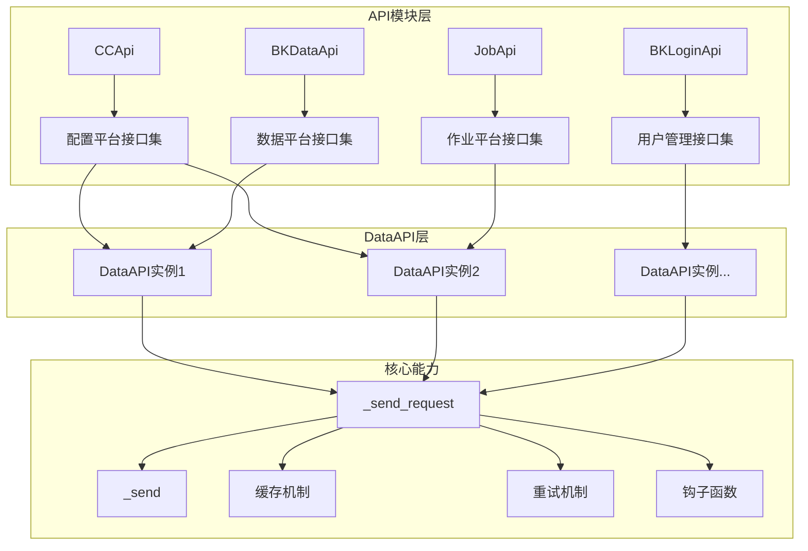

# DataAPI 核心实现

> 聚焦：apps/api/base.py 的 DataAPI 类
> 这是整个系统与外部系统交互的统一门面

## 1. DataAPI 类定位

### 1.1 在整个系统中的作用

`DataAPI` 类是 BKLOG 日志平台与所有外部系统交互的核心抽象层。它提供了一个统一的 API 调用门面，封装了以下关键能力：

- **HTTP请求发送**：统一处理 GET/POST/PUT/DELETE 等请求方法
- **ESB认证集成**：自动注入蓝鲸平台的认证信息（bk_app_code、bk_app_secret、bk_username等）
- **多租户支持**：自动处理租户ID传递
- **钩子函数机制**：提供 before_request 和 after_request 两个注入点
- **缓存机制**：支持请求结果缓存，减少重复调用
- **重试机制**：通过 DataApiRetryClass 支持可配置的重试策略
- **日志记录**：完整的请求流水记录
- **并发请求**：batch_request 和 bulk_request 支持批量并发调用

### 1.2 与 DataResponse、DataApiRetryClass 的关系图



### 1.3 被哪些模块依赖

`DataAPI` 被 24 个 API 模块依赖，覆盖了日志平台需要交互的所有外部系统：

| 模块 | 目标系统 | 用途 |
|------|---------|------|
| cc.py | 配置平台(CMDB) | 业务、主机、拓扑查询 |
| bk_login.py | PaaS登录模块 | 用户信息、租户管理 |
| bkdata_*.py | 数据平台 | 数据接入、查询、流处理 |
| job.py | 作业平台 | 任务执行 |
| gse.py | 管控平台 | Agent状态查询 |
| monitor.py | 监控平台 | 告警关联 |
| iam.py | 权限中心 | 权限管理 |
| bk_node.py | 节点管理 | 插件部署 |

---

## 2. __init__() 初始化方法

### 2.1 完整代码片段

```python
# apps/api/base.py 第 200-276 行
def __init__(
    self,
    method,
    url,
    module,
    description="",
    default_return_value=None,
    before_request=None,
    after_request=None,
    max_response_record=5000,
    max_query_params_record=5000,
    method_override=None,
    url_keys=None,
    header_keys=None,
    after_serializer=None,
    cache_time=0,
    default_timeout=60,
    data_api_retry_cls=None,
    use_superuser=False,
    no_query_params=False,
    pagination_style=PaginationStyle.LIMIT_OFFSET.value,
    bk_tenant_id: str | Callable[[dict], str] = "",
):
    """
    初始化一个请求句柄
    @param {string} method 请求方法, GET or POST，大小写皆可
    @param {string} url 请求地址
    @param {string} module 对应的模块，用于后续查询标记
    @param {string} description 中文描述
    @param {object} default_return_value 默认返回值，在请求失败情形下将返回该值
    @param {function} before_request 请求前的回调
    @param {function} after_request 请求后的回调
    @param {serializer} after_serializer 请求后的清洗
    @param {int} max_response_record 最大记录返回长度，如果为None将记录所有内容
    @param {int} max_query_params_record 最大请求参数记录长度，如果为None将记录所有的内容
    @param {string} method_override 重载请求方法，注入到 header（X-HTTP-METHOD-OVERRIDE）
    @param {array.<string>} url_keys 请求地址中存在未赋值的 KEYS
    @param {int} cache_time 缓存时间
    @param {int} default_timeout 默认超时时间
    @param {DataApiRetryClass} data_api_retry_cls 超时配置
    @param {string} pagination_style 分页方式
    @param {string} bk_tenant_id 租户ID，可传递一个静态值或者动态的函数
    """
    self.url = url
    self.module = module
    self.method = method
    self.default_return_value = default_return_value

    self.before_request = before_request
    self.after_request = after_request

    self.after_serializer = after_serializer

    self.description = description
    self.max_response_record = max_response_record
    self.max_query_params_record = max_query_params_record

    self.method_override = method_override
    self.url_keys = url_keys
    common_headers = [
        "X-Bk-App-Code",
        "X-Bk-App-Secret",
    ]
    self.header_keys = common_headers
    if header_keys:
        self.header_keys = header_keys + common_headers

    self.cache_time = cache_time
    self.default_timeout = default_timeout
    self.data_api_retry_cls = data_api_retry_cls
    self.use_superuser = use_superuser
    self.pagination_style = pagination_style

    self.bk_tenant_id = bk_tenant_id
    self.headers = None
    self.no_query_params = no_query_params
```

### 2.2 核心参数逐一解析

#### url/method/module（基础参数）

| 参数 | 类型 | 说明 | 设计意图 |
|------|------|------|----------|
| `method` | str | HTTP方法（GET/POST/PUT/DELETE） | 决定请求的HTTP动词 |
| `url` | str | 请求地址，支持模板占位符 | 支持RESTful风格的URL变量 |
| `module` | str | 模块标识（如"配置平台"） | 日志记录中标识请求来源 |

**url 参数支持模板占位符**：通过 `url_keys` 参数配合，实现 RESTful URL 的动态构建：

```python
# 示例：url_keys=["bk_biz_id"]
url = "api/v3/find/topoinst/biz/{bk_biz_id}"
# 调用时传入 params={"bk_biz_id": 123}，实际URL变为 api/v3/find/topoinst/biz/123
```

#### before_request/after_request（钩子函数）

| 参数 | 类型 | 调用时机 | 设计意图 |
|------|------|----------|----------|
| `before_request` | Callable(params) -> params | 请求发送前 | 参数预处理、鉴权信息注入 |
| `after_request` | Callable(response) -> response | 响应解析后（成功时） | 响应数据转换、字段映射 |

这是**模板方法模式**的核心体现：
- `before_request`：用于注入ESB认证信息、适配参数格式
- `after_request`：用于转换响应格式、过滤数据

典型用例（bk_login.py 第 43-59 行）：

```python
def get_all_user_after(response_result):
    for _user in response_result.get("data", []):
        _user["chname"] = _user.pop("display_name", _user["username"])
    return response_result
```

#### cache_time（缓存）

| 参数 | 类型 | 默认值 | 说明 |
|------|------|--------|------|
| `cache_time` | int | 0 | 缓存秒数，0表示不缓存 |

**缓存命中逻辑**：
1. 通过 `_build_cache_key()` 构建缓存key（基于URL + params的MD5）
2. 若缓存存在且未过期，直接返回 `DataResponse`
3. 若缓存不存在，发送请求后写入缓存

#### default_timeout（超时）

| 参数 | 类型 | 默认值 | 说明 |
|------|------|--------|------|
| `default_timeout` | int | 60 | 默认超时秒数 |

调用时可通过 `timeout` 参数覆盖：

```python
# __call__ 第 294 行
timeout = timeout or self.default_timeout
```

#### data_api_retry_cls（重试策略）

| 参数 | 类型 | 默认值 | 说明 |
|------|------|--------|------|
| `data_api_retry_cls` | DataApiRetryClass | None | 重试策略配置对象 |

`DataApiRetryClass` 类定义（第 108-174 行）：

```python
class DataApiRetryClass:
    def __init__(self, stop_max_attempt_number=1, wait_random_min=0, wait_random_max=1000):
        self.stop_max_attempt_number = stop_max_attempt_number  # 最大重试次数
        self.wait_random_min = wait_random_min  # 最小等待时间（毫秒）
        self.wait_random_max = wait_random_max  # 最大等待时间（毫秒）
        self.fail_exceptions = []  # 触发重试的异常类型
        self.fail_check_functions = []  # 触发重试的结果检查函数
```

### 2.3 参数设计意图解析

| 参数 | 设计意图 |
|------|----------|
| `url_keys` | 支持RESTful URL模板，避免硬编码 |
| `header_keys` | 将特定参数从params提取到headers，支持API网关认证 |
| `method_override` | 通过Header注入X-HTTP-METHOD-OVERRIDE，绕过HTTP方法限制 |
| `use_superuser` | 使用超级管理员身份调用，避免权限问题（CC、Job场景） |
| `no_query_params` | 某些接口不支持query参数，此选项禁用URL参数拼接 |
| `pagination_style` | 定义分页方式，为 `bulk_request` 提供分页模板 |
| `bk_tenant_id` | 多租户场景的租户ID，支持静态值或动态函数获取 |

---

## 3. __call__() 主调用入口

### 3.1 调用流程图

```mermaid
flowchart TD
    A[__call__ 入口] --> B{params is None?}
    B -->|Yes| C[params = {}]
    B -->|No| D[使用传入params]
    C --> E[设置timeout]
    D --> E
    E --> F{use_superuser?}
    F -->|Yes| G[request_cookies=False<br/>params.no_request=True]
    F -->|No| H[保持默认]
    G --> I{data_api_retry_cls传入?}
    H --> I
    I -->|Yes| J[更新重试配置]
    I -->|No| K[使用初始化配置]
    J --> L[获取request_id]
    K --> L
    L --> M[_send_request]
    M --> N{raw=True?}
    N -->|Yes| O[返回原始response]
    N -->|No| P{raise_exception & is_success?}
    P -->|False| Q[抛出ApiResultError]
    P -->|True| R[返回response.data]
    O --> S[返回]
    Q --> S
    R --> S
    M -->|异常| T[捕获DataAPIException]
    T --> U[转换为ApiRequestError]
    U --> S
```

### 3.2 完整代码片段

```python
# apps/api/base.py 第 277-319 行
def __call__(
    self,
    params=None,
    files=None,
    raw=False,
    timeout=None,
    raise_exception=True,
    request_cookies=True,
    data_api_retry_cls=None,
    bk_tenant_id="",
):
    """
    调用传参
    """
    if params is None:
        params = {}

    timeout = timeout or self.default_timeout

    # 当该DataAPI在定义为全局使用超级用户来避免权限问题时，统一使用admin账户且不再透传用户的cookies(CC, Job等场景)
    if self.use_superuser:
        request_cookies = False
        params["no_request"] = True

    # 重试操作
    if data_api_retry_cls:
        self.data_api_retry_cls = data_api_retry_cls

    request_id = get_request_id()
    try:
        response = self._send_request(params, timeout, request_id, request_cookies, bk_tenant_id)
        if raw:
            return response.response

        # 统一处理返回内容，根据平台既定规则，断定成功与否
        if raise_exception and not response.is_success():
            raise ApiResultError(
                self.get_error_message(response.message), code=response.code, errors=response.errors
            )

        return response.data
    except DataAPIException as e:
        raise ApiRequestError(e.error_message, request_id)
```

### 3.3 raw参数的处理逻辑

`raw=True` 时返回完整的响应字典（第 308-309 行）：

```python
if raw:
    return response.response
```

返回结构：

```python
{
    "result": True/False,
    "code": 0,
    "message": "success",
    "data": {...},
    "errors": None
}
```

**适用场景**：需要访问原始响应结构，如获取 `code`、`message` 或处理失败响应。

### 3.4 params参数的处理

params 参数处理流程：
1. **默认值处理**（第 291-292 行）：若未传入，初始化为空字典
2. **超级用户模式**（第 297-299 行）：添加 `no_request=True` 标记，绕过用户鉴权
3. **before_request钩子**（在 `_send_request` 中调用）：注入ESB认证信息

---

## 4. _send_request() 核心请求逻辑

### 4.1 执行流程图



### 4.2 完整代码片段

```python
# apps/api/base.py 第 332-480 行
def _send_request(self, params, timeout, request_id, request_cookies, bk_tenant_id):
    # 请求前的参数清洗处理
    origin_params = params.copy()
    if self.before_request is not None:
        # 将bk_tenant_id传到before_request进行处理（添加管理员账号）
        _bk_tenant_id = bk_tenant_id or self.bk_tenant_id
        if not origin_params.get("bk_tenant_id") and _bk_tenant_id:
            if callable(_bk_tenant_id):
                _bk_tenant_id = _bk_tenant_id(params)
            params["bk_tenant_id"] = _bk_tenant_id
            params = self.before_request(params)
            del params["bk_tenant_id"]
        else:
            params = self.before_request(params)

    # 缓存
    with ignored(Exception):
        cache_key = self._build_cache_key(params, origin_params)
        if self.cache_time:
            result = self._get_cache(cache_key)
            if result is not None:
                # 有缓存时返回
                return DataResponse(result, request_id)

    # 是否有默认返回，调试阶段可用
    if self.default_return_value is not None:
        return DataResponse(self.default_return_value, request_id)

    response = None
    error_message = ""
    bk_username = ""
    # 发送请求
    # 开始时记录请求时间
    start_time = time.time()
    try:
        try:
            if self.data_api_retry_cls:
                raw_response = Retrying(
                    stop_max_attempt_number=self.data_api_retry_cls.stop_max_attempt_number,
                    wait_random_min=self.data_api_retry_cls.wait_random_min,
                    wait_random_max=self.data_api_retry_cls.wait_random_max,
                    retry_on_exception=self.data_api_retry_cls.retry_on_exception,
                    retry_on_result=self.data_api_retry_cls.retry_on_result,
                ).call(self._send, params, timeout, request_id, request_cookies, bk_tenant_id)
            else:
                raw_response = self._send(params, timeout, request_id, request_cookies, bk_tenant_id)
        except ReadTimeout as e:
            raise DataAPIException(self, self.get_error_message(str(e)))
        except RetryError as e:
            if e.last_attempt.has_exception:
                raise DataAPIException(self, self.get_error_message(str(e)))
            raw_response = e.last_attempt.value
        except Exception as e:  # pylint: disable=W0703
            raise DataAPIException(self, self.get_error_message(str(e)))

        # http层面的处理结果
        if raw_response.status_code != self.HTTP_STATUS_OK:
            request_response = {
                "result": False,
                "message": f"[{raw_response.status_code}]" + (raw_response.text or raw_response.reason),
                "code": raw_response.status_code,
            }
            response = DataResponse(request_response, request_id)
            raise DataAPIException(self, self.get_error_message(request_response["message"]), response=raw_response)

        # 结果层面的处理结果
        try:
            response_result = raw_response.json()
        except Exception:  # pylint: disable=broad-except
            error_message = f"data api response not json format url->[{self.url}] content->[{raw_response.text}]"
            logger.exception(error_message)

            raise DataAPIException(self, _("返回数据格式不正确，结果格式非json."), response=raw_response)
        else:
            # 只有正常返回才会调用 after_request 进行处理
            if "result" not in response_result:
                # 说明返回不是蓝鲸标准
                response_result["result"] = True
            if response_result.get("result"):
                # 请求完成后的清洗处理
                if self.after_request is not None:
                    response_result = self.after_request(response_result)

                if self.after_serializer is not None:
                    serializer = self.after_serializer(data=response_result)
                    serializer.is_valid(raise_exception=True)
                    response_result = serializer.validated_data

                if self.cache_time:
                    self._set_cache(cache_key, response_result)

            response = DataResponse(response_result, request_id)
            return response
    finally:
        # 最后记录时间
        end_time = time.time()
        # 判断是否需要记录,及其最大返回值
        bk_username = params.get("bk_username", "")

        if response is not None:
            response_result = response.is_success()
            response_data = json.dumps(response.data, cls=LazyEncoder)[: self.max_response_record]

            for _param in settings.SENSITIVE_PARAMS:
                params.pop(_param, None)

            try:
                params = json.dumps(params, cls=LazyEncoder)[: self.max_query_params_record]
            except TypeError:
                params = ""

            # 防止部分平台不规范接口搞出大新闻
            if response.code is None:
                response.response["code"] = "00"
            # message不符合规范，不为string的处理
            if type(response.message) not in [str]:
                response.response["message"] = str(response.message)
            response_code = response.code
        else:
            response_data = ""
            response_code = -1
            response_result = False
        response_message = response.message if response is not None else error_message
        response_errors = response.errors if response is not None else ""

        # 增加流水的记录
        _info = {
            "request_datetime": timestamp_to_datetime(start_time),
            "url": self.url,
            "module": self.module,
            "method": self.method,
            "method_override": self.method_override,
            "query_params": params,
            "headers": self.headers,
            "response_result": response_result,
            "response_code": response_code,
            "response_data": response_data,
            "response_message": response_message[:1023],
            "response_errors": response_errors,
            "cost_time": (end_time - start_time),
            "request_id": request_id,
            "request_user": bk_username,
        }

        _log = _("[BKLOGAPI] {info}").format(info=" && ".join([f" {_k}=>{_v} " for _k, _v in list(_info.items())]))
        if response_result:
            logger.info(_log)
        else:
            logger.exception(_log)
```

### 4.3 每个步骤的代码解析

#### 步骤1：before_request钩子调用（第 333-345 行）

```python
origin_params = params.copy()
if self.before_request is not None:
    # 将bk_tenant_id传到before_request进行处理（添加管理员账号）
    _bk_tenant_id = bk_tenant_id or self.bk_tenant_id
    if not origin_params.get("bk_tenant_id") and _bk_tenant_id:
        if callable(_bk_tenant_id):
            _bk_tenant_id = _bk_tenant_id(params)
        params["bk_tenant_id"] = _bk_tenant_id
        params = self.before_request(params)
        del params["bk_tenant_id"]
    else:
        params = self.before_request(params)
```

**设计要点**：
- 保存原始参数用于缓存key构建
- 租户ID处理：支持静态值或动态函数（如 `biz_to_tenant_getter()`）
- 钩子调用后删除临时添加的租户ID参数

#### 步骤2：缓存检查（第 347-354 行）

```python
# 缓存
with ignored(Exception):
    cache_key = self._build_cache_key(params, origin_params)
    if self.cache_time:
        result = self._get_cache(cache_key)
        if result is not None:
            # 有缓存时返回
            return DataResponse(result, request_id)
```

**设计要点**：
- 使用 `ignored(Exception)` 包装，缓存异常不影响正常请求
- 缓存key基于URL + origin_params的MD5值

#### 步骤3：重试机制触发（第 367-377 行）

```python
if self.data_api_retry_cls:
    raw_response = Retrying(
        stop_max_attempt_number=self.data_api_retry_cls.stop_max_attempt_number,
        wait_random_min=self.data_api_retry_cls.wait_random_min,
        wait_random_max=self.data_api_retry_cls.wait_random_max,
        retry_on_exception=self.data_api_retry_cls.retry_on_exception,
        retry_on_result=self.data_api_retry_cls.retry_on_result,
    ).call(self._send, params, timeout, request_id, request_cookies, bk_tenant_id)
else:
    raw_response = self._send(params, timeout, request_id, request_cookies, bk_tenant_id)
```

**设计要点**：
- 使用 `retrying` 库的 `Retrying` 类包装 `_send` 方法
- 两种重试触发方式：
  - `retry_on_exception`：捕获特定异常时重试
  - `retry_on_result`：响应结果检查失败时重试

#### 步骤4：_send底层发送（见第5节详解）

#### 步骤5：after_request钩子调用（第 406-418 行）

```python
if response_result.get("result"):
    # 请求完成后的清洗处理
    if self.after_request is not None:
        response_result = self.after_request(response_result)

    if self.after_serializer is not None:
        serializer = self.after_serializer(data=response_result)
        serializer.is_valid(raise_exception=True)
        response_result = serializer.validated_data

    if self.cache_time:
        self._set_cache(cache_key, response_result)
```

**设计要点**：
- 仅在 `result=True` 时调用钩子
- `after_serializer` 使用DRF序列化器验证数据
- 成功响应写入缓存

#### 步骤6：finally块日志记录（第 425-480 行）

```python
finally:
    # 最后记录时间
    end_time = time.time()
    # ...构建日志信息...
    _info = {
        "request_datetime": timestamp_to_datetime(start_time),
        "url": self.url,
        "module": self.module,
        # ...完整请求流水信息...
    }
    _log = _("[BKLOGAPI] {info}").format(...)
    if response_result:
        logger.info(_log)
    else:
        logger.exception(_log)
```

**设计要点**：
- 使用 `finally` 确保日志必定记录（即使发生异常）
- 记录完整的请求流水：URL、参数、响应、耗时、request_id
- 成功请求用 `logger.info`，失败用 `logger.exception`
- 敏感参数过滤（从 `settings.SENSITIVE_PARAMS` 移除）

---

## 5. _send() 底层HTTP发送

### 5.1 完整代码片段

```python
# apps/api/base.py 第 509-600 行
def _send(self, params, timeout, request_id, request_cookies, bk_tenant_id):
    """
    发送和接受返回请求的包装
    @param params: 请求的参数,预期是一个字典
    @return: requests response
    """

    # 增加request id
    session = requests.session()
    session.headers.update({"X-DATA-REQUEST-ID": request_id})

    # headers 申明重载请求方法
    if self.method_override is not None:
        session.headers.update({"X-METHOD-OVERRIDE": self.method_override})

    session.headers.update({"blueking-language": translation.get_language(), "X-Request-Id": request_id})

    # headers 增加api认证数据
    api_auth_params = {}
    for key in API_AUTH_KEYS:
        value = params.get(key)
        if value:
            api_auth_params[key] = value
    session.headers.update({"X-Bkapi-Authorization": get_request_api_headers(api_auth_params)})

    if self.header_keys:
        headers = {key: params.get(key) for key in self.header_keys if key in params}
        for key in self.header_keys:
            params.pop(key, None)
        session.headers.update(**headers)

    # 多租户模式下添加租户ID
    if not bk_tenant_id:
        if self.bk_tenant_id:
            if callable(self.bk_tenant_id):
                bk_tenant_id = self.bk_tenant_id(params)
            else:
                bk_tenant_id = self.bk_tenant_id
        else:
            bk_tenant_id = get_request_tenant_id()
    session.headers.update({"X-Bk-Tenant-Id": bk_tenant_id})
    self.headers = session.headers
    url = self.build_actual_url(params)

    # 发出请求并返回结果
    query_params = {"bklog_request_id": request_id}
    if self.no_query_params:
        query_params = {}
    non_file_data, file_data = self._split_file_data(params)
    if self.method.upper() == "GET":
        params.update(query_params)
        return session.request(method=self.method, url=url, params=params, verify=False, timeout=timeout)
    if self.method.upper() == "DELETE":
        session.headers.update({"Content-Type": "application/json; charset=utf-8"})
        return session.request(
            method=self.method,
            url=url,
            data=json.dumps(non_file_data, cls=LazyEncoder),
            params=query_params,
            verify=False,
            timeout=timeout,
        )
    if self.method.upper() in ["PUT", "PATCH", "POST"]:
        if not file_data:
            session.headers.update({"Content-Type": "application/json; charset=utf-8"})
            params = json.dumps(non_file_data, cls=LazyEncoder)
        else:
            params = non_file_data

        if request_cookies:
            local_request = None
            try:
                local_request = get_request()
            except Exception:  # pylint: disable=broad-except
                pass

            if local_request and local_request.COOKIES:
                session.cookies.update(local_request.COOKIES)
        return session.request(
            method=self.method,
            url=url,
            data=params,
            params=query_params,
            files=file_data,
            verify=False,
            timeout=timeout,
        )
    raise ApiRequestError(f"request method error => [{self.method}]")
```

### 5.2 headers构建（含ESB认证、多租户）

headers构建流程：



**ESB认证Header构建**（第 527-533 行 + 第 64-74 行）：

```python
# 提取认证参数
API_AUTH_KEYS = ["bk_app_code", "bk_app_secret", "bk_username", "bk_token", "access_token", "bk_ticket"]
api_auth_params = {}
for key in API_AUTH_KEYS:
    value = params.get(key)
    if value:
        api_auth_params[key] = value

# 构建认证Header
def get_request_api_headers(params):
    api_headers = {
        "bk_app_code": settings.APP_CODE,
        "bk_app_secret": settings.SECRET_KEY,
        "bk_username": get_request_username(),
    }
    api_headers.update(params)
    return json.dumps(api_headers)

session.headers.update({"X-Bkapi-Authorization": get_request_api_headers(api_auth_params)})
```

### 5.3 cookies处理

```python
# 第 582-590 行
if request_cookies:
    local_request = None
    try:
        local_request = get_request()
    except Exception:  # pylint: disable=broad-except
        pass

    if local_request and local_request.COOKIES:
        session.cookies.update(local_request.COOKIES)
```

**设计意图**：透传用户浏览器的Cookies，用于某些需要用户身份验证的接口。`use_superuser=True` 时会禁用此功能。

### 5.4 文件上传支持

```python
# 第 561 行 + 第 610-620 行
non_file_data, file_data = self._split_file_data(params)

@staticmethod
def _split_file_data(data):
    file_data = {}
    non_file_data = {}
    for k, v in list(data.items()):
        if hasattr(v, "read"):
            # 一般认为含有read属性的为文件类型
            file_data[k] = v
        else:
            non_file_data[k] = v
    return non_file_data, file_data
```

**设计要点**：
- 通过 `hasattr(v, "read")` 判断文件对象
- 文件数据与非文件数据分离处理
- 文件上传时不设置 `Content-Type`，让 requests 自动处理 multipart/form-data

### 5.5 requests库调用

不同HTTP方法的处理策略：

| 方法 | params处理 | Content-Type | 特殊处理 |
|------|-----------|--------------|----------|
| GET | 合入query_params | 无 | 参数作为URL query string |
| DELETE | JSON序列化 | application/json | body携带数据 |
| POST/PUT/PATCH | JSON或multipart | 根据是否有文件决定 | 支持文件上传 |

---

## 6. 设计要点深度解析

### 6.1 钩子函数注入点的设计意图（模板方法模式）



**设计意图**：
1. **解耦**：将认证注入、参数适配等逻辑与核心请求逻辑分离
2. **复用**：同一钩子函数可用于多个DataAPI实例
3. **扩展**：通过钩子函数支持不同系统的特殊需求

### 6.2 缓存命中判断逻辑

```python
# 第 482-495 行
def _build_cache_key(self, params, origin_params=None):
    """
    缓存key的组装方式，保证URL和参数相同的情况下返回是一致的
    """
    cache_str = (
        f"url_{self.build_actual_url(params)}__params_{json.dumps(origin_params or params, cls=LazyEncoder)}"
    )
    hash_md5 = hashlib.new("md5")
    hash_md5.update(cache_str.encode("utf-8"))
    cache_key = hash_md5.hexdigest()
    return cache_key
```

**关键点**：
- 使用**原始参数**（origin_params）而非处理后的参数，确保缓存key稳定
- URL模板替换后的完整URL参与计算
- MD5哈希避免缓存key过长

### 6.3 超时处理策略

```python
# 第 378-385 行
except ReadTimeout as e:
    raise DataAPIException(self, self.get_error_message(str(e)))
except RetryError as e:
    if e.last_attempt.has_exception:
        raise DataAPIException(self, self.get_error_message(str(e)))
    raw_response = e.last_attempt.value
except Exception as e:
    raise DataAPIException(self, self.get_error_message(str(e)))
```

**超时处理层级**：
1. **requests超时**：通过 `timeout` 参数控制HTTP请求超时
2. **ReadTimeout异常**：转换为 `DataAPIException`
3. **RetryError处理**：重试耗尽后，根据是否有异常决定处理方式

### 6.4 异常转换机制



**异常转换链**：
- 底层异常 → `DataAPIException` → `ApiRequestError`/`ApiResultError`
- 统一异常接口，便于上层处理

### 6.5 日志记录设计（finally块）

```python
# 第 425-480 行 finally块
finally:
    _info = {
        "request_datetime": timestamp_to_datetime(start_time),
        "url": self.url,
        "module": self.module,
        "method": self.method,
        "query_params": params,  # 已过滤敏感参数
        "headers": self.headers,
        "response_result": response_result,
        "response_code": response_code,
        "response_data": response_data,
        "response_message": response_message[:1023],  # 截断防止日志过长
        "cost_time": (end_time - start_time),
        "request_id": request_id,
        "request_user": bk_username,
    }
```

**设计要点**：
- **finally块保证执行**：无论成功或失败都记录日志
- **敏感参数过滤**：移除 `settings.SENSITIVE_PARAMS` 中的参数
- **截断保护**：`response_message[:1023]`、`response_data[:max_response_record]`
- **分级日志**：成功用 `info`，失败用 `exception`

---

## 7. 使用示例

### 7.1 如何创建一个DataAPI实例

**基础示例**：

```python
from apps.api.base import DataAPI
from apps.api.modules.utils import add_esb_info_before_request

# 简单的GET请求
get_user_api = DataAPI(
    method="GET",
    url="https://bk-user.example.com/api/v3/users/",
    module="用户管理",
    description="获取用户列表",
    before_request=add_esb_info_before_request,
)
```

**完整配置示例**（cc.py 第 75-84 行）：

```python
self.get_app_list = DataAPI(
    method="POST",
    url=self._build_url("api/v3/biz/search/{bk_supplier_account}", "search_business/"),
    module=self.MODULE,  # "配置平台"
    description="查询业务列表",
    url_keys=["bk_supplier_account"],  # URL模板变量
    before_request=get_supplier_account_before,  # 钩子函数
    cache_time=60,  # 缓存60秒
    use_superuser=True,  # 使用超级管理员
)
```

**多租户配置示例**（cc.py 第 85-96 行）：

```python
self.search_inst_by_object = DataAPI(
    method="POST",
    url=self._build_url(
        "api/v3/inst/search/owner/{bk_supplier_account}/object/{bk_obj_id}",
        "search_inst_by_object/"
    ),
    module=self.MODULE,
    description="查询CC对象列表",
    url_keys=["bk_supplier_account", "bk_obj_id"],
    before_request=get_supplier_account_before,
    use_superuser=True,
    bk_tenant_id=biz_to_tenant_getter(key=lambda p: p["condition"]["bk_biz_id"]),  # 动态获取租户ID
)
```

### 7.2 实际调用示例代码

```python
# 基础调用
result = CCApi.get_app_list(params={"bk_supplier_account": "tencent"})
# 返回 result["data"]["info"] 列表

# 获取原始响应
response = CCApi.get_app_list(params={...}, raw=True)
# 返回完整字典 {"result": True, "code": 0, "message": "", "data": {...}}

# 自定义超时
result = CCApi.get_app_list(params={...}, timeout=120)

# 禁用异常抛出，手动处理错误
result = CCApi.get_app_list(params={...}, raise_exception=False)
if result is None:
    # 处理失败情况
    pass

# 批量并发请求
all_hosts = CCApi.list_biz_hosts.bulk_request(
    params={"bk_biz_id": [1, 2, 3]},
    get_data=lambda x: x["info"],
    limit=100,
)

# 切片并发请求
all_data = CCApi.search_inst.batch_request(
    chunk_key="bk_inst_ids",
    chunk_values=[1, 2, 3, ..., 1000],
    chunk_size=100,
)
```

### 7.3 与CCApi等具体API的关系



**关系说明**：
- `_CCApi`、`_BKLoginApi` 等类是**API模块容器**
- 每个模块类在 `__init__` 中创建多个 `DataAPI` 实例
- 模块类实例化后导出单例（如 `CCApi = _CCApi()`）

---

## 8. 相关文档

- [02-钩子函数机制.md](./02-钩子函数机制.md) - 深入解析 before_request 和 after_request 的设计与应用
- [03-重试机制详解.md](./03-重试机制详解.md) - DataApiRetryClass 与 retrying 库的集成原理
- [04-并发请求封装.md](./04-并发请求封装.md) - batch_request 与 bulk_request 的实现原理

---

## 附录：关键依赖类

### DataResponse 类（第 77-106 行）

```python
class DataResponse:
    """response for data api request"""

    def __init__(self, request_response, request_id):
        self.response = request_response
        self.request_id = request_id

    def is_success(self):
        return bool(self.response.get("result", False))

    @property
    def message(self):
        return self.response.get("message", None)

    @property
    def code(self):
        return self.response.get("code", None)

    @property
    def data(self):
        return self.response.get("data", None)

    @property
    def errors(self):
        return self.response.get("errors", None)
```

### DataAPIException 类（exception.py 第 29-40 行）

```python
class DataAPIException(DataBaseException):
    """Exception for Component API"""

    def __init__(self, api_obj, error_message, response=None):
        self.api_obj = api_obj
        self.error_message = force_str(error_message)
        self.response = response

        if self.response is not None:
            error_message = "{}, resp={}".format(error_message, self.response)

        super(DataAPIException, self).__init__(error_message)
```