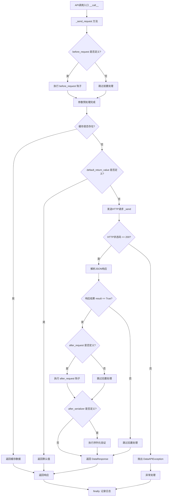
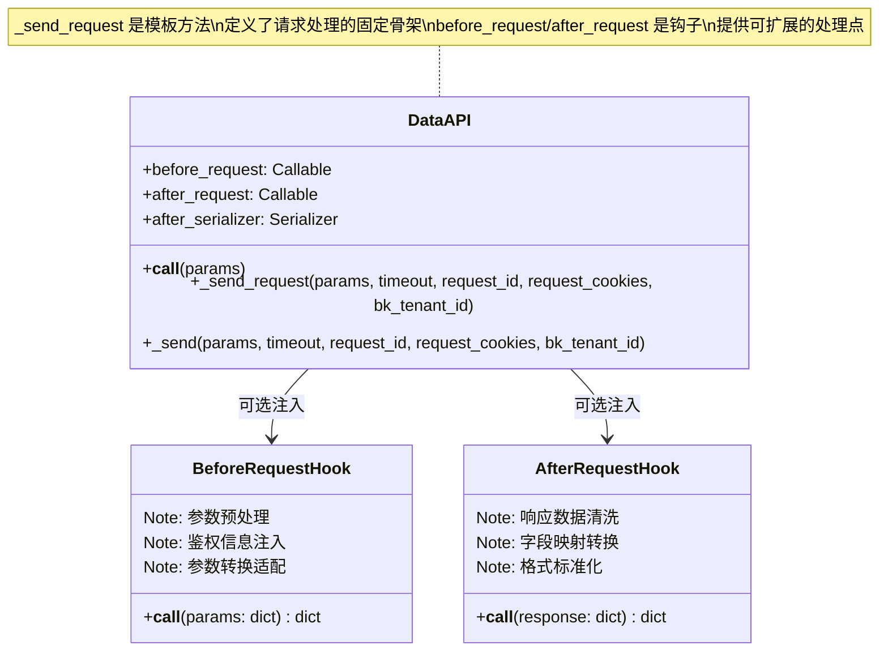
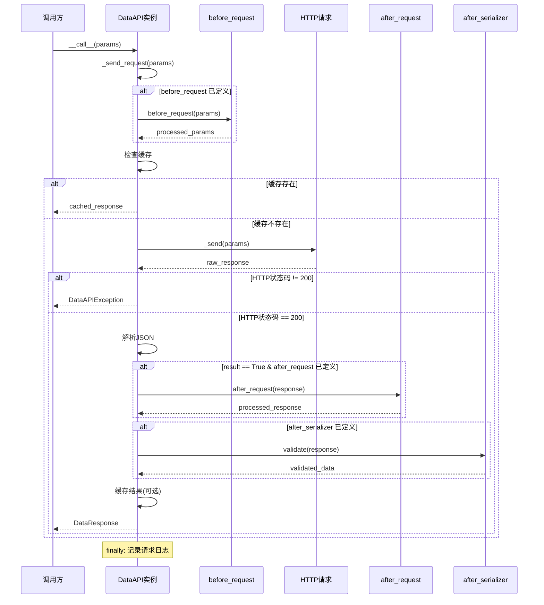

# BKLOG 钩子函数机制

## 1. 概述

BKLOG 的 `DataAPI` 类实现了一套灵活的钩子函数机制，通过 `before_request` 和 `after_request` 两个钩子函数，允许在请求发送前后对参数和响应结果进行自定义处理。这种设计模式借鉴了 Flask 的请求钩子思想和模板方法模式，为 API 调用提供了高度的可扩展性。

## 2. 钩子函数的定义与初始化

### 2.1 钩子函数参数声明

在 `DataAPI` 类的构造函数中，钩子函数作为可选参数传入：

```python
# apps/api/base.py (第 200-249 行)
class DataAPI:
    """Single API for DATA"""

    HTTP_STATUS_OK = 200

    class PaginationStyle(Enum):
        PAGE_NUMBER = "PageNumberPagination"
        LIMIT_OFFSET = "LimitOffsetPagination"

    def __init__(
        self,
        method,
        url,
        module,
        description="",
        default_return_value=None,
        before_request=None,      # 请求前的回调钩子
        after_request=None,       # 请求后的回调钩子
        max_response_record=5000,
        max_query_params_record=5000,
        method_override=None,
        url_keys=None,
        header_keys=None,
        after_serializer=None,
        cache_time=0,
        default_timeout=60,
        data_api_retry_cls=None,
        use_superuser=False,
        no_query_params=False,
        pagination_style=PaginationStyle.LIMIT_OFFSET.value,
        bk_tenant_id: str | Callable[[dict], str] = "",
    ):
        """
        初始化一个请求句柄
        @param {string} method 请求方法, GET or POST，大小写皆可
        @param {string} url 请求地址
        @param {string} module 对应的模块，用于后续查询标记
        @param {string} description 中文描述
        @param {object} default_return_value 默认返回值，在请求失败情形下将返回该值
        @param {function} before_request 请求前的回调  <-- 钩子函数
        @param {function} after_request 请求后的回调    <-- 钩子函数
        @param {serializer} after_serializer 请求后的清洗
        ...
        """
        self.url = url
        self.module = module
        self.method = method
        self.default_return_value = default_return_value

        self.before_request = before_request  # 存储前置钩子
        self.after_request = after_request    # 存储后置钩子

        self.after_serializer = after_serializer
        ...
```

### 2.2 钩子函数签名规范

| 钩子函数 | 输入参数 | 返回值 | 用途 |
|---------|---------|--------|-----|
| `before_request` | `params: dict` | `dict` | 参数预处理、鉴权信息注入、参数转换 |
| `after_request` | `response_result: dict` | `dict` | 响应结果转换、数据清洗、字段映射 |

## 3. 钩子函数的调用时机

### 3.1 `_send_request` 方法核心流程

钩子函数的调用集中在 `_send_request` 方法中，该方法构成了请求处理的核心骨架：

```python
# apps/api/base.py (第 332-424 行)
def _send_request(self, params, timeout, request_id, request_cookies, bk_tenant_id):
    # 请求前的参数清洗处理
    origin_params = params.copy()
    if self.before_request is not None:
        # 将bk_tenant_id传到before_request进行处理（添加管理员账号）
        _bk_tenant_id = bk_tenant_id or self.bk_tenant_id
        if not origin_params.get("bk_tenant_id") and _bk_tenant_id:
            if callable(_bk_tenant_id):
                _bk_tenant_id = _bk_tenant_id(params)
            params["bk_tenant_id"] = _bk_tenant_id
            params = self.before_request(params)    # <-- before_request 钩子调用
            del params["bk_tenant_id"]
        else:
            params = self.before_request(params)    # <-- before_request 钩子调用

    # 缓存检查
    with ignored(Exception):
        cache_key = self._build_cache_key(params, origin_params)
        if self.cache_time:
            result = self._get_cache(cache_key)
            if result is not None:
                return DataResponse(result, request_id)

    # 默认返回值检查（调试阶段可用）
    if self.default_return_value is not None:
        return DataResponse(self.default_return_value, request_id)

    response = None
    error_message = ""
    bk_username = ""
    start_time = time.time()

    try:
        # 发送HTTP请求（含重试逻辑）
        try:
            if self.data_api_retry_cls:
                raw_response = Retrying(...).call(self._send, params, ...)
            else:
                raw_response = self._send(params, timeout, request_id, request_cookies, bk_tenant_id)
        except ReadTimeout as e:
            raise DataAPIException(self, self.get_error_message(str(e)))
        ...

        # HTTP状态码检查
        if raw_response.status_code != self.HTTP_STATUS_OK:
            request_response = {
                "result": False,
                "message": f"[{raw_response.status_code}]" + (raw_response.text or raw_response.reason),
                "code": raw_response.status_code,
            }
            response = DataResponse(request_response, request_id)
            raise DataAPIException(...)

        # JSON解析
        try:
            response_result = raw_response.json()
        except Exception:
            raise DataAPIException(self, _("返回数据格式不正确，结果格式非json."), response=raw_response)
        else:
            # 只有正常返回才会调用 after_request 进行处理
            if "result" not in response_result:
                response_result["result"] = True
            if response_result.get("result"):
                # 请求完成后的清洗处理
                if self.after_request is not None:
                    response_result = self.after_request(response_result)  # <-- after_request 钩子调用

                if self.after_serializer is not None:
                    serializer = self.after_serializer(data=response_result)
                    serializer.is_valid(raise_exception=True)
                    response_result = serializer.validated_data

                if self.cache_time:
                    self._set_cache(cache_key, response_result)

            response = DataResponse(response_result, request_id)
            return response
    finally:
        # 日志记录（始终执行）
        end_time = time.time()
        ...
```

### 3.2 调用时机流程图



## 4. 模板方法模式的应用

### 4.1 设计模式分析

`DataAPI` 类的 `_send_request` 方法体现了**模板方法模式**的核心思想：

```python
# 模板方法模式的骨架结构示意
def _send_request(self, params, ...):
    # Step 1: 前置处理（可扩展点）
    if self.before_request is not None:
        params = self.before_request(params)

    # Step 2: 缓存检查（固定步骤）
    ...

    # Step 3: 发送请求（固定步骤）
    raw_response = self._send(...)

    # Step 4: 后置处理（可扩展点）
    if response_result.get("result"):
        if self.after_request is not None:
            response_result = self.after_request(response_result)

    # Step 5: 日志记录（固定步骤 - finally块）
    ...
```

### 4.2 模板方法模式结构图



### 4.3 设计优势

| 特性 | 说明 |
|-----|-----|
| **开闭原则** | 核心请求流程不变，通过钩子函数扩展行为 |
| **单一职责** | 钩子函数专注于特定预处理/后处理逻辑 |
| **可复用性** | 相同钩子函数可在多个 API 实例中复用 |
| **灵活性** | 每个 API 实例可独立配置不同的钩子组合 |

## 5. 钩子函数实际应用案例

### 5.1 before_request 应用案例

#### 案例1: ESB 鉴权信息注入

```python
# apps/api/modules/utils.py (第 183-216 行)
def add_esb_info_before_request(params):
    """
    通过 params 参数控制是否检查 request
    @param {Boolean} [params.no_request] 是否需要带上 request 标识
    """
    # 规范后的参数
    params["appenv"] = settings.RUN_VER

    if "no_request" in params and params["no_request"]:
        if "bk_username" not in params:
            params["bk_username"] = get_backend_username(bk_tenant_id=params.get("bk_tenant_id"))
        if "operator" not in params:
            params["operator"] = params["bk_username"]
    else:
        req = get_request()
        auth_info = build_auth_args(req)
        params.update(auth_info)
        if not params.get("auth_info"):
            auth_info = _clean_auth_info_uin(auth_info)
            params["auth_info"] = json.dumps(auth_info)
        params.update({"blueking_language": translation.get_language()})

        bk_username = getattr(req.user, "bk_username", None) or req.user.username
        if "bk_username" not in params:
            params["bk_username"] = bk_username
        if "operator" not in params:
            params["operator"] = bk_username

    # 兼容旧接口
    params["uin"] = params["bk_username"]
    return params
```

**用途**: 为请求自动注入蓝鲸 ESB 鉴权所需的用户信息和应用信息。

#### 案例2: CMDB 供应商账号适配

```python
# apps/api/modules/cc.py (第 30-35 行)
def get_supplier_account_before(params):
    params = add_esb_info_before_request(params)
    params = adapt_non_bkcc(params)
    if settings.BK_SUPPLIER_ACCOUNT != "":
        params["bk_supplier_account"] = settings.BK_SUPPLIER_ACCOUNT
    return params
```

**用途**: 在 CMDB API 请求前注入供应商账号信息，并适配非蓝鲸业务空间场景。

#### 案例3: 用户查询参数预处理

```python
# apps/api/modules/bk_login.py (第 50-53 行)
def get_user_before(params):
    params = add_esb_info_before_request(params)
    params["id"] = params["bk_username"]  # 参数映射转换
    return params
```

**用途**: 将 `bk_username` 参数映射为 API 需要的 `id` 参数。

### 5.2 after_request 应用案例

#### 案例1: 用户数据字段映射

```python
# apps/api/modules/bk_login.py (第 56-59 行)
def get_user_after(response_result):
    if "data" in response_result:
        response_result["data"]["chname"] = response_result["data"]["display_name"]
    return response_result
```

**用途**: 将 API 返回的 `display_name` 字段映射为系统使用的 `chname` 字段。

#### 案例2: 批量用户数据转换

```python
# apps/api/modules/utils.py (第 258-262 行)
def get_all_user_after(response_result):
    for _user in response_result.get("data", []):
        _user["chname"] = _user.pop("display_name", _user["username"])
    return response_result
```

**用途**: 遆历用户列表，统一将 `display_name` 换为 `chname` 字段。

#### 案例3: 异常 IP 过滤处理

```python
# apps/api/modules/utils.py (第 326-344 行)
def filter_abnormal_ip_hosts(response_result):
    """
    对list_biz_hosts 接口过滤空IP host及对异常ip进行相应处理
    """
    host_list = response_result.get("data", {}).get("info", [])
    if not host_list:
        return response_result

    dst_host_list = []
    for host in host_list:
        if not host["bk_host_innerip"]:
            continue
        if "," in host["bk_host_innerip"]:
            host["bk_host_innerip"] = host["bk_host_innerip"].split(",")[0]
        dst_host_list.append(host)

    response_result["data"]["info"] = dst_host_list
    return response_result
```

**用途**: 过滤空 IP 主机，处理多 IP 场景（只保留第一个 IP）。

### 5.3 钩子函数组合使用示例

```python
# apps/api/modules/bk_login.py (第 73-80 行)
class _BKLoginApi:
    MODULE = _("PaaS平台登录模块")

    def __init__(self):
        self.get_user = DataAPI(
            method="GET",
            url=self._build_url("/api/bk-login/prod/login/api/v3/open/bk-tokens/userinfo/", "retrieve_user/"),
            module=self.MODULE,
            description="获取单个用户",
            before_request=get_user_before,   # 参数预处理
            after_request=get_user_after,     # 结果转换
        )
```

## 6. 钩子函数执行流程时序图



## 7. 最佳实践建议

### 7.1 钩子函数设计原则

1. **单一职责**: 每个钩子函数只做一件事
2. **无副作用**: 避免在钩子函数中修改全局状态
3. **幂等性**: 多次调用相同参数应返回相同结果
4. **错误处理**: 适当捕获异常，避免影响主流程

### 7.2 常见使用场景

| 场景 | before_request | after_request |
|-----|---------------|---------------|
| 鉴权信息注入 | 添加 `bk_username`, `bk_app_code` 等 | - |
| 参数映射转换 | 字段名转换、格式调整 | - |
| 数据清洗过滤 | - | 过滤无效数据、清洗字段 |
| 字段标准化 | - | 统一命名规范、格式转换 |
| 多租户适配 | 注入租户ID、适配业务空间 | - |

### 7.3 代码组织建议

```python
# 推荐的钩子函数组织方式
# 1. 通用钩子放在 utils.py
# 2. 模块专用钩子放在对应模块文件中
# 3. 钩子函数命名遵循 {action}_{target}_before/after 模式

# apps/api/modules/utils.py - 通用钩子
def add_esb_info_before_request(params): ...
def add_app_info_before_request(params): ...

# apps/api/modules/bk_login.py - 模块专用钩子
def get_user_before(params): ...
def get_user_after(response_result): ...
```

## 8. 总结

BKLOG 的钩子函数机制通过模板方法模式，在 `_send_request` 方法中定义了固定的请求处理骨架，并通过 `before_request` 和 `after_request` 两个可扩展点，实现了：

- **请求参数预处理**: 鉴权注入、参数转换、适配处理
- **响应结果后处理**: 数据清洗、字段映射、格式标准化

这种设计使得 API 调用逻辑既保持了统一性，又具备了高度的灵活性，是微服务架构中 API 客户端设计的优秀实践。

---

**相关文件**:
- `apps/api/base.py` - DataAPI 核心实现
- `apps/api/modules/utils.py` - 通用钩子函数
- `apps/api/modules/bk_login.py` - 登录模块钩子示例
- `apps/api/modules/cc.py` - CMDB 模块钩子示例