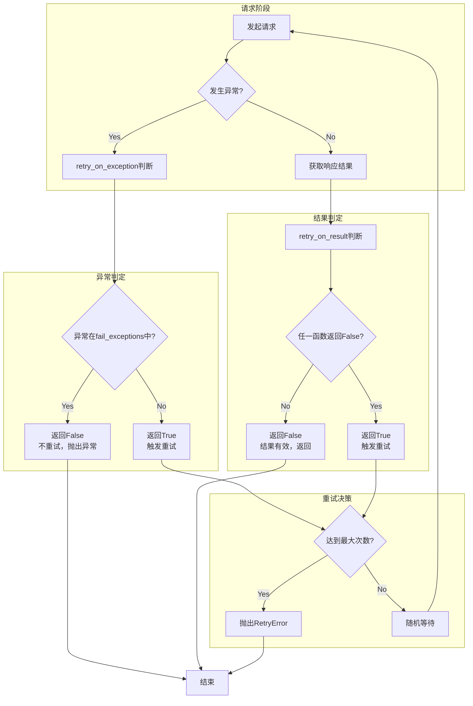

# 重试机制详解

> 聚焦：apps/api/base.py 的 DataApiRetryClass
> 与 retrying 库的集成原理

## 1. 重试机制设计背景

### 1.1 问题场景

在分布式系统中，网络请求面临多种不确定性：

| 场景 | 特征 | 典型原因 |
|------|------|----------|
| 网络抖动 | 短暂的连接失败 | 网络拥塞、路由切换 |
| 服务暂时不可用 | 短时间的拒绝响应 | 服务重启、负载过高 |
| 超时 | 请求未在预期时间内返回 | 服务处理慢、网络延迟 |
| 结果校验失败 | 业务层面返回失败 | 数据平台处理繁忙 |

### 1.2 为什么需要可配置的重试策略

**核心设计目标**：

1. **差异化策略**：不同接口对可靠性要求不同
2. **避免雪崩**：通过随机等待时间（jitter）避免多个请求同时重试
3. **双触发机制**：支持异常触发和结果校验触发两种重试方式
4. **可扩展性**：允许业务层自定义重试判定逻辑

---

## 2. DataApiRetryClass 类结构

### 2.1 完整代码片段（行号108-174）

```python
# apps/api/base.py 第 108-174 行
class DataApiRetryClass:
    def __init__(self, stop_max_attempt_number=1, wait_random_min=0, wait_random_max=1000):
        self.stop_max_attempt_number = stop_max_attempt_number
        self.wait_random_min = wait_random_min
        self.wait_random_max = wait_random_max
        self.fail_exceptions = []
        self.fail_check_functions = []

    def add_exceptions(self, exceptions: list):
        self.fail_exceptions.extend(exceptions)

    def add_fail_check_functions(self, fail_check_functions: list):
        """
        添加检查result是否失败的函数, 参数默认接受result对象
        函数语义为函数结果是否为True, 为False则重试
        """
        self.fail_check_functions.extend(fail_check_functions)

    @property
    def retry_on_exception(self):
        def wraps(exception):
            for fail_exception in self.fail_exceptions:
                if isinstance(exception, fail_exception):
                    return False  # 不重试，直接抛出
            return True  # 其他异常触发重试
        return wraps

    @property
    def retry_on_result(self):
        """result为请求的返回结果"""
        def wraps(result):
            for fail_check_func in self.fail_check_functions:
                if not fail_check_func(result):
                    return True  # 触发重试
            return False  # 不重试
        return wraps

    @staticmethod
    def create_retry_obj(
        exceptions: list = None,
        fail_check_functions: list = None,
        stop_max_attempt_number=1,
        wait_random_min=0,
        wait_random_max=1000,
    ):
        retry_obj = DataApiRetryClass(
            stop_max_attempt_number=stop_max_attempt_number,
            wait_random_min=wait_random_min,
            wait_random_max=wait_random_max,
        )
        if exceptions:
            retry_obj.add_exceptions(exceptions)
        if fail_check_functions:
            retry_obj.add_fail_check_functions(fail_check_functions)
        return retry_obj
```

### 2.2 核心属性解析

| 属性 | 类型 | 默认值 | 说明 |
|------|------|--------|------|
| `stop_max_attempt_number` | int | 1 | 最大尝试次数（含首次请求） |
| `wait_random_min` | int | 0 | 最小等待时间（毫秒） |
| `wait_random_max` | int | 1000 | 最大等待时间（毫秒） |
| `fail_exceptions` | list | [] | 不触发重试的异常类型列表 |
| `fail_check_functions` | list | [] | 结果检查函数列表 |

---

## 3. 两类重试触发方式

### 3.1 retry_on_exception：异常触发重试

```python
# apps/api/base.py 第 131-140 行
@property
def retry_on_exception(self):
    def wraps(exception):
        for fail_exception in self.fail_exceptions:
            if isinstance(exception, fail_exception):
                return False  # 不重试，直接抛出
        return True  # 其他异常触发重试
    return wraps
```

**设计逻辑**：
- `fail_exceptions` 是"不需要重试的异常类型"
- 当异常属于这些类型时，返回 `False`（不重试）
- 其他所有异常返回 `True`（触发重试）

### 3.2 retry_on_result：结果校验重试

```python
# apps/api/base.py 第 142-154 行
@property
def retry_on_result(self):
    def wraps(result):
        for fail_check_func in self.fail_check_functions:
            if not fail_check_func(result):
                return True  # 触发重试
        return False  # 不重试
    return wraps
```

**设计逻辑**：
- 函数语义：返回 True 表示结果有效（不重试），返回 False 表示结果无效（触发重试）
- 所有检查函数都返回 True 时，才认为结果有效

### 3.3 流程图（Mermaid）



---

## 4. check_result_is_true() 函数

```python
# apps/api/base.py 第 176-181 行
def check_result_is_true(result: Response) -> bool:
    """通用的根据result结果重试判断函数"""
    try:
        return result.json()["result"]
    except Exception:
        return False
```

**函数语义**：
- 参数：`requests.Response` 对象
- 返回：`True` 表示结果有效，`False` 表示结果无效（触发重试）
- 从响应JSON中提取 `result` 字段判断业务是否成功

---

## 5. 在 _send_request() 中的应用

### 5.1 Retrying 包装调用

```python
# apps/api/base.py 第 367-385 行
if self.data_api_retry_cls:
    raw_response = Retrying(
        stop_max_attempt_number=self.data_api_retry_cls.stop_max_attempt_number,
        wait_random_min=self.data_api_retry_cls.wait_random_min,
        wait_random_max=self.data_api_retry_cls.wait_random_max,
        retry_on_exception=self.data_api_retry_cls.retry_on_exception,
        retry_on_result=self.data_api_retry_cls.retry_on_result,
    ).call(self._send, params, timeout, request_id, request_cookies, bk_tenant_id)
else:
    raw_response = self._send(params, timeout, request_id, request_cookies, bk_tenant_id)
```

### 5.2 RetryError 处理逻辑

```python
except RetryError as e:
    if e.last_attempt.has_exception:
        raise DataAPIException(self, self.get_error_message(str(e)))
    raw_response = e.last_attempt.value
```

**关键点**：
- `e.last_attempt.has_exception`：最后一次尝试是否抛出异常
- `e.last_attempt.value`：最后一次尝试的返回值（无异常时）

---

## 6. 重试策略配置示例

### 6.1 数据平台查询的重试配置

```python
# apps/log_clustering/handlers/dataflow/dataflow_handler.py 第 643-645 行
return BkDataDataFlowApi.get_latest_deploy_data(
    params={...},
    data_api_retry_cls=DataApiRetryClass.create_retry_obj(
        fail_check_functions=[check_result_is_true],
        stop_max_attempt_number=3
    ),
)
```

### 6.2 推荐配置

| 场景 | 重试次数 | 单次超时 | 等待时间 |
|------|----------|----------|----------|
| 快速查询 | 1-2次 | 30秒 | 100-500ms |
| 数据处理 | 3-5次 | 60-120秒 | 1-5秒 |
| 关键操作 | 5次+ | 120秒+ | 3-10秒 |

---

## 7. 设计要点

### 7.1 随机等待时间的设计意图

```python
# 等待时间范围：wait_random_min ~ wait_random_max（毫秒）
wait_random_min=0
wait_random_max=1000  # 默认 0-1000ms
```

**设计目的**：
1. **避免雪崩效应**：多个请求同时失败后，随机等待避免同时重试
2. **给服务恢复时间**：等待期间服务可能恢复正常
3. **负载均衡**：分散重试请求的时间分布

---

## 8. 相关文档

- [01-DataAPI核心实现.md](./01-DataAPI核心实现.md) - DataAPI 类的完整解析
- [02-钩子函数机制.md](./02-钩子函数机制.md) - before_request 和 after_request 设计