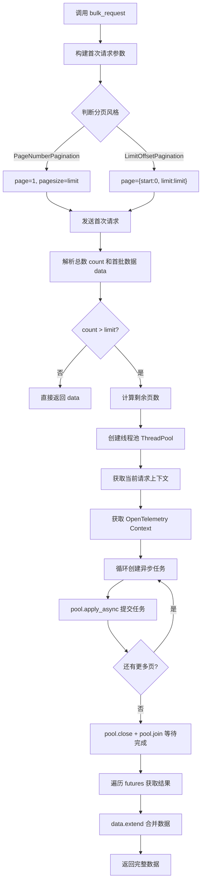
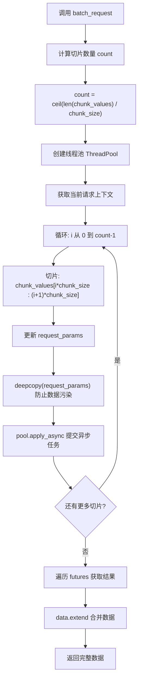
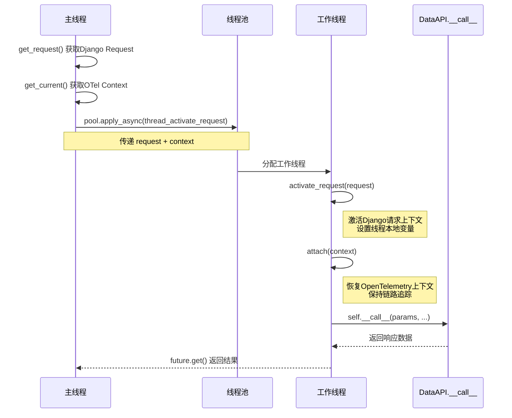

# 并发请求封装

> 聚焦：apps/api/base.py
> bulk_request 和 batch_request 实现

## 1. 并发请求场景

在日志平台等大数据量场景中，经常需要处理两类典型问题：

| 场景 | 描述 | 解决方案 |
|------|------|----------|
| **分页遍历全量数据** | API返回分页数据，需遍历所有页获取完整数据集 | `bulk_request()` - 自动分页并发 |
| **大批量数据处理** | 请求参数包含大量ID或数据项，超出单次请求限制 | `batch_request()` - 参数切片并发 |

两种方案均基于 `multiprocessing.pool.ThreadPool` 实现线程池并发，并通过 `thread_activate_request()` 处理跨线程上下文传递。

---

## 2. bulk_request() 分页并发

### 2.1 完整代码片段

```python
# 文件: apps/api/base.py
# 行号: 676-741

def bulk_request(
    self,
    params=None,
    get_data=lambda x: x["info"],
    get_count=lambda x: x["count"],
    limit=settings.BULK_REQUEST_LIMIT,
    bk_tenant_id="",
):
    """
    并发请求接口，用于需要分页多次请求的情况
    :param params: 请求参数
    :param get_data: 获取数据函数
    :param get_count: 获取总数函数
    :param limit: 一次请求数量
    :param bk_tenant_id: 租户ID
    :return: 请求结果
    """
    params = params or {}
    pagination_style = self.PaginationStyle.PAGE_NUMBER.value
    # 请求第一次获取总数
    if self.pagination_style == pagination_style:
        request_params = {"page": 1, "pagesize": limit, "no_request": True}
    else:
        request_params = {"page": {"start": 0, "limit": limit}, "no_request": True}
    request_params.update(params)
    result = self.__call__(request_params, bk_tenant_id=bk_tenant_id)
    count = get_count(result)
    data = get_data(result)
    start = limit

    # 如果第一次没拿完，根据请求总数并发请求
    pool = ThreadPool()
    futures = []
    request = None
    with ignored(Exception):
        request = get_request()
    if self.pagination_style == pagination_style:
        start = 2
        count = math.ceil(count / limit) + 1
    while start < count:
        if self.pagination_style == pagination_style:
            request_params = {"page": start, "pagesize": limit, "no_request": True}
        else:
            request_params = {"page": {"limit": limit, "start": start}, "no_request": True}
        request_params.update(params)
        # request_params["requests"] = get_request()
        futures.append(
            pool.apply_async(
                self.thread_activate_request,
                args=(request_params,),
                kwds={"request": request, "context": get_current(), "bk_tenant_id": bk_tenant_id},
            )
        )
        if self.pagination_style == pagination_style:
            start += 1
        else:
            start += limit

    pool.close()
    pool.join()

    # 取值
    for future in futures:
        data.extend(get_data(future.get()))

    return data
```

### 2.2 参数详解

| 参数 | 类型 | 默认值 | 说明 |
|------|------|--------|------|
| `params` | dict | None | 基础请求参数，会合并到每次分页请求中 |
| `get_data` | Callable | `lambda x: x["info"]` | 从响应中提取数据列表的函数 |
| `get_count` | Callable | `lambda x: x["count"]` | 从响应中提取总数的函数 |
| `limit` | int | `settings.BULK_REQUEST_LIMIT` | 每页数据量上限 |
| `bk_tenant_id` | str | "" | 多租户模式下的租户ID |

### 2.3 分页风格支持

```python
# 行号: 196-198
class PaginationStyle(Enum):
    PAGE_NUMBER = "PageNumberPagination"      # 页码分页: page=1, pagesize=100
    LIMIT_OFFSET = "LimitOffsetPagination"    # 偏移分页: page={"start": 0, "limit": 100}
```

### 2.4 自动分页逻辑流程



### 2.5 核心机制解析

**首次请求获取总数策略：**
- 先发送一次请求获取数据总量
- 根据 `get_count` 函数提取总数
- 避免预先知道数据量，动态适应API返回

**并发任务提交：**
```python
# 行号: 722-728
futures.append(
    pool.apply_async(
        self.thread_activate_request,
        args=(request_params,),
        kwds={"request": request, "context": get_current(), "bk_tenant_id": bk_tenant_id},
    )
)
```

**关键点：**
1. `request_params` 需要深拷贝（已在 `batch_request` 中使用 `deepcopy`）
2. 传递 `request` 对象保持Django请求上下文
3. 传递 `context` 保持 OpenTelemetry 链路追踪

---

## 3. batch_request() 切片并发

### 3.1 完整代码片段

```python
# 文件: apps/api/base.py
# 行号: 632-674

def batch_request(
    self,
    chunk_key,
    chunk_values,
    params=None,
    chunk_size=settings.BULK_REQUEST_LIMIT,
    get_data=lambda x: x["list"],
    bk_tenant_id="",
):
    """
    并发请求接口，用于需要切片多次请求的情况
    :param chunk_key: 需要进行切片的参数名
    :param chunk_values: 需要进行切片的参数值
    :param params: 请求参数
    :param chunk_size: 一次请求数量
    :param get_data: 获取数据函数
    :param bk_tenant_id: 租户ID
    :return: 请求结果
    """
    request_params = params or {}
    chunk_values = chunk_values or []
    request_params.update({"no_request": True})

    data = []
    count = math.ceil(len(chunk_values) / chunk_size)
    futures = []
    pool = ThreadPool()
    request = None
    with ignored(Exception):
        request = get_request()
    for i in range(count):
        request_params.update({chunk_key: chunk_values[i * chunk_size : i * chunk_size + chunk_size]})
        futures.append(
            pool.apply_async(
                self.thread_activate_request,
                args=(deepcopy(request_params),),
                kwds={"request": request, "context": get_current(), "bk_tenant_id": bk_tenant_id},
            )
        )
    for future in futures:
        data.extend(get_data(future.get()))

    return data
```

### 3.2 参数详解

| 参数 | 类型 | 默认值 | 说明 |
|------|------|--------|------|
| `chunk_key` | str | 必填 | 需要切片的参数名，如 `"ids"` |
| `chunk_values` | list | 必填 | 需要切片的参数值列表 |
| `params` | dict | None | 其他请求参数 |
| `chunk_size` | int | `settings.BULK_REQUEST_LIMIT` | 每次请求数据量上限 |
| `get_data` | Callable | `lambda x: x["list"]` | 从响应中提取数据的函数 |
| `bk_tenant_id` | str | "" | 多租户模式下的租户ID |

### 3.3 切片策略流程



### 3.4 与 bulk_request 的核心差异

| 特性 | bulk_request | batch_request |
|------|--------------|---------------|
| **使用场景** | 分页遍历全量数据 | 大批量ID/参数切片 |
| **首次请求** | 需要首次请求获取总数 | 无需首次请求，直接切片 |
| **参数构建** | 自动生成page参数 | 用户指定切片参数名 |
| **深拷贝** | 不需要（参数独立构建） | 需要（复用params字典） |
| **pool.close/join** | 有 | 无（依赖future遍历阻塞） |

---

## 4. thread_activate_request() 线程封装

### 4.1 完整代码片段

```python
# 文件: apps/api/base.py
# 行号: 743-769

def thread_activate_request(
    self,
    params=None,
    files=None,
    raw=False,
    timeout=None,
    raise_exception=True,
    request_cookies=True,
    request=None,
    context=None,
    bk_tenant_id="",
):
    """
    处理并发请求无法activate_request的封装
    """
    if request:
        activate_request(request)
    attach(context)
    return self.__call__(
        params=params,
        files=files,
        raw=raw,
        timeout=timeout,
        raise_exception=raise_exception,
        request_cookies=request_cookies,
        bk_tenant_id=bk_tenant_id,
    )
```

### 4.2 参数详解

| 参数 | 类型 | 默认值 | 说明 |
|------|------|--------|------|
| `params` | dict | None | 请求参数 |
| `files` | dict | None | 文件上传数据 |
| `raw` | bool | False | 是否返回原始响应 |
| `timeout` | int | None | 时时间 |
| `raise_exception` | bool | True | 是否抛出异常 |
| `request_cookies` | bool | True | 是否携带cookies |
| `request` | Request | None | Django请求对象 |
| `context` | Context | None | OpenTelemetry上下文 |
| `bk_tenant_id` | str | "" | 租户ID |

### 4.3 上下文传递机制



### 4.4 关键依赖导入

```python
# 文件: apps/api/base.py
# 行号: 42
from opentelemetry.context import attach, get_current

# 文件: apps/utils/local.py (通过 apps.api.base 导入)
# 行号: 51-57
from apps.utils.local import (
    activate_request,
    get_request,
    get_request_id,
    get_request_tenant_id,
    get_request_username,
)
```

**OpenTelemetry 上下文作用：**
- 保持分布式追踪链路连续性
- 在子线程中恢复 trace_id、span_id
- 确保日志和监控数据关联

**Django Request 上下文作用：**
- 保持用户身份信息
- 保持语言设置
- 保持会话状态

---

## 5. 实战案例

### 5.1 使用 bulk_request 遍历全量数据

```python
# 示例：获取所有采集项配置
from apps.api import bk_log

# 定义API实例（通常在 apps.api.modules 中定义）
collect_instances = DataAPI(
    method="GET",
    url="http://bk-log/api/collect/instances/",
    module="collect",
    description="采集项列表查询",
    pagination_style=DataAPI.PaginationStyle.LIMIT_OFFSET.value,
)

# 使用 bulk_request 自动分页获取全量数据
all_instances = collect_instances.bulk_request(
    params={"bk_biz_id": 2},           # 筛选条件
    get_data=lambda x: x["info"],       # 数据提取函数
    get_count=lambda x: x["count"],      # 总数提取函数
    limit=100,                           # 每页100条
)

print(f"共获取 {len(all_instances)} 条采集项")
```

### 5.2 使用 batch_request 处理大批量ID

```python
# 示例：批量查询日志集群状态
cluster_api = DataAPI(
    method="POST",
    url="http://bk-log/api/clusters/status/",
    module="cluster",
    description="集群状态批量查询",
)

# 需要查询的集群ID列表（可能超过API单次限制）
cluster_ids = list(range(1, 10001))  # 10000个ID

# 使用 batch_request 自动切片并发查询
results = cluster_api.batch_request(
    chunk_key="cluster_ids",              # 切片参数名
    chunk_values=cluster_ids,             # 待切片数据
    params={"detail": True},              # 其他参数
    chunk_size=200,                       # 每次请求200个ID
    get_data=lambda x: x["list"],         # 数据提取函数
)

print(f"共查询 {len(results)} 个集群状态")
```

### 5.3 自定义数据提取函数

```python
# 处理非标准响应格式
def custom_data_extractor(response):
    """处理嵌套数据结构"""
    return response.get("data", {}).get("items", [])

def custom_count_extractor(response):
    """从嵌套结构提取总数"""
    return response.get("data", {}).get("total", 0)

results = api.bulk_request(
    params={"status": "active"},
    get_data=custom_data_extractor,
    get_count=custom_count_extractor,
    limit=500,
)
```

### 5.4 在 DRFAPISet 中的使用

```python
# 文件: apps/api/modules/example.py
from apps.api.base import DataDRFAPISet, DRFActionAPI

# 定义 RESTful API 集合
storage_api = DataDRFAPISet(
    url="http://bk-log/api/storages/",
    primary_key="storage_id",
    module="storage",
    description="存储集群管理",
    custom_config={
        "test_connection": DRFActionAPI(detail=True, method="post"),
        "sync_config": DRFActionAPI(detail=False, method="post"),
    }
)

# 获取所有存储配置
all_storages = storage_api.list.bulk_request(
    params={"type": "elasticsearch"},
    limit=100,
)
```

---

## 6. 相关文档

| 文档 | 说明 |
|------|------|
| [01-DataAPI核心实现.md](./01-DataAPI核心实现.md) | DataAPI 核心类设计 |
| [02-钩子函数机制.md](./02-钩子函数机制.md) | before_request 和 after_request 设计 |
| [03-重试机制详解.md](./03-重试机制详解.md) | DataApiRetryClass 重试配置 |
| [05-DRF适配器.md](./05-DRF适配器.md) | DataDRFAPISet RESTful封装 |

---

## 附录：线程池使用注意事项

### A.1 深拷贝的必要性

```python
# batch_request 中的深拷贝（行号: 667）
futures.append(
    pool.apply_async(
        self.thread_activate_request,
        args=(deepcopy(request_params),),  # 必须深拷贝！
        ...
    )
)
```

**原因：** `request_params` 在循环中被反复更新，如果不深拷贝，所有任务将共享同一份参数引用，导致数据污染。

### A.2 线程池资源管理

```python
# bulk_request 中的线程池管理（行号: 734-735）
pool.close()  # 不再接受新任务
pool.join()   # 等待所有任务完成
```

**注意：** `batch_request` 中没有显式调用 `pool.close()/join()`，依赖 `future.get()` 的阻塞特性等待任务完成。

### A.3 配置项引用

```python
# 默认切片大小来自 settings.BULK_REQUEST_LIMIT
# 通常在 config/default.py 中配置
BULK_REQUEST_LIMIT = 500  # 建议值，根据API承载能力调整
```