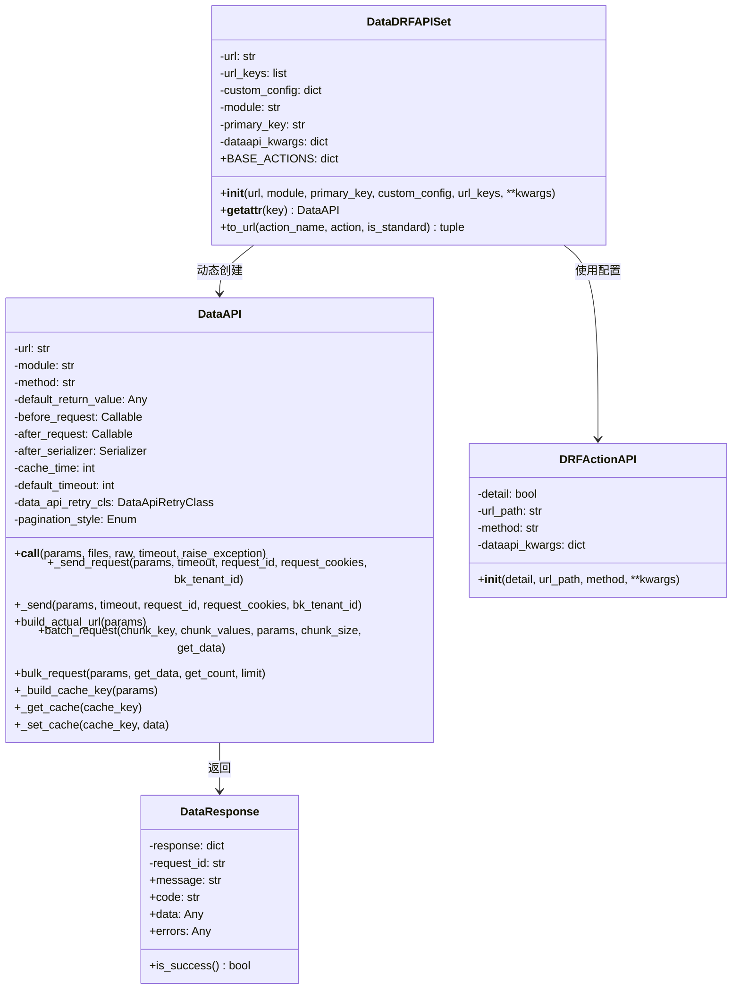
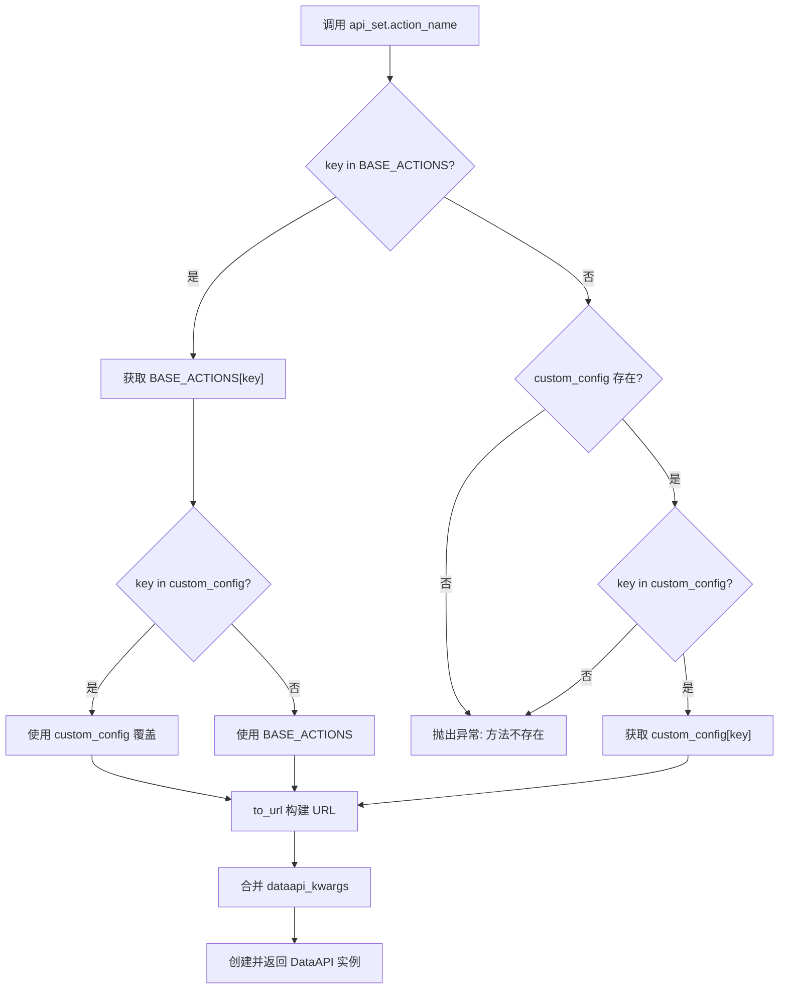
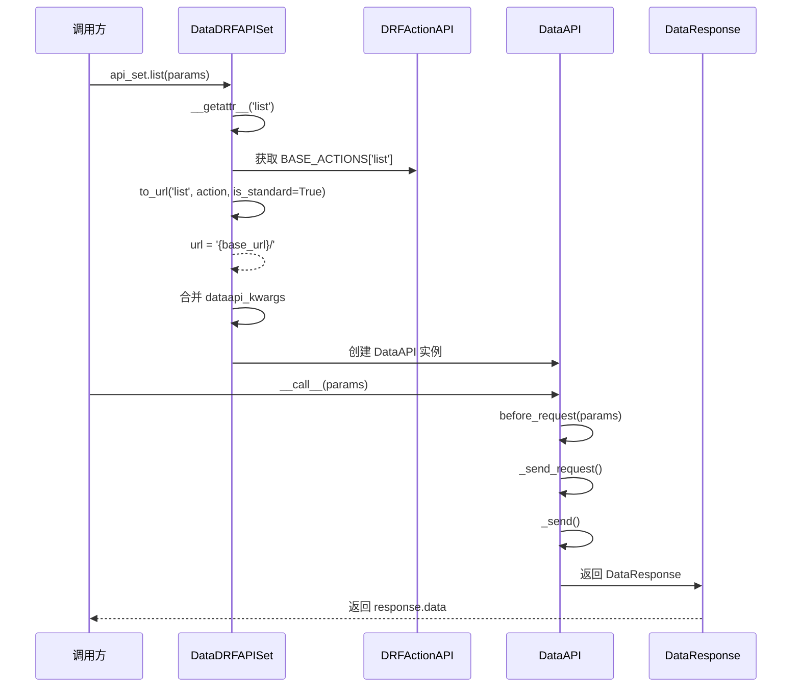

# DRF 适配器技术文档

## 1. 概述

DRF 适配器是 BKLOG 日志平台中用于对接 Django REST Framework 风格 API 的客户端封装。它提供了声明式的 RESTful 资源操作接口，将标准的 HTTP 方法映射为对象方法调用，大幅简化了 API 调用代码的编写。

## 2. 核心类设计

### 2.1 类图



### 2.2 DRFActionAPI 类

DRFActionAPI 用于声明单个资源操作，类似于 DRF 中的 `detail_route` 和 `list_route` 装饰器。

**代码位置：** 第 788-801 行

```python
class DRFActionAPI:
    def __init__(self, detail=True, url_path=None, method=None, **kwargs):
        """
        资源操作申明，类似 DRF 中的 detail_route、list_route，透传 DataAPI 配置
        """
        self.detail = detail
        self.url_path = url_path
        self.method = method

        for k in list(kwargs.keys()):
            if k not in DRF_DATAAPI_CONFIG:
                raise Exception(f"Not support {k} config, SUPPORT_DATAAPI_CONFIG:{DRF_DATAAPI_CONFIG}")

        self.dataapi_kwargs = kwargs
```

**参数说明：**

| 参数 | 类型 | 默认值 | 说明 |
|------|------|--------|------|
| `detail` | bool | `True` | 是否为详情资源操作（影响 URL 路径） |
| `url_path` | str | `None` | 自定义 URL 子路径 |
| `method` | str | `None` | HTTP 方法（GET/POST/PUT/PATCH/DELETE） |
| `**kwargs` | dict | - | 透传给 DataAPI 的配置项 |

**支持的透传配置项（DRF_DATAAPI_CONFIG）：**

```python
DRF_DATAAPI_CONFIG = [
    "description",          # 接口描述
    "default_return_value", # 默认返回值
    "before_request",       # 请求前回调
    "after_request",         # 请求后回调
    "max_response_record",   # 最大响应记录长度
    "max_query_params_record", # 最大请求参数记录长度
    "default_timeout",       # 默认超时时间
    "custom_headers",        # 自定义请求头
    "output_standard",       # 输出标准化
    "request_auth",          # 请求认证
    "cache_time",            # 缓存时间
    "bk_tenant_id",          # 租户ID
]
```

### 2.3 DataDRFAPISet 类

DataDRFAPISet 是 DRF 适配器的核心类，用于声明一组 RESTful 资源操作。

**代码位置：** 第 804-904 行

```python
class DataDRFAPISet:
    """
    For djangorestframework api set in the backend
    """

    BASE_ACTIONS = {
        "list": DRFActionAPI(detail=False, method="get"),
        "create": DRFActionAPI(detail=False, method="post"),
        "update": DRFActionAPI(method="put"),
        "partial_update": DRFActionAPI(method="patch"),
        "delete": DRFActionAPI(method="delete"),
        "retrieve": DRFActionAPI(method="get"),
    }

    def __init__(self, url, module, primary_key, custom_config=None, url_keys=None, **kwargs):
        """
        申明具体某一资源的 restful-api 集合工具，透传 DataAPI 配置

        @param {String} url 资源路径
        @param {String} primary_key 资源ID
        @param {Dict} custom_config 给请求资源增添额外动作，支持定制化配置
            {
                'start': DRFActionAPI(detail=True, method='post')
            }
        @params kwargs 支持 DRF_DATAAPI_CONFIG 定义的配置项，参数说明请求参照 DataAPI
        """
        self.url = url
        self.url_keys = url_keys
        self.custom_config = custom_config
        self.module = module
        self.primary_key = primary_key

        for k in list(kwargs.keys()):
            if k not in DRF_DATAAPI_CONFIG:
                raise Exception(f"Not support {k} config, SUPPORT_DATAAPI_CONFIG:{DRF_DATAAPI_CONFIG}")

        self.dataapi_kwargs = kwargs
```

**参数说明：**

| 参数 | 类型 | 默认值 | 说明 |
|------|------|--------|------|
| `url` | str | 必填 | 资源基础路径 |
| `module` | str | 必填 | 模块名称（用于日志记录） |
| `primary_key` | str | 必填 | 资源主键字段名 |
| `custom_config` | dict | `None` | 自定义动作配置 |
| `url_keys` | list | `None` | URL 模板中的变量键列表 |
| `**kwargs` | dict | - | 透传给 DataAPI 的配置项 |

## 3. RESTful 动作映射

### 3.1 标准动作定义

DataDRFAPISet 内置了 6 种标准 RESTful 动作：

```python
BASE_ACTIONS = {
    "list": DRFActionAPI(detail=False, method="get"),
    "create": DRFActionAPI(detail=False, method="post"),
    "update": DRFActionAPI(method="put"),
    "partial_update": DRFActionAPI(method="patch"),
    "delete": DRFActionAPI(method="delete"),
    "retrieve": DRFActionAPI(method="get"),
}
```

### 3.2 动作与 URL 映射关系

| 动作 | HTTP 方法 | detail | URL 模式 | 示例 |
|------|-----------|--------|----------|------|
| `list` | GET | False | `{base_url}/` | `GET /api/insts/` |
| `create` | POST | False | `{base_url}/` | `POST /api/insts/` |
| `retrieve` | GET | True | `{base_url}/{pk}/` | `GET /api/insts/123/` |
| `update` | PUT | True | `{base_url}/{pk}/` | `PUT /api/insts/123/` |
| `partial_update` | PATCH | True | `{base_url}/{pk}/` | `PATCH /api/insts/123/` |
| `delete` | DELETE | True | `{base_url}/{pk}/` | `DELETE /api/insts/123/` |

### 3.3 URL 构建逻辑

**代码位置：** 第 859-871 行

```python
def to_url(self, action_name, action, is_standard=False):
    target_url_keys = self.url_keys[:] if self.url_keys else []
    if action.detail:
        target_url = f"{self.url}{{{self.primary_key}}}/"
        target_url_keys.append(self.primary_key)
    else:
        target_url = f"{self.url}"

    if not is_standard:
        sub_path = action.url_path if action.url_path else action_name
        target_url += f"{sub_path}/"

    return target_url, target_url_keys
```

**URL 构建规则：**

1. **detail=True（详情资源）**：URL 包含主键占位符 `{primary_key}/`
2. **detail=False（列表资源）**：URL 仅为基础路径
3. **自定义动作（非标准）**：追加 `url_path` 或动作名称作为子路径

## 4. 自定义动作扩展

### 4.1 扩展方式

通过 `custom_config` 参数可以添加自定义动作：

```python
custom_config={
    'start': DRFActionAPI(detail=True, method='post'),
    'stop': DRFActionAPI(detail=True, method='post'),
    'batch_delete': DRFActionAPI(detail=False, method='post', url_path='batch/delete'),
}
```

### 4.2 动态分发机制

**代码位置：** 第 873-904 行

```python
def __getattr__(self, key):
    """
    通过 ins.create 轃用DRF方法，会在该函数进行分发
    """
    action, url, url_keys = None, "", []
    if key in self.BASE_ACTIONS:
        action = self.BASE_ACTIONS[key]
        url, url_keys = self.to_url(key, action, is_standard=True)

    if self.custom_config is not None and key in self.custom_config:
        action = self.custom_config[key]
        url, url_keys = self.to_url(key, self.custom_config[key])

    if key in self.custom_config and key in self.BASE_ACTIONS:
        action = self.custom_config[key]
        url, url_keys = self.to_url(key, self.custom_config[key], is_standard=True)

    if action is None:
        raise Exception(_("请求方法%s不存在") % key)

    method = action.method

    dataapi_kwargs = {
        "method": method,
        "url": url,
        "url_keys": url_keys,
        "module": self.module,
    }
    dataapi_kwargs.update(self.dataapi_kwargs)
    dataapi_kwargs.update(action.dataapi_kwargs)

    return DataAPI(**dataapi_kwargs)
```

**优先级规则：**

1. 首先检查 `BASE_ACTIONS` 中是否存在
2. 焄后检查 `custom_config` 中是否存在
3. 如果同时存在于两者，以 `custom_config` 为准（作为标准动作覆盖）

### 4.3 流程图



## 5. 与标准 DataAPI 的差异

### 5.1 设计理念差异

| 特性 | DataAPI | DataDRFAPISet |
|------|---------|--------------|
| 设计模式 | 单一接口封装 | 资源集合封装 |
| URL 绑定 | 固定 URL | 动态 URL 生成 |
| 方法绑定 | 单一 HTTP 方法 | 多方法映射 |
| 使用场景 | 单个 API 调用 | RESTful 资源操作 |
| 配置方式 | 每个接口独立配置 | 集中式资源配置 |

### 5.2 接口对比

**DataAPI 使用方式：**

```python
# 需要为每个操作单独创建实例
list_api = DataAPI(
    method='GET',
    url='http://api.example.com/insts/',
    module='meta',
    description='获取实例列表'
)

create_api = DataAPI(
    method='POST',
    url='http://api.example.com/insts/',
    module='meta',
    description='创建实例'
)

retrieve_api = DataAPI(
    method='GET',
    url='http://api.example.com/insts/{inst_id}/',
    url_keys=['inst_id'],
    module='meta',
    description='获取单个实例'
)

# 调用
list_api(params={})
create_api(params={'name': 'test'})
retrieve_api(params={'inst_id': 123})
```

**DataDRFAPISet 使用方式：**

```python
# 一次声明，自动生成所有标准方法
inst_api = DataDRFAPISet(
    url='http://api.example.com/insts/',
    primary_key='inst_id',
    module='meta',
    description='实例操作集合',
    custom_config={
        'start': DRFActionAPI(detail=True, method='post'),
        'batch_delete': DRFActionAPI(detail=False, method='post'),
    }
)

# 调用标准方法
inst_api.list(params={})
inst_api.create(params={'name': 'test'})
inst_api.retrieve(params={'inst_id': 123})
inst_api.update(params={'inst_id': 123, 'name': 'updated'})
inst_api.partial_update(params={'inst_id': 123, 'name': 'patched'})
inst_api.delete(params={'inst_id': 123})

# 调用自定义方法
inst_api.start(params={'inst_id': 123})
inst_api.batch_delete(params={'ids': [1, 2, 3]})
```

### 5.3 配置继承与覆盖

DataDRFAPISet 支持三层配置优先级：

```
action.dataapi_kwargs (最高优先级)
        ↓
self.dataapi_kwargs (中间优先级)
        ↓
默认配置 (最低优先级)
```

**配置合并代码：**

```python
dataapi_kwargs = {
    "method": method,
    "url": url,
    "url_keys": url_keys,
    "module": self.module,
}
dataapi_kwargs.update(self.dataapi_kwargs)      # 集合级配置
dataapi_kwargs.update(action.dataapi_kwargs)    # 动作级配置（最高优先级）
```

## 6. 使用示例

### 6.1 基础使用

```python
from apps.api.base import DataDRFAPISet, DRFActionAPI

# 定义资源 API 集合
collector_api = DataDRFAPISet(
    url='http://bk-collector.example.com/collectors/',
    primary_key='collector_id',
    module='collector',
    description='采集器管理',
    default_timeout=30,
    before_request=add_auth_info,
)

# 列表查询
result = collector_api.list(params={'page': 1, 'pagesize': 20})

# 创建资源
result = collector_api.create(params={'name': 'new_collector', 'config': {...}})

# 查询单个
result = collector_api.retrieve(params={'collector_id': '123'})

# 全量更新
result = collector_api.update(params={'collector_id': '123', 'name': 'updated'})

# 部分更新
result = collector_api.partial_update(params={'collector_id': '123', 'status': 'active'})

# 删除
result = collector_api.delete(params={'collector_id': '123'})
```

### 6.2 自定义动作扩展

```python
task_api = DataDRFAPISet(
    url='http://api.example.com/tasks/',
    primary_key='task_id',
    module='task',
    description='任务管理',
    custom_config={
        # 详情资源动作: POST /tasks/{task_id}/start/
        'start': DRFActionAPI(
            detail=True,
            method='post',
            description='启动任务'
        ),
        # 详情资源动作: POST /tasks/{task_id}/stop/
        'stop': DRFActionAPI(
            detail=True,
            method='post',
            description='停止任务'
        ),
        # 列表资源动作: POST /tasks/batch/create/
        'batch_create': DRFActionAPI(
            detail=False,
            url_path='batch/create',
            method='post',
            description='批量创建任务'
        ),
    }
)

# 调用自定义动作
task_api.start(params={'task_id': '456'})
task_api.stop(params={'task_id': '456'})
task_api.batch_create(params={'tasks': [...]})
```

### 6.3 URL 模板变量

```python
# 支持动态 URL 变量
project_task_api = DataDRFAPISet(
    url='http://api.example.com/projects/{project_id}/tasks/',
    primary_key='task_id',
    url_keys=['project_id'],
    module='task',
    description='项目任务管理',
)

# 调用时需要提供 project_id
project_task_api.list(params={'project_id': 'proj_001'})
project_task_api.retrieve(params={'project_id': 'proj_001', 'task_id': 'task_123'})
```

## 7. 调用时序图



## 8. 总结

DataDRFAPISet 通过声明式的方式将 RESTful API 资源封装为 Python 对象方法，具有以下特点：

1. **约定优于配置**：遵循 Django REST Framework 的 URL 命名规范，自动生成标准 CRUD 操作
2. **灵活扩展**：通过 `custom_config` 支持自定义动作和覆盖默认行为
3. **配置复用**：集合级配置自动继承到所有动作，动作级配置可按需覆盖
4. **延迟实例化**：通过 `__getattr__` 实现按需创建 DataAPI 实例，节省内存
5. **完全兼容**：返回标准 DataAPI 实例，支持所有 DataAPI 特性（缓存、重试、序列化等）

这种设计模式特别适合对接遵循 RESTful 规范的后端服务，大幅减少了重复代码，提高了 API 调用的可维护性和一致性。