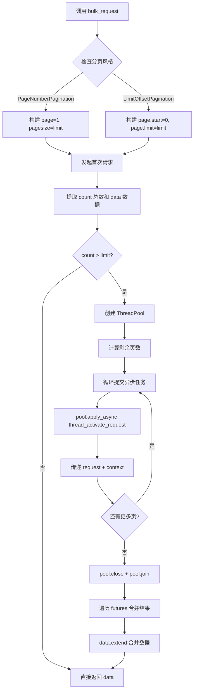
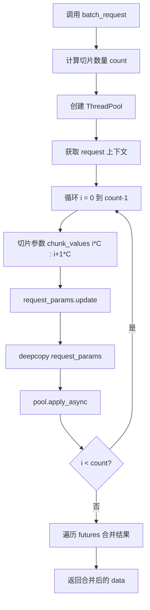

# API并发请求详解

> 聚焦：apps/api/base.py
> bulk_request 和 batch_request 完整实现解析

## 1. 并发请求场景

在 BKLOG 日志平台中，存在两类典型的并发请求场景：

### 1.1 分页遍历全量数据
- 查询业务下所有主机列表（`list_biz_hosts`）
- 获取订阅任务状态（`get_subscription_task_status`）
- 查询动态分组数据（`execute_dynamic_group`）

### 1.2 大批量数据处理
- 批量查询多个主机 ID 的插件信息
- 根据大量 IP 地址查询主机详情

---

## 2. bulk_request() 分页并发

### 2.1 完整代码片段（行号 676-741）

```python
def bulk_request(
    self,
    params=None,
    get_data=lambda x: x["info"],
    get_count=lambda x: x["count"],
    limit=settings.BULK_REQUEST_LIMIT,
    bk_tenant_id="",
):
    """
    并发请求接口，用于需要分页多次请求的情况
    """
    params = params or {}
    pagination_style = self.PaginationStyle.PAGE_NUMBER.value

    # 请求第一次获取总数
    if self.pagination_style == pagination_style:
        request_params = {"page": 1, "pagesize": limit, "no_request": True}
    else:
        request_params = {"page": {"start": 0, "limit": limit}, "no_request": True}
    request_params.update(params)
    result = self.__call__(request_params, bk_tenant_id=bk_tenant_id)
    count = get_count(result)
    data = get_data(result)

    # 如果第一次没拿完，根据请求总数并发请求
    pool = ThreadPool()
    futures = []
    request = None
    with ignored(Exception):
        request = get_request()

    if self.pagination_style == pagination_style:
        start = 2
        count = math.ceil(count / limit) + 1
    while start < count:
        if self.pagination_style == pagination_style:
            request_params = {"page": start, "pagesize": limit, "no_request": True}
        else:
            request_params = {"page": {"limit": limit, "start": start}, "no_request": True}
        request_params.update(params)
        futures.append(
            pool.apply_async(
                self.thread_activate_request,
                args=(request_params,),
                kwds={"request": request, "context": get_current(), "bk_tenant_id": bk_tenant_id},
            )
        )
        if self.pagination_style == pagination_style:
            start += 1
        else:
            start += limit

    pool.close()
    pool.join()

    # 取值
    for future in futures:
        data.extend(get_data(future.get()))

    return data
```

### 2.2 参数详解

| 参数 | 类型 | 默认值 | 说明 |
|------|------|--------|------|
| `params` | dict | None | 基础请求参数 |
| `get_data` | Callable | `lambda x: x["info"]` | 从响应提取数据列表 |
| `get_count` | Callable | `lambda x: x["count"]` | 从响应提取总数 |
| `limit` | int | 500 | 每页数据量 |
| `bk_tenant_id` | str | "" | 多租户ID |

### 2.3 自动分页流程



---

## 3. batch_request() 切片并发

### 3.1 完整代码片段（行号 632-674）

```python
def batch_request(
    self,
    chunk_key,
    chunk_values,
    params=None,
    chunk_size=settings.BULK_REQUEST_LIMIT,
    get_data=lambda x: x["list"],
    bk_tenant_id="",
):
    """
    并发请求接口，用于需要切片多次请求的情况
    :param chunk_key: 需要进行切片的参数名
    :param chunk_values: 需要进行切片的参数值
    """
    request_params = params or {}
    chunk_values = chunk_values or []
    request_params.update({"no_request": True})

    data = []
    count = math.ceil(len(chunk_values) / chunk_size)
    futures = []
    pool = ThreadPool()
    request = None
    with ignored(Exception):
        request = get_request()

    for i in range(count):
        request_params.update({chunk_key: chunk_values[i * chunk_size : i * chunk_size + chunk_size]})
        futures.append(
            pool.apply_async(
                self.thread_activate_request,
                args=(deepcopy(request_params),),  # deepcopy防止参数污染
                kwds={"request": request, "context": get_current(), "bk_tenant_id": bk_tenant_id},
            )
        )

    for future in futures:
        data.extend(get_data(future.get()))

    return data
```

### 3.2 chunk_key 与 chunk_values 配合

核心切片逻辑：

```python
# 切片示例：chunk_values = [1,2,3,...,1200], chunk_size = 500
for i in range(count):
    # 批次0: chunk_values[0:500] = [1,2,...,500]
    # 批次1: chunk_values[500:1000] = [501,...,1000]
    # 批次2: chunk_values[1000:1200] = [1001,...,1200]
    request_params.update({chunk_key: chunk_values[i * chunk_size : i * chunk_size + chunk_size]})
```

### 3.3 切片流程



---

## 4. thread_activate_request() 线程封装

### 4.1 完整代码片段（行号 743-769）

```python
def thread_activate_request(
    self,
    params=None,
    files=None,
    raw=False,
    timeout=None,
    raise_exception=True,
    request_cookies=True,
    request=None,
    context=None,
    bk_tenant_id="",
):
    """
    处理并发请求无法activate_request的封装
    """
    if request:
        activate_request(request)  # 在子线程激活 Django request
    attach(context)                 # 在子线程附加 OpenTelemetry Context
    return self.__call__(
        params=params,
        files=files,
        raw=raw,
        timeout=timeout,
        raise_exception=raise_exception,
        request_cookies=request_cookies,
        bk_tenant_id=bk_tenant_id,
    )
```

### 4.2 为什么需要线程安全封装

**问题根源**：Django 请求对象和 OpenTelemetry Context 都基于线程本地存储。

```python
from opentelemetry.context import attach, get_current
from apps.utils.local import activate_request, get_request
```

**解决方案**：
- `activate_request(request)` 在子线程激活 Django request 对象
- `attach(context)` 在子线程附加 OpenTelemetry Context
- 确保分布式追踪链路完整

---

## 5. 实战案例

### 5.1 CCApi.list_biz_hosts 批量主机查询

```python
# apps/log_databus/handlers/collector/host.py
legal_host_list = CCApi.list_biz_hosts.bulk_request(
    {
        "bk_biz_id": bk_biz_id,
        "host_property_filter": {
            "condition": "OR",
            "rules": [
                {"field": "bk_host_innerip", "operator": "in", "value": ips},
                {"field": "bk_host_id", "operator": "in", "value": bk_host_ids},
            ],
        },
        "fields": CMDB_HOST_SEARCH_FIELDS,
    }
)
```

### 5.2 NodeApi.get_subscription_task_status

```python
instance_data = NodeApi.get_subscription_task_status.bulk_request(
    params={
        "subscription_id": self.data.subscription_id,
        "need_detail": False,
    },
    get_data=lambda x: x["list"],  # 自定义提取
    get_count=lambda x: x["total"],
)
```

### 5.3 NodeApi.plugin_search 批量插件查询

```python
plugin_data = NodeApi.plugin_search.batch_request(
    params={"conditions": []},
    chunk_values=bk_host_ids,
    chunk_key="bk_host_id",
    bk_tenant_id=Space.get_tenant_id(bk_biz_id=self.data.bk_biz_id),
)
```

---

## 6. 性能考量

### 6.1 线程数控制

**默认配置**：
```python
BULK_REQUEST_LIMIT = int(os.environ.get("BKAPP_BULK_REQUEST_LIMIT", 500))
```

**线程数计算**：
- `bulk_request`: 线程数 = `ceil(count / limit) - 1`
- `batch_request`: 线程数 = `ceil(len(chunk_values) / chunk_size)`

### 6.2 内存优化建议

- 流式处理：边获取边处理
- 分批次处理：将大任务拆分
- 设置合理的 `limit`

---

## 7. 设计要点

| 场景 | 推荐方式 | 原因 |
|------|----------|------|
| 数据量 < 500 | 单次 `__call__` | 避免线程开销 |
| 数据量 > 500 | `bulk_request` | 并发减少等待 |
| 参数列表过大 | `batch_request` | 避免接口限制 |
| 接口有速率限制 | 串行分页 | 避免触发限流 |

---

**文档版本**: v1.0
**生成日期**: 2026-04-30
**源码路径**: `apps/api/base.py`