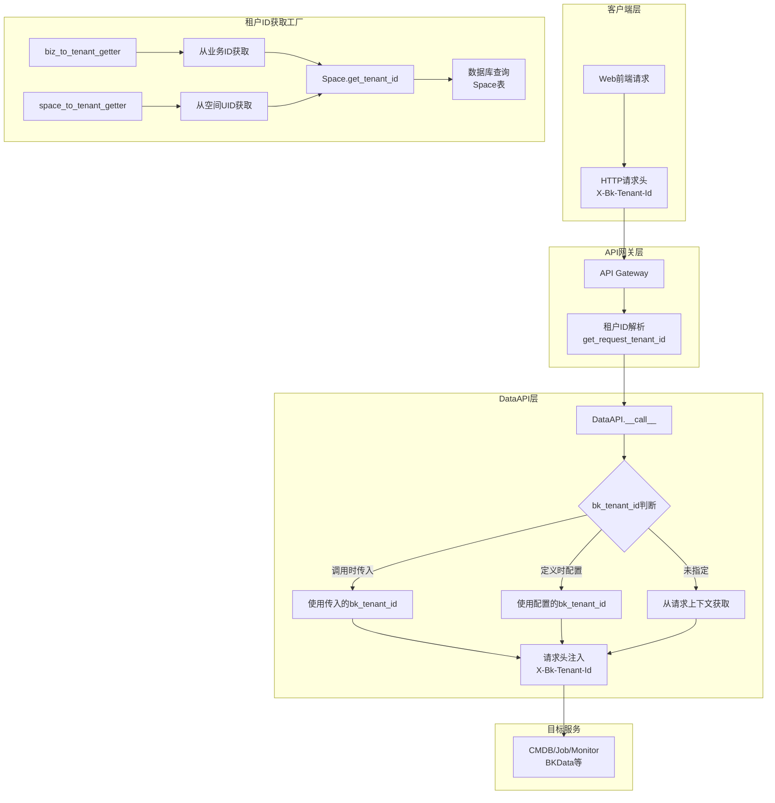
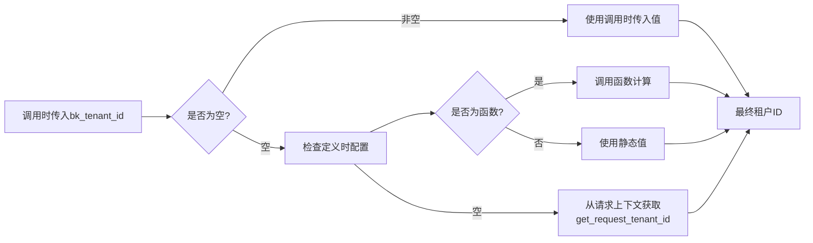
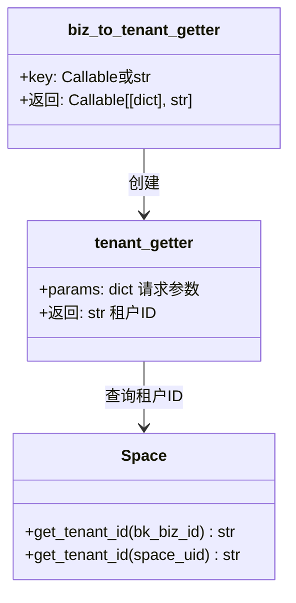
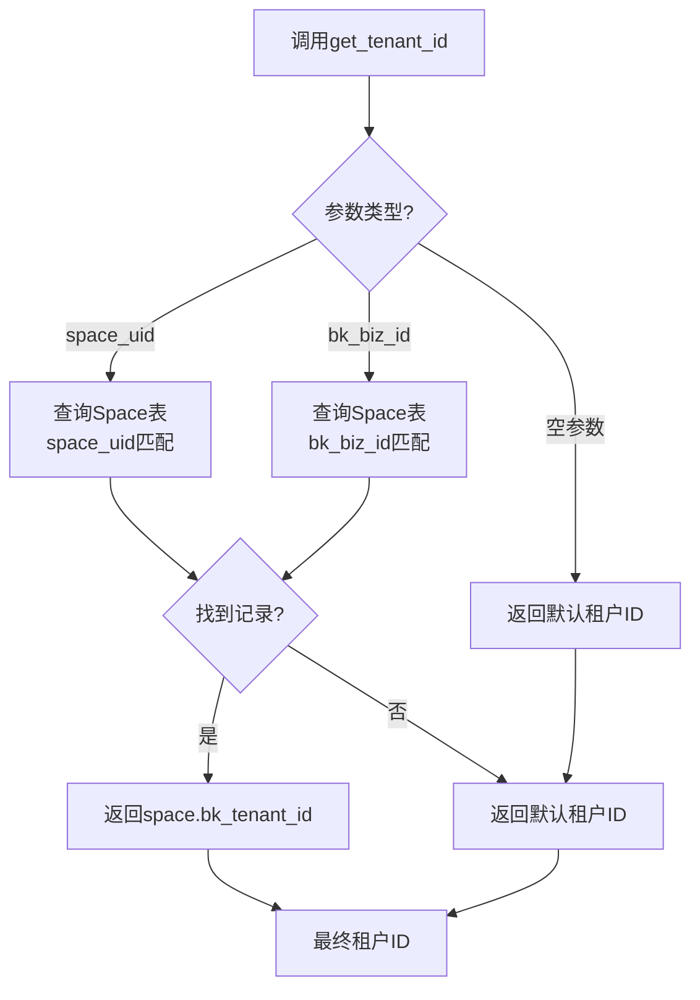
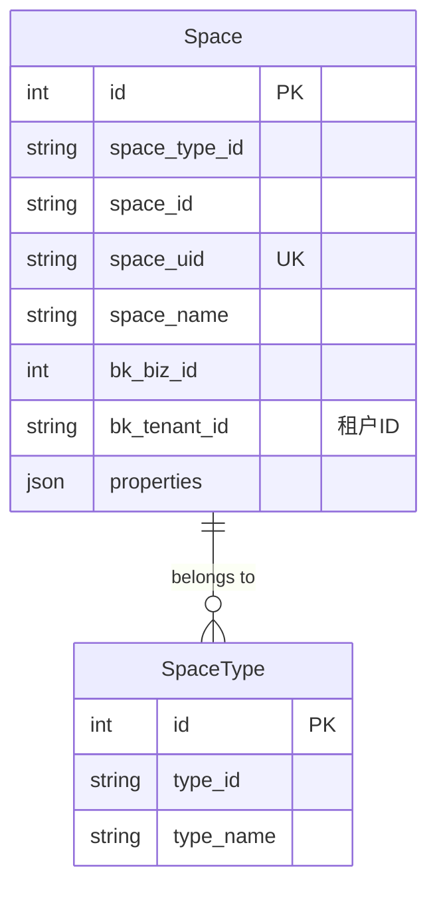

# BKLOG 多租户架构详解

## 概述

BKLOG通过多租户架构实现了不同租户间的数据隔离和权限控制。核心机制是通过 `bk_tenant_id` 参数在API请求层进行租户识别和传递，确保每个API调用都能正确关联到对应的租户空间。

## 整体架构



## 核心组件解析

### 1. DataAPI 中的 bk_tenant_id 参数处理

DataAPI类是BKLOG API层的核心封装，其初始化参数 `bk_tenant_id` 支持多种配置方式。

**源文件**: `apps/api/base.py` (第200-222行)

```python
class DataAPI:
    def __init__(
        self,
        method,
        url,
        module,
        # ... 其他参数
        bk_tenant_id: str | Callable[[dict], str] = "",
    ):
        """
        初始化一个请求句柄
        @param {string} bk_tenant_id 租户ID，可传递一个静态值或者动态的函数
        """
        self.bk_tenant_id = bk_tenant_id
```

#### 1.1 参数类型支持

`bk_tenant_id` 参数支持两种类型：

| 类型 | 说明 | 使用场景 |
|------|------|----------|
| `str` | 静态字符串值 | 全局统一租户，如调试接口 |
| `Callable[[dict], str]` | 动态计算函数 | 根据请求参数动态获取租户ID |

### 2. 多租户请求参数传递流程

**源文件**: `apps/api/base.py` (第332-346行)

```python
def _send_request(self, params, timeout, request_id, request_cookies, bk_tenant_id):
    # 请求前的参数清洗处理
    origin_params = params.copy()
    if self.before_request is not None:
        # 将bk_tenant_id传到before_request进行处理（添加管理员账号）
        _bk_tenant_id = bk_tenant_id or self.bk_tenant_id
        if not origin_params.get("bk_tenant_id") and _bk_tenant_id:
            if callable(_bk_tenant_id):
                _bk_tenant_id = _bk_tenant_id(params)
            params["bk_tenant_id"] = _bk_tenant_id
            params = self.before_request(params)
            del params["bk_tenant_id"]
        else:
            params = self.before_request(params)
```

#### 2.1 租户ID优先级链



**优先级顺序**：
1. 调用API时直接传入的 `bk_tenant_id`
2. DataAPI定义时配置的 `bk_tenant_id`（函数或静态值）
3. 从当前请求上下文获取（`get_request_tenant_id()`）

### 3. HTTP请求头注入

**源文件**: `apps/api/base.py` (第509-553行)

```python
def _send(self, params, timeout, request_id, request_cookies, bk_tenant_id):
    session = requests.session()
    session.headers.update({"X-DATA-REQUEST-ID": request_id})
    # ... 其他headers设置

    # 多租户模式下添加租户ID
    # 如果请求时没有指定租户ID，则看接口定义时是否有租户ID
    # 如果请求时和接口定义时都没有给租户ID，则通过请求用户态获取租户ID
    if not bk_tenant_id:
        if self.bk_tenant_id:
            if callable(self.bk_tenant_id):
                # 如果传递的 bk_tenant_id 是个函数，将调用该函数
                bk_tenant_id = self.bk_tenant_id(params)
            else:
                bk_tenant_id = self.bk_tenant_id
        else:
            bk_tenant_id = get_request_tenant_id()
    session.headers.update({"X-Bk-Tenant-Id": bk_tenant_id})
```

最终租户ID通过HTTP请求头 `X-Bk-Tenant-Id` 传递给下游服务。

### 4. biz_to_tenant_getter 工厂函数

这是BKLOG多租户架构的核心工厂函数，用于从业务ID动态获取租户ID。

**源文件**: `apps/api/modules/utils.py` (第360-381行)

```python
def biz_to_tenant_getter(key: Callable[[dict], str] | str = "bk_biz_id") -> Callable[[dict], str]:
    """
    通过业务获取租户ID
    :param key: 获取业务 ID 的函数，例如 lambda p: p["bk_biz_id"]
                如果为 None，则默认使用 params["bk_biz_id"]
    :return: 获取租户 ID 的函数
    """
    from apps.log_search.models import Space

    def tenant_getter(params):
        """
        从请求参数中获取业务信息并转换为租户 ID
        """
        if callable(key):
            bk_biz_id = key(params)
        else:
            if key not in params:
                raise ValueError(f"failed to get tenant id from params, key `{key}` not found")
            bk_biz_id = params[key]
        return Space.get_tenant_id(bk_biz_id=bk_biz_id)

    return tenant_getter
```

#### 4.1 函数签名解析



#### 4.2 使用示例

**默认方式** - 从 `bk_biz_id` 参数获取：

```python
# 源文件: apps/api/modules/cc.py (第105行)
self.search_biz_inst_topo = DataAPI(
    method="POST",
    url=self._build_url("api/v3/find/topoinst/biz/{bk_biz_id}", "search_biz_inst_topo/"),
    module=self.MODULE,
    description="查询业务TOPO，显示各个层级",
    url_keys=["bk_biz_id"],
    before_request=get_supplier_account_before,
    use_superuser=True,
    bk_tenant_id=biz_to_tenant_getter(),  # 默认从bk_biz_id获取
)
```

**自定义键名** - 从其他参数字段获取：

```python
# 源文件: apps/api/modules/monitor.py (第51行)
self.search_user_groups = DataAPI(
    method="POST",
    url=self._build_url("user_group/search/", "search_user_groups/"),
    module=self.MODULE,
    description="查询通知组",
    before_request=add_esb_info_before_request,
    bk_tenant_id=biz_to_tenant_getter(key=lambda p: p["bk_biz_ids"][0]),  # 从列表取第一个
)
```

**复杂提取逻辑** - 多字段备选：

```python
# 源文件: apps/api/modules/bkdata_meta.py (第60-66行)
self.result_tables = DataDRFAPISet(
    url=self._build_url("result_tables/", "result_tables/"),
    module=self.MODULE,
    primary_key="result_table_id",
    bk_tenant_id=biz_to_tenant_getter(
        lambda p: p["bk_biz_id"]
        if "bk_biz_id" in p
        else p["result_table_id"].split("_", 1)[0]
        if "result_table_id" in p
        else p["result_table_ids"][0].split("_", 1)[0],
    ),
)
```

### 5. space_to_tenant_getter 工厂函数

从空间UID获取租户ID的工厂函数，与 `biz_to_tenant_getter` 类似。

**源文件**: `apps/api/modules/utils.py` (第384-405行)

```python
def space_to_tenant_getter(key: Callable[[dict], str] | str = "space_uid") -> Callable[[dict], str]:
    """
    通过空间获取租户ID
    :param key: 获取空间 UID 的函数
    :return: 获取租户 ID 的函数
    """
    from apps.log_search.models import Space

    def tenant_getter(params):
        if callable(key):
            space_uid = key(params)
        else:
            if key not in params:
                raise ValueError(f"failed to get tenant id from params, key `{key}` not found")
            space_uid = params[key]
        return Space.get_tenant_id(space_uid=space_uid)

    return tenant_getter
```

### 6. Space.get_tenant_id 核心方法

Space模型提供了租户ID获取的核心实现。

**源文件**: `apps/log_search/models.py` (第1358-1376行)

```python
@classmethod
def get_tenant_id(cls, space_uid: str = "", bk_biz_id: int = 0) -> str:
    """
    获取空间的租户ID
    """
    default_tenant_id = get_request_tenant_id()

    if space_uid:
        space = cls.objects.filter(space_uid=space_uid).first()
        if not space:
            return default_tenant_id
        return space.bk_tenant_id

    if bk_biz_id:
        space = cls.objects.filter(bk_biz_id=bk_biz_id).first()
        if not space:
            return default_tenant_id
        return space.bk_tenant_id

    return default_tenant_id
```

#### 6.1 获取逻辑流程



### 7. 请求上下文租户ID获取

从HTTP请求中提取租户ID的实现。

**源文件**: `apps/utils/local.py` (第174-184行)

```python
def get_request_tenant_id():
    """
    获取请求中的租户ID
    """
    if settings.ENABLE_MULTI_TENANT_MODE:
        request = get_request(peaceful=True)
        if request and request.META.get("HTTP_X_BK_TENANT_ID", ""):
            return request.META.get("HTTP_X_BK_TENANT_ID", "")
        if request and hasattr(request.user, "tenant_id"):
            return request.user.tenant_id
    return settings.BK_APP_TENANT_ID
```

#### 7.1 获取优先级

| 优先级 | 来源 | 说明 |
|--------|------|------|
| 1 | HTTP请求头 `X-Bk-Tenant-Id` | 前端或上游服务传递 |
| 2 | `request.user.tenant_id` | 用户对象中的租户属性 |
| 3 | `settings.BK_APP_TENANT_ID` | 应用默认租户配置 |

## 多租户API调用封装

### 1. 批量请求中的租户ID传递

DataAPI的批量请求方法支持租户ID参数传递。

**源文件**: `apps/api/base.py` (第632-674行)

```python
def batch_request(
    self,
    chunk_key,
    chunk_values,
    params=None,
    chunk_size=settings.BULK_REQUEST_LIMIT,
    get_data=lambda x: x["list"],
    bk_tenant_id="",  # 支持传入租户ID
):
    """
    并发请求接口，用于需要切片多次请求的情况
    :param bk_tenant_id: 租户ID
    """
    request_params = params or {}
    chunk_values = chunk_values or []
    request_params.update({"no_request": True})

    data = []
    count = math.ceil(len(chunk_values) / chunk_size)
    futures = []
    pool = ThreadPool()

    for i in range(count):
        request_params.update({chunk_key: chunk_values[i * chunk_size : i * chunk_size + chunk_size]})
        futures.append(
            pool.apply_async(
                self.thread_activate_request,
                args=(deepcopy(request_params),),
                kwds={"request": request, "context": get_current(), "bk_tenant_id": bk_tenant_id},
            )
        )
    # ...
```

### 2. 并发请求中的租户ID传递

**源文件**: `apps/api/base.py` (第676-741行)

```python
def bulk_request(
    self,
    params=None,
    get_data=lambda x: x["info"],
    get_count=lambda x: x["count"],
    limit=settings.BULK_REQUEST_LIMIT,
    bk_tenant_id="",  # 支持传入租户ID
):
    """
    并发请求接口，用于需要分页多次请求的情况
    """
    # 首次请求
    result = self.__call__(request_params, bk_tenant_id=bk_tenant_id)

    # 并发后续请求
    futures.append(
        pool.apply_async(
            self.thread_activate_request,
            args=(request_params,),
            kwds={"request": request, "context": get_current(), "bk_tenant_id": bk_tenant_id},
        )
    )
```

### 3. 线程激活请求封装

**源文件**: `apps/api/base.py` (第743-769行)

```python
def thread_activate_request(
    self,
    params=None,
    files=None,
    raw=False,
    timeout=None,
    raise_exception=True,
    request_cookies=True,
    request=None,
    context=None,
    bk_tenant_id="",  # 租户ID参数
):
    """
    处理并发请求无法activate_request的封装
    """
    if request:
        activate_request(request)
    attach(context)
    return self.__call__(
        params=params,
        # ...
        bk_tenant_id=bk_tenant_id,  # 传递租户ID
    )
```

## 实际应用场景

### 1. CMDB API 多租户配置

**源文件**: `apps/api/modules/cc.py`

```python
class _CCApi:
    def __init__(self):
        # 查询业务拓扑 - 使用默认biz_to_tenant_getter
        self.search_biz_inst_topo = DataAPI(
            method="POST",
            url=self._build_url("api/v3/find/topoinst/biz/{bk_biz_id}", "search_biz_inst_topo/"),
            module=self.MODULE,
            description="查询业务TOPO，显示各个层级",
            url_keys=["bk_biz_id"],
            before_request=get_supplier_account_before,
            use_superuser=True,
            bk_tenant_id=biz_to_tenant_getter(),  # 第105行
        )

        # 查询对象列表 - 自定义key函数
        self.search_inst_by_object = DataAPI(
            method="POST",
            url=self._build_url(...),
            module=self.MODULE,
            before_request=get_supplier_account_before,
            use_superuser=True,
            bk_tenant_id=biz_to_tenant_getter(key=lambda p: p["condition"]["bk_biz_id"]),  # 第95行
        )
```

### 2. 监控平台 API 多租户配置

**源文件**: `apps/api/modules/monitor.py`

```python
class _MonitorApi:
    def __init__(self):
        # 查询通知组 - 从列表取第一个业务ID
        self.search_user_groups = DataAPI(
            method="POST",
            url=self._build_url("user_group/search/", "search_user_groups/"),
            module=self.MODULE,
            description="查询通知组",
            before_request=add_esb_info_before_request,
            bk_tenant_id=biz_to_tenant_getter(key=lambda p: p["bk_biz_ids"][0]),  # 第51行
        )

        # 保存通知组 - 使用默认配置
        self.save_notice_group = DataAPI(
            method="POST",
            url=self._build_url("user_group/save/", "save_notice_group/"),
            module=self.MODULE,
            description="保存通知组",
            before_request=add_esb_info_before_request,
            bk_tenant_id=biz_to_tenant_getter(),  # 第60行
        )
```

### 3. 数据总线 API 多租户配置

**源文件**: `apps/api/modules/bkdata_databus.py`

```python
class _BkDataDatabusApi:
    def __init__(self):
        # 从result_table_id提取业务ID
        self.post_tasks = DataAPI(
            method="POST",
            url=self._build_url("tasks/", "tasks/"),
            module=self.MODULE,
            description="创建清洗分发任务",
            before_request=add_esb_info_before_request_for_bkdata_user,
            bk_tenant_id=biz_to_tenant_getter(lambda p: p["result_table_id"].split("_", 1)[0]),  # 第128行
        )

        # 使用静态租户ID（调试场景）
        self.databus_clean_debug = DataAPI(
            method="POST",
            url=self._build_v4_url("clean/debug/", "clean/debug/"),
            module=self.MODULE,
            description="清洗配置调试",
            before_request=add_esb_info_before_request_for_bkdata_user,
            bk_tenant_id=settings.BK_APP_TENANT_ID,  # 第119行 - 静态值
        )
```

## 配置项说明

| 配置项 | 说明 | 默认值 |
|--------|------|--------|
| `ENABLE_MULTI_TENANT_MODE` | 是否启用多租户模式 | `False` |
| `BK_APP_TENANT_ID` | 应用默认租户ID | 系统配置 |

**配置检测逻辑**（`apps/utils/local.py`）：

```python
def get_request_tenant_id():
    if settings.ENABLE_MULTI_TENANT_MODE:
        # 多租户模式下的获取逻辑
        request = get_request(peaceful=True)
        if request and request.META.get("HTTP_X_BK_TENANT_ID", ""):
            return request.META.get("HTTP_X_BK_TENANT_ID", "")
        # ...
    return settings.BK_APP_TENANT_ID  # 非多租户模式返回默认值
```

## 数据模型关系



## 最佳实践

### 1. API定义时的租户ID配置

- **推荐**：使用 `biz_to_tenant_getter()` 动态获取，确保租户隔离
- **谨慎**：使用静态字符串值，仅适用于全局接口（如调试）
- **注意**：确保请求参数中包含能提取业务ID的字段

### 2. 批量/并发请求

```python
# 正确用法：显式传递租户ID
result = api.batch_request(
    chunk_key="bk_host_ids",
    chunk_values=host_ids,
    params={"bk_biz_id": biz_id},
    bk_tenant_id=biz_to_tenant_getter()( {"bk_biz_id": biz_id} )
)

# 或者依赖API定义时的配置
result = api.batch_request(
    chunk_key="bk_host_ids",
    chunk_values=host_ids,
    params={"bk_biz_id": biz_id},
)
```

### 3. 后台任务中的租户ID处理

后台任务（Celery）无HTTP请求上下文，需要显式传递租户ID：

```python
# 后台任务示例
from apps.utils.local import get_backend_username

def background_task(bk_biz_id):
    tenant_id = Space.get_tenant_id(bk_biz_id=bk_biz_id)
    username = get_backend_username(bk_tenant_id=tenant_id)

    result = CCApi.search_biz_inst_topo(
        {"bk_biz_id": bk_biz_id},
        bk_tenant_id=tenant_id
    )
```

---

**版本**: v1.0
**日期**: 2026-04-30
**源码版本**: 基于 BKLOG ai_docs 分支