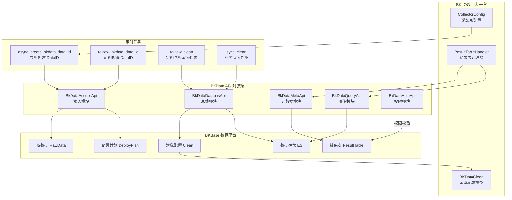

# BKLOG 数据平台集成技术文档

## 1. 概述

BKLOG（蓝鲸日志平台）与 BKBase（数据平台）的集成主要体现在以下几个方面：
- **DataID 创建与管理**：将日志采集项同步到数据平台
- **数据清洗（Clean）管理**：管理数据平台的清洗配置
- **结果表（Result Table）管理**：查询和管理数据平台的结果表
- **权限认证**：Token 和用户两种认证方式

## 2. 核心文件位置

| 文件路径 | 功能描述 |
|---------|---------|
| `apps/log_databus/tasks/bkdata.py` | DataID 创建、清洗同步定时任务 |
| `apps/log_databus/utils/bkdata_clean.py` | BKData 清洗工具类 |
| `apps/utils/bkdata.py` | SQL 查询构建器 |
| `apps/utils/bk_data_auth.py` | 权限认证处理器 |
| `apps/api/modules/bkdata_access.py` | 数据接入 API 封装 |
| `apps/api/modules/bkdata_databus.py` | 数据总线 API 封装 |
| `apps/api/modules/bkdata_meta.py` | 元数据 API 封装 |
| `apps/api/modules/bkdata_query.py` | 数据查询 API 封装 |
| `apps/api/modules/bkdata_auth.py` | 权限 API 封装 |
| `apps/api/modules/bkdata_storekit.py` | 存储套件 API 封装 |

## 3. 集成流程图



## 4. DataID 创建实现

### 4.1 核心函数：create_bkdata_data_id

**文件**: `apps/log_databus/tasks/bkdata.py` (第 59-161 行)

```python
def create_bkdata_data_id(collector_config: CollectorConfig, platform_username: str = None, raise_exception=False):
    # 第 61-63 行：特性开关检查
    toggle_switch = FeatureToggleObject.switch(name=FEATURE_BKDATA_DATAID)
    if not toggle_switch:
        return

    # 第 65-66 行：检查是否已有 bkdata_data_id
    if not collector_config.bk_data_id or collector_config.bkdata_data_id:
        return

    # 第 68-84 行：检查 DataID 是否已在数据平台注册
    try:
        BkDataAccessApi.get_deploy_summary(
            {"raw_data_id": collector_config.bk_data_id, "bk_biz_id": collector_config.bk_biz_id}
        )
        # 如果获取 data_id 没有报错，说明已经在计算平台注册过
        collector_config.bkdata_data_id = collector_config.bk_data_id
        collector_config.save(update_fields=["bkdata_data_id"])
        return
    except ApiResultError:
        # data_id 获取失败，需要创建
        pass

    # 第 86-92 行：非CC业务空间检查
    bk_biz_id = collector_config.get_bk_biz_id()
    if bk_biz_id < 0:
        related_bk_biz_id = get_non_bkcc_space_related_bkcc_biz_id(bk_biz_id)
        if related_bk_biz_id < 0:
            return
        bk_biz_id = related_bk_biz_id

    # 第 94-99 行：获取维护人员和平台用户名
    collector_maintainers_and_platform_username = get_collector_maintainers_and_platform_username(
        collector_config=collector_config, bk_biz_id=bk_biz_id, platform_username=platform_username
    )
    maintainers = collector_maintainers_and_platform_username["maintainers"]
    platform_username = collector_maintainers_and_platform_username["platform_username"]

    # 第 112-114 行：数据名称添加 bklog 前缀避免冲突
    raw_data_name = collector_config.collector_config_name_en or table_id
    raw_data_name = "bklog_" + raw_data_name

    # 第 119-142 行：调用数据平台 API 创建部署计划
    try:
        BkDataAccessApi.deploy_plan_post(
            params={
                "bk_username": platform_username or collector_config.get_updated_by(),
                "data_scenario": BKDATA_DATA_SCENARIO,      # "custom"
                "data_scenario_id": BKDATA_DATA_SCENARIO_ID, # 47
                "permission": BKDATA_PERMISSION,             # "permission"
                "bk_biz_id": bk_biz_id,
                "description": collector_config.description,
                "access_raw_data": {
                    "tags": BKDATA_TAGS,                     # []
                    "raw_data_name": raw_data_name,
                    "maintainer": ",".join(maintainers),
                    "raw_data_alias": collector_config.collector_config_name,
                    "data_source_tags": BKDATA_DATA_SOURCE_TAGS, # ["server"]
                    "data_region": BKDATA_DATA_REGION,           # "inland"
                    "data_source": BKDATA_DATA_SOURCE,           # "data_source"
                    "data_encoding": META_DATA_ENCODING,         # "utf-8"
                    "sensitivity": BKDATA_DATA_SENSITIVITY,     # "private"
                    "description": collector_config.description,
                    "preassigned_data_id": collector_config.bk_data_id,
                },
            }
        )
        collector_config.bkdata_data_id = collector_config.bk_data_id
        collector_config.save(update_fields=["bkdata_data_id"])
```

### 4.2 定时检查任务：review_bkdata_data_id

**文件**: `apps/log_databus/tasks/bkdata.py` (第 164-191 行)

```python
@periodic_task(run_every=crontab(minute="30", hour="3"))
def review_bkdata_data_id():
    """
    检测采集项bkdata_id: 处理未同步到数据平台的data_id
    每天凌晨 3:30 执行
    """
    toggle_switch = FeatureToggleObject.switch(name=FEATURE_BKDATA_DATAID)
    if not toggle_switch:
        return

    # 查询所有未同步 bkdata_data_id 的采集项
    collector_configs = CollectorConfig.objects.filter(bkdata_data_id__isnull=True)

    for collector_config in collector_configs:
        # 检查是否超过最大重试次数 (默认 3 次)
        if collector_config.bkdata_data_id_sync_times >= MAX_CREATE_BKDATA_DATA_ID_FAIL_COUNT:
            logger.error(...)
            continue

        try:
            create_bkdata_data_id(collector_config)
        except Exception as e:
            collector_config.bkdata_data_id_sync_times += 1
        else:
            collector_config.bkdata_data_id_sync_times = 0

        collector_config.save()
```

## 5. BKData API 封装实现

### 5.1 BkDataAccessApi - 数据接入模块

**文件**: `apps/api/modules/bkdata_access.py` (第 35-99 行)

```python
class _BkDataAccessApi:
    MODULE = _("数据平台接入模块")

    def _build_url(self, new_path, old_path):
        # 根据 USE_APIGW 配置选择 API 网关路径或直连路径
        return (
            f"{settings.PAAS_API_HOST}/api/bk-base/{settings.ENVIRONMENT}/v3/access/{new_path}"
            if self.use_apigw
            else f"{ACCESS_APIGATEWAY_ROOT}{old_path}"
        )

    def __init__(self):
        # 源数据列表查询
        self.list_raw_data = DataAPI(
            method="GET",
            url=self._build_url("rawdata/", "rawdata/"),
            module=self.MODULE,
            description="源数据列表",
            before_request=add_esb_info_before_request_for_bkdata_user,
        )

        # 查询部署计划（检查 DataID 是否已注册）
        self.get_deploy_summary = DataAPI(
            method="GET",
            url=self._build_url("deploy_plan/{raw_data_id}/", "deploy_plan/{raw_data_id}/"),
            module=self.MODULE,
            description="查询部署计划",
            url_keys=["raw_data_id"],
            cache_time=60,
            bk_tenant_id=biz_to_tenant_getter(),
        )

        # 创建部署计划（创建 DataID）
        self.deploy_plan_post = DataAPI(
            method="POST",
            url=self._build_url("deploy_plan/", "deploy_plan/"),
            module=self.MODULE,
            description="创建部署计划",
            bk_tenant_id=biz_to_tenant_getter(),
        )

        # 停止采集器
        self.stop_collectorhub = DataAPI(
            method="POST",
            url=self._build_url("collectorhub/{raw_data_id}/stop/", "collectorhub/{raw_data_id}/stop/"),
            module=self.MODULE,
            url_keys=["raw_data_id"],
        )

BkDataAccessApi = _BkDataAccessApi()
```

### 5.2 BkDataDatabusApi - 数据总线模块

**文件**: `apps/api/modules/bkdata_databus.py` (第 30-142 行)

```python
class _BkDataDatabusApi:
    MODULE = _("计算平台总线模块")

    def __init__(self):
        # 数据入库列表查询
        self.get_config_db_list = DataAPI(
            method="GET",
            url=self._build_url("data_storages/", "data_storages/"),
            module=self.MODULE,
            description="获取数据入库列表",
            cache_time=60,
        )

        # 创建入库
        self.databus_data_storages_post = DataAPI(
            method="POST",
            url=self._build_url("data_storages/", "data_storages/"),
            description="创建入库",
        )

        # 清洗配置列表
        self.get_cleans = DataAPI(
            method="GET",
            url=self._build_url("cleans/", "cleans/"),
            description="获取清洗配置列表",
        )

        # 创建清洗配置
        self.databus_cleans_post = DataAPI(
            method="POST",
            url=self._build_url("cleans/", "cleans/"),
            description="创建清洗配置",
        )

        # 清洗调试（V4接口）
        self.databus_clean_debug = DataAPI(
            method="POST",
            url=self._build_v4_url("clean/debug/", "clean/debug/"),
            description="清洗配置调试",
        )

        # 创建清洗分发任务
        self.post_tasks = DataAPI(
            method="POST",
            url=self._build_url("tasks/", "tasks/"),
            description="创建清洗分发任务",
        )

        # 停止清洗任务
        self.delete_tasks = DataAPI(
            method="DELETE",
            url=self._build_url("tasks/{result_table_id}/", "tasks/{result_table_id}/"),
            description="停止清洗，分发任务",
        )

BkDataDatabusApi = _BkDataDatabusApi()
```

### 5.3 BkDataMetaApi - 元数据模块

**文件**: `apps/api/modules/bkdata_meta.py` (第 33-68 行)

```python
class _BkDataMetaApi:
    MODULE = _("计算平台元数据模块")

    def __init__(self):
        # 结果表操作（RESTful 风格）
        self.result_tables = DataDRFAPISet(
            url=self._build_url("result_tables/", "result_tables/"),
            module=self.MODULE,
            primary_key="result_table_id",
            description="结果表操作",
            custom_config={
                "storages": DRFActionAPI(method="GET"),   # 获取存储信息
                "mine": DRFActionAPI(method="GET", detail=False),  # 获取我的结果表
                "fields": DRFActionAPI(method="GET"),     # 获取字段列表
            },
            bk_tenant_id=biz_to_tenant_getter(
                lambda p: p["bk_biz_id"]
                if "bk_biz_id" in p
                else p["result_table_id"].split("_", 1)[0]
            ),
        )

BkDataMetaApi = _BkDataMetaApi()
```

### 5.4 BkDataQueryApi - 数据查询模块

**文件**: `apps/api/modules/bkdata_query.py` (第 30-54 行)

```python
class _BkDataQueryApi:
    MODULE = _("计算平台数据查询模块")

    def __init__(self):
        # 同步查询接口
        self.query = DataAPI(
            url=self._build_url("query_sync/", "query_sync/"),
            method="POST",
            module=self.MODULE,
            description="原始数据操作",
            use_superuser=True,
            before_request=add_esb_info_before_request_for_bkdata_token,
        )

BkDataQueryApi = _BkDataQueryApi()
```

## 6. 数据清洗管理

### 6.1 BKDataCleanUtils 工具类

**文件**: `apps/log_databus/utils/bkdata_clean.py` (第 38-183 行)

```python
class BKDataCleanUtils:
    """
    bk data clean utils class:
        - to get bkdata_clean
        - to flush Quánxiàn Authority
    """

    def __init__(self, raw_data_id):
        self.raw_data_id = raw_data_id

    def get_bkdata_clean(self, bk_biz_id):
        # 第 49-59 行：获取数据平台的清洗配置列表
        config_db_list = BkDataDatabusApi.get_config_db_list(
            params={"raw_data_id": self.raw_data_id, "bk_biz_id": bk_biz_id}
        )
        cleans = [config_db for config_db in config_db_list
                  if config_db["storage_type"].lower() == "es"]
        # 字段兼容转换：status_en -> status, status -> status_display
        for clean in cleans:
            if "status_display" in clean:
                clean["status_en"] = clean["status"]
                clean["status"] = clean["status_display"]
                clean.pop("status_display")
        return cleans

    def update_or_create_clean(self, collector_config_id: int, bk_biz_id: int, category_id: str):
        # 第 149-167 行：同步清洗配置到本地数据库
        cleans = self.get_bkdata_clean(bk_biz_id)
        db_cleans = BKDataClean.objects.filter(raw_data_id=self.raw_data_id)

        # 对比差异，找出新增和删除
        cleans_dict, db_cleans_dict = self.get_dict(cleans=cleans, db_cleans=db_cleans)
        insert_objs, delete_objs = self.get_update_model(
            clean_dict=cleans_dict, db_clean_dict=db_cleans_dict
        )

        # 创建索引集并保存清洗记录
        index_set_dict = self.create_index_set(insert_objs, bk_biz_id, category_id)
        self.insert_objs(insert_objs, collector_config_id, bk_biz_id, index_set_dict)
        self.delete_index_set(delete_objs)
        self.delete_objs(delete_objs)

    @classmethod
    def create_index_set(cls, insert_objs, bk_biz_id: int, category_id=DEFAULT_CATEGORY_ID):
        # 第 111-141 行：为每个清洗结果创建索引集
        index_set_dict = {}
        for insert_obj in insert_objs:
            index_set_data = LogIndexSetData.objects.filter(
                result_table_id=insert_obj["result_table_id"]
            ).first()
            if index_set_data:
                index_set = LogIndexSet.objects.get(index_set_id=index_set_data.index_set_id)
            else:
                # 创建新的索引集
                index_set = IndexSetHandler.create(
                    index_set_name=insert_obj["result_table_name"],
                    space_uid=bk_biz_id_to_space_uid(bk_biz_id),
                    scenario_id=Scenario.BKDATA,
                    indexes=[{
                        "bk_biz_id": bk_biz_id,
                        "result_table_id": insert_obj["result_table_id"],
                        "time_field": "",
                        "time_format": DEFAULT_TIME_FORMAT,
                    }],
                    category_id=category_id,
                )
            index_set_dict[insert_obj["result_table_id"]] = {
                "index_set_id": index_set.index_set_id,
                "bkdata_auth_url": index_set.bkdata_auth_url,
            }
        return index_set_dict
```

### 6.2 定时同步清洗任务

**文件**: `apps/log_databus/tasks/bkdata.py` (第 194-226 行)

```python
@periodic_task(run_every=crontab(minute="*/30"))
def review_clean():
    """
    定期同步计算平台入库列表
    每 30 分钟执行一次
    """
    if not FeatureToggleObject.switch(name=SCENARIO_BKDATA):
        return

    collector_configs = CollectorConfig.objects.filter(bkdata_data_id__isnull=False)
    for collector_config in collector_configs:
        with ignored(Exception, log_exception=True):
            BKDataCleanUtils(raw_data_id=collector_config.bkdata_data_id).update_or_create_clean(
                collector_config_id=collector_config.collector_config_id,
                bk_biz_id=collector_config.bk_biz_id,
                category_id=collector_config.category_id,
            )

@high_priority_task(ignore_result=True)
def sync_clean(bk_biz_id: int):
    """
    同步指定业务的清洗配置
    """
    try:
        collector_configs = CollectorConfig.objects.filter(
            bk_biz_id=bk_biz_id, bkdata_data_id__isnull=False
        )
        for collector_config in collector_configs:
            BKDataCleanUtils(raw_data_id=collector_config.bkdata_data_id).update_or_create_clean(...)
    finally:
        BKDataCleanUtils.unlock_sync_clean(bk_biz_id=bk_biz_id)
```

## 7. 权限认证机制

### 7.1 BkDataAuthHandler 权限处理器

**文件**: `apps/utils/bk_data_auth.py` (第 35-176 行)

```python
class BkDataAuthHandler(object):
    def __init__(self, username=""):
        self.username = username or get_request_username()

    def list_authorized_rt_by_user(self):
        """获取用户有管理权限的RT列表"""
        scopes = BkDataAuthApi.get_user_perm_scope(
            {"user_id": self.username, "action_id": "result_table.manage_auth", "show_admin_scopes": True}
        )
        authorized_result_tables = {scope["result_table_id"] for scope in scopes}
        return list(authorized_result_tables)

    def list_authorized_rt_by_token(self):
        """获取 token有权限的RT列表"""
        permissions = BkDataAuthApi.get_auth_token({
            "token_id": settings.BKDATA_DATA_TOKEN_ID,
            "bkdata_authentication_method": "token",
            "bkdata_data_token": settings.BKDATA_DATA_TOKEN,
        })["permissions"]
        authorized_result_tables = set()
        for perm in permissions:
            if perm["action_id"] != "result_table.query_data":
                continue
            if perm["status"] != "active":
                continue
            authorized_result_tables.add(perm["scope"]["result_table_id"])
        return list(authorized_result_tables)

    @classmethod
    def get_auth_url(cls, result_tables, state=None):
        """生成数据平台鉴权页面URL"""
        params = {
            "bk_app_code": settings.BKDATA_DATA_APP_CODE,
            "data_token_id": settings.BKDATA_DATA_TOKEN_ID,
            "scopes": ",".join(result_tables),
            "state": state or uuid.uuid4().hex,
        }
        query_string = urllib.parse.urlencode(params)
        return f"{settings.BKDATA_URL}/oauth/authorize/?{query_string}"

    @classmethod
    def authorize_result_table_to_token(cls, result_tables):
        """将结果表授权给token（自动授权）"""
        if FeatureToggleObject.switch(BKDATA_SUPER_TOKEN):
            return  # 使用超级token，无需授权

        result = BkDataAuthApi.update_auth_token({
            "token_id": settings.BKDATA_DATA_TOKEN_ID,
            "data_scope": {
                "permissions": [
                    {
                        "action_id": "result_table.query_data",
                        "scope": {"result_table_id": result_table_id},
                    }
                    for result_table_id in result_tables
                ]
            },
            "expire": 360,  # 过期时间一年
        })
```

### 7.2 认证方式配置

**文件**: `apps/api/modules/utils.py` (第 122-248 行)

```python
def update_bkdata_auth_info(params):
    """更新参数中的数据平台鉴权信息"""
    if settings.FEATURE_TOGGLE.get("bkdata_token_auth", "off") == "on":
        # Token 鉴权方式
        params["bkdata_authentication_method"] = params.get("bkdata_authentication_method") or "token"
        params["bkdata_data_token"] = settings.BKDATA_DATA_TOKEN
    else:
        # 用户鉴权方式（使用 admin 超级管理员）
        params["bkdata_authentication_method"] = "user"
        params["bk_username"] = "admin"
        params["operator"] = "admin"
    return params

def add_esb_info_before_request_for_bkdata_user(params):
    """请求前的用户认证信息注入"""
    params = add_esb_info_before_request(params)
    params = add_app_info_before_request(params)
    params = adapt_non_bkcc(params)
    params.setdefault("bkdata_authentication_method", "user")
    return params

def add_esb_info_before_request_for_bkdata_token(params):
    """请求前的 Token 认证信息注入"""
    req = get_request()
    if settings.BKAPP_IS_BKLOG_API and not getattr(req, "skip_check", False):
        # 外部版请求或白名单 app 使用超级权限
        if getattr(req, "external_user", None) or \
           req.headers.get("X-SOURCE-APP-CODE", "") in settings.ESQUERY_WHITE_LIST:
            params = update_bkdata_auth_info(params)
    elif not settings.BKAPP_IS_BKLOG_API:
        params = update_bkdata_auth_info(params)

    params = add_esb_info_before_request(params)
    params = add_app_info_before_request(params)
    params = adapt_non_bkcc(params)
    params.setdefault("bkdata_authentication_method", "user")
    return params
```

## 8. SQL 查询构建器

### 8.1 BkData 查询类

**文件**: `apps/utils/bkdata.py` (第 46-115 行)

```python
class BkData(Sql):
    """
    BkData query - SQL 查询构建器
    """

    TIME_RANGE_FIELD = "dtEventTimeStamp"
    TIMESTAMP_S_TO_MS = 1000
    DEFAULT_LIMIT = 200000

    def __init__(self, rt: str = ""):
        self._rt = rt
        self._where = []
        self._fields = []
        self._order_by = []
        self._limit = self.DEFAULT_LIMIT

    def set_result_table(self, rt: str) -> "BkData":
        self._rt = rt
        return self

    def where(self, key: any, op: str, value: any) -> "BkData":
        self._where.append(Where(key, op, value))
        return self

    def time_range(self, start_time=None, end_time=None) -> "BkData":
        """时间范围过滤（秒级时间戳转毫秒）"""
        if start_time:
            self.where(self.TIME_RANGE_FIELD, ">=", start_time * self.TIMESTAMP_S_TO_MS)
        if end_time:
            self.where(self.TIME_RANGE_FIELD, "<=", end_time * self.TIMESTAMP_S_TO_MS)
        self.order_by(self.TIME_RANGE_FIELD)
        return self

    def to_sql(self) -> str:
        """生成 SQL 语句"""
        fields = ",".join(self._fields)
        order_by = ""
        if self._order_by:
            order_by = f"ORDER BY {','.join([r.to_sql() for r in self._order_by])}"
        where_conditions = " AND ".join([where.to_sql() for where in self._where])
        return "SELECT {} FROM {} WHERE {} {} LIMIT {}".format(
            fields, self._rt, where_conditions, order_by, self._limit
        )

    def query(self) -> list:
        """执行查询"""
        params = {"sql": self.to_sql()}
        if settings.FEATURE_TOGGLE.get("bkdata_token_auth", "off") == "on":
            params.update({
                "bkdata_authentication_method": "token",
                "bkdata_data_token": settings.BKDATA_DATA_TOKEN
            })
        else:
            params.update({
                "bkdata_authentication_method": "user",
                "bk_username": "admin",
                "operator": "admin"
            })
        params.update({"no_request": True})
        return BkDataQueryApi.query(params, request_cookies=False)["list"]
```

## 9. 结果表管理

### 9.1 ResultTableHandler

**文件**: `apps/log_search/handlers/result_table.py` (第 52-308 行)

```python
class ResultTableHandler(APIModel):
    def __init__(self, scenario_id, storage_cluster_id=None, bk_username=None, bk_biz_id=None):
        super().__init__()
        self.scenario_id = scenario_id
        self.storage_cluster_id = storage_cluster_id
        self.username = bk_username if bk_username else get_request_username()
        self.bk_biz_id = bk_biz_id

    def list(self, bk_biz_id=None, result_table_id=None):
        """查询索引列表（支持关联业务查询）"""
        multi_execute_func = MultiExecuteFunc()
        multi_execute_func.append(
            bk_biz_id,
            BkLogApi.indices,
            {
                "bk_biz_id": bk_biz_id,
                "indices": result_table_id,
                "scenario_id": self.scenario_id,
                "storage_cluster_id": self.storage_cluster_id,
                "with_storage": True,
            },
        )

        # 查询关联空间的结果表
        if bk_biz_id and bk_biz_id > 0:
            related_space_uids = get_bkcc_biz_id_related_spaces(bk_biz_id)
            for related_space_uid in related_space_uids:
                related_bk_biz_id = space_uid_to_bk_biz_id(related_space_uid)
                multi_execute_func.append(related_bk_biz_id, BkLogApi.indices, ...)

        multi_result = multi_execute_func.run()
        # 按结果表去重
        ...

    def retrieve(self, result_table_id):
        """查询结果表详情"""
        kwargs = {
            "scenario_id": self.scenario_id,
            "storage_cluster_id": self.storage_cluster_id,
            "indices": result_table_id,
            "bk_username": self.username,
            "bkdata_authentication_method": "user",
        }

        if self.bk_biz_id and FeatureToggleObject.switch(UNIFY_QUERY_SEARCH, self.bk_biz_id):
            # 使用统一查询获取字段
            field_list = UnifyQueryMappingHandler.get_fields_directly(...)
        else:
            # 使用 BkLogApi 获取 mapping
            mapping_list = BkLogApi.mapping(kwargs)
            field_list = MappingHandlers.get_all_index_fields_by_mapping(...)

        return {
            "date_candidate": date_candidate,
            "fields": [...],
            "storage_cluster_id": cluster_info.get("storage_cluster_id"),
            "storage_cluster_name": cluster_info.get("storage_cluster_name"),
            "bk_biz_id": cluster_info.get("bk_biz_id"),
        }
```

## 10. 数据模型

### 10.1 BKDataClean 模型

**文件**: `apps/log_databus/models.py` (第 512-534 行)

```python
class BKDataClean(SoftDeleteModel):
    status = models.CharField(_("状态"), max_length=64)
    status_en = models.CharField(_("状态英文名"), max_length=64)
    result_table_id = models.CharField(_("结果表id"), max_length=128, db_index=True)
    result_table_name = models.CharField(_("结果表名"), max_length=128)
    result_table_name_alias = models.CharField(_("结果表中文名"), max_length=128, null=True, blank=True)
    raw_data_id = models.IntegerField(_("数据源id"), db_index=True)
    data_name = models.CharField(_("数据源名称"), max_length=128)
    data_alias = models.CharField(_("数据源中文名"), max_length=128, null=True, blank=True)
    data_type = models.CharField(_("数据类型"), max_length=64)
    storage_type = models.CharField(_("存储类型"), max_length=64)
    storage_cluster = models.CharField(_("存储集群"), max_length=64)
    collector_config_id = models.IntegerField(_("采集项id"), db_index=True)
    bk_biz_id = models.IntegerField(_("业务id"))
    log_index_set_id = models.IntegerField(_("索引集id"), blank=True, null=True, db_index=True)
    is_authorized = models.BooleanField(_("索引集是否被授权"), default=False)
    etl_config = models.CharField(_("清洗配置"), max_length=32, null=True, blank=True)

    class Meta:
        verbose_name = _("高级清洗列表")
        ordering = ("-updated_at",)
```

## 11. 配置常量

**文件**: `apps/log_databus/constants.py` (第 215-236 行)

```python
# 创建 bkdata_data_id 配置
META_DATA_ENCODING = "utf-8"
BKDATA_DATA_SCENARIO = "custom"        # 数据场景
BKDATA_DATA_SCENARIO_ID = 47           # 场景 ID
BKDATA_TAGS = []                       # 数据标签
BKDATA_DATA_SOURCE_TAGS = ["server"]   # 数据源标签
BKDATA_DATA_REGION = "inland"          # 数据区域
BKDATA_DATA_SOURCE = "data_source"     # 数据源类型
BKDATA_DATA_SENSITIVITY = "private"    # 数据敏感度
BKDATA_PERMISSION = "permission"       # 权限配置

# 创建 bkdata_data_id 允许错误最大数
MAX_CREATE_BKDATA_DATA_ID_FAIL_COUNT = 3

# ES 类型映射
BKDATA_ES_TYPE_MAP = {
    "integer": "int",
    "long": "long",
    "keyword": "string",
    "text": "text",
    "double": "double",
    "object": "text",
    "nested": "text",
}
```

## 12. API 域名配置

**文件**: `config/domains.py` (第 40-48 行)

```python
# 数据平台模块域名
API_ROOTS = [
    "ACCESS_APIGATEWAY_ROOT",      # 接入模块
    "AUTH_APIGATEWAY_ROOT",        # 权限模块
    "DATAQUERY_APIGATEWAY_ROOT",   # 查询模块
    "DATABUS_APIGATEWAY_ROOT",     # 总线模块
    "DATABUS_APIGATEWAY_ROOT_V4",  # 总线模块 V4
    "STOREKIT_APIGATEWAY_ROOT",    # 存储套件
    "META_APIGATEWAY_ROOT",        # 元数据模块
    "RESOURCE_CENTER_APIGATEWAY_ROOT",
]
```

## 13. 特性开关配置

**文件**: `apps/feature_toggle/plugins/constants.py` (第 22-31 行)

```python
# 创建 bkdata data_id 特性开关
FEATURE_BKDATA_DATAID = "feature_bkdata_dataid"

# 数据平台场景开关
SCENARIO_BKDATA = "scenario_bkdata"

# 是否使用数据平台超级 token
BKDATA_SUPER_TOKEN = "bkdata_super_token"
```

---

**文档版本**: v1.0
**生成时间**: 2026-04-30
**分析项目**: BKLOG 蓝鲸日志平台