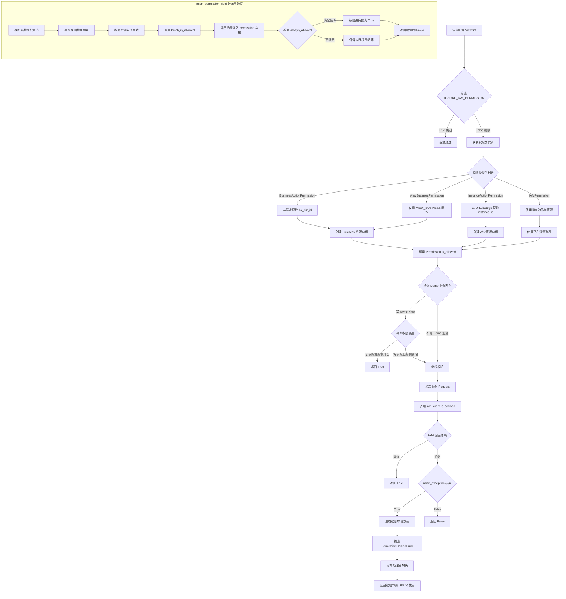

# BKLOG IAM 权限控制技术文档

## 一、目录结构概览

```
apps/iam/
├── __init__.py                 # 模块入口，导出核心类
├── exceptions.py               # IAM 异常定义
├── urls.py                     # URL 路由配置
├── utils.py                    # 工具函数
├── handlers/
│   ├── __init__.py
│   ├── actions.py              # 动作定义
│   ├── compatible.py           # IAM 兼容模式客户端
│   ├── drf.py                  # DRF 权限装饰器/中间件
│   ├── permission.py           # 核心权限类
│   ├── resources.py            # 资源类型定义
│   └ shortcuts.py              # 权限校验快捷函数
├── views/
│   ├── __init__.py
│   ├── meta.py                 # 元信息 API 视图
│   ├── resources.py            # 资源提供者视图
├── management/
│   └ commands/
│     ├── iam_delete_action_v1.py   # 删除 V1 动作命令
│     ├── iam_upgrade_action_v2.py  # 升级 V2 动作命令
```

---

## 二、核心类分析

### 2.1 Permission 权限类

**文件位置**: `apps/iam/handlers/permission.py` (第 57-444 行)

Permission 是 IAM 权限中心鉴权封装的核心类，提供完整的权限校验功能。

```python
# 第 57-98 行
class Permission:
    """
    权限中心鉴权封装
    """

    def __init__(self, username: str = "", bk_tenant_id: str = "", request=None):
        if username and bk_tenant_id:
            self.username = username
            self.bk_tenant_id = bk_tenant_id
        else:
            try:
                request = request or get_request(peaceful=True)
                # web请求
                if request:
                    self.username = request.user.username
                    self.bk_tenant_id = get_request_tenant_id()
                else:
                    self.bk_tenant_id = settings.BK_APP_TENANT_ID
                    # 后台设置
                    self.username = get_local_username()
                    if self.username is None:
                        raise ValueError("must provide `username` or `request` param to init")
            except Exception:
                self.bk_tenant_id = settings.BK_APP_TENANT_ID
                self.username = get_request_username()

        self.iam_client = self.get_iam_client(self.bk_tenant_id)
        # 是否跳过权限中心校验
        self.skip_check = getattr(settings, "SKIP_IAM_PERMISSION_CHECK", False)
        if request and getattr(request, "skip_check", False):
            self.skip_check = True

    @classmethod
    def get_iam_client(cls, bk_tenant_id: str):
        return CompatibleIAM(
            settings.APP_CODE, settings.SECRET_KEY,
            settings.BK_IAM_APIGATEWAY_URL, bk_tenant_id=bk_tenant_id
        )
```

**核心方法**:

| 方法名 | 行号 | 功能说明 |
|--------|------|----------|
| `make_request()` | 99-112 | 构造 IAM 请求对象 |
| `make_multi_action_request()` | 114-129 | 构造多动作请求对象 |
| `_make_application()` | 131-172 | 构造权限申请对象 |
| `get_apply_url()` | 174-185 | 获取权限申请 URL |
| `get_apply_data()` | 187-222 | 生成无权限数据 |
| `is_allowed()` | 249-283 | 核心权限校验方法 |
| `batch_is_allowed()` | 295-313 | 批量权限校验 |
| `filter_space_list_by_action()` | 341-387 | 根据动作过滤业务列表 |
| `grant_creator_action()` | 416-443 | 新建实例关联权限授权 |

**权限校验核心逻辑** (第 249-283 行):

```python
def is_allowed(self, action: ActionMeta | str, resources: list[Resource] = None, raise_exception: bool = False):
    """
    校验用户是否有动作的权限
    :param action: 动作
    :param resources: 依赖的资源实例列表
    :param raise_exception: 鉴权失败时是否需要抛出异常
    """
    action = get_action_by_id(action)
    if not action.related_resource_types:
        resources = []

    # ===== 针对demo业务的权限豁免 开始 ===== #
    if self.is_demo_biz_resource(resources):
        # 如果是demo业务，则进行权限豁免，分为读写权限
        if settings.DEMO_BIZ_EDIT_ENABLED or action.is_read_action():
            return True
    # ===== 针对demo业务的权限豁免 结束 ===== #

    request = self.make_request(action, resources)

    try:
        result = self.iam_client.is_allowed(request)
    except AuthAPIError as e:
        logger.exception(f"[IAM AuthAPI Error]: {e}")
        result = False

    if not result and raise_exception:
        apply_data, apply_url = self.get_apply_data([action], resources)
        raise PermissionDeniedError(
            action_name=action.name,
            apply_url=apply_url,
            permission=apply_data,
        )

    return result
```

---

### 2.2 ResourceMeta 资源基类

**文件位置**: `apps/iam/handlers/resources.py` (第 34-78 行)

```python
class ResourceMeta(metaclass=abc.ABCMeta):
    """
    资源定义
    """
    system_id: str = ""
    id: str = ""
    name: str = ""
    selection_mode: str = ""
    related_instance_selections: list = ""

    @classmethod
    def to_json(cls):
        return {
            "system_id": cls.system_id,
            "id": cls.id,
            "selection_mode": cls.selection_mode,
            "related_instance_selections": cls.related_instance_selections,
        }

    @classmethod
    def create_simple_instance(cls, instance_id: str, attribute=None) -> Resource:
        """
        创建简单资源实例
        """
        attribute = attribute or {}
        # 补充路径信息
        if "space_uid" in attribute:
            bk_biz_id = space_uid_to_bk_biz_id(attribute["space_uid"])
            attribute.update({"_bk_iam_path_": f"/{Business.id},{bk_biz_id}/"})
        elif "bk_biz_id" in attribute:
            attribute.update({"_bk_iam_path_": "/{},{}/".format(Business.id, attribute["bk_biz_id"])})
        return Resource(cls.system_id, cls.id, str(instance_id), attribute)
```

---

### 2.3 ActionMeta 动作基类

**文件位置**: `apps/iam/handlers/actions.py` (第 29-74 行)

```python
class ActionMeta(Action):
    """
    动作定义
    """

    def __init__(
        self,
        id: str,
        name: str,
        name_en: str,
        type: str,
        version: int,
        related_resource_types: list = None,
        related_actions: list = None,
        description: str = "",
        description_en: str = "",
    ):
        super().__init__(id)
        self.name = name
        self.name_en = name_en
        self.type = type
        self.version = version
        self.related_resource_types = related_resource_types or []
        self.related_actions = related_actions or []
        self.description = description
        self.description_en = description_en

    def is_read_action(self):
        """
        是否为读权限
        """
        return self.type == "view"
```

---

## 三、资源类型定义

**文件位置**: `apps/iam/handlers/resources.py`

### 3.1 ResourceEnum 资源枚举 (第 218-226 行)

```python
class ResourceEnum:
    """
    资源类型枚举
    """
    BUSINESS = Business      # 空间/业务
    COLLECTION = Collection  # 采集项
    ES_SOURCE = EsSource     # ES源
    INDICES = Indices        # 索引集
```

### 3.2 各资源类型详细定义

| 资源类型 | 类名 | 行号 | system_id | 资源ID |
|----------|------|------|-----------|--------|
| 空间 | Business | 80-126 | bk_monitorv3 | space |
| 采集项 | Collection | 128-155 | bk_log_search | collection |
| ES源 | EsSource | 157-186 | bk_log_search | es_source |
| 索引集 | Indices | 189-216 | bk_log_search | indices |

**Business 资源定义** (第 80-126 行):

```python
class Business(ResourceMeta):
    """
    CMDB业务
    """
    system_id = "bk_monitorv3"
    id = "space"
    name = gettext_lazy("空间")
    selection_mode = "instance"
    related_instance_selections = [{"system_id": system_id, "id": "space_list"}]

    @classmethod
    def create_simple_instance(cls, instance_id: str, attribute=None) -> Resource:
        from apps.log_search.models import Space, SpaceType

        # 注意，此处 instance_id 有可能是 bk_biz_id，或者是space_uid，需要做统一转换
        try:
            bk_biz_id = int(instance_id)
        except Exception:
            bk_biz_id = None

        try:
            if bk_biz_id is None:
                # 不是数字，那就是space_uid
                space = Space.objects.get(space_uid=instance_id)
            else:
                space = Space.objects.get(bk_biz_id=instance_id)
            bk_biz_id = str(space.bk_biz_id)
            space_name = f"[{SpaceType.get_name_by_id(space.space_type_id)}] {space.space_name}"
        except Exception:
            bk_biz_id = str(instance_id)
            space_name = instance_id

        attribute = attribute or {}
        attribute.update({"id": bk_biz_id, "name": space_name})
        return Resource(cls.system_id, cls.id, bk_biz_id, attribute)
```

---

## 四、动作类型定义

**文件位置**: `apps/iam/handlers/actions.py` (第 76-236 行)

### ActionEnum 动作枚举

| 动作ID | 名称 | 类型 | 关联资源 | 依赖动作 |
|--------|------|------|----------|----------|
| view_business_v2 | 业务访问 | view | BUSINESS | - |
| search_log_v2 | 日志检索 | view | INDICES | view_business_v2 |
| view_collection_v2 | 采集查看 | view | COLLECTION | - |
| create_collection_v2 | 采集新建 | create | BUSINESS | - |
| manage_collection_v2 | 采集管理 | manage | COLLECTION | - |
| create_es_source_v2 | ES源配置新建 | create | BUSINESS | - |
| manage_es_source_v2 | ES源配置管理 | manage | ES_SOURCE | - |
| create_indices_v2 | 索引集配置新建 | create | BUSINESS | - |
| manage_indices_v2 | 索引集配置管理 | manage | INDICES | - |
| manage_extract_config_v2 | 提取配置管理 | manage | BUSINESS | - |
| view_dashboard_v2 | 仪表盘查看 | view | BUSINESS | - |
| manage_dashboard_v2 | 仪表盘管理 | manage | BUSINESS | - |
| manage_desensitize_rule | 脱敏规则管理 | manage | BUSINESS | - |
| manage_global_desensitize_rule | 全局脱敏规则管理 | manage | - | - |
| download_client_log | 客户端日志下载 | view | BUSINESS | view_business_v2 |
| create_client_log_task | 客户端日志采集任务创建 | manage | BUSINESS | view_business_v2 |

**动作定义示例** (第 77-95 行):

```python
class ActionEnum:
    VIEW_BUSINESS = ActionMeta(
        id="view_business_v2",
        name=_("业务访问"),
        name_en="View Business",
        type="view",
        related_resource_types=[ResourceEnum.BUSINESS],
        related_actions=[],
        version=1,
    )

    SEARCH_LOG = ActionMeta(
        id="search_log_v2",
        name=_("日志检索"),
        name_en="Search Log",
        type="view",
        related_resource_types=[ResourceEnum.INDICES],
        related_actions=[VIEW_BUSINESS.id],
        version=1,
    )
```

---

## 五、DRF 权限检查装饰器和中间件

**文件位置**: `apps/iam/handlers/drf.py`

### 5.1 IAMPermission 基类 (第 41-74 行)

```python
class IAMPermission(permissions.BasePermission):
    def __init__(self, actions: list[ActionMeta], resources: list[Resource] = None):
        self.actions = actions
        self.resources = resources or []

    def has_permission(self, request, view):
        """
        Return `True` if permission is granted, `False` otherwise.
        """
        # 跳过权限校验
        if settings.IGNORE_IAM_PERMISSION:
            return True

        if not self.actions:
            return True

        client = Permission()
        for action in self.actions:
            client.is_allowed(
                action=action,
                resources=self.resources,
                raise_exception=True,
            )
        return True
```

### 5.2 BusinessActionPermission 业务动作权限 (第 76-112 行)

```python
class BusinessActionPermission(IAMPermission):
    """
    关联业务的动作权限检查
    """

    def __init__(self, actions: list[ActionMeta], space_uid=None):
        self.space_uid = space_uid
        super().__init__(actions)

    @classmethod
    def fetch_biz_id_by_request(cls, request):
        bk_biz_id = request.data.get("bk_biz_id", 0) or request.query_params.get("bk_biz_id", 0)
        return bk_biz_id

    def has_permission(self, request, view):
        if self.space_uid:
            bk_biz_id = space_uid_to_bk_biz_id(self.space_uid)
        else:
            bk_biz_id = self.fetch_biz_id_by_request(request)
        if not bk_biz_id:
            return True
        self.resources = [ResourceEnum.BUSINESS.create_instance(bk_biz_id)]
        return super().has_permission(request, view)
```

### 5.3 ViewBusinessPermission 业务访问权限 (第 114-121 行)

```python
class ViewBusinessPermission(BusinessActionPermission):
    """
    业务访问权限检查
    """

    def __init__(self):
        super().__init__([ActionEnum.VIEW_BUSINESS])
```

### 5.4 InstanceActionPermission 实例动作权限 (第 123-151 行)

```python
class InstanceActionPermission(IAMPermission):
    """
    关联其他资源的权限检查
    """

    def __init__(self, actions: list[ActionMeta], resource_meta: ResourceMeta):
        self.resource_meta = resource_meta
        super().__init__(actions)

    def has_permission(self, request, view):
        # 跳过权限校验
        if settings.IGNORE_IAM_PERMISSION:
            return True
        instance_id = view.kwargs[self.get_look_url_kwarg(view)]
        resource = self.resource_meta.create_instance(instance_id)
        self.resources = [resource]
        return super().has_permission(request, view)
```

### 5.5 insert_permission_field 装饰器 (第 198-268 行)

用于数据返回后，插入权限相关字段:

```python
def insert_permission_field(
    actions: list[ActionMeta],
    resource_meta: ResourceMeta,
    id_field: Callable = lambda item: item["id"],
    data_field: Callable = lambda data_list: data_list,
    always_allowed: Callable = lambda item: False,
    many: bool = True,
):
    """
    数据返回后，插入权限相关字段
    :param actions: 动作列表
    :param resource_meta: 资源类型
    :param id_field: 从结果集获取ID字段的方式
    :param data_field: 从response.data中获取结果集的方式
    :param always_allowed: 满足一定条件进行权限豁免
    :param many: 是否为列表数据
    """

    def wrapper(view_func):
        @wraps(view_func)
        def wrapped_view(*args, **kwargs):
            response = view_func(*args, **kwargs)

            result_list = data_field(response.data)
            if not many:
                result_list = [result_list]

            resources = []
            for item in result_list:
                if not id_field(item):
                    continue
                attribute = {}
                if "bk_biz_id" in item:
                    attribute["bk_biz_id"] = item["bk_biz_id"]
                if "space_uid" in item:
                    attribute["space_uid"] = item["space_uid"]

                resources.append(
                    [resource_meta.create_simple_instance(instance_id=id_field(item), attribute=attribute)]
                )

            if not resources:
                return response

            if settings.IGNORE_IAM_PERMISSION:
                for item in result_list:
                    item.setdefault("permission", {})
                    item["permission"].update({action.id: True for action in actions})
                return response

            permission_result = Permission().batch_is_allowed(actions, resources)

            for item in result_list:
                origin_instance_id = id_field(item)
                if not origin_instance_id:
                    continue
                instance_id = str(origin_instance_id)
                item.setdefault("permission", {})
                item["permission"].update(permission_result[instance_id])

                if always_allowed(item):
                    # 权限豁免
                    for action_id in item["permission"]:
                        item["permission"][action_id] = True

            return response

        return wrapped_view

    return wrapper
```

---

## 六、异常处理

**文件位置**: `apps/iam/exceptions.py`

| 异常类 | 行号 | 错误码 | 说明 |
|--------|------|--------|------|
| BaseIAMError | 29-31 | - | IAM 基础异常 |
| ActionNotExistError | 34-36 | 001 | 动作ID不存在 |
| ResourceNotExistError | 39-41 | 002 | 资源ID不存在 |
| GetSystemInfoError | 44-46 | 003 | 获取系统信息错误 |
| NotHaveInstanceIdError | 49-51 | 004 | 没有传入鉴权实例id |
| PermissionDeniedError | 54-64 | 403 | 权限校验不通过 |

**PermissionDeniedError 定义** (第 54-64 行):

```python
class PermissionDeniedError(BaseIAMError):
    ERROR_CODE = "403"
    MESSAGE = gettext_lazy("权限校验不通过")

    def __init__(self, action_name, permission, apply_url=settings.BK_IAM_SAAS_HOST):
        message = _("当前用户无 [{action_name}] 权限").format(action_name=action_name)
        data = {
            "permission": permission,
            "apply_url": apply_url,
        }
        super().__init__(message, data=data, code="9900403")
```

---

## 七、权限检查流程图



---

## 八、实际使用示例

### 8.1 ViewSet 中使用权限类

**文件位置**: `apps/log_databus/views/storage_views.py` (第 49-58 行)

```python
class StorageViewSet(APIViewSet):
    lookup_field = "cluster_id"
    serializer_class = serializers.Serializer

    def get_permissions(self):
        if self.action == "create":
            return [BusinessActionPermission([ActionEnum.CREATE_ES_SOURCE])]
        if self.action == "update":
            return [InstanceActionPermission([ActionEnum.MANAGE_ES_SOURCE], ResourceEnum.ES_SOURCE)]
        return [ViewBusinessPermission()]
```

### 8.2 使用 insert_permission_field 装饰器

**文件位置**: `apps/log_databus/views/storage_views.py` (第 60-66 行)

```python
@list_route(methods=["GET"], url_path="cluster_groups")
@insert_permission_field(
    actions=[ActionEnum.MANAGE_ES_SOURCE],
    resource_meta=ResourceEnum.ES_SOURCE,
    id_field=lambda d: d["storage_cluster_id"],
    always_allowed=lambda d: d.get("bk_biz_id") == 0,
)
def list_cluster_groups(self, request, *args, **kwargs):
    # ... 业务逻辑
```

### 8.3 IAMPermissionMixin 混入类使用

**文件位置**: `apps/generic.py` (第 155-178 行)

```python
class IAMPermissionMixin:
    ActionEnum = ActionEnum
    ResourceEnum = ResourceEnum

    @property
    def iam_permission(self) -> Permission:
        if not hasattr(self, "_iam_permission"):
            setattr(self, "_iam_permission", Permission())
        return getattr(self, "_iam_permission")

    def assert_allowed(self, action: ActionMeta, resources: List[Resource] = None):
        """
        权限校验
        """
        self.iam_permission.is_allowed(action, resources, raise_exception=True)

    def assert_business_action_allowed(self, action: ActionMeta):
        bk_biz_id = self.request.data.get("bk_biz_id", 0) or self.request.query_params.get("bk_biz_id", 0)
        self.assert_allowed(action, [self.ResourceEnum.BUSINESS.create_instance(bk_biz_id)])

    def assert_view_business_allowed(self):
        self.assert_business_action_allowed(self.ActionEnum.VIEW_BUSINESS)
```

---

## 九、关键配置项

| 配置项 | 说明 |
|--------|------|
| `BK_IAM_SYSTEM_ID` | IAM 系统标识 |
| `BK_IAM_APIGATEWAY_URL` | IAM API 网关地址 |
| `IGNORE_IAM_PERMISSION` | 是否跳过权限校验 |
| `SKIP_IAM_PERMISSION_CHECK` | 是否跳过权限检查 |
| `DEMO_BIZ_ID` | Demo 业务 ID |
| `DEMO_BIZ_EDIT_ENABLED` | Demo 业务编辑权限开启 |
| `ENABLE_MULTI_TENANT_MODE` | 多租户模式开启 |

---

**文档版本**: v1.0
**生成日期**: 2026-04-30
**源码路径**: `apps/iam/handlers/`