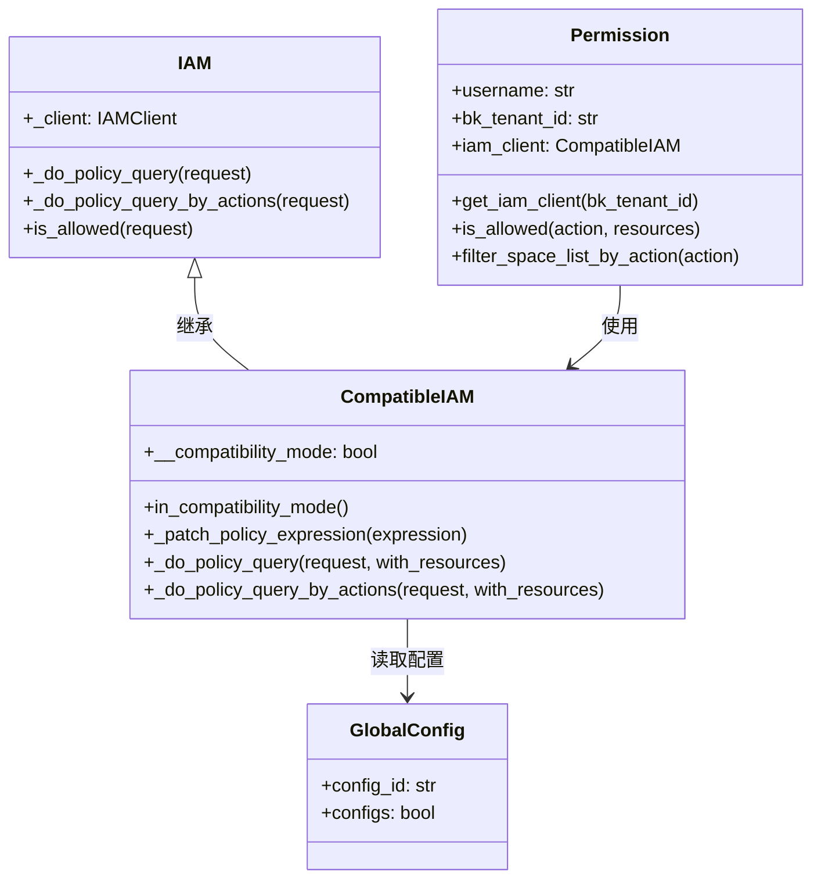
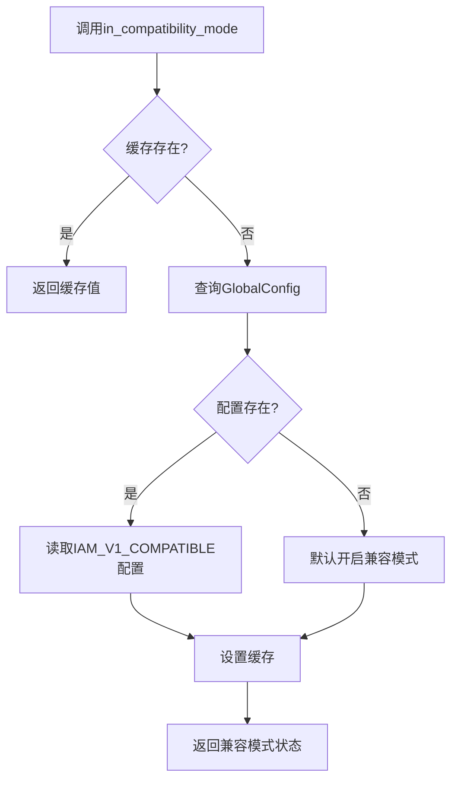
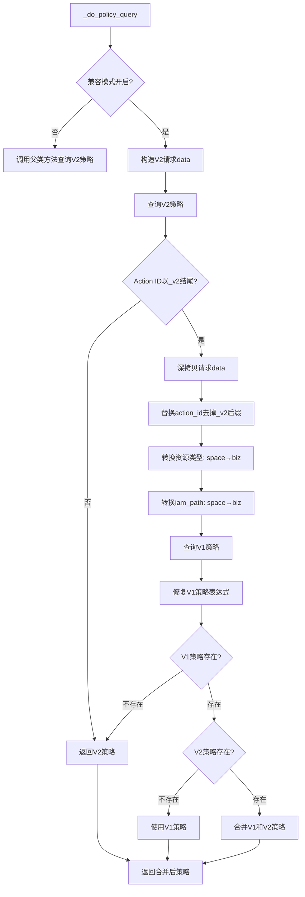
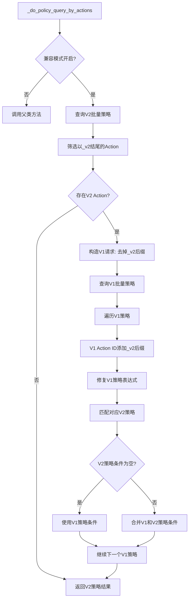
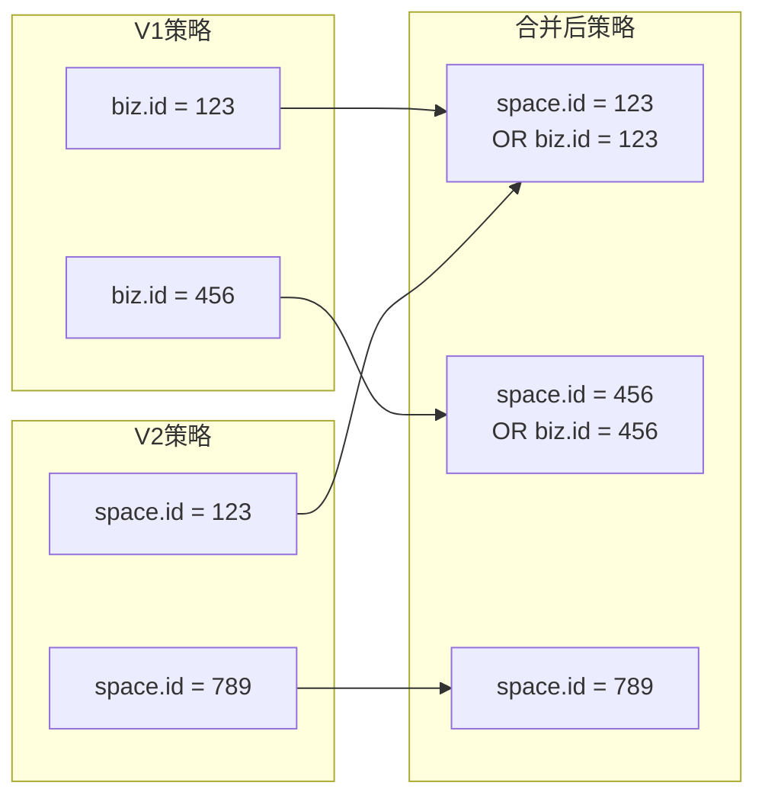
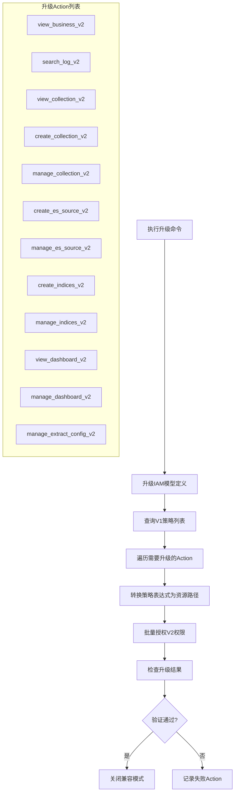
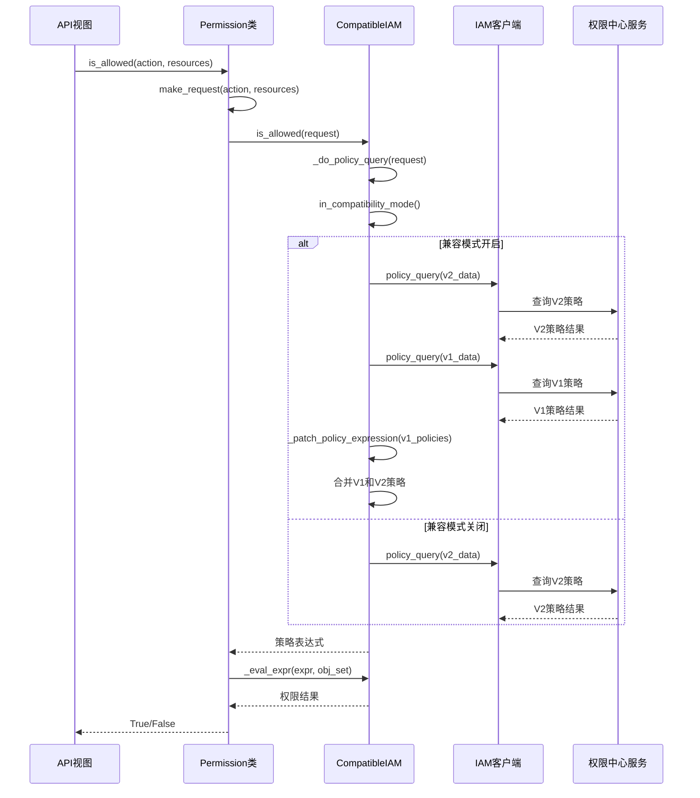
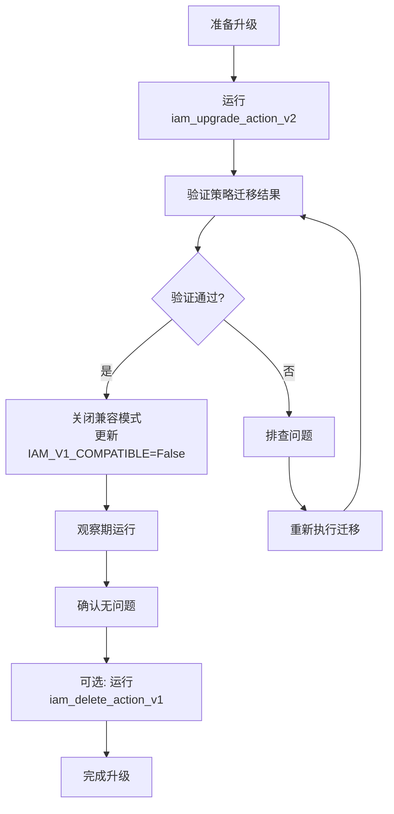

# IAM V1/V2 兼容机制

## 概述

BKLOG项目在权限系统升级过程中，采用了V1/V2兼容机制，确保在权限动作从旧版本（V1）迁移到新版本（V2）期间，用户权限验证不中断。本文档深入解析`CompatibleIAM`类的核心实现，包括策略合并、版本兼容判断、权限切换机制等关键逻辑。

## 核心架构



## 兼容模式判断逻辑

### 兼容开关配置

兼容模式通过`GlobalConfig`表中的`IAM_V1_COMPATIBLE`配置项控制。

**源文件**: `apps/iam/handlers/compatible.py` (第14-30行)

```python
def in_compatibility_mode(self):
    if hasattr(CompatibleIAM, "__compatibility_mode"):
        return getattr(CompatibleIAM, "__compatibility_mode")

    from apps.log_search.models import GlobalConfig

    # 存在V1操作时，通过开关去判断是否开启兼容模式
    try:
        compatibility_mode = GlobalConfig.objects.get(config_id="IAM_V1_COMPATIBLE").configs
    except GlobalConfig.DoesNotExist:
        # 配置不存在时，默认打开兼容模式
        compatibility_mode = True

    setattr(CompatibleIAM, "__compatibility_mode", compatibility_mode)

    logger.info("[CompatibleIAM] in compatibility mode: %s", compatibility_mode)
    return compatibility_mode
```

### 判断流程



### 兼容模式状态

| 配置值 | 含义 |
|--------|------|
| `True` | 开启兼容模式，同时查询V1和V2策略 |
| `False` | 关闭兼容模式，仅查询V2策略 |
| 不存在 | 默认开启兼容模式 |

## V1/V2 Action ID映射关系

### Action版本对照表

**源文件**: `apps/iam/handlers/actions.py` (第76-195行)

| V2 Action ID | V1 Action ID | 动作名称 | 资源类型 |
|--------------|--------------|----------|----------|
| `view_business_v2` | `view_business` | 业务访问 | Business |
| `search_log_v2` | `search_log` | 日志检索 | Indices |
| `view_collection_v2` | `view_collection` | 采集查看 | Collection |
| `create_collection_v2` | `create_collection` | 采集新建 | Business |
| `manage_collection_v2` | `manage_collection` | 采集管理 | Collection |
| `create_es_source_v2` | `create_es_source` | ES源配置新建 | Business |
| `manage_es_source_v2` | `manage_es_source` | ES源配置管理 | EsSource |
| `create_indices_v2` | `create_indices` | 索引集配置新建 | Business |
| `manage_indices_v2` | `manage_indices` | 索引集配置管理 | Indices |
| `view_dashboard_v2` | `view_dashboard` | 仪表盘查看 | Business |
| `manage_dashboard_v2` | `manage_dashboard` | 仪表盘管理 | Business |
| `manage_extract_config_v2` | `manage_extract_config` | 提取配置管理 | Business |

### Action定义示例

```python
VIEW_BUSINESS = ActionMeta(
    id="view_business_v2",           # V2版本Action ID
    name=_("业务访问"),
    name_en="View Business",
    type="view",                     # 动作类型: view/create/manage
    related_resource_types=[ResourceEnum.BUSINESS],
    related_actions=[],
    version=1,
)
```

## 策略合并核心实现

### 单Action策略查询

**源文件**: `apps/iam/handlers/compatible.py` (第47-90行)

```python
def _do_policy_query(self, request, with_resources=True):
    if not self.in_compatibility_mode():
        return super(CompatibleIAM, self)._do_policy_query(request, with_resources)

    data = request.to_dict()
    logger.debug("the request: %s", data)

    # NOTE: 不向服务端传任何resource, 用于统一类资源的批量鉴权
    # 将会返回所有策略, 然后遍历资源列表和策略列表, 逐一计算
    if not with_resources:
        data["resources"] = []

    ok, message, policies = self._client.policy_query(data)
    if data["action"]["id"].endswith("_v2"):
        v1_data = copy.deepcopy(data)

        # 替换action_id
        v1_data["action"]["id"] = v1_data["action"]["id"].replace("_v2", "")

        # 替换资源名称
        for resource in v1_data["resources"]:
            if resource["type"] == "space":
                resource["system"] = "bk_cmdb"
                resource["type"] = "biz"
            iam_path = resource.get("attribute", {}).get("_bk_iam_path_", "")
            if "space" in iam_path:
                resource["attribute"]["_bk_iam_path_"] = iam_path.replace("space", "biz")

        v1_ok, v1_message, v1_policies = self._client.policy_query(v1_data)
        self._patch_policy_expression(v1_policies)

        if v1_policies:
            if not policies:
                policies = v1_policies
            else:
                # 将两个版本的 action 的策略组合起来
                policies = {
                    "op": "OR",
                    "content": [policies, v1_policies],
                }

    if not policies and not ok:
        raise AuthAPIError(message)
    return policies
```

### 策略查询流程图



### 多Action批量策略查询

**源文件**: `apps/iam/handlers/compatible.py` (第92-139行)

```python
def _do_policy_query_by_actions(self, request, with_resources=True):
    if not self.in_compatibility_mode():
        return super(CompatibleIAM, self)._do_policy_query_by_actions(request, with_resources)

    data = request.to_dict()
    logger.debug("the request: %s", data)

    if not with_resources:
        data["resources"] = []

    ok, message, action_policies = self._client.policy_query_by_actions(data)

    # v2的action需要查一下v1的action是否有权限
    v2_actions = [action["id"] for action in data["actions"] if action["id"].endswith("_v2")]

    if v2_actions:
        v1_data = copy.deepcopy(data)

        # 替换action_id
        v1_data["actions"] = [{"id": action_id.replace("_v2", "")} for action_id in v2_actions]

        v1_ok, v1_message, v1_action_policies = self._client.policy_query_by_actions(v1_data)
        for v1_policy in v1_action_policies:
            v1_policy["action"]["id"] += "_v2"
            # 替换资源名称
            self._patch_policy_expression(v1_policy["condition"])

            for policy in action_policies:
                # 与V2的策略做比对，如果V2是空，就用V1的
                if v1_policy["action"]["id"] != policy["action"]["id"]:
                    continue

                if not v1_policy["condition"]:
                    continue

                if not policy["condition"]:
                    policy["condition"] = v1_policy["condition"]
                else:
                    policy["condition"] = {
                        "op": "OR",
                        "content": [policy["condition"], v1_policy["condition"]],
                    }

    if not ok:
        raise AuthAPIError(message)
    return action_policies
```

### 批量策略合并逻辑



## 表达式转换机制

### 资源名称映射

V1版本使用`biz`作为业务资源类型，V2版本使用`space`。需要将V1策略表达式中的`biz`转换为`space`以实现兼容。

**源文件**: `apps/iam/handlers/compatible.py` (第32-45行)

```python
def _patch_policy_expression(self, expression):
    """
    将业务资源表达式转换为空间
    """
    if not expression:
        return
    if expression["op"] == "OR":
        for sub_expr in expression["content"]:
            self._patch_policy_expression(sub_expr)
    else:
        if expression["field"] == "biz.id":
            expression["field"] = "space.id"
        if "biz" in expression["value"]:
            expression["value"] = expression["value"].replace("biz", "space")
```

### 表达式转换示例

| V1表达式字段 | V2表达式字段 | 转换说明 |
|--------------|--------------|----------|
| `biz.id` | `space.id` | 业务ID字段映射 |
| `/biz,5/` | `/space,5/` | IAM路径转换 |

### 表达式结构示意

```json
// V1表达式示例
{
    "op": "OR",
    "content": [
        {
            "field": "biz.id",
            "op": "eq",
            "value": "123"
        },
        {
            "field": "indices._bk_iam_path_",
            "op": "starts_with",
            "value": "/biz,5/"
        }
    ]
}

// 转换后的V2兼容表达式
{
    "op": "OR",
    "content": [
        {
            "field": "space.id",
            "op": "eq",
            "value": "123"
        },
        {
            "field": "indices._bk_iam_path_",
            "op": "starts_with",
            "value": "/space,5/"
        }
    ]
}
```

## 策略合并算法

### OR操作合并策略

当V1和V2策略都存在时，使用OR操作将两个策略合并为一个复合表达式：

```python
policies = {
    "op": "OR",
    "content": [policies, v1_policies],
}
```

### 合并策略逻辑图



### 权限验证结果

| V1权限 | V2权限 | 合并后结果 |
|--------|--------|------------|
| 有权限 | 有权限 | 有权限 |
| 有权限 | 无权限 | 有权限 |
| 无权限 | 有权限 | 有权限 |
| 无权限 | 无权限 | 无权限 |

## 升级迁移工具

### iam_upgrade_action_v2命令

**源文件**: `apps/iam/management/commands/iam_upgrade_action_v2.py`

该命令用于将V1版本的权限策略迁移到V2版本。



### 策略转换核心逻辑

**源文件**: `apps/iam/management/commands/iam_upgrade_action_v2.py` (第274-330行)

```python
def expression_to_resource_paths(self, expression, paths: list):
    """
    将权限表达式转换为资源路径
    """
    if expression["op"] == "OR":
        for sub_expr in expression["content"]:
            self.expression_to_resource_paths(sub_expr, paths)
    elif expression["op"] == "eq":
        # example: indices.id => indices
        resource_type = expression["field"].split(".")[0]
        if resource_type == "biz":
            # biz => space
            resource_type = ResourceEnum.BUSINESS.id
        resource_id = expression["value"]
        paths.append([
            {
                "type": resource_type,
                "id": resource_id,
                "name": self.get_resource_name(resource_type, resource_id),
            },
        ])
    elif expression["op"] == "in":
        # 处理in操作，批量资源ID
        resource_type = expression["field"].split(".")[0]
        if resource_type == "biz":
            resource_type = ResourceEnum.BUSINESS.id
        for resource_id in expression["value"]:
            paths.append([...])
    elif expression["op"] == "starts_with":
        # 处理路径匹配
        resource_type = ResourceEnum.BUSINESS.id
        resource_id = expression["value"][1:-1].split(",")[1]
        paths.append([...])
    elif expression["op"] == "any":
        # 拥有全部权限
        paths.append([])
```

### iam_delete_action_v1命令

**源文件**: `apps/iam/management/commands/iam_delete_action_v1.py`

升级完成后，使用此命令删除V1版本的Action定义（高危操作）：

```python
def handle(self, **options):
    """
    删除 IAM 的旧操作
    注意！！！此为高危操作，请慎用！！！
    """
    print("[delete_all_old_actions] [START]")
    for action in ACTIONS_TO_UPGRADE:
        old_action_id = action.id.replace("_v2", "")
        self.delete_action(old_action_id)
    print("[delete_all_old_actions] [END]")
```

## 权限验证调用链

### Permission类与CompatibleIAM集成

**源文件**: `apps/iam/handlers/permission.py` (第86-97行)

```python
def __init__(self, username: str = "", bk_tenant_id: str = "", request=None):
    # ... 初始化逻辑 ...
    self.iam_client = self.get_iam_client(self.bk_tenant_id)

@classmethod
def get_iam_client(cls, bk_tenant_id: str):
    return CompatibleIAM(
        settings.APP_CODE, settings.SECRET_KEY,
        settings.BK_IAM_APIGATEWAY_URL, bk_tenant_id=bk_tenant_id
    )
```

### is_allowed调用链



### filter_space_list_by_action方法

**源文件**: `apps/iam/handlers/permission.py` (第341-387行)

```python
def filter_space_list_by_action(
    self, action: ActionMeta | str, bk_tenant_id: str = "", space_list: list = None
) -> list:
    # 获取业务列表
    space_list = Space.get_all_spaces(bk_tenant_id=bk_tenant_id)

    # 跳过权限检验
    if settings.IGNORE_IAM_PERMISSION:
        return space_list

    # 拉取策略
    request = self.make_request(action=action)

    try:
        policies = self.iam_client._do_policy_query(request)
    except AuthAPIError as e:
        logger.exception(f"[IAM AuthAPI Error]: {e}")
        return []

    if not policies:
        # 如果策略是空，则说明没有任何权限
        for space in space_list:
            if settings.DEMO_BIZ_ID == space["bk_biz_id"]:
                return [space]
        return []

    # 生成表达式
    expr = make_expression(policies)

    results = []
    for space in space_list:
        obj_set = ObjectSet()
        obj_set.add_object(_type=ResourceEnum.BUSINESS.id, obj={"id": str(space["bk_biz_id"])})

        # 计算表达式
        is_allowed = self.iam_client._eval_expr(expr, obj_set)

        if is_allowed or str(settings.DEMO_BIZ_ID) == str(space["bk_biz_id"]):
            results.append(space)

    return results
```

## 关键配置项

| 配置项 | 说明 | 默认值 |
|--------|------|--------|
| `IAM_V1_COMPATIBLE` | V1兼容模式开关 | `True` (不存在时) |
| `BK_IAM_SYSTEM_ID` | IAM系统ID | `bk_log` |
| `BK_IAM_APIGATEWAY_URL` | IAM API网关地址 | - |
| `IGNORE_IAM_PERMISSION` | 跳过权限检验 | `False` |
| `DEMO_BIZ_ID` | Demo业务ID | - |

## 最佳实践

### 1. 升级流程建议



### 2. 兼容模式关闭时机

- 确认所有V1策略已成功迁移到V2
- 验证用户权限验证功能正常
- 建议：关闭兼容模式后保留一段观察期，确保无遗漏

### 3. 高危操作警告

`iam_delete_action_v1`命令会永久删除V1版本的Action定义及其所有策略，执行前需：
- 确认升级完全成功
- 备份现有权限配置
- 在非生产环境先验证

---
**版本**: v1.0
**日期**: 2026-04-30
**源码位置**: `D:\projects\bk-monitor\bklog\apps\iam\handlers\compatible.py`