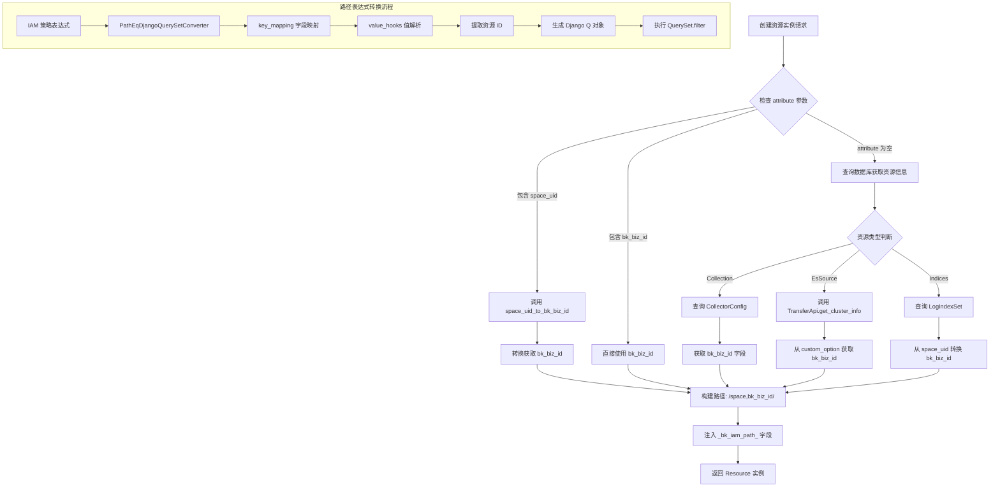
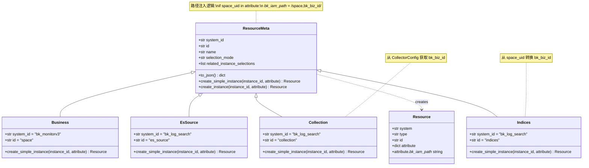

# BKLOG IAM 资源路径注入技术文档

## 一、概述

资源路径注入是 BKLOG IAM 权限系统的核心机制，通过 `_bk_iam_path_` 字段实现资源的层级关系表达。该机制确保了权限策略能够基于资源拓扑路径进行精确匹配和过滤。

---

## 二、路径格式规范

### 2.1 标准路径格式

IAM 资源路径采用统一的格式规范：

```
/{resource_type},{resource_id}/
```

**格式说明**：
- 以 `/` 开头和结尾
- `resource_type`: 资源类型标识（如 `space`、`biz`）
- `resource_id`: 资源实例 ID
- 多层级路径通过嵌套表示：`/parent_type,parent_id/child_type,child_id/`

### 2.2 BKLOG 中的路径示例

| 资源类型 | 路径示例 | 说明 |
|----------|----------|------|
| 空间(Business) | `/space,2/` | 业务 ID 为 2 的空间 |
| 采集项(Collection) | `/space,2/` | 属于业务 2 的采集项 |
| ES源(EsSource) | `/space,99/` | 属于业务 99 的 ES 集群 |
| 索引集(Indices) | `/space,3/` | 属于业务 3 的索引集 |

---

## 三、路径注入核心实现

### 3.1 ResourceMeta 基类路径注入

**文件位置**: `apps/iam/handlers/resources.py` (第 55-68 行)

```python
@classmethod
def create_simple_instance(cls, instance_id: str, attribute=None) -> Resource:
    """
    创建简单资源实例
    :param instance_id: 实例ID
    :param attribute: 属性kv对
    """
    attribute = attribute or {}
    # 补充路径信息
    if "space_uid" in attribute:
        bk_biz_id = space_uid_to_bk_biz_id(attribute["space_uid"])
        attribute.update({"_bk_iam_path_": f"/{Business.id},{bk_biz_id}/"})
    elif "bk_biz_id" in attribute:
        attribute.update({"_bk_iam_path_": "/{},{}/".format(Business.id, attribute["bk_biz_id"])})
    return Resource(cls.system_id, cls.id, str(instance_id), attribute)
```

**注入逻辑分析**：

1. 检测 `attribute` 中是否存在 `space_uid` 或 `bk_biz_id`
2. 通过 `space_uid_to_bk_biz_id()` 函数转换空间标识
3. 构建标准路径格式并注入到 `_bk_iam_path_` 字段

### 3.2 Collection 资源路径注入

**文件位置**: `apps/iam/handlers/resources.py` (第 136-154 行)

```python
@classmethod
def create_simple_instance(cls, instance_id: str, attribute=None) -> Resource:
    from apps.log_databus.models import CollectorConfig

    resource = super().create_simple_instance(instance_id, attribute)
    if resource.attribute:
        return resource

    try:
        config = CollectorConfig.objects.get(pk=instance_id)
    except CollectorConfig.DoesNotExist:
        return resource

    resource.attribute = {
        "id": str(instance_id),
        "name": config.collector_config_name,
        "bk_biz_id": str(config.bk_biz_id),
        "_bk_iam_path_": f"/{Business.id},{config.bk_biz_id}/",
    }
    return resource
```

### 3.3 EsSource 资源路径注入

**文件位置**: `apps/iam/handlers/resources.py` (第 165-186 行)

```python
@classmethod
def create_simple_instance(cls, instance_id: str, attribute=None) -> Resource:
    resource = super().create_simple_instance(instance_id, attribute)
    if resource.attribute:
        return resource

    try:
        result = TransferApi.get_cluster_info({"cluster_id": instance_id})
        if not result:
            return resource
        cluster_info = result[0]
        name = cluster_info["cluster_config"].get("display_name") or cluster_info["cluster_config"]["cluster_name"]
        bk_biz_id = cluster_info["cluster_config"]["custom_option"].get("bk_biz_id", 0)
    except Exception:
        return resource

    resource.attribute = {
        "id": str(instance_id),
        "name": name,
        "bk_biz_id": str(bk_biz_id),
        "_bk_iam_path_": f"/{Business.id},{bk_biz_id}/",
    }
    return resource
```

### 3.4 Indices 资源路径注入

**文件位置**: `apps/iam/handlers/resources.py` (第 197-215 行)

```python
@classmethod
def create_simple_instance(cls, instance_id: str, attribute=None) -> Resource:
    from apps.log_search.models import LogIndexSet

    resource = super().create_simple_instance(instance_id, attribute)
    if resource.attribute:
        return resource

    try:
        index_set = LogIndexSet.objects.get(pk=instance_id)
    except LogIndexSet.DoesNotExist:
        return resource
    bk_biz_id = str(space_uid_to_bk_biz_id(index_set.space_uid))
    resource.attribute = {
        "id": str(instance_id),
        "name": index_set.index_set_name,
        "bk_biz_id": bk_biz_id,
        "_bk_iam_path_": f"/{Business.id},{bk_biz_id}/",
    }
    return resource
```

---

## 四、资源提供者路径返回

### 4.1 CollectionResourceProvider 路径返回

**文件位置**: `apps/iam/views/resources.py` (第 78-113 行)

```python
def list_instance(self, filter, page, **options):
    queryset = []
    with_path = False
    if not (filter.parent or filter.search or filter.resource_type_chain):
        queryset = CollectorConfig.objects.all()
        queryset = self.get_bk_tenant_objects(queryset, options["bk_tenant_id"])
    elif filter.parent:
        parent_id = filter.parent["id"]
        if parent_id:
            queryset = CollectorConfig.objects.filter(bk_biz_id=parent_id)
    elif filter.search and filter.resource_type_chain:
        # 返回结果需要带上资源拓扑路径信息
        with_path = True

        keywords = filter.search.get("collection", [])

        q_filter = Q()
        for keyword in keywords:
            q_filter |= Q(collector_config_name__icontains=keyword)

        queryset = CollectorConfig.objects.filter(q_filter)
        queryset = self.get_bk_tenant_objects(queryset, options["bk_tenant_id"])

    if not with_path:
        results = [
            {"id": str(item.pk), "display_name": item.collector_config_name}
            for item in queryset[page.slice_from : page.slice_to]
        ]
    else:
        results = []
        for item in queryset[page.slice_from : page.slice_to]:
            results.append(
                {
                    "id": str(item.pk),
                    "display_name": item.collector_config_name,
                    "_bk_iam_path_": [
                        [
                            {
                                "type": ResourceEnum.BUSINESS.id,
                                "id": str(item.bk_biz_id),
                                "display_name": str(item.bk_biz_id),
                            }
                        ]
                    ],
                }
            )

    return ListResult(results=results, count=queryset.count())
```

**路径返回结构说明**：

`_bk_iam_path_` 字段返回嵌套列表结构，表示资源的层级拓扑路径：

```python
{
    "_bk_iam_path_": [
        [
            {
                "type": "space",        # 资源类型
                "id": "2",               # 资源ID
                "display_name": "2"      # 显示名称
            }
        ]
    ]
}
```

### 4.2 EsSourceResourceProvider 路径构建

**文件位置**: `apps/iam/views/resources.py` (第 216-236 行)

```python
@classmethod
def list_clusters(cls, bk_tenant_id):
    """
    获取非系统内置集群列表
    """
    clusters = TransferApi.get_cluster_info({"cluster_type": STORAGE_CLUSTER_TYPE, "no_request": True})
    # 过滤非内置集群，且业务ID不为空的集群
    clusters = [
        {
            "id": str(cluster["cluster_config"]["cluster_id"]),
            "display_name": cluster["cluster_config"]["cluster_name"],
            "bk_biz_id": str(cluster["cluster_config"]["custom_option"]["bk_biz_id"]),
            "owner": cluster["cluster_config"]["creator"],
            "_bk_iam_path_": "/{},{}/".format(
                ResourceEnum.BUSINESS.id,
                cluster["cluster_config"]["custom_option"]["bk_biz_id"],
            ),
        }
        for cluster in clusters
        if cluster["cluster_config"].get("registered_system") != REGISTERED_SYSTEM_DEFAULT
        and cluster["cluster_config"]["custom_option"].get("bk_biz_id")
    ]
    return clusters
```

### 4.3 IndicesResourceProvider 路径返回

**文件位置**: `apps/iam/views/resources.py` (第 377-417 行)

```python
elif filter.search and filter.resource_type_chain:
    # 返回结果需要带上资源拓扑路径信息
    with_path = True

    keywords = filter.search.get("indices", [])

    q_filter = Q()
    for keyword in keywords:
        q_filter |= Q(index_set_name__icontains=keyword)

    queryset = LogIndexSet.objects.filter(q_filter)
    if self.ENABLE_MULTI_TENANT_MODE:
        space_uid_list = Space.get_space_uid_list(bk_tenant_id)
        queryset = queryset.filter(space_uid__in=space_uid_list)

if not with_path:
    results = [
        {"id": str(item.pk), "display_name": item.index_set_name}
        for item in queryset[page.slice_from : page.slice_to]
    ]
else:
    results = []
    bk_biz_id_mapping = {}
    for item in queryset[page.slice_from : page.slice_to]:
        if item.space_uid not in bk_biz_id_mapping:
            bk_biz_id_mapping[item.space_uid] = str(space_uid_to_bk_biz_id(item.space_uid))
        results.append(
            {
                "id": str(item.pk),
                "display_name": item.index_set_name,
                "_bk_iam_path_": [
                    [
                        {
                            "type": ResourceEnum.BUSINESS.id,
                            "id": bk_biz_id_mapping[item.space_uid],
                            "display_name": bk_biz_id_mapping[item.space_uid],
                        }
                    ]
                ],
            }
        )
```

---

## 五、路径表达式转换

### 5.1 PathEqDjangoQuerySetConverter 转换器

**文件位置**: `apps/iam/views/resources.py` (第 136-143 行)

```python
converter = PathEqDjangoQuerySetConverter(
    key_mapping={
        "collection.id": "pk",
        "collection.owner": "created_by",
        "collection._bk_iam_path_": "bk_biz_id",
    },
    value_hooks={"bk_biz_id": lambda value: value[1:-1].split(",")[1]},
)
filters = converter.convert(expression)
```

**转换逻辑分析**：

1. **key_mapping**: 将 IAM 字段映射到 Django 模型字段
2. **value_hooks**: 路径值解析函数
   - 输入: `/space,2/`
   - 处理: `value[1:-1]` 去除首尾 `/`，得到 `space,2`
   - 解析: `split(",")[1]` 取资源 ID，得到 `2`

### 5.2 PathInDjangoQuerySetConverter 自定义转换器

**文件位置**: `apps/iam/views/resources.py` (第 358-361 行)

```python
class PathInDjangoQuerySetConverter(DjangoQuerySetConverter):
    def operator_map(self, operator, field, value):
        if field.endswith(KEYWORD_BK_IAM_PATH_FIELD_SUFFIX) and operator == OP.STARTS_WITH:
            return self._in
```

**转换器说明**：

- 继承 `DjangoQuerySetConverter` 基类
- 重写 `operator_map` 方法
- 将 `starts_with` 操作符转换为 `_in` 操作符
- 用于处理路径前缀匹配场景

### 5.3 Indices 资源路径转换

**文件位置**: `apps/iam/views/resources.py` (第 442-449 行)

```python
key_mapping = {
    "indices.id": "pk",
    "indices.owner": "created_by",
    "indices._bk_iam_path_": "space_uid",
}
converter = self.PathInDjangoQuerySetConverter(
    key_mapping, {"space_uid": lambda value: bk_biz_id_to_space_uid(value[1:-1].split(",")[1])}
)
filters = converter.convert(expression)
```

**特殊处理**：

- 索引集资源的路径映射到 `space_uid` 字段
- 使用 `bk_biz_id_to_space_uid()` 函数进行反向转换
- 从路径中提取 `bk_biz_id`，转换为 `space_uid`

---

## 六、路径注入流程图



---

## 七、资源层级关系类图



---

## 八、空间标识转换工具

### 8.1 space_uid_to_bk_biz_id 函数

**文件位置**: `bkm_space/utils.py` (第 8-34 行)

```python
def space_uid_to_bk_biz_id(space_uid: str, id: int = None) -> int:
    """
    空间唯一标识 转换为 业务ID
    规则：空间类型为业务的，直接返回业务ID；空间类型为其他，则返回空间自增ID的相反数
    :param space_uid: 空间唯一标识
    :param id: 空间自增ID
    """
    try:
        space_type, space_id = parse_space_uid(space_uid)
    except ValueError:
        return 0

    if space_type == SpaceTypeEnum.BKCC.value:
        # 遇到业务空间直接转换
        return int(space_id)

    if id is not None:
        # 如果有传自增ID，就直接使用自增ID，对其取相反数，得到负数的业务ID
        return -id

    # 如果没有提供自增ID，非业务空间则通过API查询
    space = api.SpaceApi.get_space_detail(space_uid=space_uid)

    if not space:
        return 0

    return -int(space.id)
```

### 8.2 bk_biz_id_to_space_uid 函数

**文件位置**: `bkm_space/utils.py` (第 37-56 行)

```python
def bk_biz_id_to_space_uid(bk_biz_id: Union[str, int]) -> str:
    """
    业务ID 转换为 空间唯一标识
    :param bk_biz_id: CMDB 业务ID
    """
    if isinstance(bk_biz_id, (str, int)):
        bk_biz_id = int(bk_biz_id)
    else:
        return ""

    if bk_biz_id >= 0:
        return api.SpaceApi.gen_space_uid(SpaceTypeEnum.BKCC.value, bk_biz_id)

    space = api.SpaceApi.get_space_detail(id=-bk_biz_id)

    if not space:
        return ""

    return space.space_uid
```

---

## 九、兼容模式路径处理

### 9.1 V1/V2 版本路径兼容

**文件位置**: `apps/iam/handlers/compatible.py` (第 32-45 行)

```python
def _patch_policy_expression(self, expression):
    """
    将业务资源表达式转换为空间
    """
    if not expression:
        return
    if expression["op"] == "OR":
        for sub_expr in expression["content"]:
            self._patch_policy_expression(sub_expr)
    else:
        if expression["field"] == "biz.id":
            expression["field"] = "space.id"
        if "biz" in expression["value"]:
            expression["value"] = expression["value"].replace("biz", "space")
```

### 9.2 路径字段兼容转换

**文件位置**: `apps/iam/handlers/compatible.py` (第 67-73 行)

```python
# 替换资源名称
for resource in v1_data["resources"]:
    if resource["type"] == "space":
        resource["system"] = "bk_cmdb"
        resource["type"] = "biz"
    iam_path = resource.get("attribute", {}).get("_bk_iam_path_", "")
    if "space" in iam_path:
        resource["attribute"]["_bk_iam_path_"] = iam_path.replace("space", "biz")
```

---

## 十、路径策略表达式解析

### 10.1 表达式结构示例

**文件位置**: `apps/iam/management/commands/iam_upgrade_action_v2.py` (第 332-344 行)

```python
# 策略表达式示例
policy = {
    'version': '1',
    'id': 392,
    'subject': {'type': 'group', 'id': '1', 'name': '运维组'},
    'expression': {
        'field': 'indices._bk_iam_path_',
        'op': 'starts_with',
        'value': '/biz,2/'
    },
    'expired_at': 4102444800
}
```

### 10.2 表达式转路径解析

**文件位置**: `apps/iam/management/commands/iam_upgrade_action_v2.py` (第 274-330 行)

```python
def expression_to_resource_paths(self, expression, paths: list):
    """
    将权限表达式转换为资源路径
    """
    if expression["op"] == "OR":
        for sub_expr in expression["content"]:
            self.expression_to_resource_paths(sub_expr, paths)
    elif expression["op"] == "eq":
        # example: indices.id => indices
        resource_type = expression["field"].split(".")[0]
        if resource_type == "biz":
            # biz => space
            resource_type = ResourceEnum.BUSINESS.id
        resource_id = expression["value"]
        paths.append(
            [
                {
                    "type": resource_type,
                    "id": resource_id,
                    "name": self.get_resource_name(resource_type, resource_id),
                },
            ]
        )
    elif expression["op"] == "starts_with":
        # example: {'field': 'indices._bk_iam_path_',
        #      'op': 'starts_with',
        #      'value': '/biz,5/'}
        resource_type = ResourceEnum.BUSINESS.id
        resource_id = expression["value"][1:-1].split(",")[1]
        paths.append(
            [
                {
                    "type": resource_type,
                    "id": resource_id,
                    "name": self.get_resource_name(resource_type, resource_id),
                },
            ]
        )
    elif expression["op"] == "any":
        # 拥有全部权限
        paths.append([])
```

---

## 十一、关键代码路径总结

| 功能 | 文件路径 | 行号 |
|------|----------|------|
| 资源基类路径注入 | `apps/iam/handlers/resources.py` | 55-68 |
| Collection 路径注入 | `apps/iam/handlers/resources.py` | 136-154 |
| EsSource 路径注入 | `apps/iam/handlers/resources.py` | 165-186 |
| Indices 路径注入 | `apps/iam/handlers/resources.py` | 197-215 |
| 路径返回结构 | `apps/iam/views/resources.py` | 97-113 |
| PathEqDjangoQuerySetConverter | `apps/iam/views/resources.py` | 136-143 |
| PathInDjangoQuerySetConverter | `apps/iam/views/resources.py` | 358-361 |
| 空间标识转换 | `bkm_space/utils.py` | 8-56 |
| V1/V2 路径兼容 | `apps/iam/handlers/compatible.py` | 32-73 |
| 表达式路径解析 | `apps/iam/management/commands/iam_upgrade_action_v2.py` | 274-330 |

---

**文档版本**: v1.0
**生成日期**: 2026-04-30
**源码路径**: `apps/iam/handlers/resources.py`, `apps/iam/views/resources.py`, `bkm_space/utils.py`