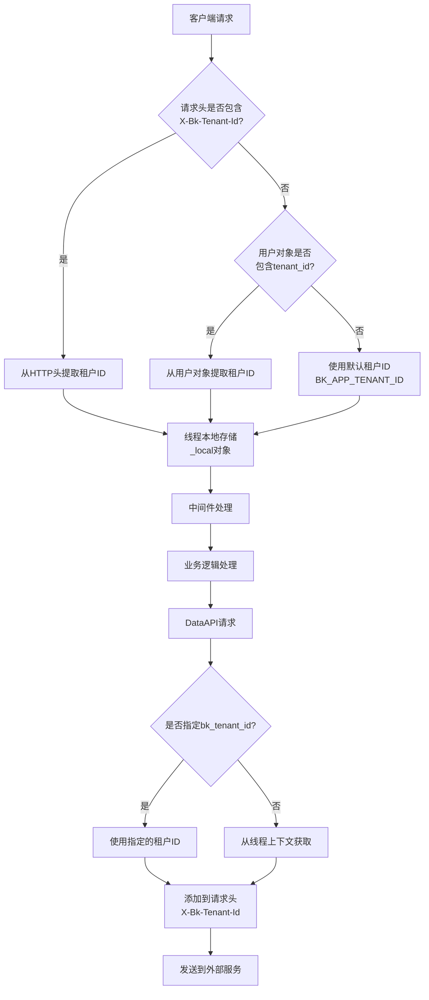
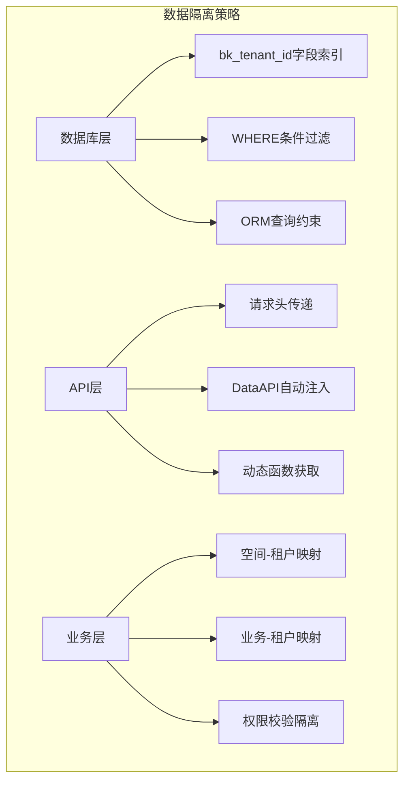
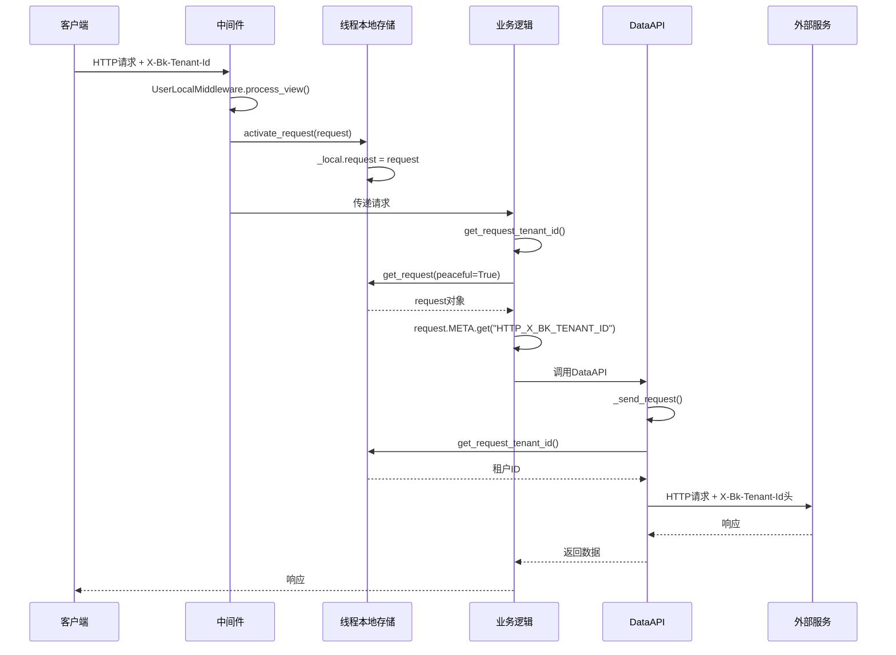
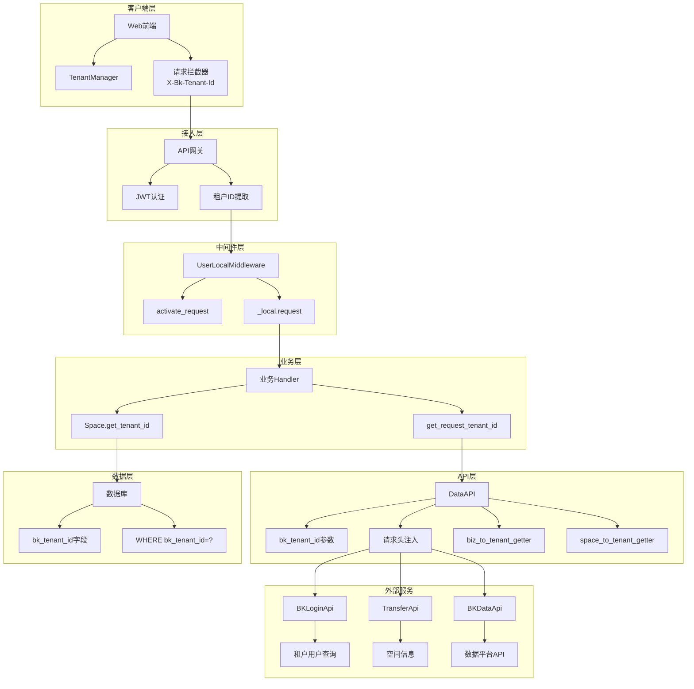

# BKLOG 多租户架构技术文档

## 1. 概述

BKLOG 日志平台实现了完整的多租户架构，通过 `bk_tenant_id` 实现租户隔离，支持在同一套系统中为多个租户提供独立的日志服务。本文档详细分析多租户ID的获取、传递和管理机制。

## 2. 配置开关

多租户模式通过环境变量控制开关，相关配置位于 `config/default.py`：

```python
# 文件: config/default.py
# 行号: 1291-1303

# 是否启用多租户模式
ENABLE_MULTI_TENANT_MODE = os.getenv("ENABLE_MULTI_TENANT_MODE", "false").lower() == "true"
# 是否启用全局租户（blueapps依赖）
IS_GLOBAL_TENANT = True
# 为了统一多租户和非多租户场景的逻辑，默认使用system租户
BK_APP_TENANT_ID = "system"
ALL_TENANT_SET_ID = 1
# 已经初始化的租户列表
INITIALIZED_TENANT_LIST = [BK_APP_TENANT_ID]
# 兼容非多租户模式
APIGW_ENABLED = not (ENABLE_MULTI_TENANT_MODE or "test" in sys.argv)
USE_APIGW = os.getenv("BKAPP_USE_APIGW", "false").lower() == "true"
```

**关键配置说明：**

| 配置项 | 说明 | 默认值 |
|--------|------|--------|
| `ENABLE_MULTI_TENANT_MODE` | 多租户模式开关 | `false` |
| `BK_APP_TENANT_ID` | 默认租户ID | `system` |
| `IS_GLOBAL_TENANT` | 全局租户标识 | `True` |
| `APIGW_ENABLED` | API网关启用状态 | 根据多租户模式动态计算 |

## 3. 租户ID获取机制

### 3.1 核心获取函数

租户ID的获取通过 `apps/utils/local.py` 中的 `get_request_tenant_id` 函数实现：

```python
# 文件: apps/utils/local.py
# 行号: 174-184

def get_request_tenant_id():
    """
    获取请求中的租户ID
    """
    if settings.ENABLE_MULTI_TENANT_MODE:
        request = get_request(peaceful=True)
        if request and request.META.get("HTTP_X_BK_TENANT_ID", ""):
            return request.META.get("HTTP_X_BK_TENANT_ID", "")
        if request and hasattr(request.user, "tenant_id"):
            return request.user.tenant_id
    return settings.BK_APP_TENANT_ID
```

**获取优先级：**

1. HTTP请求头 `X-Bk-Tenant-Id` (`HTTP_X_BK_TENANT_ID`)
2. 用户对象的 `tenant_id` 属性
3. 系统默认租户ID `BK_APP_TENANT_ID`

### 3.2 租户上下文传递流程



## 4. 线程本地存储机制

### 4.1 Local对象实现

系统使用 Python 的 `threading.local` 实现线程级别的上下文隔离：

```python
# 文件: apps/utils/local.py
# 行号: 30-36

from threading import local

_local = local()


def activate_request(request, request_id=None):
    """
    激活request线程变量
    """
    if not request_id:
        request_id = str(uuid.uuid4())
    request.request_id = request_id
    _local.request = request
    return request
```

### 4.2 线程变量操作函数

```python
# 文件: apps/utils/local.py
# 行号: 128-147

def set_local_param(key, value):
    """
    设置自定义线程变量
    """
    setattr(_local, key, value)


def del_local_param(key):
    """
    删除自定义线程变量
    """
    if hasattr(_local, key):
        delattr(_local, key)


def get_local_param(key, default=None):
    """
    获取线程变量
    """
    return getattr(_local, key, default)
```

## 5. API层面的租户传递

### 5.1 DataAPI构造函数支持

`DataAPI` 类在构造时支持指定租户ID，可以是静态值或动态函数：

```python
# 文件: apps/api/base.py
# 行号: 200-223

def __init__(
    self,
    method,
    url,
    module,
    description="",
    default_return_value=None,
    before_request=None,
    after_request=None,
    max_response_record=5000,
    max_query_params_record=5000,
    method_override=None,
    url_keys=None,
    header_keys=None,
    after_serializer=None,
    cache_time=0,
    default_timeout=60,
    data_api_retry_cls=None,
    use_superuser=False,
    no_query_params=False,
    pagination_style=PaginationStyle.LIMIT_OFFSET.value,
    bk_tenant_id: str | Callable[[dict], str] = "",  # 租户ID参数
):
    ...
    self.bk_tenant_id = bk_tenant_id
```

### 5.2 请求发送时的租户ID处理

```python
# 文件: apps/api/base.py
# 行号: 541-554

# 多租户模式下添加租户ID
# 如果请求时没有指定租户ID，则看接口定义时是否有租户ID
# 如果请求时和接口定义时都没有给租户ID，则通过请求用户态获取租户ID
if not bk_tenant_id:
    if self.bk_tenant_id:
        if callable(self.bk_tenant_id):
            # 如果传递的 bk_tenant_id 是个函数，将调用该函数
            bk_tenant_id = self.bk_tenant_id(params)
        else:
            bk_tenant_id = self.bk_tenant_id
    else:
        bk_tenant_id = get_request_tenant_id()
session.headers.update({"X-Bk-Tenant-Id": bk_tenant_id})
```

### 5.3 租户ID获取函数工厂

系统提供了两个工厂函数，用于从业务/空间信息动态获取租户ID：

```python
# 文件: apps/api/modules/utils.py
# 行号: 360-406

def biz_to_tenant_getter(key: Callable[[dict], str] | str = "bk_biz_id") -> Callable[[dict], str]:
    """
    通过业务获取租户ID
    :param key: 获取业务 ID 的函数，例如 lambda p: p["bk_biz_id"]
    :return: 获取租户 ID 的函数
    """
    from apps.log_search.models import Space

    def tenant_getter(params):
        if callable(key):
            bk_biz_id = key(params)
        else:
            if key not in params:
                raise ValueError(f"failed to get tenant id from params, key `{key}` not found")
            bk_biz_id = params[key]
        return Space.get_tenant_id(bk_biz_id=bk_biz_id)

    return tenant_getter


def space_to_tenant_getter(key: Callable[[dict], str] | str = "space_uid") -> Callable[[dict], str]:
    """
    通过空间获取租户ID
    :param key: 获取空间 UID 的函数
    :return: 获取租户 ID 的函数
    """
    from apps.log_search.models import Space

    def tenant_getter(params):
        if callable(key):
            space_uid = key(params)
        else:
            if key not in params:
                raise ValueError(f"failed to get tenant id from params, key `{key}` not found")
            space_uid = params[key]
        return Space.get_tenant_id(space_uid=space_uid)

    return tenant_getter
```

## 6. 数据模型层的租户隔离

### 6.1 Space模型的租户字段

```python
# 文件: apps/log_search/models.py
# 行号: 1288-1384

class Space(SoftDeleteModel):
    """
    空间信息
    """
    id = models.AutoField(_("空间自增ID"), primary_key=True)
    space_uid = models.CharField(_("空间唯一标识"), max_length=256, db_index=True)
    bk_biz_id = models.IntegerField(_("业务ID"), unique=True)
    space_type_id = models.CharField(_("空间类型英文名称"), max_length=64)
    space_type_name = models.CharField(_("空间类型中文名称"), max_length=64)
    space_id = models.CharField(_("空间 ID"), max_length=128)
    space_name = models.CharField(_("空间中文名称"), max_length=128)
    space_code = models.CharField(_("空间英文名称"), max_length=64, blank=True, null=True)
    properties = models.JSONField(_("额外属性"), default=dict)

    # 租户ID字段，带索引
    bk_tenant_id = models.CharField("租户ID", max_length=64,
                                     default=settings.BK_APP_TENANT_ID, db_index=True)

    @classmethod
    def get_tenant_id(cls, space_uid: str = "", bk_biz_id: int = 0) -> str:
        """
        获取空间的租户ID
        """
        default_tenant_id = get_request_tenant_id()

        if space_uid:
            space = cls.objects.filter(space_uid=space_uid).first()
            if not space:
                return default_tenant_id
            return space.bk_tenant_id

        if bk_biz_id:
            space = cls.objects.filter(bk_biz_id=bk_biz_id).first()
            if not space:
                return default_tenant_id
            return space.bk_tenant_id

        return default_tenant_id

    @classmethod
    def get_all_spaces(cls, bk_tenant_id, space_uid: str = None):
        """按租户ID查询空间"""
        with connection.cursor() as cursor:
            if space_uid:
                cursor.execute(
                    """SELECT ... FROM log_search_space
                       WHERE bk_tenant_id = %s AND space_uid = %s""",
                    (bk_tenant_id, space_uid),
                )
            else:
                cursor.execute(
                    """SELECT ... FROM log_search_space
                       WHERE bk_tenant_id = %s""",
                    (bk_tenant_id,),
                )
            ...
```

### 6.2 SpaceDefine数据类

```python
# 文件: bkm_space/define.py
# 行号: 20-52

@dataclass
class Space:
    """
    空间格式
    """
    to_dict = asdict

    id: int
    space_type_id: str
    space_id: str
    space_name: str
    status: str
    space_code: Union[None, str]
    space_uid: str
    type_name: Union[None, str]
    bk_biz_id: int
    extend: dict

    # 默认租户ID
    bk_tenant_id: str = settings.BK_APP_TENANT_ID

    @classmethod
    def from_dict(cls, data):
        init_fields = {f.name for f in fields(cls) if f.init}
        filtered_data = {k: data.pop(k, None) for k in init_fields}
        if filtered_data["space_type_id"] == SpaceTypeEnum.BKCC.value:
            filtered_data["bk_biz_id"] = int(filtered_data["space_id"])
        else:
            filtered_data["bk_biz_id"] = -int(filtered_data["id"])
        instance = cls(**filtered_data)
        setattr(instance, "extend", data)
        return instance
```

## 7. 后台任务(Celery)的租户处理

### 7.1 后台用户获取

在Celery任务执行时，需要正确获取租户ID来构建用户信息：

```python
# 文件: apps/utils/local.py
# 行号: 187-215

def get_admin_username(bk_tenant_id: str) -> str | None:
    if not settings.ENABLE_MULTI_TENANT_MODE:
        return getattr(settings, "COMMON_USERNAME", None)

    result = BKLoginApi.batch_lookup_virtual_user(
        {"bk_tenant_id": bk_tenant_id, "lookup_field": "login_name",
         "lookups": "bk_admin", "bk_username": "admin"},
        bk_tenant_id=bk_tenant_id,
    )
    if result:
        return result[0].get("bk_username")
    else:
        raise BaseException("get_admin_username: 获取管理员用户失败")


def get_backend_username(peaceful=True, bk_tenant_id: str = "") -> str | None:
    """从配置中获取用户信息"""

    if settings.ENABLE_MULTI_TENANT_MODE:
        if not bk_tenant_id:
            bk_tenant_id = get_request_tenant_id()

        if not bk_tenant_id:
            if not peaceful:
                raise BaseException("get_backend_username: 获取租户ID失败")
            return None

        return get_admin_username(bk_tenant_id)
    else:
        return "admin"
```

### 7.2 ESB请求前的租户信息注入

```python
# 文件: apps/api/modules/utils.py
# 行号: 138-171

if (
    "celery" in sys.argv
    or "worker" in sys.argv
    or "shell" in sys.argv
    ...
):
    def add_esb_info_before_request(params):
        if "bk_username" not in params:
            params["bk_username"] = get_backend_username(bk_tenant_id=params.get("bk_tenant_id"))

        if "operator" not in params:
            params["operator"] = params["bk_username"]
        return params
```

## 8. 前端租户管理

### 8.1 TenantManager类实现

前端通过 `TenantManager` 类管理租户ID和用户信息：

```typescript
// 文件: web/src/views/retrieve-core/tenant-manager.ts
// 行号: 50-100

export class TenantManager extends EventEmitter<TenantManagerEvent> {
  private tenantId: string | null | undefined;
  private userCache: Map<string, UserDisplayInfo> = new Map();
  private requestQueue: Set<string> = new Set();
  private pendingRequests: Set<string> = new Set();
  private readonly API_BASE_URL = join(
    process.env.NODE_ENV === 'development'
      ? '/api/bk-user-web/prod'
      : window.BK_LOGIN_URL,
    '/api/v3/open-web/tenant/users',
  );

  constructor(tenantId?: string | null) {
    super();
    this.tenantId = tenantId;
  }

  setTenantId(tenantId: string | null | undefined) {
    this.tenantId = tenantId;
  }

  getTenantId(): string | null | undefined {
    return this.tenantId;
  }

  private isMultiTenant(): boolean {
    return !!this.tenantId && this.tenantId.trim() !== '';
  }
```

### 8.2 批量请求时的租户ID传递

```typescript
// 文件: web/src/views/retrieve-core/tenant-manager.ts
// 行号: 389-414

private async executeBatchRequest(tenantIds: string[]): Promise<void> {
    const queryParam = tenantIds.join(',');
    const url = `${this.API_BASE_URL}/-/display_info/?bk_usernames=${queryParam}`;

    // 租户ID添加到请求头
    const headers: Record<string, string> = {
      'x-bk-tenant-id': this.tenantId!,
    };

    try {
      const response = await requestJson<{ data: UserDisplayInfo[] }>({
        url,
        method: 'GET',
        headers,
      });
      ...
    }
}
```

### 8.3 HTTP请求拦截器

```typescript
// 文件: web/src/request/index.ts
// 行号: 52-108

const buildRequestConfig = (
  url: string,
  params?: any,
  method: 'POST' | 'GET' | 'PUT' = 'POST',
  appendHeaders?: Record<string, string>,
  signal?: AbortSignal,
) => {
  const headers: Record<string, string> = {
    'X-Requested-With': 'XMLHttpRequest',
    'Content-Type': 'application/json',
  };

  // 从store中获取租户ID并添加到请求头
  if (store.state.userMeta?.bk_tenant_id) {
    headers['X-Bk-Tenant-Id'] = store.state.userMeta?.bk_tenant_id;
  }

  // CSRF Token
  const csrfToken = getCookie(xsrfCookieName);
  if (csrfToken) {
    headers[xsrfHeaderName] = csrfToken;
  }

  // 外部版后端需要读取header里的 spaceUid
  if (window.IS_EXTERNAL && JSON.parse(window.IS_EXTERNAL as string)
      && store.state.spaceUid) {
    headers['X-Bk-Space-Uid'] = store.state.spaceUid;
  }
  ...
};
```

## 9. 数据隔离策略

### 9.1 数据库层隔离



### 9.2 数据库查询隔离示例

```python
# 文件: apps/log_search/models.py
# 行号: 1314-1355

@classmethod
def get_all_spaces(cls, bk_tenant_id, space_uid: str = None):
    """按租户ID隔离查询空间"""
    with connection.cursor() as cursor:
        if space_uid:
            cursor.execute(
                """SELECT ... FROM log_search_space
                   WHERE bk_tenant_id = %s AND space_uid = %s""",
                (bk_tenant_id, space_uid),
            )
        else:
            cursor.execute(
                """SELECT ... FROM log_search_space
                   WHERE bk_tenant_id = %s""",
                (bk_tenant_id,),
            )
        columns = [col[0] for col in cursor.description]
        spaces = [dict(zip(columns, row)) for row in cursor.fetchall()]
    return spaces

@classmethod
def get_space_uid_list(cls, tenant_id: str) -> list:
    """获取租户的所有空间ID"""
    return cls.objects.filter(bk_tenant_id=tenant_id).values_list("space_uid", flat=True)
```

## 10. 跨模块租户上下文管理

### 10.1 中间件层处理



### 10.2 并发请求的租户上下文传递

```python
# 文件: apps/api/base.py
# 行号: 743-769

def thread_activate_request(
    self,
    params=None,
    files=None,
    raw=False,
    timeout=None,
    raise_exception=True,
    request_cookies=True,
    request=None,
    context=None,
    bk_tenant_id="",
):
    """
    处理并发请求无法activate_request的封装
    """
    if request:
        activate_request(request)  # 在新线程中激活请求上下文
    attach(context)  # OpenTelemetry上下文传递
    return self.__call__(
        params=params,
        files=files,
        raw=raw,
        timeout=timeout,
        raise_exception=raise_exception,
        request_cookies=request_cookies,
        bk_tenant_id=bk_tenant_id,  # 显式传递租户ID
    )
```

## 11. 全局用户信息构建

```python
# 文件: apps/utils/local.py
# 行号: 218-242

def get_global_user(peaceful=True, bk_tenant_id: str = ""):
    # 用户信息获取顺序：
    # 1.1 用户访问的request对象中的用户凭证
    # 1.2 local获取用户名
    # 1.3 系统配置的后台用户

    username = (
        get_request_username()
        or get_local_username()
        or get_backend_username(peaceful=peaceful, bk_tenant_id=bk_tenant_id)
    )

    if username:
        return username

    if not peaceful:
        raise BaseException("get_global_user: 获取全局用户失败")


def make_userinfo(bk_tenant_id: str = settings.BK_APP_TENANT_ID):
    username = get_global_user(bk_tenant_id=bk_tenant_id)
    if username:
        return {"bk_username": username}

    raise BaseException("make_userinfo: 获取用户信息失败")
```

## 12. 架构总览



## 13. 最佳实践建议

1. **API定义时指定租户获取方式**
   - 使用 `biz_to_tenant_getter()` 或 `space_to_tenant_getter()` 工厂函数
   - 避免在调用时手动传递租户ID

2. **数据库查询始终包含租户过滤**
   - 所有涉及租户数据的查询必须添加 `bk_tenant_id` 条件
   - 使用 `db_index=True` 确保查询性能

3. **后台任务显式传递租户ID**
   - Celery任务调用API时传递 `bk_tenant_id` 参数
   - 使用 `get_backend_username(bk_tenant_id=xxx)` 获取正确的用户

4. **前端统一使用TenantManager**
   - 使用Vuex store存储 `bk_tenant_id`
   - 所有HTTP请求自动注入租户头

---

**文档版本**: v1.0
**生成日期**: 2026-04-30
**源码路径**: `apps/utils/local.py`, `apps/api/base.py`, `apps/log_search/models.py`