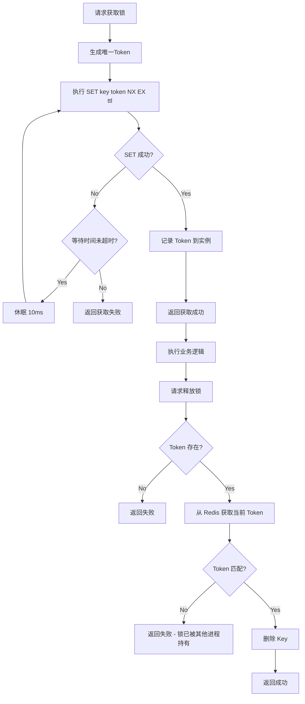
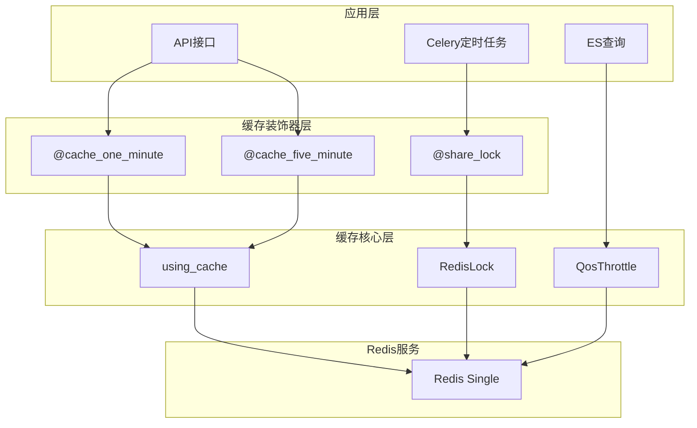

# BKLOG Redis 缓存机制技术文档

## 1. 概述

BKLOG 项目通过 Redis 实现了高效的缓存机制和分布式锁功能，主要用于：
- 数据查询结果缓存
- API 响应缓存
- Celery 定时任务防重复执行
- ES 查询 QoS 流量控制

## 2. Redis 连接配置

```python
# config/default.py 行号: 1041-1066
USE_REDIS = os.getenv("BKAPP_USE_REDIS", "on") == "on"
REDIS_HOST = os.getenv("BKAPP_REDIS_HOST", "127.0.0.1")
REDIS_PORT = int(os.getenv("BKAPP_REDIS_PORT", 6379))
REDIS_PASSWD = os.getenv("BKAPP_REDIS_PASSWORD", "")

# Cache 配置
CACHES = {
    "redis": {
        "BACKEND": "django_prometheus.cache.backends.redis.RedisCache",
        "LOCATION": f"redis://{REDIS_HOST}:{REDIS_PORT}/0",
        "OPTIONS": {"CLIENT_CLASS": "django_redis.client.DefaultClient", "PASSWORD": REDIS_PASSWD},
        "KEY_PREFIX": APP_CODE,
    },
}
```

## 3. 缓存装饰器实现

### 3.1 核心装饰器 `using_cache`

```python
# apps/utils/cache.py 行号: 36-81
def using_cache(key: str, duration, need_md5=False, compress=False):
    """
    :param key: key 名可以使用format进行格式
    :param duration: 缓存过期时间（秒）
    :param need_md5: 缓冲是redis的时候 key不能带有空格等字符，需要用md5 hash一下
    :param compress: 是否压缩缓存内容
    """
    def decorator(func):
        @functools.wraps(func)
        def inner(*args, **kwargs):
            refresh = kwargs.get("refresh", False)
            kwargs.pop("refresh", None)

            actual_key = key.format(*args, **kwargs)
            if need_md5:
                actual_key = md5_sum(actual_key)

            cache_result = cache.get(actual_key)

            if cache_result and not refresh:
                if compress:
                    cache_result = zlib.decompress(cache_result)
                return json.loads(cache_result)

            result = func(*args, **kwargs)
            if result:
                value = json.dumps(result, cls=DjangoJSONEncoder)
                if compress and len(value) > MIN_LEN:
                    value = zlib.compress(value.encode("utf-8"))
                cache.set(actual_key, value, duration)
            return result
        return inner
    return decorator
```

### 3.2 预定义缓存时间装饰器

```python
# apps/utils/cache.py 行号: 139-148
cache_half_minute = functools.partial(using_cache, duration=30)
cache_one_minute = functools.partial(using_cache, duration=60)
cache_five_minute = functools.partial(using_cache, duration=300)
cache_ten_minute = functools.partial(using_cache, duration=600)
cache_one_hour = functools.partial(using_cache, duration=3600)
cache_one_day = functools.partial(using_cache, duration=86400)
```

## 4. 分布式锁实现（SET NX）

### 4.1 RedisLock 类实现

```python
# apps/utils/lock.py 行号: 52-77
class RedisLock(BaseLock):
    __token = None

    def __init__(self, name, ttl=None):
        super(RedisLock, self).__init__(name, ttl)
        self.client = cache

    def acquire(self, _wait=0.001):
        token = uniqid()
        wait_until = time.time() + _wait
        # 核心：使用 SET NX 实现分布式锁
        while not self.client.set(self.name, token, timeout=self.ttl, nx=True):
            if time.time() < wait_until:
                time.sleep(0.01)
            else:
                return False
        self.__token = token
        return True

    def release(self):
        # 释放锁时验证 token，防止误删其他进程的锁
        if not self.__token:
            return False
        token = self.client.get(self.name)
        if not token or token != self.__token:
            return False
        return self.client.delete(self.name)
```

### 4.2 分布式锁流程图



### 4.3 share_lock 装饰器

```python
# apps/utils/lock.py 行号: 98-133
def share_lock(ttl=600, identify=None):
    """
    装饰定时任务时需要放在periodic_task下面
    @param ttl: 锁过期时间，默认600秒
    @param identify: 锁标识，用于区分不同模块的同名函数
    """
    def wrapper(func):
        @functools.wraps(func)
        def _inner(*args, **kwargs):
            if not settings.USE_REDIS:
                return func(*args, **kwargs)
            token = str(time.time())
            cache_key = "celery_%s" % func.__name__ if identify is None else identify
            lock_success = cache.set(cache_key, token, timeout=ttl, nx=True)
            if not lock_success:
                return  # 获取锁失败，静默退出
            try:
                return func(*args, **kwargs)
            finally:
                if cache.get(cache_key) == token:
                    cache.delete(cache_key)
        return _inner
    return wrapper
```

## 5. 缓存过期策略

### 5.1 分级缓存时间设计

| 装饰器 | 过期时间 | 适用场景 |
|--------|----------|----------|
| `cache_half_minute` | 30秒 | 高频变化数据 |
| `cache_one_minute` | 60秒 | 实时性要求较高的数据 |
| `cache_five_minute` | 300秒 | 常用查询结果 |
| `cache_ten_minute` | 600秒 | 中频变化数据 |
| `cache_one_hour` | 3600秒 | 低频变化配置 |
| `cache_one_day` | 86400秒 | 静态数据缓存 |

## 6. 缓存穿透/击穿防护

### 6.1 缓存穿透防护

```python
# apps/utils/cache.py 行号: 70-76
result = func(*args, **kwargs)
if result:  # 仅缓存非空结果
    value = json.dumps(result, cls=DjangoJSONEncoder)
    cache.set(actual_key, value, duration)
return result  # 空结果不缓存，直接返回
```

**防护策略**：空结果不写入缓存，避免大量无效请求持续穿透到数据库。

### 6.2 QoS 限流机制

```python
# apps/log_esquery/qos.py 行号: 118-144
class QosThrottle(throttling.BaseThrottle):
    def allow_request(self, request, view):
        self.limit_key = build_qos_limit_key(request)

        # 如果已经被限制 直接禁止
        if cache.has_key(self.limit_key):
            return False

        # 检查超时次数
        count = get_window_count(request)
        if count >= settings.BKLOG_QOS_LIMIT:
            # SET NX 设置禁止标记
            if cache.set(self.limit_key, "1", timeout=qos_limit_time, nx=True):
                clear_redis_zset(request)
            return False
        return True
```

## 7. 整体架构图



## 8. 最佳实践建议

### 8.1 缓存 Key 设计原则

1. 使用有意义的 Key 前缀（如 `data_id_conf_`）
2. 对于复杂参数组合的 Key，启用 `need_md5=True`
3. Key 应包含业务关键标识

### 8.2 分布式锁使用注意

1. `share_lock` 必须放在 `periodic_task` 装饰器下方
2. TTL 设置应大于任务执行时间
3. 锁释放时务必验证 Token

---

**文档版本**: v1.0
**生成日期**: 2026-04-30
**源码路径**: `apps/utils/cache.py`, `apps/utils/lock.py`