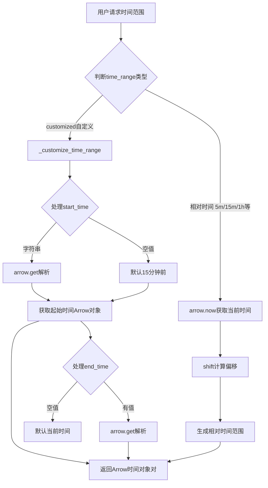

# BKLOG 时间处理工具技术文档

> 聚焦：apps/utils/time_handler.py
> 时间转换、时间范围生成、时区处理核心实现

## 1. 概述

BKLOG 时间处理工具模块提供了完整的时间转换、时间范围生成、时区处理等功能。该模块是日志平台核心基础设施，支撑日志检索、聚合分析、数据导出等场景的时间处理需求。

---

## 2. 核心常量定义

**文件位置**: `apps/utils/time_handler.py` (第35-47行)

```python
# 默认时间戳乘数
DEFAULT_MULTIPLICATOR = 1
# dtEventTimeStamp时间戳乘数
DTEVENTTIMESTAMP_MULTIPLICATOR = 1000
# INFLUXDB时间戳乘数
INFLUXDB_MULTIPLICATOR = 1000000000

# 一周时间
WEEK_DELTA_TIME = 7 * 24 * 60 * 60
DAY = 86400
```

**时间字段类型枚举** (`apps/log_search/constants.py` 第868-891行):

```python
class TimeFieldTypeEnum(ChoicesEnum):
    """时间字段类型"""
    DATE = "date"   # ES date类型
    LONG = "long"   # ES long类型（数值时间戳）

class TimeFieldUnitEnum(ChoicesEnum):
    """时间字段单位"""
    SECOND = "second"           # 秒
    MILLISECOND = "millisecond" # 毫秒
    MICROSECOND = "microsecond" # 微秒

# 时间单位倍数映射关系
TIME_FIELD_MULTIPLE_MAPPING = {
    TimeFieldUnitEnum.SECOND.value: 1000,
    TimeFieldUnitEnum.MILLISECOND.value: 1,
    TimeFieldUnitEnum.MICROSECOND.value: 1 / 1000,
}
```

---

## 3. 时间戳转换函数

### 3.1 `timeformat_to_timestamp` - 时间格式转时间戳

**位置**: 第50-66行

```python
def timeformat_to_timestamp(timeformat, time_multiplicator=DEFAULT_MULTIPLICATOR):
    """
    时间格式 -> 时间戳
    :param timeformat: 时间字符串或datetime对象
    :param time_multiplicator: 时间倍数
    :return: 时间戳（整型）
    """
    if not timeformat:
        return None
    if type(timeformat) in [str]:
        # 时间字符串转时间戳
        timestamp = int(time.mktime(time.strptime(timeformat, "%Y-%m-%d %H:%M:%S")))
    else:
        # datetime 转时间戳
        timestamp = int(timeformat.strftime("%s"))
    return int(timestamp * time_multiplicator)
```

### 3.2 `timestamp_to_timeformat` - 时间戳转时间格式

**位置**: 第69-77行

```python
def timestamp_to_timeformat(
    timestamp, time_multiplicator=DEFAULT_MULTIPLICATOR, t_format="%Y-%m-%d %H:%M:%S", tzformat=True
):
    timestamp = int(timestamp / time_multiplicator)
    timestamp = time.localtime(timestamp)
    timeformat = time.strftime(t_format, timestamp)
    if not tzformat:
        return timeformat
    return api_time_local(timeformat, get_dataapi_tz())
```

---

## 4. 时间范围生成函数

### 4.1 `generate_time_range` - 核心时间范围生成

**位置**: 第334-366行

```python
def generate_time_range(time_range, start_time, end_time, local_time_zone):
    """
    生成起止时间
    """
    if time_range == "customized":
        _start_time, _end_time = _customize_time_range(start_time, end_time, local_time_zone)
    elif time_range == "5m":
        _start_time = arrow.now(local_time_zone).shift(minutes=-5)
        _end_time = arrow.now(local_time_zone)
    elif time_range == "1h":
        _start_time = arrow.now(local_time_zone).shift(hours=-1)
        _end_time = arrow.now(local_time_zone)
    elif time_range == "1d":
        _start_time = arrow.now(local_time_zone).shift(days=-1)
        _end_time = arrow.now(local_time_zone)
    # ... 更多时间范围类型
    return _start_time, _end_time
```

**支持的时间范围类型**:

| 类型标识 | 时间范围 | 说明 |
|---------|---------|------|
| `customized` | 自定义 | 用户指定起止时间 |
| `5m` | 最近5分钟 | 相对时间 |
| `15m` | 最近15分钟 | 相对时间 |
| `30m` | 最近30分钟 | 相对时间 |
| `1h` | 最近1小时 | 相对时间 |
| `4h` | 最近4小时 | 相对时间 |
| `12h` | 最近12小时 | 相对时间 |
| `1d` | 最近1天 | 相对时间 |

---

## 5. 时区处理逻辑

### 5.1 时区配置

```python
TIME_ZONE = "Asia/Shanghai"          # 系统默认时区
TRANSFER_TIME_ZONE = "GMT"           # 传输时区
DATAAPI_TIME_ZONE = "Etc/GMT-8"      # 数据API时区
```

### 5.2 `api_time_local` - 时区转换

**位置**: 第188-197行

```python
def api_time_local(s_time, from_zone=settings.DATAAPI_TIME_ZONE, fmt="%Y-%m-%d %H:%M:%S"):
    """
    将时间字符串根据源时区转为用户时区
    """
    if s_time is None:
        return None
    s_time = datetime.datetime.strptime(s_time, fmt)
    local = pytz.timezone(from_zone)
    s_time = local.localize(s_time)
    return strftime_local(s_time)
```

---

## 6. 聚合分析时间处理

### 6.1 默认聚合间隔计算

**位置**: `apps/log_search/handlers/search/aggs_handlers.py` 第246-255行

```python
@staticmethod
def _init_default_interval(start_time: datetime, end_time: datetime):
    hour_interval = int((end_time - start_time).total_seconds() / 3600)
    if hour_interval <= 1:
        return "1m"
    elif hour_interval <= 6:
        return "5m"
    elif hour_interval <= 72:
        return "1h"
    else:
        return "1d"
```

---

## 7. 流程图

### 7.1 时间范围生成流程



---

## 8. 使用场景

### 8.1 日志检索时间处理

```python
# SearchHandler初始化
self.time_zone: str = search_dict.get("time_zone") or get_local_param("time_zone", settings.TIME_ZONE)
self.start_time, self.end_time = generate_time_range(
    time_range, start_time, end_time, self.time_zone
)
```

### 8.2 聚合分析时间处理

```python
# AggsHandlers.date_histogram
time_zone = get_local_param("time_zone", settings.TIME_ZONE)
start_time, end_time = generate_time_range(
    query_data.get("time_range"),
    query_data.get("start_time"),
    query_data.get("end_time"),
    time_zone
)
```

---

## 9. 设计要点总结

| 设计要点 | 实现方式 |
|---------|---------|
| **多精度时间戳** | `time_multiplicator` 参数支持秒/毫秒/纳秒 |
| **时区感知处理** | 所有转换自动考虑时区因素 |
| **灵活时间范围** | 相对时间 + 绝对时间两种模式 |
| **智能聚合间隔** | 根据时间范围自动计算合适间隔 |
| **ES兼容性** | `date` 和 `long` 类型分别处理 |

---

**文档版本**: v1.0
**生成日期**: 2026-04-30
**源码路径**: `apps/utils/time_handler.py`