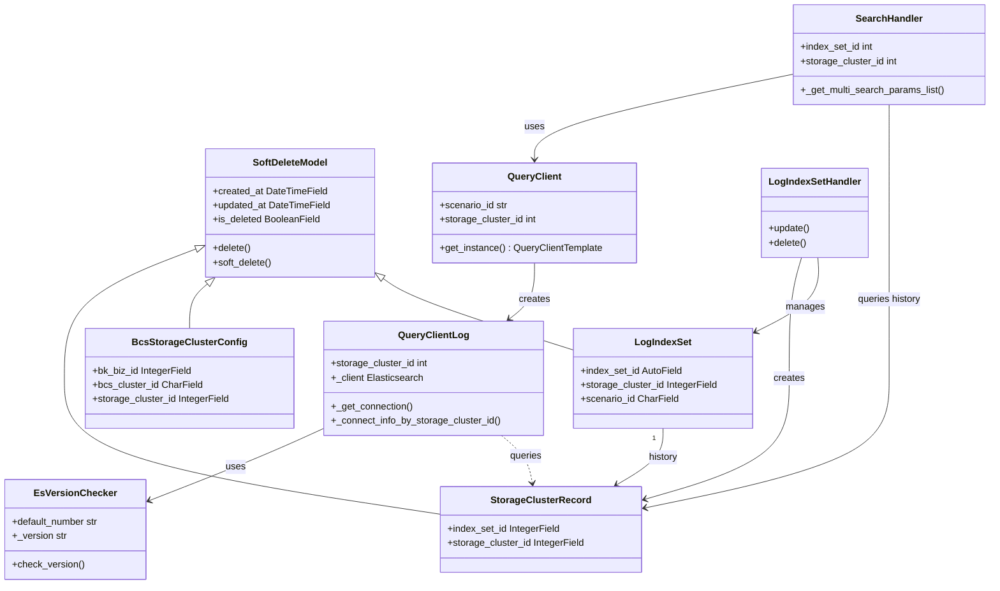
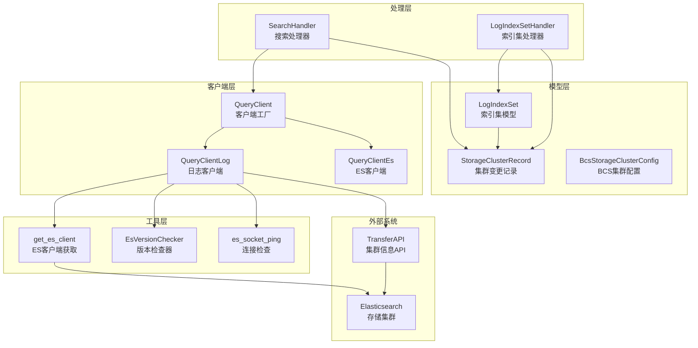
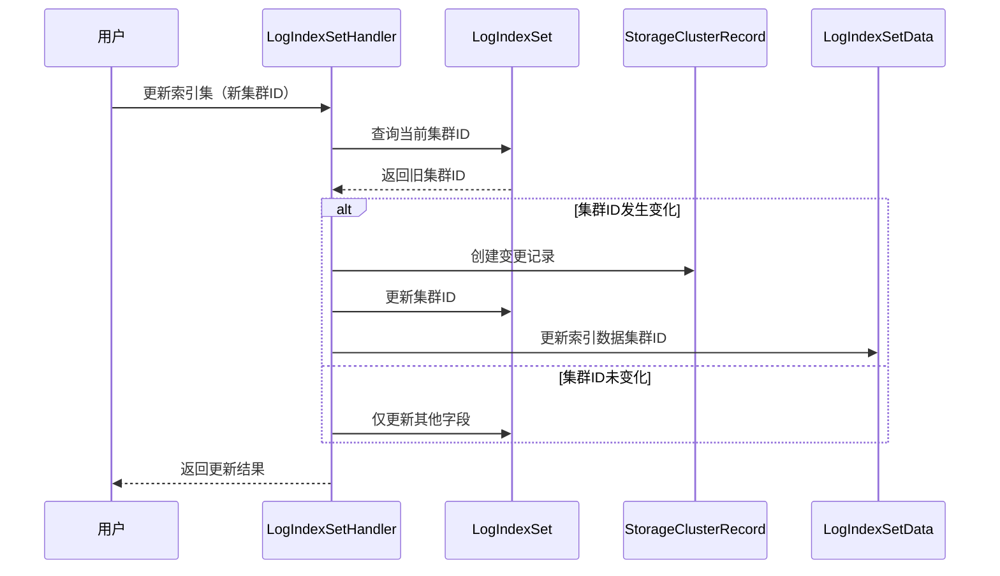
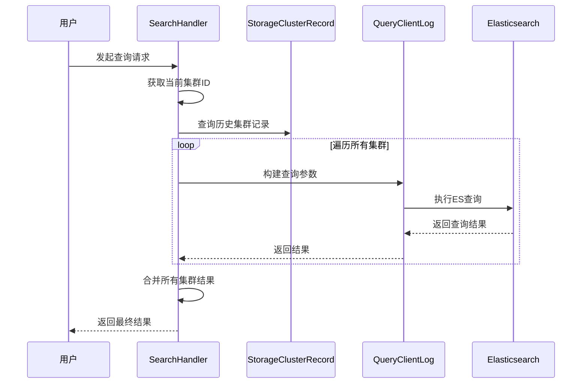

# BKLOG 存储集群管理技术文档

## 一、概述

BKLOG 的存储集群管理模块负责管理 Elasticsearch 存储集群的连接、版本兼容和集群切换等核心功能。该模块支持多种接入场景（采集接入、数据平台、第三方ES），并提供灵活的集群切换机制。

---

## 二、核心模型定义

### 2.1 StorageClusterRecord - 存储集群变更记录模型

**文件位置**: `apps/log_search/models.py` (第 1562-1569 行)

```python
class StorageClusterRecord(SoftDeleteModel):
    """
    索引集存储集群变更记录
    - 用于记录索引集的存储集群变更历史
    - 支持集群切换时的历史追溯
    """
    index_set_id = models.IntegerField(_("索引集ID"), db_index=True)
    storage_cluster_id = models.IntegerField(_("集群ID"))

    class Meta:
        verbose_name = _("索引集存储集群记录")
        verbose_name_plural = _("索引集存储集群记录")
        ordering = ("-updated_at",)
```

**字段说明**:
| 字段名 | 类型 | 说明 |
|-------|------|------|
| `index_set_id` | IntegerField | 索引集ID，建立索引 |
| `storage_cluster_id` | IntegerField | 存储集群ID |
| `created_at` | DateTimeField | 继承自 SoftDeleteModel，创建时间 |
| `updated_at` | DateTimeField | 继承自 SoftDeleteModel，更新时间 |

---

### 2.2 BcsStorageClusterConfig - BCS容器存储集群配置模型

**文件位置**: `apps/log_databus/models.py` (第 444-448 行)

```python
class BcsStorageClusterConfig(SoftDeleteModel):
    """
    BCS容器场景下的存储集群配置
    - 用于关联业务、BCS集群与存储集群
    """
    bk_biz_id = models.IntegerField(_("业务id"))
    bcs_cluster_id = models.CharField(_("bcs集群ID"), max_length=128)
    storage_cluster_id = models.IntegerField(_("存储集群ID"))
```

---

### 2.3 LogIndexSet - 索引集模型（存储集群关联）

**文件位置**: `apps/log_search/models.py` (第 337-398 行)

```python
class LogIndexSet(SoftDeleteModel):
    # 存储集群ID字段
    storage_cluster_id = models.IntegerField(_("存储集群ID"), default=None, null=True, blank=True)

    # 数据源ID
    source_id = models.IntegerField(_("数据源ID"), default=None, null=True, blank=True)

    # 接入场景标识
    scenario_id = models.CharField(_("接入场景标识"), max_length=64, choices=Scenario.CHOICES)
```

---

## 三、存储集群连接实现

### 3.1 ES客户端获取 - 版本兼容处理

**文件位置**: `apps/log_esquery/utils/es_client.py` (第 40-77 行)

```python
def get_es_client(
    *,
    version: str,
    hosts: list,
    username: str,
    password: str,
    port: int,
    sniffer_timeout=600,
    verify_certs=False,
    **kwargs,
) -> Elasticsearch:
    """
    根据ES版本获取对应的客户端实例
    支持版本：5.x、6.x、7.x及以上
    """
    # 根据版本加载客户端
    if version.startswith("5."):
        es_client = Elasticsearch5
    elif version.startswith("6."):
        es_client = Elasticsearch6
    else:
        es_client = Elasticsearch

    # IPv6地址处理 - 需要添加方括号
    new_hosts = []
    for host in hosts:
        try:
            ip = ipaddress.ip_address(host)
            if isinstance(ip, ipaddress.IPv6Address):
                host = f'[{host}]'
        except ValueError:
            pass
        new_hosts.append(host)
    hosts = new_hosts

    http_auth = (username, password) if password else None
    return es_client(
        hosts, http_auth=http_auth, port=port,
        sniffer_timeout=sniffer_timeout, verify_certs=verify_certs, **kwargs
    )
```

**版本兼容策略**:
| ES版本 | 客户端类 | 特殊处理 |
|-------|---------|---------|
| 5.x | Elasticsearch5 | 不支持 track_total_hits |
| 6.x | Elasticsearch6 | 支持部分新特性 |
| 7.x+ | Elasticsearch | 完整特性支持 |

---

### 3.2 ES版本检查器

**文件位置**: `apps/log_esquery/esquery/client/version_checker.py` (第 32-62 行)

```python
class EsVersionChecker(object):
    """
    ES版本检查器
    - 通过HTTP请求获取ES集群版本信息
    - 默认版本为 7.0.0
    """
    def __init__(self, ip: str, port: str, username: str = None, password: str = None):
        self.default_number = "7.0.0"
        self._version: str = self.check_version(ip, port, username, password)

    def check_version(self, ip: str, port: str, username: str, password: str) -> str:
        url: str = "http://{}:{}".format(ip, port)
        auth: HTTPBasicAuth = HTTPBasicAuth(username=username, password=password)
        try:
            s = requests.Session()
            s.mount("http://", HTTPAdapter(max_retries=3))
            response = s.get(url, auth=auth, timeout=5)
            result = json.loads(response.content)
            if result:
                version = result.get("version")
                if version:
                    number = version.get("number")
                else:
                    number = self.default_number
            else:
                number = self.default_number
        except UnKnowEsVersionException as e:
            logger.error("wrong version checker，msg %s" % e)
            number = self.default_number
        return number

    @property
    def version(self) -> str:
        return self._version
```

---

### 3.3 存储集群连接信息获取

**文件位置**: `apps/log_esquery/esquery/client/QueryClientLog.py` (第 178-253 行)

```python
class QueryClientLog(QueryClientTemplate):
    """
    日志场景查询客户端
    - 支持通过索引名或集群ID获取连接信息
    """

    def _get_connection(self, index: str, check_ping: bool = True):
        """
        建立ES连接
        - 根据 storage_cluster_id 决定连接信息获取方式
        """
        if not self.storage_cluster_id or self.storage_cluster_id == -1:
            # 通过索引名获取连接信息
            _connect_info: tuple = self._connect_info(index=index)
        else:
            # 通过集群ID获取连接信息
            _connect_info: tuple = self._connect_info_by_storage_cluster_id(
                storage_cluster_id=self.storage_cluster_id
            )

        self.host, self.port, self.username, self.password, self.version, self.schema = _connect_info

        # Socket连接检查
        es_socket_ping(host=self.host, port=self.port)

        # 创建ES客户端实例
        self._client: Elasticsearch = get_es_client(
            version=self.version,
            hosts=[self.host],
            username=self.username,
            password=self.password,
            scheme=self.schema,
            port=self.port,
        )

    @cache_five_minute("_connect_info_{storage_cluster_id}", need_md5=True)
    def _connect_info_by_storage_cluster_id(self, storage_cluster_id: int) -> tuple:
        """
        通过集群ID获取连接信息（带缓存）
        """
        transfer_api_response: list = TransferApi.get_cluster_info(
            {"cluster_id": storage_cluster_id}
        )
        cluster_config: dict = transfer_api_response[0].get("cluster_config")
        return self._get_cluster_config(
            cluster_config=cluster_config,
            auth_info=transfer_api_response[0].get("auth_info")
        )
```

---

## 四、集群切换机制

### 4.1 索引集存储集群切换

**文件位置**: `apps/log_search/handlers/index_set.py` (第 2041-2088 行)

```python
class LogIndexSetHandler(BaseIndexSetHandler):
    """
    索引集处理器 - 采集接入场景
    """

    def update(self):
        """
        更新索引集，包含存储集群切换逻辑
        """
        # 判断是否发生集群变更
        if self.index_set_obj.storage_cluster_id == self.storage_cluster_id:
            old_storage_cluster_id = None
        else:
            old_storage_cluster_id = self.index_set_obj.storage_cluster_id

        # 更新索引集的存储集群ID
        self.index_set_obj.storage_cluster_id = self.storage_cluster_id
        self.index_set_obj.save()

        if old_storage_cluster_id:
            # 保存旧的存储集群记录（用于历史追溯和兼容查询）
            StorageClusterRecord.objects.create(
                index_set_id=self.index_set_obj.index_set_id,
                storage_cluster_id=old_storage_cluster_id
            )

        # 更新现有索引的存储集群ID
        for index in to_update_indexes:
            _storage_cluster_id = index.get("storage_cluster_id") or (
                self.storage_cluster_id if old_storage_cluster_id else None
            )
            if _storage_cluster_id:
                LogIndexSetData.objects.filter(
                    result_table_id=index["result_table_id"]
                ).update(storage_cluster_id=_storage_cluster_id)
```

---

### 4.2 多集群查询兼容

**文件位置**: `apps/log_search/handlers/search/search_handlers_esquery.py` (第 830-895 行)

```python
class SearchHandler:
    """
    搜索处理器 - 支持多存储集群的兼容查询
    """

    def _get_multi_search_params_list(self):
        """
        构建多集群查询参数列表
        - 支持历史集群记录的查询兼容
        """
        storage_cluster_record_objs = StorageClusterRecord.objects.none()

        if self.scenario_id == Scenario.LOG:
            # 获取历史存储集群记录（排除当前集群）
            storage_cluster_record_objs = StorageClusterRecord.objects.filter(
                index_set_id=self.index_set_id
            ).exclude(storage_cluster_id=self.storage_cluster_id)

        # 构建当前集群查询参数
        multi_params_list = [{
            "indices": self.indices,
            "scenario_id": self.scenario_id,
            "storage_cluster_id": self.storage_cluster_id,
        }]

        # 添加历史集群查询参数（兼容旧数据）
        storage_cluster_ids = {self.storage_cluster_id}
        for storage_cluster_record_obj in storage_cluster_record_objs:
            if storage_cluster_record_obj.storage_cluster_id not in storage_cluster_ids:
                multi_params = {
                    "indices": self.indices,
                    "scenario_id": self.scenario_id,
                    "storage_cluster_id": storage_cluster_record_obj.storage_cluster_id,
                }
                multi_params_list.append(multi_params)
                storage_cluster_ids.add(storage_cluster_record_obj.storage_cluster_id)

        return multi_params_list
```

---

## 五、查询客户端工厂模式

**文件位置**: `apps/log_esquery/esquery/client/QueryClient.py` (第 28-53 行)

```python
class QueryClient(object):
    """
    查询客户端工厂类
    - 根据场景ID创建对应的查询客户端实例
    """
    def __init__(
        self,
        scenario_id: str,
        storage_cluster_id: int = -1,
        bkdata_authentication_method: str = "",
        bkdata_data_token: str = "",
    ):
        self.scenario_id: str = scenario_id
        self.storage_cluster_id: int = storage_cluster_id

    def get_instance(self):
        """
        获取对应场景的查询客户端实例
        """
        mapping = {
            Scenario.BKDATA: "apps.log_esquery.esquery.client.QueryClientBkData.QueryClientBkData",
            Scenario.LOG: "apps.log_esquery.esquery.client.QueryClientLog.QueryClientLog",
            Scenario.ES: "apps.log_esquery.esquery.client.QueryClientEs.QueryClientEs",
        }
        client = import_string(mapping.get(self.scenario_id))

        if self.scenario_id in [Scenario.LOG, Scenario.ES]:
            return client(self.storage_cluster_id)
        elif self.scenario_id == Scenario.BKDATA:
            return client(self.bkdata_authentication_method, self.bkdata_data_token)
        return client()
```

---

## 六、Mermaid 类图



---

## 七、架构流程图



---

## 八、关键流程说明

### 8.1 存储集群切换流程



### 8.2 多集群查询流程



---

## 九、总结

BKLOG 的存储集群管理实现了以下核心能力：

| 能力 | 实现方式 | 关键模块 |
|------|---------|---------|
| **模型层** | `StorageClusterRecord` 记录集群变更历史 | `log_search/models.py` |
| **版本兼容** | ES 5.x/6.x/7.x 多版本客户端自动适配 | `log_esquery/utils/es_client.py` |
| **集群切换** | 索引集级别和索引级别的集群变更支持 | `log_search/handlers/index_set.py` |
| **多集群查询** | 历史记录实现跨集群数据兼容查询 | `log_search/handlers/search/` |
| **工厂模式** | 根据场景ID动态创建查询客户端 | `log_esquery/client/QueryClient.py` |

---

**文档版本**: v1.0
**生成时间**: 2026-04-30
**分析项目**: BKLOG 蓝鲸日志平台