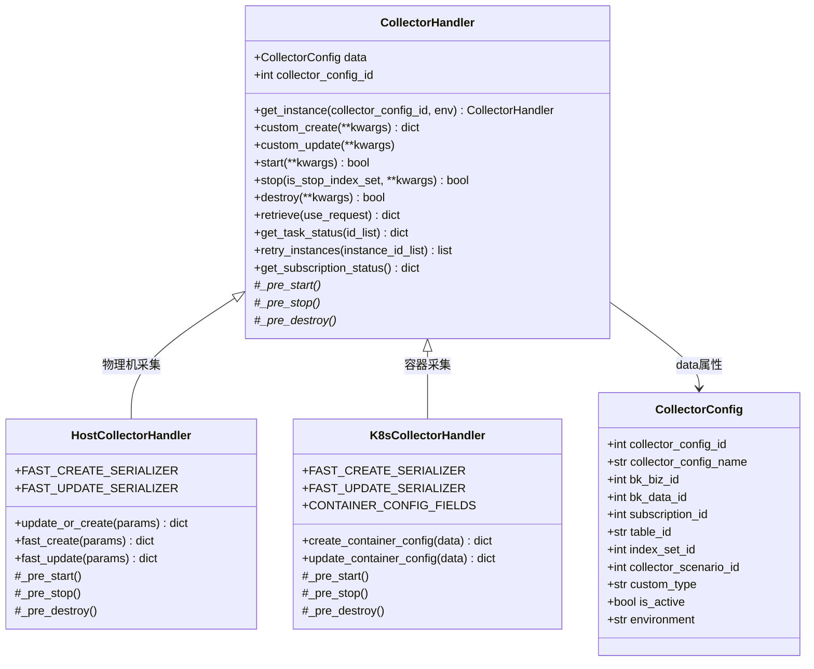
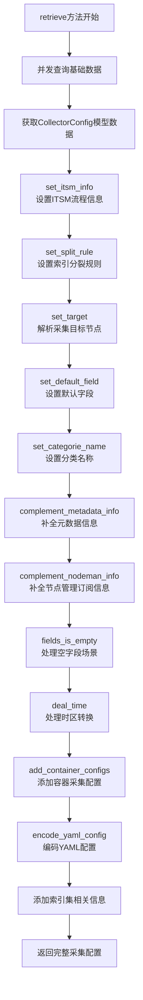
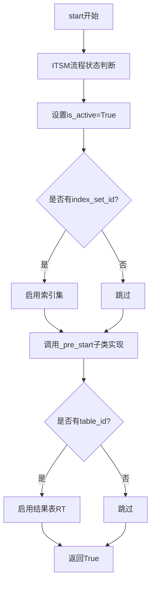

# CollectorHandler 采集管理技术文档

## 1. 概述

CollectorHandler 是蓝鲸日志平台 中采集管理的核心组件，负责日志采集配置的生命周期管理。该模块采用责任链模式和模板方法模式，实现了物理机采集和容器采集的统一管理。

**文件位置：**
- 基类：`apps/log_databus/handlers/collector/base.py`
- 物理机采集：`apps/log_databus/handlers/collector/host.py`
- 容器采集：`apps/log_databus/handlers/collector/k8s.py`

---

## 2. 类图结构



---

## 3. RETRIEVE_CHAIN 责任链模式

### 3.1 责任链定义

```python
# apps/log_databus/constants.py (第736-748行)
RETRIEVE_CHAIN = [
    "set_itsm_info",
    "set_split_rule",
    "set_target",
    "set_default_field",
    "set_categorie_name",
    "complement_metadata_info",
    "complement_nodeman_info",
    "fields_is_empty",
    "deal_time",
    "add_container_configs",
    "encode_yaml_config",
]
```

### 3.2 责任链执行流程



### 3.3 责任链各节点功能说明

| 处理节点 | 功能描述 |
|---------|---------|
| `set_itsm_info` | 设置ITSM审批流程状态信息 |
| `set_split_rule` | 设置ES索引分裂规则 |
| `set_target` | 解析采集目标节点（拓扑/实例） |
| `set_default_field` | 设置默认字段（场景名、数据名等） |
| `set_categorie_name` | 设置分类和自定义类型名称 |
| `complement_metadata_info` | 补全存储在metadata结果表中的配置 |
| `complement_nodeman_info` | 补全节点管理订阅配置参数 |
| `fields_is_empty` | 处理数据未入库时的默认字段 |
| `deal_time` | 处理时区转换 |
| `add_container_configs` | 添加容器采集子配置列表 |
| `encode_yaml_config` | 对YAML配置进行Base64编码 |

---

## 4. 核心方法分析

### 4.1 start 方法

**功能：** 启动采集配置

```python
# base.py 第407-441行
@transaction.atomic
def start(self, **kwargs):
    """
    启动采集配置
    :return: task_id
    """
    self._itsm_start_judge()

    self.data.is_active = True
    self.data.save()

    # 启用采集项
    if self.data.index_set_id:
        index_set_handler = IndexSetHandler(self.data.index_set_id)
        index_set_handler.start()

    self._pre_start()

    # 存在RT则启用RT
    if self.data.table_id:
        _, table_id = self.data.table_id.split(".")
        etl_storage = EtlStorage.get_instance(self.data.etl_config)
        etl_storage.switch_result_table(collector_config=self.data, is_enable=True)

    return True
```

**执行流程：**



**子类实现：**

- **HostCollectorHandler._pre_start**：启用节点管理订阅
- **K8sCollectorHandler._pre_start**：创建容器采集配置下发

### 4.2 stop 方法

**功能：** 停止采集配置

```python
# base.py 第447-480行
@transaction.atomic
def stop(self, is_stop_index_set=True, **kwargs):
    """
    停止采集配置
    """
    self.data.is_active = False
    self.data.save()

    # 停止索引集
    if self.data.index_set_id and is_stop_index_set:
        index_set_handler = IndexSetHandler(self.data.index_set_id)
        index_set_handler.stop()

    self._pre_stop()

    # 存在RT则停止RT
    if self.data.table_id:
        etl_storage = EtlStorage.get_instance(self.data.etl_config)
        etl_storage.switch_result_table(collector_config=self.data, is_enable=False)

    return True
```

---

## 5. 工厂方法模式实现

### 5.1 get_instance 方法

**功能：** 根据环境类型动态创建对应的Handler实例

```python
# base.py 第137-160行
@classmethod
def get_instance(cls, collector_config_id=None, env=None):
    if env and not collector_config_id:
        if env == Environment.CONTAINER:
            collector_handler = import_string("apps.log_databus.handlers.collector.K8sCollectorHandler")
            return collector_handler()
        else:
            collector_handler = import_string("apps.log_databus.handlers.collector.HostCollectorHandler")
            return collector_handler()

    if collector_config_id:
        data = CollectorConfig.objects.get(collector_config_id=collector_config_id)
        if data.is_container_environment:
            collector_handler = import_string("apps.log_databus.handlers.collector.K8sCollectorHandler")
            return collector_handler(collector_config_id, data)
        else:
            collector_handler = import_string("apps.log_databus.handlers.collector.HostCollectorHandler")
            return collector_handler(collector_config_id, data)
```

---

## 6. 设计模式总结

| 设计模式 | 应用场景 |
|---------|---------|
| **模板方法模式** | start/stop/destroy生命周期管理，抽象方法 `_pre_start`、`_pre_stop`、`_pre_destroy` |
| **责任链模式** | retrieve查询数据处理，RETRIEVE_CHAIN定义 |
| **工厂方法模式** | 动态创建Handler实例，get_instance方法 |
| **策略模式** | 不同采集场景的处理策略 |

---

**文档版本**: v1.0
**生成日期**: 2026-04-30
**源文件**: `apps/log_databus/handlers/collector/base.py`