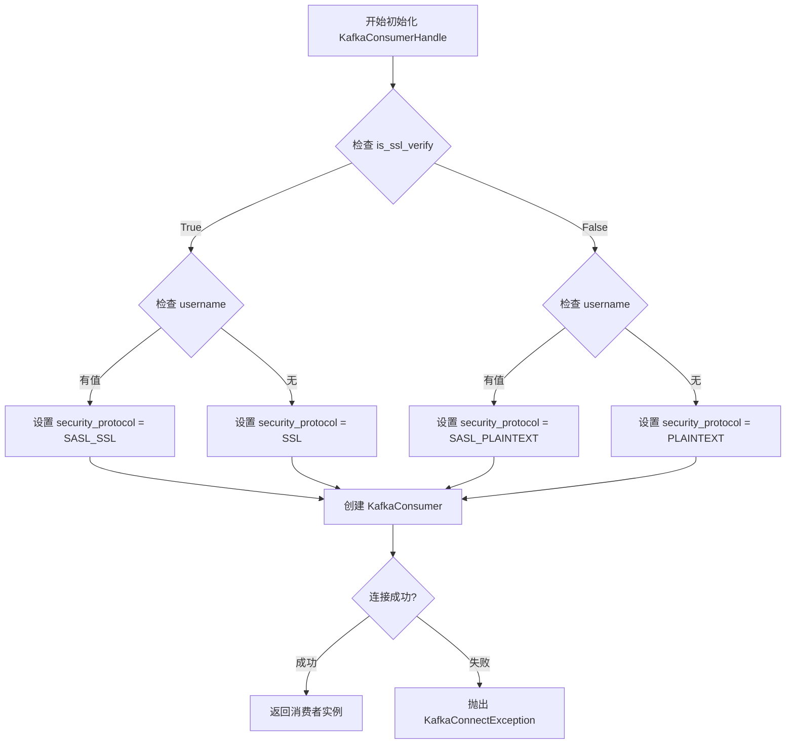
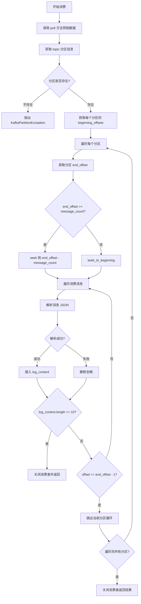
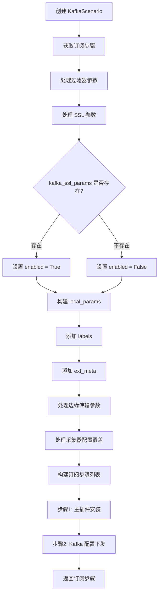
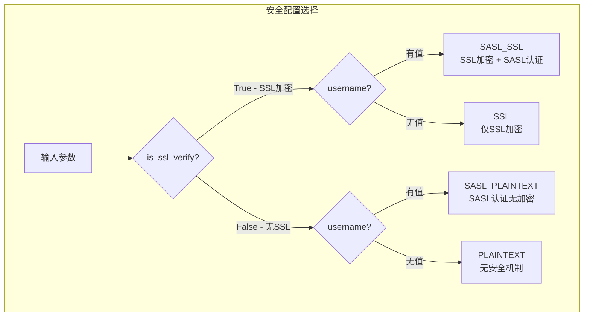

# Kafka 消费实现技术文档

## 1. 概述

`apps/log_databus` 目录下的 Kafka 消费实现主要用于蓝鲸日志平台的数据采集场景。系统通过 Kafka 消费者从外部 Kafka 集群消费日志数据，并将其采集入库。

主要涉及以下核心模块：

| 文件路径 | 功能描述 |
|---------|---------|
| `apps/log_databus/handlers/kafka.py` | Kafka 消费者核心处理类 |
| `apps/log_databus/handlers/collector_scenario/kafka.py` | Kafka 数据采集场景配置 |
| `apps/log_databus/handlers/check_collector/checker/kafka_checker.py` | Kafka 连接检查器 |
| `apps/log_databus/constants.py` | Kafka SSL/SASL 配置常量 |
| `apps/log_databus/exceptions.py` | Kafka 相关异常定义 |

---

## 2. Kafka 消费者核心类

### 2.1 KafkaConsumerHandle 类

**文件位置**: `apps/log_databus/handlers/kafka.py`

```python
# 第 30-79 行
class KafkaConsumerHandle(object):
    def __init__(
        self,
        server,
        port,
        topic,
        username=None,
        password=None,
        is_ssl_verify=False,
        ssl_insecure_skip_verify=True,
        ssl_cafile=None,
        ssl_certfile=None,
        ssl_keyfile=None,
        sasl_mechanism=None,
    ):
        self.server = server
        self.port = int(port)
        self.topic = topic
        self.kafka_server = server + ":" + str(port)
        self.sasl_mechanism = sasl_mechanism

        if is_ssl_verify:
            if username:
                security_protocol = "SASL_SSL"
            else:
                security_protocol = "SSL"
        else:
            if username:
                security_protocol = "SASL_PLAINTEXT"
            else:
                security_protocol = "PLAINTEXT"

        try:
            self.consumer = KafkaConsumer(
                self.topic,
                bootstrap_servers=self.kafka_server,
                security_protocol=security_protocol,
                sasl_mechanism=sasl_mechanism or ("PLAIN" if username else None),
                sasl_plain_username=username,
                sasl_plain_password=password,
                request_timeout_ms=5000,
                consumer_timeout_ms=5000,
                ssl_cafile=ssl_cafile,
                ssl_certfile=ssl_certfile,
                ssl_keyfile=ssl_keyfile,
                ssl_check_hostname=not ssl_insecure_skip_verify,
            )
        except Exception as e:  # pylint: disable=broad-except
            raise KafkaConnectException(KafkaConnectException.MESSAGE.format(error=e))
```

**核心设计要点**：

1. **安全协议自动选择**：根据 `is_ssl_verify` 和 `username` 参数自动选择合适的安全协议
   - `SASL_SSL`: SSL 加密 + SASL 认证
   - `SSL`: 仅 SSL 加密
   - `SASL_PLAINTEXT`: SASL 认证但无加密
   - `PLAINTEXT`: 无加密无认证

2. **超时配置**：
   - `request_timeout_ms=5000`: 请求超时 5 秒
   - `consumer_timeout_ms=5000`: 消费超时 5 秒

---

## 3. Kafka 消费者配置

### 3.1 SSL/SASL 安全协议配置常量

**文件位置**: `apps/log_databus/constants.py`

```python
# 第 571-581 行
# kafka ssl配置项
KAFKA_SSL_USERNAME = "sasl_username"
KAFKA_SSL_PASSWORD = "sasl_passwd"
KAFKA_SSL_MECHANISM = "sasl_mechanisms"
KAFKA_SSL_PROTOCOL = "security_protocol"

KAFKA_SSL_CONFIG_ITEMS = {KAFKA_SSL_USERNAME, KAFKA_SSL_PASSWORD, KAFKA_SSL_MECHANISM, KAFKA_SSL_PROTOCOL}

KAFKA_TEST_GROUP = "kafka_test_group"
DEFAULT_KAFKA_SECURITY_PROTOCOL = "PLAINTEXT"
DEFAULT_KAFKA_SASL_MECHANISM = "PLAIN"
```

### 3.2 安全协议选择逻辑

```python
# handlers/kafka.py 第 51-60 行
if is_ssl_verify:
    if username:
        security_protocol = "SASL_SSL"
    else:
        security_protocol = "SSL"
else:
    if username:
        security_protocol = "SASL_PLAINTEXT"
    else:
        security_protocol = "PLAINTEXT"
```

**安全协议矩阵**：

| is_ssl_verify | username | security_protocol | 说明 |
|--------------|----------|------------------|------|
| True | 有值 | SASL_SSL | SSL 加密 + SASL 认证（最安全） |
| True | 无 | SSL | 仅 SSL 加密 |
| False | 有值 | SASL_PLAINTEXT | SASL 认证但无加密 |
| False | 无 | PLAINTEXT | 无安全机制（默认） |

### 3.3 系统环境配置

**文件位置**: `config/default.py`

```python
# 第 1035-1036 行
DEFAULT_KAFKA_HOST = os.getenv("BKAPP_DEFAULT_KAFKA_HOST")
DEFAULT_KAFKA_POLL_TIMEOUT = int(os.getenv("BKAPP_DEFAULT_KAFKA_POLL_TIMEOUT", 1000))
```

---

## 4. 消息消费流程

### 4.1 消息消费核心方法

**文件位置**: `apps/log_databus/handlers/kafka.py`

```python
# 第 80-126 行
def get_latest_log(self):
    """
    读取kafka的数据
    :return:
    """
    message_count = 10
    self.consumer.poll(settings.DEFAULT_KAFKA_POLL_TIMEOUT)

    # 获取topic分区信息
    topic_partitions = self.consumer.partitions_for_topic(self.topic)
    if not topic_partitions:
        raise KafkaPartitionException()
    # 创建TopicPartition对象列表
    partitions = [TopicPartition(self.topic, p) for p in topic_partitions]

    # 获取每个分区的最早可用偏移量
    beginning_offsets = self.consumer.beginning_offsets(partitions)
    log_content = []
    for _partition in topic_partitions:
        # 获取该分区最大偏移量
        tp = TopicPartition(topic=self.topic, partition=_partition)
        begin_offset = beginning_offsets[tp]
        end_offset = self.consumer.end_offsets([tp])[tp]
        if not end_offset:
            continue

        # 设置消息消费偏移量
        if end_offset >= message_count:
            use_offset = end_offset - message_count
            self.consumer.seek(tp, use_offset if use_offset > begin_offset else begin_offset)
        else:
            self.consumer.seek_to_beginning()

        # 消费消息
        for _msg in self.consumer:
            try:
                log_content.insert(0, json.loads(_msg.value.decode()))
            except Exception:  # pylint: disable=broad-except
                pass
            if len(log_content) == message_count:
                self.consumer.close()
                return log_content
            if _msg.offset == end_offset - 1:
                break

    self.consumer.close()
    return log_content
```

### 4.2 KafkaChecker 消费实现

**文件位置**: `apps/log_databus/handlers/check_collector/checker/kafka_checker.py`

```python
# 第 58-129 行
def get_kafka_test_group_latest_log(self, kafka_info: dict):
    """
    使用测试消费组, 判断kafka指定的[topic:partition]是否有数据
    """
    log_content = []
    host = kafka_info.get("ip", settings.DEFAULT_KAFKA_HOST)
    if "consul" in host and settings.DEFAULT_KAFKA_HOST:
        host = settings.DEFAULT_KAFKA_HOST
    port = kafka_info.get("port", 9092)
    topic = kafka_info.get("kafka_topic_name", "")
    try:
        consumer = KafkaConsumer(
            topic,
            group_id=KAFKA_TEST_GROUP,
            bootstrap_servers=f"{host}:{port}",
            security_protocol=kafka_info.get(KAFKA_SSL_PROTOCOL, DEFAULT_KAFKA_SECURITY_PROTOCOL),
            sasl_mechanism=kafka_info.get(KAFKA_SSL_MECHANISM, None),
            sasl_plain_username=kafka_info.get(KAFKA_SSL_USERNAME, None),
            sasl_plain_password=kafka_info.get(KAFKA_SSL_PASSWORD, None),
        )

        message_count = 10
        consumer.poll(message_count)

        # 获取topic分区信息
        topic_partitions = consumer.partitions_for_topic(topic)
        if not topic_partitions:
            self.append_error_info(_("获取topic[{topic}] partition信息失败").format(topic=topic))
            return

        for _partition in topic_partitions:
            # 获取该分区最大偏移量
            tp = TopicPartition(topic=topic, partition=_partition)
            end_offset = consumer.end_offsets([tp])[tp]
            if not end_offset:
                continue

            # 设置消息消费偏移量
            if end_offset >= message_count:
                consumer.seek(tp, end_offset - message_count)
            else:
                consumer.seek_to_beginning()

            # 消费消息
            for _msg in consumer:
                try:
                    log_content.insert(0, json.loads(_msg.value.decode()))
                except Exception as e:  # pylint: disable=broad-except
                    logger.error(f"消费数据失败, err: {str(e)}")
                if len(log_content) == message_count:
                    self.latest_log.extend(log_content)
                    consumer.close()
                    break
                if _msg.offset == end_offset - 1:
                    break

        consumer.close()

    except Exception as e:  # pylint: disable=broad-except
        message = _("创建kafka消费者失败, err: {e}").format(e=e)
        logger.error(message)
        self.append_error_info(message)

    if not log_content:
        self.append_error_info(_("{host}:{port}, topic: {topic}, 无数据").format(host=host, port=port, topic=topic))
    else:
        self.append_normal_info(
            _("{host}:{port}, topic: {topic}, 有数据, 数据采样: {example}").format(
                host=host, port=port, topic=topic, example=json.dumps(log_content[0])
            )
        )
```

---

## 5. Kafka 采集场景配置

### 5.1 KafkaScenario 类

**文件位置**: `apps/log_databus/handlers/collector_scenario/kafka.py`

```python
# 第 35-108 行
class KafkaScenario(CollectorScenario):
    """
    kafka 数据采集
    """

    PLUGIN_NAME = LogPluginInfo.NAME
    PLUGIN_VERSION = LogPluginInfo.VERSION
    CONFIG_NAME = "bkunifylogbeat_kafka"

    def get_subscription_steps(self, data_id, params, collector_config_id=None, data_link_id=None):
        """
        params内包含的参数
        kafka_hosts: ['127.0.0.1:9092', '127.0.0.2:9093']
        kafka_username: "admin",
        kafka_password: "xxxxx",
        kafka_topics: ['topic_1', 'topic_2'],
        kafka_group_id: 'group_1',
        kafka_initial_offset: 'newest'
        """
        filters, params = deal_collector_scenario_param(params)

        kafka_ssl_params = params.get("kafka_ssl_params", {})

        if kafka_ssl_params:
            kafka_ssl_params.update({"enabled": True})
        else:
            kafka_ssl_params.update({"enabled": False})

        local_params = {
            "hosts": json.dumps(params.get("kafka_hosts", [])),
            "topics": json.dumps(params.get("kafka_topics", [])),
            "username": params.get("kafka_username", ""),
            "password": params.get("kafka_password", ""),
            "group_id": params.get("kafka_group_id", data_id),
            "initial_offset": params.get("kafka_initial_offset", KafkaInitialOffsetEnum.NEWEST.value),
            "ssl": json.dumps(kafka_ssl_params),
            "filters": filters,
            "delimiter": params["conditions"].get("separator") or "",
        }
        local_params = self._add_labels(local_params, params, collector_config_id)
        local_params = self._add_ext_meta(local_params, params)
        local_params = self._deal_edge_transport_params(local_params, data_link_id)
        local_params = self._handle_collector_config_overlay(local_params, params)
        steps = [
            {
                "id": f"main:{self.PLUGIN_NAME}",
                "type": "PLUGIN",
                "config": {
                    "job_type": "MAIN_INSTALL_PLUGIN",
                    "check_and_skip": True,
                    "is_version_sensitive": False,
                    "plugin_name": self.PLUGIN_NAME,
                    "plugin_version": self.PLUGIN_VERSION,
                    "config_templates": [{"name": f"{self.PLUGIN_NAME}.conf", "version": "latest", "is_main": True}],
                },
                "params": {"context": {}},
            },
            {
                "id": self.PLUGIN_NAME,
                "type": "PLUGIN",
                "config": {
                    "plugin_name": self.PLUGIN_NAME,
                    "plugin_version": self.PLUGIN_VERSION,
                    "config_templates": [{"name": f"{self.CONFIG_NAME}.conf", "version": "latest"}],
                },
                "params": {
                    "context": {
                        "dataid": data_id,
                        "local": [local_params],
                    }
                },
            },
        ]
        return steps
```

### 5.2 配置参数解析

```python
# 第 110-224 行
@classmethod
def parse_steps(cls, steps):
    """
    解析订阅步骤至参数
    """
    try:
        for step in steps:
            if step["id"] == cls.PLUGIN_NAME:
                config = step["params"]["context"]
                break
        else:
            config = steps[0]["params"]["context"]

        try:
            separator_filters = []
            for parent_index, filter_item in enumerate(config["local"][0]["filters"]):
                for child_index, condition_item in enumerate(filter_item["conditions"]):
                    logic_op = "or" if parent_index != 0 and child_index == 0 else "and"
                    separator_filters.append(
                        {
                            "fieldindex": condition_item["index"],
                            "word": condition_item["key"],
                            "op": condition_item["op"],
                            "logic_op": logic_op,
                        }
                    )
        except (IndexError, KeyError, ValueError):
            separator_filters = []

        match_content = ""
        match_type = "include"
        if separator_filters and separator_filters[0]["fieldindex"] == "-1":
            _type = "match"
            match_content = separator_filters[0].get("word", "")
            match_type = separator_filters[0].get("op", "=")
            if match_type == "=":
                match_type = "include"
        elif not separator_filters:
            _type = "none"
        else:
            _type = "separator"

        conditions = (
            {
                "separator": config["local"][0]["delimiter"],
                "separator_filters": separator_filters,
                "type": _type,
                "match_type": match_type,
                "match_content": match_content,
            }
            if _type != "none"
            else {"type": _type}
        )

        ssl_params = config["local"][0]["ssl"]

        params = {
            "conditions": conditions,
            "kafka_hosts": config["local"][0]["hosts"],
            "kafka_topics": config["local"][0]["topics"],
            "kafka_username": config["local"][0]["username"],
            "kafka_password": config["local"][0]["password"],
            "kafka_group_id": config["local"][0]["group_id"],
            "kafka_initial_offset": config["local"][0]["initial_offset"],
            "kafka_ssl_params": ssl_params if isinstance(ssl_params, str) else ssl_params,
        }

    except (IndexError, KeyError, ValueError) as e:
        logger.exception(f"解析订阅步骤失败，参数:{steps}，错误:{e}")
        params = {
            "conditions": [],
            "kafka_hosts": [],
            "kafka_topics": [],
            "kafka_username": "",
            "kafka_password": "",
            "kafka_group_id": "",
            "kafka_initial_offset": "",
            "kafka_ssl_params": {},
        }
    return params
```

### 5.3 KafkaInitialOffsetEnum 常量

**文件位置**: `apps/log_databus/constants.py`

```python
# 第 697-709 行
class KafkaInitialOffsetEnum(ChoicesEnum):
    """
    1. 控制是否从头开始消费 默认为 newest（消费最新的数据）
    2. 只针对初始化一个新的消费组时生效
    """

    OLDEST = "oldest"
    NEWEST = "newest"

    _choices_labels = (
        (OLDEST, _("最旧")),
        (NEWEST, _("最新")),
    )
```

---

## 6. 异常处理机制

### 6.1 Kafka 异常类定义

**文件位置**: `apps/log_databus/exceptions.py`

```python
# 第 283-295 行
class KafkaConnectException(BaseCollectorConfigException):
    ERROR_CODE = "401"
    MESSAGE = _('kafka连接失败"{error}"')


class KafkaPartitionException(BaseCollectorConfigException):
    ERROR_CODE = "402"
    MESSAGE = _("最新数据获取失败, 可刷新重试一下")


class DataLinkConfigPartitionException(BaseCollectorConfigException):
    ERROR_CODE = "403"
    MESSAGE = _("数据链路配置获取失败")
```

### 6.2 异常处理流程

在 `KafkaConsumerHandle.__init__` 中：

```python
# handlers/kafka.py 第 77-78 行
except Exception as e:  # pylint: disable=broad-except
    raise KafkaConnectException(KafkaConnectException.MESSAGE.format(error=e))
```

在 `get_latest_log` 方法中：

```python
# handlers/kafka.py 第 88-91 行
topic_partitions = self.consumer.partitions_for_topic(self.topic)
if not topic_partitions:
    raise KafkaPartitionException()
```

在消息解析过程中：

```python
# handlers/kafka.py 第 115-118 行
try:
    log_content.insert(0, json.loads(_msg.value.decode()))
except Exception:  # pylint: disable=broad-except
    pass  # 解析失败时静默忽略，继续处理下一条消息
```

---

## 7. 流程图

### 7.1 Kafka 消费者初始化流程



### 7.2 消息消费流程



### 7.3 Kafka 采集场景配置流程



### 7.4 安全协议选择矩阵图



---

## 8. 关键设计总结

### 8.1 安全性设计

| 特性 | 说明 |
|------|------|
| 多协议支持 | 支持 PLAINTEXT、SSL、SASL_PLAINTEXT、SASL_SSL 四种协议 |
| SSL 证书配置 | 支持 ssl_cafile、ssl_certfile、ssl_keyfile 三种证书配置 |
| 主机名验证 | 通过 `ssl_check_hostname` 参数控制是否验证主机名 |
| SASL 机制 | 默认使用 PLAIN 机制，支持自定义配置 |

### 8.2 消费策略

| 特性 | 说明 |
|------|------|
| 消费数量 | 默认获取最近 10 条消息 |
| 偏移量策略 | 从最新偏移量向前回溯，若不足则从头开始 |
| 超时控制 | request_timeout_ms=5000, consumer_timeout_ms=5000 |
| 消费组 | 检查场景使用 `kafka_test_group` 测试消费组 |

### 8.3 异常处理策略

| 异常类型 | 处理方式 |
|---------|---------|
| 连接异常 | 抛出 KafkaConnectException，携带详细错误信息 |
| 分区不存在 | 抛出 KafkaPartitionException，提示用户重试 |
| JSON 解析失败 | 静默忽略，继续处理下一条消息 |
| 订阅步骤解析失败 | 返回默认空参数，记录异常日志 |

---

## 9. 相关文件索引

| 文件路径 | 行号范围 | 主要功能 |
|---------|---------|---------|
| `apps/log_databus/handlers/kafka.py` | 30-127 | KafkaConsumerHandle 核心消费类 |
| `apps/log_databus/handlers/collector_scenario/kafka.py` | 35-334 | KafkaScenario 采集场景配置 |
| `apps/log_databus/handlers/check_collector/checker/kafka_checker.py` | 43-129 | KafkaChecker 检查器 |
| `apps/log_databus/constants.py` | 571-581, 697-709 | SSL 配置常量、偏移量枚举 |
| `apps/log_databus/exceptions.py` | 283-295 | Kafka 异常类定义 |
| `config/default.py` | 1035-1036 | 环境变量配置 |

---

**文档版本**: v1.0
**生成日期**: 2026-04-30
**源码路径**: `apps/log_databus/handlers/kafka.py`