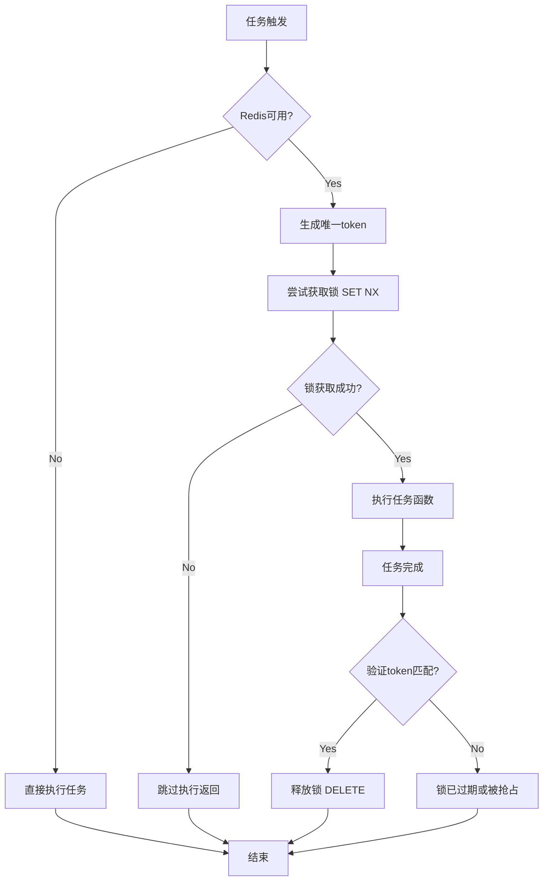
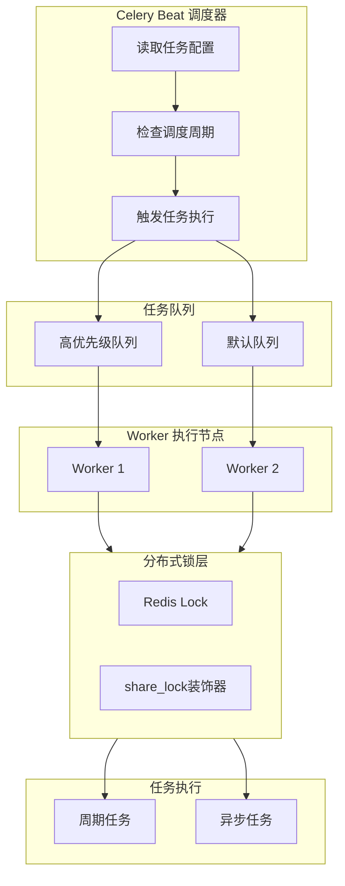

# BKLOG 采集任务调度技术文档

## 一、概述

`apps/log_databus/tasks` 目录包含 BKLOG 日志平台的核心异步任务实现，基于 Celery 框架构建，提供了周期性调度任务和异步执行任务的能力。

## 二、装饰器分析

### 2.1 @periodic_task 装饰器

**功能说明**: 将函数注册为 Celery 周期性任务，通过 `run_every` 参数配置调度周期。

```python
# apps/log_databus/tasks/itsm.py 第 28-33 行
@periodic_task(run_every=crontab(minute="*/5"))
def failed_ticket_clean():
    """
    处理回调失败的单据
    """
    ItsmHandler().clean_failed_ticket_callback()
```

**调度参数说明**:

| 参数 | 示例 | 说明 |
|------|------|------|
| `minute="*/5"` | 每5分钟执行 | 分钟级周期调度 |
| `minute="0"` | 每小时整点执行 | 分钟固定值 |
| `minute="0", hour="1"` | 每天凌晨1点执行 | 小时级调度 |

### 2.2 @high_priority_task 装饰器

**功能说明**: 将任务路由到高优先级队列执行，确保关键任务优先处理。

```python
# apps/utils/task.py 第 16-18 行
def high_priority_task(*args, **kwargs):
    """高优先级任务"""
    return app.task(*args, **dict({'queue': settings.BK_LOG_HIGH_PRIORITY_QUEUE}, **kwargs))
```

### 2.3 @share_lock 装饰器

**功能说明**: 基于 Redis 实现分布式锁，防止多个 Worker 同时执行同一周期任务。

```python
# apps/utils/lock.py 第 98-133 行
def share_lock(ttl=600, identify=None):
    """
    装饰定时任务时需要放在periodic_task下面
    @param ttl: 锁过期时间，默认600秒
    @param identify: 锁标识，用于区分不同模块的同名函数
    """
    def wrapper(func):
        @functools.wraps(func)
        def _inner(*args, **kwargs):
            if not settings.USE_REDIS:
                return func(*args, **kwargs)
            token = str(time.time())
            cache_key = "celery_%s" % func.__name__ if identify is None else identify
            lock_success = cache.set(cache_key, token, timeout=ttl, nx=True)
            if not lock_success:
                return  # 获取锁失败，静默退出
            try:
                return func(*args, **kwargs)
            finally:
                if cache.get(cache_key) == token:
                    cache.delete(cache_key)
        return _inner
    return wrapper
```

## 三、分布式锁流程图



## 四、任务定义详解

### 4.1 周期任务清单

| 任务名称 | 文件 | 调度周期 | 功能描述 |
|----------|------|----------|----------|
| `failed_ticket_clean` | itsm.py | 每5分钟 | 处理ITSM回调失败单据 |
| `clean_expired_restore_index_set` | archive.py | 每天01:00 | 清理过期恢复配置 |
| `check_restore_is_done_and_notice_user` | archive.py | 每分钟 | 检查恢复完成状态 |
| `review_bkdata_data_id` | bkdata.py | 每天03:30 | 补检未同步DataID |
| `review_clean` | bkdata.py | 每30分钟 | 同步清洗配置 |
| `collector_status` | collector.py | 每天01:00 | 检测24小时未入库采集项 |
| `sync_storage_capacity` | collector.py | 每小时 | 同步集群存储容量 |
| `create_custom_log_group` | collector.py | 每小时 | 创建OTLP Log Group |

### 4.2 异步任务清单

| 任务名称 | 文件 | 功能描述 |
|----------|------|----------|
| `async_create_bkdata_data_id` | bkdata.py | 创建数据平台DataID |
| `create_container_release` | collector.py | 创建容器采集配置发布 |
| `delete_container_release` | collector.py | 删除容器采集配置 |

## 五、任务调度架构流程图



## 六、失败重试策略

### 6.1 重试常量定义

```python
# apps/log_databus/constants.py 第 554-555 行
RETRY_TIMES = 5          # 最大重试次数
WAIT_FOR_RETRY = 20     # 重试等待时间(秒)
MAX_CREATE_BKDATA_DATA_ID_FAIL_COUNT = 3  # bkdata_data_id创建最大失败次数
```

### 6.2 重试策略对比表

| 策略类型 | 适用场景 | 重试次数 | 等待时间 | 失败处理 |
|----------|----------|----------|----------|----------|
| 循环重试 | 数据库事务等待 | 5次 | 20秒 | 抛异常/返回 |
| 计数重试 | 周期性补救任务 | 3次 | 无等待 | 跳过记录 |
| 异常捕获 | 批量处理任务 | 无限 | 无等待 | 继续处理 |

## 七、share_lock 使用示例

```python
# apps/log_search/tasks/project.py 第 40-48 行
@periodic_task(run_every=crontab(minute="*/1"))
@share_lock()
def sync():
    if settings.USING_SYNC_BUSINESS:
        # 同步CMDB业务信息
        sync_projects()
        sync_biz_property()
        return True
    return False
```

---

**文档版本**: v1.0
**生成日期**: 2026-04-30
**源码路径**: `apps/log_databus/tasks/`