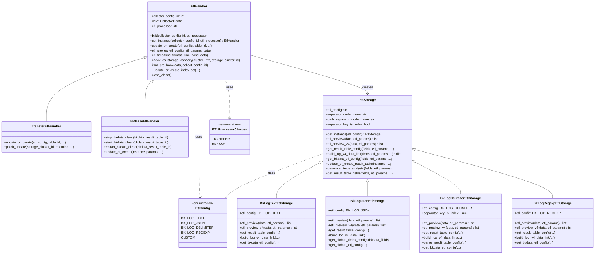
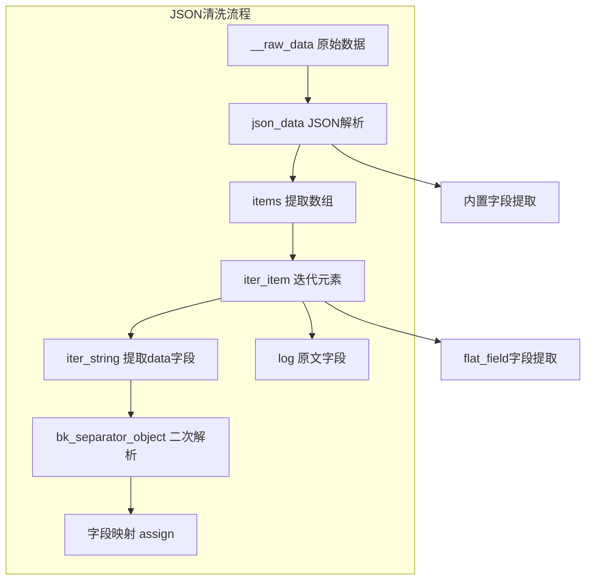

# BKLOG ETL 处理策略技术文档

## 1. 概述

BKLOG 的 ETL（Extract-Transform-Load）处理策略采用了经典的**策略模式**设计，将不同类型的日志清洗逻辑封装到独立的处理器类中，通过工厂方法动态选择具体的处理策略。该设计支持多种日志解析方式：直接入库、JSON解析、分隔符切分、正则表达式提取。

## 2. 策略模式架构

### 2.1 类图关系



## 3. 核心常量定义

### 3.1 EtlConfig - ETL配置类型枚举

**文件位置**: `apps/log_databus/constants.py` (第388-394行)

```python
class EtlConfig:
    BK_LOG_TEXT = "bk_log_text"      # 直接入库
    BK_LOG_JSON = "bk_log_json"      # JSON解析
    BK_LOG_DELIMITER = "bk_log_delimiter"  # 分隔符切分
    BK_LOG_REGEXP = "bk_log_regexp"  # 正则表达式提取
    CUSTOM = "custom"                # 自定义清洗
```

### 3.2 EtlConfigChoices - ETL配置选项枚举

**文件位置**: `apps/log_databus/constants.py` (第402-409行)

```python
class EtlConfigChoices(ChoicesEnum):
    _choices_labels = (
        (EtlConfig.BK_LOG_TEXT, _("直接入库")),
        (EtlConfig.BK_LOG_JSON, _("Json")),
        (EtlConfig.BK_LOG_DELIMITER, _("分隔符")),
        (EtlConfig.BK_LOG_REGEXP, _("正则")),
        (EtlConfig.CUSTOM, _("自定义")),
    )
```

### 3.3 ETLProcessorChoices - 数据处理器选择

**文件位置**: `apps/log_databus/constants.py` (第431-442行)

```python
class ETLProcessorChoices(ChoicesEnum):
    """
    数据处理器
    """
    TRANSFER = "transfer"   # Transfer处理
    BKBASE = "bkbase"       # 数据平台处理

    _choices_labels = (
        (TRANSFER, _("Transfer")),
        (BKBASE, _("数据平台")),
    )
```

## 4. EtlHandler 基类 - 策略模式工厂

### 4.1 类定义与初始化

**文件位置**: `apps/log_databus/handlers/etl/base.py` (第72-80行)

```python
class EtlHandler:
    def __init__(self, collector_config_id=None, etl_processor=ETLProcessorChoices.TRANSFER.value):
        super().__init__()
        self.collector_config_id = collector_config_id
        self.data = None
        self.etl_processor = etl_processor
        if collector_config_id:
            self.data = self._get_collect_config(collector_config_id)
            self.etl_processor = self.data.etl_processor
```

### 4.2 get_instance - 策略工厂方法

**文件位置**: `apps/log_databus/handlers/etl/base.py` (第90-105行)

```python
@classmethod
def get_instance(cls, collector_config_id=None, etl_processor=ETLProcessorChoices.TRANSFER.value):
    if collector_config_id:
        collect_config = cls._get_collect_config(collector_config_id)
        etl_processor = collect_config.etl_processor
    # 处理器映射关系
    mapping = {
        ETLProcessorChoices.BKBASE.value: "BKBaseEtlHandler",
        ETLProcessorChoices.TRANSFER.value: "TransferEtlHandler",
    }
    # 获取处理器
    try:
        etl_handler = import_string(f"apps.log_databus.handlers.etl.{etl_processor}.{mapping.get(etl_processor)}")
        return etl_handler(collector_config_id=collector_config_id, etl_processor=etl_processor)
    except ImportError as error:
        raise NotImplementedError(f"EtlHandler of {etl_processor} not implement, error: {error}")
```

**设计说明**:
- `get_instance` 是工厂方法，根据 `etl_processor` 参数动态选择具体的处理器类
- 使用 Django 的 `import_string` 实现动态类加载，避免硬编码依赖
- 处理器映射表 `mapping` 定义了策略选择关系

### 4.3 etl_preview - 清洗预览方法

**文件位置**: `apps/log_databus/handlers/etl/base.py` (第261-268行)

```python
@staticmethod
def etl_preview(etl_config, etl_params, data, bk_biz_id=None):
    etl_storage = EtlStorage.get_instance(etl_config=etl_config)
    if FeatureToggleObject.switch("log_v4_data_link", bk_biz_id):
        fields = etl_storage.etl_preview_v4(data, etl_params)
    else:
        fields = etl_storage.etl_preview(data, etl_params)
    return {"fields": fields}
```

## 5. EtlStorage 基类 - 清洗存储策略

### 5.1 类定义与策略映射

**文件位置**: `apps/log_databus/handlers/etl_storage/base.py` (第63-86行)

```python
class EtlStorage:
    """
    清洗入库
    """

    # 子类需重载
    etl_config = None
    separator_node_name = "bk_separator_object"
    path_separator_node_name = "bk_separator_object_path"
    separator_key_is_index = False

    @classmethod
    def get_instance(cls, etl_config=None):
        mapping = {
            EtlConfig.BK_LOG_TEXT: "BkLogTextEtlStorage",
            EtlConfig.BK_LOG_JSON: "BkLogJsonEtlStorage",
            EtlConfig.BK_LOG_DELIMITER: "BkLogDelimiterEtlStorage",
            EtlConfig.BK_LOG_REGEXP: "BkLogRegexpEtlStorage",
        }
        try:
            etl_storage = import_string(f"apps.log_databus.handlers.etl_storage.{etl_config}.{mapping.get(etl_config)}")
            return etl_storage()
        except ImportError as error:
            raise NotImplementedError(f"{etl_config} not implement, error: {error}")
```

## 6. 具体 ETL 处理器实现

### 6.1 TransferEtlHandler - Transfer处理器

**文件位置**: `apps/log_databus/handlers/etl/transfer.py` (第42-214行)

```python
class TransferEtlHandler(EtlHandler):
    def update_or_create(
        self,
        etl_config,
        table_id,
        storage_cluster_id,
        retention,
        allocation_min_days,
        storage_replies,
        es_shards=settings.ES_SHARDS,
        view_roles=None,
        etl_params=None,
        fields=None,
        sort_fields=None,
        target_fields=None,
        username="",
        total_shards_per_node=None,
        *args,
        **kwargs,
    ):
        etl_params = etl_params or {}
        user_fields = copy.deepcopy(fields)

        # 存储集群信息
        cluster_info = StorageHandler(storage_cluster_id).get_cluster_info_by_id()
        self.check_es_storage_capacity(cluster_info, storage_cluster_id)
        is_add = False if self.data.table_id else True

        # 聚类处理逻辑
        if self.data.is_clustering:
            clustering_config = ClusteringConfig.objects.get(collector_config_id=self.data.collector_config_id)
            update_clustering_clean.delay(
                collector_config_id=self.data.collector_config_id,
                fields=fields,
                etl_config=etl_config,
                etl_params=etl_params,
            )
            # ... 聚类字段处理

        # 1. meta-创建/修改结果表
        etl_storage = EtlStorage.get_instance(etl_config=etl_config)
        etl_storage.update_or_create_result_table(
            self.data,
            table_id=table_id,
            storage_cluster_id=storage_cluster_id,
            retention=retention,
            # ... 其他参数
        )

        # 2. 创建索引集
        index_set = self._update_or_create_index_set(
            etl_config,
            storage_cluster_id,
            view_roles,
            username=username,
            sort_fields=sort_fields,
            target_fields=target_fields,
        )

        # 3. 创建清洗缓存
        CollectorHandler(collector_config_id=self.collector_config_id).create_clean_stash({
            "clean_type": etl_config,
            "etl_params": etl_params,
            "etl_fields": user_fields,
            "bk_biz_id": self.data.bk_biz_id,
        })

        return {
            "collector_config_id": self.data.collector_config_id,
            "collector_config_name": self.data.collector_config_name,
            "etl_config": etl_config,
            "index_set_id": index_set["index_set_id"],
            # ... 返回结果
        }
```

### 6.2 BKBaseEtlHandler - 数据平台处理器

**文件位置**: `apps/log_databus/handlers/etl/bkbase.py` (第39-189行)

```python
class BKBaseEtlHandler(EtlHandler):
    """
    数据平台
    """

    @staticmethod
    def stop_bkdata_clean(bkdata_result_table_id: str) -> None:
        """停止清洗任务"""
        BkDataDatabusApi.delete_tasks(params={
            "result_table_id": bkdata_result_table_id,
            "bk_username": get_request_username(),
        })

    @staticmethod
    def start_bkdata_clean(bkdata_result_table_id: str) -> None:
        """启动清洗任务"""
        BkDataDatabusApi.post_tasks(params={
            "result_table_id": bkdata_result_table_id,
            "storages": ["kafka"],
            "bk_username": get_request_username(),
        })

    def update_or_create(self, instance: CollectorConfig | CollectorPlugin, params=None, **kwargs):
        """创建或更新清洗入库"""
        # 获取清洗入库配置
        collector_scenario = CollectorScenario.get_instance(collector_scenario_id=instance.collector_scenario_id)
        built_in_config = collector_scenario.get_built_in_config(etl_config=instance.etl_config)
        etl_storage: EtlStorage = EtlStorage.get_instance(instance.etl_config)

        # 构建字段配置和JSON配置
        fields_config = etl_storage.get_result_table_config(fields, etl_params, copy.deepcopy(built_in_config))
        bkdata_json_config = etl_storage.get_bkdata_etl_config(fields, etl_params, built_in_config)

        # 创建清洗任务
        if not instance.bkbase_table_id:
            result = BkDataDatabusApi.databus_cleans_post(bkdata_params)
            self.start_bkdata_clean(result["result_table_id"])
            instance.processing_id = result["processing_id"]
            instance.bkbase_table_id = result["result_table_id"]
            instance.save()
        else:
            # 更新清洗任务
            bkdata_params.update({"processing_id": instance.processing_id})
            BkDataDatabusApi.databus_cleans_put(bkdata_params, request_cookies=False)
            self.restart_bkdata_clean(instance.bkbase_table_id)
```

## 7. 具体清洗策略实现

### 7.1 BkLogTextEtlStorage - 直接入库策略

**文件位置**: `apps/log_databus/handlers/etl_storage/bk_log_text.py` (第28-91行)

```python
class BkLogTextEtlStorage(EtlStorage):
    """
    直接入库
    """
    etl_config = EtlConfig.BK_LOG_TEXT

    def etl_preview(self, data, etl_params) -> list:
        """字段提取预览 - 直接返回原始数据"""
        return data

    def etl_preview_v4(self, data, etl_params) -> list:
        """V4版本字段提取预览"""
        return data

    def get_result_table_config(self, fields, etl_params, built_in_config, es_version="5.X", enable_v4=False):
        """配置清洗入库策略"""
        built_in_fields = built_in_config.get("fields", [])

        # 生成原文字段分词器
        es_analyzer = self.generate_field_analyzer_name(
            field_name="log",
            field_alias="data",
            is_case_sensitive=etl_params.get("original_text_is_case_sensitive", False),
            tokenize_on_chars=etl_params.get("original_text_tokenize_on_chars", ""),
        )

        original_text_field = {
            "field_name": "log",
            "field_type": "string",
            "tag": "metric",
            "alias_name": "data",
            "description": "original_text",
            "option": {"es_type": "text", "es_include_in_all": True}
        }
        if es_analyzer:
            original_text_field["option"]["es_analyzer"] = es_analyzer

        result_table_config = {
            "option": built_in_config.get("option", {}),
            "field_list": built_in_fields + (fields or []) + [built_in_config["time_field"]] + [original_text_field],
            "time_alias_name": built_in_config["time_field"]["alias_name"],
            "time_option": built_in_config["time_field"]["option"],
        }
        return result_table_config
```

### 7.2 BkLogJsonEtlStorage - JSON解析策略

**文件位置**: `apps/log_databus/handlers/etl_storage/bk_log_json.py` (第29-127行)

```python
class BkLogJsonEtlStorage(EtlStorage):
    etl_config = EtlConfig.BK_LOG_JSON

    def etl_preview(self, data, etl_params=None) -> list:
        """字段提取预览 - JSON解析"""
        return preview("json", data)

    def etl_preview_v4(self, data, etl_params=None) -> list:
        """V4版本字段提取预览"""
        api_request = {
            "input": data,
            "rules": [
                {
                    "input_id": "__raw_data",
                    "output_id": "bk_separator_object",
                    "operator": {"type": "json_de"}
                }
            ],
        }
        api_response = BkDataDatabusApi.databus_clean_debug(api_request)
        # 解析响应并构建结果
        result = []
        for key_info in key_index:
            if key_info.get("type") == "key":
                field_name = key_info.get("value", "")
                field_value = values.get(field_name, "")
                result.append({"field_name": field_name, "value": field_value})
        return result

    def get_result_table_config(self, fields, etl_params, built_in_config, es_version="5.X", enable_v4=False):
        """配置清洗入库策略"""
        option = {
            "retain_original_text": etl_params.get("retain_original_text", False),
            "separator_node_source": "data",
            "separator_node_action": etl_params.get("separator_node_action", "json"),
            "separator_node_name": self.separator_node_name,
            "separator_fields_remove": "",
            "etl_flat": etl_params.get("etl_flat", False),
            "retain_extra_json": etl_params.get("retain_extra_json", False),
            "enable_origin_string": True,
            "enable_retain_content": etl_params.get("enable_retain_content", True),
        }
        # 保存删除的字段
        remove_fields = [item["field_name"] for item in fields if item.get("is_delete", False)]
        if len(remove_fields):
            option["separator_fields_remove"] = ",".join(remove_fields)
        # ... 构建完整配置
```

### 7.3 BkLogDelimiterEtlStorage - 分隔符策略

**文件位置**: `apps/log_databus/handlers/etl_storage/bk_log_delimiter.py` (第43-178行)

```python
class BkLogDelimiterEtlStorage(EtlStorage):
    etl_config = EtlConfig.BK_LOG_DELIMITER
    separator_key_is_index = True  # 分隔符策略使用索引定位

    def etl_preview(self, data, etl_params=None) -> list:
        """字段提取预览 - 分隔符切分"""
        if not etl_params.get("separator"):
            raise ValidationError(_("分隔符不能为空"))
        values = data.split(etl_params["separator"])

        result = []
        separator_field_list = []
        for index, key in enumerate(values):
            field_index = index + 1
            result.append({"field_index": field_index, "field_name": "", "value": values[index]})
            separator_field_list.append(f"key{field_index}")

        # 调用SDK预览
        etl_params["separator_field_list"] = separator_field_list
        preview_fields = preview("delimiter", data, etl_only=True, **etl_params)
        return result

    def get_result_table_config(self, fields, etl_params, built_in_config, es_version="5.X", enable_v4=False):
        """配置清洗入库策略"""
        option = {
            "retain_original_text": etl_params.get("retain_original_text", False),
            "separator_node_source": "data",
            "separator_node_action": etl_params.get("separator_node_action", "delimiter"),
            "separator_node_name": self.separator_node_name,
            "separator": etl_params["separator"],
            "etl_flat": etl_params.get("etl_flat", False),
        }

        # 根据字段列表生成separator_field_list
        user_fields = {}
        max_index = 0
        for field in fields:
            field_index = int(field["field_index"])
            user_fields[str(field_index)] = field
            if field_index > max_index:
                max_index = field_index

        separator_field_list = []
        for i in range(max_index):
            user_field = user_fields.get(str(i + 1))
            if not user_field:
                separator_field_list.append(ETL_DELIMITER_IGNORE)  # "i" - 忽略
            else:
                separator_field_list.append(
                    user_field["field_name"] if not user_field["is_delete"] else ETL_DELIMITER_DELETE  # "d" - 删除
                )
        separator_field_list.append(ETL_DELIMITER_END)  # "e" - 结束
```

### 7.4 BkLogRegexpEtlStorage - 正则表达式策略

**文件位置**: `apps/log_databus/handlers/etl_storage/bk_log_regexp.py` (第33-158行)

```python
class BkLogRegexpEtlStorage(EtlStorage):
    etl_config = EtlConfig.BK_LOG_REGEXP

    def etl_preview(self, data, etl_params=None) -> list:
        """字段提取预览 - 正则表达式匹配"""
        if not etl_params.get("separator_regexp"):
            raise ValidationError(_("正则表达式不能为空"))

        # 先从python获取匹配结果
        regexp_match = re.compile(etl_params["separator_regexp"], re.S).match(data)
        if not regexp_match:
            raise ValidationError(_("无法匹配正则表达式"))
        groupdict = regexp_match.groupdict()

        # 使用有序字段名
        fields = [key for (key, __) in groupdict.items()]
        preview_fields = preview("regexp", data, separator_regexp=etl_params["separator_regexp"], etl_only=True)

        result = []
        i = 1
        for field in fields:
            if field not in preview_fields:
                continue
            result.append({"field_index": i, "field_name": field, "value": preview_fields[field]})
            i += 1
        return result

    def get_result_table_config(self, fields, etl_params, built_in_config, es_version="5.X", enable_v4=False):
        """配置清洗入库策略"""
        # 判断字段是否都在正则表达式中定义
        for field in fields:
            if field.get("is_config_by_user") and f'<{field["field_name"]}>' not in etl_params["separator_regexp"]:
                raise ValidationError(_("字段未在正则表达式中定义：") + field["field_name"])

        option = {
            "retain_original_text": etl_params.get("retain_original_text", False),
            "separator_node_source": "data",
            "separator_node_action": etl_params.get("separator_node_action", "regexp"),
            "separator_node_name": self.separator_node_name,
            "separator_regexp": etl_params.get("separator_regexp", ""),
            "etl_flat": etl_params.get("etl_flat", False),
        }
```

## 8. V4 数据链路清洗规则构建

### 8.1 build_log_v4_data_link 方法

各清洗策略都实现了 `build_log_v4_data_link` 方法，用于构建 V4 版本的 clean_rules 配置。

以 BkLogJsonEtlStorage 为例（第129-244行）：

```python
def build_log_v4_data_link(self, fields: list, etl_params: dict, built_in_config: dict) -> dict:
    """
    构建JSON类型的V4 clean_rules配置
    包含完整的数据流转规则：原始数据 -> JSON解析 -> 字段提取 -> JSON解析 -> 字段映射
    """
    self._validate_v4_reserved_fields(fields)
    rules = []

    # 1. JSON解析阶段（原始数据 -> json_data）
    rules.append({
        "input_id": "__raw_data",
        "output_id": "json_data",
        "operator": {"type": "json_de", "error_strategy": "drop"}
    })

    # 2. 提取内置字段（从json_data提取内置字段）
    built_in_rules = self._build_built_in_fields_v4(built_in_config)
    rules.extend(built_in_rules)

    # 3. 提取items数组并迭代
    rules.extend([
        {"input_id": "json_data", "output_id": "items",
         "operator": {"type": "get", "key_index": [{"type": "key", "value": "items"}]}},
        {"input_id": "items", "output_id": "iter_item", "operator": {"type": "iter"}},
        {"input_id": "iter_item", "output_id": "iter_string",
         "operator": {"type": "get", "key_index": [{"type": "key", "value": "data"}]}
    ])

    # 4. JSON解析（解析iter_string中的JSON）
    json_de_error_strategy = "null" if etl_params.get("enable_retain_content") else "drop"
    rules.append({
        "input_id": "iter_string",
        "output_id": "bk_separator_object",
        "operator": {"type": "json_de", "error_strategy": json_de_error_strategy}
    })

    # 5. 字段映射（根据fields配置）
    for field in fields:
        if field.get("is_delete"):
            continue
        target_field = field.get("alias_name") or field["field_name"]
        rules.append({
            "input_id": "bk_separator_object",
            "output_id": target_field,
            "operator": {
                "type": "assign",
                "key_index": field["field_name"],
                "alias": target_field,
                "output_type": self._get_output_type(field["field_type"])
            }
        })

    return {
        "clean_rules": rules,
        "es_storage_config": {
            "unique_field_list": built_in_config["option"]["es_unique_field_list"],
            "timezone": 8
        },
        "doris_storage_config": None
    }
```

### 8.2 V4 清洗规则数据流转图



## 9. 关键文件路径汇总

| 文件路径 | 说明 |
|---------|------|
| `apps/log_databus/constants.py` | ETL常量定义：EtlConfig、ETLProcessorChoices |
| `apps/log_databus/handlers/etl/base.py` | EtlHandler基类，策略工厂方法 |
| `apps/log_databus/handlers/etl/transfer.py` | TransferEtlHandler实现 |
| `apps/log_databus/handlers/etl/bkbase.py` | BKBaseEtlHandler实现 |
| `apps/log_databus/handlers/etl_storage/base.py` | EtlStorage基类，清洗策略工厂 |
| `apps/log_databus/handlers/etl_storage/bk_log_text.py` | 直接入库策略 |
| `apps/log_databus/handlers/etl_storage/bk_log_json.py` | JSON解析策略 |
| `apps/log_databus/handlers/etl_storage/bk_log_delimiter.py` | 分隔符切分策略 |
| `apps/log_databus/handlers/etl_storage/bk_log_regexp.py` | 正则表达式策略 |

## 10. 设计模式总结

BKLOG 的 ETL 处理策略采用了**双层策略模式**：

1. **处理器层策略模式**: 通过工厂方法 `get_instance`，可以透明切换不同的后端处理能力。

2. **清洗策略层策略模式**: 不同的清洗类型对应不同的清洗算法实现，包括直接入库、JSON解析、分隔符切分、正则提取四种策略。

这种设计具有以下优点：
- **扩展性强**: 新增清洗类型只需添加新的 EtlStorage 子类并注册到映射表
- **代码解耦**: 各策略独立实现，互不影响
- **统一接口**: 通过基类定义统一的方法签名，调用方无需关心具体实现
- **动态加载**: 使用 Django 的 `import_string` 实现延迟加载，避免循环依赖

---

**文档版本**: v1.0
**生成日期**: 2026-04-30
**源码路径**: `apps/log_databus/handlers/etl/`, `apps/log_databus/handlers/etl_storage/`