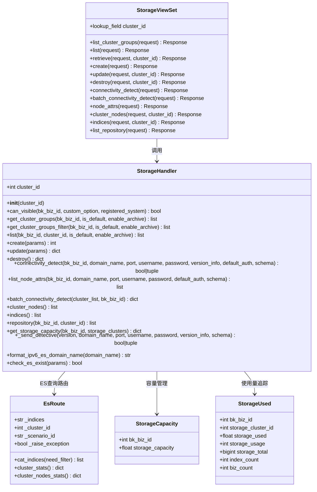
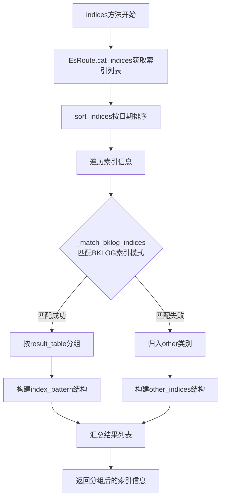
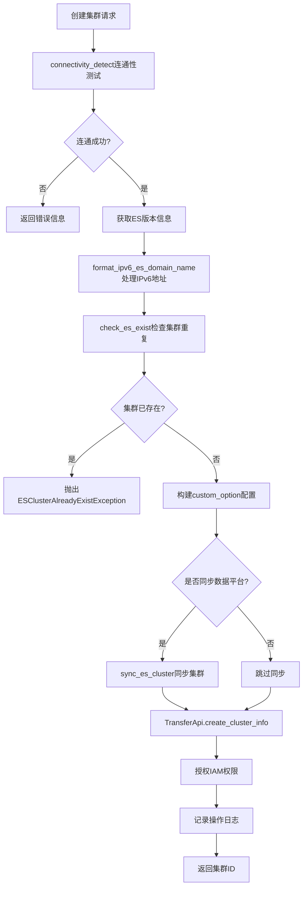
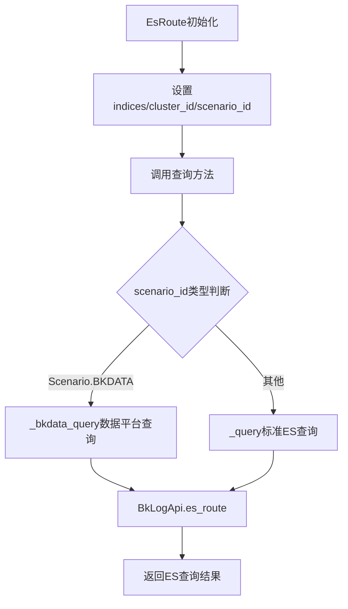

# ES存储管理技术文档

## 1. 概述

StorageHandler 是蓝鲸日志平台 中ES存储管理的核心组件，负责Elasticsearch集群的生命周期管理、连通性检测、索引管理及存储状态监控。该模块实现了多版本ES客户端兼容、IPv6地址支持、冷热数据架构等功能特性。

**文件位置：**
- 处理器：`apps/log_databus/handlers/storage.py`
- 视图层：`apps/log_databus/views/storage_views.py`
- ES客户端：`apps/log_esquery/utils/es_client.py`
- ES路由：`apps/log_esquery/utils/es_route.py`

---

## 2. 类图结构



---

## 3. ES连通性检测机制

### 3.1 连通性检测流程

```mermaid
flowchart TD
    A[connectivity_detect开始] --> B{是否有cluster_id?}
    B -->|是| C[从TransferApi获取集群信息]
    B -->|否| D[使用传入参数]

    C --> E[检查集群是否存在]
    E --> F[验证用户可见权限]
    F --> G[获取集群配置信息]
    G --> H[获取认证凭据]

    D --> I[直接使用传入的domain_name/port]
    H --> I

    I --> J[_send_detective执行检测]
    J --> K[es_socket_ping Socket层检测]
    K --> L{Socket连通?}
    L -->|否| M[抛出EsClientSocketException]
    L -->|是| N[get_es_client创建客户端]

    N --> O[es_client_ping ES认证检测]
    O --> P{认证成功?}
    P -->|否| Q[抛出EsClientAuthenticatorException]
    P -->|是| R{需要版本信息?}

    R -->|是| S[es_client.info获取版本]
    S --> T[dump_version_info解析版本]
    T --> U[返回(True, version_number)]
    R -->|否| V[返回(True, '')]
```

### 3.2 Socket层连通检测

**功能：** TCP层面的连通性检测，支持IPv4/IPv6双栈

```python
# apps/log_esquery/utils/es_client.py (第80-105行)
def es_socket_ping(host: str, port: int):
    """
    ES ping by socket
    """
    if not host or not port:
        raise EsClientHostPortException()

    es_address: tuple = (host, port)
    try:
        # 先尝试ipv4
        cs = socket.socket(socket.AF_INET, socket.SOCK_STREAM)
        cs.settimeout(2)
        status: int = cs.connect_ex(es_address)
    except socket.gaierror:  # ip协议不匹配时, 会抛出gaierror
        # ipv4失败，尝试ipv6
        cs = socket.socket(socket.AF_INET6, socket.SOCK_STREAM)
        cs.settimeout(2)
        status: int = cs.connect_ex(es_address)
    except Exception as e:  # pylint: disable=broad-except
        raise EsClientSocketException(
            EsClientSocketException.MESSAGE.format(error=_("IP or PORT can not be reached, %s").format(e=e))
        )

    if status != 0:
        raise EsClientSocketException(EsClientSocketException.MESSAGE.format(error=_("IP or PORT can not be reached")))
    cs.close()
```

### 3.3 ES客户端认证检测

```python
# apps/log_esquery/utils/es_client.py (第108-122行)
def es_client_ping(es_client):
    try:
        result = es_client.transport.perform_request("HEAD", "/", params=None)
    except (
        ElasticsearchExceptions.AuthenticationException,
        Elasticsearch5Exceptions.AuthenticationException,
        Elasticsearch6Exceptions.AuthenticationException,
    ):
        raise EsClientAuthenticatorException()
    except Exception as error:
        raise EsClientSocketException(EsClientSocketException.MESSAGE.format(error=error))
    if not result:
        raise EsClientSocketException(EsClientSocketException.MESSAGE.format(error=_("ES is not alive")))

    return result
```

### 3.4 多版本ES客户端适配

```python
# apps/log_esquery/utils/es_client.py (第40-77行)
def get_es_client(
    *,
    version: str,
    hosts: list,
    username: str,
    password: str,
    port: int,
    sniffer_timeout=600,
    verify_certs=False,
    **kwargs,
) -> Elasticsearch:
    # 根据版本加载客户端
    if version.startswith("5."):
        es_client = Elasticsearch5
    elif version.startswith("6."):
        es_client = Elasticsearch6
    else:
        es_client = Elasticsearch

    # 由于IPV6地址需要加[], 所以需要对hosts进行处理
    new_hosts = []
    for host in hosts:
        try:
            # 尝试将主机名解析为 IP 地址
            ip = ipaddress.ip_address(host)
            # 如果是 IPv6 地址，返回带方括号的格式
            if isinstance(ip, ipaddress.IPv6Address):
                host = f'[{host}]'
        except ValueError:
            # 如果不是有效的 IP 地址，返回原始主机名
            pass
        new_hosts.append(host)
    hosts = new_hosts

    http_auth = (username, password) if password else None
    return es_client(
        hosts, http_auth=http_auth, port=port, sniffer_timeout=sniffer_timeout, verify_certs=verify_certs, **kwargs
    )
```

---

## 4. 索引生命周期管理

### 4.1 索引信息获取流程



### 4.2 BKLOG索引匹配模式

```python
# apps/log_databus/constants.py (第32行)
BKLOG_RESULT_TABLE_PATTERN = rf"(({settings.TABLE_SPACE_PREFIX}_)?\d*?_{settings.TABLE_ID_PREFIX}_.*)_.*_.*"
```

### 4.3 索引排序算法

```python
# apps/log_databus/handlers/storage.py (第1112-1132行)
@staticmethod
def sort_indices(indices: list):
    def compare_indices_by_date(index_a, index_b):
        index_a = index_a.get("index")
        index_b = index_b.get("index")

        def convert_to_normal_date_tuple(index_name) -> tuple:
            # example 1: 2_bklog_xxxx_20200321_1 -> (20200321, 1)
            # example 2: 2_xxxx_2020032101 -> (20200321, 1)
            result = re.findall(r"(\d{8})_(\d{1,7})$", index_name) or re.findall(r"(\d{8})(\d{2})$", index_name)
            if result:
                return result[0][0], int(result[0][1])
            # not match
            return index_name, 0

        converted_index_a = convert_to_normal_date_tuple(index_a)
        converted_index_b = convert_to_normal_date_tuple(index_b)

        return (converted_index_a > converted_index_b) - (converted_index_a < converted_index_b)

    return sorted(indices, key=functools.cmp_to_key(compare_indices_by_date), reverse=True)
```

---

## 5. 存储配置与状态管理

### 5.1 集群配置管理流程



### 5.2 集群可见性判断逻辑

```python
# apps/log_databus/handlers/storage.py (第88-149行)
def can_visible(self, bk_biz_id, custom_option, registered_system) -> bool:
    # 兼容系统预置集群未设置集群ID的情况
    if registered_system == REGISTERED_SYSTEM_DEFAULT and not custom_option["bk_biz_id"]:
        return True

    # 兼容老数据没有visible_config的情况
    if not custom_option.get("visible_config") and bk_biz_id != custom_option["bk_biz_id"]:
        return False

    # 如果当前业务是创建业务 直接可见
    if bk_biz_id == custom_option["bk_biz_id"]:
        return True

    visible_config = custom_option["visible_config"]

    # 全业务可见
    if visible_config["visible_type"] == VisibleEnum.ALL_BIZ.value:
        return True

    # 当前租户可见
    if visible_config["visible_type"] == VisibleEnum.CURRENT_TENANT.value:
        return True

    if visible_config["visible_type"] == VisibleEnum.MULTI_BIZ.value:
        # 兼容两种数据格式：整数列表 [1, 2, 3] 或字典列表 [{"bk_biz_id": 1}, {"bk_biz_id": 2}]
        visible_bk_biz_id_list = []
        for bk_biz in visible_config["visible_bk_biz"]:
            if isinstance(bk_biz, dict):
                visible_bk_biz_id_list.append(str(bk_biz["bk_biz_id"]))
            else:
                visible_bk_biz_id_list.append(str(bk_biz))
        return str(bk_biz_id) in visible_bk_biz_id_list

    if visible_config["visible_type"] == VisibleEnum.BIZ_ATTR.value:
        # 业务属性可见性判断逻辑
        ...
    return False
```

### 5.3 可见性类型枚举

```python
# apps/log_databus/constants.py (第88-106行)
class VisibleEnum(ChoicesEnum):
    # 当前业务可见
    CURRENT_BIZ = "current_biz"
    # 多业务可见
    MULTI_BIZ = "multi_biz"
    # 当前租户可见
    CURRENT_TENANT = "current_tenant"
    # 全业务
    ALL_BIZ = "all_biz"
    # 业务属性可见
    BIZ_ATTR = "biz_attr"

    _choices_labels = (
        (CURRENT_BIZ, _("当前业务")),
        (MULTI_BIZ, _("多业务")),
        (CURRENT_TENANT, _("当前租户")),
        (ALL_BIZ, _("全业务")),
        (BIZ_ATTR, _("业务属性")),
    )
```

---

## 6. 批量连通性检测

### 6.1 批量检测流程

```mermaid
flowchart TD
    A[batch_connectivity_detect开始] --> B[创建MultiExecuteFunc]
    B --> C[遍历cluster_list]
    C --> D[为每个cluster_id添加任务]
    D --> E[_get_cluster_status_and_stats]

    E --> F[@cache_five_minute<br/>缓存检测结果]
    F --> G[BkLogApi.connectivity_detect]
    G --> H[EsRoute.cluster_stats]

    H --> I[MultiExecuteFunc.run并发执行]
    I --> J[汇总所有集群状态]
    J --> K[返回cluster_id -> status映射]
```

### 6.2 批量检测实现

```python
# apps/log_databus/handlers/storage.py (第937-974行)
@classmethod
def batch_connectivity_detect(cls, cluster_list, bk_biz_id):
    """
    :param cluster_list:
    :return:
    """
    multi_execute_func = MultiExecuteFunc()
    for _cluster_id in cluster_list:
        multi_execute_func.append(
            _cluster_id, cls._get_cluster_status_and_stats, {"cluster_id": _cluster_id, "bk_biz_id": bk_biz_id}
        )
    return multi_execute_func.run()

@staticmethod
def _get_cluster_status_and_stats(params):
    @cache_five_minute("connect_info_{cluster_id}")
    def _cache_status_and_stats(*, cluster_id, bk_biz_id):
        cluster_stats_info = None
        _status = False
        try:
            _status = BkLogApi.connectivity_detect(
                params={"bk_biz_id": bk_biz_id, "cluster_id": cluster_id, "default_auth": True},
            )
            cluster_stats = EsRoute(
                scenario_id=Scenario.ES, storage_cluster_id=cluster_id, raise_exception=False
            ).cluster_stats()
            if cluster_stats:
                cluster_stats_info = StorageHandler._build_cluster_stats(cluster_stats)
        except Exception as e:  # pylint: disable=broad-except
            logger.error(f"[storage] get cluster status failed => [{e}]")
        # connectivity_detect连通性正常返回的事[True, Version], 失败的时候返回的是False
        if isinstance(_status, list):
            _status = _status[0]
        return {"status": _status, "cluster_stats": cluster_stats_info}

    cluster_id = params.get("cluster_id")
    bk_biz_id = params.get("bk_biz_id")
    return _cache_status_and_stats(cluster_id=cluster_id, bk_biz_id=bk_biz_id)
```

### 6.3 集群状态统计构建

```python
# apps/log_databus/handlers/storage.py (第976-989行)
@staticmethod
def _build_cluster_stats(cluster_stats):
    nodes_count = cluster_stats["nodes"]["count"]
    return {
        "node_count": cluster_stats["nodes"]["count"]["total"],
        "shards_total": cluster_stats["indices"]["shards"].get("total", 0),
        "shards_pri": cluster_stats["indices"]["shards"].get("primaries", 0),
        "data_node_count": nodes_count.get("data_hot") or nodes_count.get("data_content") or nodes_count["data"],
        "indices_count": cluster_stats["indices"]["count"],
        "indices_docs_count": cluster_stats["indices"]["docs"]["count"],
        "indices_store": cluster_stats["indices"]["store"]["size_in_bytes"],
        "total_store": cluster_stats["nodes"]["fs"]["total_in_bytes"],
        "status": cluster_stats["status"],
    }
```

---

## 7. 存储容量管理

### 7.1 数据模型

```python
# apps/log_databus/models.py (第484-509行)
class StorageCapacity(OperateRecordModel):
    bk_biz_id = models.IntegerField(_("业务id"))
    storage_capacity = models.FloatField(_("容量"))

    class Meta:
        verbose_name = _("公共集群容量限制")
        verbose_name_plural = _("存储集群容量限制")
        ordering = ("-updated_at",)


class StorageUsed(OperateRecordModel):
    CLUSTER_INFO_BIZ_ID = 0

    bk_biz_id = models.IntegerField(_("业务id"))
    storage_cluster_id = models.IntegerField(_("集群ID"))
    storage_used = models.FloatField(_("已用容量"), default=0)
    storage_usage = models.IntegerField(_("容量使用率"), default=0)
    storage_total = models.BigIntegerField(_("总容量"), default=0)
    index_count = models.IntegerField(_("索引数量"), default=0)
    biz_count = models.IntegerField(_("业务数量"), default=0)

    class Meta:
        verbose_name = _("业务已用容量")
        verbose_name_plural = _("业务已用容量")
        ordering = ("-updated_at",)
        unique_together = ("bk_biz_id", "storage_cluster_id")
```

### 7.2 容量获取逻辑

```python
# apps/log_databus/handlers/storage.py (第1054-1071行)
@classmethod
def get_storage_capacity(cls, bk_biz_id, storage_clusters):
    storage = {"storage_capacity": 0, "storage_used": 0}
    if int(settings.ES_STORAGE_CAPACITY) <= 0:
        return storage
    biz_storage = StorageCapacity.objects.filter(bk_biz_id=bk_biz_id).first()
    storage["storage_capacity"] = int(settings.ES_STORAGE_CAPACITY)
    if biz_storage:
        storage["storage_capacity"] = biz_storage.storage_capacity

    storage_used = (
        StorageUsed.objects.filter(bk_biz_id=bk_biz_id, storage_cluster_id__in=storage_clusters)
        .all()
        .aggregate(total=Sum("storage_used"))
    )
    if storage_used:
        storage["storage_used"] = round(storage_used.get("total", 0) or 0, 2)
    return storage
```

---

## 8. 冷热数据架构支持

### 8.1 冷热节点信息获取

```python
# apps/log_databus/handlers/storage.py (第536-566行)
@staticmethod
def get_hot_warm_node_info(params: dict) -> (int, int):
    hot_node_num = 0
    warm_node_num = 0
    es_client = get_es_client(
        version=params["version"],
        hosts=[params["domain_name"]],
        username=params["auth_info"]["username"],
        password=params["auth_info"]["password"],
        port=params["port"],
        scheme=params["schema"],
    )
    if params.get("enable_hot_warm", False):
        hot_attr_name = params.get("hot_attr_name")
        hot_attr_value = params.get("hot_attr_value")
        warm_attr_name = params.get("warm_attr_name")
        warm_attr_value = params.get("warm_attr_value")
        nodeattrs = es_client.cat.nodeattrs(format="json", h="host,attr,value,ip")
        for nodeattr in nodeattrs:
            if nodeattr["attr"] == hot_attr_name and nodeattr["value"] == hot_attr_value:
                hot_node_num += 1
            elif nodeattr["attr"] == warm_attr_name and nodeattr["value"] == warm_attr_value:
                warm_node_num += 1
    else:
        nodes = es_client.cat.nodes(format="json")
        for node in nodes:
            if node.get("node.role", "").find("d") != -1:
                hot_node_num += 1
            else:
                warm_node_num += 1
    return hot_node_num, warm_node_num
```

### 8.2 集群节点属性获取

```python
# apps/log_databus/handlers/storage.py (第832-914行)
def list_node_attrs(
    self,
    bk_biz_id,
    domain_name=None,
    port=None,
    username=None,
    password=None,
    default_auth=False,
    schema=DEFAULT_ES_SCHEMA,
    **kwargs,
):
    """
    获取集群各节点的属性
    """
    version = ""
    if self.cluster_id:
        params = {"cluster_type": STORAGE_CLUSTER_TYPE, "cluster_id": int(self.cluster_id)}
        cluster_obj = TransferApi.get_cluster_info(params)[0]
        ...
        version = cluster_config.get("version", "")

    es_client = get_es_client(
        version=version, hosts=[domain_name], username=username, password=password, scheme=schema, port=port
    )
    # 数据节点
    datanode_list = []
    filter_datanode_list = []
    try:
        data = es_client.transport.perform_request("GET", "/_nodes/settings")
        nodes = data["nodes"]
        for node_key, node_info in nodes.items():
            node = node_info["settings"]["node"]
            attr = node_info["settings"]["node"]["attr"]
            additional_params = {
                "id": node_key,
                "name": node_info["name"],
                "ip": node_info["ip"],
                "host": node_info["host"],
            }
            result = self.flatten_json(attr, additional_params)
            # 是否存在 data key
            if "data" in node:
                if node["data"] == "true":
                    datanode_list.extend(result)
            else:
                datanode_list.extend(result)
    except Exception as e:
        raise NodeSettingException(NodeSettingException.MESSAGE.format(error_info=e))
    else:
        # 筛选节点
        for node in datanode_list:
            # 对节点属性进行过滤，有些是内置的，需要忽略
            if any(node["attr"].startswith(prefix) for prefix in NODE_ATTR_PREFIX_BLACKLIST):
                continue
            filter_datanode_list.append(node)
    return filter_datanode_list
```

---

## 9. 异常处理体系

```mermaid
classDiagram
    class BaseCollectorConfigException {
        +MODULE_CODE ErrorCode.BKLOG_COLLECTOR_CONFIG
        +MESSAGE 采集配置模块异常
    }

    class StorageNotExistException {
        +ERROR_CODE 201
        +MESSAGE 集群不存在
    }

    class StorageCreateException {
        +ERROR_CODE 202
        +MESSAGE bk_biz_id为必填字段
    }

    class StorageNotPermissionException {
        +ERROR_CODE 203
        +MESSAGE 权限异常
    }

    class StorageConnectException {
        +ERROR_CODE 204
        +MESSAGE 集群连接异常
    }

    class StorageUnKnowEsVersionException {
        +ERROR_CODE 206
        +MESSAGE 未知的ES服务端版本类型
    }

    class ESClusterAlreadyExistException {
        +ERROR_CODE 213
        +MESSAGE ES集群已存在
    }

    class NodeSettingException {
        +ERROR_CODE 910
        +MESSAGE ES集群节点配置获取失败
    }

    BaseCollectorConfigException <|-- StorageNotExistException
    BaseCollectorConfigException <|-- StorageCreateException
    BaseCollectorConfigException <|-- StorageNotPermissionException
    BaseCollectorConfigException <|-- StorageConnectException
    BaseCollectorConfigException <|-- StorageUnKnowEsVersionException
    BaseCollectorConfigException <|-- ESClusterAlreadyExistException
    BaseCollectorConfigException <|-- NodeSettingException
```



---

## 10. EsRoute 路由机制

### 10.1 路由查询流程



### 10.2 EsRoute核心实现

```python
# apps/log_esquery/utils/es_route.py (第28-86行)
class EsRoute:
    def __init__(self, indices=None, storage_cluster_id=None, scenario_id=None, raise_exception=True):
        self._indices = indices
        self._cluster_id = storage_cluster_id
        self._scenario_id = scenario_id
        self._raise_exception = raise_exception

    def cluster_stats(self):
        url = "_cluster/stats"
        return self._query(url)

    def cluster_nodes_stats(self):
        url = "_nodes/stats"
        return self._query(url)

    def _query(self, url):
        return BkLogApi.es_route(
            {
                "indices": self._indices if self._indices else "",
                "scenario_id": self._scenario_id,
                "storage_cluster_id": self._cluster_id if self._cluster_id is not None else 0,
                "url": url,
            },
            raise_exception=self._raise_exception,
        )
```

---

## 11. API接口映射

| API接口 | Handler方法 | 功能描述 |
|---------|------------|---------|
| `GET /databus/storage/cluster_groups/` | `get_cluster_groups_filter` | 获取存储集群分组列表 |
| `GET /databus/storage/` | `list` | 获取集群详细列表 |
| `GET /databus/storage/$cluster_id/` | `list` (带cluster_id) | 获取单个集群详情 |
| `POST /databus/storage/` | `create` | 创建ES集群 |
| `PUT /databus/storage/$cluster_id/` | `update` | 更新集群配置 |
| `DELETE /databus/storage/$cluster_id/` | `destroy` | 删除集群 |
| `POST /databus/storage/connectivity_detect/` | `connectivity_detect` | 连通性测试 |
| `POST /databus/storage/batch_connectivity_detect/` | `batch_connectivity_detect` | 批量连通性测试 |
| `POST /databus/storage/node_attrs/` | `list_node_attrs` | 获取节点属性 |
| `GET /databus/storage/$cluster_id/cluster_nodes` | `cluster_nodes` | 获取集群节点信息 |
| `GET /databus/storage/$cluster_id/indices` | `indices` | 获取索引信息 |
| `GET /databus/storage/list_repository/` | `repository` | 获取快照仓库列表 |

---

## 12. 设计模式总结

| 设计模式 | 应用场景 |
|---------|---------|
| **工厂模式** | `get_es_client` 根据版本动态创建不同ES客户端实例 |
| **策略模式** | 多版本ES客户端适配策略（5.x/6.x/7.x） |
| **缓存模式** | `@cache_five_minute` 缓存集群连通性检测结果 |
| **并发执行模式** | `MultiExecuteFunc` 批量并发检测集群状态 |

---

**文档版本**: v1.0
**生成日期**: 2026-04-30
**源文件**: `apps/log_databus/handlers/storage.py`