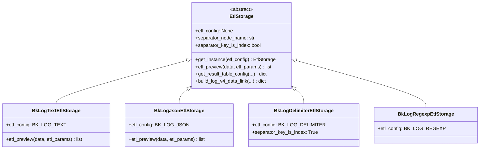
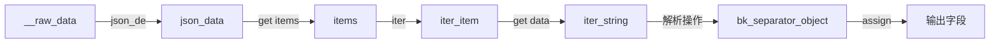

# 清洗策略模式详解

> 聚焦：apps/log_databus/handlers/etl_storage/
> 四种清洗策略的详细实现解析

## 1. 四种清洗策略

BKLOG 日志平台支持四种清洗策略，对应不同的日志格式解析需求：

| 策略名称 | 常量值 | 中文描述 | 适用场景 | 解析方式 |
|---------|--------|---------|---------|---------|
| BK_LOG_TEXT | `bk_log_text` | 直接入库 | 无需解析的原始日志 | 直接存储原文 |
| BK_LOG_JSON | `bk_log_json` | JSON | JSON格式日志 | JSON字段解析 |
| BK_LOG_DELIMITER | `bk_log_delimiter` | 分隔符 | 结构化分隔日志 | 按分隔符切分 |
| BK_LOG_REGEXP | `bk_log_regexp` | 正则 | 复杂格式日志 | 正则表达式提取 |

### 常量定义（constants.py 第388-407行）

```python
class EtlConfig:
    BK_LOG_TEXT = "bk_log_text"
    BK_LOG_JSON = "bk_log_json"
    BK_LOG_DELIMITER = "bk_log_delimiter"
    BK_LOG_REGEXP = "bk_log_regexp"
    CUSTOM = "custom"

class EtlConfigChoices(ChoicesEnum):
    _choices_labels = (
        (EtlConfig.BK_LOG_TEXT, _("直接入库")),
        (EtlConfig.BK_LOG_JSON, _("Json")),
        (EtlConfig.BK_LOG_DELIMITER, _("分隔符")),
        (EtlConfig.BK_LOG_REGEXP, _("正则")),
    )
```

## 2. EtlStorage 工厂类

### 完整代码片段（base.py 第63-87行）

```python
class EtlStorage:
    """
    清洗入库
    """

    # 子类需重载
    etl_config = None
    separator_node_name = "bk_separator_object"
    path_separator_node_name = "bk_separator_object_path"
    separator_key_is_index = False

    @classmethod
    def get_instance(cls, etl_config=None):
        mapping = {
            EtlConfig.BK_LOG_TEXT: "BkLogTextEtlStorage",
            EtlConfig.BK_LOG_JSON: "BkLogJsonEtlStorage",
            EtlConfig.BK_LOG_DELIMITER: "BkLogDelimiterEtlStorage",
            EtlConfig.BK_LOG_REGEXP: "BkLogRegexpEtlStorage",
        }
        try:
            etl_storage = import_string(f"apps.log_databus.handlers.etl_storage.{etl_config}.{mapping.get(etl_config)}")
            return etl_storage()
        except ImportError as error:
            raise NotImplementedError(f"{etl_config} not implement, error: {error}")
```

### 类关系图



## 3. 各策略详解

### 3.1 BkLogTextEtlStorage - 直接入库

直接入库策略不做任何字段解析，将日志原文直接存入 `log` 字段。

```python
class BkLogTextEtlStorage(EtlStorage):
    etl_config = EtlConfig.BK_LOG_TEXT

    def etl_preview(self, data, etl_params) -> list:
        """字段提取预览 - 直接返回原始数据"""
        return data

    def get_result_table_config(self, fields, etl_params, built_in_config, ...):
        """配置清洗入库策略"""
        original_text_field = {
            "field_name": "log",
            "field_type": "string",
            "alias_name": "data",
            "option": {"es_type": "text"}
        }
        # 构建结果表配置...
```

### 3.2 BkLogJsonEtlStorage - JSON解析

JSON清洗策略解析 JSON 格式日志，提取字段并映射到 ES 字段。

**etl_params 配置参数**：

| 参数名 | 类型 | 说明 |
|-------|------|------|
| retain_original_text | bool | 是否保留原文 |
| etl_flat | bool | 是否扁平化 |
| retain_extra_json | bool | 是否保留未定义的JSON字段 |
| enable_retain_content | bool | 非JSON格式时是否保留原文 |

```python
class BkLogJsonEtlStorage(EtlStorage):
    etl_config = EtlConfig.BK_LOG_JSON

    def etl_preview(self, data, etl_params=None) -> list:
        """字段提取预览 - JSON解析"""
        return preview("json", data)

    def etl_preview_v4(self, data, etl_params=None) -> list:
        """V4版本预览 - 调用BkDataDatabusApi"""
        api_request = {
            "input": data,
            "rules": [{
                "input_id": "__raw_data",
                "output_id": "bk_separator_object",
                "operator": {"type": "json_de"}
            }]
        }
        api_response = BkDataDatabusApi.databus_clean_debug(api_request)
        # 解析并返回结果...
```

### 3.3 BkLogDelimiterEtlStorage - 分隔符切分

分隔符策略按指定分隔符切分日志，使用索引映射字段。

**配置参数**：

| 参数名 | 类型 | 说明 |
|-------|------|------|
| separator | str | 分隔符（如 `,`、`\t`） |
| separator_field_list | list | 字段名列表，按位置映射 |

```python
class BkLogDelimiterEtlStorage(EtlStorage):
    etl_config = EtlConfig.BK_LOG_DELIMITER
    separator_key_is_index = True  # 使用索引定位

    def etl_preview(self, data, etl_params=None) -> list:
        """字段提取预览 - 分隔符切分"""
        values = data.split(etl_params["separator"])
        result = []
        for index, key in enumerate(values):
            result.append({"field_index": index + 1, "value": values[index]})
        return result
```

### 3.4 BkLogRegexpEtlStorage - 正则提取

正则策略通过命名捕获组提取字段。

**配置参数**：

| 参数名 | 类型 | 说明 |
|-------|------|------|
| separator_regexp | str | 正则表达式（命名捕获组） |

```python
class BkLogRegexpEtlStorage(EtlStorage):
    etl_config = EtlConfig.BK_LOG_REGEXP

    def etl_preview(self, data, etl_params=None) -> list:
        """字段提取预览 - 正则匹配"""
        regexp_match = re.compile(etl_params["separator_regexp"], re.S).match(data)
        if not regexp_match:
            raise ValidationError(_("无法匹配正则表达式"))
        groupdict = regexp_match.groupdict()
        # 提取命名捕获组字段...
```

## 4. V4 数据链路设计

V4版本采用 **clean_rules** 规则链设计，数据流转过程：



**规则链核心操作类型**：

| 操作类型 | 说明 |
|---------|------|
| `json_de` | JSON解析 |
| `get` | 字段提取 |
| `iter` | 数组迭代 |
| `split_str` | 分隔符切分 |
| `regex` | 正则解析 |
| `assign` | 字段赋值 |

## 5. 如何扩展新清洗类型

扩展新的清洗类型需要以下步骤：

1. **定义常量**：在 `constants.py` 中添加新的 EtlConfig 常量
2. **创建模块**：在 `etl_storage/` 目录下创建新模块
3. **注册工厂**：在 `mapping` 字典中添加映射

---

**文档版本**: v1.0
**生成日期**: 2026-04-30
**源码路径**: `apps/log_databus/handlers/etl_storage/`