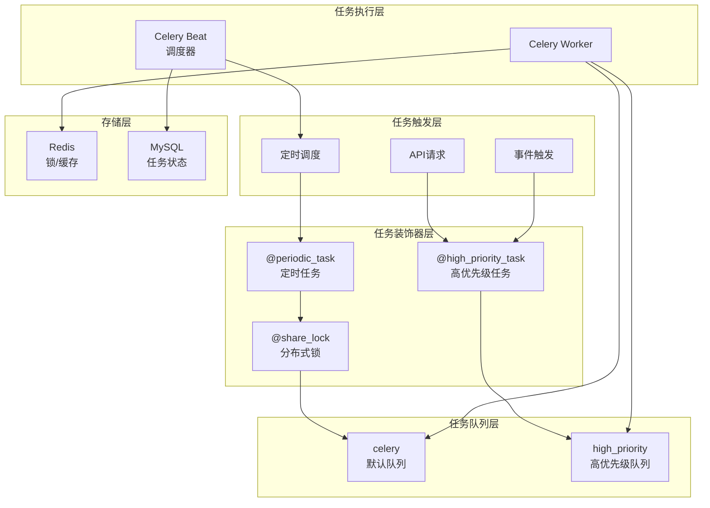
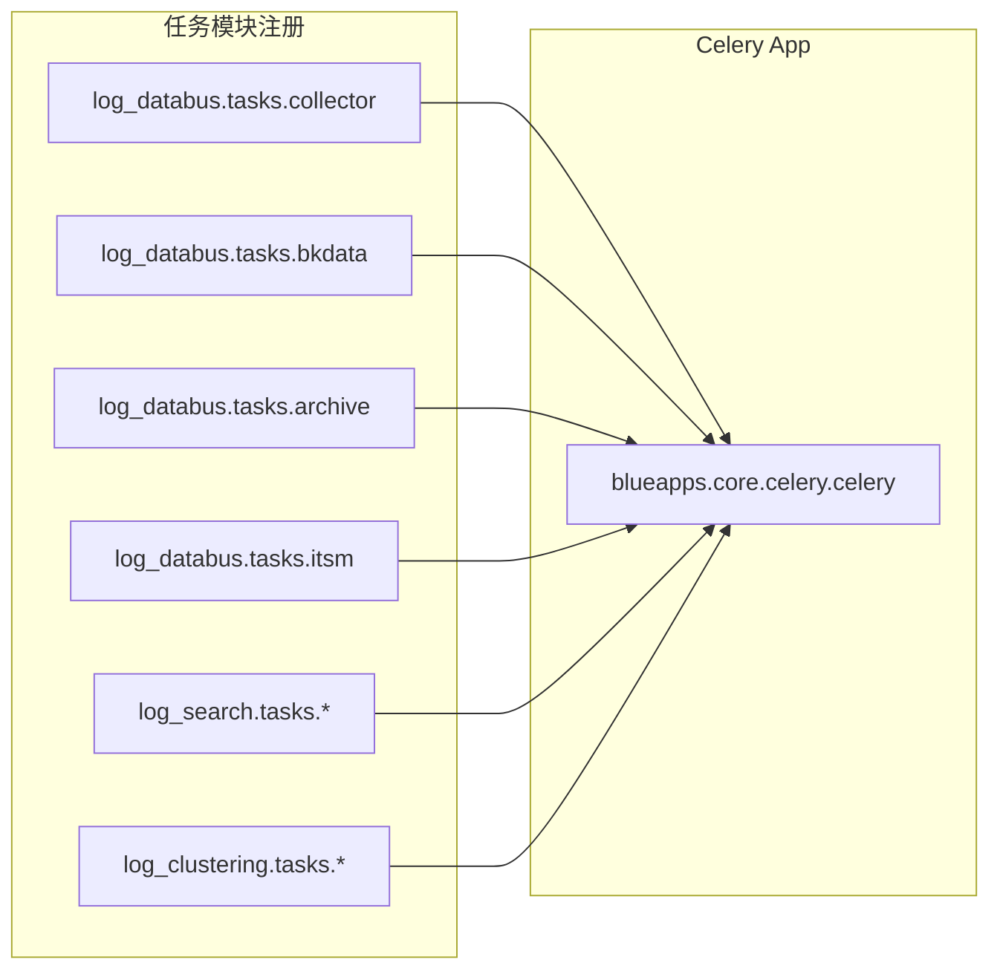
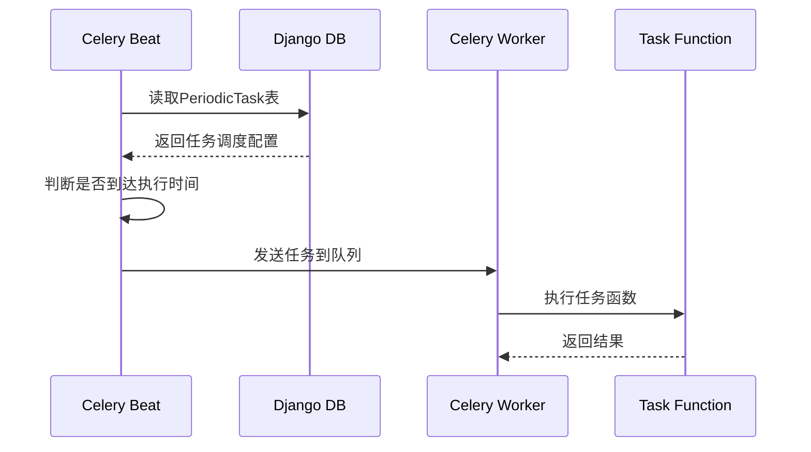
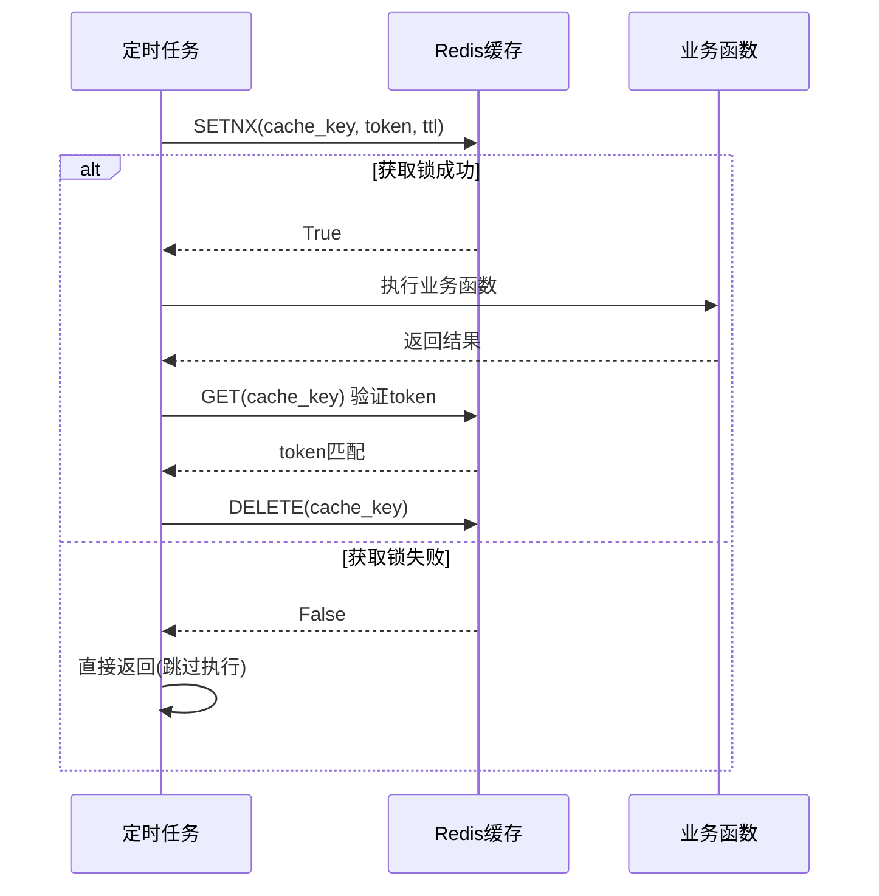
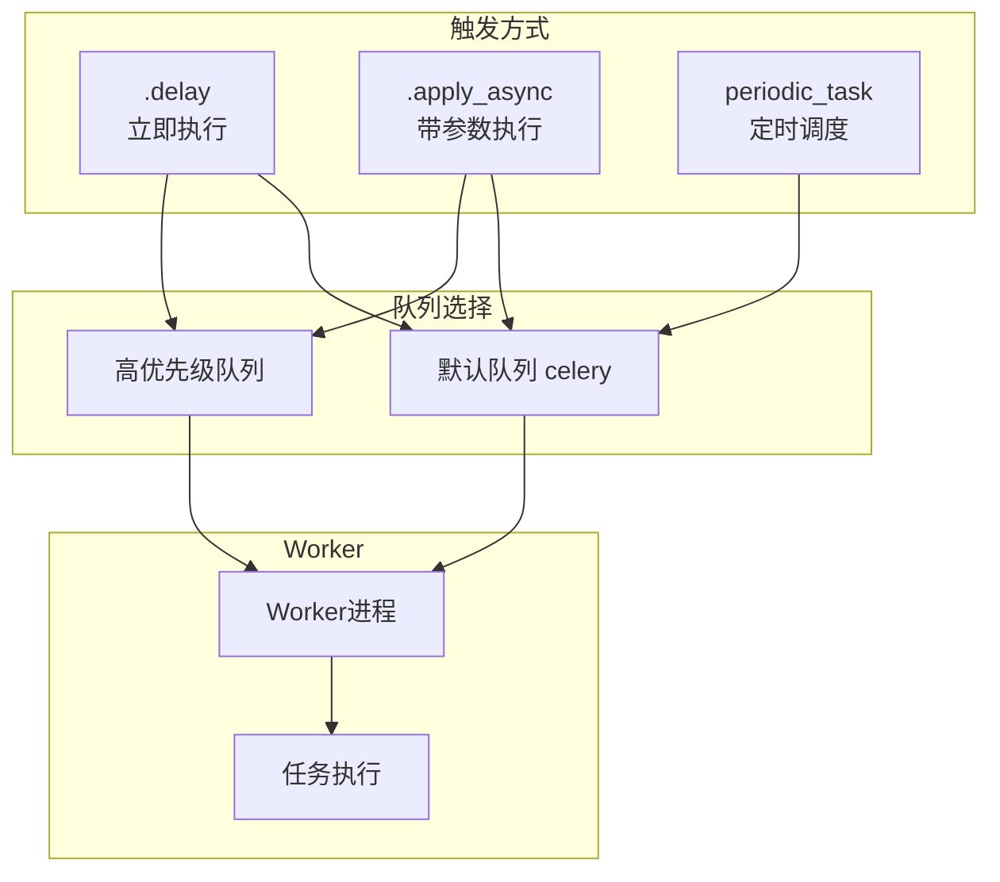
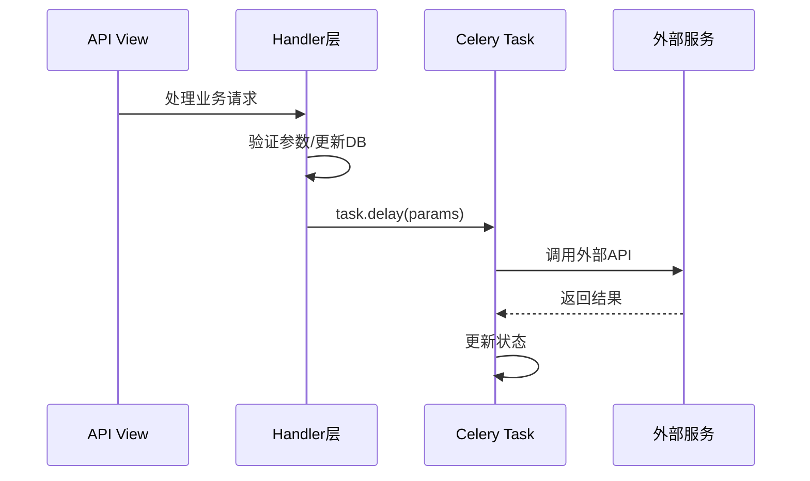
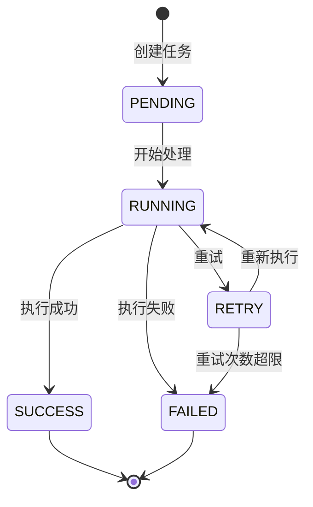
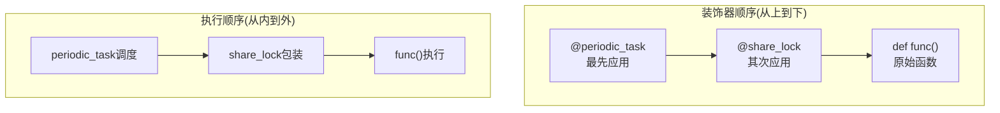
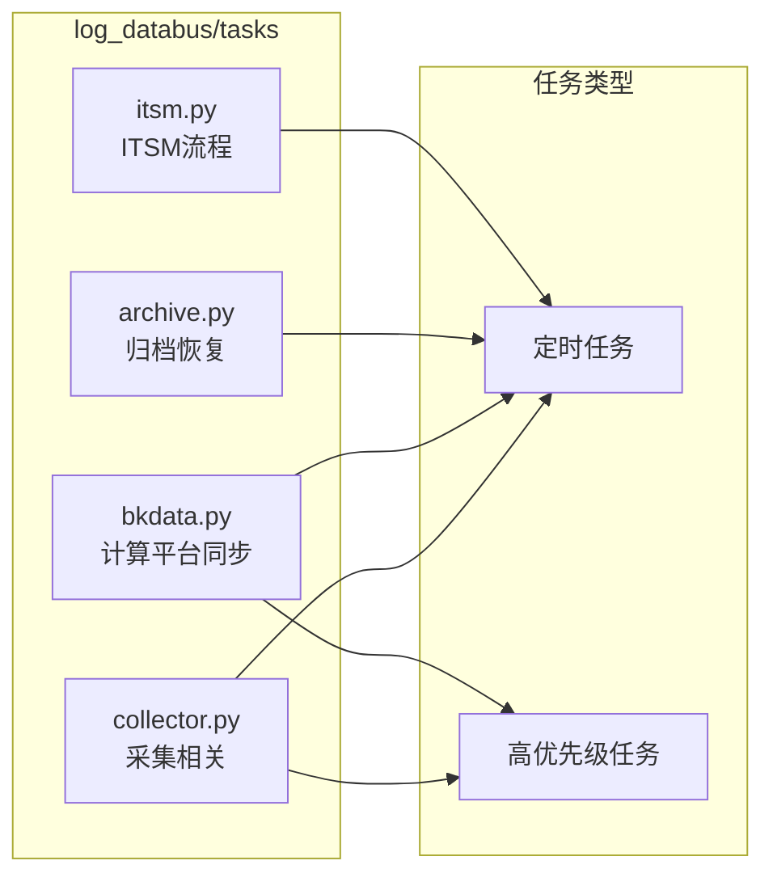
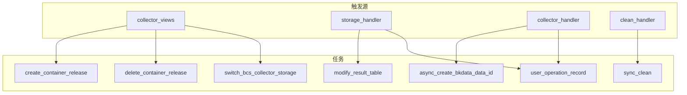

# BKLOG异步任务设计

## 一、概述

BKLOG基于Celery构建了完整的异步任务处理体系，通过多种装饰器和任务队列实现了灵活的任务调度机制。本文档详细解析Celery任务架构设计、装饰器实现原理及任务调度流程。

## 二、Celery架构设计

### 2.1 整体架构



### 2.2 Celery配置

Celery核心配置位于 `config/default.py` (第189-262行):

```python
# config/default.py:189-262
# CELERY相关配置
IS_USE_CELERY = True

IS_CELERY = False
IS_CELERY_BEAT = False
if "celery" in sys.argv:
    IS_CELERY = True
    if "beat" in sys.argv:
        IS_CELERY_BEAT = True

# CELERY 并发数
CELERYD_CONCURRENCY = os.getenv("BK_CELERYD_CONCURRENCY", 2)

CELERY_TASK_SERIALIZER = "pickle"
CELERY_ACCEPT_CONTENT = ["pickle"]

# CELERY 配置，申明任务的文件路径
CELERY_IMPORTS = (
    "apps.log_search.tasks.bkdata",
    "apps.log_search.tasks.async_export",
    "apps.log_search.tasks.project",
    "apps.log_search.tasks.space",
    "apps.log_search.tasks.cmdb",
    "apps.log_search.handlers.index_set",
    "apps.log_search.tasks.mapping",
    "apps.log_search.tasks.no_data",
    "apps.log_databus.tasks.collector",
    "apps.log_databus.tasks.itsm",
    "apps.log_databus.tasks.bkdata",
    "apps.log_databus.tasks.archive",
    "apps.log_measure.tasks.report",
    "apps.log_extract.tasks",
    "apps.log_clustering.tasks.msg",
    "apps.log_clustering.tasks.sync_pattern",
    "apps.log_clustering.tasks.subscription",
    "apps.log_extract.tasks.extract",
)

# 高优先级队列配置
BK_LOG_HIGH_PRIORITY_QUEUE = os.getenv("BKAPP_HIGH_PRIORITY_QUEUE", "celery")
```

### 2.3 任务模块注册

任务模块通过 `CELERY_IMPORTS` 显式注册，确保Celery能够发现并加载所有任务函数。



## 三、任务装饰器详解

### 3.1 `@periodic_task` 定时任务装饰器

#### 3.1.1 定义与导入

`periodic_task` 来自蓝鲸框架的扩展模块：

```python
# apps/utils/task.py:11
from blueapps.contrib.celery_tools.periodic import periodic_task
from blueapps.core.celery.celery import app
```

#### 3.1.2 使用示例

定时任务通过 `run_every` 参数配合 `crontab` 定义执行周期：

```python
# apps/log_databus/tasks/collector.py:99-121
@periodic_task(run_every=crontab(minute="0", hour="1"))
def collector_status():
    """
    检测采集项：24小时未入库自动停止
    :return:
    """
    # 筛选24小时未入库的采集项
    day_ago = datetime.datetime.now(pytz.timezone("UTC")) - datetime.timedelta(days=1)
    collector_configs = CollectorConfig.objects.filter(
        table_id=None, is_active=True, created_at__lt=day_ago, collector_plugin_id=None
    ).exclude(itsm_ticket_status=CollectItsmStatus.APPLYING)
    # 停止采集项
    for _collector in collector_configs:
        if (
            FeatureToggleObject.switch(FEATURE_BKDATA_DATAID)
            and _collector.bkdata_data_id
            and BkDataDatabusApi.get_cleans(
                params={"raw_data_id": _collector.bkdata_data_id, "bk_biz_id": _collector.bk_biz_id}
            )
        ):
            continue
        CollectorHandler.get_instance(_collector.collector_config_id).stop()
```

#### 3.1.3 定时任务调度流程



#### 3.1.4 定时任务清单

| 任务名 | 模块 | 执行周期 | 功能 |
|--------|------|----------|------|
| `collector_status` | collector.py | 每天1:00 | 检测24小时未入库采集项并停止 |
| `sync_storage_capacity` | collector.py | 每小时 | 同步集群存储容量统计 |
| `create_custom_log_group` | collector.py | 每小时 | 创建Otlp Log的Log Group |
| `review_bkdata_data_id` | bkdata.py | 每天3:30 | 同步未注册的data_id到计算平台 |
| `review_clean` | bkdata.py | 每30分钟 | 同步计算平台入库列表 |
| `clean_expired_restore_index_set` | archive.py | 每天1:00 | 清理过期恢复索引集 |
| `check_restore_is_done_and_notice_user` | archive.py | 每1分钟 | 检查恢复任务完成状态 |
| `failed_ticket_clean` | itsm.py | 每5分钟 | 处理ITSM回调失败单据 |
| `sync` | project.py | 每1分钟 | 同步CMDB业务信息 |
| `no_data_check` | no_data.py | 每15分钟 | 检查索引集无数据状态 |
| `send_subscription_task` | subscription.py | 每1分钟 | 发送聚类订阅报告 |

### 3.2 `@high_priority_task` 高优先级任务装饰器

#### 3.2.1 实现原理

```python
# apps/utils/task.py:16-18
def high_priority_task(*args, **kwargs):
    """高优先级任务"""
    return app.task(*args, **dict({'queue': settings.BK_LOG_HIGH_PRIORITY_QUEUE}, **kwargs))
```

装饰器将任务路由到高优先级队列，确保关键任务优先执行。

#### 3.2.2 高优先级周期任务

```python
# apps/utils/task.py:21-23
def high_priority_periodic_task(*args, **options):
    """高优先级周期任务"""
    return periodic_task(*args, **dict({'queue': settings.BK_LOG_HIGH_PRIORITY_QUEUE}, **options))
```

#### 3.2.3 使用示例

```python
# apps/log_databus/tasks/collector.py:64-96
@high_priority_task(ignore_result=True)
def shutdown_collector_warm_storage_config(cluster_id):
    """异步关闭冷热集群的采集项"""
    result_table_list = []
    for collector in CollectorConfig.objects.all():
        if not collector.table_id:
            continue
        result_table_list.append(collector.table_id)

    if not result_table_list:
        return

    cluster_infos = CollectorHandler.bulk_cluster_infos(result_table_list=result_table_list)
    for collector in CollectorConfig.objects.all():
        try:
            if not collector.table_id:
                continue
            cluster_info = cluster_infos.get(collector.table_id)
            if not cluster_info:
                continue
            if cluster_info["cluster_config"]["cluster_id"] != cluster_id:
                continue
            TransferApi.modify_result_table(
                {
                    "table_id": collector.table_id,
                    "default_storage": "elasticsearch",
                    "default_storage_config": {"warm_phase_days": 0},
                    "bk_biz_id": collector.bk_biz_id,
                }
            )
        except Exception as e:
            logger.error("refresh collector storage config error", e)
            continue
```

#### 3.2.4 高优先级任务清单

| 任务名 | 模块 | 功能描述 |
|--------|------|----------|
| `shutdown_collector_warm_storage_config` | collector.py | 关闭冷热集群采集项配置 |
| `create_container_release` | collector.py | 创建容器采集配置下发 |
| `delete_container_release` | collector.py | 删除容器采集配置 |
| `switch_bcs_collector_storage` | collector.py | 切换BCS采集存储集群 |
| `update_collector_storage_config` | collector.py | 更新采集项存储配置 |
| `modify_result_table` | collector.py | 更新结果表 |
| `async_create_bkdata_data_id` | bkdata.py | 异步创建计算平台data_id |
| `sync_clean` | bkdata.py | 同步清洗规则 |
| `send` | subscription.py | 发送聚类订阅通知 |
| `user_operation_record` | decorators.py | 记录用户操作日志 |

### 3.3 `@share_lock` 分布式锁装饰器

#### 3.3.1 实现原理

```python
# apps/utils/lock.py:98-133
def share_lock(ttl=600, identify=None):
    """
    装饰定时任务时需要放在periodic_task下面
    @periodic_task(run_every=crontab(minute="*/1"), queue="sync")
    # 不填参数需要带括号执行
    @share_lock()
    def demo():
        pass
    :param ttl: 锁过期时间(秒)
    :param identify: 锁标识符，用于区分不同模块的同名函数
    :return:
    """

    def wrapper(func):
        @functools.wraps(func)
        def _inner(*args, **kwargs):
            if not settings.USE_REDIS:
                return func(*args, **kwargs)
            token = str(time.time())
            # 防止函数重名导致方法失效，增加一个ID参数
            cache_key = "celery_%s" % func.__name__ if identify is None else identify
            client = cache
            lock_success = client.set(cache_key, token, timeout=ttl, nx=True)
            if not lock_success:
                return

            try:
                return func(*args, **kwargs)
            finally:
                if client.get(cache_key) == token:
                    client.delete(cache_key)

        return _inner

    return wrapper
```

#### 3.3.2 分布式锁工作流程



#### 3.3.3 使用示例

`share_lock` 必须放在 `periodic_task` 下方：

```python
# apps/log_search/tasks/project.py:40-48
@periodic_task(run_every=crontab(minute="*/1"))
@share_lock()
def sync():
    if settings.USING_SYNC_BUSINESS:
        # 同步CMDB业务信息
        sync_projects()
        sync_biz_property()
        return True
    return False
```

```python
# apps/log_search/tasks/no_data.py:23-58
@periodic_task(run_every=crontab(minute="*/15"))
@share_lock()
def no_data_check():
    logger.info("[no_data_check] start check index set no data")
    index_set_ids = list(
        UserIndexSetSearchHistory.objects.filter(created_at__gte=datetime.now() - timedelta(days=1)).values_list(
            "index_set_id", flat=True
        )
    )
    # ... 业务逻辑
```

#### 3.3.4 锁机制设计要点

| 参数 | 说明 | 默认值 |
|------|------|--------|
| `ttl` | 锁过期时间，防止死锁 | 600秒 |
| `identify` | 自定义锁标识，解决函数名冲突问题 | `celery_{func.__name__}` |

**设计亮点**：
1. **NX模式**：使用 `set(key, value, nx=True)` 保证原子性获取锁
2. **Token验证**：执行完成后验证token防止误删其他进程的锁
3. **自动过期**：TTL机制确保锁最终释放
4. **优雅降级**：未启用Redis时直接执行函数

### 3.4 `RedisLock` 类实现

#### 3.4.1 基础锁类

```python
# apps/utils/lock.py:32-49
class BaseLock(object):
    def __init__(self, name, ttl=None):
        self.name = name
        # 默认60秒过期
        self.ttl = ttl or 60

    def acquire(self, _wait=None):
        raise NotImplementedError

    def release(self):
        raise NotImplementedError

    def __exit__(self, t, v, tb):
        self.release()

    def __enter__(self):
        self.acquire()
        return self
```

#### 3.4.2 Redis锁实现

```python
# apps/utils/lock.py:52-77
class RedisLock(BaseLock):
    __token = None

    def __init__(self, name, ttl=None):
        super(RedisLock, self).__init__(name, ttl)
        self.client = cache

    def acquire(self, _wait=0.001):
        token = uniqid()
        wait_until = time.time() + _wait
        while not self.client.set(self.name, token, timeout=self.ttl, nx=True):
            if time.time() < wait_until:
                time.sleep(0.01)
            else:
                return False

        self.__token = token
        return True

    def release(self):
        if not self.__token:
            return False
        token = self.client.get(self.name)
        if not token or token != self.__token:
            return False
        return self.client.delete(self.name)
```

#### 3.4.3 服务锁上下文管理器

```python
# apps/utils/lock.py:80-95
@contextmanager
def service_lock(key_instance, **kwargs):
    lock = None
    lock_key = key_instance.get_key(**kwargs)
    try:
        lock = RedisLock(lock_key, key_instance.ttl)
        if lock.acquire(0.1):
            yield lock
        else:
            raise LockError(msg="{} is already locked".format(lock_key))
    except LockError as err:
        raise err

    finally:
        if lock is not None:
            lock.release()
```

## 四、任务调度与执行

### 4.1 任务触发方式



### 4.2 任务调用示例

#### 4.2.1 delay方式

```python
# apps/log_databus/handlers/collector/host.py:375
async_create_bkdata_data_id.delay(self.data.collector_config_id)

# apps/log_databus/handlers/storage.py:751
shutdown_collector_warm_storage_config.delay(int(self.cluster_id))

# apps/log_databus/handlers/collector/k8s.py:1672
create_container_release.delay(
    bcs_cluster_id=bcs_cluster_id,
    container_config_id=container_config_id,
    config_name=config_name,
    config_params=config_params,
)
```

#### 4.2.2 任务调用链分析



### 4.3 任务执行状态管理

#### 4.3.1 容器采集状态更新

```python
# apps/log_databus/tasks/collector.py:335-365
@high_priority_task(ignore_result=True)
def create_container_release(bcs_cluster_id: str, container_config_id: int, config_name: str, config_params: dict):
    for __ in range(RETRY_TIMES):
        try:
            container_config: ContainerCollectorConfig = ContainerCollectorConfig.objects.get(pk=container_config_id)
            container_config.status = ContainerCollectStatus.RUNNING.value
            container_config.status_detail = _("配置下发中")
            container_config.save(update_fields=["status", "status_detail"])
            break
        except ContainerCollectorConfig.objects.DoesNotExist:
            # db的事务可能还未结束，这里需要重试
            time.sleep(WAIT_FOR_RETRY)
        except Exception as e:
            logger.error(f"[create_container_release] get container config failed: {e}")
            raise e

    try:
        labels = None
        if settings.CONTAINER_COLLECTOR_CR_LABEL_BKENV:
            labels = {"bk_env": settings.CONTAINER_COLLECTOR_CR_LABEL_BKENV}
        Bcs(bcs_cluster_id).save_bklog_config(bklog_config_name=config_name, bklog_config=config_params, labels=labels)
        container_config.status = ContainerCollectStatus.SUCCESS.value
        container_config.status_detail = _("配置下发成功")
    except Exception as e:
        logger.exception("[create_container_release] save bklog config failed: %s", e)
        container_config.status = ContainerCollectStatus.FAILED.value
        container_config.status_detail = _("配置下发失败: {reason}").format(reason=e)
    container_config.save(update_fields=["status", "status_detail"])
```

#### 4.3.2 状态流转图



### 4.4 任务重试机制

```python
# apps/log_databus/tasks/collector.py:337-352
for __ in range(RETRY_TIMES):
    try:
        container_config: ContainerCollectorConfig = ContainerCollectorConfig.objects.get(pk=container_config_id)
        container_config.status = ContainerCollectStatus.RUNNING.value
        container_config.status_detail = _("配置下发中")
        container_config.save(update_fields=["status", "status_detail"])
        break
    except ContainerCollectorConfig.objects.DoesNotExist:
        # db的事务可能还未结束，这里需要重试
        time.sleep(WAIT_FOR_RETRY)
```

## 五、装饰器组合使用

### 5.1 定时任务+分布式锁

```python
# apps/log_search/tasks/project.py:40-48
@periodic_task(run_every=crontab(minute="*/1"))
@share_lock()
def sync():
    if settings.USING_SYNC_BUSINESS:
        sync_projects()
        sync_biz_property()
        return True
    return False
```

### 5.2 高优先级任务+忽略结果

```python
# apps/log_databus/tasks/bkdata.py:54-56
@high_priority_task(ignore_result=True)
def async_create_bkdata_data_id(collector_config_id: int, platform_username: str = None):
    create_bkdata_data_id(CollectorConfig.objects.get(collector_config_id=collector_config_id), platform_username)
```

### 5.3 装饰器顺序

装饰器应用顺序遵循"从外到内"原则：



**重要规则**：`@share_lock` 必须放在 `@periodic_task` 下方，确保锁机制在任务执行前生效。

## 六、任务模块架构

### 6.1 log_databus任务模块



### 6.2 任务调用关系



## 七、最佳实践

### 7.1 任务设计原则

1. **任务粒度控制**：单个任务执行时间不宜过长
2. **幂等性设计**：任务可重复执行不产生副作用
3. **异常处理**：使用try-catch捕获异常并记录日志
4. **结果忽略**：不需要结果的任务使用 `ignore_result=True`

### 7.2 分布式锁使用建议

```python
# 正确使用方式
@periodic_task(run_every=crontab(minute="*/1"))
@share_lock(identify="module_unique_id")  # 唯一标识防止冲突
def task_func():
    pass

# 错误使用方式 - 装饰器顺序错误
@share_lock()  # 错误：锁装饰器应该在periodic_task下方
@periodic_task(run_every=crontab(minute="*/1"))
def task_func():
    pass
```

### 7.3 高优先级任务适用场景

- 用户请求触发的异步操作
- 需要快速响应的配置下发
- 关键业务状态更新
- 实时通知发送

## 八、总结

BKLOG的异步任务架构通过Celery框架结合多种装饰器实现了灵活的任务调度：

| 装饰器 | 功能 | 使用场景 |
|--------|------|----------|
| `@periodic_task` | 定时任务 | 数据同步、状态检查、定期清理 |
| `@high_priority_task` | 高优先级队列 | 用户操作、实时响应、关键业务 |
| `@share_lock` | 分布式锁 | 多实例部署、防止重复执行 |

通过合理的装饰器组合和任务模块划分，BKLOG构建了高效可靠的异步任务处理体系。

---
**版本**: v1.0
**日期**: 2026-04-30
**源码位置**: `apps/utils/task.py`, `apps/utils/lock.py`, `apps/log_databus/tasks/`