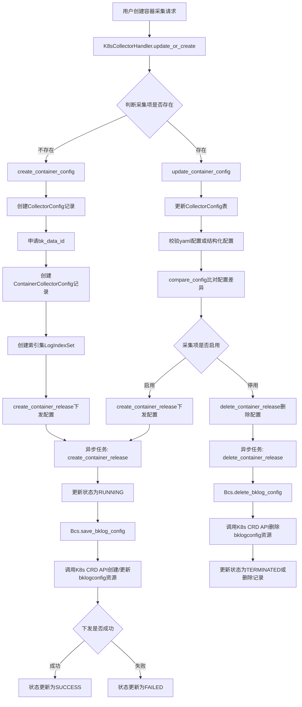
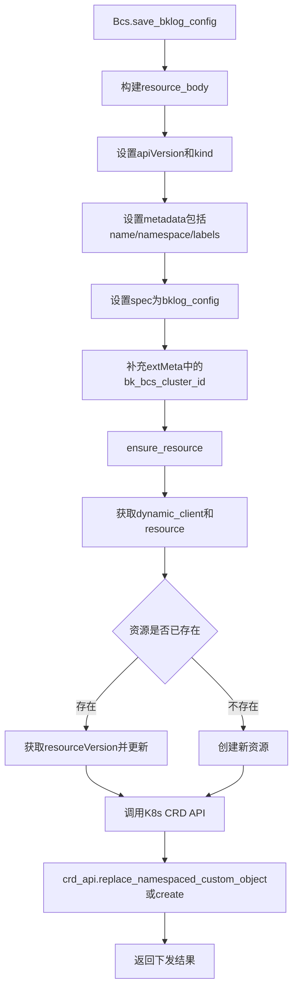
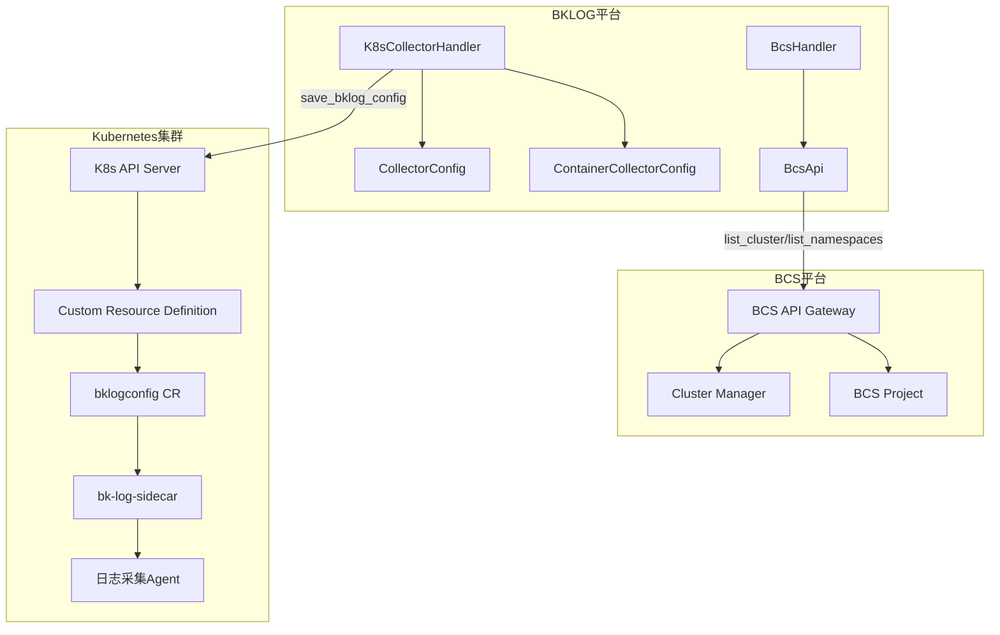

# BKLOG 容器采集实现技术文档

## 一、概述

BKLOG 容器采集模块通过 Kubernetes API 与 BCS（蓝鲸容器服务）平台交互，实现容器环境下的日志采集配置管理。核心实现位于 `apps/log_databus/handlers/collector/k8s.py`，主要通过 `K8sCollectorHandler` 类和 `Bcs` 工具类完成容器采集配置的创建、更新、下发和删除等操作。

## 二、核心类结构

### 2.1 K8sCollectorHandler 类

**文件位置**: `apps/log_databus/handlers/collector/k8s.py` (第 112-117 行)

```python
class K8sCollectorHandler(CollectorHandler):
    FAST_CREATE_SERIALIZER = FastContainerCollectorCreateSerializer
    FAST_UPDATE_SERIALIZER = FastContainerCollectorUpdateSerializer
    CREATE_SERIALIZER = CreateContainerCollectorSerializer
    UPDATE_SERIALIZER = UpdateContainerCollectorSerializer
    CONTAINER_CONFIG_FIELDS = [
        "collector_config_name",
        "description",
        "collector_scenario_id",
        "add_pod_label",
        "add_pod_annotation",
        "extra_labels",
        "yaml_config_enabled",
        "yaml_config",
    ]
```

### 2.2 Bcs 工具类

**文件位置**: `apps/utils/bcs.py` (第 51-98 行)

```python
class Bcs:
    API_KEY_TYPE = "authorization"
    API_KEY_PREFIX = "Bearer"
    API_KEY_CONTENT = settings.BCS_API_GATEWAY_TOKEN
    SERVER_ADDRESS_PATH = "clusters"
    BKLOG_CONFIG_NAMESPACE = "default"
    BKLOG_CONFIG_GROUP = "bk.tencent.com"
    BKLOG_CONFIG_VERSION = settings.BKLOG_CONFIG_VERSION
    BKLOG_CONFIG_API_VERSION = settings.BKLOG_CONFIG_API_VERSION
    BKLOG_CONFIG_KIND = settings.BKLOG_CONFIG_KIND
    BKLOG_CONFIG_PLURAL = "bklogconfigs"
    BCS_CLUSTER_NAME_KEY = "bk_bcs_cluster_id"

    def __init__(self, cluster_id: str):
        self._cluster_id = cluster_id

    @property
    def k8s_config(self):
        bcs_apigateway_host = settings.BCS_APIGATEWAY_HOST if settings.IS_K8S_DEPLOY_MODE else BCS_APIGATEWAY_ROOT
        return k8s_client.Configuration(
            host=f"{bcs_apigateway_host}{self.SERVER_ADDRESS_PATH}/{self._cluster_id}",
            api_key={self.API_KEY_TYPE: self.API_KEY_CONTENT},
            api_key_prefix={self.API_KEY_TYPE: self.API_KEY_PREFIX},
        )

    @cached_property
    def k8s_client(self):
        return k8s_client.ApiClient(self.k8s_config)

    @cached_property
    def dynamic_client(self):
        return dynamic_client.DynamicClient(self.k8s_client)

    @cached_property
    def api_instance_core_v1(self):
        return k8s_client.CoreV1Api(self.k8s_client)

    @cached_property
    def api_instance_apps_v1(self):
        return k8s_client.AppsV1Api(self.k8s_client)

    @cached_property
    def api_instance_batch_v1(self):
        return k8s_client.BatchV1Api(self.k8s_client)

    @cached_property
    def crd_api(self):
        return k8s_client.CustomObjectsApi(self.k8s_client)
```

---

## 三、容器采集流程

### 3.1 整体流程图



### 3.2 BCS配置下发流程



---

## 四、关键方法详解

### 4.1 创建容器采集配置

**方法**: `create_container_config` (第 472-648 行)

```python
def create_container_config(self, data):
    # 使用采集插件补全参数
    collector_plugin_id = data.get("collector_plugin_id")
    if collector_plugin_id:
        collector_plugin = CollectorPlugin.objects.get(collector_plugin_id=collector_plugin_id)
        plugin_handler: CollectorPluginHandler = get_collector_plugin_handler(
            collector_plugin.etl_processor, collector_plugin_id
        )
        data = plugin_handler.build_instance_params(data)

    # 构建采集配置参数
    collector_config_params = {
        "bk_biz_id": data["bk_biz_id"],
        "collector_config_name": data["collector_config_name"],
        "collector_config_name_en": data["collector_config_name_en"],
        "collector_scenario_id": data["collector_scenario_id"],
        "environment": Environment.CONTAINER,
        "bcs_cluster_id": data["bcs_cluster_id"],
        # ... 其他参数
    }

    with transaction.atomic():
        # 1. 创建采集配置
        self.data = CollectorConfig.objects.create(**collector_config_params)

        # 2. 创建索引集
        index_set = self.data.create_index_set()

        # 3. 处理yaml模式或原生模式配置
        if self.data.yaml_config_enabled:
            result = self.validate_container_config_yaml(...)
            container_configs = result["parse_result"]["configs"]
        else:
            container_configs = data["configs"]

        # 4. 批量创建容器采集配置
        ContainerCollectorConfig.objects.bulk_create([
            ContainerCollectorConfig(
                collector_config_id=self.data.collector_config_id,
                collector_type=config["collector_type"],
                namespaces=config["namespaces"],
                # ... 其他字段
            )
            for config in container_configs
        ])

        # 5. 申请data_id
        self.data.bk_data_id = collector_scenario.update_or_create_data_id(...)

    # 6. 异步下发配置
    for config in container_configs:
        self.create_container_release(config)
```

### 4.2 更新容器采集配置

**方法**: `update_container_config` (第 262-336 行)

```python
def update_container_config(self, data):
    bk_biz_id = self.data.bk_biz_id
    bcs_cluster_id = self.data.bcs_cluster_id

    # yaml模式处理
    yaml_config_enabled = data["yaml_config_enabled"] if "yaml_config_enabled" in data else self.data.yaml_config_enabled
    if yaml_config_enabled and "yaml_config" in data:
        validate_result = self.validate_container_config_yaml(bk_biz_id, bcs_cluster_id, data["yaml_config"])
        if not validate_result["parse_status"]:
            raise ContainerCollectConfigValidateYamlException()
        data["configs"] = validate_result["parse_result"]["configs"]

    # 校验共享集群命名空间
    for config in data.get("configs", []):
        if config.get("namespaces"):
            self.check_cluster_config(...)

    # 更新采集配置
    self.data.save()

    # 比对配置差异并下发
    if "configs" in data:
        self.compare_config(data_configs=data["configs"], collector_config_id=self.data.collector_config_id)
```

### 4.3 配置比对与增量更新

**方法**: `compare_config` (第 1555-1639 行)

```python
def compare_config(self, data_configs, collector_config_id, **kwargs):
    container_configs = ContainerCollectorConfig.objects.filter(collector_config_id=collector_config_id)
    config_length = len(data_configs)

    for x in range(config_length):
        # 判断是否为全容器采集
        is_all_container = not any([
            data_configs[x]["container"]["workload_type"],
            data_configs[x]["container"]["workload_name"],
            # ... 其他条件
        ])

        if x < len(container_configs):
            # 更新已有配置
            container_configs[x].namespaces = data_configs[x]["namespaces"]
            container_configs[x].data_encoding = data_configs[x]["data_encoding"]
            # ... 更新其他字段
            container_configs[x].save()
        else:
            # 新增配置
            container_config = ContainerCollectorConfig(...)
            container_config.save()

    # 删除多余配置
    delete_container_configs = container_configs[config_length::]

    if self.data.is_active:
        # 启用状态下发配置
        for config in container_configs[:config_length]:
            self.create_container_release(container_config=config)
        for config in delete_container_configs:
            self.delete_container_release(config, delete_config=True)
    else:
        # 停用状态只删除本地记录
        for config in delete_container_configs:
            config.delete()
```

### 4.4 创建容器发布配置

**方法**: `create_container_release` (第 1641-1677 行)

```python
def create_container_release(self, container_config: ContainerCollectorConfig, **kwargs):
    from apps.log_databus.tasks.collector import create_container_release

    # yaml模式优先使用原始配置
    if self.data.yaml_config_enabled and container_config.raw_config:
        request_params = copy.deepcopy(container_config.raw_config)
        request_params["dataId"] = self.data.bk_data_id
    else:
        request_params = self.collector_container_config_to_raw_config(self.data, container_config)

    # 边缘存查配置追加output
    edge_transport_params = CollectorScenario.get_edge_transport_output_params(data_link_id)
    if edge_transport_params:
        ext_options = request_params.get("extOptions") or {}
        ext_options["output.kafka"] = edge_transport_params
        request_params["extOptions"] = ext_options

    name = self._generate_bklog_config_name(container_config.id)

    # 更新状态为等待中
    container_config.status = ContainerCollectStatus.PENDING.value
    container_config.status_detail = _("等待配置下发")
    container_config.save()

    # 异步下发配置
    create_container_release.delay(
        bcs_cluster_id=self.data.bcs_cluster_id,
        container_config_id=container_config.id,
        config_name=name,
        config_params=request_params,
    )
```

---

## 五、Bcs 配置保存与资源管理

### 5.1 save_bklog_config 方法

**文件位置**: `apps/utils/bcs.py` (第 104-126 行)

```python
def save_bklog_config(self, bklog_config_name: str, bklog_config: dict, labels=None):
    # 补充bcs cluster id
    ext_meta = bklog_config.get("extMeta", {})
    ext_meta[self.BCS_CLUSTER_NAME_KEY] = self._cluster_id
    bklog_config["extMeta"] = ext_meta

    resource_body = {
        "apiVersion": self.BKLOG_CONFIG_API_VERSION,
        "kind": self.BKLOG_CONFIG_KIND,
        "metadata": {
            "name": bklog_config_name,
            "namespace": self.BKLOG_CONFIG_NAMESPACE,
            "labels": {"app.kubernetes.io/managed-by": "bk-log", **(labels if labels else {})},
        },
        "spec": bklog_config,
    }

    self.ensure_resource(
        bklog_config_name,
        resource_body,
        self.BKLOG_CONFIG_API_VERSION,
        self.BKLOG_CONFIG_KIND,
        self.BKLOG_CONFIG_NAMESPACE,
    )
```

### 5.2 ensure_resource 方法

**方法**: `ensure_resource` (第 146-167 行)

```python
def ensure_resource(self, resource_name: str, resource_body: dict, api_version: str, kind: str, namespace=None):
    try:
        d_client = self.dynamic_client
        resource = d_client.resources.get(api_version=api_version, kind=kind)
    except ResourceNotFoundError:
        # CRD不存在则直接退出
        logger.info(f"{api_version}/{kind} resource crd not found in k8s cluster")
        raise

    try:
        action = "update"
        # 检查是否已存在，存在则更新
        data = d_client.get(resource=resource, name=resource_name, namespace=namespace)
        resource_body["metadata"]["resourceVersion"] = data["metadata"]["resourceVersion"]
        d_client.replace(resource=resource, body=resource_body)
    except NotFoundError:
        # 不存在则新增
        action = "create"
        d_client.create(resource, body=resource_body, namespace=namespace)

    logger.info("[%s] datasource [%s]", action, resource_name)
```

---

## 六、异步任务实现

**文件位置**: `apps/log_databus/tasks/collector.py`

### 6.1 创建容器发布异步任务 (第 335-365 行)

```python
@high_priority_task(ignore_result=True)
def create_container_release(bcs_cluster_id: str, container_config_id: int, config_name: str, config_params: dict):
    for __ in range(RETRY_TIMES):
        try:
            container_config: ContainerCollectorConfig = ContainerCollectorConfig.objects.get(pk=container_config_id)
            container_config.status = ContainerCollectStatus.RUNNING.value
            container_config.status_detail = _("配置下发中")
            container_config.save(update_fields=["status", "status_detail"])
            break
        except ContainerCollectorConfig.DoesNotExist:
            # db事务可能还未结束，需要重试
            time.sleep(WAIT_FOR_RETRY)

    try:
        labels = None
        if settings.CONTAINER_COLLECTOR_CR_LABEL_BKENV:
            labels = {"bk_env": settings.CONTAINER_COLLECTOR_CR_LABEL_BKENV}
        Bcs(bcs_cluster_id).save_bklog_config(bklog_config_name=config_name, bklog_config=config_params, labels=labels)
        container_config.status = ContainerCollectStatus.SUCCESS.value
        container_config.status_detail = _("配置下发成功")
    except Exception as e:
        logger.exception("[create_container_release] save bklog config failed: %s", e)
        container_config.status = ContainerCollectStatus.FAILED.value
        container_config.status_detail = _("配置下发失败: {reason}").format(reason=e)

    container_config.save(update_fields=["status", "status_detail"])
```

### 6.2 删除容器发布异步任务 (第 368-390 行)

```python
@high_priority_task(ignore_result=True)
def delete_container_release(bcs_cluster_id: str, container_config_id: int, config_name: str, delete_config: bool = False):
    try:
        # 删除K8s中的bklogconfig资源
        Bcs(bcs_cluster_id).delete_bklog_config(config_name)
    except Exception as e:
        logger.exception("[delete_container_release] delete bklog config failed: %s", e)

    try:
        container_config = ContainerCollectorConfig.objects.get(pk=container_config_id)
    except ContainerCollectorConfig.DoesNotExist:
        return

    if delete_config:
        # 停用后直接删掉记录
        container_config.delete()
    else:
        # 设置为已停用状态
        container_config.status = ContainerCollectStatus.TERMINATED.value
        container_config.save(update_fields=["status"])
```

---

## 七、BcsApi 调用封装

**文件位置**: `apps/api/modules/bcs.py`

### 7.1 API定义 (第 42-87 行)

```python
class _BcsApi:
    MODULE = "BCS"

    def __init__(self):
        bcs_apigateway_host = settings.BCS_APIGATEWAY_HOST if settings.IS_K8S_DEPLOY_MODE else BCS_APIGATEWAY_ROOT
        self.list_cluster_by_project_id = DataAPI(
            method="GET",
            url=f"{bcs_apigateway_host}bcsapi/v4/clustermanager/v1/cluster",
            module=self.MODULE,
            description="根据项目id获取集群信息",
            header_keys=["Authorization"],
            before_request=bcs_before_request,
        )
        self.get_cluster_by_cluster_id = DataAPI(
            method="GET",
            url=f"{bcs_apigateway_host}bcsapi/v4/clustermanager/v1/cluster/{{cluster_id}}",
            module=self.MODULE,
            description="根据集群id获取集群信息",
            header_keys=["Authorization"],
            before_request=bcs_before_request,
            url_keys=["cluster_id"],
            cache_time=CACHE_TIME_FIVE_MINUTES,
        )
        self.list_project = DataAPI(
            method="GET",
            url=f"{bcs_apigateway_host}bcsapi/v4/bcsproject/v1/projects",
            module=self.MODULE,
            description="获取项目列表",
            before_request=bcs_before_request,
            after_request=list_project_after,
            header_keys=["Authorization"],
        )
        self.list_namespaces = DataAPI(
            method="GET",
            url=bcs_apigateway_host + "bcsapi/v4/bcsproject/v1/projects/{project_code}/clusters/{cluster_id}/native/namespaces",
            module=self.MODULE,
            description="获取集群命名空间",
            before_request=bcs_before_request,
            url_keys=["project_code", "cluster_id"],
            header_keys=["Authorization"],
        )
```

### 7.2 请求前处理 (第 30-33 行)

```python
def bcs_before_request(params):
    params = add_esb_info_before_request(params)
    params["Authorization"] = f"Bearer {settings.BCS_API_GATEWAY_TOKEN}"
    return params
```

---

## 八、数据模型

### 8.1 CollectorConfig 模型

**文件位置**: `apps/log_databus/models.py` (第 183-190 行)

容器采集相关字段:
```python
class CollectorConfig(CollectorBase):
    environment = models.CharField(_("环境"), max_length=128, null=True, blank=True)
    bcs_cluster_id = models.CharField(_("bcs集群id"), max_length=128, null=True, blank=True)
    extra_labels = models.JSONField(_("额外字段添加"), null=True, blank=True)
    add_pod_label = models.BooleanField(_("是否自动添加pod中的labels"), default=False)
    add_pod_annotation = models.BooleanField(_("是否自动添加pod中的annotations"), default=False)
    yaml_config_enabled = models.BooleanField(_("是否使用yaml配置模式"), default=False)
    yaml_config = models.TextField(_("yaml配置内容"), default="")
    rule_id = models.IntegerField(_("bcs规则集id"), default=0)
```

### 8.2 ContainerCollectorConfig 模型

**文件位置**: `apps/log_databus/models.py` (第 414-436 行)

```python
class ContainerCollectorConfig(SoftDeleteModel):
    collector_config_id = models.IntegerField(_("采集项id"), db_index=True)
    collector_type = models.CharField(_("容器采集类型"), max_length=64, null=True, blank=True)
    namespaces = models.JSONField(_("namespace选择"), null=True, blank=True)
    namespaces_exclude = models.JSONField(_("namespace选择排除"), null=True, blank=True, default=list)
    any_namespace = models.BooleanField(_("所有namespace"), default=False)
    data_encoding = models.CharField(_("日志字符集"), max_length=30, null=True, default=None)
    params = models.JSONField(_("params"), null=True, blank=True)
    workload_type = models.CharField(_("应用类型"), max_length=128, null=True, blank=True)
    workload_name = models.CharField(_("应用名称"), max_length=128, null=True, blank=True)
    container_name = models.TextField(_("容器名称"), null=True, blank=True, default="")
    container_name_exclude = models.TextField(_("容器名称选择排除"), null=True, blank=True, default="")
    match_labels = models.JSONField(_("匹配标签"), null=True, blank=True)
    match_annotations = models.JSONField(_("匹配注解"), null=True, blank=True)
    match_expressions = models.JSONField(_("匹配表达式"), null=True, blank=True)
    all_container = models.BooleanField(_("所有容器"), default=False)
    status = models.CharField(_("下发状态"), null=True, blank=True, max_length=30, choices=ContainerCollectStatus.get_choices())
    status_detail = models.TextField("状态详情", default="", blank=True)
    raw_config = models.JSONField(_("原始配置"), null=True, blank=True)
    parent_container_config_id = models.IntegerField(_("父配置id"), default=0)
    rule_id = models.IntegerField(_("bcs规则集id"), default=0)
```

---

## 九、常量定义

**文件位置**: `apps/log_databus/constants.py`

### 9.1 环境类型 (第 450-453 行)
```python
class Environment:
    LINUX = "linux"
    WINDOWS = "windows"
    CONTAINER = "container"
```

### 9.2 容器采集类型 (第 456-459 行)
```python
class ContainerCollectorType:
    CONTAINER = "container_log_config"  # 容器日志配置
    NODE = "node_log_config"            # 节点日志配置
    STDOUT = "std_log_config"           # 标准输出日志配置
```

### 9.3 容器采集状态 (第 462-475 行)
```python
class ContainerCollectStatus(ChoicesEnum):
    PENDING = "PENDING"      # 等待中
    RUNNING = "RUNNING"      # 部署中
    SUCCESS = "SUCCESS"      # 成功
    FAILED = "FAILED"        # 失败
    TERMINATED = "TERMINATED"  # 已停用
```

### 9.4 工作负载类型 (第 488-492 行)
```python
class WorkLoadType:
    DEPLOYMENT = "Deployment"
    DAEMON_SET = "DaemonSet"
    JOB = "Job"
    STATEFUL_SET = "StatefulSet"
```

### 9.5 标签选择器操作符 (第 495-499 行)
```python
class LabelSelectorOperator:
    IN = "In"
    NOT_IN = "NotIn"
    EXISTS = "Exists"
    DOES_NOT_EXIST = "DoesNotExist"
```

---

## 十、配置下发架构图



---

## 十一、关键文件路径汇总

| 文件路径 | 说明 |
|---------|------|
| `apps/log_databus/handlers/collector/k8s.py` | K8sCollectorHandler 核心实现 |
| `apps/utils/bcs.py` | Bcs 工具类，封装 K8s API 调用 |
| `apps/api/modules/bcs.py` | BcsApi 接口封装 |
| `apps/log_databus/tasks/collector.py` | 异步任务实现 |
| `apps/log_databus/models.py` | 数据模型定义 |
| `apps/log_databus/constants.py` | 常量定义 |
| `apps/log_bcs/handlers/bcs_handler.py` | BcsHandler 辅助类 |

---

## 十二、总结

BKLOG 容器采集实现的核心流程:

| 阶段 | 方法 | 说明 |
|------|------|------|
| **配置创建** | `create_container_config` | 创建采集配置，支持 yaml 模式和结构化模式 |
| **配置下发** | `Bcs.save_bklog_config` | 调用 K8s CRD API，在集群中创建 `bklogconfig` 自定义资源 |
| **异步处理** | `create_container_release` | Celery 异步任务执行配置下发，支持重试机制 |
| **状态追踪** | `ContainerCollectStatus` | 记录配置下发状态 |
| **增量更新** | `compare_config` | 配置差异比对和增量更新 |

---

**文档版本**: v1.0
**生成时间**: 2026-04-30
**分析项目**: BKLOG 蓝鲸日志平台