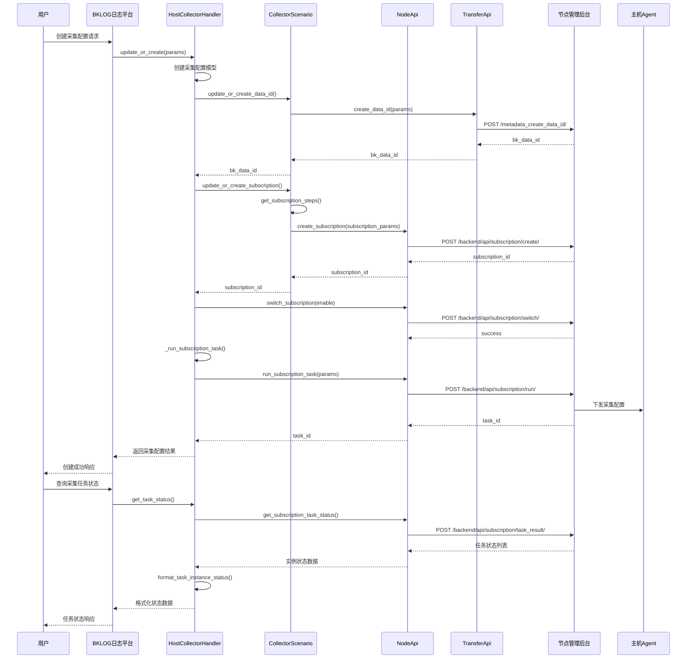
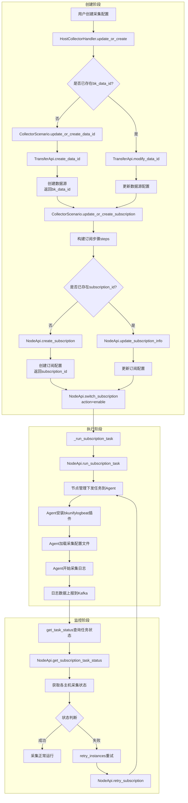

# BKLOG 节点管理集成技术文档

## 一、概述

BKLOG 日志平台通过节点管理(NodeMan)实现主机采集配置的下发与管理。本文档详细描述了集成实现的核心机制，包括API封装、订阅创建流程、配置下发等关键环节。

## 二、核心架构

### 2.1 模块依赖关系

```
BKLOG日志平台
    |
    |-- apps/api/modules/bk_node.py (NodeApi封装)
    |-- apps/api/modules/transfer.py (TransferApi封装)
    |-- apps/log_databus/handlers/collector/host.py (主机采集处理)
    |-- apps/log_databus/handlers/collector_scenario/base.py (采集场景基类)
    |-- apps/log_databus/handlers/collector_scenario/row.py (行日志采集)
```

### 2.2 关键API初始化

**文件路径**: `apps/api/__init__.py`

```python
# 第55行 - TransferApi懒加载
TransferApi = SimpleLazyObject(lambda: new_api_module("transfer", "_TransferApi"))

# 第65行 - NodeApi懒加载
NodeApi = SimpleLazyObject(lambda: new_api_module("bk_node", "_BKNodeApi"))
```

---

## 三、节点管理API封装

### 3.1 NodeApi完整接口定义

**文件路径**: `apps/api/modules/bk_node.py`

```python
class _BKNodeApi:
    MODULE = "节点管理"

    def __init__(self):
        # 第56-63行 - 创建订阅配置
        self.create_subscription = DataAPI(
            method="POST",
            url=self._build_url("system/backend/api/subscription/create/", "backend/api/subscription/create/"),
            module=self.MODULE,
            description="创建订阅配置",
            before_request=get_bk_node_request_before,
            bk_tenant_id=biz_to_tenant_getter(key=lambda p: p["scope"]["bk_biz_id"]),
        )

        # 第64-71行 - 更新订阅配置
        self.update_subscription_info = DataAPI(
            method="POST",
            url=self._build_url("system/backend/api/subscription/update/", "backend/api/subscription/update/"),
            module=self.MODULE,
            description="更新订阅配置",
            before_request=get_bk_node_request_before,
            bk_tenant_id=biz_to_tenant_getter(key=lambda p: p["scope"]["bk_biz_id"]),
        )

        # 第80-87行 - 执行订阅下发任务
        self.run_subscription_task = DataAPI(
            method="POST",
            url=self._build_url("system/backend/api/subscription/run/", "backend/api/subscription/run/"),
            module=self.MODULE,
            description="执行订阅下发任务",
            before_request=get_bk_node_request_before,
            bk_tenant_id=biz_to_tenant_getter(),
        )

        # 第98-108行 - 查看订阅任务运行状态
        self.get_subscription_task_status = DataAPI(
            method="POST",
            url=self._build_url("system/backend/api/subscription/task_result/", "backend/api/subscription/task_result/"),
            module=self.MODULE,
            description="查看订阅任务运行状态",
            before_request=get_bk_node_request_before,
            pagination_style=DataAPI.PaginationStyle.PAGE_NUMBER.value,
            bk_tenant_id=biz_to_tenant_getter(),
        )

        # 第127-134行 - 删除订阅配置
        self.delete_subscription = DataAPI(
            method="POST",
            url=self._build_url("system/backend/api/subscription/delete/", "backend/api/subscription/delete/"),
            module=self.MODULE,
            description="删除订阅配置",
            before_request=get_bk_node_request_before,
            bk_tenant_id=biz_to_tenant_getter(),
        )

        # 第145-152行 - 节点管理订阅功能开关
        self.switch_subscription = DataAPI(
            method="POST",
            url=self._build_url("system/backend/api/subscription/switch/", "backend/api/subscription/switch/"),
            module=self.MODULE,
            description="节点管理订阅功能开关",
            before_request=get_bk_node_request_before,
            bk_tenant_id=biz_to_tenant_getter(),
        )

        # 第172-179行 - 重试失败的任务
        self.retry_subscription = DataAPI(
            method="POST",
            url=self._build_url("system/backend/api/subscription/retry/", "backend/api/subscription/retry/"),
            module=self.MODULE,
            description="重试失败的任务",
            before_request=get_bk_node_request_before,
            bk_tenant_id=biz_to_tenant_getter(),
        )

        # 第154-160行 - 统计订阅任务数据
        self.subscription_statistic = DataAPI(
            method="POST",
            url=self._build_url("system/backend/api/subscription/statistic/", "backend/api/subscription/statistic/"),
            module=self.MODULE,
            description="节点管理统计订阅任务数据",
            before_request=get_bk_node_request_before,
        )

        # 第161-171行 - 获取主机订阅列表
        self.query_host_subscriptions = DataAPI(
            method="GET",
            url=self._build_url("system/backend/api/subscription/query_host_subscriptions/",
                               "backend/api/subscription/query_host_subscriptions/"),
            module=self.MODULE,
            description="获取主机订阅列表",
            before_request=get_bk_node_request_before,
            bk_tenant_id=biz_to_tenant_getter(),
        )
```

---

## 四、TransferApi调用封装

### 4.1 数据源管理接口

**文件路径**: `apps/api/modules/transfer.py`

```python
class _TransferApi:
    MODULE = _("Metadata元数据")

    def __init__(self):
        # 第135-141行 - 创建数据源
        self.create_data_id = DataAPI(
            method="POST",
            url=self._build_url("create_data_id/", "metadata_create_data_id/"),
            module=self.MODULE,
            description=_("创建数据源"),
            before_request=add_esb_info_before_request,
        )

        # 第142-148行 - 修改数据源
        self.modify_data_id = DataAPI(
            method="POST",
            url=self._build_url("modify_data_id/", "metadata_modify_data_id/"),
            module=self.MODULE,
            description=_("修改数据源"),
            before_request=add_esb_info_before_request,
        )

        # 第150-157行 - 创建结果表
        self.create_result_table = DataAPI(
            method="POST",
            url=self._build_url("create_result_table/", "metadata_create_result_table/"),
            module=self.MODULE,
            description=_("创建结果表"),
            before_request=add_esb_info_before_request,
            bk_tenant_id=biz_to_tenant_getter(),
        )

        # 第190-196行 - 查询数据源
        self.get_data_id = DataAPI(
            method="GET",
            url=self._build_url("get_data_id/", "metadata_get_data_id/"),
            module=self.MODULE,
            description=_("查询一个数据源的ID"),
            before_request=add_esb_info_before_request,
        )

        # 第197-204行 - 查询结果表信息
        self.get_result_table = DataAPI(
            method="GET",
            url=self._build_url("get_result_table/", "metadata_get_result_table/"),
            module=self.MODULE,
            description=_("查询一个结果表的信息"),
            before_request=add_esb_info_before_request,
            cache_time=CACHE_TIME_FIVE_MINUTES,
        )
```

---

## 五、主机采集配置下发流程

### 5.1 HostCollectorHandler核心实现

**文件路径**: `apps/log_databus/handlers/collector/host.py`

#### 5.1.1 创建/更新采集配置

```python
# 第183-383行 - update_or_create方法核心逻辑
def update_or_create(self, params: dict) -> dict:
    """
    创建采集配置
    :return:
    {
        "collector_config_id": 1,
        "collector_config_name": "采集项名称",
        "bk_data_id": 2001,
        "subscription_id": 1,
        "task_id_list": [1]
    }
    """
    # 第26-27行 - 导入NodeApi和TransferApi
    from apps.api import CCApi, NodeApi, TransferApi

    # 第220-233行 - 创建CollectorConfig记录
    model_fields = {
        "collector_config_name": collector_config_name,
        "collector_config_name_en": collector_config_name_en,
        "target_object_type": target_object_type,
        "target_node_type": target_node_type,
        "target_nodes": target_nodes,
        "description": description,
        "data_encoding": data_encoding,
        "params": params["params"],
        "is_active": True,
        "is_display": is_display,
        "extra_labels": params["params"].get("extra_labels", []),
    }

    # 第300行 - 更新数据源名称
    if self.data.bk_data_id and self.data.bk_data_name != bk_data_name:
        TransferApi.modify_data_id({"data_id": self.data.bk_data_id, "data_name": bk_data_name})

    # 第366-368行 - 创建或更新订阅
    self._update_or_create_subscription(
        collector_scenario=collector_scenario, params=params["params"], is_create=is_create
    )
```

#### 5.1.2 启动采集配置

```python
# 第88-100行 - 启动流程
def _pre_start(self):
    # 启动节点管理订阅功能
    if self.data.subscription_id:
        NodeApi.switch_subscription(
            {"subscription_id": self.data.subscription_id, "action": "enable", "bk_biz_id": self.data.bk_biz_id}
        )

@transaction.atomic
def start(self, **kwargs):
    super().start()
    if self.data.subscription_id:
        return self._run_subscription_task()
    return True
```

#### 5.1.3 停止采集配置

```python
# 第102-114行 - 停止流程
def _pre_stop(self):
    if self.data.subscription_id:
        # 停止节点管理订阅功能
        NodeApi.switch_subscription(
            {"subscription_id": self.data.subscription_id, "action": "disable", "bk_biz_id": self.data.bk_biz_id}
        )

@transaction.atomic
def stop(self, is_stop_index_set=True, **kwargs):
    super().stop(is_stop_index_set=is_stop_index_set)
    if self.data.subscription_id:
        return self._run_subscription_task("STOP")
    return True
```

#### 5.1.4 删除订阅事件

```python
# 第116-130行 - 删除订阅
def _pre_destroy(self):
    """
    删除订阅事件
    :return: [dict]
    {
        "message": "",
        "code": "OK",
        "data": null,
        "result": true
    }
    """
    if not self.data.subscription_id:
        return
    subscription_params = {"subscription_id": self.data.subscription_id, "bk_biz_id": self.data.bk_biz_id}
    return NodeApi.delete_subscription(subscription_params)
```

#### 5.1.5 触发订阅任务执行

```python
# 第1295-1317行 - _run_subscription_task核心实现
def _run_subscription_task(self, action=None, scope: dict[str, Any] = None):
    """
    触发订阅事件
    :param: action 动作 [START, STOP, INSTALL, UNINSTALL]
    :param: nodes 需要重试的实例
    :return: task_id 任务ID
    """
    collector_scenario = CollectorScenario.get_instance(collector_scenario_id=self.data.collector_scenario_id)
    params = {"subscription_id": self.data.subscription_id, "bk_biz_id": self.data.bk_biz_id}
    if action:
        params.update({"actions": {collector_scenario.PLUGIN_NAME: action}})

    # 无scope.nodes时，节点管理默认对全部已配置的scope.nodes进行操作
    # 有scope.nodes时，对指定scope.nodes进行操作
    if scope:
        params["scope"] = scope
        params["scope"]["bk_biz_id"] = self.data.bk_biz_id

    task_id = NodeApi.run_subscription_task(params).get("task_id")
    if scope is None and task_id:
        self.data.task_id_list = [str(task_id)]
    self.data.save()
    return self.data.task_id_list
```

#### 5.1.6 查询任务状态

```python
# 第975-1038行 - get_task_status查询采集任务状态
def get_task_status(self, id_list):
    """
    查询物理机采集任务状态
    """
    if not self.data.subscription_id:
        self._update_or_create_subscription(
            collector_scenario=CollectorScenario.get_instance(
                collector_scenario_id=self.data.collector_scenario_id
            ),
            params=self.data.params,
        )

    try:
        status_result = NodeApi.get_subscription_task_status.bulk_request(
            params={
                "subscription_id": self.data.subscription_id,
                "need_detail": False,
                "need_aggregate_all_tasks": True,
                "need_out_of_scope_snapshots": False,
                "bk_biz_id": self.data.bk_biz_id,
            },
            get_data=lambda x: x["list"],
            get_count=lambda x: x["total"],
        )
    except ApiResultError:
        logger.exception("get task status failed, subscription_id: %s", self.data.subscription_id)
        status_result = []

    instance_status = self.format_task_instance_status(status_result)
    return {"task_ready": True, "contents": self._get_status_content(instance_status, is_task=True)}
```

#### 5.1.7 重试失败任务

```python
# 第589-599行 - _retry_subscription重试订阅
def _retry_subscription(self, instance_id_list):
    params = {
        "subscription_id": self.data.subscription_id,
        "instance_id_list": instance_id_list,
        "bk_biz_id": self.data.bk_biz_id,
    }

    task_id = str(NodeApi.retry_subscription(params)["task_id"])
    self.data.task_id_list.append(task_id)
    self.data.save()
    return self.data.task_id_list
```

---

## 六、采集场景订阅创建

### 6.1 CollectorScenario基类

**文件位置**: `apps/log_databus/handlers/collector_scenario/base.py`

#### 6.1.1 创建或更新订阅

```python
# 第292-321行 - update_or_create_subscription核心逻辑
def update_or_create_subscription(self, collector_config: CollectorConfig, params: dict):
    """
    创建或更新订阅事件
    :param collector_config: 采集项配置
    :param params: 配置参数，用于获取订阅步骤，不同的场景略有不同
    :return: subscription_id 订阅ID
    """
    if isinstance(collector_config.collector_config_overlay, dict):
        params["collector_config_overlay"] = collector_config.collector_config_overlay
    steps = self.get_subscription_steps(
        collector_config.bk_data_id, params, collector_config.collector_config_id, collector_config.data_link_id
    )

    subscription_params = {
        "scope": {
            "bk_biz_id": collector_config.bk_biz_id,
            "node_type": collector_config.target_node_type,
            "object_type": collector_config.target_object_type,
            "nodes": collector_config.target_nodes,
        },
        "steps": steps,
    }
    if not collector_config.subscription_id:
        # 创建订阅配置
        collector_config.subscription_id = NodeApi.create_subscription(subscription_params)["subscription_id"]
    else:
        # 修改订阅配置
        subscription_params["subscription_id"] = collector_config.subscription_id
        NodeApi.update_subscription_info(subscription_params)
    return collector_config.subscription_id
```

#### 6.1.2 创建或更新数据源

```python
# 第127-218行 - update_or_create_data_id创建数据源
@staticmethod
def update_or_create_data_id(
    bk_data_id=None,
    data_link_id=None,
    data_name=None,
    description=None,
    encoding=None,
    option: dict = None,
    mq_config: dict = None,
    bk_biz_id=None,
):
    """
    创建或更新数据源
    :param bk_data_id: 数据源ID
    :param data_link_id: 数据链路ID
    :param data_name: 数据源名称
    :param description: 描述
    :param encoding: 字符集编码
    :param mq_config: mq配置
    :param bk_biz_id: 业务id
    :param option: 附加参数 {"topic": "xxxx", "partition": 1}
    :return: bk_data_id
    """
    default_option = {
        "encoding": "UTF-8" if encoding is None else encoding,
        "is_log_data": True,
        "allow_metrics_missing": True,
    }

    with ignored(ApiResultError):
        bk_data_id = TransferApi.get_data_id({"data_name": data_name, "no_request": True})["bk_data_id"]

    if not bk_data_id:
        # 创建数据源
        params = {
            "data_name": data_name,
            "etl_config": "bk_flat_batch",
            "data_description": description,
            "source_label": "bk_monitor",
            "type_label": "log",
            "mq_config": mq_config,
            "option": default_option,
            "bk_biz_id": bk_biz_id,
        }
        if data_link_id:
            data_link = DataLinkConfig.objects.filter(data_link_id=data_link_id).first()
            params.update({
                "transfer_cluster_id": data_link.transfer_cluster_id,
                "mq_cluster": data_link.kafka_cluster_id,
            })

        bk_data_id = TransferApi.create_data_id(params)["bk_data_id"]
    else:
        # 更新数据源
        params = {"data_id": bk_data_id, "option": default_option}
        TransferApi.modify_data_id(params)

    return bk_data_id
```

### 6.2 行日志采集场景

**文件位置**: `apps/log_databus/handlers/collector_scenario/row.py`

#### 6.2.1 获取订阅步骤

```python
# 第40-98行 - get_subscription_steps生成订阅步骤
class RowCollectorScenario(CollectorScenario):
    """
    行日志采集
    """
    PLUGIN_NAME = LogPluginInfo.NAME
    PLUGIN_VERSION = LogPluginInfo.VERSION

    def get_subscription_steps(self, data_id, params, collector_config_id=None, data_link_id=None):
        """
        获取订阅步骤
        :param data_id: 数据源ID
        :param params: 同创建采集项的请求参数
        :param collector_config_id: 采集配置ID
        :param data_link_id: 链路ID
        :return: steps
        """
        filters, params = deal_collector_scenario_param(params)
        local_params = {
            "filters": filters,
        }

        local_params = self._deal_text_public_params(local_params, params, collector_config_id)
        local_params = self._deal_edge_transport_params(local_params, data_link_id)

        steps = [
            {
                "id": f"main:{self.PLUGIN_NAME}",
                "type": "PLUGIN",
                "config": {
                    "job_type": "MAIN_INSTALL_PLUGIN",
                    "check_and_skip": True,
                    "is_version_sensitive": False,
                    "plugin_name": self.PLUGIN_NAME,
                    "plugin_version": self.PLUGIN_VERSION,
                    "config_templates": [{"name": f"{self.PLUGIN_NAME}.conf", "version": "latest", "is_main": True}],
                },
                "params": {"context": {}},
            },
            {
                "id": self.PLUGIN_NAME,
                "type": "PLUGIN",
                "config": {
                    "plugin_name": self.PLUGIN_NAME,
                    "plugin_version": self.PLUGIN_VERSION,
                    "config_templates": [{"name": f"{self.PLUGIN_NAME}.conf", "version": "latest"}],
                },
                "params": {"context": {"dataid": data_id, "local": [local_params]}},
            },
        ]
        return steps
```

---

## 七、节点管理集成流程时序图



---

## 八、配置下发详细流程图



---

## 九、订阅配置参数结构

### 9.1 订阅创建参数

```python
# 订阅参数结构 (参考base.py第305-313行)
subscription_params = {
    "scope": {
        "bk_biz_id": collector_config.bk_biz_id,        # 业务ID
        "node_type": collector_config.target_node_type, # 节点类型: INSTANCE/TOPO/DYNAMIC_GROUP
        "object_type": collector_config.target_object_type, # 对象类型: HOST
        "nodes": collector_config.target_nodes,         # 目标节点列表
    },
    "steps": steps,  # 订阅步骤配置
}
```

### 9.2 订阅步骤结构

```python
# 行日志订阅步骤 (参考row.py第73-97行)
steps = [
    # 步骤1: 主插件安装
    {
        "id": "main bkunifylogbeat",
        "type": "PLUGIN",
        "config": {
            "job_type": "MAIN_INSTALL_PLUGIN",
            "check_and_skip": True,
            "is_version_sensitive": False,
            "plugin_name": "bkunifylogbeat",
            "plugin_version": "7.1.28",
            "config_templates": [
                {"name": "bkunifylogbeat.conf", "version": "latest", "is_main": True}
            ],
        },
        "params": {"context": {}},
    },
    # 步骤2: 配置下发
    {
        "id": "bkunifylogbeat",
        "type": "PLUGIN",
        "config": {
            "plugin_name": "bkunifylogbeat",
            "plugin_version": "7.1.28",
            "config_templates": [
                {"name": "bkunifylogbeat.conf", "version": "latest"}
            ],
        },
        "params": {
            "context": {
                "dataid": data_id,    # 数据源ID
                "local": [
                    {
                        "paths": ["/log/app.log"],   # 日志路径列表
                        "filters": [],               # 过滤条件
                        "encoding": "UTF-8",         # 编码格式
                        "tail_files": True,          # 是否从末尾开始采集
                        "max_bytes": 1048576,        # 单行最大字节数
                    }
                ]
            }
        },
    },
]
```

---

## 十、关键常量定义

### 10.1 LogPluginInfo插件信息

**文件位置**: `apps/log_databus/constants.py`

```python
class LogPluginInfo:
    NAME = "bkunifylogbeat"    # 日志采集插件名称
    VERSION = "7.1.28"         # 插件版本
```

### 10.2 TargetNodeTypeEnum节点类型

```python
class TargetNodeTypeEnum:
    INSTANCE = "INSTANCE"               # 静态主机
    TOPO = "TOPO"                       # 动态拓扑
    SERVICE_TEMPLATE = "SERVICE_TEMPLATE"  # 服务模板
    SET_TEMPLATE = "SET_TEMPLATE"       # 集群模板
    DYNAMIC_GROUP = "DYNAMIC_GROUP"     # 动态分组
```

---

## 十一、异常处理机制

### 11.1 采集创建异常

**文件位置**: `apps/log_databus/exceptions.py`

```python
class CollectorCreateOrUpdateSubscriptionException(Exception):
    MESSAGE = "创建或更新订阅失败: {err}"
```

### 11.2 异常捕获处理

```python
# host.py第1166-1181行 - 订阅创建异常处理
def _update_or_create_subscription(self, collector_scenario, params: dict, is_create=False):
    try:
        self.data.subscription_id = collector_scenario.update_or_create_subscription(self.data, params)
        self.data.save()
        if params.get("run_task", True):
            self._run_subscription_task()
        # 启用订阅
        NodeApi.switch_subscription(
            {"subscription_id": self.data.subscription_id, "action": "enable", "bk_biz_id": self.data.bk_biz_id}
        )
    except Exception as error:
        logger.exception(f"create or update collector config failed => [{error}]")
        if not is_create:
            raise CollectorCreateOrUpdateSubscriptionException(
                CollectorCreateOrUpdateSubscriptionException.MESSAGE.format(err=error)
            )
```

---

## 十二、总结

BKLOG与节点管理的集成实现了一套完整的主机日志采集配置管理流程：

| 层级 | 模块 | 职责 |
|------|------|------|
| **API封装层** | `NodeApi`/`TransferApi` | 统一接口调用，支持ESB/APIGateway |
| **采集处理层** | `HostCollectorHandler` | 生命周期管理：创建/启动/停止/删除 |
| **场景扩展层** | `CollectorScenario` | 定义标准接口，各场景继承实现 |
| **配置下发** | 订阅机制 | Agent执行插件安装和配置加载 |
| **状态监控** | 任务状态查询 | 失败重试、订阅统计 |

---

**文档版本**: v1.0
**生成时间**: 2026-04-30
**分析项目**: BKLOG 蓝鲸日志平台