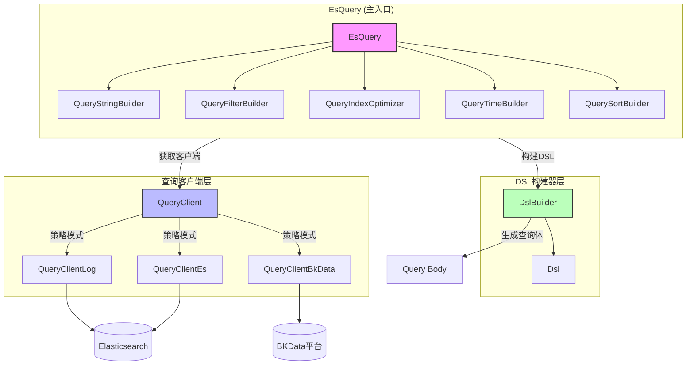
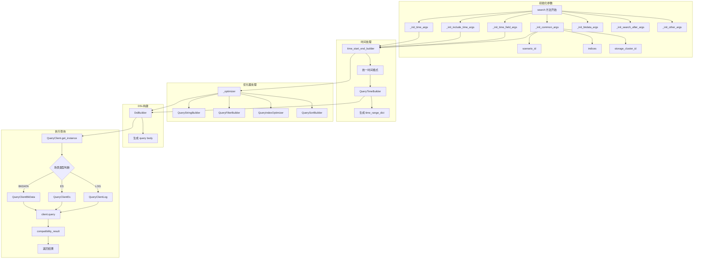

# EsQuery 主入口实现

> 聚焦：`apps/log_esquery/esquery/esquery.py`
> ES查询的主入口类

## 1. EsQuery 类定位

`EsQuery` 是 BK-LOG 日志平台中 ES 查询的主入口类，负责统一封装各类 ES 查询操作。它协调多个组件完成从参数解析、DSL 构建到查询执行的完整流程。

### 1.1 与 QueryClient、DslBuilder 的关系图



---

## 2. __init__() 初始化

### 2.1 完整代码片段

```python
# apps/log_esquery/esquery/esquery.py 第52-61行
def __init__(self, search_dict: type_search_dict):
    self.search_dict: Dict[str, Any] = search_dict
    self._enhance()
    self.include_nested_fields: bool = search_dict.get("include_nested_fields", True)

def _enhance(self):
    if self.search_dict.get("query_string", ""):
        enhance_lucene_adapter = EnhanceLuceneAdapter(query_string=self.search_dict["query_string"])
        self.search_dict["query_string"] = enhance_lucene_adapter.enhance()
        self.search_dict["origin_query_string"] = enhance_lucene_adapter.origin_query_string
```

### 2.2 核心参数说明

| 参数 | 类型 | 说明 |
|------|------|------|
| `search_dict` | `type_search_dict` | 查询参数字典，包含所有查询配置 |
| `scenario_id` | `str` | 查询场景类型：`log`/`es`/`bkdata` |
| `indices` | `str` | 索引集字符串，逗号分隔 |
| `storage_cluster_id` | `int` | 存储集群ID |
| `include_nested_fields` | `bool` | 是否包含嵌套字段，默认 True |

---

## 3. search() 核心查询方法

### 3.1 完整代码片段

```python
# 第149-224行
def search(self):
    scenario_id, indices, storage_cluster_id = self._init_common_args()
    time_field, time_field_type, time_field_unit = self._init_time_field_args()
    include_start_time, include_end_time = self._init_include_time_args()
    start_time, end_time, time_range, time_zone, use_time_range = self._init_time_args()
    # 统一开始结束时间
    start_time, end_time = self.time_start_end_builder(time_range, start_time, end_time, time_zone)
    bkdata_authentication_method, bkdata_data_token = self._init_bkdata_args()
    search_after, track_total_hits = self._init_search_after_args()

    time_range_dict: type_time_range_dict = QueryTimeBuilder(
        time_field,
        start_time,
        end_time,
        time_field_type=time_field_type,
        time_field_unit=time_field_unit,
        include_start_time=include_start_time,
        include_end_time=include_end_time,
        indices=indices,
        scenario_id=scenario_id,
    ).time_range_dict

    query_string, filter_dict_list, index, sort_tuple = self._optimizer(
        indices, scenario_id, start_time, end_time, time_zone, use_time_range
    )
    size, start, aggs, highlight, scroll, collapse = self._init_other_args()
    mappings = self.mapping() if self.include_nested_fields else []

    # 调用DSL生成器
    body = DslBuilder(
        search_string=query_string,
        filter_dict_list=filter_dict_list,
        time_range_dict=time_range_dict,
        sort_tuple=sort_tuple,
        size=size,
        begin=start,
        aggs=aggs,
        highlight=highlight,
        collapse=collapse,
        search_after=search_after,
        use_time_range=use_time_range,
        mappings=mappings,
        time_field=time_field,
        slice_search=self.search_dict.get("slice_search"),
        slice_id=self.search_dict.get("slice_id"),
        slice_max=self.search_dict.get("slice_max"),
    ).body

    logger.info(f"scenario_id => [{scenario_id}], indices => [{index}], body => [{body}]")

    if self.search_dict.get("debug"):
        return {"scenario": scenario_id, "indices": index, "body": body}

    client = QueryClient(
        scenario_id,
        storage_cluster_id=storage_cluster_id,
        bkdata_authentication_method=bkdata_authentication_method,
        bkdata_data_token=bkdata_data_token,
    ).get_instance()

    result: Dict[str:Any] = client.query(index, body, scroll=scroll, track_total_hits=track_total_hits)

    return self.compatibility_result(result)
```

### 3.2 查询流程图



---

## 4. dsl() DSL直接查询

### 4.1 完整代码片段

```python
# 第248-270行
def dsl(self):
    dsl: dict = self.search_dict.get("body", {})
    scroll = self.search_dict.get("scroll", None)
    scenario_id, index_set_string, storage_cluster_id = self._init_common_args()
    bkdata_authentication_method, bkdata_data_token = self._init_bkdata_args()

    client = QueryClient(
        scenario_id,
        storage_cluster_id=storage_cluster_id,
        bkdata_authentication_method=bkdata_authentication_method,
        bkdata_data_token=bkdata_data_token,
    ).get_instance()

    index = index_set_string
    logger.info(f"[esquery_dsl] index => [{index}], dsl => [{dsl}]")

    result: Dict = client.query(index, dsl, scroll=scroll)
    result = self.compatibility_result(result)
    result.update({"dsl": json.dumps(dsl)})
    return result
```

### 4.2 参数说明

| 参数 | 类型 | 说明 |
|------|------|------|
| `body` | `dict` | 直接传入的 ES DSL 查询体 |
| `scroll` | `str` | 滚动查询时间参数，如 `"5m"` |

---

## 5. mapping() 字段映射获取

### 5.1 完整代码片段

```python
# 第272-305行
def mapping(self):
    scenario_id, index_set_string, storage_cluster_id = self._init_common_args()
    bkdata_authentication_method, bkdata_data_token = self._init_bkdata_args()
    start_time, end_time, _, time_zone, __ = self._init_time_args()
    index_set_string = self._optimizer_mapping_time_range(
        index_set_string, scenario_id, start_time, end_time, time_zone
    )
    add_settings_details: bool = self.search_dict.get("add_settings_details", False)

    client = QueryClient(
        scenario_id,
        storage_cluster_id=storage_cluster_id,
        bkdata_authentication_method=bkdata_authentication_method,
        bkdata_data_token=bkdata_data_token,
    ).get_instance()

    result: Dict = client.mapping(index=index_set_string, add_settings_details=add_settings_details)

    result_key_list: list = list(result)
    sorted_result_key_list: list = sorted(result_key_list, key=lambda x: x, reverse=True)
    final_result_list: list = []
    for key in sorted_result_key_list:
        final_result_list.append({key: result.get(key)})
    return final_result_list
```

---

## 6. scroll() 滚动查询

### 6.1 完整代码片段

```python
# 第226-246行
def scroll(self):
    scenario_id, indices, storage_cluster_id = self._init_common_args()

    # TODO 暂不支持bkdata场景
    if scenario_id == Scenario.BKDATA:
        raise ScenarioNotSupportedException(
            ScenarioNotSupportedException.MESSAGE.format(scenario_id=Scenario.BKDATA)
        )

    scroll_id: str = self.search_dict.get("scroll_id")
    scroll: str = self.search_dict.get("scroll")

    client = QueryClient(scenario_id, storage_cluster_id=storage_cluster_id).get_instance()
    result = client.scroll(indices, scroll_id, scroll)
    return result
```

### 6.2 scroll_id 管理

| 参数 | 类型 | 说明 |
|------|------|------|
| `scroll_id` | `str` | 上一次滚动查询返回的 ID |
| `scroll` | `str` | 滚动上下文保持时间，如 `"5m"` |

---

## 7. indices() 索引列表

### 7.1 完整代码片段

```python
# 第307-344行
def indices(self):
    scenario_id, indices, storage_cluster_id = self._init_common_args()
    bk_biz_id: int = self.search_dict.get("bk_biz_id")
    with_storage: bool = self.search_dict.get("with_storage", False)

    client = QueryClient(
        scenario_id,
        storage_cluster_id=storage_cluster_id,
    ).get_instance()

    if scenario_id == Scenario.BKDATA and not bk_biz_id:
        raise ScenarioQueryIndexFailException(
            ScenarioQueryIndexFailException.MESSAGE.format(es_fail_reason="get index list with bk_biz_id None")
        )

    result = client.indices(bk_biz_id=bk_biz_id, result_table_id=indices, with_storage=with_storage)

    # 如果需要关联查询space
    if not self.search_dict.get("relate_space", False):
        return result
    # ... 空间关联处理
    return result
```

---

## 8. 使用示例

### 8.1 创建 EsQuery 实例

```python
from apps.log_esquery.esquery.esquery import EsQuery

search_dict = {
    # 场景类型: log, es, bkdata
    "scenario_id": "log",

    # 索引集
    "indices": "2_bklog_test_index",

    # 时间范围
    "start_time": "2024-01-01 00:00:00",
    "end_time": "2024-01-01 23:59:59",
    "time_zone": "Asia/Shanghai",

    # 时间字段配置
    "time_field": "timestamp",
    "time_field_type": "date",

    # 查询字符串（Lucene语法）
    "query_string": "ERROR AND server:192.168.1.1",

    # 过滤条件
    "filter": [
        {"field": "level", "operator": "is", "value": ["ERROR", "WARN"]}
    ],

    # 分页参数
    "start": 0,
    "size": 100,

    # 排序
    "sort_list": [["timestamp", "desc"]],
}

es_query = EsQuery(search_dict)
```

### 8.2 执行查询

```python
# 执行标准查询
result = es_query.search()

# 执行DSL直接查询
dsl_result = es_query.dsl()

# 获取字段映射
mapping = es_query.mapping()

# 滚动查询
scroll_dict = {
    "scenario_id": "log",
    "indices": "2_bklog_test_index",
    "scroll_id": "FGluY2x1ZGVfY29udGV4dF91dWlk...",
    "scroll": "5m"
}
scroll_query = EsQuery(scroll_dict)
scroll_result = scroll_query.scroll()
```

---

## 9. 相关文档

- [02-多场景策略模式.md](./02-多场景策略模式.md) - QueryClient 策略模式详解
- [03-DSL构建器详解.md](./03-DSL构建器详解.md) - DslBuilder 实现细节
- [04-索引优化策略.md](./04-索引优化策略.md) - IndexOptimizer 索引优化