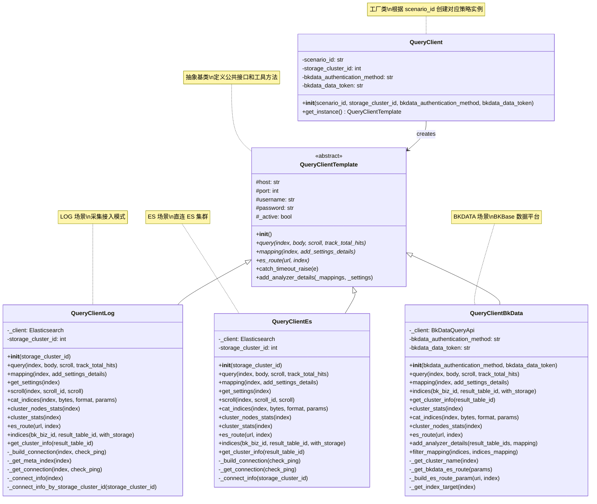

# BKLOG 多场景策略模式实现文档

## 一、概述

`apps/log_esquery/esquery/client` 目录下实现了查询客户端的策略模式，用于支持多种数据源场景的统一查询接口。该设计允许系统根据不同的 `scenario_id` 动态选择合适的查询策略，实现业务逻辑与数据访问的解耦。

## 二、策略模式结构

### 2.1 类图



### 2.2 场景常量定义

```python
# 文件: apps/log_search/models.py (第191-201行)
class Scenario:
    """
    接入场景
    """

    LOG = "log"       # 采集接入
    BKDATA = "bkdata" # BKBase 数据平台
    ES = "es"         # 直连 ES 集群

    CHOICES = (
        (LOG, _("采集接入")),
        ...
    )
```

## 三、QueryClient 工厂类

### 3.1 完整代码

```python
# 文件: apps/log_esquery/esquery/client/QueryClient.py (第28-53行)
class QueryClient(object):  # pylint: disable=invalid-name
    def __init__(
        self,
        scenario_id: str,
        storage_cluster_id: int = -1,
        bkdata_authentication_method: str = "",
        bkdata_data_token: str = "",
    ):
        self.scenario_id: str = scenario_id
        self.storage_cluster_id: int = storage_cluster_id
        self.bkdata_authentication_method = bkdata_authentication_method
        self.bkdata_data_token = bkdata_data_token

    def get_instance(self):
        mapping = {
            Scenario.BKDATA: "apps.log_esquery.esquery.client.QueryClientBkData.QueryClientBkData",
            Scenario.LOG: "apps.log_esquery.esquery.client.QueryClientLog.QueryClientLog",
            Scenario.ES: "apps.log_esquery.esquery.client.QueryClientEs.QueryClientEs",
        }
        client = import_string(mapping.get(self.scenario_id))
        if self.scenario_id in [Scenario.LOG, Scenario.ES]:
            return client(self.storage_cluster_id)
        elif self.scenario_id == Scenario.BKDATA:
            return client(self.bkdata_authentication_method, self.bkdata_data_token)
        return client()
```

### 3.2 get_instance() 工厂方法分析

工厂方法的核心逻辑如下：

1. **策略映射表**：通过字典 `mapping` 将 `scenario_id` 映射到具体策略类的导入路径
2. **动态导入**：使用 Django 的 `import_string` 实现按需加载
3. **差异化实例化**：根据场景类型传递不同的构造参数

| scenario_id | 策略类 | 构造参数 |
|------------|--------|---------|
| `Scenario.LOG` | `QueryClientLog` | `storage_cluster_id` |
| `Scenario.ES` | `QueryClientEs` | `storage_cluster_id` |
| `Scenario.BKDATA` | `QueryClientBkData` | `bkdata_authentication_method`, `bkdata_data_token` |

## 四、QueryClientTemplate 抽象基类

### 4.1 完整代码

```python
# 文件: apps/log_esquery/esquery/client/QueryClientTemplate.py (第33-104行)
class QueryClientTemplate(object):  # pylint: disable=invalid-name
    def __init__(self):
        self.host: str = ""
        self.port: int = -1
        self.username: str = ""
        self.password: str = ""
        self._active: bool = False

    def query(self, index: str, body: Dict[str, Any], scroll=None, track_total_hits=False):
        raise NotImplementedError()

    def mapping(self, index: str, add_settings_details: bool = False) -> Dict:
        raise NotImplementedError()

    def es_route(self, url: str, index=None):
        raise NotImplementedError()

    @classmethod
    def catch_timeout_raise(cls, e):
        if isinstance(
            e,
            (
                EsExceptions.ConnectionTimeout,
                EsExceptions5.ConnectionTimeout,
                EsExceptions6.ConnectionTimeout,
                requests.exceptions.Timeout,
            ),
        ):
            raise EsTimeoutException

    @staticmethod
    def add_analyzer_details(_mappings: Dict[str, Any], _settings: Dict[str, Any]):
        # ... 为索引映射添加分析器详细信息
        return _mappings
```

### 4.2 抽象方法说明

| 方法 | 说明 |
|-----|------|
| `query()` | 执行 ES 查询，返回搜索结果 |
| `mapping()` | 获取索引映射信息 |
| `es_route()` | 执行任意 ES API 路由请求 |

### 4.3 公共工具方法

| 方法 | 说明 |
|-----|------|
| `catch_timeout_raise()` | 捕获并转换超时异常 |
| `add_analyzer_details()` | 为字段映射添加分析器配置详情 |

## 五、策略实现类详解

### 5.1 QueryClientLog - 采集接入场景

适用于通过日志平台采集接入的数据查询场景。

```python
# 文件: apps/log_esquery/esquery/client/QueryClientLog.py

class QueryClientLog(QueryClientTemplate):
    def __init__(self, storage_cluster_id: int = None):
        super(QueryClientLog, self).__init__()
        self._client: Elasticsearch
        self.storage_cluster_id = storage_cluster_id
```

#### query 方法

```python
# 第60-73行
def query(self, index: str, Dict[str, Any], scroll=None, track_total_hits=False):
    # query前没有必要检查ping
    self._build_connection(index=index, check_ping=False)

    # 如果版本不是5.0且track_total_hits为True时
    if track_total_hits and not isinstance(self._client, Elasticsearch5):
        body.update({"track_total_hits": True})

    try:
        params = {"request_timeout": settings.ES_QUERY_TIMEOUT}
        return self._client.search(index=index, body=body, scroll=scroll, params=params)
    except Exception as e:
        self.catch_timeout_raise(e)
        raise EsClientSearchException(EsClientSearchException.MESSAGE.format(error=e))
```

**特点**：
- 根据 `index` 名称动态获取 ES 连接信息
- 支持通过 `storage_cluster_id` 或从 `TransferApi` 获取集群配置
- 自动处理索引名称转换（将 `.` 替换为 `_`）
- 兼容 ES5.x 版本

#### mapping 方法

```python
# 第75-86行
def mapping(self, index: str, add_settings_details: bool = False) -> Dict:
    index_target = self._get_index_target(index=index, check_ping=False)
    try:
        mapping_dict: type_mapping_dict = self._client.indices.get_mapping(index=index_target)
        if add_settings_details:
            settings_dict: Dict = self.get_settings(index=index)
            return self.add_analyzer_details(_mappings=mapping_dict, _settings=settings_dict)
        return mapping_dict
    except Exception as e:
        self.catch_timeout_raise(e)
        raise BaseSearchFieldsException(BaseSearchFieldsException.MESSAGE.format(error=e))
```

#### indices 方法

```python
# 第255-290行
@classmethod
def indices(cls, bk_biz_id, result_table_id=None, with_storage=False):
    """
    获取索引列表
    """
    collect_obj = CollectorConfig.objects.filter(bk_biz_id=bk_biz_id).exclude(table_id=None)
    if result_table_id:
        collect_obj = collect_obj.filter(table_id=result_table_id)

    index_list = [
        {
            "bk_biz_id": _collect.bk_biz_id,
            "collector_config_id": _collect.collector_config_id,
            "result_table_id": _collect.table_id,
            "result_table_name_alias": _collect.collector_config_name,
        }
        for _collect in collect_obj
    ]

    # 补充索引集群信息
    if with_storage and index_list:
        indices = [_collect.table_id for _collect in collect_obj]
        storage_info = cls.bulk_cluster_infos(result_table_list=indices)
        for _index in index_list:
            cluster_config = storage_info.get(_index["result_table_id"], {}).get("cluster_config", {})
            _index.update({
                "storage_cluster_id": cluster_config.get("cluster_id"),
                "storage_cluster_name": cluster_config.get("cluster_name"),
            })
    return index_list
```

**特点**：
- 从 `CollectorConfig` 模型获取索引列表
- 支持按业务 ID 和结果表 ID 过滤
- 可选返回存储集群信息

### 5.2 QueryClientEs - 直连 ES 场景

适用于直接连接 ES 集群的场景，需要提供 `storage_cluster_id`。

```python
# 文件: apps/log_esquery/esquery/client/QueryClientEs.py

class QueryClientEs(QueryClientTemplate):
    def __init__(self, storage_cluster_id: int):
        super(QueryClientEs, self).__init__()
        self.storage_cluster_id = storage_cluster_id
        self._client: Elasticsearch
```

#### query 方法

```python
# 第55-67行
def query(self, index: str, body: Dict[str, Any], scroll=None, track_total_hits=False):
    self._build_connection(check_ping=False)

    # 如果版本不是5.0且track_total_hits为True时
    if track_total_hits and not isinstance(self._client, Elasticsearch5):
        body.update({"track_total_hits": True})

    try:
        params = {"request_timeout": settings.ES_QUERY_TIMEOUT}
        return self._client.search(index=index, body=body, scroll=scroll, params=params)
    except Exception as e:
        self.catch_timeout_raise(e)
        raise EsClientSearchException(EsClientSearchException.MESSAGE.format(error=e))
```

**特点**：
- 直接使用传入的 `storage_cluster_id` 获取连接信息
- 不需要从索引名称解析元数据

#### indices 方法

```python
# 第188-214行
def indices(self, bk_biz_id=None, result_table_id=None, with_storage=False):
    """
    查询索引列表
    """
    self._build_connection()
    try:
        index_results = self._client.indices.get(result_table_id if result_table_id else "*")
    except Exception as e:
        self.catch_timeout_raise(e)
        raise EsClientAliasException(EsClientAliasException.MESSAGE.format(error=e))
    index_list = [{"result_table_id": item, "result_table_name_alias": item} for item in index_results.keys()]

    # 补充索引集群信息
    if with_storage and index_list:
        cluster_config = self.get_cluster_info()
        for _index in index_list:
            _index.update({
                "storage_cluster_id": cluster_config.get("storage_cluster_id"),
                "storage_cluster_name": cluster_config.get("storage_cluster_name"),
            })
    return index_list
```

**特点**：
- 直接调用 ES API 获取索引列表
- 索引名称即为结果表 ID

### 5.3 QueryClientBkData - BKBase 数据平台场景

适用于通过 BKBase 数据平台查询的场景，使用 SQL 方式查询 ES。

```python
# 文件: apps/log_esquery/esquery/client/QueryClientBkData.py

class QueryClientBkData(QueryClientTemplate):
    def __init__(self, bkdata_authentication_method: str = "", bkdata_data_token: str = ""):
        super().__init__()
        self._client = BkDataQueryApi
        self.bkdata_authentication_method = bkdata_authentication_method
        self.bkdata_data_token = bkdata_data_token
```

#### query 方法

```python
# 第46-77行
def query(self, index: str, body: dict[str, Any], scroll=None, track_total_hits=False):
    try:
        tracer = trace.get_tracer(__name__)
        with tracer.start_as_current_span("bkdata_es_query") as span:
            # bkdata情景下,当且仅当用户主动传了 track_total_hits: true 时，才允许往 body 中注入该参数
            if track_total_hits:
                body.update({"track_total_hits": True})
            sql = json.dumps({"index": index, "body": body})
            params = {"prefer_storage": "es", "sql": sql}
            span.set_attribute("db.statement", sql)
            span.set_attribute("db.system", "elasticsearch")

            if self.bkdata_authentication_method:
                params["bkdata_authentication_method"] = self.bkdata_authentication_method
            if self.bkdata_data_token:
                params["bkdata_data_token"] = self.bkdata_data_token

            result = self._client.query(params, timeout=settings.ES_QUERY_TIMEOUT)
            result = result["list"]
            if not result:
                result = {"hits": {"hits": [], "total": 0}}
            return result
    except ApiResultError as e:
        if str(e.code) == BKDATA_NOT_HAVE_INDEX:
            return {"hits": {"hits": [], "total": 0}}
        raise EsClientSearchException(e.message, code=e.code)
    except Exception as e:
        self.catch_timeout_raise(e)
        raise EsClientSearchException(
            EsClientSearchException.MESSAGE.format(error=e),
            code=getattr(e, "code", EsClientSearchException.ERROR_CODE),
        )
```

**特点**：
- 使用 `BkDataQueryApi` 而非直接 ES 客户端
- 将 ES DSL 转换为 JSON 格式的 SQL 参数
- 支持认证方法和数据 Token
- 集成 OpenTelemetry 追踪

## 六、策略差异对比表

### 6.1 核心方法差异

| 方法 | QueryClientLog | QueryClientEs | QueryClientBkData |
|-----|---------------|---------------|-------------------|
| **连接方式** | 从索引名解析或使用 `storage_cluster_id` | 使用 `storage_cluster_id` | 使用 BKData API |
| **query** | ES Client 直接查询 | ES Client 直接查询 | SQL API 查询 |
| **mapping** | ES Client API | ES Client API | SQL API + 过滤处理 |
| **indices** | 从 CollectorConfig 模型获取 | ES Client `indices.get()` | BkDataMetaApi 获取 |
| **认证方式** | 用户名/密码 | 用户名/密码 | Token/认证方法 |
| **追踪支持** | 无 | 无 | OpenTelemetry |

### 6.2 构造参数差异

| 策略类 | 必需参数 | 可选参数 |
|-------|---------|---------|
| `QueryClientLog` | - | `storage_cluster_id` |
| `QueryClientEs` | `storage_cluster_id` | - |
| `QueryClientBkData` | - | `bkdata_authentication_method`, `bkdata_data_token` |

### 6.3 使用示例

```python
# LOG 场景
client = QueryClient(scenario_id=Scenario.LOG, storage_cluster_id=123).get_instance()
result = client.query(index="my_index", body={"query": {"match_all": {}}})

# ES 场景
client = QueryClient(scenario_id=Scenario.ES, storage_cluster_id=456).get_instance()
result = client.query(index="my_index", body={"query": {"match_all": {}}})

# BKDATA 场景
client = QueryClient(
    scenario_id=Scenario.BKDATA,
    bkdata_authentication_method="token",
    bkdata_data_token="xxx"
).get_instance()
result = client.query(index="result_table_id", body={"query": {"match_all": {}}})
```

## 七、设计模式总结

### 7.1 策略模式应用

本实现采用策略模式，具有以下优点：

1. **开闭原则**：新增场景只需添加新的策略类，无需修改现有代码
2. **单一职责**：每个策略类只负责一种场景的实现
3. **依赖倒置**：高层模块依赖抽象接口（`QueryClientTemplate`）
4. **工厂方法**：通过 `QueryClient.get_instance()` 动态创建策略实例

### 7.2 扩展建议

如需新增场景：

1. 创建继承自 `QueryClientTemplate` 的新策略类
2. 实现所有抽象方法：`query()`、`mapping()`、`es_route()`
3. 在 `QueryClient.get_instance()` 的映射表中添加新场景
4. 在 `Scenario` 类中添加新的场景常量

---

**文档版本**: 1.0
**生成日期**: 2026-04-30
**相关文件**:
- `apps/log_esquery/esquery/client/QueryClient.py`
- `apps/log_esquery/esquery/client/QueryClientTemplate.py`
- `apps/log_esquery/esquery/client/QueryClientLog.py`
- `apps/log_esquery/esquery/client/QueryClientEs.py`
- `apps/log_esquery/esquery/client/QueryClientBkData.py`
- `apps/log_search/models.py` (Scenario 定义)