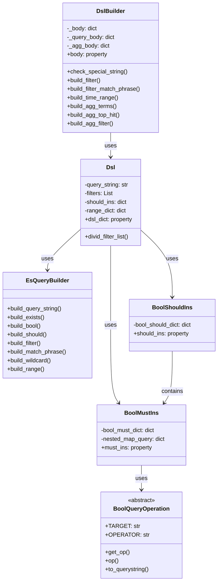
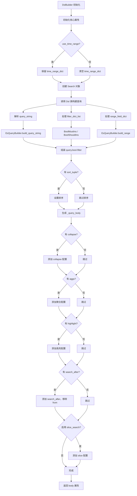
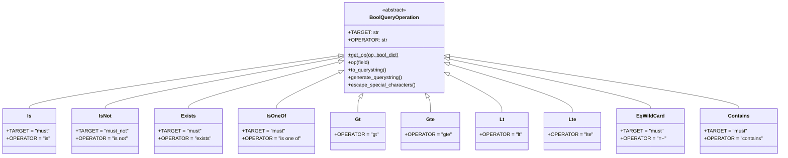
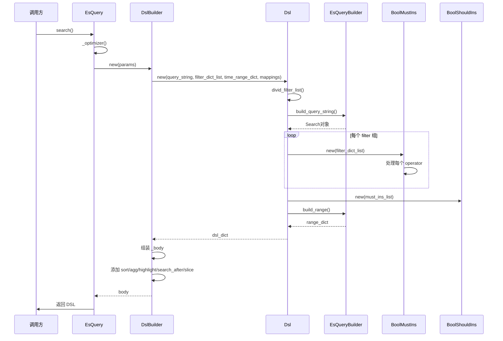

# DslBuilder DSL 构建器详解

## 1. 概述

`DslBuilder` 是 BK-LOG 日志平台中用于构建 Elasticsearch 查询 DSL 的核心组件。它将用户查询参数转换为标准的 ES Query DSL 格式，支持复杂查询条件的组装，包括全文检索、过滤条件、时间范围、聚合、高亮、分页等特性。

### 1.1 文件位置

- **核心文件**: `apps/log_esquery/esquery/dsl_builder/dsl_builder.py`
- **查询逻辑**: `apps/log_esquery/esquery/dsl_builder/query_builder/query_builder_logic.py`

### 1.2 类继承关系



## 2. DslBuilder 类详解

### 2.1 类定义与初始化

```python
# 文件: dsl_builder/dsl_builder.py (第34-53行)
class DslBuilder(object):
    def __init__(
        self,
        search_string="*",
        filter_dict_list: list = [],
        time_range_dict: dict = {},
        sort_tuple: tuple = (),
        begin=0,
        size=500,
        aggs: dict = {},
        highlight: dict = {},
        collapse={},
        search_after=[],
        use_time_range=True,
        mappings: list = [],
        time_field: str = "",
        slice_search: bool = False,
        slice_id: int = 0,
        slice_max: int = 0,
    ):
```

### 2.2 初始化参数说明

| 参数 | 类型 | 默认值 | 说明 |
|------|------|--------|------|
| `search_string` | str | `"*"` | 查询字符串，支持 Lucene 语法 |
| `filter_dict_list` | list | `[]` | 过滤条件列表 |
| `time_range_dict` | dict | `{}` | 时间范围字典 |
| `sort_tuple` | tuple | `()` | 排序字段元组 |
| `begin` | int | `0` | 分页起始位置 |
| `size` | int | `500` | 每页返回条数 |
| `aggs` | dict | `{}` | 聚合配置 |
| `highlight` | dict | `{}` | 高亮配置 |
| `collapse` | dict | `{}` | 折叠去重配置 |
| `search_after` | list | `[]` | 深度分页游标 |
| `use_time_range` | bool | `True` | 是否使用时间范围 |
| `mappings` | list | `[]` | 索引映射信息 |
| `time_field` | str | `""` | 时间字段名 |
| `slice_search` | bool | `False` | 是否启用分片查询 |
| `slice_id` | int | `0` | 分片ID |
| `slice_max` | int | `0` | 最大分片数 |

### 2.3 Body 构建流程

```python
# 文件: dsl_builder/dsl_builder.py (第73-148行)
def __init__(self, ...):
    # 1. 初始化核心属性
    self._body: dict = {}
    self._query_body = None
    self._agg_body = None

    # 2. 处理时间范围
    self.time_range_dict = time_range_dict
    if not use_time_range:
        self.time_range_dict = {}

    self.filter_dict_list = filter_dict_list
    self.sort_tuple = sort_tuple

    # 3. 构建 Search 对象
    self.search = Search()

    # 4. 通过 Dsl 类构建查询布尔结构
    query_bool_obj: type_query_bool_dict = Dsl(
        query_string=search_string,
        filter_dict_list=self.filter_dict_list,
        range_field_dict=self.time_range_dict,
        mappings=mappings,
    ).dsl_dict

    # 5. 设置排序
    if self.sort_tuple:
        self.search = self.search.sort(*self.sort_tuple)

    # 6. 构建查询体
    self._query_body = self.search.to_dict()
    self._query_body.update({"from": begin, "size": size})
    self._query_body.update({"query": query_bool_obj.get("query")})

    # 7. 处理 collapse
    if collapse:
        self._query_body.update({"collapse": collapse})

    # 8. 处理聚合
    self._agg_body = aggs
    self._body.update(self._query_body)
    if self._agg_body:
        self._body.update({"aggs": self._agg_body})

    # 9. 处理高亮
    if self.highlight_dict:
        if self.search_string != WILDCARD_PATTERN or filter_dict_list:
            self._body.update({"highlight": self.highlight_dict})

    # 10. 处理 search_after
    if self.search_after:
        self._body.update({"search_after": self.search_after})
        self._body.pop("from")  # search_after 与 from 互斥

    # 11. 处理分片查询
    if self.slice_search:
        self._body.update({
            "slice": {
                "field": time_field,
                "id": self.slice_id,
                "max": self.slice_max,
            }
        })
```

## 3. DSL 构建核心流程

### 3.1 整体构建流程图



### 3.2 Dsl 类核心逻辑

```python
# 文件: dsl_builder/query_builder/query_builder_logic.py (第691-720行)
class Dsl(object):
    def __init__(
        self, query_string: str, filter_dict_list: List, range_field_dict: Dict[str, Dict[str, Any]], mappings: List
    ):
        # 1. 处理 filter list，分割成多个 filter 组
        must_ins_list: List = []
        self.filters: List = self.divid_filter_list(filter_dict_list)

        # 2. 为每个 filter 组创建 BoolMustIns
        for item in self.filters:
            must_ins = BoolMustIns(filter_dict_list=item).must_ins
            must_ins_list.append(must_ins)

        # 3. 创建 BoolShouldIns 组合所有 must 条件
        self.should_ins = BoolShouldIns(must_ins_list).should_ins

        # 4. 生成 query_string 查询
        self.query_string: type_query_string = (
            EsQueryBuilder.build_query_string(query_string, mappings).to_dict().get("query", {})
        )

        # 5. 生成时间范围
        self.range_dict: type_range = None
        if range_field_dict:
            self.range_dict: type_range = EsQueryBuilder.build_range(range_field_dict)

    @property
    def dsl_dict(self):
        filter = []
        if self.query_string != WILDCARD_QUERY:
            filter.append(self.query_string)
        if self.range_dict:
            filter.append(self.range_dict)
        filter.append(self.should_ins)
        return {"query": {"bool": {"filter": filter}}}
```

## 4. Query String 构建

### 4.1 EsQueryBuilder.build_query_string

```python
# 文件: dsl_builder/query_builder/query_builder_logic.py (第84-123行)
@classmethod
def build_query_string(cls, search_string: str, mappings: List) -> Search:
    search = Search()

    # 1. 使用 luqum 解析 Lucene 语法
    try:
        query_tree = parser.parse(search_string, lexer=lexer.clone())
    except ParseError:
        raise BaseSearchDslException(BaseSearchDslException.MESSAGE.format(dsl=search_string))

    # 2. 合并 mappings，提取 nested 字段
    nested_fields, full_mappings = cls._merge_mappings(mappings)

    # 3. 处理简单查询（无字段查询）
    if isinstance(query_tree, Word):
        keyword_query = Q(
            "query_string", query=str(query_tree), analyze_wildcard=True, fields=["*", "__*"], lenient=True
        )
        if str(query_tree) == WILDCARD_PATTERN:
            return search.query()  # 单独 * 通配符，返回空查询

        # 添加 nested 字段检索
        nested_field_queries = []
        for f in nested_fields:
            nested_field_queries.append(Q("nested", path=f, query=keyword_query))

        return search.query("bool", should=[keyword_query] + nested_field_queries)
    else:
        # 4. 处理复杂查询
        transformer = NestedFieldQueryTransformer(nested_fields)
        query_tree = transformer.visit(query_tree)

        if getattr(transformer, "has_nested_field", False):
            schema_analyzer = SchemaAnalyzer(full_mappings)
            builder = ElasticsearchQueryBuilder(**schema_analyzer.query_builder_options())
            return search.query(builder(query_tree))

        query_tree = auto_head_tail(query_tree)
        return search.query(
            "query_string", query=str(query_tree), analyze_wildcard=True, fields=["*", "__*"], lenient=True
        )
```

## 5. Filter 条件处理

### 5.1 BoolQueryOperation 操作类层次



### 5.2 操作符映射表

| 操作符 | 类 | ES 查询类型 |
|-------|-----|-----------|
| `is` | `Is` | `match_phrase` |
| `is not` | `IsNot` | `must_not: match_phrase` |
| `exists` | `Exists` | `exists` |
| `is one of` | `IsOneOf` | `bool.should: match_phrase` |
| `gt` | `Gt` | `range.gt` |
| `gte` | `Gte` | `range.gte` |
| `lt` | `Lt` | `range.lt` |
| `lte` | `Lte` | `range.lte` |
| `=~` | `EqWildCard` | `wildcard` |
| `contains` | `Contains` | `wildcard` |

## 6. 高级功能

### 6.1 Search After 深度分页

```python
# 文件: dsl_builder/dsl_builder.py (第128-132行)
# search_after 模式
self.search_after = search_after
if self.search_after:
    self._body.update({"search_after": self.search_after})
    self._body.pop("from")  # search_after 与 from 互斥，必须移除 from
```

**说明**:
- `search_after` 用于深度分页，避免 ES 的 `from + size` 限制（默认最大 10000）
- 使用 `search_after` 时必须移除 `from` 参数
- 需要配合排序字段使用，基于上一页最后一条记录的排序值

### 6.2 Collapse 字段折叠

```python
# 文件: dsl_builder/dsl_builder.py (第110-111行)
if collapse:
    self._body.update({"collapse": collapse})
```

**使用示例**:
```python
collapse = {
    "field": "trace_id",
    "inner_hits": {
        "name": "latest",
        "size": 1,
        "sort": [{"timestamp": "desc"}]
    }
}
```

**说明**:
- 用于字段去重，按指定字段折叠
- 可配合 `inner_hits` 获取折叠内的文档

### 6.3 Slice 分片查询

```python
# 文件: dsl_builder/dsl_builder.py (第134-148行)
# 分片参数
self.time_field = time_field
self.slice_search = slice_search
self.slice_id = slice_id
self.slice_max = slice_max
if self.slice_search:
    self._body.update({
        "slice": {
            "field": time_field,
            "id": self.slice_id,
            "max": self.slice_max,
        }
    })
```

**说明**:
- 用于并行查询优化，将查询分割成多个切片
- `field`: 分片字段（通常使用时间字段）
- `id`: 当前分片ID（0 到 max-1）
- `max`: 总分片数

## 7. Body 生成完整示例

### 7.1 基础查询

```python
# 输入参数
DslBuilder(
    search_string="error OR warning",
    filter_dict_list=[
        {"field": "level", "operator": "is", "value": ["ERROR"], "condition": "and"}
    ],
    time_range_dict={
        "timestamp": {
            "gte": 1714521600000,
            "lte": 1714608000000,
            "format": "epoch_millis"
        }
    },
    sort_tuple=({"timestamp": {"order": "desc"}},),
    begin=0,
    size=100
)

# 输出 body
{
    "from": 0,
    "size": 100,
    "sort": [{"timestamp": {"order": "desc"}}],
    "query": {
        "bool": {
            "filter": [
                {
                    "query_string": {
                        "query": "error OR warning",
                        "analyze_wildcard": True,
                        "fields": ["*", "__*"],
                        "lenient": True
                    }
                },
                {
                    "range": {
                        "timestamp": {
                            "gte": 1714521600000,
                            "lte": 1714608000000,
                            "format": "epoch_millis"
                        }
                    }
                },
                {
                    "bool": {
                        "should": [
                            {
                                "bool": {
                                    "must": [
                                        {"match_phrase": {"level": "ERROR"}}
                                    ],
                                    "must_not": []
                                }
                            }
                        ]
                    }
                }
            ]
        }
    }
}
```

## 8. 整体调用关系



## 9. 设计模式总结

### 9.1 Builder 模式

`DslBuilder` 采用 Builder 模式，通过链式调用逐步构建复杂的 DSL 查询体。

### 9.2 策略模式

`BoolQueryOperation` 及其子类采用策略模式，每个操作符对应一个策略类，通过 `get_op()` 方法动态选择策略。

### 9.3 模板方法模式

`BoolQueryOperation` 定义了抽象模板，子类实现 `op()` 和 `to_querystring()` 方法。

### 9.4 组合模式

`BoolMustIns` 和 `BoolShouldIns` 组合构建嵌套的布尔查询结构。

---

**文档版本**: 1.0
**更新日期**: 2026-04-30
**源码路径**: `apps/log_esquery/esquery/dsl_builder/`