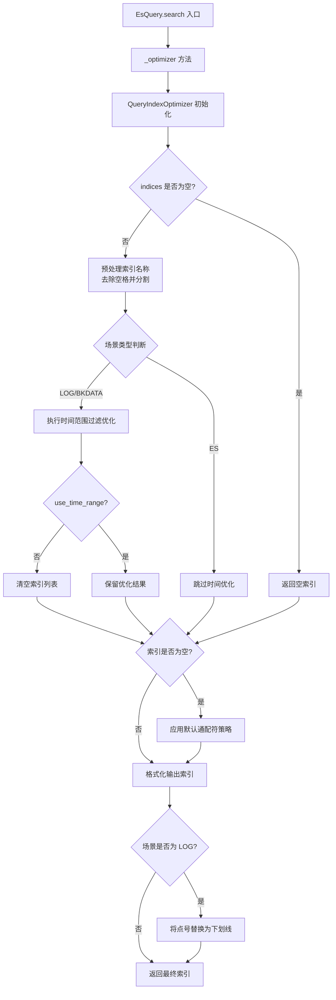
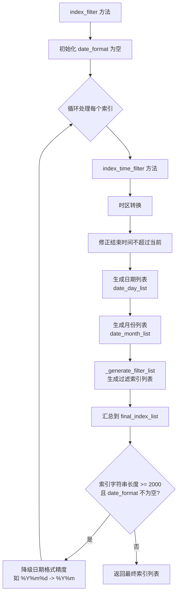

# 索引优化策略实现

## 概述

`QueryIndexOptimizer` 类是 BKLOG 日志平台中负责 ES 索引名称优化的核心组件。该类根据查询场景（scenario_id）、时间范围等参数，智能地优化索引名称列表，减少不必要的索引查询，提升查询性能。

## 核心代码实现

### QueryIndexOptimizer 类完整代码

```python
# 文件路径: apps/log_esquery/esquery/builder/query_index_optimizer.py (第 33-138 行)

class QueryIndexOptimizer:
    def __init__(
        self,
        indices: type_index_set_string,
        scenario_id: str,
        start_time: arrow.Arrow = None,
        end_time: arrow.Arrow = None,
        time_zone: str = None,
        use_time_range: bool = True,
    ):
        self._index: str = ""
        if not indices:
            return

        indices = indices.replace(" ", "")
        result_table_id_list: list[str] = map_if(indices.split(","))
        # 根据查询场景优化index
        if scenario_id in [Scenario.BKDATA, Scenario.LOG]:
            # 日志采集使用0时区区分index入库,数据平台使用服务器所在时区
            time_zone = "GMT" if scenario_id == Scenario.LOG else tz.gettz()
            result_table_id_list = self.index_filter(result_table_id_list, start_time, end_time, time_zone)

        if not use_time_range:
            result_table_id_list = []

        self._index = ",".join(result_table_id_list)

        if not self._index:
            map_func_map = {
                Scenario.LOG: lambda x: f"{x}_*",
                Scenario.BKDATA: lambda x: f"{x}_*",
                Scenario.ES: lambda x: f"{x}",
            }
            result_table_id_list: list[str] = map_if(indices.split(","), map_func_map.get(scenario_id))

            self._index = ",".join(result_table_id_list)
        if scenario_id in [Scenario.LOG]:
            self._index = self._index.replace(".", "_")

    @property
    def index(self):
        return self._index

    def index_filter(
        self, result_table_id_list: type_index_set_list, start_time: arrow.Arrow, end_time: arrow.Arrow, time_zone: str
    ) -> list[str]:
        # BkData索引集优化
        date_format = ""
        while True:
            final_index_list: list = []
            for x in result_table_id_list:
                a_index_list, date_format = self.index_time_filter(x, start_time, end_time, time_zone, date_format)
                final_index_list = final_index_list + a_index_list
            date_format = "%".join(date_format.split("%")[:-1])
            if len(",".join(final_index_list)) < INDICES_LENGTH or not date_format:
                break
        return final_index_list
```

### 相关常量定义

```python
# 文件路径: apps/log_esquery/constants.py (第 32 行)

INDICES_LENGTH = 2000  # 索引名称字符串最大长度限制
```

### Scenario 场景类型

```python
# 文件路径: apps/log_search/models.py (第 191-198 行)

class Scenario:
    """
    接入场景
    """
    LOG = "log"       # 采集接入
    BKDATA = "bkdata" # 数据平台
    ES = "es"         # 原生ES
```

## 整体架构流程图



## 索引名称优化处理逻辑

### 1. 初始化参数说明

| 参数 | 类型 | 说明 |
|------|------|------|
| `indices` | str | 索引名称字符串，多个索引用逗号分隔 |
| `scenario_id` | str | 查询场景类型：LOG/BKDATA/ES |
| `start_time` | arrow.Arrow | 查询开始时间 |
| `end_time` | arrow.Arrow | 查询结束时间 |
| `time_zone` | str | 时区设置 |
| `use_time_range` | bool | 是否使用时间范围优化 |

### 2. 场景化处理策略

| 场景 | 时区设置 | 时间优化 | 说明 |
|------|----------|----------|------|
| LOG | GMT (UTC+0) | 启用 | 日志采集默认使用 0 时区存储索引 |
| BKDATA | 服务器本地时区 | 启用 | 数据平台使用服务器所在时区 |
| ES | 不设置 | 禁用 | 原生 ES 不进行时间优化 |

## 时间范围与索引过滤的关系

### 核心流程图



### 时间粒度决策表

| 天数范围 | 月数范围 | 天数 > 14 | 日期格式 | 示例索引 |
|----------|----------|-----------|----------|----------|
| 1 天 | 1 个月 | 否 | `%Y%m%d` | `index_20240115*` |
| 2-14 天 | 1 个月 | 否 | `%Y%m%d` | `index_20240115*,index_20240116*` |
| >14 天 | 1 个月 | 是 | `%Y%m` | `index_202401*` |
| 多天 | 2-6 个月 | - | `%Y%m` | `index_202401*,index_202402*` |
| 多天 | >6 个月 | - | `%Y%m` | 仅最近 6 个月 |

## 通配符索引处理策略

### 索引长度限制与降级机制

降级策略说明：
1. 当生成的索引列表字符串长度超过 `INDICES_LENGTH` (2000字符) 时触发降级
2. 通过截断日期格式来减少索引数量：
   - `%Y%m%d` -> `%Y%m` (从按天降级为按月)
   - `%Y%m` -> `%Y` (从按月降级为按年)
   - 直到无法继续降级或长度满足要求

### 默认通配符策略

当索引列表为空时（例如 `use_time_range=False`），根据场景应用默认策略：

| 场景 | 通配符策略 | 示例 |
|------|------------|------|
| LOG | `{index}_*` | `my_index` -> `my_index_*` |
| BKDATA | `{index}_*` | `my_table` -> `my_table_*` |
| ES | 保持原样 | `my_index` -> `my_index` |

### LOG 场景特殊处理

对于 LOG 场景，索引名称中的点号 (`.`) 会被替换为下划线 (`_`)，这是为了兼容 ES 索引命名规范。

## EsQuery 中的调用方式

```python
# 文件路径: apps/log_esquery/esquery/esquery.py (第 99-116 行)

def _optimizer(self, indices, scenario_id, start_time, end_time, time_zone, use_time_range):
    # 优化query_string
    query_string: str = self.search_dict.get("query_string")
    query_string = QueryStringBuilder(query_string).query_string

    # 优化filter
    addition: type_addition = self.search_dict.get("filter", [])
    filter_dict_list: type_addition = QueryFilterBuilder(addition).filter_dict_list

    # 优化查询索引
    index: str = QueryIndexOptimizer(
        indices,
        scenario_id,
        start_time=start_time,
        end_time=end_time,
        time_zone=time_zone,
        use_time_range=use_time_range,
    ).index

    # 优化排序
    sort_list: List[List[str, str]] = self.search_dict.get("sort_list", [])
    sort_tuple: Tuple = tuple(QuerySortBuilder(sort_list).sort_list)
    return query_string, filter_dict_list, index, sort_tuple
```

## 总结

`QueryIndexOptimizer` 类通过以下核心策略实现索引优化：

1. **时间范围驱动**: 根据查询时间范围智能选择日期粒度（日/月）
2. **长度限制保护**: 当索引列表过长时自动降级日期格式精度
3. **场景化适配**: 针对不同数据源（LOG/BKDATA/ES）采用差异化策略
4. **通配符兜底**: 当无法确定时间范围时使用通配符确保查询完整性

这种设计在保证查询准确性的同时，有效减少了需要扫描的索引数量，提升了查询性能。

---

**文档版本**: 1.0
**更新日期**: 2026-04-30
**源码路径**: `apps/log_esquery/esquery/builder/query_index_optimizer.py`