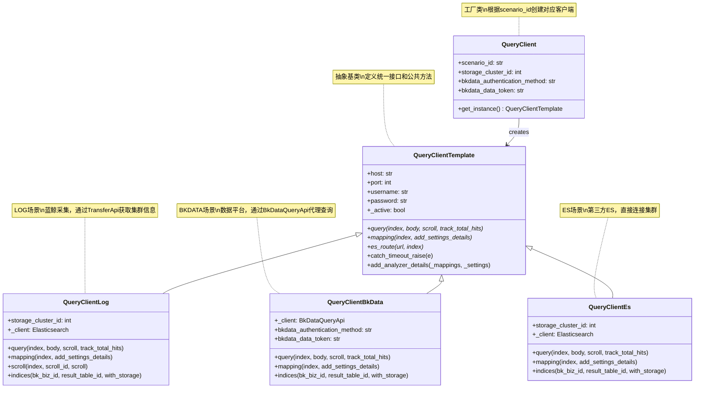
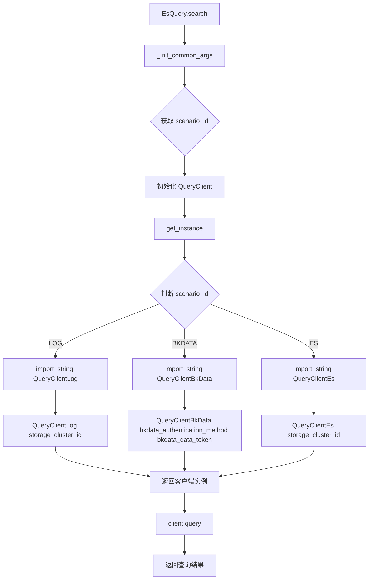

# ES 多场景策略模式

> 聚焦：apps/log_esquery/esquery/client/
> QueryClient 工厂类及三种客户端实现

## 1. 三种查询场景

BKLOG 日志平台支持三种不同的日志接入场景，每种场景对应不同的数据来源和查询方式：

| 场景标识 | 场景名称 | 数据来源 | 查询方式 | 认证方式 |
|---------|---------|---------|---------|---------|
| `log` | 蓝鲸采集 | 蓝鲸日志采集系统采集的日志 | 直接连接ES集群 | 集群账号密码 |
| `bkdata` | 数据平台 | BKBase数据平台的日志数据 | 通过BkDataQueryApi代理查询 | bkdata_authentication_method + bkdata_data_token |
| `es` | 第三方ES | 外部第三方ES集群 | 直接连接ES集群 | 集群账号密码 |

**场景定义** (apps/log_search/models.py 第191-213行)：
```python
class Scenario:
    """
    接入场景
    """

    LOG = "log"
    BKDATA = "bkdata"
    ES = "es"

    CHOICES = (
        (LOG, _("采集接入")),
        (BKDATA, _("数据平台")),
        (ES, _("第三方ES")),
    )
```

## 2. QueryClient 工厂类

`QueryClient` 是工厂类，根据场景类型动态创建对应的客户端实例。

**完整代码** (apps/log_esquery/esquery/client/QueryClient.py 第1-53行)：
```python
class QueryClient(object):  # pylint: disable=invalid-name
    def __init__(
        self,
        scenario_id: str,
        storage_cluster_id: int = -1,
        bkdata_authentication_method: str = "",
        bkdata_data_token: str = "",
    ):
        self.scenario_id: str = scenario_id
        self.storage_cluster_id: int = storage_cluster_id
        self.bkdata_authentication_method = bkdata_authentication_method
        self.bkdata_data_token = bkdata_data_token

    def get_instance(self):
        mapping = {
            Scenario.BKDATA: "apps.log_esquery.esquery.client.QueryClientBkData.QueryClientBkData",
            Scenario.LOG: "apps.log_esquery.esquery.client.QueryClientLog.QueryClientLog",
            Scenario.ES: "apps.log_esquery.esquery.client.QueryClientEs.QueryClientEs",
        }
        client = import_string(mapping.get(self.scenario_id))
        if self.scenario_id in [Scenario.LOG, Scenario.ES]:
            return client(self.storage_cluster_id)
        elif self.scenario_id == Scenario.BKDATA:
            return client(self.bkdata_authentication_method, self.bkdata_data_token)
        return client()
```

### 核心设计要点

**1. scenario_id 映射字典**：
```python
mapping = {
    Scenario.BKDATA: "apps.log_esquery.esquery.client.QueryClientBkData.QueryClientBkData",
    Scenario.LOG: "apps.log_esquery.esquery.client.QueryClientLog.QueryClientLog",
    Scenario.ES: "apps.log_esquery.esquery.client.QueryClientEs.QueryClientEs",
}
```

**2. import_string 动态导入**：
```python
client = import_string(mapping.get(self.scenario_id))
```
- Django提供的 `import_string` 函数动态加载类
- 避免模块顶层导入所有客户端类，减少不必要的依赖

**3. get_instance() 方法**：
根据场景类型传递不同的初始化参数：
- `LOG/ES` 场景：传递 `storage_cluster_id`（存储集群ID）
- `BKDATA` 场景：传递认证参数 `bkdata_authentication_method` 和 `bkdata_data_token`

## 3. QueryClientTemplate 抽象基类

`QueryClientTemplate` 定义了所有查询客户端的统一接口和公共方法。

**核心代码** (apps/log_esquery/esquery/client/QueryClientTemplate.py)：
```python
class QueryClientTemplate(object):  # pylint: disable=invalid-name
    def __init__(self):
        self.host: str = ""
        self.port: int = -1
        self.username: str = ""
        self.password: str = ""
        self._active: bool = False

    def query(self, index: str, body: Dict[str, Any], scroll=None, track_total_hits=False):
        raise NotImplementedError()

    def mapping(self, index: str, add_settings_details: bool = False) -> Dict:
        raise NotImplementedError()

    def es_route(self, url: str, index=None):
        raise NotImplementedError()

    @classmethod
    def catch_timeout_raise(cls, e):
        if isinstance(
            e,
            (
                EsExceptions.ConnectionTimeout,
                EsExceptions5.ConnectionTimeout,
                EsExceptions6.ConnectionTimeout,
                requests.exceptions.Timeout,
            ),
        ):
            raise EsTimeoutException
```

### 类关系图（Mermaid）



## 4. 场景选择流程图



## 5. 初始化参数差异

| 场景 | 必要参数 | 可选参数 |
|------|---------|---------|
| LOG | storage_cluster_id | - |
| BKDATA | bkdata_authentication_method | bkdata_data_token |
| ES | storage_cluster_id | - |

## 6. 设计要点

### 6.1 策略模式的应用

本模块是策略模式的典型应用：

1. **策略接口**：`QueryClientTemplate` 定义统一的 `query`、`mapping`、`es_route` 接口
2. **具体策略**：`QueryClientLog`、`QueryClientBkData`、`QueryClientEs` 实现不同场景的查询逻辑
3. **上下文**：`QueryClient` 工厂类根据场景选择策略
4. **客户端**：`EsQuery` 使用工厂类获取策略实例

**优势**：
- 查询逻辑与场景解耦
- 新增场景只需添加新的策略类
- 客户端代码无需修改

### 6.2 开闭原则体现

**对扩展开放**：
- 新增查询场景只需：
  1. 创建新的 `QueryClientXxx` 类继承 `QueryClientTemplate`
  2. 在 `QueryClient.mapping` 添加映射关系
  3. 在 `Scenario.CHOICES` 添加场景定义

**对修改关闭**：
- `EsQuery` 主入口无需修改
- 已有策略类无需修改
- 公共逻辑在模板类中复用

### 6.3 ES 客户端版本兼容

系统支持 ES 5.x、6.x、7.x 三个版本：

```python
# apps/log_esquery/utils/es_client.py
def get_es_client(*, version: str, ...):
    if version.startswith("5."):
        es_client = Elasticsearch5
    elif version.startswith("6."):
        es_client = Elasticsearch6
    else:
        es_client = Elasticsearch
```

---

**文档版本**: v1.0
**生成日期**: 2026-04-30
**源码路径**: `apps/log_esquery/esquery/client/`