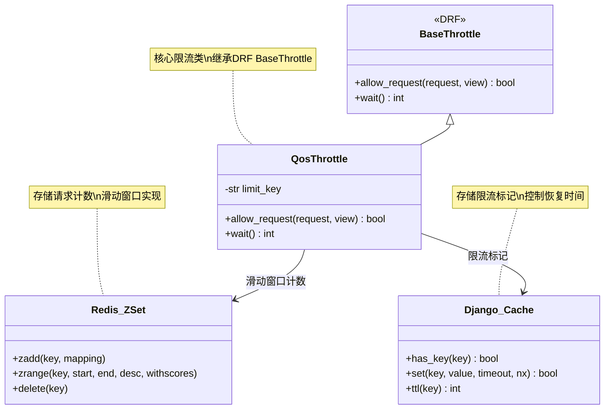
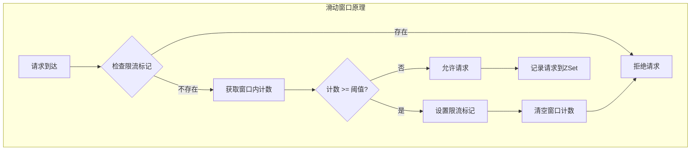
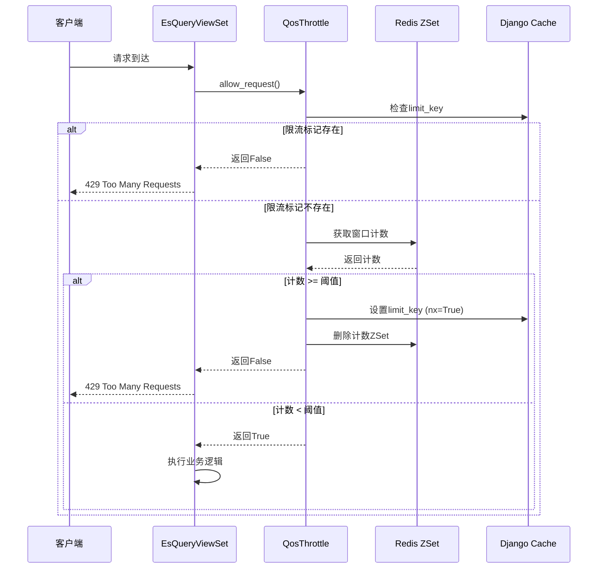
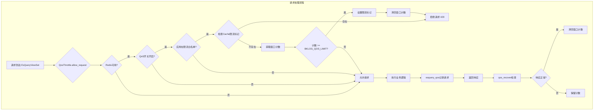
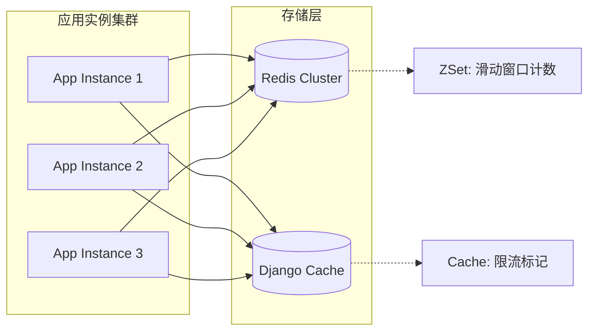

# QoS限流实现

## 概述

BKLOG的QoS（Quality of Service）限流机制是基于Redis ZSet实现的滑动窗口限流系统，主要用于保护ES查询服务免受高频请求的冲击。该机制通过`QosThrottle`类与Django REST Framework的节流机制集成，实现对特定应用的请求频率控制。

## 核心架构



## 配置项说明

配置文件路径：`config/default.py`（第1068-1081行）

```python
# BKLOG 后台QOS配置
BKLOG_QOS_USE = os.getenv("BKAPP_QOS_USE", "on") == "on"
BKLOG_QOS_LIMIT_APP = [
    "bk_monitor",
    "bk_bkmonitor",
    "bk_monitorv3",
    "bk_bkmonitorv3",
    "bkmonitorv3",
]
# 窗口时间 单位分钟
BKLOG_QOS_LIMIT_WINDOW = int(os.getenv("BK_BKLOG_QOS_LIMIT_WINDOW", 5))
# 窗口内超时次数
BKLOG_QOS_LIMIT = int(os.getenv("BK_BKLOG_QOS_LIMIT", 3))
# 达到窗口内限制次数屏蔽时间 单位分钟
BKLOG_QOS_LIMIT_TIME = int(os.getenv("BK_BKLOG_QOS_LIMIT_TIME", 5))
```

| 配置项 | 环境变量 | 默认值 | 说明 |
|--------|----------|--------|------|
| `BKLOG_QOS_USE` | `BKAPP_QOS_USE` | `on` | QoS开关，控制是否启用限流 |
| `BKLOG_QOS_LIMIT_APP` | - | 监控应用列表 | 需要进行限流的应用白名单 |
| `BKLOG_QOS_LIMIT_WINDOW` | `BK_BKLOG_QOS_LIMIT_WINDOW` | `5` | 滑动窗口时间（分钟） |
| `BKLOG_QOS_LIMIT` | `BK_BKLOG_QOS_LIMIT` | `3` | 窗口内最大允许请求次数 |
| `BKLOG_QOS_LIMIT_TIME` | `BK_BKLOG_QOS_LIMIT_TIME` | `5` | 触发限流后的屏蔽时间（分钟） |

## QosThrottle类实现

源文件：`apps/log_esquery/qos.py`（第118-144行）

```python
class QosThrottle(throttling.BaseThrottle):
    def __init__(self):
        self.limit_key = ""

    def allow_request(self, request, view):
        if not settings.USE_REDIS:
            return True

        self.limit_key = build_qos_limit_key(request)

        # 如果已经被限制 直接禁止
        if cache.has_key(self.limit_key):  # noqa
            return False

        # 检查超时次数
        qos_limit_time = settings.BKLOG_QOS_LIMIT_TIME * TimeEnum.ONE_MINUTE_SECOND.value
        count = get_window_count(request)
        if count >= settings.BKLOG_QOS_LIMIT:
            # 设置禁止标记 并删除计数
            if cache.set(self.limit_key, "1", timeout=qos_limit_time, nx=True):
                logger.warning(f"[Esquery Qos] query limit key [{self.limit_key}] set")
                clear_redis_zset(request)
            return False
        return True

    def wait(self):
        return cache.ttl(self.limit_key)
```

### 核心方法解析

#### `allow_request(request, view)`

请求许可判断的核心方法，实现了二级检查机制：

1. **第一级检查**：检查是否已处于限流状态
   - 通过Django Cache检查`limit_key`是否存在
   - 若存在则直接拒绝请求

2. **第二级检查**：滑动窗口计数检查
   - 获取当前窗口内的请求计数
   - 若计数超过阈值，设置限流标记并清空计数
   - 使用`nx=True`保证原子性，防止并发问题

#### `wait()`

返回当前限流的剩余时间，供DRF框架在响应中设置`Retry-After`头。

## Redis ZSet滑动窗口算法

### 算法原理

滑动窗口算法通过Redis ZSet的有序特性实现：



### 核心函数实现

#### 1. 窗口时间范围计算

源文件：`apps/log_esquery/qos.py`（第39-48行）

```python
def get_current_window_range():
    now = datetime.datetime.now()
    next = now + datetime.timedelta(minutes=settings.BKLOG_QOS_LIMIT_WINDOW)
    return now.timestamp(), next.timestamp()


def get_window_time_point():
    now = datetime.datetime.now()
    next = now + datetime.timedelta(minutes=settings.BKLOG_QOS_LIMIT_WINDOW)
    return next.timestamp()
```

#### 2. 窗口计数获取

源文件：`apps/log_esquery/qos.py`（第51-59行）

```python
def get_window_count(request):
    count = 0
    values = redis_client.zrange(build_qos_key(request), 0, settings.BKLOG_QOS_LIMIT, desc=True, withscores=True)
    window_start, window_end = get_current_window_range()
    for value in values:
        _, score = value
        if window_start <= score <= window_end:
            count += 1
    return count
```

**算法说明**：
- 使用`zrange`获取ZSet中分数最高的N个元素（N为限流阈值）
- 分数(score)存储的是请求时间戳
- 只统计落在当前窗口时间范围内的请求

#### 3. 请求记录

源文件：`apps/log_esquery/qos.py`（第66-78行）

```python
def esquery_qos(request):
    if not settings.USE_REDIS:
        return
    if not settings.BKLOG_QOS_USE:
        return
    auth_info = Permission.get_auth_info(request)
    if auth_info["bk_app_code"] not in settings.BKLOG_QOS_LIMIT_APP:
        return
    token = uniqid()
    key = build_qos_key(request)
    window_time_point = get_window_time_point()
    redis_client.zadd(f"{key}", {f"{token}_{window_time_point}": window_time_point})
    logger.info(f"[Esquery Qos] qos count [{build_qos_key(request)}] increment")
```

**关键点**：
- 每次请求生成唯一token标识
- ZSet的member格式为`{token}_{timestamp}`
- ZSet的score为时间戳，用于滑动窗口计算

### ZSet数据结构示意

```
Key: bklog_qos_/esquery/search/_index_set_id
┌─────────────────────────────────────────────────┐
│  Member                          │ Score        │
├─────────────────────────────────────────────────┤
│  abc123_1714521600               │ 1714521600   │
│  def456_1714521610               │ 1714521610   │
│  ghi789_1714521620               │ 1714521620   │
└─────────────────────────────────────────────────┘
```

## 限流Key构建策略

源文件：`apps/log_esquery/qos.py`（第81-105行）

```python
def _get_request_data(request):
    if request.method in ["GET"]:
        return request.query_params
    return request.data


def build_qos_key(request) -> str:
    path = request.path
    data = _get_request_data(request)
    index_set_id = data.get("index_set_id")
    if index_set_id is not None:
        return f"{settings.APP_CODE}_qos_{path}_{index_set_id}"
    scenario_id = data.get("scenario_id")
    indices = data.get("indices", "")
    if len(indices) <= COMPRESS_INDICES_CACHE_KEY_LENGTH:
        return f"{settings.APP_CODE}_qos_{path}_{scenario_id}_{indices}"
    # 超过256位的indices进行md5
    new_md5 = md5()
    new_md5.update(indices.encode(encoding="utf-8"))
    indices_tag = indices.split(",")[0]
    return f"{settings.APP_CODE}_qos_{path}_{scenario_id}_{indices_tag}_{new_md5.hexdigest()}"


def build_qos_limit_key(request) -> str:
    return f"{build_qos_key(request)}_limit"
```

### Key构建规则

| 场景 | Key格式 | 示例 |
|------|---------|------|
| 有index_set_id | `{APP_CODE}_qos_{path}_{index_set_id}` | `bklog_qos_/esquery/search_123` |
| 无index_set_id，indices短 | `{APP_CODE}_qos_{path}_{scenario_id}_{indices}` | `bklog_qos_/esquery/search_log_index` |
| 无index_set_id，indices长 | `{APP_CODE}_qos_{path}_{scenario_id}_{indices_tag}_{md5}` | `bklog_qos_/esquery/search_log_index_abc123...` |
| 限流标记Key | `{qos_key}_limit` | `bklog_qos_/esquery/search_123_limit` |

## 限流触发与恢复机制

### 限流触发流程



### 恢复机制

源文件：`apps/log_esquery/qos.py`（第108-115行）

```python
def qos_recover(request, response):
    if not settings.USE_REDIS:
        return
    count = get_window_count(request)
    if not response.exception:
        if count != 0:
            logger.info(f"[Esquery Qos] qos recover [{build_qos_key(request)}]")
            clear_redis_zset(request)
```

**恢复逻辑**：
- 在请求处理完成后调用（通过`finalize_response`钩子）
- 如果响应没有异常，清空窗口计数
- 确保正常请求不会累积计数

### 清空计数实现

源文件：`apps/log_esquery/qos.py`（第62-63行）

```python
def clear_redis_zset(request):
    redis_client.delete(build_qos_key(request))
```

## 视图层集成

源文件：`apps/log_esquery/views/esquery_views.py`（第53-60行）

```python
class EsQueryViewSet(APIViewSet):
    serializer_class = serializers.Serializer
    throttle_classes = (QosThrottle,)

    def finalize_response(self, request, response, *args, **kwargs):
        response = super(EsQueryViewSet, self).finalize_response(request, response, *args, **kwargs)
        qos_recover(request, response)
        return response
```

**集成要点**：
1. 通过`throttle_classes`配置类级别的节流器
2. 重写`finalize_response`方法，在响应完成后触发恢复逻辑
3. 恢复逻辑确保正常请求不会累积限流计数

## 管理命令

源文件：`apps/log_esquery/management/commands/qos.py`

```python
class Command(BaseCommand):
    def handle(self, *arg, **kwargs):
        if not settings.USE_REDIS:
            self.stderr.write("you not setup redis config")
            return

        limit_keys = cache.keys("*_limit")
        if not limit_keys:
            self.stdout.write(self.style.SUCCESS("not have query limit"))

        for limit_key in limit_keys:
            self.stdout.write(self.style.SUCCESS(limit_key))
```

**使用方式**：
```bash
python manage.py qos
```

该命令用于查看当前所有处于限流状态的Key，便于运维监控和问题排查。

## 完整流程图



## 分布式限流特性

### 数据存储架构



### 分布式一致性保障

1. **Redis ZSet共享**：所有应用实例共享同一个Redis实例，确保请求计数全局一致
2. **Cache原子操作**：使用`nx=True`参数保证限流标记设置的原子性，避免并发竞态
3. **Key隔离设计**：基于请求路径和索引集ID构建唯一Key，实现细粒度限流

### 并发安全处理

```python
# 原子性设置限流标记
if cache.set(self.limit_key, "1", timeout=qos_limit_time, nx=True):
    logger.warning(f"[Esquery Qos] query limit key [{self.limit_key}] set")
    clear_redis_zset(request)
```

**关键点**：
- `nx=True`：仅当Key不存在时才设置成功
- 返回`True`表示当前实例获得了设置权限
- 避免多实例同时设置导致的重复操作

## 单元测试

源文件：`apps/tests/log_esquery/test_qos.py`

### 测试用例覆盖

```python
@patch("django.core.cache.cache", FakeCache())
@patch("apps.log_esquery.qos.redis_client", fake_redis)
@patch("apps.log_search.permission.Permission.get_auth_info", return_value={"bk_app_code": "bk_monitorv3"})
class TestQos(TestCase):
    def test_throttle(self, *args, **kwargs):
        """测试限流触发逻辑"""
        throttle = QosThrottle()
        index_set_request_1 = self._build_request(1)
        esquery_qos(index_set_request_1)
        self.assertTrue(throttle.allow_request(index_set_request_1, None))
        esquery_qos(index_set_request_1)
        self.assertTrue(throttle.allow_request(index_set_request_1, None))
        esquery_qos(index_set_request_1)
        self.assertFalse(throttle.allow_request(index_set_request_1, None))

    def test_recover(self, *args, **kwargs):
        """测试恢复机制"""
        # 正常响应后计数清零
        # 异常响应后计数保留

    def test_key_build(self, *args, **kwargs):
        """测试Key构建逻辑"""
        # 验证不同场景下的Key格式
```

## 最佳实践

### 配置建议

| 场景 | BKLOG_QOS_LIMIT | BKLOG_QOS_LIMIT_WINDOW | BKLOG_QOS_LIMIT_TIME |
|------|-----------------|------------------------|----------------------|
| 高频查询保护 | 3 | 5分钟 | 5分钟 |
| 宽松限流 | 10 | 5分钟 | 2分钟 |
| 严格限流 | 2 | 3分钟 | 10分钟 |

### 监控指标

1. **限流触发次数**：监控`[Esquery Qos] query limit key`日志
2. **当前限流状态**：定期执行`python manage.py qos`查看限流Key
3. **请求计数趋势**：监控Redis ZSet的size变化

### 故障排查

1. **限流误触发**：检查`BKLOG_QOS_LIMIT`配置是否过小
2. **限流未恢复**：检查Cache TTL设置和Redis连接状态
3. **限流不生效**：确认`BKLOG_QOS_USE`开启且应用在`BKLOG_QOS_LIMIT_APP`列表中

---

**文档版本**: v1.0
**更新日期**: 2026-04-30
**源码路径**: `apps/log_esquery/qos.py`