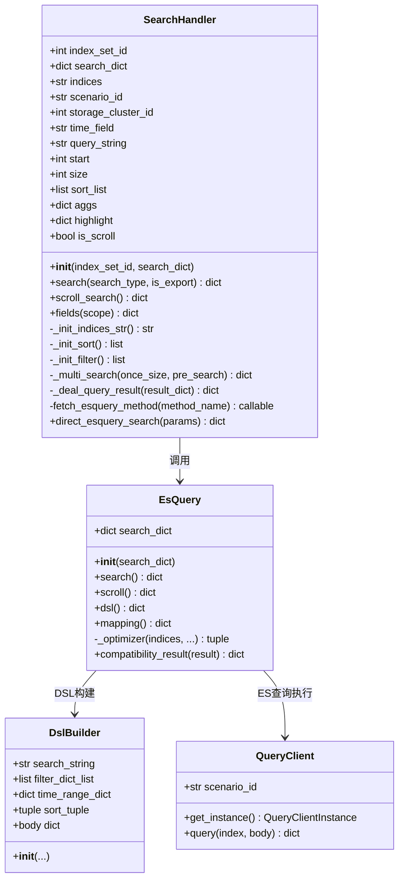
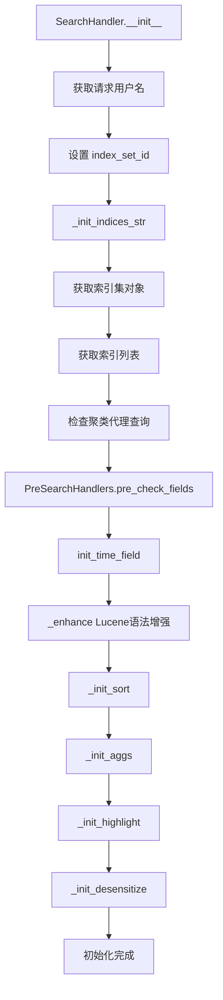
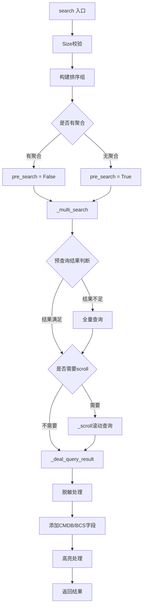

# SearchHandler 核心实现技术文档

## 1. 概述

`SearchHandler` 是 BKLOG 日志检索模块的核心处理器，负责统一处理日志检索请求，协调索引集配置、查询参数构建、EsQuery 调用以及结果处理等完整检索流程。

**文件路径**: `apps/log_search/handlers/search/search_handlers_esquery.py`

---

## 2. 类定义与初始化

### 2.1 类定义（第166-351行）

```python
class SearchHandler:
    def __init__(
        self,
        index_set_id: int,
        search_dict: dict,
        pre_check_enable=True,
        can_highlight=True,
        export_fields=None,
        export_log: bool = False,
        only_for_agg: bool = False,
    ):
        # 请求用户名
        self.request_username = get_request_external_username() or get_request_username()

        self.search_dict: dict = search_dict
        self.export_log = export_log

        # 是否只用于聚合，可以简化某些查询语句
        self.only_for_agg = only_for_agg

        # 透传查询类型
        self.index_set_id = index_set_id
        self.search_dict.update({"index_set_id": index_set_id})

        # 原始索引和场景id（初始化mapping时传递）
        self.origin_indices: str = ""
        self.origin_scenario_id: str = ""

        self.scenario_id: str = ""
        self.storage_cluster_id: int = -1

        # 是否使用了聚类代理查询
        self.using_clustering_proxy = False

        # 构建索引集字符串, 并初始化scenario_id、storage_cluster_id
        self.indices: str = self._init_indices_str()
        self.search_dict.update(
            {"indices": self.indices, "scenario_id": self.scenario_id, "storage_cluster_id": self.storage_cluster_id}
        )

        # ... 更多初始化代码
```

### 2.2 初始化流程核心步骤

| 步骤 | 方法 | 说明 |
|------|------|------|
| 1 | `_init_indices_str()` | 构建索引集字符串，初始化场景ID和存储集群ID |
| 2 | `PreSearchHandlers.pre_check_fields()` | 预检查字段有效性 |
| 3 | `init_time_field()` | 初始化时间字段配置 |
| 4 | `_set_time_filed_type()` | 设置时间字段类型 |
| 5 | `_enhance()` | Lucene语法增强 |
| 6 | `_init_sort()` | 初始化排序列表 |
| 7 | `_init_aggs()` | 初始化聚合参数 |
| 8 | `_init_highlight()` | 初始化高亮配置 |
| 9 | `_init_desensitize()` | 初始化脱敏配置 |

---

## 3. 核心方法分析

### 3.1 search 方法（第643-711行）

`search` 方法是检索的主入口，负责执行完整的检索流程。

```python
def search(self, search_type="default", is_export=False):
    """
    search
    @param search_type:
    @return:
    """
    # 校验是否超出最大查询数量
    if not self.is_scroll and self.size > MAX_RESULT_WINDOW:
        self.size = MAX_RESULT_WINDOW

    if self.is_scroll and self.size > MAX_SEARCH_SIZE:
        raise SearchExceedMaxSizeException(SearchExceedMaxSizeException.MESSAGE.format(size=MAX_SEARCH_SIZE))

    # 判断size，单次最大查询10000条数据
    once_size = copy.deepcopy(self.size)
    if self.size > MAX_RESULT_WINDOW:
        once_size = MAX_RESULT_WINDOW

    # 把time_field,gseIndex,iterationIndex做为一个排序组
    new_sort_list = self.get_sort_group()
    if new_sort_list:
        self.sort_list = new_sort_list

    # 下载操作
    if is_export:
        once_size = MAX_RESULT_WINDOW
        self.size = MAX_RESULT_WINDOW

    # 有聚合时、预查询设置为0时, 不启用预查询
    time_difference = 0
    if self.aggs or settings.PRE_SEARCH_SECONDS == 0:
        pre_search = False
    else:
        pre_search = True
        if self.start_time and self.end_time:
            # 计算时间差
            time_difference = (arrow.get(self.end_time) - arrow.get(self.start_time)).total_seconds()

    # 预查询
    result = self._multi_search(once_size=once_size, pre_search=pre_search)
    if pre_search and len(result["hits"]["hits"]) != self.size and time_difference > settings.PRE_SEARCH_SECONDS:
        # 全量查询
        result = self._multi_search(once_size=once_size)

    # 需要scroll滚动查询：is_scroll为True，size超出单次最大查询限制，total大于MAX_RESULT_WINDOW
    if self._can_scroll(result):
        result = self._scroll(result)

    _scroll_id = result.get("_scroll_id")

    result = self._deal_query_result(result)
    # 脱敏配置日志原文检索 提前返回
    if self.search_dict.get("original_search"):
        return result
    field_dict = self._analyze_field_length(result.get("list"))
    result.update({"fields": field_dict})

    # 保存检索历史
    is_union_search = self.search_dict.get("is_union_search", False)
    if search_type and not is_union_search:
        self._save_history(result, search_type)

    # 补充scroll id
    if _scroll_id:
        result.update({"scroll_id": _scroll_id})

    return result
```

**关键逻辑说明**：

1. **Size校验**: 确保 `size` 不超过 `MAX_RESULT_WINDOW`（默认10000）
2. **排序组构建**: 将时间字段与 `gseIndex`、`iterationIndex` 组合排序
3. **预查询机制**: 对于大时间范围查询，先执行小范围预查询优化性能
4. **Scroll滚动查询**: 当需要获取大量数据时，启用滚动查询
5. **结果处理**: 调用 `_deal_query_result` 处理返回结果

### 3.2 fetch_esquery_method 方法（第756-765行）

根据特性开关选择不同的 EsQuery 调用方式。

```python
def fetch_esquery_method(self, method_name="search"):
    """
    根据特性开关和传入方法名，返回不同方式的调用方法
    :param method_name: 默认返回esquery的search方法
    :return: esquery中定义的方法
    """
    if FeatureToggleObject.switch(DIRECT_ESQUERY_SEARCH, self.search_dict.get("bk_biz_id")):
        return getattr(self, f"direct_esquery_{method_name}")
    else:
        return getattr(BkLogApi, method_name)
```

### 3.3 direct_esquery_search 方法（第767-788行）

直接调用 EsQuery 的 search 方法。

```python
@classmethod
def direct_esquery_search(cls, params, **kwargs):
    data = custom_params_valid(EsQuerySearchAttrSerializer, params)
    start_at = time.time()
    exc = None
    try:
        result = EsQuery(data).search()
    except Exception as e:
        exc = e
        raise
    finally:
        labels = {
            "index_set_id": data.get("index_set_id") or -1,
            "indices": data.get("indices") or "",
            "scenario_id": data.get("scenario_id") or "",
            "storage_cluster_id": data.get("storage_cluster_id") or -1,
            "status": str(exc),
            "source_app_code": get_request_app_code(),
        }
        metrics.ESQUERY_SEARCH_LATENCY.labels(**labels).observe(time.time() - start_at)
        metrics.ESQUERY_SEARCH_COUNT.labels(**labels).inc()
    return result
```

---

## 4. EsQuery 调用过程

### 4.1 EsQuery 类结构

`EsQuery` 类位于 `apps/log_esquery/esquery/esquery.py`，是底层 ES 查询的执行器。

```python
class EsQuery(object):
    def __init__(self, search_dict: type_search_dict):
        self.search_dict: Dict[str, Any] = search_dict
        self._enhance()
        self.include_nested_fields: bool = search_dict.get("include_nested_fields", True)

    def search(self):
        scenario_id, indices, storage_cluster_id = self._init_common_args()
        time_field, time_field_type, time_field_unit = self._init_time_field_args()
        # ... 参数初始化

        query_string, filter_dict_list, index, sort_tuple = self._optimizer(
            indices, scenario_id, start_time, end_time, time_zone, use_time_range
        )

        # 调用DSL生成器
        body = DslBuilder(
            search_string=query_string,
            filter_dict_list=filter_dict_list,
            time_range_dict=time_range_dict,
            sort_tuple=sort_tuple,
            size=size,
            begin=start,
            aggs=aggs,
            highlight=highlight,
            collapse=collapse,
            search_after=search_after,
            use_time_range=use_time_range,
            mappings=mappings,
            time_field=time_field,
            slice_search=self.search_dict.get("slice_search"),
            slice_id=self.search_dict.get("slice_id"),
            slice_max=self.search_dict.get("slice_max"),
        ).body

        client = QueryClient(
            scenario_id,
            storage_cluster_id=storage_cluster_id,
            bkdata_authentication_method=bkdata_authentication_method,
            bkdata_data_token=bkdata_data_token,
        ).get_instance()

        result: Dict[str:Any] = client.query(index, body, scroll=scroll, track_total_hits=track_total_hits)

        return self.compatibility_result(result)
```

### 4.2 调用链路

```
SearchHandler.search()
    -> SearchHandler._multi_search()
        -> SearchHandler.fetch_esquery_method("search")
            -> SearchHandler.direct_esquery_search() 或 BkLogApi.search()
                -> EsQuery.search()
                    -> DslBuilder.body (构建DSL)
                    -> QueryClient.query() (执行查询)
```

---

## 5. 结果处理和兼容性转换

### 5.1 _deal_query_result 方法（第2276-2357行）

查询结果处理的核心方法，负责脱敏、字段增强、高亮处理等。

```python
def _deal_query_result(self, result_dict: dict) -> dict:
    if self.export_fields:
        # 将导出字段和检索日志有的字段取交集
        support_fields_list = [i["field_name"] for i in self.fields()["fields"]]
        self.export_fields = list(set(self.export_fields).intersection(set(support_fields_list)))
    result: dict = {
        "aggregations": result_dict.get("aggregations", {}),
    }
    # 将_shards 字段返回以供saas判断错误
    _shards = result_dict.get("_shards", {})
    result.update({"_shards": _shards})
    log_list: list = []
    agg_result: dict = {}
    origin_log_list: list = []
    if not result_dict.get("hits", {}).get("total"):
        result.update(
            {"total": 0, "took": 0, "list": log_list, "aggs": agg_result, "origin_log_list": origin_log_list}
        )
        return result
    # hit data
    for hit in result_dict["hits"]["hits"]:
        log = hit["_source"]
        # 脱敏处理
        if (self.field_configs or self.text_fields_field_configs) and self.is_desensitize:
            log = self._log_desensitize(log)
        else:
            log = self.convert_keys(log)
        # 联合检索补充索引集信息
        log["__index_set_id__"] = self.index_set_id
        log = self._add_cmdb_fields(log)
        log = self._add_bcs_cluster_fields(log)
        # ... 导出字段处理

        if "highlight" not in hit:
            origin_log_list.append(origin_log)
            log_list.append(log)
            continue
        else:
            origin_log_list.append(copy.deepcopy(origin_log))

        if not (self.field_configs or self.text_fields_field_configs) or not self.is_desensitize:
            log = self._deal_object_highlight(log=log, highlight=hit["highlight"])
        log_list.append(log)

    result.update(
        {
            "total": result_dict["hits"]["total"],
            "took": result_dict["took"],
            "list": log_list,
            "origin_log_list": origin_log_list,
        }
    )
    # 处理聚合
    agg_dict = result_dict.get("aggregations", {})
    result.update({"aggs": agg_dict})
    return result
```

### 5.2 EsQuery 兼容性转换（第143-147行）

```python
def compatibility_result(self, result):
    # 兼容ES不同版本的Total
    if "hits" in result and "total" in result["hits"] and isinstance(result["hits"]["total"], dict):
        result["hits"]["total"] = result["hits"]["total"]["value"]
    return result
```

---

## 6. Mermaid 类图



---

## 7. Mermaid 流程图

### 7.1 SearchHandler 初始化流程



### 7.2 search 方法执行流程



---

## 8. 关键设计模式与特性

### 8.1 特性开关驱动

通过 `FeatureToggleObject` 实现调用方式的动态切换：
- `DIRECT_ESQUERY_SEARCH` 开关决定是否直接调用 EsQuery
- 默认通过 `BkLogApi` 间接调用（支持跨服务调用）

### 8.2 预查询优化

对于大时间范围查询，先执行短时间预查询：
- 减少首次查询的数据量
- 如果预查询结果不足，再执行全量查询

### 8.3 脱敏处理

完整的字段脱敏流程：
- 支持字段级脱敏配置
- 支持原文字段（如 `log`）应用其他字段的脱敏结果

---

## 9. 相关依赖组件

| 组件 | 路径 | 说明 |
|------|------|------|
| EsQuery | `apps/log_esquery/esquery/esquery.py` | ES查询执行器 |
| DslBuilder | `apps/log_esquery/esquery/dsl_builder/dsl_builder.py` | DSL构建器 |
| QueryClient | `apps/log_esquery/esquery/client/QueryClient.py` | ES客户端 |
| MappingHandlers | `apps/log_search/handlers/search/mapping_handlers.py` | 字段映射处理 |

---

**文档版本**: v1.0
**生成日期**: 2026-04-30
**源文件**: `apps/log_search/handlers/search/search_handlers_esquery.py`