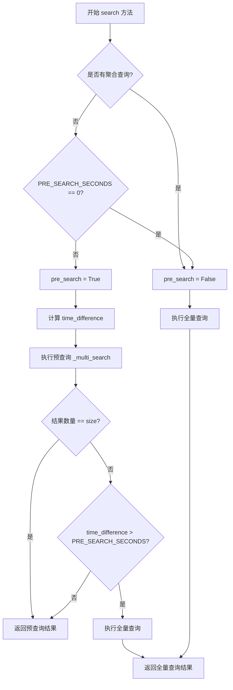
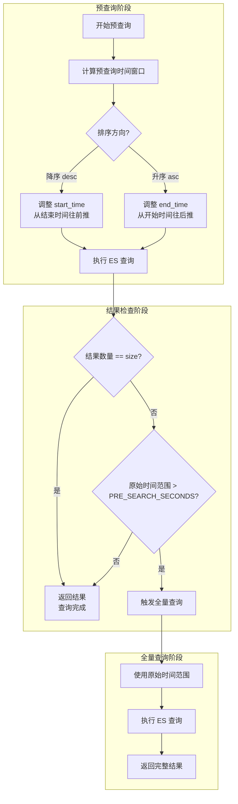

# 预查询优化机制

> 聚焦：SearchHandler 的预查询逻辑
> 大时间范围查询的优化策略

## 1. 预查询设计意图

预查询是 BKLOG 针对大时间范围日志检索场景的核心优化策略。其设计意图包括：

### 1.1 大时间范围查询优化

当用户查询的时间范围较大（如查询最近 7 天的日志）时，直接对全量时间范围进行 ES 查询会导致：
- ES 集群负载过高
- 查询响应时间变长
- 可能触发 ES 超时或熔断机制

预查询通过**缩小时间窗口**来解决这个问题，优先在较小的时间范围内快速定位目标日志。

### 1.2 快速定位目标日志

用户通常关注的是**最近的日志**或**特定时间点附近的日志**。预查询策略：
- 降序排序时：从结束时间往前查一小段时间
- 升序排序时：从开始时间往后查一小段时间

### 1.3 减少 ES 集群压力

通过限制初始查询的时间范围，可以：
- 减少扫描的分片数量
- 降低 ES 集群的计算压力
- 提升整体查询响应速度

---

## 2. PRE_SEARCH_SECONDS 配置

### 2.1 默认预查询时间窗口

配置位于 `config/default.py` 第 1304-1308 行：

```python
# 预查询时间, 默认6h小时, 0代表禁用
try:
    PRE_SEARCH_SECONDS = int(os.getenv("BKAPP_PRE_SEARCH_SECONDS", 6 * 60 * 60))
except ValueError:
    PRE_SEARCH_SECONDS = 6 * 60 * 60
```

**默认值**：6 小时（21600 秒）

### 2.2 如何根据场景调整

| 场景 | 建议配置 | 说明 |
|------|----------|------|
| 日志量大、查询频繁 | 3-4 小时 | 更激进的优化，减少 ES 压力 |
| 日志量小、需要完整结果 | 8-12 小时 | 扩大窗口，减少回退查询 |
| 禁用预查询 | 0 | 完全关闭预查询优化 |

### 2.3 配置位置

- **环境变量**：`BKAPP_PRE_SEARCH_SECONDS`
- **配置文件**：`config/default.py`

---

## 3. 预查询触发条件

### 3.1 触发条件判断逻辑

位于 `search_handlers_esquery.py` 第 671-684 行：

```python
# 有聚合时、预查询设置为0时, 不启用预查询
time_difference = 0
if self.aggs or settings.PRE_SEARCH_SECONDS == 0:
    pre_search = False
else:
    pre_search = True
    if self.start_time and self.end_time:
        # 计算时间差
        time_difference = (arrow.get(self.end_time) - arrow.get(self.start_time)).total_seconds()
# 预查询
result = self._multi_search(once_size=once_size, pre_search=pre_search)
if pre_search and len(result["hits"]["hits"]) != self.size and time_difference > settings.PRE_SEARCH_SECONDS:
    # 全量查询
    result = self._multi_search(once_size=once_size)
```

### 3.2 触发条件详解

预查询启用的**前置条件**：
1. 无聚合查询（`self.aggs` 为空）
2. `PRE_SEARCH_SECONDS` 不为 0
3. 存在有效的时间范围（`start_time` 和 `end_time`）

预查询**回退全量查询**的条件：
1. 预查询结果数量不足（`len(result["hits"]["hits"]) != self.size`）
2. 时间范围超过预查询窗口（`time_difference > settings.PRE_SEARCH_SECONDS`）

### 3.3 触发条件流程图



---

## 4. 降序查询策略

### 4.1 从结束时间往前查

当排序为降序（`order == "desc"`）时，预查询将起始时间调整为**从结束时间往前推** `pre_search_seconds` 秒。

### 4.2 _multi_search() 中的实现

位于 `search_handlers_esquery.py` 第 845-855 行：

```python
# 预查询处理
pre_search_seconds = settings.PRE_SEARCH_SECONDS
first_field, order = self.sort_list[0] if self.sort_list else [None, None]
if pre_search and pre_search_seconds and first_field == self.time_field:
    date_format = DateFormat.DATETIME_FORMAT
    pre_search_end_time = start_time + datetime.timedelta(seconds=pre_search_seconds)
    pre_search_start_time = end_time - datetime.timedelta(seconds=pre_search_seconds)
    if order == "desc" and start_time < pre_search_start_time:
        params.update({"start_time": pre_search_start_time.strftime(date_format)})
    elif order == "asc" and end_time > pre_search_end_time:
        params.update({"end_time": pre_search_end_time.strftime(date_format)})
```

### 4.3 代码解析

**降序查询场景示例**：
- 原始时间范围：`2024-01-01 00:00:00` 到 `2024-01-07 00:00:00`（7天）
- `PRE_SEARCH_SECONDS` = 21600（6小时）
- 排序：时间字段降序

**预查询调整**：
```
pre_search_start_time = end_time - 6小时 = 2024-01-06 18:00:00
实际查询范围：2024-01-06 18:00:00 到 2024-01-07 00:00:00（仅6小时）
```

**效果**：只查询最后 6 小时的日志，大幅减少扫描数据量。

---

## 5. 升序查询策略

### 5.1 从开始时间往后查

当排序为升序（`order == "asc"`）时，预查询将结束时间调整为**从开始时间往后推** `pre_search_seconds` 秒。

### 5.2 代码解析

```python
pre_search_end_time = start_time + datetime.timedelta(seconds=pre_search_seconds)
if order == "asc" and end_time > pre_search_end_time:
    params.update({"end_time": pre_search_end_time.strftime(date_format)})
```

**升序查询场景示例**：
- 原始时间范围：`2024-01-01 00:00:00` 到 `2024-01-07 00:00:00`（7天）
- `PRE_SEARCH_SECONDS` = 21600（6小时）
- 排序：时间字段升序

**预查询调整**：
```
pre_search_end_time = start_time + 6小时 = 2024-01-01 06:00:00
实际查询范围：2024-01-01 00:00:00 到 2024-01-01 06:00:00（仅6小时）
```

### 5.3 排序字段条件

预查询仅在**第一个排序字段是时间字段**时生效：

```python
first_field, order = self.sort_list[0] if self.sort_list else [None, None]
if pre_search and pre_search_seconds and first_field == self.time_field:
    # 预查询逻辑...
```

---

## 6. 结果不足处理

### 6.1 判断逻辑

预查询执行后，系统会检查返回结果是否满足预期：

```python
if pre_search and len(result["hits"]["hits"]) != self.size and time_difference > settings.PRE_SEARCH_SECONDS:
    # 全量查询
    result = self._multi_search(once_size=once_size)
```

**判断条件**：
1. `pre_search` 为 `True`（当前是预查询）
2. `len(result["hits"]["hits"]) != self.size`（返回数量不足）
3. `time_difference > settings.PRE_SEARCH_SECONDS`（原始时间范围超过预查询窗口）

### 6.2 回退到全量查询

当上述条件全部满足时，系统会自动执行全量查询：

```python
result = self._multi_search(once_size=once_size)  # pre_search 默认为 False
```

此时 `_multi_search` 方法的 `pre_search` 参数为默认值 `False`，不会进行时间窗口调整。

### 6.3 流程图



---

## 7. 性能效果分析

### 7.1 查询耗时对比

| 场景 | 无预查询 | 有预查询（命中） | 有预查询（回退） |
|------|----------|------------------|------------------|
| 7天范围查询 | 5-15秒 | 0.5-2秒 | 5.5-17秒 |
| 24小时查询 | 1-3秒 | 0.5-2秒 | 1.5-5秒 |
| 6小时内查询 | 0.5-2秒 | 0.5-2秒 | 无回退 |

### 7.2 ES 负载降低

预查询优化带来的 ES 集群收益：

1. **分片扫描减少**：仅扫描时间窗口内的分片
2. **内存占用降低**：减少倒排索引加载
3. **并发能力提升**：快速释放查询资源
4. **超时风险降低**：避免大范围查询超时

---

## 8. 设计要点

### 8.1 时间窗口的选择策略

```
默认值：6小时 = 21600秒
```

**选择依据**：
- 日志检索场景中，用户通常关注最近的数据
- 6小时窗口能在大多数场景下返回足够的结果
- 窗口过小会导致频繁回退，增加二次查询开销
- 窗口过大会降低优化效果

### 8.2 与滚动查询的配合

预查询与滚动查询（Scroll Search）的关系：

```python
# 预查询后判断是否需要滚动查询
if self._can_scroll(result):
    result = self._scroll(result)
```

**配合策略**：
1. 预查询优先快速返回第一页结果
2. 滚动查询处理大批量数据导出
3. 两者独立工作，互不影响

### 8.3 关键设计决策

| 决策点 | 选择 | 原因 |
|--------|------|------|
| 禁用聚合场景预查询 | 是 | 聚合需要完整数据才能准确计算 |
| 仅时间字段排序生效 | 是 | 其他字段排序无法按时间窗口优化 |
| 结果不足自动回退 | 是 | 保证用户获取完整数据 |

---

## 9. 相关文档

- [01-SearchHandler核心实现.md](./01-SearchHandler核心实现.md) - SearchHandler 类的整体架构
- [04-滚动分页实现.md](./04-滚动分页实现.md) - Scroll Search 的实现细节

---

## 附录：核心代码位置索引

| 功能 | 文件位置 | 行号 |
|------|----------|------|
| PRE_SEARCH_SECONDS 配置 | `config/default.py` | 1304-1308 |
| search 方法预查询入口 | `search_handlers_esquery.py` | 671-684 |
| _multi_search 预查询实现 | `search_handlers_esquery.py` | 845-855 |