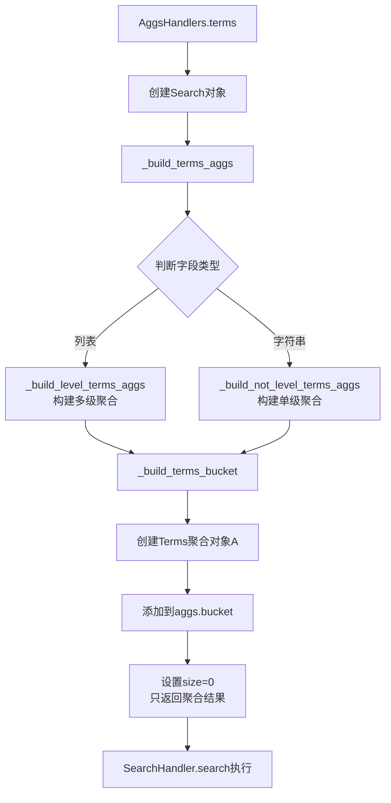
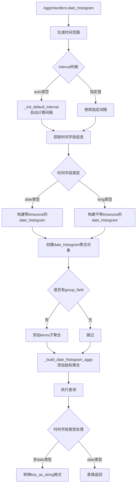
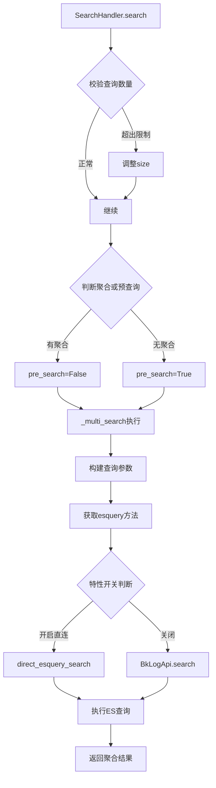
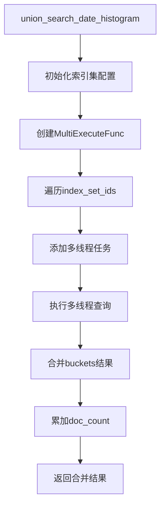
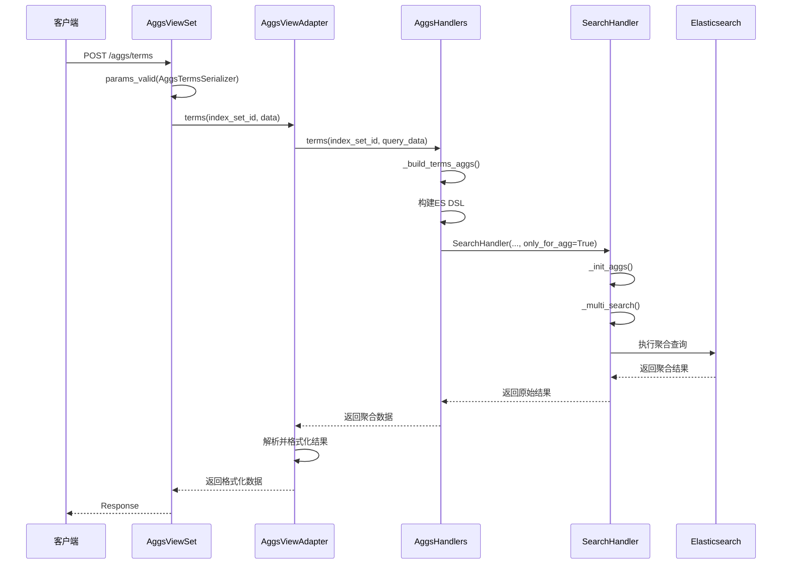

# BKLOG 聚合分析实现技术文档

## 1. 概述

BKLOG 的聚合分析模块提供了基于 Elasticsearch 的两种核心聚合能力：
- **Terms 聚合**：用于字段值的分组统计，统计各值的文档数量
- **Date Histogram 聚合**：用于时间维度的聚合，生成时间序列数据

本文档详细分析聚合参数的初始化处理、ES DSL 构建、查询执行和结果解析的完整流程。

---

## 2. 核心类结构

```mermaid
classDiagram
    class AggsBase {
        +terms(index_set_id, query_data)
        +date_histogram(index_set_id, query_data)
    }

    class AggsHandlers {
        +AGGS_BUCKET_SIZE = 100
        +DEFAULT_ORDER = {"_count": "desc"}
        +TIME_FORMAT = "yyyy-MM-dd HH:mm:ss"
        +MIN_DOC_COUNT = 0
        +terms(index_set_id, query_data)
        +date_histogram(index_set_id, query_data)
        -_build_terms_aggs(s, fields, size, order)
        -_build_terms_bucket(aggs, field, size, order)
        -_build_date_histogram_aggs(s, fields, size)
        -_init_default_interval(start_time, end_time)
    }

    class AggsViewAdapter {
        -_aggs_handlers: AggsHandlers
        +terms(index_set_id, query_data)
        +date_histogram(index_set_id, query_data)
        +union_search_date_histogram(query_data)
        +union_search_terms(query_data)
        -_init_union_configs(union_configs)
        -_del_empty_histogram(aggs)
    }

    class SearchHandler {
        +aggs: dict
        +search(search_type, is_export)
        -_init_aggs()
        -_multi_search(once_size, pre_search)
    }

    AggsBase <|-- AggsHandlers
    AggsViewAdapter --> AggsHandlers
    AggsHandlers --> SearchHandler
```

---

## 3. 聚合参数初始化和处理

### 3.1 入口视图层参数验证

**文件位置**: `apps/log_search/views/aggs_views.py`

聚合请求通过 `AggsViewSet` 视图集处理，包含四个核心接口：

```python
# 第 42-49 行
class AggsViewSet(APIViewSet):
    serializer_class = serializers.Serializer
    lookup_field = "index_set_id"

    def get_permissions(self):
        if self.action in ["union_search_date_histogram", "union_search_terms"]:
            return [BatchIAMPermission("index_set_ids", [ActionEnum.SEARCH_LOG], ResourceEnum.INDICES)]
        return [InstanceActionPermission([ActionEnum.SEARCH_LOG], ResourceEnum.INDICES)]
```

**Terms 聚合接口**:

```python
# 第 51-103 行
@detail_route(methods=["POST"], url_path="aggs/terms")
def terms(self, request, index_set_id=None):
    """
    Terms聚合接口，返回字段值的doc_count统计
    """
    data = self.params_valid(AggsTermsSerializer)
    if FeatureToggleObject.switch(UNIFY_QUERY_SEARCH, data.get("bk_biz_id")):
        data["index_set_ids"] = [index_set_id]
        return Response(UnifyQueryTermsAggsHandler(data.get("fields", []), data).terms())
    return Response(AggsViewAdapter().terms(index_set_id, data))
```

**Date Histogram 聚合接口**:

```python
# 第 105-189 行
@detail_route(methods=["POST"], url_path="aggs/date_histogram")
def date_histogram(self, request, index_set_id=None):
    """
    按时间聚合接口，生成时间线曲线图
    """
    data = self.params_valid(DateHistogramSerializer)
    if FeatureToggleObject.switch(UNIFY_QUERY_SEARCH, data.get("bk_biz_id")):
        data["index_set_ids"] = [index_set_id]
        return Response(UnifyQueryHandler(data).date_histogram())
    return Response(AggsViewAdapter().date_histogram(index_set_id, data))
```

### 3.2 序列化器参数校验

**文件位置**: `apps/log_trace/serializers.py`

**Terms 聚合参数序列化器**:

```python
# 第 76-111 行
class AggsTermsSerializer(serializers.Serializer):
    # 时间选择器字段
    start_time = DateTimeFieldWithEpoch(required=False)
    end_time = DateTimeFieldWithEpoch(required=False)
    time_range = serializers.CharField(required=False, default=None)

    # 聚合参数
    size = serializers.IntegerField(required=False, default=100)
    order = serializers.DictField(required=False, default={"_count": "desc"})
    fields = serializers.ListField(
        child=serializers.CharField(),
        required=True,
        allow_empty=False
    )
    keyword = serializers.CharField(required=False, default="*")
    addition = serializers.ListField(required=False, default=[])
```

**Date Histogram 聚合参数序列化器**:

```python
# 第 114-138 行
class DateHistogramSerializer(TraceSearchAttrSerializer):
    class DateHistogramFieldSerializer(serializers.Serializer):
        term_filed = serializers.CharField(required=True)
        metric_type = serializers.ChoiceField(required=False, choices=MetricTypeEnum.get_choices())
        metric_field = serializers.CharField(required=False)

        def validate(self, attrs):
            attrs = super().validate(attrs)
            metric_type = attrs.get("metric_type")
            metric_field = attrs.get("metric_field")
            if metric_type and not metric_field:
                raise ValidationError(_("metric_field字段不能为空"))
            return attrs

    fields = serializers.ListField(child=DateHistogramFieldSerializer(), required=False, default=[])
    interval = serializers.CharField(required=False, default="auto", max_length=16)
    custom_indices = serializers.CharField(required=False, allow_null=True, allow_blank=True, default="")
    group_field = serializers.CharField(required=False, allow_null=True, allow_blank=True)
    time_zone = serializers.CharField(required=False, allow_null=True, allow_blank=True)
```

### 3.3 SearchHandler 中聚合参数初始化

**文件位置**: `apps/log_search/handlers/search/search_handlers_esquery.py`

```python
# 第 282 行 - 聚合参数初始化
self.aggs: dict = self._init_aggs()

# 第 2162-2168 行 - 聚合参数处理方法
def _init_aggs(self):
    if not self.search_dict.get("aggs"):
        return {}

    # 存在聚合参数，且时间聚合更新默认设置
    aggs_dict = self.search_dict["aggs"]
    return aggs_dict
```

---

## 4. ES 聚合 DSL 构建

### 4.1 Terms 聚合 DSL 构建

**文件位置**: `apps/log_search/handlers/search/aggs_handlers.py`



**核心代码分析**:

```python
# 第 74-92 行 - Terms 聚合入口方法
@classmethod
def terms(cls, index_set_id, query_data: dict):
    """
    聚合搜索
    :param index_set_id: 索引集ID
    :param query_data: 聚合属性列表
    :return:
    """
    # 组合聚合查询字段
    query_data = copy.deepcopy(query_data)
    s = Search()
    s = cls._build_terms_aggs(
        s,
        query_data["fields"],
        query_data.get("size", cls.AGGS_BUCKET_SIZE),
        query_data.get("order", cls.DEFAULT_ORDER),
    )
    s = s.extra(size=0)  # 只返回聚合结果，不返回文档
    query_data.update(s.to_dict())
    return SearchHandlerEsquery(index_set_id, query_data, only_for_agg=True).search(search_type=None)
```

**聚合桶构建方法**:

```python
# 第 95-104 行 - 构建聚合DSL
@classmethod
def _build_terms_aggs(cls, s: Search, fields: list, size: int, order: dict) -> Search:
    for field in fields:
        if isinstance(field, list):
            s = cls._build_level_terms_aggs(s, field, size, order)
            continue
        # 字段为空时将其丢弃，防止构建出不合法的aggs
        if isinstance(field, str) and field == "":
            continue
        s = cls._build_not_level_terms_aggs(s, field, size, order)
    return s

# 第 118-134 行 - 构建单个聚合桶
@classmethod
def _build_terms_bucket(cls, aggs, field: str, size: int, order: dict) -> Search:
    sub_aggs = {}
    extra_params = {}
    field_name = field
    if isinstance(field, dict):
        field_name = field.get("field_name")
        sub_fields = field.get("sub_fields")

        if "missing" in field:
            # 填充默认值
            extra_params["missing"] = field["missing"]

        if sub_fields:
            sub_aggs = cls._build_sub_terms_fields(sub_fields, size, order)
    terms = A("terms", field=field_name, size=size, order=order, aggs=sub_aggs, **extra_params)
    return aggs.bucket(field_name, terms)
```

**生成的 ES DSL 示例**:

```json
{
  "size": 0,
  "aggs": {
    "tag.scenario": {
      "terms": {
        "field": "tag.scenario",
        "size": 100,
        "order": {"_count": "desc"}
      }
    },
    "tag.service": {
      "terms": {
        "field": "tag.service",
        "size": 100,
        "order": {"_count": "desc"}
      }
    }
  }
}
```

### 4.2 Date Histogram 聚合 DSL 构建



**核心代码分析**:

```python
# 第 168-243 行 - Date Histogram 聚合入口方法
@classmethod
def date_histogram(cls, index_set_id, query_data: dict):
    query_data = copy.deepcopy(query_data)
    s = Search()
    # 按照日期时间聚合
    interval = query_data.get("interval")

    # 生成起止时间
    time_zone = get_local_param("time_zone", settings.TIME_ZONE)
    start_time, end_time = generate_time_range(
        query_data.get("time_range"), query_data.get("start_time"), query_data.get("end_time"), time_zone
    )

    if not interval or interval == "auto":
        interval = cls._init_default_interval(start_time, end_time)

    time_format = cls.TIME_FORMAT_MAP.get(interval, cls.TIME_FORMAT)
    datetime_format = cls.DATETIME_FORMAT_MAP.get(interval, cls.DATETIME_FORMAT)

    time_field, time_field_type, time_field_unit = SearchHandlerEsquery.init_time_field(index_set_id)

    # 根据时间字段类型构建不同的date_histogram聚合
    if time_field_type == TimeFieldTypeEnum.DATE.value:
        min_value = int(start_time.timestamp() * 1000)
        max_value = int(end_time.timestamp() * 1000)
        date_histogram = A(
            "date_histogram",
            field=time_field,
            interval=interval,
            format=time_format,
            time_zone=time_zone,
            min_doc_count=cls.MIN_DOC_COUNT,
            extended_bounds={"min": min_value, "max": max_value},
        )
    else:
        # 非date类型不支持timezone和time format
        num = 10**3
        if time_field_unit == TimeFieldUnitEnum.SECOND.value:
            num = 1
        elif time_field_unit == TimeFieldUnitEnum.MICROSECOND.value:
            num = 10**6
        min_value = int(start_time.timestamp() * num)
        max_value = int(end_time.timestamp() * num)
        date_histogram = A(
            "date_histogram",
            field=time_field,
            interval=interval,
            min_doc_count=cls.MIN_DOC_COUNT,
            extended_bounds={"min": min_value, "max": max_value},
        )

    aggs = s.aggs.bucket("group_by_histogram", date_histogram)

    group_field = query_data.get("group_field")
    if group_field:
        # 在时间桶的基础上进行分组字段的聚合
        aggs = aggs.bucket(
            group_field, A("terms", field=group_field, size=cls.AGGS_BUCKET_SIZE, missing="__miss__")
        )

    cls._build_date_histogram_aggs(aggs, query_data["fields"], query_data.get("size", cls.AGGS_BUCKET_SIZE))
    s = s.extra(size=0)
    query_data.update(s.to_dict())

    result = SearchHandlerEsquery(index_set_id, query_data, only_for_agg=True).search(search_type=None)

    # 非date类型需要转换时间格式
    if time_field_type != TimeFieldTypeEnum.DATE.value:
        buckets = result.get("aggregations", {}).get("group_by_histogram", {}).get("buckets", [])
        time_multiplicator = 1 / (10**3)
        if time_field_unit == TimeFieldUnitEnum.SECOND.value:
            time_multiplicator = 1
        elif time_field_unit == TimeFieldUnitEnum.MICROSECOND.value:
            time_multiplicator = 1 / (10**6)
        for _buckets in buckets:
            _buckets["key_as_string"] = timestamp_to_timeformat(
                _buckets["key"], time_multiplicator=time_multiplicator, t_format=datetime_format, tzformat=False
            )

    return result
```

**自动间隔计算逻辑**:

```python
# 第 245-255 行
@staticmethod
def _init_default_interval(start_time: datetime, end_time: datetime):
    hour_interval = int((end_time - start_time).total_seconds() / 3600)
    if hour_interval <= 1:
        return "1m"
    elif hour_interval <= 6:
        return "5m"
    elif hour_interval <= 72:
        return "1h"
    else:
        return "1d"
```

**时间格式映射**:

```python
# 第 59-66 行
TIME_FORMAT = "yyyy-MM-dd HH:mm:ss"
TIME_FORMAT_MAP = {
    "1m": "HH:mm",
    "5m": "HH:mm",
    "1h": "yyyy-MM-dd HH",
    "1d": "yyyy-MM-dd",
}
DATETIME_FORMAT_MAP = {"1m": "%H:%M", "5m": "%H:%M", "1h": "%Y-%m-%d %H", "1d": "%Y-%m-%d"}
DATETIME_FORMAT = "%Y-%m-%d %H:%M:%S"
```

**生成的 ES DSL 示例**:

```json
{
  "size": 0,
  "aggs": {
    "group_by_histogram": {
      "date_histogram": {
        "field": "dtEventTimeStamp",
        "interval": "1m",
        "format": "HH:mm",
        "time_zone": "Asia/Shanghai",
        "min_doc_count": 0,
        "extended_bounds": {
          "min": 1690790100000,
          "max": 1690791000000
        }
      },
      "aggs": {
        "tags.result_code": {
          "terms": {
            "field": "tags.result_code",
            "size": 100,
            "min_doc_count": 0
          },
          "aggs": {
            "tags.result_code": {
              "avg": {
                "field": "duration"
              }
            }
          }
        }
      }
    }
  }
}
```

---

## 5. 聚合查询执行流程

### 5.1 SearchHandler 查询执行



**查询执行核心代码**:

```python
# 第 643-711 行 - search 方法
def search(self, search_type="default", is_export=False):
    # 校验是否超出最大查询数量
    if not self.is_scroll and self.size > MAX_RESULT_WINDOW:
        self.size = MAX_RESULT_WINDOW

    # 有聚合时、预查询设置为0时, 不启用预查询
    time_difference = 0
    if self.aggs or settings.PRE_SEARCH_SECONDS == 0:
        pre_search = False
    else:
        pre_search = True

    # 执行查询
    result = self._multi_search(once_size=once_size, pre_search=pre_search)

    # 处理查询结果
    result = self._deal_query_result(result)
    return result

# 第 800-898 行 - _multi_search 方法
def _multi_search(self, once_size: int, pre_search: bool = False):
    """
    根据存储集群切换记录多线程请求 BkLogApi.search
    """
    params = {
        "indices": self.indices,
        "scenario_id": self.scenario_id,
        "storage_cluster_id": self.storage_cluster_id,
        "start_time": self.start_time,
        "end_time": self.end_time,
        "filter": self.filter,
        "query_string": self.query_string,
        "sort_list": self.sort_list,
        "start": self.start,
        "size": once_size,
        "aggs": self.aggs,
        "highlight": self.highlight,
        "use_time_range": self.use_time_range,
        "time_zone": self.time_zone,
        "time_range": self.time_range,
        "time_field": self.time_field,
        "time_field_type": self.time_field_type,
        "time_field_unit": self.time_field_unit,
        ...
    }

    # 获取search对应的esquery方法
    search_func = self.fetch_esquery_method(method_name="search")

    try:
        data = search_func(params)
        return data
    except Exception as e:
        raise handle_es_query_error(e)
```

---

## 6. 聚合结果解析和返回

### 6.1 Terms 聚合结果解析

**文件位置**: `apps/log_search/handlers/search/aggs_handlers.py`

```python
# 第 320-335 行 - AggsViewAdapter.terms
def terms(self, index_set_id, query_data: dict):
    terms_result = self._aggs_handlers.terms(index_set_id, query_data)
    aggs_result = terms_result.get("aggs", {})
    terms_data = defaultdict(dict)

    for _field in query_data["fields"]:
        field_agg_result = aggs_result.get(_field)
        if not field_agg_result:
            terms_data["aggs"].update({_field: []})
            terms_data["aggs_items"].update({_field: []})
            continue
        terms_data["aggs"].update({_field: field_agg_result})
        terms_data["aggs_items"].update(
            {_field: list(map(lambda item: item.get("key"), field_agg_result.get("buckets", [])))}
        )
    return terms_data
```

**返回结果格式**:

```json
{
    "aggs": {
        "tag.scenario": {
            "buckets": [
                {"key": "a", "doc_count": 1},
                {"key": "b", "doc_count": 2},
                {"key": "d", "doc_count": 4}
            ]
        },
        "tag.service": {
            "buckets": [
                {"key": "a", "doc_count": 1},
                {"key": "b", "doc_count": 2}
            ]
        }
    },
    "aggs_items": {
        "tag.scenario": ["a", "b", "d"],
        "tag.service": ["a", "b"]
    }
}
```

### 6.2 Date Histogram 聚合结果解析

```python
# 第 337-429 行 - AggsViewAdapter.date_histogram
def date_histogram(self, index_set_id, query_data: dict):
    histogram_result = self._aggs_handlers.date_histogram(index_set_id, query_data)
    histogram_data = histogram_result.get("aggs", {}).get("group_by_histogram", {})

    # 当返回的数据为空且包含failures字段时报错
    failures = histogram_result.get("_shards", {}).get("failures")
    if failures:
        logger.error(f"Get date_histogram error: {failures}")
        raise DateHistogramException(
            DateHistogramException.MESSAGE.format(index_set_id=index_set_id, err=failures[0]["reason"]["type"])
        )

    field_have_metric = {
        item["term_filed"]: True if item.get("metric_type") else False for item in query_data["fields"]
    }

    agg_fields = {field["term_filed"]: field["term_filed"] for field in query_data.get("fields")}

    histogram_dict = {}
    labels = []

    for _data in histogram_data.get("buckets", []):
        # labels 横坐标时间轴
        labels.append(_data.get("key_as_string"))

        # filed 查询结果
        for field in agg_fields.keys():
            _filed_key = field
            filed_data_dict = histogram_dict.get(_filed_key, {}).get("datasets", {})

            # 获取需要返回的指标key
            metric_key = "doc_count"
            if field_have_metric[_filed_key]:
                metric_key = _filed_key

            buckets = _data.get(field, {}).get("buckets", [])
            for _doc in buckets:
                # 获取指标值和doc_count
                if metric_key == "doc_count":
                    doc_count = doc_value = _doc.get("doc_count") or 0
                else:
                    doc_count = _doc.get("doc_count") or 0
                    doc_value = int(_doc.get(metric_key, {}).get("value") or 0)

                doc_key = _doc["key"]
                if doc_key not in filed_data_dict:
                    filed_data_dict.update(
                        {
                            doc_key: {
                                "label": _doc.get("key"),
                                "data": [
                                    {
                                        "label": timestamp_to_timeformat(_data.get("key")),
                                        "value": doc_value,
                                        "count": doc_count,
                                    }
                                ],
                            }
                        }
                    )
                else:
                    filed_data_dict[doc_key]["data"].append(
                        {
                            "label": timestamp_to_timeformat(_data.get("key")),
                            "value": doc_value,
                            "count": doc_count,
                        }
                    )

            histogram_dict.update({_filed_key: {"labels": labels, "datasets": filed_data_dict}})

    return_data["aggs"] = self._del_empty_histogram(return_data["aggs"])
    return return_data
```

**返回结果格式**:

```json
{
    "aggs": {
        "tag.result_code": {
            "labels": ["00:00", "00:01", "00:02"],
            "datasets": [{
                "label": 891,
                "data": [
                    {"label": "00:00", "value": 15, "count": 15},
                    {"label": "00:01", "value": 9, "count": 9},
                    {"label": "00:02", "value": 1, "count": 1}
                ]
            }]
        }
    }
}
```

### 6.3 空数据清理

```python
# 第 553-591 行 - _del_empty_histogram
def _del_empty_histogram(self, aggs):
    """
    将对应data.count为空的label去除
    """
    for agg in aggs.values():
        datasets = copy.deepcopy(agg["datasets"])
        for dataset in datasets:
            for index, data in enumerate(dataset["data"]):
                if data["count"] or data["value"]:
                    break
                if index == len(dataset["data"]) - 1:
                    agg["datasets"].remove(dataset)

    return aggs
```

---

## 7. 联合检索聚合

### 7.1 联合检索 Date Histogram



```python
# 第 431-473 行 - union_search_date_histogram
def union_search_date_histogram(self, query_data: dict):
    index_set_ids = query_data.get("index_set_ids", [])
    union_configs = query_data.get("union_configs", [])

    # 初始化索引集配置
    union_config_map = self._init_union_configs(union_configs)

    # 多线程请求数据
    multi_execute_func = MultiExecuteFunc()

    for index_set_id in index_set_ids:
        if union_config_map:
            query_data["custom_indices"] = union_config_map.get(index_set_id, {}).get("custom_indices", "")
        params = {"index_set_id": index_set_id, "query_data": query_data}
        multi_execute_func.append(
            result_key=f"union_search_date_histogram_{index_set_id}",
            func=AggsViewAdapter().date_histogram,
            params=params,
            multi_func_params=True,
        )

    multi_result = multi_execute_func.run()

    buckets_info = dict()
    # 处理返回结果 - 合并各索引集的时间桶数据
    for index_set_id in index_set_ids:
        result = multi_result.get(f"union_search_date_histogram_{index_set_id}", {})
        aggs = result.get("aggs", {})
        if not aggs:
            continue
        buckets = aggs["group_by_histogram"]["buckets"]
        for bucket in buckets:
            key_as_string = bucket["key_as_string"]
            if key_as_string not in buckets_info:
                buckets_info[key_as_string] = bucket
            else:
                buckets_info[key_as_string]["doc_count"] += bucket["doc_count"]

    ret_data = (
        {"aggs": {"group_by_histogram": {"buckets": buckets_info.values()}}} if buckets_info else {"aggs": {}}
    )

    return ret_data
```

### 7.2 联合检索 Terms

```python
# 第 475-551 行 - union_search_terms
def union_search_terms(self, query_data: dict):
    index_set_ids = query_data.get("index_set_ids", [])
    union_configs = query_data.get("union_configs", [])

    # 初始化索引集配置
    union_config_map = self._init_union_configs(union_configs)

    # 多线程请求数据
    multi_execute_func = MultiExecuteFunc()

    for index_set_id in index_set_ids:
        params = {"index_set_id": index_set_id, "query_data": query_data}
        multi_execute_func.append(
            result_key=f"union_search_terms_{index_set_id}",
            func=AggsViewAdapter().terms,
            params=params,
            multi_func_params=True,
        )

    multi_result = multi_execute_func.run()

    aggs_all = dict()
    aggs_items_all = dict()

    # 处理返回结果 - 合并各索引集的聚合数据
    for index_set_id in index_set_ids:
        result = multi_result.get(f"union_search_terms_{index_set_id}", {})
        # 合并aggs和aggs_items
        ...

    # buckets 合并排序
    for all_key, all_value in aggs_all.items():
        buckets = all_value.get("buckets", [])
        buckets_info = dict()
        for bucket in buckets:
            bucket_key = bucket["key"]
            if bucket_key not in buckets_info:
                buckets_info[bucket_key] = bucket
            else:
                buckets_info[bucket_key]["doc_count"] += bucket["doc_count"]

        sorted_buckets = sorted(list(buckets_info.values()), key=operator.itemgetter("doc_count"), reverse=True)
        all_value["buckets"] = sorted_buckets

    return {"aggs": aggs_all, "aggs_items": aggs_items_all}
```

---

## 8. 时间字段处理

### 8.1 时间字段类型枚举

**文件位置**: `apps/log_search/constants.py`

```python
# 第 868-891 行
class TimeFieldTypeEnum(ChoicesEnum):
    """
    时间字段类型
    """
    DATE = "date"
    LONG = "long"

    _choices_labels = (
        (DATE, _("date")),
        (LONG, _("long")),
    )


class TimeFieldUnitEnum(ChoicesEnum):
    """
    时间字段单位
    """
    SECOND = "second"
    MILLISECOND = "millisecond"
    MICROSECOND = "microsecond"

    _choices_labels = ((SECOND, _("second")), (MILLISECOND, _("millisecond")), (MICROSECOND, _("microsecond")))


# 时间单位倍数映射关系
TIME_FIELD_MULTIPLE_MAPPING = {
    TimeFieldUnitEnum.SECOND.value: 1000,
    TimeFieldUnitEnum.MILLISECOND.value: 1,
    TimeFieldUnitEnum.MICROSECOND.value: 1 / 1000,
}
```

### 8.2 指标聚合类型

**文件位置**: `apps/log_trace/constants.py`

```python
# 第 123-128 行
class MetricTypeEnum(ChoicesEnum):
    """
    ES 指标聚合
    """
    AVG = "avg"
    # ... 其他聚合类型
```

---

## 9. 异常处理

**文件位置**: `apps/log_search/exceptions.py`

```python
# 第 406-408 行
class DateHistogramException(BaseException):
    ERROR_CODE = "424"
    MESSAGE = _("索引集【{index_set_id}】聚合查询异常：{err}")
```

---

## 10. 完整调用流程图



---

## 11. 核心文件路径汇总

| 文件路径 | 功能描述 |
|---------|---------|
| `apps/log_search/handlers/search/aggs_handlers.py` | 聚合处理器核心实现 |
| `apps/log_search/handlers/search/search_handlers_esquery.py` | 搜索处理器，聚合执行入口 |
| `apps/log_search/views/aggs_views.py` | 聚合API视图层 |
| `apps/log_trace/serializers.py` | 聚合参数序列化器 |
| `apps/log_search/constants.py` | 时间字段类型常量 |
| `apps/log_search/exceptions.py` | 异常定义 |
| `apps/log_search/handlers/es/dsl_bkdata_builder.py` | DSL构建器（上下文查询） |

---

## 12. 总结

BKLOG 的聚合分析实现采用了清晰的分层架构：

1. **视图层**：负责参数验证、权限校验和路由分发
2. **适配层**：`AggsViewAdapter` 负责结果格式化和多索引集联合查询
3. **处理层**：`AggsHandlers` 负责ES DSL构建和核心聚合逻辑
4. **执行层**：`SearchHandler` 负责查询执行和结果处理

关键设计要点：
- 使用 `elasticsearch-dsl` 库的 `A` 对象构建聚合DSL
- 自动根据时间范围计算合适的聚合间隔
- 支持多级聚合（terms嵌套）和指标聚合（avg等）
- 联合检索通过多线程并行查询后合并结果
- 针对不同时间字段类型（date/long）采用不同的处理策略

---

**文档版本**: v1.0
**生成日期**: 2026-04-30
**源码路径**: `apps/log_search/handlers/search/aggs_handlers.py`