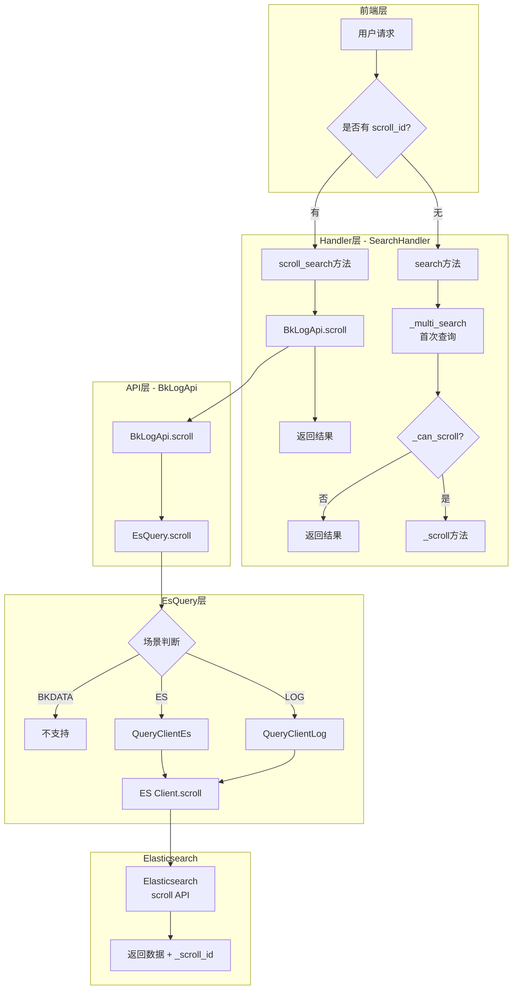
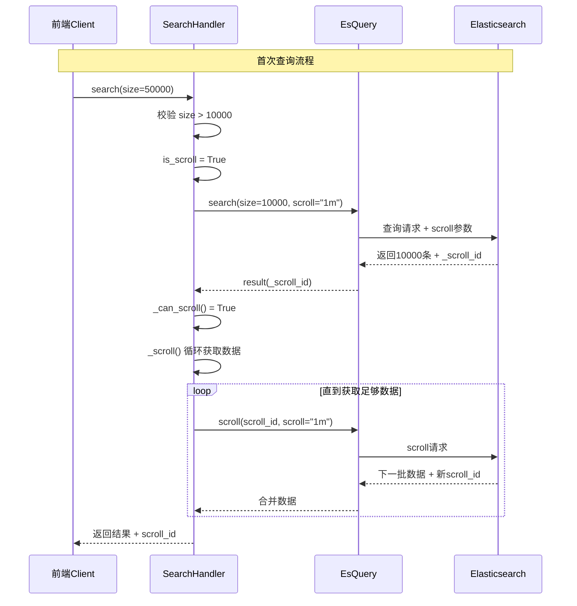

# 滚动分页实现技术文档

## 1. 概述

本文档分析 `apps/log_search/handlers/search/search_handlers_esquery.py` 中的滚动分页（Scroll Pagination）实现机制。滚动分页是 Elasticsearch 提供的一种高效遍历大量数据的方案，适用于数据导出、深度分页等场景。

## 2. 核心常量定义

```python
# apps/log_search/constants.py (第105-109行)
MAX_RESULT_WINDOW = 10000        # 单次查询最大返回条数
MAX_SEARCH_SIZE = 100000         # 最大查询总数限制
SCROLL = "1m"                    # 滚动上下文保持时间（1分钟）
ASYNC_EXPORT_SCROLL = "5m"       # 异步导出滚动查询超时时间
```

## 3. 核心类与方法

### 3.1 scroll_search 方法 - 滚动查询入口

```python
# 第987-1015行
def scroll_search(self):
    """
    日志scroll查询
    """
    # scroll初次查询，性能考虑暂不支持用户透传scroll 默认1m
    self.scroll = SCROLL
    scroll_id = self.search_dict.get("scroll_id")
    if not scroll_id:
        # 首次查询，执行普通search并开启scroll
        self.is_scroll = True
        return self.search()

    # 后续滚动查询
    try:
        result = BkLogApi.scroll(
            {
                "indices": self.indices,
                "scenario_id": self.scenario_id,
                "storage_cluster_id": self.storage_cluster_id,
                "scroll": self.scroll,
                "scroll_id": scroll_id,
            }
        )
    except ApiResultError as e:
        logger.error(f"scroll 查询失败：{e}")
        raise ApiResultError(_("scroll 查询失败"), code=e.code, errors=e.errors)
    _scroll_id = result.get("_scroll_id")
    result = self._deal_query_result(result)
    result.update({"scroll_id": _scroll_id})
    return result
```

### 3.2 _can_scroll 方法 - 滚动查询条件判断

```python
# 第1059-1065行
def _can_scroll(self, result) -> bool:
    return (
        self.scenario_id != Scenario.BKDATA           # 不支持BKDATA场景
        and self.is_scroll                            # 滚动开关已开启
        and result["hits"]["total"] > MAX_RESULT_WINDOW  # 总数超过10000
        and self.size > MAX_RESULT_WINDOW             # 请求size超过10000
    )
```

### 3.3 _scroll 方法 - 核心滚动查询实现

```python
# 第1067-1094行
def _scroll(self, search_result):
    scroll_result = copy.deepcopy(search_result)
    scroll_size = len(scroll_result["hits"]["hits"])
    result_size = len(search_result["hits"]["hits"])

    # 判断是否继续查询：
    # scroll_result["hits"]["hits"] == 10000 且 查询doc数量不足size
    while scroll_size == MAX_RESULT_WINDOW and result_size < self.size:
        _scroll_id = scroll_result["_scroll_id"]
        scroll_result = BkLogApi.scroll(
            {
                "indices": self.indices,
                "scenario_id": self.scenario_id,
                "storage_cluster_id": self.storage_cluster_id,
                "scroll": self.scroll,
                "scroll_id": _scroll_id,
            }
        )

        scroll_size = len(scroll_result["hits"]["hits"])
        less_size = self.size - result_size
        if less_size < scroll_size:
            # 只取需要的部分数据
            search_result["hits"]["hits"].extend(
                scroll_result["hits"]["hits"][:less_size]
            )
        else:
            search_result["hits"]["hits"].extend(
                scroll_result["hits"]["hits"]
            )
        result_size = len(search_result["hits"]["hits"])
        search_result["hits"]["total"] = scroll_result["hits"]["total"]

    return search_result
```

## 4. EsQuery 层的 scroll 实现

### 4.1 EsQuery.scroll() 方法

```python
# apps/log_esquery/esquery/esquery.py (第226-246行)
def scroll(self):
    # 调用客户端执行scroll
    scenario_id, indices, storage_cluster_id = self._init_common_args()

    # TODO 暂不支持bkdata场景
    if scenario_id == Scenario.BKDATA:
        raise ScenarioNotSupportedException(
            ScenarioNotSupportedException.MESSAGE.format(scenario_id=Scenario.BKDATA)
        )

    # scroll_id
    scroll_id: str = self.search_dict.get("scroll_id")

    # scroll
    scroll: str = self.search_dict.get("scroll")

    client = QueryClient(scenario_id, storage_cluster_id=storage_cluster_id).get_instance()

    result = client.scroll(indices, scroll_id, scroll)

    return result
```

### 4.2 QueryClientLog.scroll() 实现

```python
# apps/log_esquery/esquery/client/QueryClientLog.py (第108-114行)
def scroll(self, index, scroll_id: str, scroll: str) -> Dict:
    self._build_connection(index, check_ping=False)
    try:
        return self._client.scroll(scroll_id=scroll_id, scroll=scroll)
    except Exception as e:
        self.catch_timeout_raise(e)
        raise EsClientScrollException(EsClientScrollException.MESSAGE.format(error=e))
```

## 5. scroll_id 生命周期

```mermaid
flowchart TD
    A[首次查询请求<br/>携带 scroll="1m"] --> B[Elasticsearch 生成 scroll_id]
    B --> C[返回首批数据 + scroll_id]
    C --> D[后续滚动请求<br/>携带 scroll_id + scroll]
    D --> E[返回下一批数据 + 新 scroll_id]
    E --> F{数据获取完成?}
    F -->|否| D
    F -->|是| G[返回完整结果]

    H[scroll_id 上下文] --> I[默认保持 1 分钟]
    I --> J[超时自动失效]
    J --> K[需重新发起首次查询]
```

## 6. 调用关系图



## 7. 滚动查询流程图



## 8. 关键设计要点

### 8.1 滚动查询触发条件

| 条件 | 说明 |
|------|------|
| `scenario_id != BKDATA` | BKDATA 场景不支持滚动查询 |
| `is_scroll == True` | 功能开关 `FEATURE_EXPORT_SCROLL` 需开启 |
| `total > 10000` | 查询总数需超过单次最大返回限制 |
| `size > 10000` | 请求的数据量需超过单次最大返回限制 |

### 8.2 数据获取策略

```python
# _scroll 方法中的数据截取逻辑
less_size = self.size - result_size
if less_size < scroll_size:
    # 只取需要的部分数据，避免返回过多数据
    search_result["hits"]["hits"].extend(
        scroll_result["hits"]["hits"][:less_size]
    )
else:
    search_result["hits"]["hits"].extend(
        scroll_result["hits"]["hits"]
    )
```

### 8.3 性能优化点

1. **预查询机制**：通过 `pre_search` 参数控制是否执行预查询，优化查询性能
2. **批量获取**：每次滚动获取 `MAX_RESULT_WINDOW(10000)` 条数据
3. **上下文保持时间**：默认 1 分钟，异步导出场景使用 5 分钟

## 9. 使用场景

| 场景 | 方法 | 说明 |
|------|------|------|
| 前端分页查询 | `scroll_search()` | 用户滚动翻页时获取更多数据 |
| 数据导出 | `_scroll()` | 导出大量数据时自动触发滚动查询 |
| 异步导出 | `scroll_result()` | 异步任务中批量获取数据 |

## 10. 注意事项

1. **scroll_id 有效期**：默认 1 分钟，超时需重新发起首次查询
2. **资源消耗**：滚动查询会在 ES 服务端维护查询上下文，大量并发可能影响性能
3. **BKDATA 限制**：当前不支持 BKDATA 场景的滚动查询
4. **最大限制**：单次查询最大 100000 条（`MAX_SEARCH_SIZE`）

---

**文档版本**: v1.0
**生成日期**: 2026-04-30
**源文件**: `apps/log_search/handlers/search/search_handlers_esquery.py`