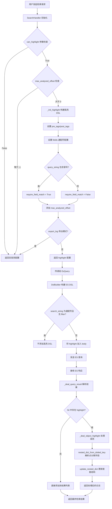

# BKLOG 高亮实现技术文档

## 一、概述

BKLOG 的高亮功能基于 Elasticsearch 的 Highlight API 实现，用于在日志检索结果中标记匹配的关键词。系统通过 `<mark>` 和 `</mark>` 标签包裹匹配内容，前端渲染时显示高亮效果。

## 二、核心实现流程



## 三、核心代码分析

### 3.1 SearchHandler 初始化与高亮配置

**文件位置**: `apps/log_search/handlers/search/search_handlers_esquery.py`

#### 3.1.1 初始化参数定义 (第 167-176 行)

```python
def __init__(
    self,
    index_set_id: int,
    search_dict: dict,
    pre_check_enable=True,
    can_highlight=True,  # 第 172 行: 高亮启用开关
    export_fields=None,
    export_log: bool = False,
    only_for_agg: bool = False,
):
```

**参数说明**:
- `can_highlight`: 控制是否启用高亮功能，默认为 `True`
- `export_log`: 导出模式下禁用高亮，避免导出文件包含 HTML 标签

#### 3.1.2 高亮配置初始化 (第 285 行)

```python
# 初始化highlight
self.highlight: dict = self._init_highlight(can_highlight)
```

### 3.2 _init_highlight 方法实现

**文件位置**: `apps/log_search/handlers/search/search_handlers_esquery.py` (第 2170-2191 行)

```python
def _init_highlight(self, can_highlight=True):
    # 第 2171 行: 检查是否禁用高亮或索引集配置了不限制分析长度
    if not can_highlight or self.index_set.max_analyzed_offset == -1:
        return {}

    # 第 2174-2177 行: 根据查询语句判断是否需要字段匹配
    # 避免 query_string 中包含 "field:value" 格式时的多字段高亮问题
    if self.query_string and ":" in self.query_string:
        require_field_match = True
    else:
        require_field_match = False

    # 第 2179-2184 行: 构建高亮 DSL 配置
    highlight = {
        "pre_tags": ["<mark>"],           # 高亮前缀标签
        "post_tags": ["</mark>"],         # 高亮后缀标签
        "fields": {"*": {"number_of_fragments": 0}},  # 对所有字段启用高亮
        "require_field_match": require_field_match,   # 是否要求字段匹配查询
    }

    # 第 2185-2186 行: 添加最大分析长度限制
    if self.index_set and self.index_set.max_analyzed_offset and not self.using_clustering_proxy:
        highlight["max_analyzed_offset"] = self.index_set.max_analyzed_offset

    # 第 2188-2189 行: 导出模式下清空高亮配置
    if self.export_log:
        highlight = {}

    return highlight
```

**配置参数详解**:

| 参数 | 值 | 说明 |
|------|-----|------|
| `pre_tags` | `["<mark>"]` | 高亮内容前缀 HTML 标签 |
| `post_tags` | `["</mark>"]` | 高亮内容后缀 HTML 标签 |
| `fields` | `{"*": {"number_of_fragments": 0}}` | 对所有字段启用高亮，`number_of_fragments=0` 表示返回完整字段内容而非片段 |
| `require_field_match` | True/False | 当 query_string 包含字段限定时为 True，避免非查询字段被高亮 |
| `max_analyzed_offset` | 索引集配置值 | 限制高亮分析的最大文本长度，防止大文档导致性能问题 |

### 3.3 ES DSL 构建

#### 3.3.1 EsQuery 参数传递

**文件位置**: `apps/log_esquery/esquery/esquery.py`

**参数提取 (第 123-141 行)**:

```python
def _init_other_args(self):
    # 查询条目
    size: int = self.search_dict.get("size")
    # 查询开始位置
    start: int = self.search_dict.get("start")
    # 透传aggs聚合
    aggs: Dict = self.search_dict.get("aggs")
    # 透传高亮 (第 134 行)
    highlight: Dict = self.search_dict.get("highlight")
    # scroll
    scroll = self.search_dict.get("scroll", None)
    # collapse
    collapse = self.search_dict.get("collapse")
    return size, start, aggs, highlight, scroll, collapse
```

**DSL 构建调用 (第 174-195 行)**:

```python
size, start, aggs, highlight, scroll, collapse = self._init_other_args()
mappings = self.mapping() if self.include_nested_fields else []

# 调用DSL生成器 (第 178-195 行)
body = DslBuilder(
    search_string=query_string,
    filter_dict_list=filter_dict_list,
    time_range_dict=time_range_dict,
    sort_tuple=sort_tuple,
    size=size,
    begin=start,
    aggs=aggs,
    highlight=highlight,     # 第 186 行: 传递高亮配置
    collapse=collapse,
    search_after=search_after,
    use_time_range=use_time_range,
    mappings=mappings,
    time_field=time_field,
    slice_search=self.search_dict.get("slice_search"),
    slice_id=self.search_dict.get("slice_id"),
    slice_max=self.search_dict.get("slice_max"),
).body
```

#### 3.3.2 DslBuilder 高亮 DSL 构建

**文件位置**: `apps/log_esquery/esquery/dsl_builder/dsl_builder.py`

**高亮 DSL 添加逻辑 (第 120-126 行)**:

```python
# 透传高亮
self.highlight_dict = highlight

if self.highlight_dict:
    # 第 125 行: 只有在非通配符查询或有过滤条件时才添加高亮
    # have query filter need highlight
    if self.search_string != WILDCARD_PATTERN or filter_dict_list:
        self._body.update({"highlight": self.highlight_dict})
```

**构建逻辑说明**:
- 当 `search_string` 为通配符 `*` 且没有 `filter_dict_list` 时，不添加高亮配置
- 避免无意义的全文高亮，提升查询性能

### 3.4 高亮结果解析

#### 3.4.1 查询结果处理

**文件位置**: `apps/log_search/handlers/search/search_handlers_esquery.py`

**结果解析入口 (第 2276-2357 行)**:

```python
def _deal_query_result(self, result_dict: dict) -> dict:
    # ... 省略前置处理 ...

    # 第 2335-2343 行: 高亮结果处理
    if "highlight" not in hit:
        # 无高亮结果，直接添加
        origin_log_list.append(origin_log)
        log_list.append(log)
        continue
    else:
        # 有高亮结果，保存原始日志副本
        origin_log_list.append(copy.deepcopy(origin_log))

    # 第 2342-2343 行: 处理 Object 类型字段的高亮
    if not (self.field_configs or self.text_fields_field_configs) or not self.is_desensitize:
        log = self._deal_object_highlight(log=log, highlight=hit["highlight"])
    log_list.append(log)
```

#### 3.4.2 Object 类型字段高亮处理

**文件位置**: `apps/log_search/handlers/search/search_handlers_esquery.py` (第 2405-2424 行)

```python
@staticmethod
def nested_dict_from_dotted_key(dotted_dict: dict[str, Any]) -> dict[str, Any]:
    """
    将点分隔键的字典转换为嵌套字典
    例如: {"a.b.c": ["value"]} -> {"a": {"b": {"c": "value"}}}
    """
    result = {}
    for key, value in dotted_dict.items():
        parts = key.split(".")
        current_level = result
        for part in parts[:-1]:
            if part not in current_level:
                current_level[part] = {}
            current_level = current_level[part]
        # 第 2415 行: 将高亮数组拼接为字符串
        current_level[parts[-1]] = "".join(value)
    return result

@classmethod
def update_nested_dict(cls, base_dict: dict[str, Any], update_dict: dict[str, Any]) -> dict[str, Any]:
    """
    递归更新嵌套字典
    """
    if not isinstance(base_dict, dict):
        return base_dict
    for key, value in update_dict.items():
        if key not in base_dict:
            continue
        if isinstance(value, dict):
            # 第 2400 行: 递归更新嵌套结构
            base_dict[key] = cls.update_nested_dict(base_dict.get(key, {}), value)
        else:
            # 第 2402 行: 替换为高亮后的值
            base_dict[key] = value
    return base_dict

def _deal_object_highlight(self, log: dict[str, Any], highlight: dict[str, Any]) -> dict[str, Any]:
    """
    兼容Object类型字段的高亮 (第 2418-2424 行)
    ES层会返回打平后的高亮字段, 该函数将其高亮的字段更新至对应Object字段
    """
    nested_dict = self.nested_dict_from_dotted_key(dotted_dict=highlight)
    return self.update_nested_dict(log, nested_dict)
```

**处理逻辑说明**:
- ES 返回的 Object 类型字段高亮结果使用点分隔格式 (如 `json_data.message`)
- `nested_dict_from_dotted_key` 将点分隔键转换为嵌套字典结构
- `update_nested_dict` 递归更新原始日志中的对应字段

### 3.5 高亮配置常量

**文件位置**: `apps/log_search/constants.py` (第 1833-1835 行)

```python
class HighlightConfig:
    PRE_TAG = "<mark>"
    POST_TAG = "</mark>"
```

### 3.6 错误处理机制

#### 3.6.1 高亮异常定义

**文件位置**: `apps/log_search/exceptions.py` (第 531-533 行)

```python
class HighlightException(BaseSearchException):
    ERROR_CODE = "450"
    MESSAGE = _("日志检索失败，字段({field_name})内容过长导致高亮异常，请联系 BK 助手处理")
```

## 四、完整高亮 DSL 示例

### 4.1 标准检索高亮 DSL

```json
{
  "query": {
    "bool": {
      "must": [
        {
          "query_string": {
            "query": "error"
          }
        }
      ],
      "filter": [
        {
          "range": {
            "timestamp": {
              "gte": "2025-01-01T00:00:00",
              "lte": "2025-01-02T00:00:00"
            }
          }
        }
      ]
    }
  },
  "from": 0,
  "size": 30,
  "highlight": {
    "pre_tags": ["<mark>"],
    "post_tags": ["</mark>"],
    "fields": {
      "*": {
        "number_of_fragments": 0
      }
    },
    "require_field_match": false,
    "max_analyzed_offset": 1000000
  }
}
```

### 4.2 字段限定检索高亮 DSL

当 query_string 包含字段限定 (如 `log:error`) 时:

```json
{
  "highlight": {
    "pre_tags": ["<mark>"],
    "post_tags": ["</mark>"],
    "fields": {
      "*": {
        "number_of_fragments": 0
      }
    },
    "require_field_match": true,
    "max_analyzed_offset": 1000000
  }
}
```

## 五、关键设计要点总结

| 设计要点 | 实现方式 | 代码位置 |
|---------|---------|---------|
| 高亮开关控制 | `can_highlight` 参数 + `max_analyzed_offset` 配置 | 第 2170-2172 行 |
| 标签格式 | `<mark>` / `</mark>` HTML 标签 | `HighlightConfig` 常量类 |
| 全字段高亮 | `fields: {"*": {...}}` 通配符配置 | 第 2182 行 |
| 字段匹配控制 | `require_field_match` 根据查询语句动态设置 | 第 2174-2177 行 |
| 性能保护 | `max_analyzed_offset` 限制分析长度 | 第 2185-2186 行 |
| 导出禁用 | `export_log` 模式清空高亮配置 | 第 2188-2189 行 |
| Object 字段兼容 | 点分隔键转换为嵌套字典 | 第 2405-2424 行 |

---

**文档版本**: v1.0
**生成日期**: 2026-04-30
**源码路径**: `apps/log_search/handlers/search/search_handlers_esquery.py`