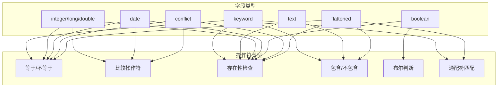
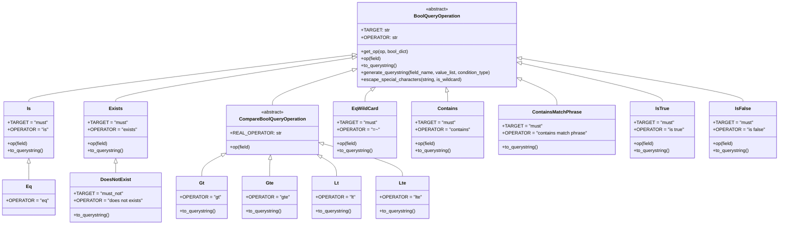
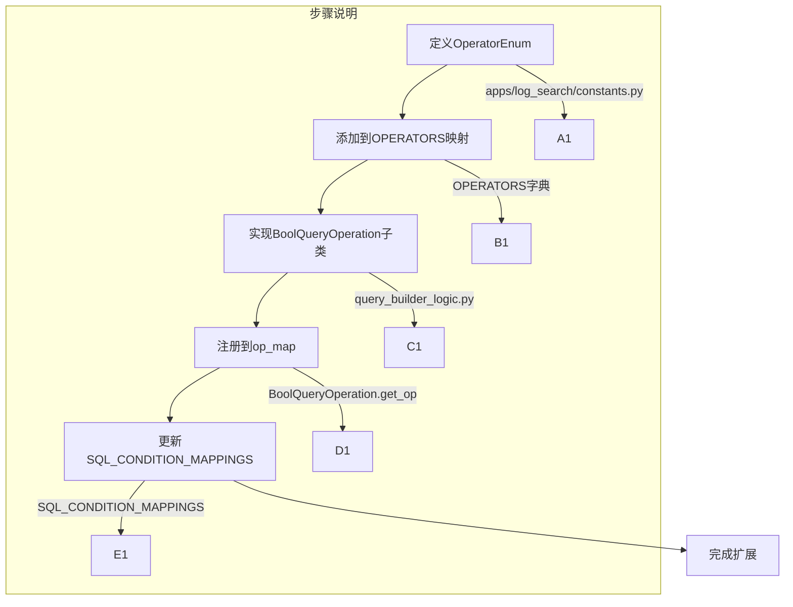
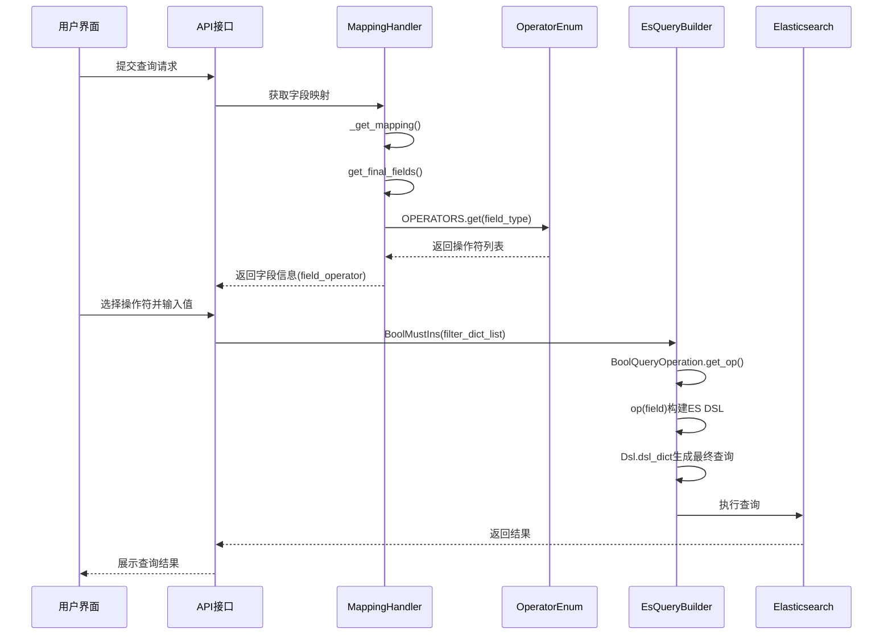

# OPERATORS映射详解

## 1. 概述

OPERATORS是BKLOG日志检索模块中定义的字段类型与查询操作符的映射表，用于根据不同字段类型提供相应的查询操作能力。该映射机制是构建灵活查询界面的核心组件，支持用户根据字段类型选择合适的查询操作符。

## 2. 核心定义

### 2.1 OPERATORS映射表

**源文件位置**: `apps/log_search/constants.py` (第1658-1732行)

```python
# apps/log_search/constants.py:1658-1732
OPERATORS = {
    "keyword": [
        OperatorEnum.EQ_WILDCARD,
        OperatorEnum.NE_WILDCARD,
        OperatorEnum.EXISTS,
        OperatorEnum.NOT_EXISTS,
        OperatorEnum.CONTAINS,
        OperatorEnum.NOT_CONTAINS,
    ],
    "text": [
        OperatorEnum.CONTAINS_MATCH_PHRASE,
        OperatorEnum.NOT_CONTAINS_MATCH_PHRASE,
        OperatorEnum.EXISTS,
        OperatorEnum.NOT_EXISTS,
    ],
    "integer": [
        OperatorEnum.EQ,
        OperatorEnum.NE,
        OperatorEnum.LT,
        OperatorEnum.LTE,
        OperatorEnum.GT,
        OperatorEnum.GTE,
        OperatorEnum.EXISTS,
        OperatorEnum.NOT_EXISTS,
    ],
    "long": [
        OperatorEnum.EQ,
        OperatorEnum.NE,
        OperatorEnum.LT,
        OperatorEnum.LTE,
        OperatorEnum.GT,
        OperatorEnum.GTE,
        OperatorEnum.EXISTS,
        OperatorEnum.NOT_EXISTS,
    ],
    "double": [
        OperatorEnum.EQ,
        OperatorEnum.NE,
        OperatorEnum.LT,
        OperatorEnum.LTE,
        OperatorEnum.GT,
        OperatorEnum.GTE,
        OperatorEnum.EXISTS,
        OperatorEnum.NOT_EXISTS,
    ],
    "date": [
        OperatorEnum.EQ,
        OperatorEnum.NE,
        OperatorEnum.LT,
        OperatorEnum.LTE,
        OperatorEnum.GT,
        OperatorEnum.GTE,
        OperatorEnum.EXISTS,
        OperatorEnum.NOT_EXISTS,
    ],
    "boolean": [OperatorEnum.IS_TRUE, OperatorEnum.IS_FALSE, OperatorEnum.EXISTS, OperatorEnum.NOT_EXISTS],
    "conflict": [
        OperatorEnum.EQ,
        OperatorEnum.NE,
        OperatorEnum.LT,
        OperatorEnum.LTE,
        OperatorEnum.GT,
        OperatorEnum.GTE,
        OperatorEnum.EXISTS,
        OperatorEnum.NOT_EXISTS,
    ],
    "flattened": [
        OperatorEnum.EQ_WILDCARD,
        OperatorEnum.NE_WILDCARD,
        OperatorEnum.EXISTS,
        OperatorEnum.NOT_EXISTS,
        OperatorEnum.CONTAINS,
        OperatorEnum.NOT_CONTAINS,
    ],
}
```

### 2.2 OperatorEnum操作符枚举

**源文件位置**: `apps/log_search/constants.py` (第1605-1655行)

```python
# apps/log_search/constants.py:1605-1655
class OperatorEnum:
    """操作符枚举"""

    EQ = {"operator": "=", "label": "=", "placeholder": _("请选择或直接输入，Enter分隔")}
    NE = {"operator": "!=", "label": "!=", "placeholder": _("请选择或直接输入，Enter分隔")}
    EQ_WILDCARD = {
        "operator": "=",
        "label": "=",
        "placeholder": _("请选择或直接输入，Enter分隔"),
        "wildcard_operator": "=~",
    }
    NE_WILDCARD = {
        "operator": "!=",
        "label": "!=",
        "placeholder": _("请选择或直接输入，Enter分隔"),
        "wildcard_operator": "!=~",
    }
    LT = {"operator": "<", "label": "<", "placeholder": _("请选择或直接输入")}
    GT = {"operator": ">", "label": ">", "placeholder": _("请选择或直接输入")}
    LTE = {"operator": "<=", "label": "<=", "placeholder": _("请选择或直接输入")}
    GTE = {"operator": ">=", "label": ">=", "placeholder": _("请选择或直接输入")}
    EXISTS = {"operator": "exists", "label": _("存在"), "placeholder": _("确认字段已存在")}
    NOT_EXISTS = {"operator": "does not exists", "label": _("不存在"), "placeholder": _("确认字段不存在")}
    IS_TRUE = {"operator": "is true", "label": "is true", "placeholder": _("字段为true")}
    IS_FALSE = {"operator": "is false", "label": "is false", "placeholder": _("字段为false")}
    CONTAINS = {"operator": "contains", "label": _("包含"), "placeholder": _("请选择或直接输入，Enter分隔")}
    NOT_CONTAINS = {"operator": "not contains", "label": _("不包含"), "placeholder": _("请选择或直接输入，Enter分隔")}
    CONTAINS_MATCH_PHRASE = {
        "operator": "contains match phrase",
        "label": _("包含"),
        "placeholder": _("请选择或直接输入，Enter分隔"),
        "wildcard_operator": "=~",
    }
    NOT_CONTAINS_MATCH_PHRASE = {
        "operator": "not contains match phrase",
        "label": _("不包含"),
        "placeholder": _("请选择或直接输入，Enter分隔"),
        "wildcard_operator": "!=~",
    }
    ALL_CONTAINS_MATCH_PHRASE = {
        "operator": "all contains match phrase",
        "label": _("全部包含"),
        "placeholder": _("请选择或直接输入，Enter分隔"),
        "wildcard_operator": "&=~",
    }
    ALL_NOT_CONTAINS_MATCH_PHRASE = {
        "operator": "all not contains match phrase",
        "label": _("全部不包含"),
        "placeholder": _("请选择或直接输入，Enter分隔"),
        "wildcard_operator": "&!=~",
    }
```

## 3. 字段类型与操作符支持矩阵



### 3.1 操作符支持详情表

| 字段类型 | 等于/不等于 | 比较操作符 | 存在性 | 包含/不包含 | 通配符 | 布尔值 |
|---------|------------|-----------|--------|------------|--------|-------|
| keyword | =, != (支持通配符) | - | exists, not exists | contains, not contains | =~, !=~ | - |
| text | - | - | exists, not exists | match_phrase | - | - |
| integer/long/double | =, != | <, <=, >, >= | exists, not exists | - | - | - |
| date | =, != | <, <=, >, >= | exists, not exists | - | - | - |
| boolean | - | - | exists, not exists | - | - | is true, is false |
| conflict | =, != | <, <=, >, >= | exists, not exists | - | - | - |
| flattened | =, != (支持通配符) | - | exists, not exists | contains, not contains | =~, !=~ | - |

## 4. 操作符到ES DSL转换逻辑

### 4.1 BoolQueryOperation体系架构

**源文件位置**: `apps/log_esquery/esquery/dsl_builder/query_builder/query_builder_logic.py` (第222-651行)



### 4.2 ES DSL转换实现

**源文件位置**: `apps/log_esquery/esquery/dsl_builder/query_builder/query_builder_logic.py`

#### 4.2.1 等于操作符 (Is/Eq)

```python
# apps/log_esquery/esquery/dsl_builder/query_builder/query_builder_logic.py:304-323
class Is(BoolQueryOperation):
    TARGET = "must"
    OPERATOR = "is"

    def op(self, field):
        # 构建 match_phrase 查询
        self._set_target_value(EsQueryBuilder.build_match_phrase_query(field["field"], field["value"]))

    def to_querystring(self):
        value_list = []
        for value in self._bool_dict["value"]:
            value = str(value).replace('"', '\\"')
            value_list.append(f"\"{value}\"")
        return self.generate_querystring(
            self._bool_dict["field"],
            value_list,
        )

class Eq(Is):
    OPERATOR = "eq"
```

**ES DSL输出示例**:
```json
{
  "match_phrase": {
    "field_name": "value"
  }
}
```

#### 4.2.2 存在性操作符 (Exists/DoesNotExist)

```python
# apps/log_esquery/esquery/dsl_builder/query_builder/query_builder_logic.py:326-343
class Exists(BoolQueryOperation):
    OPERATOR = "exists"
    TARGET = "must"

    def op(self, field):
        self._set_target_value(EsQueryBuilder.build_exists(field["field"]))

    def to_querystring(self):
        return f"{self._bool_dict['field']}: *"

class DoesNotExist(Exists):
    OPERATOR = "does not exists"
    TARGET = "must_not"

    def to_querystring(self):
        return "NOT " + super().to_querystring()
```

**ES DSL输出示例**:
```json
// exists
{
  "exists": {
    "field": "field_name"
  }
}

// does not exists
{
  "bool": {
    "must_not": [
      {
        "exists": {
          "field": "field_name"
        }
      }
    ]
  }
}
```

#### 4.2.3 比较操作符 (Gt/Gte/Lt/Lte)

```python
# apps/log_esquery/esquery/dsl_builder/query_builder/query_builder_logic.py:392-430
class CompareBoolQueryOperation(BoolQueryOperation):
    TARGET = "must"
    REAL_OPERATOR = None

    def op(self, field):
        operator = self.REAL_OPERATOR or field["operator"]
        self._set_target_value(EsQueryBuilder.build_range_filter(field["field"], operator, field["value"]))

class Gt(CompareBoolQueryOperation):
    OPERATOR = "gt"

    def to_querystring(self):
        value = self._bool_dict["value"][0]
        return f"{self._bool_dict['field']}: >{value}"

class Gte(CompareBoolQueryOperation):
    OPERATOR = "gte"

class Lt(CompareBoolQueryOperation):
    OPERATOR = "lt"

class Lte(CompareBoolQueryOperation):
    OPERATOR = "lte"
```

**ES DSL输出示例**:
```json
{
  "range": {
    "field_name": {
      "gt": 100
    }
  }
}
```

#### 4.2.4 通配符操作符 (EqWildCard/NeWildCard)

```python
# apps/log_esquery/esquery/dsl_builder/query_builder/query_builder_logic.py:499-527
class EqWildCard(BoolQueryOperation):
    TARGET = "must"
    OPERATOR = "=~"

    def op(self, field):
        should_list: type_should_list = EsQueryBuilder.build_should_list_wildcard(
            field=field["field"], value_list=field["value"]
        )
        should: type_should = EsQueryBuilder.build_should(should_list)
        a_bool: type_bool = EsQueryBuilder.build_bool(should)
        self._set_target_value(a_bool)

class NeWildCard(EqWildCard):
    TARGET = "must_not"
    OPERATOR = "!=~"
```

**ES DSL输出示例**:
```json
{
  "bool": {
    "should": [
      {
        "wildcard": {
          "field_name": "value*"
        }
      }
    ]
  }
}
```

#### 4.2.5 包含操作符 (Contains/ContainsMatchPhrase)

```python
# apps/log_esquery/esquery/dsl_builder/query_builder/query_builder_logic.py:530-573
class Contains(BoolQueryOperation):
    TARGET = "must"
    OPERATOR = "contains"

    def op(self, field):
        should_list: type_should_list = EsQueryBuilder.build_should_list_wildcard(
            field=field["field"], value_list=field["value"], is_contains=True
        )
        should: type_should = EsQueryBuilder.build_should(should_list)
        a_bool: type_bool = EsQueryBuilder.build_bool(should)
        self._set_target_value(a_bool)

class ContainsMatchPhrase(IsOneOf):
    TARGET = "must"
    OPERATOR = "contains match phrase"
```

**ES DSL输出示例**:
```json
// contains (wildcard)
{
  "bool": {
    "should": [
      {
        "wildcard": {
          "field_name": "*value*"
        }
      }
    ]
  }
}

// contains match phrase
{
  "bool": {
    "should": [
      {
        "match_phrase": {
          "field_name": "value"
        }
      }
    ]
  }
}
```

### 4.3 EsQueryBuilder工具类

**源文件位置**: `apps/log_esquery/esquery/dsl_builder/query_builder/query_builder_logic.py` (第80-220行)

```python
# apps/log_esquery/esquery/dsl_builder/query_builder/query_builder_logic.py:80-220
class EsQueryBuilder(object):
    @classmethod
    def build_exists(cls, field: str):
        return {"exists": {"field": field}}

    @classmethod
    def build_match_phrase(cls, field: str, value: Any) -> type_match_phrase:
        return {"match_phrase": {field: value}}

    @classmethod
    def build_wildcard(cls, field: str, value: Any, is_contains: bool = False) -> type_wildcard:
        if is_contains:
            return {"wildcard": {field: "*{value}*".format(value=value.replace("*", r"\*").replace("?", r"\?"))}}
        return {"wildcard": {field: value}}

    @classmethod
    def build_range_filter(cls, field: str, operator: str, value: Any) -> type_range:
        return {"range": {field: {operator: value}}}
```

## 5. 字段映射获取流程

### 5.1 MappingHandlers中的OPERATORS应用

**源文件位置**: `apps/log_search/handlers/search/mapping_handlers.py` (第261-303行)

```python
# apps/log_search/handlers/search/mapping_handlers.py:274-291
fields_list: list = [
    {
        "field_type": field["field_type"],
        "field_name": field["field_name"],
        "field_alias": field.get("field_alias"),
        "is_display": False,
        "is_editable": True,
        "tag": field.get("tag", "metric"),
        "origin_field": field.get("path", ""),
        "es_doc_values": field.get("es_doc_values", False),
        "is_analyzed": field.get("is_analyzed", False),
        "field_operator": OPERATORS.get(field["field_type"], []),  # 根据字段类型获取操作符列表
        "is_built_in": field["field_name"].lower() in built_in_fields,
        "is_case_sensitive": field.get("is_case_sensitive", False),
        "tokenize_on_chars": field.get("tokenize_on_chars", ""),
    }
    for field in fields_result
]
```

### 5.2 UnifyQueryMappingHandler中的OPERATORS应用

**源文件位置**: `apps/log_unifyquery/handler/mapping.py` (第188-251行)

```python
# apps/log_unifyquery/handler/mapping.py:205-228
fields_list.append(
    {
        "field_type": field["field_type"],
        "field_name": field["field_name"],
        "field_alias": field.get("field_alias", ""),
        "query_alias": field.get("alias_name", ""),
        "is_display": False,
        "is_editable": True,
        "tag": field.get("tag", ""),
        "origin_field": field.get("origin_field", ""),
        "es_doc_values": field.get("is_agg", False),
        "is_analyzed": field.get("is_analyzed", False),
        "field_operator": OPERATORS.get(field["field_type"], []),  # 根据字段类型获取操作符列表
        "is_case_sensitive": field.get("is_case_sensitive", False),
        "tokenize_on_chars": tokenize_on_chars,
    }
)

# doris类型特殊处理
is_doris = str(IndexSetTag.get_tag_id("Doris")) in list(self.index_set.tag_ids)
if is_doris:
    for field in fields_list:
        field["field_type"] = DorisFieldTypeEnum.get_es_field_type(field)
        field["field_operator"] = OPERATORS.get(field["field_type"], [])  # Doris类型重新映射操作符
        field["es_doc_values"] = field["field_type"] not in ["text", "object"]
```

## 6. Lucene语法增强与解析

### 6.1 OperatorEnhanceLucene增强运算符

**源文件位置**: `apps/utils/lucene.py` (第744-784行)

```python
# apps/utils/lucene.py:744-784
class OperatorEnhanceLucene(EnhanceLuceneBase):
    """
    兼容用户增强运算符
    例如: A > 3 => A: >3
    """

    RE_STRING = r'(".*?")|(/.*?/)'
    RE = r'(?<!["a-zA-Z0-9_])([a-zA-Z0-9_]+)\s*(>=|<=|>|<|=|!=)\s*([\d.]+)(?!["a-zA-Z0-9_])'
    ENHANCE_OPERATORS = [
        OperatorEnhanceEnum.LT.value,
        OperatorEnhanceEnum.LE.value,
        OperatorEnhanceEnum.GT.value,
        OperatorEnhanceEnum.GE.value,
    ]

    def transform(self) -> str:
        if not self.match():
            return self.query_string
        query_string_list = re.split(self.RE_STRING, self.query_string, flags=re.DOTALL)
        query_string_list = [s for s in query_string_list if s is not None]
        result_string = ""
        match_pattern = re.compile(self.RE_STRING, flags=re.DOTALL)
        sub_pattern = re.compile(self.RE)
        for _query_string in query_string_list:
            if match_pattern.match(_query_string):
                result_string += _query_string
            else:
                result_string += sub_pattern.sub(r"\1: \2\3", _query_string)
        return result_string
```

### 6.2 Lucene数值类型操作符定义

**源文件位置**: `apps/constants.py` (第154-157行)

```python
# apps/constants.py:154-157
# Lucene数值类字段操作符
LUCENE_NUMERIC_OPERATORS = ["<", "<=", ">", ">=", "="]
# Lucene数值类类型列表
LUCENE_NUMERIC_TYPES = ["long", "integer", "short", "double", "float"]
```

## 7. SQL条件操作符映射

**源文件位置**: `apps/log_search/constants.py` (第1753-1772行)

```python
# apps/log_search/constants.py:1753-1772
# 日志检索条件到sql操作符的映射
SQL_CONDITION_MAPPINGS = {
    ">": ">",
    ">=": ">=",
    "<": "<",
    "<=": "<=",
    "=": "=",
    "!=": "!=",
    "=~": "LIKE",
    "&=~": "LIKE",
    "!=~": "NOT LIKE",
    "&!=~": "NOT LIKE",
    "contains": "LIKE",
    "not contains": "NOT LIKE",
    "contains match phrase": "MATCH_PHRASE",
    "not contains match phrase": "NOT MATCH_PHRASE",
    "all contains match phrase": "MATCH_PHRASE",
    "all not contains match phrase": "NOT MATCH_PHRASE",
    "is true": "IS TRUE",
    "is false": "IS FALSE",
}
```

## 8. 自定义操作符扩展机制

### 8.1 扩展方法

要添加新的自定义操作符，需要完成以下步骤：

1. **在OperatorEnum中定义新操作符**

```python
# apps/log_search/constants.py
class OperatorEnum:
    # 新增自定义操作符
    CUSTOM_OP = {
        "operator": "custom_op",
        "label": _("自定义操作"),
        "placeholder": _("请输入自定义条件"),
        "wildcard_operator": "custom=~"  # 可选
    }
```

2. **在OPERATORS映射表中添加支持的字段类型**

```python
# apps/log_search/constants.py
OPERATORS = {
    "keyword": [
        # ...existing operators
        OperatorEnum.CUSTOM_OP,  # 新增
    ],
}
```

3. **在BoolQueryOperation体系中实现转换逻辑**

```python
# apps/log_esquery/esquery/dsl_builder/query_builder/query_builder_logic.py
class CustomOp(BoolQueryOperation):
    TARGET = "must"
    OPERATOR = "custom_op"

    def op(self, field):
        # 实现ES DSL构建逻辑
        custom_query = self._build_custom_query(field)
        self._set_target_value(custom_query)

    def to_querystring(self):
        # 实现Lucene语法转换
        return f"{self._bool_dict['field']}: custom:{self._bool_dict['value'][0]}"
```

4. **在BoolQueryOperation.get_op中注册新操作符**

```python
# apps/log_esquery/esquery/dsl_builder/query_builder/query_builder_logic.py:227-260
op_map = {
    # ...existing mappings
    CustomOp.OPERATOR: CustomOp,  # 新增
}
```

### 8.2 扩展流程图



## 9. 查询构建完整流程



## 10. 最佳实践与注意事项

### 10.1 字段类型选择建议

1. **keyword类型**: 适用于精确匹配场景，支持通配符模糊查询
2. **text类型**: 适用于全文检索，使用match_phrase进行短语匹配
3. **数值类型(integer/long/double)**: 支持范围查询，适合数值比较场景
4. **date类型**: 支持时间范围查询，适用于时间筛选
5. **boolean类型**: 仅支持布尔值判断，适用于开关状态查询

### 10.2 操作符使用建议

| 场景 | 推荐操作符 | 说明 |
|-----|----------|------|
| IP精确匹配 | `=` (keyword) | 使用精确匹配提高效率 |
| 日志内容搜索 | `contains match phrase` (text) | 使用短语匹配保证准确性 |
| 数值范围筛选 | `>=` 和 `<=` | 组合使用构建区间查询 |
| 字段存在性检查 | `exists` | 用于过滤缺失字段的数据 |
| 多值匹配 | 使用多个条件OR组合 | 提高查询灵活性 |

### 10.3 性能优化建议

1. 避免在高频查询中使用`contains`通配符，优先使用`match_phrase`
2. 数值类型字段使用范围操作符时，确保字段已启用`doc_values`
3. 对于boolean字段，使用`is true/false`而非字符串比较

---

**文档版本**: v1.0
**更新日期**: 2026-04-30
**源码版本**: ai_docs分支
**相关模块**: log_search, log_esquery, log_unifyquery