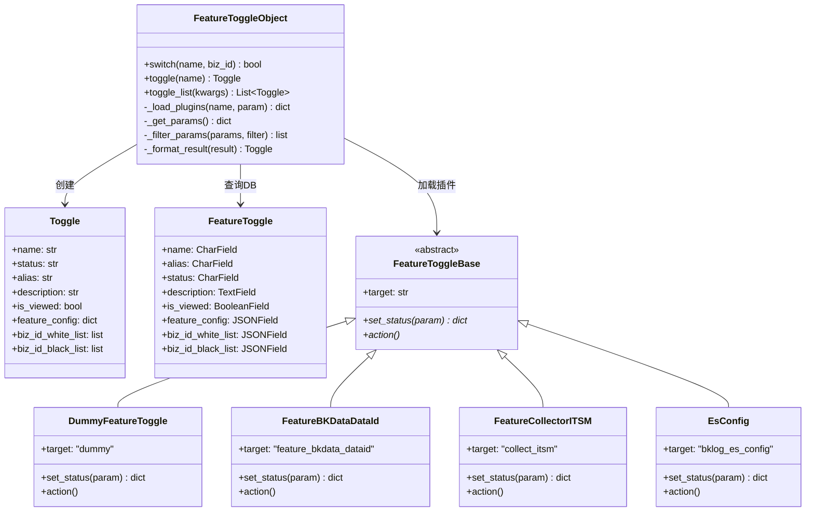
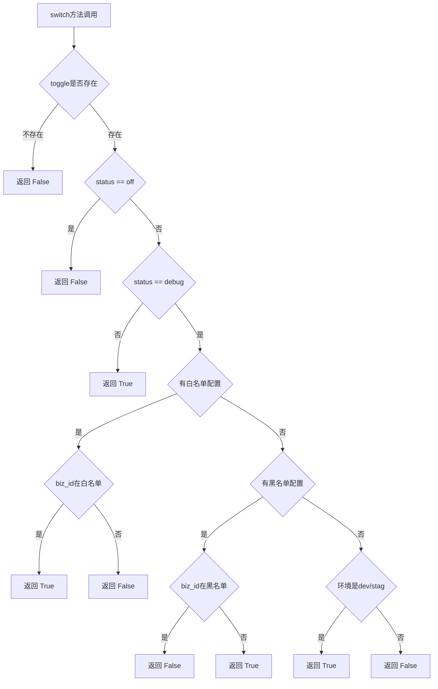
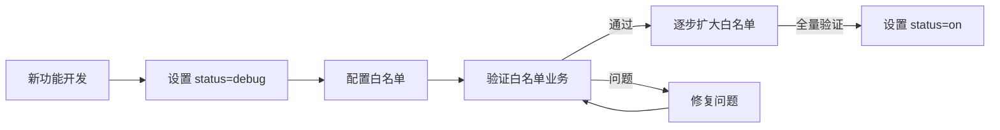

# BKLOG 特性开关架构

## 1. 概述

BKLOG特性开关系统是一套灵活的功能管理机制，支持功能的动态开启/关闭、灰度发布和业务级控制。该系统通过多级配置（配置文件、数据库、插件）实现特性的精细化管理，广泛应用于菜单控制、检索策略选择、数据源切换等场景。

## 2. 核心架构

### 2.1 架构图



### 2.2 配置读取优先级

特性开关的配置读取遵循三级优先级机制：

```mermaid
flowchart TD
    A[请求特性开关] --> B{settings.FEATURE_TOGGLE}
    B -->|存在| C[初始化基础配置]
    B -->|不存在| D[param = {}]
    C --> E[查询数据库 FeatureToggle]
    D --> E
    E -->|找到记录| F[合并DB配置]
    E -->|未找到| G[保持原配置]
    F --> H[加载插件 _load_plugins]
    G --> H
    H --> I{插件是否继承FeatureToggleBase}
    I -->|是| J[执行 plugin.set_status]
    I -->|否| K[抛出异常]
    J --> L[返回 Toggle 对象]
    K --> L
```

**优先级顺序**：`settings.FEATURE_TOGGLE` → `FeatureToggle DB` → `Plugins`

## 3. 核心实现

### 3.1 FeatureToggleObject 类

**源文件位置**：`apps/feature_toggle/handlers/toggle.py`

```python
# 第62-106行
class FeatureToggleObject(object):
    """
    特性开关表
    同一个变量读取顺序为: settings-->db-->plugins
    """

    @classmethod
    def switch(cls, name, biz_id=None):
        """
        获取开关状态
        1. 当获取不到对应开关返回False
        2. 当开关状态返回为off返回False
        3. 当开关状态返回为debug且开关具有白名单配置时，
           如果传入的业务id处于白名单中则返回True，
           不传入业务id或者不在白名单中返回false
        4. 当开关状态返回为debug且开关具有黑名单配置时，
           如果传入的业务id处于黑名单中则返回False，
           不传入业务id或者不在黑名单中返回True
        5. 当开关状态返回为debug且环境不为预发布或者测试环境返回False
        6. 其他情况为True
        """
        toggle = cls.toggle(name=name)
        if not toggle:
            return False

        if toggle.status == "off":
            return False

        if toggle.status == "debug" and toggle.biz_id_white_list:
            if biz_id and biz_id in toggle.biz_id_white_list:
                return True
            else:
                return False

        if toggle.status == "debug" and toggle.biz_id_black_list:
            if biz_id and biz_id in toggle.biz_id_black_list:
                return False
            else:
                return True

        if toggle.status == "debug" and settings.ENVIRONMENT not in ["dev", "stag"]:
            return False

        return True
```

### 3.2 Toggle 数据对象

```python
# 第47-60行
class Toggle(object):
    def __init__(
        self, name="", status="", alias="", description="",
        is_viewed=True, feature_config=None,
        biz_id_white_list=None, biz_id_black_list=None
    ):
        self.name = name
        self.status = status
        self.alias = alias
        self.description = description
        self.is_viewed = is_viewed
        self.feature_config = feature_config
        self.biz_id_white_list = biz_id_white_list
        self.biz_id_black_list = biz_id_black_list
```

### 3.3 数据模型定义

**源文件位置**：`apps/feature_toggle/models.py`

```python
# 第29-45行
class FeatureToggle(SoftDeleteModel):
    """
    日志平台特性开关整合表
    """

    name = models.CharField(_("特性开关name"), max_length=64, unique=True)
    alias = models.CharField(_("特性开关别名"), max_length=64, null=True, blank=True)
    status = models.CharField(_("特性开关status"), max_length=32, default="off")
    description = models.TextField(_("特性开关描述"), null=True, blank=True)
    is_viewed = models.BooleanField(_("是否在前端展示"), default=True)
    feature_config = models.JSONField(_("特性开关配置"), null=True, blank=True)
    biz_id_white_list = models.JSONField(_("业务白名单"), null=True, blank=True)
    biz_id_black_list = models.JSONField(_("业务黑名单"), null=True, blank=True)

    class Meta:
        verbose_name = _("日志平台特性开关")
        verbose_name_plural = _("41_日志平台特性开关")
```

### 3.4 插件机制实现

**源文件位置**：`apps/feature_toggle/plugins/base.py`

```python
# 第29-38行 - 插件注册机制
FEATURE_TOGGLE = {}

def get_feature_toggle(name):
    return FEATURE_TOGGLE.get(name, FEATURE_TOGGLE.get("dummy"))

def register(target_class: "FeatureToggleBase"):
    FEATURE_TOGGLE[target_class.target] = target_class


# 第40-61行 - 抽象基类
class FeatureToggleBase(ABC):
    target = None

    @abstractmethod
    def set_status(self, param: dict) -> dict:
        """
        执行plugin决定是否修改当前数据值
        """
        pass

    @abstractmethod
    def action(self):
        """
        trigger action if need at update config
        must try any exception
        """
        pass


# 第63-71行 - 默认插件
@register
class DummyFeatureToggle(FeatureToggleBase):
    target = "dummy"

    def set_status(self, param: dict) -> dict:
        return param

    def action(self):
        pass
```

## 4. 特性开关状态

特性开关支持三种状态：

| 状态 | 说明 | 适用场景 |
|------|------|----------|
| `on` | 全量开启 | 正式发布的功能 |
| `off` | 全量关闭 | 已下线或未开发的功能 |
| `debug` | 灰度/调试 | 新功能灰度发布，配合白名单/黑名单使用 |

### 4.1 状态判断流程



## 5. 内置特性开关

### 5.1 配置文件定义

**源文件位置**：`config/default.py` (第584-610行)

```python
FEATURE_TOGGLE = {
    # 索引集管理-数据源
    "scenario_log": os.environ.get("BKAPP_FEATURE_SCENARIO_LOG", "on"),      # 采集
    "scenario_bkdata": "on",                                                   # 数据平台
    "scenario_es": os.environ.get("BKAPP_FEATURE_SCENARIO_ES", "on"),         # 第三方ES

    # 日志采集-字段类型
    "es_type_object": os.environ.get("BKAPP_ES_TYPE_OBJECT", "on"),
    "es_type_nested": os.environ.get("BKAPP_ES_TYPE_NESTED", "off"),

    # 其他功能开关
    "bkdata_token_auth": os.environ.get("BKAPP_BKDATA_TOKEN_AUTH", "off"),
    "extract_cos": os.environ.get("BKAPP_EXTRACT_COS", "off"),
    "collect_itsm": os.environ.get("BKAPP_COLLECT_ITSM", "off"),
    "monitor_report": os.environ.get("BKAPP_MONITOR_REPORT", "on"),
    "bklog_es_config": "on",
    "check_collector_custom_config": "",
    "trace": os.environ.get("BKAPP_FEATURE_TRACE", "off"),
    "log_desensitize": os.environ.get("BKAPP_FEATURE_DESENSITIZE", "on"),
    "tgpa_task": os.environ.get("BKAPP_FEATURE_TGPA_TASK", "off"),
}
```

### 5.2 插件常量定义

**源文件位置**：`apps/feature_toggle/plugins/constants.py`

```python
# 第22-74行
# 创建bkdata data_id 特性开关
FEATURE_BKDATA_DATAID = "feature_bkdata_dataid"

# 是否开启ITSM特性开关
FEATURE_COLLECTOR_ITSM = "collect_itsm"
ITSM_SERVICE_ID = "itsm_service_id"
SCENARIO_BKDATA = "scenario_bkdata"

# 是否使用数据平台超级token
BKDATA_SUPER_TOKEN = "bkdata_super_token"

# AIOPS相关配置
BKDATA_CLUSTERING_TOGGLE = "bkdata_aiops_toggle"

# es相关配置
BKLOG_ES_CONFIG = "bklog_es_config"

# 新人指引相关配置
USER_GUIDE_CONFIG = "user_guide_config"

BCS_COLLECTOR = "bcs_collector"
BCS_DEPLOYMENT_TYPE = "bcs_deployment_type"
CHECK_COLLECTOR_CUSTOM_CONFIG = "check_collector_custom_config"

# grafana自定义ES数据源
GRAFANA_CUSTOM_ES_DATASOURCE = "grafana_custom_es_datasource"

# EXTERNAL业务被授权人配置
EXTERNAL_AUTHORIZER_MAP = "external_authorizer_map"

# 字段分析白名单开关
FIELD_ANALYSIS_CONFIG = "field_analysis_config"

# 直接进行esquery_search查询的开关
DIRECT_ESQUERY_SEARCH = "direct_esquery_search"

# 日志脱敏开关
LOG_DESENSITIZE = "log_desensitize"

# AI 助手
AI_ASSISTANT = "ai_assistant"

# unify_query_search查询的开关
UNIFY_QUERY_SEARCH = "unify_query_search"
UNIFY_QUERY_SEARCH_EXPORT = "unify_query_search_export"

# unify_query_sql 查询的开关
UNIFY_QUERY_SQL = "unify_query_sql"

# 日志聚类小型化配置
MINI_CLUSTERING_CONFIG = "mini_clustering_config"

UNIFY_QUERY_SEARCH_CLUSTERING = "unify_query_search_clustering"
```

## 6. 插件扩展机制

### 6.1 插件开发规范

特性开关插件需继承 `FeatureToggleBase` 抽象基类，实现两个核心方法：

```python
class FeatureToggleBase(ABC):
    target = None  # 特性开关名称标识

    @abstractmethod
    def set_status(self, param: dict) -> dict:
        """修改或增强特性开关配置"""
        pass

    @abstractmethod
    def action(self):
        """配置更新时触发的动作"""
        pass
```

### 6.2 ITSM插件示例

**源文件位置**：`apps/feature_toggle/plugins/base.py` (第89-109行)

```python
@register
class FeatureCollectorITSM(FeatureToggleBase):
    target = "collect_itsm"

    def set_status(self, param: dict) -> dict:
        if param["status"] != "off":
            # 如果status是打开的情况则需要前往itsm获取相关参数
            from apps.log_databus.handlers.itsm import ItsmHandler

            try:
                itsm_service_id = ItsmHandler().get_log_itsm_service_id()
                param["feature_config"] = {ITSM_SERVICE_ID: itsm_service_id}
                logger.info(f"[BKLOG] itsm service id is {itsm_service_id}")
            except Exception as e:
                logger.exception("[BKLOG] get itsm service fail => %s", e)
                param["status"] = "off"

        return param

    def action(self):
        pass
```

### 6.3 ES配置插件示例

**源文件位置**：`apps/feature_toggle/plugins/base.py` (第125-178行)

```python
@register
class EsConfig(FeatureToggleBase):
    target = "bklog_es_config"

    def set_status(self, param: dict):
        """
        配置结构:
        {
            "global_es_config": {"": ""},
            "bk_biz_es_config": [{
                "bk_biz_id": 1,
                "es_config": {}
            }]
        }
        """
        config_fields = [
            "ES_DATE_FORMAT",
            "ES_SHARDS_SIZE",
            "ES_SLICE_GAP",
            "ES_SHARDS",
            "ES_SHARDS_MAX",
            "ES_REPLICAS",
            "ES_PRIVATE_STORAGE_DURATION",
            "ES_PUBLIC_STORAGE_DURATION",
        ]

        if param["feature_config"]:
            global_config = param["feature_config"].get("global_es_config", {})
            for config_field in config_fields:
                global_config[config_field] = global_config.get(
                    config_field, getattr(settings, config_field)
                )
            param["feature_config"]["global_es_config"] = global_config
            # ... 业务级配置处理
            return param

        # 默认配置初始化
        param["feature_config"] = {}
        global_config = param["feature_config"].get("global_es_config", {})
        for config_field in config_fields:
            global_config[config_field] = getattr(settings, config_field)
        param["feature_config"]["global_es_config"] = global_config
        return param

    def action(self):
        pass
```

## 7. 搜索场景应用

### 7.1 统一查询路由

**源文件位置**：`apps/log_search/handlers/result_table.py` (第127-152行)

```python
def retrieve(self, result_table_id):
    """
    查询结果表详情
    """
    kwargs = {
        "scenario_id": self.scenario_id,
        "storage_cluster_id": self.storage_cluster_id,
        "indices": result_table_id,
        "bk_username": self.username,
        "bkdata_authentication_method": "user",
    }

    # 通过特性开关决定使用哪种查询方式
    if self.bk_biz_id and FeatureToggleObject.switch(UNIFY_QUERY_SEARCH, self.bk_biz_id):
        _result_table_id = result_table_id
        _cluster_id = self.storage_cluster_id

        if self.scenario_id == Scenario.LOG:
            # 转成原始的ES索引名
            _result_table_id = result_table_id.replace(".", "_")

        # 使用统一查询获取字段
        field_list = UnifyQueryMappingHandler.get_fields_directly(
            bk_biz_id=self.bk_biz_id,
            scenario_id=self.scenario_id,
            storage_cluster_id=_cluster_id,
            result_table_id=_result_table_id,
        )
    else:
        # 使用传统BkLogApi获取mapping
        mapping_list = BkLogApi.mapping(kwargs)
        # ... 传统处理逻辑
```

### 7.2 菜单权限控制

**源文件位置**：`apps/log_search/handlers/meta.py` (第169-196行)

```python
@classmethod
def get_menu(cls, module, is_superuser, project):
    # 如果未设置特性开关，则直接隐藏
    if module["id"] not in settings.FEATURE_TOGGLE:
        return False

    # 灰度功能：非测试环境或管理员直接隐藏
    toggle = settings.FEATURE_TOGGLE[module["id"]]
    if toggle == "off":
        return False

    if toggle == "debug":
        if (
            settings.ENVIRONMENT not in ["dev", "stag"]
            and not is_superuser
            and module["id"] not in project.feature_toggle
        ):
            return False

    # 管理员可见特定页面
    if module["id"] in ["manage_data_link", "extract_link_manage", "manage_data_link_conf"]:
        return module if is_superuser else False

    return module


@classmethod
def check_menu_feature(cls, module, is_superuser, space_uid):
    toggle = module["feature"]
    if toggle == "off":
        return False

    if toggle == "debug":
        biz_id = space_uid_to_bk_biz_id(space_uid=space_uid)
        if not is_superuser and not FeatureToggleObject.switch(module["id"], biz_id):
            return False

    return True
```

### 7.3 SearchHandler中的应用

**源文件位置**：`apps/log_search/handlers/search/search_handlers_esquery.py` (第41-42行)

```python
from apps.feature_toggle.handlers.toggle import FeatureToggleObject
from apps.feature_toggle.plugins.constants import DIRECT_ESQUERY_SEARCH, LOG_DESENSITIZE
```

SearchHandler在检索过程中会根据特性开关决定：
- 是否使用直接ES查询（`DIRECT_ESQUERY_SEARCH`）
- 是否启用日志脱敏（`LOG_DESENSITIZE`）

### 7.4 应用启动时的特性检测

**源文件位置**：`apps/log_search/apps.py` (第95-155行)

```python
def check_feature(self):
    # 企业版需判断是否部署数据平台、监控
    if settings.RUN_VER != "open":
        return

    is_deploy_monitor = False
    is_deploy_bkdata = False

    # 检测部署状态...

    # 动态更新特性开关配置
    settings.FEATURE_TOGGLE["monitor_report"] = "on" if is_deploy_monitor else "off"
    settings.FEATURE_TOGGLE["scenario_bkdata"] = "on" if is_deploy_bkdata else "off"
```

## 8. 管理后台

### 8.1 Admin配置

**源文件位置**：`apps/feature_toggle/admin.py`

```python
def do_action(modeladmin, request, queryset):
    """执行特性开关的action方法"""
    for obj in queryset:
        get_feature_toggle(obj.name)().action()

do_action.short_description = "do feature toggle action"


@admin.register(FeatureToggle)
class FeatureToggleAdmin(AppModelAdmin):
    list_display = [
        "name", "alias", "status", "description",
        "is_viewed", "feature_config",
        "biz_id_white_list", "biz_id_black_list"
    ]
    search_fields = ["name", "alias"]
    actions = [do_action]
```

### 8.2 Django Admin操作

在Django Admin后台可以：
1. 查看和编辑特性开关配置
2. 设置白名单/黑名单业务ID
3. 执行特性开关的action触发器

## 9. 使用指南

### 9.1 基本使用

```python
from apps.feature_toggle.handlers.toggle import FeatureToggleObject

# 检查开关是否开启（全局）
is_enabled = FeatureToggleObject.switch("scenario_bkdata")

# 检查开关是否开启（带业务ID，用于灰度控制）
is_enabled = FeatureToggleObject.switch("unify_query_search", bk_biz_id=123)

# 获取完整的Toggle配置对象
toggle = FeatureToggleObject.toggle("collect_itsm")
if toggle:
    print(toggle.status)
    print(toggle.feature_config)
```

### 9.2 简化版开关函数

```python
from apps.feature_toggle.handlers.toggle import feature_switch

# 仅检查配置文件中的开关状态
if feature_switch("scenario_log"):
    # 执行采集相关逻辑
    pass
```

### 9.3 新增特性开关步骤

1. **配置文件定义**：在 `config/default.py` 的 `FEATURE_TOGGLE` 中添加
2. **常量定义**：在 `apps/feature_toggle/plugins/constants.py` 中添加常量
3. **插件开发**（可选）：继承 `FeatureToggleBase` 实现自定义逻辑
4. **应用集成**：在业务代码中调用 `FeatureToggleObject.switch()`

## 10. 最佳实践

### 10.1 灰度发布策略



### 10.2 配置建议

| 场景 | 推荐配置 | 说明 |
|------|----------|------|
| 新功能灰度 | `status=debug` + 白名单 | 仅对指定业务开放 |
| 功能回滚 | `status=off` | 快速关闭问题功能 |
| 内部测试 | `status=debug` + 环境限制 | 仅dev/stag环境可用 |
| 正式发布 | `status=on` | 全量开放 |
| 业务隔离 | `status=debug` + 黑名单 | 指定业务不可用 |

### 10.3 插件设计原则

1. **幂等性**：`set_status` 方法应支持重复调用
2. **异常处理**：插件方法必须处理异常，避免影响主流程
3. **最小侵入**：只在必要时修改 `param` 配置
4. **明确标识**：`target` 属性需与开关名称精确匹配

---

**版本**: v1.0
**日期**: 2026-04-30
**作者**: BKLOG技术团队